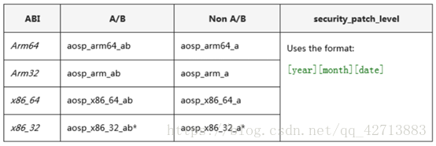

> 为了确保Vendor层实现的前向兼容性，新的Vendor层接口会由供应商测试套件 (VTS) 进行验证，该套件类似于兼容性测试套件 (CTS)。  

# 1. Overview

## 1.1. 来源
为了能更快的将设备升级到新的Android版本，Android O 开始新引入了 Project Treble，Project Treble 适用于搭载 Android O 及后续版本的所有新设备。 

(1) Android 7.x 及更早版本中没有正式的Vendor层接口，因此每次更新系统都相对耗时和困难：


(2) Android O 之后，Treble 提供了稳定的Vendor层接口，供设备制造商访问 Android 代码中特定于硬件的部分，这样就可以只更新框架层，减少升级系统带来的成本和困难：


## 1.2. 作用

为了确保Vendor层实现的前向兼容性，新的Vendor层接口会由供应商测试套件 (VTS) 进行验证，该套件类似于兼容性测试套件 (CTS)。  

<font color=green>通过 CTS 测试，确保了 APP 与 Android Framework 之间有一致的调用接口（API），这使得 APP 开发者编写的同一款程序可以运行在不同系统版本（向前兼容）、不同硬件平台、不同厂商制造的不同设备上。 

VTS 类似 CTS，通过对 Vendor Interface 进行测试，确保同一个版本的 Android Framework 可以运行在不同 HAL 上，或不同 Android Framework 可以运行在 同一个 HAL 上。</font>  

通过这样的 Framework / HAL 分离设计和接口一致性保证，也使得 8.0 版本之后的 Android 系统在进行升级时，可以直接对 Framework 进行升级而不用考虑 HAL 层的改动，从而缩短了用户手上设备得到系统升级 OTA 推送的时间。 

# 2. 环境搭建

```shell
1） 安装 Python 开发包
$ sudo apt-get install python-dev

2） 安装 Protocol Buffer 工具（协议缓冲区工具）
$ sudo apt-get install python-protobuf
$ sudo apt-get install protobuf-compiler

3） 安装 Python 虚拟环境相关工具
$ sudo apt-get install python-virtualenv
$ sudo apt-get install python-pip

4） 在设备上启用开发者模式并打开 USB 调试功能 

5） 测试的时候需要网络
```

# 3. 测试前提GSI

## 3.1. GSI介绍
<font color=green>GSI是Google AOSP System Image的简称，在进行VTS测试之前，要使用user版本关闭verified boot后刷入GSI，VTS测试用的GSI由谷歌释放。</font>



如VTS r6版本的GSI镜像：


## 3.2. GSI方法

```shell
GSI方法（先adb remount）：
1）adb reboot bootloader  		进入fastboot（或者音量键+电源键）
2）fastboot   devices  			查看识别设备 
3）fastboot   erase system_a  		擦除分区（需要userDebug版本）
4）fastboot   -w					擦除用户数据分区和缓存分区
5）fastboot   flash system_a xxx.img		刷入img
6）fastboot   reboot						重启
```

```shell
PS：在开发者选项查看oem unlocking选项是否已经解锁，如果未解锁可能是因为：
（1）不是userDebugg版本；	
（2）可以通过执行fastboot flashing unlock和fastboot oem unlock，执行命令后需要选择音量 + 来确认unlock；
```

# 4. 测试命令（同CTS相似）
1. 启动vts(测试包从源码编译或者Google Android Developer官网查找)
> ./vts-tradefed

2. 测试（跑测需要网络稳定）

```shell
全局测：  		   run  vts
模块测试： 		   run vts -m 模块名
某个测试项：	           run vts -m <模块名> -t <测试项名>
```

可用选项:
run vts -s <device_id> --logcat-on-failure --screenshot-on-failure --shard-count <shards>

+ '-s <device_id>'：可指定运行测试的设备
+ '--logcat-on-failure'：当测试失败时捕获logcat
+ '--screenshot-on-failure'：当测试失败时截取屏幕截图
+ '--shard-count <shards>'：用多个设备上同时跑测，可节省时间

3. 查看list命令

```shell
查看设备信息：		l  d
查看命令信息：		l  c
查看跑测结果：		l  r
```