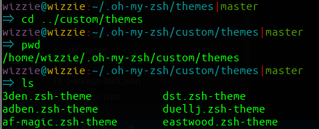

> 从`echo $SHELL`可以查看当前使用的终端是`/bin/bash`。`zsh`是Ubuntu的一种终端工具，虽然听说功能很强很给力，事实上我只是被他的众多主题迷住了。  
> 
> [具体查看文档](https://wiki.archlinux.org/index.php/Zsh_(%E7%AE%80%E4%BD%93%E4%B8%AD%E6%96%87)

# 1. 安装`zsh`

1.下载zsh

`sudo apt-get install zsh`

__Note:__

生成配置文件`/home/wizzie/.zshrc`,对应默认的文件`.bashrc`

2.下载 oh-my-zsh 项目配置 zsh

`wget https://github.com/robbyrussell/oh-my-zsh/raw/master/tools/install.sh -O - | sh`

__Note:__

生成文件夹`wizzie@wizzie:~/.oh-my-zsh`,包含所有的`zsh`主题

3.切换`zsh`模式

```shell
chsh -s /bin/zsh
//如果想切换会bash可以使用命令：
chsh -s /bin/bash

//重启电脑
reboot
```

# 2. 修改主题

1.修改`.zshrc`的`ZSH_THEME="pygmalion" #"robbyrussell"`

> [主题的文件](https://github.com/robbyrussell/oh-my-zsh/tree/master/themes/)  
> 
> [预览样式](https://github.com/robbyrussell/oh-my-zsh/wiki/Themes)

2.主题文件从`/home/wizzie/.oh-my-zsh/themes`移动到`/home/wizzie/.oh-my-zsh/custom/themes`

3.打开一个新的终端窗口，会发现主题修改成功

__例如我修改的`pygmalion`主题：__


