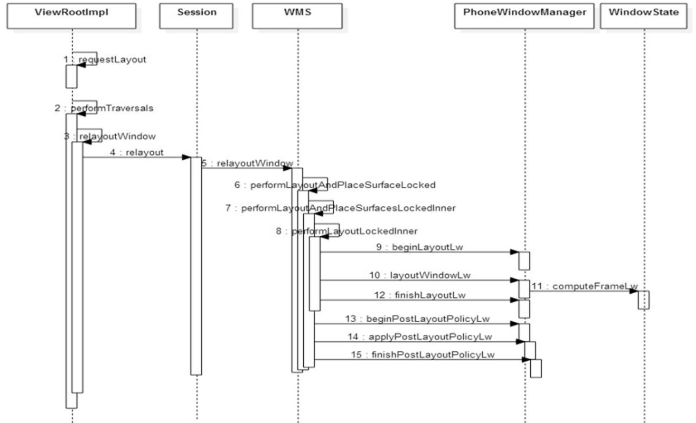
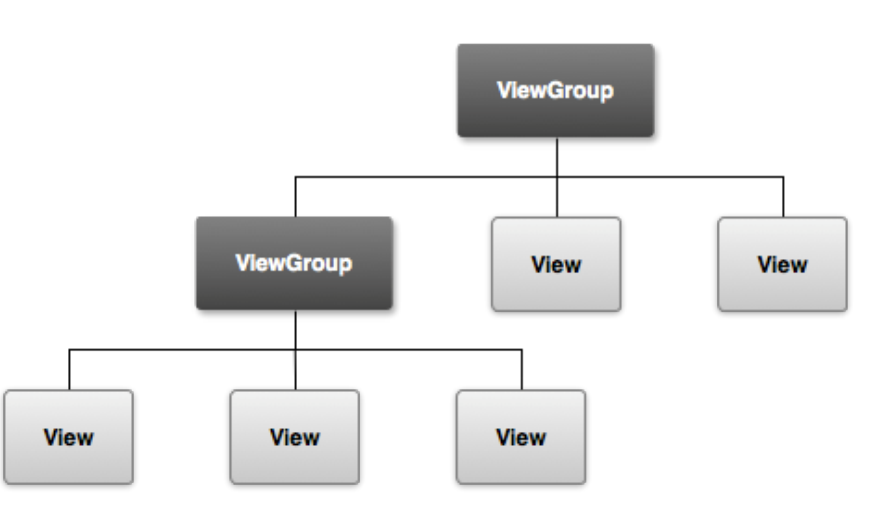
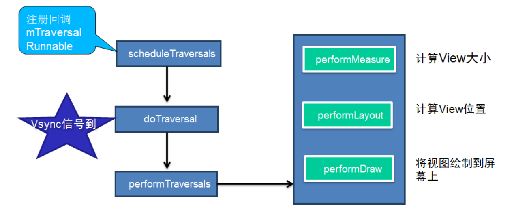
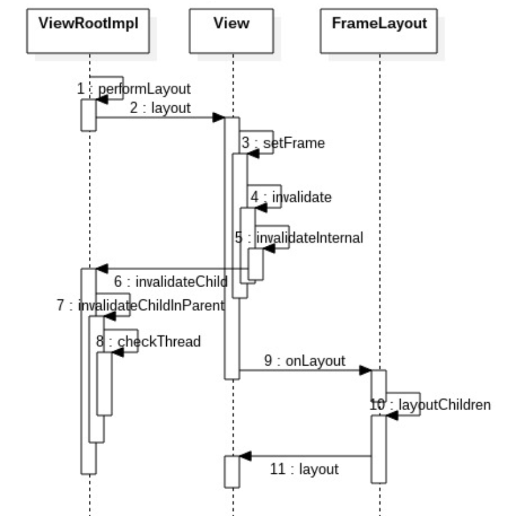
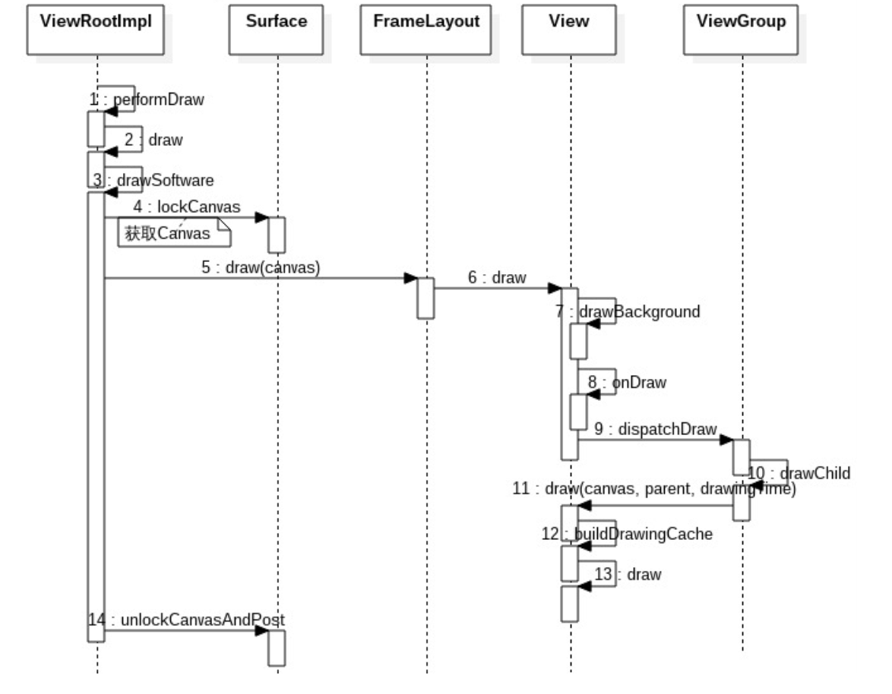

> Window 可以看做是Surface的一个包装，本质上，Window的本体就是一片Surface。将操作对象Surface，对象关联属性集以及操作方法等组合在一起便是 Window。Surface 其实是一块画布，应用可以随心所欲地通过 Canvas 或者 OpenGL 在其上作画，然后通过 SurfaceFlinger 将多块 Surface 的内容按照特定的顺序(ZOrder)进行混合并输出到 FrameBuffer，从而将 Android 漂亮的脸蛋显示给用户。既然每个窗口都有一块 Surface 供自己涂鸦，所以必然需要一个角色对所有窗口的 Surface 进行协调管理。于是,WMS 应运而生。


# 1. 概述

> 代码： http://aosp.opersys.com/xref/android-10.0.0_r2/xref/frameworks/base/core/java/android/view/
<!--more-->
**对应的关系：**

+ 1 IDirectFB (顶层) <--> N 屏幕(Screens)
+ 1 屏幕(Screen) <--> N 层(Layers)
+ 1 层(Layer) <--> 1 主表面(Primary Surface)
+ 1 层(Layer) <--> N 窗口(Windows)
+ 1 窗口(Window) <--> 1 窗口表面(Window Surface)
+ 1 表面(Surface) <--> N 子表面(Subsurfaces)

## 1.1. Dump window信息

`adb shell dumpsys window windows`

```shell
WINDOW MANAGER WINDOWS (dumpsys window windows)
  Window #0 Window{bdae67a u0 InputMethod}:
    mDisplayId=0 stackId=0 mSession=Session{2b3f00f 19539:u0a10056} mClient=android.os.BinderProxy@59092a5
    mOwnerUid=10056 mShowToOwnerOnly=true package=com.baidu.input_yijia appop=NONE
    mAttrs={(0,0)(fillxwrap) gr=BOTTOM CENTER_VERTICAL sim={adjust=pan} ty=INPUT_METHOD fmt=TRANSPARENT wanim=0x1030056
      fl=NOT_FOCUSABLE LAYOUT_IN_SCREEN SPLIT_TOUCH HARDWARE_ACCELERATED DRAWS_SYSTEM_BAR_BACKGROUNDS}
    Requested w=1080 h=2280 mLayoutSeq=207584
    mIsImWindow=true mIsWallpaper=false mIsFloatingLayer=true mWallpaperVisible=false
    mBaseLayer=141000 mSubLayer=0 mAnimLayer=0+=0 mLastLayer=0
    mToken=WindowToken{92f628b android.os.Binder@c12205a}
    mViewVisibility=0x8 mHaveFrame=true mObscured=false
......

```

可以列出当前系统中存在的所有窗口。查看下该命令的输出可以发现Android是一个同时存在着多个窗口的系统。比如 StatusBar、NavigationBar、Activity、InputMethod、WallPaper 等窗口都可能同时存在。因为同时有多个窗口各自为政，所以需要 WMS 作为管理者来协调，以便窗口们能在狭窄的显示屏幕上和睦相处。

作为协调者，WMS的本职工作主要是负责管理各窗口的生命周期（创建/销毁）、各窗口的位置大小（Layout）、各窗口的显示层级（Z-order）以及窗口的显示属性（可见性等）。

***

# 2. 相关类

+ DisplayContent：一个容器，一个 DisplayContent 内收集了所有需要显示到相应屏幕上的窗口
+ PhoneWindowManager：定义了 Phone 相关的窗口策略，负责为 WMS 提供各种建议，包括布局，事件处理，屏幕旋转等
+ WindowAnimator WindowStateAnimator AppWindowAnimator： 主要负责 Surface 相关操作，包括创建，销毁，Surface 属性变更，动画等
+ WindowToken AppWindowToken： WindowToken 的作用是将一组相关性紧密的窗口组织在一起。达到批量管理的效果
+ WindowState： 一般被认为是 WMS 眼中的窗口，管理着关联窗口的所有属性状态信息
+ AppWindowToken 根据 AMS 侧 Activity 的顺序有序排列，WindowState 根据 Layer 值有序排列。


## 2.1. WMS添加窗口流程（addView）

WindowManagerGlobal，是一个进程唯一的实例，也就是说无论在应用的任何角落调用addView，都会通过WindowManagerGlobal 来处理相应的请求。从理解出发，可以认为`WindowManagerGlobal`是一个App进程中窗口管理者。


```java
//frameworks/base/core/java/android/view/WindowManagerImpl.java
    @Override
    public void addView(@NonNull View view, @NonNull ViewGroup.LayoutParams params) {
        applyDefaultToken(params);
        mGlobal.addView(view, params, mContext.getDisplay(), mParentWindow);
    }
```

调用WindowManagerGlobal的addView函数：

```java
//frameworks/base/core/java/android/view/WindowManagerGlobal.java
         Display display, Window parentWindow) {
        if (view == null) {
            throw new IllegalArgumentException("view must not be null");
        }
        if (display == null) {
            throw new IllegalArgumentException("display must not be null");
        }
        if (!(params instanceof WindowManager.LayoutParams)) {
            throw new IllegalArgumentException("Params must be WindowManager.LayoutParams");
        }

        final WindowManager.LayoutParams wparams = (WindowManager.LayoutParams) params;
        if (parentWindow != null) {
            parentWindow.adjustLayoutParamsForSubWindow(wparams);
        } else {
            // If there's no parent, then hardware acceleration for this view is
            // set from the application's hardware acceleration setting.
            final Context context = view.getContext();
            if (context != null
                    && (context.getApplicationInfo().flags
                            & ApplicationInfo.FLAG_HARDWARE_ACCELERATED) != 0) {
                wparams.flags |= WindowManager.LayoutParams.FLAG_HARDWARE_ACCELERATED;
            }
        }

        ViewRootImpl root;
        View panelParentView = null;

        synchronized (mLock) {
            // Start watching for system property changes.
            if (mSystemPropertyUpdater == null) {
                mSystemPropertyUpdater = new Runnable() {
                    @Override public void run() {
                        synchronized (mLock) {
                            for (int i = mRoots.size() - 1; i >= 0; --i) {
                                mRoots.get(i).loadSystemProperties();
                            }
                        }
                    }
                };
                SystemProperties.addChangeCallback(mSystemPropertyUpdater);
            }

            int index = findViewLocked(view, false);
            if (index >= 0) {
                if (mDyingViews.contains(view)) {
                    // Don't wait for MSG_DIE to make it's way through root's queue.
                    mRoots.get(index).doDie();
                } else {
                    throw new IllegalStateException("View " + view
                            + " has already been added to the window manager.");
                }
                // The previous removeView() had not completed executing. Now it has.
            }

            // If this is a panel window, then find the window it is being
            // attached to for future reference.
            if (wparams.type >= WindowManager.LayoutParams.FIRST_SUB_WINDOW &&
                    wparams.type <= WindowManager.LayoutParams.LAST_SUB_WINDOW) {
                final int count = mViews.size();
                for (int i = 0; i < count; i++) {
                    if (mRoots.get(i).mWindow.asBinder() == wparams.token) {
                        panelParentView = mViews.get(i);
                    }
                }
            }
            //新疆一个ViewRootImpl对象，调用构造函数
            root = new ViewRootImpl(view.getContext(), display);
            //布局参数
            view.setLayoutParams(wparams);

            mViews.add(view);
            mRoots.add(root);
            mParams.add(wparams);

            // do this last because it fires off messages to start doing things
            try {
                root.setView(view, wparams, panelParentView); //调用setView函数
            } catch (RuntimeException e) {
                // BadTokenException or InvalidDisplayException, clean up.
                if (index >= 0) {
                    removeViewLocked(index, true);
                }
                throw e;
            }
        }
    }
```

setView做了很多处理，主要的是调用`requestLayout()和 mWindowSession.addToDisplay`。见下面：

## 2.2. addWindow

```java
//frameworks/base/core/java/android/view/ViewRootImpl.java
 public void setView(View view, WindowManager.LayoutParams attrs, View panelParentView) {
        synchronized (this) {
            if (mView == null) {
                mView = view;

                mAttachInfo.mDisplayState = mDisplay.getState();
                mDisplayManager.registerDisplayListener(mDisplayListener, mHandler);
                ......
                  try {
                    mOrigWindowType = mWindowAttributes.type;
                    mAttachInfo.mRecomputeGlobalAttributes = true;
                    collectViewAttributes();
                    //添加到Display
                    res = mWindowSession.addToDisplay(mWindow, mSeq, mWindowAttributes,
                            getHostVisibility(), mDisplay.getDisplayId(), mTmpFrame,
                            mAttachInfo.mContentInsets, mAttachInfo.mStableInsets,
                            mAttachInfo.mOutsets, mAttachInfo.mDisplayCutout, mInputChannel,
                            mTempInsets);
                    setFrame(mTmpFrame);
                } catch (RemoteException e) {
                    mAdded = false;
                    mView = null;
                    mAttachInfo.mRootView = null;
                    mInputChannel = null;
                    mFallbackEventHandler.setView(null);
                    unscheduleTraversals();
                    setAccessibilityFocus(null, null);
                    throw new RuntimeException("Adding window failed", e);
                } finally {
                    if (restore) {
                        attrs.restore();
                    }
                }
                .....
```

这里出现了mWindowSession，它的类型是 IWindowSession，是WindowManagerGlobal#sWindowSession的一个引用，进程唯一的实例。

它是常见的Binder远程调用中IWindowSession的Bp端，Bn端是一个Sessio 实例，存在于WMS所属进程，Session代表了WMS关于窗口管理服务的一个子集，Android 系统中，由App进程端主动向WMS发起的请求，都是通过mWindowSession进行的，也就是说Session提供了所有App进程能够请求WMS的服务请求。

调用到实现类`Session.java`:

```java
//frameworks/base/services/core/java/com/android/server/wm/Session.java
    public int addToDisplay(IWindow window, int seq, WindowManager.LayoutParams attrs,
            int viewVisibility, int displayId, Rect outFrame, Rect outContentInsets,
            Rect outStableInsets, Rect outOutsets,
            DisplayCutout.ParcelableWrapper outDisplayCutout, InputChannel outInputChannel,
            InsetsState outInsetsState) {
        return mService.addWindow(this, window, seq, attrs, viewVisibility, displayId, outFrame,
                outContentInsets, outStableInsets, outOutsets, outDisplayCutout, outInputChannel,
                outInsetsState);
    }
```

最终调用到`WMS.java`的addWindow函数。**addWindow的工作可以分为4步：**

+ WindowToken 检查
+ WindowState 创建
+ 将新建的 WindowState 插入到现有的 WindowState 有序列表里
+ 给系统中现有的所有 WindowState 重新分配 Layer

```java
 public int addWindow(Session session, IWindow client, int seq,
            LayoutParams attrs, int viewVisibility, int displayId, Rect outFrame,
            Rect outContentInsets, Rect outStableInsets, Rect outOutsets,
            DisplayCutout.ParcelableWrapper outDisplayCutout, InputChannel outInputChannel,
            InsetsState outInsetsState) {
        int[] appOp = new int[1];
        int res = mPolicy.checkAddPermission(attrs, appOp);
        if (res != WindowManagerGlobal.ADD_OKAY) {
            return res;
        }

        boolean reportNewConfig = false;
        WindowState parentWindow = null;
        long origId;
        final int callingUid = Binder.getCallingUid();
        final int type = attrs.type;
......
```

***

## 2.3. relayoutWindow



Surface outSurface：输出参数，用于承载该窗口的 Surface，ViewRootImpl 获得此 Surface 便可以调用`Draw`在上面进行**绘制窗口所承载的所有View**。

关于 relayoutWindow 的处理内容粗略分为下列：

+ 根据传入参数更新 WindowState 对象的对应属性，这些属性都会在布局的时刻用到。
+ 根据传入的可见性参数处理窗口 Surface 的创建或销毁
+ 处理一些由窗口更新带来的一些变化，如 Focus 变化，输入法窗口/壁纸窗口移动，屏幕构型 Configuration 改变等
+ 执行 performLayoutAndPlaceSurfaceLocked 函数进行布局

***

# 3. View概述

`View`就是一块可以用来进行绘画，可以处理输入事件进行交互的矩形区域，而`ViewGroup`就是一种可以容纳View的矩形容器。

从设计模式的角度看，ViewGroup 和 View 是组合模式的典型应用。View 是基本的控件元素，ViewParent 接口定义了添加、删除 View 的接口 addView、removeView，ViewGroup 实现了 ViewParent 的接口，因此可以作为 View 的容器管理 View，同时 ViewGroup 又继承自 View，可以被其他的 ViewGroup 管理。这样 ViewGroup 和 View 就可以组成上面的树状结构了。



应用程序启动的过程中，会加载一个或者多个 Activity。每个 Activity 对应一个 PhoneWindow。当Activity在onCreate方法中调用 setContentView 的时候，PhoneWindow 会根据布局文件，创建 View 树，同时，根据应用的一些参数设置，得到集合了窗口显示特性的 View 树的根节点 mDecor 。WindowManagerGlobal 会通过数组记录一个应用程序对应的所有 View 树的根节点 mDecor，布局参数，以及对应的 ViewRootImpl。同时，将 mDecor 和布局参数传递给 ViewRootImpl。ViewRootImpl中实现对 View 树的整体控制，包括与 WMS 的通信，View 的描绘处理，输入事件的分发处理等。

**View 的结构图如下：**


## 3.1. 基本元素

+ View ：最基本的UI组件，表示屏幕上的一个矩形区域
+ Window ：1〉 表示顶层窗口，管理界面的显示和事件的响应；2 〉每个Activity均会创建一个PhoneWindow对象，是Activity和整个View系统交互的接口。该Window在Activity的attach方法中通过调用`PolicyManager.makeNewWindow`创建；
+ DecorView ：是Window中view的RootView
+ WindowManager ：1〉 主要用来管理窗口的一些状态、属性、view 增加、删除、更新、窗口顺序、消息收集和处理等 2〉interface，继承自ViewManager。所在应用进程的窗口管理器；3〉实现类 WindowManagerImpl
+ ViewRootImpl：1 〉界面控制和消息响应；2 〉通过IWindowSession接口与全局窗口管理器WMS进行交互
+ ActivityThread：1〉 应用程序的主线程，其中会创建关联当前 Activity 与 Window；2〉创建 WindowManager 实现类实例，把当前 DecoView 加入到 WindowManager

## 3.2. View处理简单流程

### 3.2.1. VSYNC

VSYNC 信号，即 vertical synchronization，可以理解为垂直同步，或者帧同步。是 Android4.1 为了解决 UI 不流畅问题而引入的处理。当需要同步信号的时候，通过 Choreographer 注册回调，等到 VSYNC信号到来的时候，执行相应的回调。这样，一方面可以避免频繁更新导致的画面不流程；另一方面，因为 SYNC 信号的频率大概是 60 次/秒，即可以保证帧率 60，显示效果非常平滑。



由上图可见，View 的描绘工作，是在 performTraversals 中完成的。主要分为三步：
1. performMeasure，负责计算View的尺寸；
2. performLayout，负责计算 View 在界面上的位置；
3. performDraw，根据前面两步的计算结果，完成实际的描绘工作。

## 3.3. performTraversals触发描绘处理

View 的描绘是通过 performTraversals 发起的，所以任何调到 performTraversals 的地方，都会触发描绘处理。
1. ViewRootImpl 中初次添加 View:自上而下发起遍历。
2. 应用主动调用 requestLayout:自下而上通过 mParent 调用父节点的 requestLayout，直至 ViewRootImpl。
3. 应用主动调用 invalidate:自下而上通过 mParent 调用父节点的 invalidateChild，直至 ViewRootImpl。
4. 其他情况：如应用程序的 Visibility 发生变化的时候，LayoutParams 发生变化的时候等，都会触发遍历操作。

## 3.4. performMeasure（测量）


```java
//frameworks/base/core/java/android/view/ViewRootImpl.java
    private void performMeasure(int childWidthMeasureSpec, int childHeightMeasureSpec) {
        if (mView == null) {
            return;
        }
        Trace.traceBegin(Trace.TRACE_TAG_VIEW, "measure");
        try {
            mView.measure(childWidthMeasureSpec, childHeightMeasureSpec);
        } finally {
            Trace.traceEnd(Trace.TRACE_TAG_VIEW);
        }
    }

```

```java
//frameworks/base/core/java/android/view/View.java
 public final void measure(int widthMeasureSpec, int heightMeasureSpec) {
        boolean optical = isLayoutModeOptical(this);
        if (optical != isLayoutModeOptical(mParent)) {
            Insets insets = getOpticalInsets();
            int oWidth  = insets.left + insets.right;
            int oHeight = insets.top  + insets.bottom;
            widthMeasureSpec  = MeasureSpec.adjust(widthMeasureSpec,  optical ? -oWidth  : oWidth);
            heightMeasureSpec = MeasureSpec.adjust(heightMeasureSpec, optical ? -oHeight : oHeight);
        }
        ......
         if (forceLayout || needsLayout) {
            // first clears the measured dimension flag
            mPrivateFlags &= ~PFLAG_MEASURED_DIMENSION_SET;

            resolveRtlPropertiesIfNeeded();

            int cacheIndex = forceLayout ? -1 : mMeasureCache.indexOfKey(key);
            if (cacheIndex < 0 || sIgnoreMeasureCache) {
                // measure ourselves, this should set the measured dimension flag back
                onMeasure(widthMeasureSpec, heightMeasureSpec);   //调用onMeasure函数
                mPrivateFlags3 &= ~PFLAG3_MEASURE_NEEDED_BEFORE_LAYOUT;
            } else {
                long value = mMeasureCache.valueAt(cacheIndex);
                // Casting a long to int drops the high 32 bits, no mask needed
                setMeasuredDimensionRaw((int) (value >> 32), (int) value);
                mPrivateFlags3 |= PFLAG3_MEASURE_NEEDED_BEFORE_LAYOUT;
            }

            // flag not set, setMeasuredDimension() was not invoked, we raise
            // an exception to warn the developer
            if ((mPrivateFlags & PFLAG_MEASURED_DIMENSION_SET) != PFLAG_MEASURED_DIMENSION_SET) {
                throw new IllegalStateException("View with id " + getId() + ": "
                        + getClass().getName() + "#onMeasure() did not set the"
                        + " measured dimension by calling"
                        + " setMeasuredDimension()");
            }

            mPrivateFlags |= PFLAG_LAYOUT_REQUIRED;
        }
        ......
```

```java
  protected void onMeasure(int widthMeasureSpec, int heightMeasureSpec) {
        setMeasuredDimension(getDefaultSize(getSuggestedMinimumWidth(), widthMeasureSpec),
                getDefaultSize(getSuggestedMinimumHeight(), heightMeasureSpec));
    }
```

## 3.5. performLayout（布局）



## 3.6. performDraw（硬件渲染）

> performDraw调用draw，完成绘制工作。实际绘制操作可以分为硬件渲染和软件渲染两种情况。

### 3.6.1. Step1. `ViewRootImpl.setView`

当mSurfaceHolder为空，也就是说应用不会要求自己接管对窗口的渲染的情况下，才会开始硬件渲染环境的准备。

### 3.6.2. Step2. ViewRootImpl.enableHardwareAcceleration

```java
//frameworks/base/core/java/android/view/ViewRootImpl.java
  public void setView(View view, WindowManager.LayoutParams attrs, View panelParentView) {
        synchronized (this) {
          ......
  // If the application owns the surface, don't enable hardware acceleration
                if (mSurfaceHolder == null) {
                    // While this is supposed to enable only, it can effectively disable
                    // the acceleration too.
                    enableHardwareAcceleration(attrs);
                    final boolean useMTRenderer = MT_RENDERER_AVAILABLE
                            && mAttachInfo.mThreadedRenderer != null;
                    if (mUseMTRenderer != useMTRenderer) {
                        // Shouldn't be resizing, as it's done only in window setup,
                        // but end just in case.
                        endDragResizing();
                        mUseMTRenderer = useMTRenderer;
                    }
                }
```

1. 常驻内存的进程，禁止使用硬件加速，因为非常耗费内存。
2. 系统进程一般都要禁用硬件加速，但是以下两种情况除外：

(1) 应用启动之前的`Starting Window`，会通过设置以下flag，**标示启用硬件加速**，但是不缓存：

`WindowManager.LayoutParams.PRIVATE_FLAG_FAKE_HARDWARE_ACCELERATED`

(2) 锁屏界面，虽然是在系统进程中，但是通过设置以下 flag，可以启用硬件加速：

`WindowManager.LayoutParams.PRIVATE_FLAG_FORCE_HARDWARE_ACCELERATED`

其他情况，根据 Activity 窗口是否请求硬件加速渲染决定是否开启硬件加速。通过判断flags位

`WindowManager.LayoutParams.FLAG_HARDWARE_ACCELERATED`被置为1，同时硬件支持硬件加速，就可以继续后面的初始化工作了。

### 3.6.3. Step3: ThreaedRenderer.create

设备支持 Open GL ES2.0，就创建对象：ThreadedRender。

1. 通过 nCreateRootRenderNode 在 Native 层创建一个 Render Node。
2. 通过 adopt 方法，将 Native 层的 Render Node 封装成 Java 层的 Render Node。
3. 通过 nCreateProxy 在 Native 层创建一个 Render Proxy 对象。该proxy对象以后负责从Main Thread向RenderThread发送命令。

RenderProxy 有三个重要的成员变量：
1. mRenderThread：进程单例，指向 RenderThread 对象，通过它可以向 RenderThread 线程发送命令。
2. mContext：画布上下文。RenderThread 通过它完成渲染工作。
3. mDrawFrameTask：指向一个 DrawFrameTask 对象，Main thread 通过它向 Render Thread 线程发送渲染下一帧的命令。

### 3.6.4. Step4：ViewRootImpl.performTraversals

当得到了有效的surface，就通过ThreadedRender的initialize方法，将该surface与RenderThread绑定。

***

### 3.6.5. 硬件渲染流程图


**ThreadedRender.draw主要执行三个操作：**
1. 调用成员函数 updateRootDisplayList 构建或者更新应用程序窗口的 Root Render Node 的 DisplayList。**RenderNode.start 和 RenderNode.end 直接的处理，与软件渲染的流程一样，只是硬件渲染的时候，只把渲染命令存储到 DisplayList 中，并不真正开始执行渲染操作。**
2. 调用成员函数 registerAnimationRenderNode 注册应用程序窗口动画相关的 Render Node 到 native 层。这些RenderNode是用于描述当前窗口设置的动画。
3. 调用成员函数 nSyncAndDrawFrame，通知Render Thread绘制下一帧。其具体实现在 navtive 层。通DrawFrameTask 向 RenderThread 的 task Queue 抛出一个消息，等待 RenderThread 在合适的时候唤醒。

***

## 3.7. 软件渲染

在 ViewRootImpld 的 draw()如果不进行硬件渲染，会进行软件渲染`drawSoftware()`

### 3.7.1. Step1. ViewRootImpl.Draw

1. 计算窗口是否处于滚动状态。
2. 计算 dirty 区域，也就是需要重绘的区域。
3. Dirty 区域不为空，或者动画进行中，继续判断是否选择了硬件加速，如果没有使用硬件加速，则通过 drawSoftware（）发起软件渲染。
4. 如果动画执行过程中，发起下一次轮询。

```java
//frameworks/base/core/java/android/view/ViewRootImpl.java
   private boolean draw(boolean fullRedrawNeeded) {
        Surface surface = mSurface;
        ......
                if (!drawSoftware(surface, mAttachInfo, xOffset, yOffset,
                        scalingRequired, dirty, surfaceInsets)) {
                    return false;
                }
                ......
```

### 3.7.2. Step2. ViewRootImlp.drawSoftware

通过 lockCanvas()获取画布。

### 3.7.3. Step3. Framelayout.draw(Canvas)

ViewRootImpl 中，通过 mView.draw(canvas)，调用 DecorView 的 draw 方法；DecorView 通过 super.draw(canvas)，调用父类 Framlayout 的 Draw 方法。

在 FrameLayout 中，通过 super.draw(canvas)方法，调用 View.draw 方法，触发实际的描绘处理。

### 3.7.4. Step4. View.draw

1. 描绘背景。如果 PFLAG_DIRTY_OPAQUE 被设置，并且 mAttachInfo.mIgnoreDirtyState=flase，说明有不透明子view遮挡了当前的 view，不需要绘制背景。
2. 保存当前画布的堆栈状态，并且创建额外的图层描绘当前视图滑动时的边框渐变效果。FADING_EDGE_VERTICAL 和FADING_EDGE_HORIZONTAL 都没有被设置的时候，不需要执行这步操作。
3. 通过 onDraw 调用子类描绘处理，完成当前视图的描绘。
4. 通过 dispatchDraw 调用子视图的描绘处理。
5. 绘制边框的渐变效果（与步骤 2 对应），并且恢复图层。此步骤不是必需的。
6. 如果需要显示滚动条，通过 onDrawScrollBars 调用描绘滚动条。

### 3.7.5. Step5. ViewGroup.dispatchDraw

1. `FLAG_RUN_ANIMATION`被设置，并且允许显示子视图的动画，则通过 bindLayoutAnimation 设置动画。设置完成后，通过LayoutAnimationController 的对象来启动动画，并且调用 mAnimationListener 的 onAnimationStart()来通知动画监听，当前视图开始显示动画了。
2. 如果子视图可见或者有动画需要显示，就通过方法 drawChild 实现子视图的绘制。
3. 如果动画结束，通过notifyAnimationListener发送消息，通知动画监听者，动画已经结束。

### 3.7.6. Step6. ViewGroup.drawChild

调用子 view 的 draw(Canvas, ViewGroup,long)方法，实现子视图的绘制。

### 3.7.7. Step7. View.draw(Canvas, ViewGroup, long)

1. 通过方法`drawAnimation`实现动画的绘制。
2. 通过flag检查子视图是否支持缓冲方式绘制。即将子视图缓冲到一个Bitmap中，后续可以通过getDrawingCache获得该bitmap。
3. 以非缓冲的方式绘制：检查 SKIP_DRAW 标记是否被置位，如果为 1，则跳过当前视图的绘制，调用 ViewGroup 的dispatchDraw，重复前面过程，继续该视图的子视图的绘制；否则，通过调用 View.draw(Canvas)，重复 step4 的过程，完成当前视图的绘制以后，再发起子视图的绘制。
4. 以缓冲的方式绘制：通过 canvas.drawBitmap()将上次缓冲的 Bitmap 对象 cache 绘制到画布上。

### 3.7.8. Step8. ViewRootImpl.drawSoftware

循环上面的过程，直到所有子视图都被绘制到画布上，返回 drawSoftware 方法。

通过 surface.unlockCanvasAndPost()方法，请求 SurfaceFlinger 服务渲染这块画布到图形缓冲区。

### 3.7.9. 软件渲染流程图


