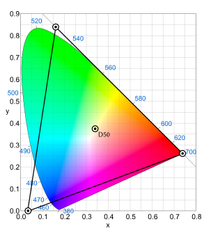

> Android色彩空间类型概述，包含广色域WCG、sRGB、Adobe RGB、ProPhoto RGB、DCI-P3、Display P3

# 1. 色彩空间`Color Space`

## 1.1. 广色域`WCG`

WCG（Wide Color Gamut），是Adobe System开发的一种RGB色彩空间，使用纯光谱原色提供较大的色域。与Adove RGB和sRGB相比，能够存储更大范围的颜色值。**相比之下，WCG包含`CIELAB色彩空间`可见颜色的77.6%，而Adobe RGB色彩空间仅覆盖52.1%，sRGB仅覆盖35.9%。**

**Note：**
`CIELAB色彩空间`（也称为CIE L*a*b，抑或Lab色彩空间），是国际照明委员会（CIE）于1976年定义的色彩空间。它将色彩表示为三个值：

符号|释义
:-:|:-:
`L*`|为从黑色（0）到白色（100）的亮度
`a*`|为从绿色（-）到红色（+）的亮度
`b*`|为从蓝色（-）到黄色（+）的亮度

CIELAB被设计为从这些值中相同数量的数字变化对应于大致相同数量的视觉感知变化。

***

## 1.2. sRGB色彩空间

sRG色彩空间是惠普和微软于1996年一起开发的用于显示器、打印机、因特网的一种标准RGB色彩空间。最初的目的是作为生成在因特网以及万维网上浏览的图像的通用色彩空间，最后选择的是使用`Gamma校准`（伽马）系数为2.2的色彩空间，即CRT显示器在这种情况下的平均线性电压响应。

sRGB定义了红色、绿色、蓝色三原色的颜色（又称三基色，用于电视机、投影仪等显示设备，对应RGB），即在其他两种颜色值都为零时该颜色的最大值。在`CIE xy`（Lab色彩空间）坐标系中坐标如下表。对于任何RGB色彩空间来说，非负的R、G、B都不可能表示超出原色定义的三角形即色域范围，它刚好在人眼的色彩感知范围之内。

颜色|X|Y
:-:|:-:|:-:
红色|0.6400|0.3300
绿色|0.3000|0.6000
蓝色|0.1500|0.0600
白色（D65）|0.3127|0.3290

sRGB定义了原色强度与实际保存的数值之间的非线性变化，曲线类似于CRT显示器的伽马响应。这个非线性变化意味着sRGB非常搞笑的使图像文件中的整数值标识了人眼可以分辨的颜色。

但是由于它的色域不够大，尤其是蓝绿颜色色域无法表示SMYK印刷中的所有颜色。所以印刷行业的经常使用的是Adobe RGB色彩空间。

**Note:**
伽马校正（伽马非线性变化、伽马编码），是用来正对影片或者影像系统里对于管线的辉度或者三色刺激值所进行非线性的运算或反运算。

***

## 1.3. Adobe RGB色彩空间

Adobe RGB色彩空间是一种由Adobe System于1998年开发的色彩空间。开发的目的是为了尽可能在`CMYK彩色印刷`中利用计算机显示器等设备的RGB颜色模式上囊括的更多的颜色。

在Adobe RGB标准中，色彩被指定为`（R,G,B）`三个组员，其中R，G，B每个的值介于0和1之间。但在显示器显示出来时，白色点(1,1,1)，黑色点（0,0,0），原色点（1,0,0）的准确值会被指定。

与sRGB相比，Adobe RGB中的RGB色彩分量和亮度并不是呈线性关系，他的伽马值是`563/256结果是2.19921875`。并且三原色点坐标只有绿色坐标不同。

颜色|X|Y
:-:|:-:|:-:
红色|0.6400|0.3300
绿色|0.2100|0.7100
蓝色|0.1500|0.0600
白色（D65）|0.3127|0.3290

***

## 1.4. ProPhoto RGB色彩空间

ProPhoto RGB色彩空间（抑或ROMM RGB色彩空间），专为摄影输出所开发设计。该色彩空间的色域十分宽裕，甚至包含`CIE Lab色彩空间`中90%以上的表面色彩和1980年Poniter所记录的可能出现的表面色彩。**该色域的表现范围甚至比WCG色彩空间还要大**

标准参考白点由`CIE标准光源D50`的色度决定。

颜色|X|Y
:-:|:-:|:-:
红色|0.7347|0.2653
绿色|0.1596|0.8404
蓝色|0.0366|0.0001
白色（D50）|0.3457|0.3585

缺点是该色彩空间包含大约13%的通常不存在色彩。
***

## 1.5. DCI-P3色彩空间

DCI-P3（抑或DCI/P3）是美国电影行业推出的一种色彩空间。在CIE 1931xy色彩空间中，覆盖了45.5%的全色于和86.9%的常见色域。在CIE 1976uv色度图覆盖率分别是41.7%和85.5%。

DCI-P3将来应该会在电视系统和家庭影院领域有更广泛的应用。

颜色|X|Y
:-:|:-:|:-:
红色|0.6800|0.3200
绿色|0.2650|0.6900
蓝色|0.1500|0.0600
白色（D65）|0.3127|0.3290

***

## 1.6. Display P3色彩空间

Display P3使用DCI-P3的原色，但是使用D65白点，这在计算机显示色彩空间中（sRGB,AdobeRGB都使用D65）更为常见。和DCI-P3的纯伽马曲线不同。Display-P3使用sRGB曲线。

***

# 2. Android中启用/禁止WCG功能

## 2.1. APP获取设备是否支持WCG

APP通过以下两种API来决定设备是否支持WCG：

1. `android.content.res.Configuration::isScreenWideColorGamut`：如果display和设备能够支持WCG则返回true。
2. `android.view.Display::isWideColorGamut()`：返回显示display设备是否可用于WCG显示。这个并不意味着设备自己可以渲染WCG内容。
