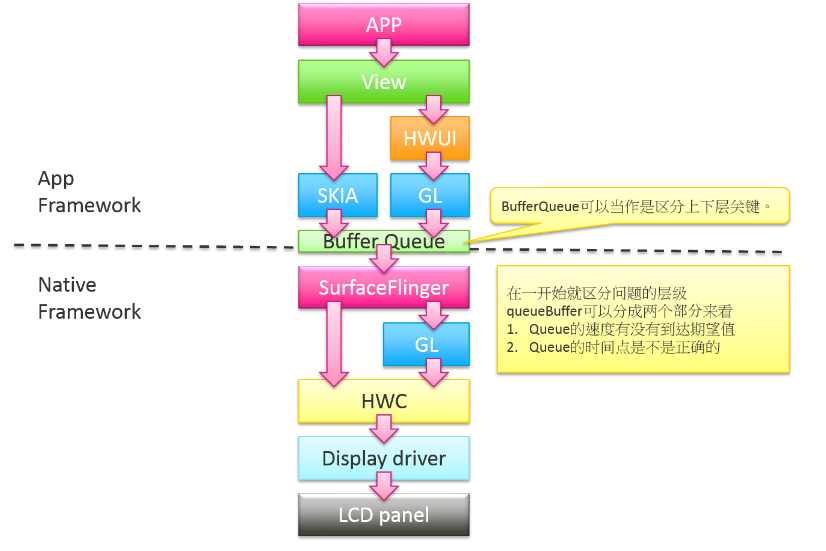
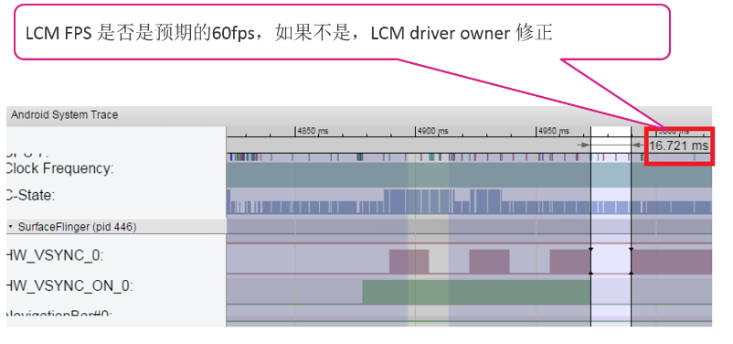
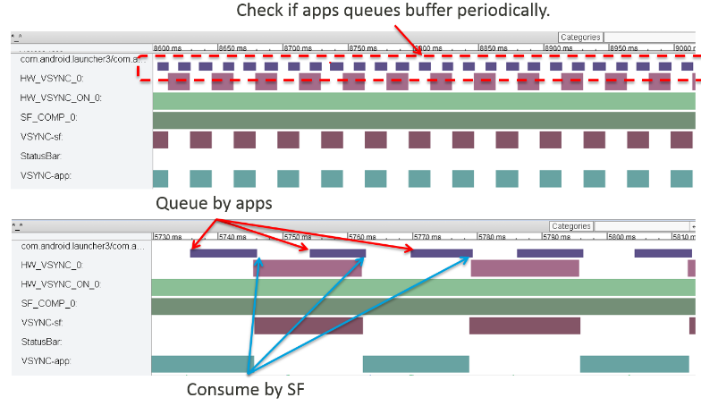
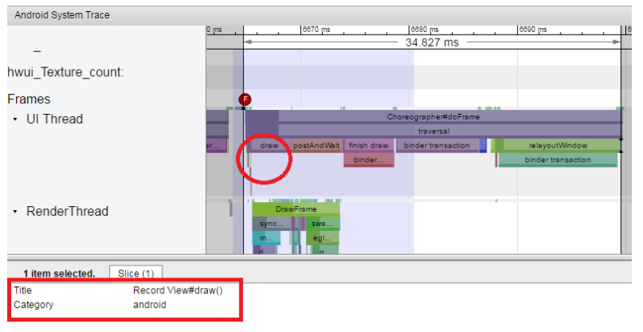
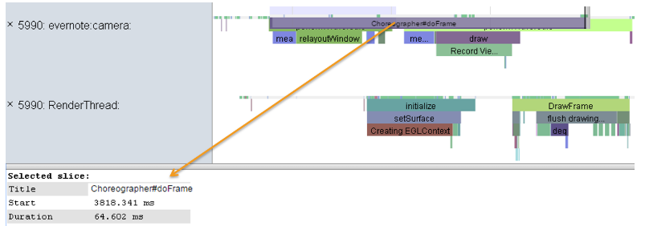
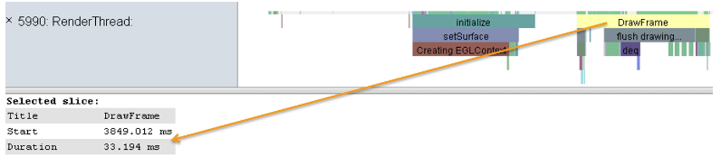
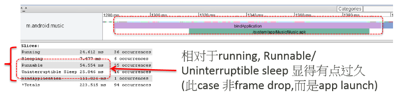
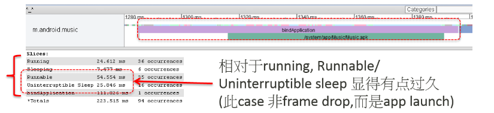
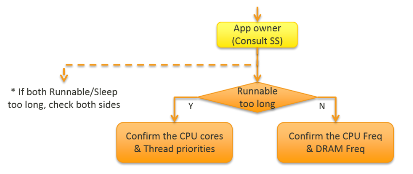
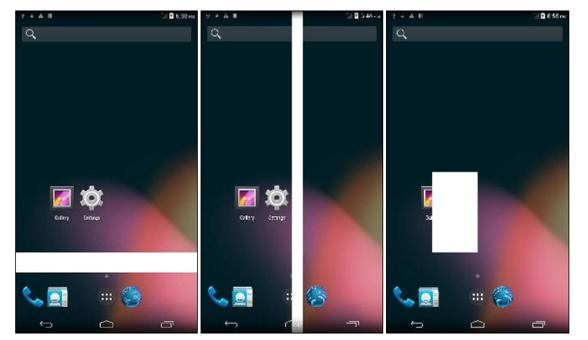

> 主要内容如何分析抓取到的systrace

# 1. UI流畅平滑的systrace

## 1.1. Systrace获取

Android\Sdk\platform-tools\systrace

systrace.py：
`python systrace.py --time=10 -o trace.html gfx input view webview wm am sm audio video hal  res dalvik bionic power pm ss pdx sched freq idle load  binder_driver binder_lock`

默认Tag with: `sched freq idle res ss gfx input view am`

<!--more-->
常用：
`./systrace -t 3 -b 10240 -o test.html sched freq idle res ss gfx input view am hal power wm`

## 1.2. 需要开的Tag

需求|tags
:-:|:-:
cpu信息|sched/freq/idle
测试列表滑动，桌面滑动等流畅性问题|gfx/view/input/hwui
测试app launch，点击某个应用，点击进入某个界面|gfx/view/input/dalvik/disk
怀疑有power问题（亮灭屏，电量相关）|gfx/view/input/res/am/wm/power

## 1.3. time和buffer size

一般我给的是`-t 3 -b 8000`

+ 如果抓5s，-b可以给20480（kb）
+ 如果时间再长，-b可以给30720（kb）

## 1.4. 视频获取

`动画过程`:指手机画面开始动的前一帧到画面停止动(完全显示，最后一帧)的过程，所以动画过程时间，依据动画不同，记录的时间也会不同。
在播放高清视频时，影格数就表示画面所更新的次数，需要仔细观察视频画面。其中一影格就是手机更新画面时动一次，一般在fps为60的平台上，通常是一帧画面就会动一次，也就是一影格，而对于fps为30的平台，通常是两帧表示一影格。

`FPS`:表示每秒刷新的帧数，是画面流畅性的一个重要指标,那它是如何计算出来的呢（影格数除以动画时间）

`FPS`:特定的区段时间内,每秒平均更新画面的次数。

+ 数值的高低不能代表画面的流畅度
+ 流畅度还是会跟画面的内容有关系（例如分辨率）

**目前常用的FPS计算方法：**

+ systrace所录到的`queuebuffer`个数计算区段时间内的刷新次数
+ 高速摄影机在区段时间内的刷新次数

从绘图流程的角度来看,这些FPS的意义是类似的：
如果只有单一图层更新的情况,表示从`APP画图`到`display显示`的频率。

常见`FPS TestCase`：

1. App 界面滑动换页的流畅性
2. browser浏览网页的流畅性
3. 包含列表控件(list menu)界面卷动的流畅性
4. Contact list界面卷动的流畅性
5. Launch app 过场动画流畅性
6. Status bar下拉的流畅性

# 2. systrace查看绘制过程是否有问题（FPS）

如图：

1. 首先查看VSYNC周期是否正常，是否有进行vsync tunning；
2. 查看是否queuebuffer成功？ 绘制之前调用dequeuebufffer从BufferQueue获取一个buffer，绘制完成会调用queuebuffer放回BufferQueue。

+ 如果正常queuebufffer,则查看SF合成
+ 如果queuebufffer不正常，则查看是否是queuebuffer阻塞？
+ + 如果queuebuffer阻塞，则看GPU
+ + 若不是，查看HWUI绘制是否成功？

3. 如果HWUI没有绘制，则检查UIThread（UI线程）

+ 如果UIThread调用了runnable，则查看SS（不清楚具体表示什么？）
+ 如果skia耗费太长时间，则查看skia的代码（绘制API）
+ 如果是view耗费太长时间，则查看view模块的代码
+ 如果UI线程状态正常，则查看第三方APP是否有问题？

4. 如果HWUI绘制了，则检查UIThread和RenderThread（绘制线程）

+ UIThread同上
+ 如果HWUI耗时过长，检查是否阻塞在GL？（openGL）
+ + 如果是，则检查GPU
+ + 如果不是，则检查HWUI模块

***

# 3. 上层到底层的模块图(Buffer流程)

如图：

从APP开始  --》  然后到View（触发setView，测量布局绘制等操作） --》  然后到绘制，如果是软件绘制就是skia，如果是硬件绘制就是到HWUI，再到OpenGL  --》  接着绘制完成，通过BufferQueue，调用queuebuffer函数  --》  触发SF合成  --》 查看合成方式，如果是GPU合成还是观察OpenGL，然后两种合成方式再调用到HWC模块  --》  然后到底层驱动Display Driver模块  --》  然后到硬件LCD Panel屏幕

**Note:** queubuffer的查看可以分两部分分析：  
1. Queue的速度有没有达到预期值？是否时间太长，一直在Queue？
2. 时间点是否正确，是否绘制完成？是否下一个时间点开始触发SF模块合成流程？

***

# 4. FPS问题关注点

如图：

1. APP在收到SW Vsync之后，开始产生新的frame
2. 查看抓取APP的UIThread， 首先是`Choreographer#doFrame`进行绘制之前的测量、布局，以及reDraw重绘的判断，然后触发HWUI绘制；
3. 查看DrawFrame部分，开始调用`dequeubuffer`获取buffer，以及其他GL Function；
4. 绘制完成后调用`eglSwapBuffers`，然后再调用`queuebuffer`将Buffer放回`bufferqueue`；
5. SF在收到下一个SW Vsync之后，从`bufferqueue`取出buffer，调用onMessageReceived，然后在函数`latchBuffer`到更新纹理`updateTextImage`（纹理数据可以通过`GAPID`工具抓取trace查看），再到`acquireBuffer`取Buffer；
6. 合成完成后，HWC将SF传下来的工作排进内部thread（可以查看Dispatcher_0和DispSync）
7. HWC处理合成之后，传到底层驱动display driver，然后触发驱动driver（可以查看OverlayEngine_0）
8. 然后查看当前的`DispSync`，在当前的`sen_sw_sync`结束后将frame送到`LCD`

# 5. Vsync周期是否正常

如图：

1. 如果是标准60fps刷新率，查看VSYNC的周期是否是`16.6ms`，绘制是否在这个周期内完成？
2. 绘制queuebuffer和下一帧合成的时间是否正常？

## 5.1. 底层硬件的FPS是否正常

如图：

如果是标准60fps刷新率，查看底层的FPS（HW_VSYNC）是否是16.6ms正常的周期？

## 5.2. 查看queuebuffer周期是否规律

如图：

`hasClientComposition`对比`hasDeviceComposition`两种合成方式。

***

# 6. 硬件绘制和软件绘制如何查看

## 6.1. 硬件绘制

> `HWUI draw`会有`Record View#draw()`

如图：

## 6.2. 软件绘制

> `SWUI draw`会有`drawSoftware lockCanvas`

如图：

***

# 7. `view`耗时太久

如图：

可以分别查看测量、布局、以及软件/硬件绘制的过程。

***

# 8. Draw绘制太长

> `注意`：systrace (don’t turn on `hwui/gfx tag`)

如图：

查看`Choreographer#doFrame`时长。

如图：

然后查看`draw`的耗时（注意是软件绘制SWUI）

## 8.1. `DrawFrame`耗时

> `注意`：systrace (don’t turn on `hwui/gfx tag`)

如图：

如果是标准60FPS帧率，则该函数耗时不要超过16.6ms

***

# 9. OpenGL API绘制是否正常

需要以下的函数被systrace抓取到，则需要开启`GL trace`开关：
1. adb shell setprop debug.egl.trace systrace
2. adb shell stop
3. adb shell start (or make sure your app restart)
4. Run systrace (`需要加上tag：view,input,freq,res,hwui/gfx`)

如图：

***

# 10. 查看systrace的进程状态

如图：

## 10.1. 选中一个函数的区域（使用箭头）查看进程状态

如图：

> 可以选择整个function的process state并确认统计信息,判断是否有runnable/sleep(D/S)过长的现象。

如图：

***
> 以下是确定是哪个部分异常，进一步详细调查的方式。

# 11. APP Owner（view模块异常）

> 如果已经确定Measure/Layout 占的时间很多。
1. adb shell setprop debug.view.systraceMeasure true
2. adb shell setprop debug.view.systraceLayout true
3. adb shell stop
4. adb shell start (or make sure your app restart)
5. 抓取systrace again

例如下面的例子， 可以发现ListView layout耗时过长。如图：

# 12. APP Owner（HWUI模块异常）

> 到这一步已经没有异常耗时的draw operation, 所以主要是分析`APP画图`的行为。抓取方式：
1. adb shell setprop debug.hwui.log.systrace 1
2. adb shell dumpsys gfxinfo
4. 抓取 systrace again (`must turn on view,input,freq,res,hwui/gfx`)

如图：

***

# 13. App owner (Consult SS)

> 进入此状态大多是因为当下系统资源不足而导致，需要case by case 确认可以解决的方案。

如图：

+ 系统配置信息：

需要先确定对比机和测试机的系统配置信息`CPU cores/freq` 可以直接参考systrace (需确认`CPU_FREQUENCY event`有打开)

如图：

***

# 14. App owner (Consult SF合成)

> 需要看trace判断具体问题方向，例如以下几种问题：

## 14.1. Buffer是新的，但是内容还是和上一帧相同

`Mali GPU`有种`smart partial update机制`（局部更新）, 不会整个buffer重刷。可以利用`debug property`先关闭, 视觉上比较容易看：
+ adb shell setprop debug.gpu.hwcrc_disabled 1
+ adb shell stop
+ adb shell start

如图：

## 14.2. 检查buffer fence time同步时间

如图：

## 14.3. 强制GPU合成检查

在开发者选项中打开GPU强制合成，如果关掉就正常, 问题方向转回到 HWC/driver。
