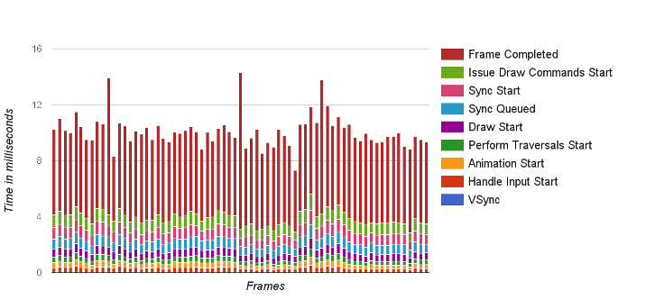

> 通过ADB命令实时获取FPS帧率有两种方式，一种是`dump gfxinfo`，一种是`dump SF --latency`。其他还可以通过三方APP GameBooster（Google PlayStore可以下载）打开实时FPS监控查看。
> 如果是查看动画是否丢帧，可以通过视频工具QuickTime Player逐帧查看需要测试的动画的拍摄视频。一般每4帧会出现一个新的动画，录制视频查看这个过程是有动画虚影的。

<!--more-->

# 1. dumpsys gfxinfo

> dumpsys是一款运行在设备上的Android工具，将 gfxinfo命令传递给dumpsys可在logcat中提供输出，其中包含各阶段发生的动画以及帧相关的性能信息。但是gfxinfo不统计SurfaceView。

步骤：
1. 打开开发者选项中的HWUI呈现模式分析，选择“在adb shell dumpsys gfxinfo中”
2. 在需要测试的界面获取包名，可以使用dump SF/activity获取
3. 清空后台任务，操作UI滑动，然后执行获取`adb shell dumpsys gfxinfo < PACKAGE_NAME >`

framestats信息和frame耗时信息通常为2s收集一次（一次120帧，一帧16ms，耗时约2s）。如果要重置所有计数器重新收集帧率数据，执行`adb shell dumpsys gfxinfo < PACKAGE_NAME > reset`


## 1.1. 案例

例如测试我的设备一加六滑动桌面的帧率，执行上述的前两步：
```log
 adb shell dumpsys activity top|grep ACTIVITY
  ACTIVITY net.oneplus.launcher/.Launcher 5f5af6c pid=4077
```

然后滑动桌面执行`adb shell dumpsys gfxinfo net.oneplus.launcher`，获取到128帧的数据。

```log
> adb shell dumpsys gfxinfo net.oneplus.launcher

Applications Graphics Acceleration Info:
Uptime: 594308934 Realtime: 1044551416

** Graphics info for pid 4077 [net.oneplus.launcher] **  //表明当前dump的界面和进程ID

Stats since: 573121582148193ns
Total frames rendered: 17625  //本次dump搜集了17625帧的信息
Janky frames: 1735 (9.84%)  //有1735帧超过了16.6ms.卡帧率是9.84%
50th percentile: 6ms 
90th percentile: 16ms
95th percentile: 20ms
99th percentile: 38ms
Number Missed Vsync: 72  //垂直同步失败的帧
Number High input latency: 8269  //处理input时间超时的帧
Number Slow UI thread: 482  //因为UI线程的工作超时导致的帧数
Number Slow bitmap uploads: 101  //因为bitmap加载耗时的帧数
Number Slow issue draw commands: 31  //因为绘制导致超时的帧数
Number Frame deadline missed: 544
HISTOGRAM: 5ms=7576 6ms=2645 7ms=1902  ... //直方图数据，表面耗时为0~5ms的帧数是7576，同理类推
......
Profile data in ms:

	net.oneplus.launcher/net.oneplus.launcher.Launcher/android.view.ViewRootImpl@3b33fe6 (visibility=0)
	Draw	Prepare	Process	Execute
	6.94	0.40	2.69	1.70   //四个加起来小于16.6ms属于正常的一帧，超过则是jank（丢帧）
	2.86	0.35	5.19	2.36
	2.55	0.32	1.10	0.98
	2.77	0.34	1.39	1.49
	2.16	0.31	1.38	1.34
	2.32	0.30	1.09	0.66
	2.05	0.25	1.04	0.83
	2.13	0.25	1.04	1.16
	1.99	0.30	1.11	1.51
	3.09	0.44	3.01	2.22
	2.34	0.72	2.40	1.68
	2.28	0.36	2.49	1.84
	2.58	0.48	2.90	1.64
	2.31	0.40	2.13	1.78
......
```
解析：
+ Draw：构建java显示列表DisplayList的时间，也就是执行每一个View的onDraw方法,创建或者更新每一个View的DisplayList对象的时间。
+ Prepare：准备函数的执行耗时
+ Process：小号在Android的2D渲染器执行显示列表的时间，view越多，要执行的绘制命令就越多，耗时越长
+ Execture：消耗在排列每个发送过来的帧的顺序的时间.或者说是CPU告诉GPU渲染一帧的时间,这是一个阻塞调用,因为CPU会一直等待GPU发出接到命令的回复。所以这个时间，一般都很短。

Draw + Prepare+Process + Execute = 完整显示一帧 ，这个时间要小于16ms才能保存每秒60帧。

## 1.2. 参数framestats

如果需要获取详细的帧信息，可以使用Android 6引入的新参数framestats，执行`adb shell dumpsys gfxinfo < PACKAGE_NAME > framestats`

结果会打印额外的信息，以CSV格式输出。每一行代表应用程序生成的一帧。每一行的列数都相同，每列对应描述帧在不同的时间段的耗时情况。

```s
---PROFILEDATA---
Flags,IntendedVsync,Vsync,OldestInputEvent,NewestInputEvent,HandleInputStart,AnimationStart,PerformTraversalsStart,DrawStart,SyncQueued,SyncStart,IssueDrawCommandsStart,SwapBuffers,FrameCompleted,DequeueBufferDuration,QueueBufferDuration,
0,594399833469194,594399833469194,9223372036854775807,0,594399833992420,594399834015180,594399834093462,594399835255753,594399835397316,594399835719034,594399835808878,594399836632628,594399837228514,96000,146000,
0,594429840570165,594429840570165,9223372036854775807,0,594429841649231,594429841736940,594429841741471,594429842202356,594429845314544,594429847401106,594429847993190,594429853626210,594429854321679,264000,326000,
......
```

解析：

+ flags：FLAGS列为'0'的行可以通过从FRAME_COMPLETED列中减去INTENDED_VSYNC列计算其总帧时间。如果非零，则该行应该被忽略，因为该帧的预期布局和绘制时间超过16ms，为异常帧。
+ *IntendedVsync：帧的的预期起点。如果此值与VSYNC不同，是由于UI线程中的工作使其无法及时响应垂直同步信号所造成的；
+ Vsync：花费在vsync监听器和帧绘制的时间（Choreographer frame回调，动画，`View.getDrawingTime（）`等）；
+ OldestInputEvent：输入队列中最旧输入事件的时间戳，如果没有输入事件，则输入Long.MAX_VALUE。此值主要用于平台工作，对应用程序开发人员的用处有限。
+ NewestInputEvent：输入队列中最新输入事件的时间戳，如果帧没有输入事件，则为0。此值主要用于平台工作，对应用程序开发人员的用处有限。然而，通过查看（FRAME_COMPLETED - NEWEST_INPUT_EVENT），可以大致了解应用程序添加的延迟时间。
+ HandleInputStart：将输入事件分派给应用程序的时间戳（deliverInputEvent函数）。通过查看这段时间和ANIMATION_START之间的时间，可以测量应用程序处理输入事件的时间。`如果这个数字很高（> 2ms），这表明程序花费了非常长的时间来处理输入事件`。例如View.onTouchEvent（），也就是说此工作需要优化，或者分发到不同的线程。请注意，某些情况下这是可以接受的，例如发起新活动或类似活动的点击事件，并且此数字很大。
+ AnimationStart：运行Choreographer注册动画的时间戳。通过查看这段时间和PERFORM_TRANVERSALS_START之间的时间，可以确定评估运行的所有动画器（ObjectAnimator，ViewPropertyAnimator和常用转换器）需要多长时间。`如果此数字很高（> 2ms），请检查您的应用是否编写了自定义动画以确保它们适用于动画。`
+ PerformTraversalsStart：计算`PERFORM_TRAVERSALS_STAR-DRAW_START`，则可以获取到布局和测量阶段完成的时间。（注意，在滚动或动画期间，希望这应该接近于零）
+ DrawStart：performTraversals的绘制阶段开始的时间。这是录制任何无效视图的显示列表的起点。这和SYNC_START之间的时间是在树中所有无效视图上调用View.draw（）所花费的时间。
+ SyncQueued：同步请求发送到RenderThread的时间。如果此时间和SYNC_START之间的时间很长（> 0.1ms左右），则意味着RenderThread忙于处理不同的帧。在内部，这被用来区分帧做了太多的工作，超过了16ms的预算，由于前一帧超过了16ms的预算，帧被停止了。
+ SYNC_START：绘图的同步阶段开始的时间。如果此时间与`ISSUE_DRAW_COMMANDS_START`之间的时间很长（> 0.4ms左右），则通常表示有许多新的位图必须上传到GPU。
+ IssueDrawCommandsStart：硬件渲染器开始向GPU发出绘图命令的时间。这段时间和`FRAME_COMPLETED`之间的时间间隔显示了应用程序正在生产多少GPU。像这样出现太多透支或低效率渲染效果的问题。
+ SwapBuffers：eglSwapBuffers被调用的时间。
+ *FrameCompleted：帧的完整时间。花在这个帧上的总时间可以通过`FRAME_COMPLETED - INTENDED_VSYNC`来计算。

这些数据可以直接通过修改开发者选项的HWUI呈现模式分析为`在屏幕显示为条形图`，如图：



***

# 2. dumpsys SurfaceFlinger --latency

> `adb shell dumpsys SurfaceFlinger --latency LayerName`命令主要用于获取游戏/视频应用的fps数据。

```s
16666666
597043335926672	597043380168807	597043346611672
597043352801411	597043396837974	597043363218234
597043368960943	597043413558338	597043379891672
597043385568078	597043430198078	597043396569641
597043405252505	597043446885266	597043413698495
597043421909328	597043463546203	597043430320943
597043718620370	597043747090734	597043725964432
597043729160422	597043763770213	597043730802818
597043745858911	597043780445786	597043747847765
597043758497193	597043797131620	597043764349745
597043775327557	597043813810786	597043781148963
597043791070734	597043830486880	597043796912974
597043808038338	597043847152140	597043813671047
......
```

第一行数据，表示刷新的时间间隔refresh_period，我的机器打印出来的间隔期是。即Dump SF里面的VSYNC period。
剩下的127行（127帧）数据分为三部分，每一列表是一种类型。
+ 第一列：表示应用绘制图像的时间点
+ 第二列：SF将帧提交给H/W(硬件)绘制之前的垂直同步时间。
+ 第三列：在SF将帧提交给H/W的时间点，算是H/W接受完SF发来数据的时间点，绘制完成的时间点。s

**计算方式：**一般打印出来的数据是129行（部分机型打印两次257行，但是第一部分是无效数据，取后半部分），取len-2的第一列数据为end_time，取len-128的第一列数据为start_time。

`fps = 127/((end_time - start_time) / 1000000.0)`

除以1000000是因为命令打印出来的是纳秒单位，要转为毫秒进行计算，127就是因为命令一次打印出来127帧的数据而已。

+ 参考：https://blog.csdn.net/itfootball/article/details/43084527/
+ 参考：https://www.jianshu.com/p/6c0cfc25b038
+ 参考：https://blog.csdn.net/luoshengyang/article/details/7846923
