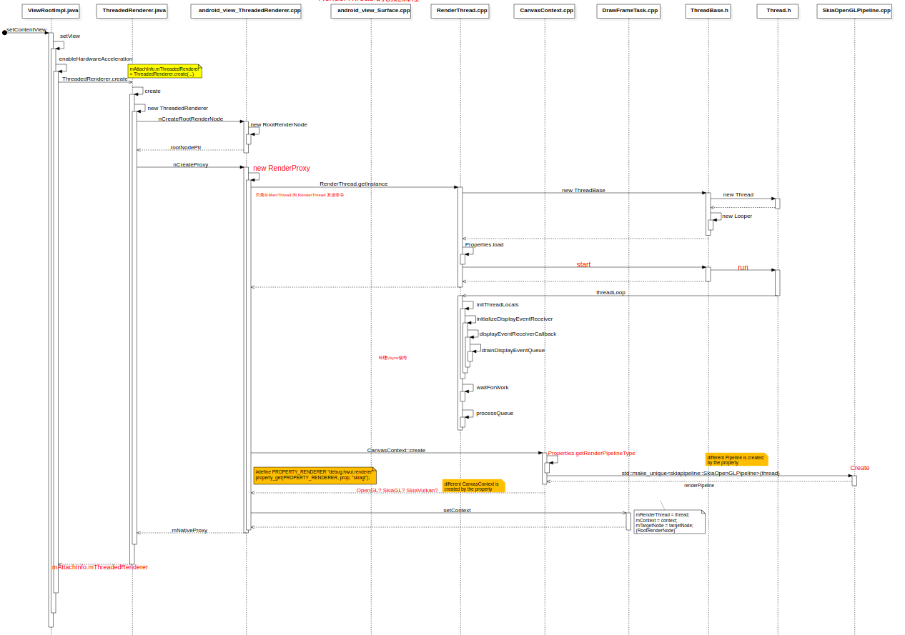
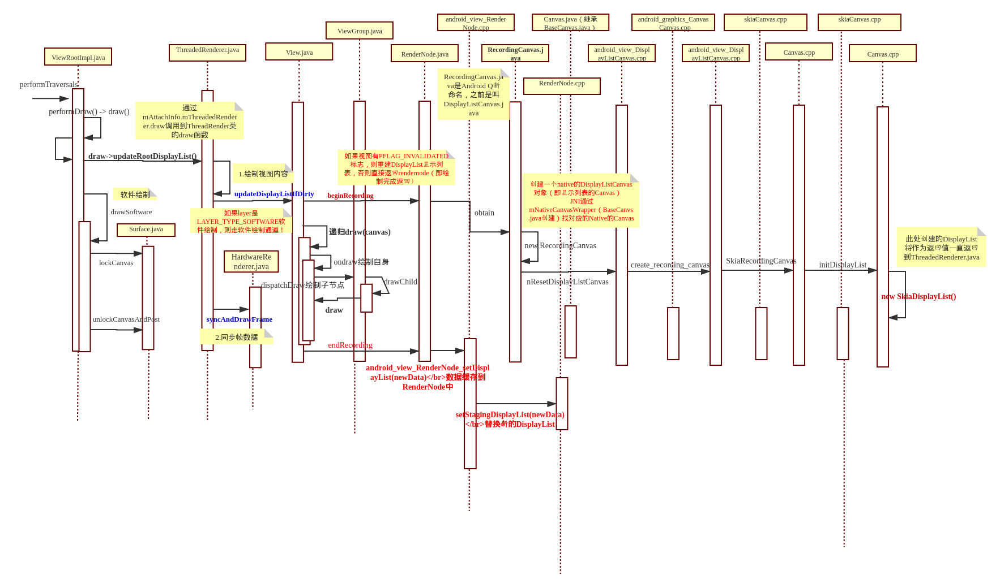
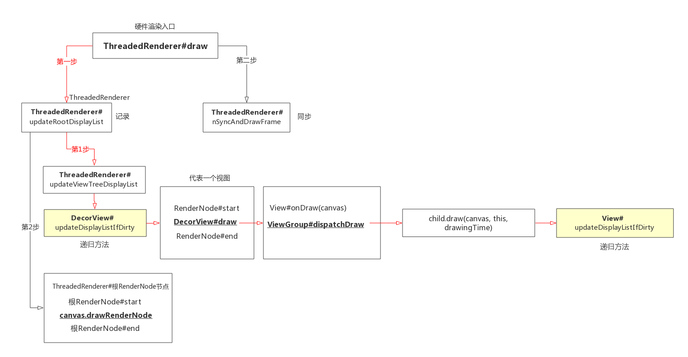

> Android中绘图的API有很多，比如2D的绘图skia；3D的绘图OpenGLES，Vulkan等。Android在后来完善3D API支持的同时，也在更新View Widget渲染机制，提出了硬件加速机制。  

<!--more-->

> HWUI绘制的大致流程是先初始化绘制环境（创建rendernode、渲染线程RenderThread、Context上下文、RenderProxy代理对象），之后是创建DisplayList显示列表，然后开始视图绘制，视图绘制结束后开始同步帧数据。

> `硬件加速`：**作用**：是将2D的绘图操纵转换为对应的3D绘图操纵。需要显示的时候，再用OpenGLES通过GPU渲染。**过程**：界面创建时，第一次全部渲染，后续界面如果只有部分区域的widget更新，只需要重新渲染更新的widget。渲染好的绘图保存在一个显示列表`DisplayList`中，需要真正显示到界面的时候，直接显示DisplayList中的绘图。**好处**：一方面利用GPU去渲染，比Skia要快；另一方面，采用DisplayList，再次渲染只更新部分区域，最大程度利用上一帧的数据，提高效率。

> 使用Android Q AOSP源码梳理流程。

# 1. GPU渲染（硬件加速）介绍

在Android应用程序中是通过Canvas API来绘制UI元素的。在硬件加速渲染环境中,这些Canvas API调用最终会转化为OpenGL API调用(转化过程对应用程序来说是透明的)。由于OpenGL API调用要求发生在Open GL环境中,因此在每当有新的Activity窗口启动时,系统都会为其初始化好OpenGL环境。

这里的渲染,主要是Android硬件加速,即GPU渲染。android上就是通过libhwui调用OpenGL api来渲染, Android P上libhwui 会调用skia,再调用GLES相关的API进行渲染。

GPU作为一个硬件 , 用户空间是不可以直接使用的, 它是由GPU厂商按照Open GL规范实现的驱动间接进行使用的。也就是说 , 如果一个设备支持GPU硬件加速渲染, 那么当Android应用程序调用OpenGL接口来绘制UI时 ,Android应用程序的UI就是通过硬件加速技术进行渲染的。

**名词介绍：**

+ GPU:一个类似于CPU的专门用来处理Graphics的处理器, 作用用来帮助加快栅格化操作, 当然, 也有相应的缓存数据(例如缓存已经光栅化过的bitmap等)机制。
+ OpenGL ES:是手持嵌入式设备的3DAPI, 跨平台的、功能完善的2D和3D图形应用程序接口API, 有一套固定渲染管线流程
+ DisplayList:在Android把XML布局文件转换成GPU能够识别并绘制的对象。这个操作是在DisplayList的帮助下完成的。DisplayList持有所有将要交给GPU绘制到屏幕上的数据信息。
+ 栅格化:是将图片等矢量资源, 转化为一格格像素点的像素图, 显示到屏幕上。
+ 垂直同步VSYNC:让显卡的运算和显示器刷新率一致以稳定输出的画面质量。它告知GPU在载入新帧之前,要等待屏幕绘制完成前一帧。
+ RefreshRate:屏幕一秒内刷新屏幕的次数, 由硬件决定, 例如60Hz
+ Frame Rate:GPU一秒绘制操作的帧数, 单位是fps

# 2. Android 5.0 之后的渲染框架

在Android应用程序窗口中, 每一个View都抽象为一个Render Node, 而且如果一个View设置有Background, 这个background 也被抽象为一个Render Node 。

这是由于在OpenGLRenderer库中, 并没有View的概念, 所有的一切可绘制的元素都抽象为一个Render Node。

每一个Render Node都关联有一个`DisplayList Renderer`, Display List是一个绘制命令缓冲区。当View的成员函数onDraw被调用时, 我们调用通过参数传递进来的Canvas的`drawXXX`成员函数绘制图形时, 我们实际上只是将对应的绘制命令以及参数保存在一个Display List中。接下来再通过DisplayList Renderer执行这个Display List的命令, 这个过程称为Display List Replay。

Android应用程序窗口的View是通过树形结构来组织的。这些View不管是通过硬件加速渲染还是软件渲染, 或者是一个特殊的TextureView,在它们的成员函数onDraw被调用期间, 它们都是将自己的UI绘制在ParentView的DisplayList中。

其中, 最顶层的Parent View是一个Root View, 它关联的RootNode称为`Root Render Node`。也就是说, 最终Root Render Node的DisplayList将会包含一个窗口的所有绘制命令。

在绘制窗口的下一帧时, RootRender Node的Display List都会通过一个OpenGL Renderer真正地通过Open GL命令绘制在一个`Graphic Buffer`中。

最后这个 Graphic Buffer 被交给 SurfaceFlinger 服务进行合成和显示。

***

# 3. Android原生硬件绘制案例

> 这个案例是用的SurfaceView.java的流程。这个流程和实际上从ViewRootImpl.java中通过performDraw的流程类似。可以互相借鉴参考。

Android原生的硬件绘制案例，在`frameworks/base/tests/HwAccelerationTest/src/com/android/test/hwui/HardwareCanvasSurfaceViewActivity.java`：

```java
//HardwareCanvasSurfaceViewActivity.java
private static class RenderingThread extends Thread {
        private final SurfaceHolder mSurface;
        private volatile boolean mRunning = true;
        private int mWidth, mHeight;
        //应用拿到一个Surface
        public RenderingThread(SurfaceHolder surface) {
            mSurface = surface;
        }

        void setSize(int width, int height) {
            mWidth = width;
            mHeight = height;
        }

        @Override
        public void run() {
            float x = 0.0f;
            float y = 0.0f;
            float speedX = 5.0f;
            float speedY = 3.0f;

            Paint paint = new Paint();
            paint.setColor(0xff00ff00);

            while (mRunning && !Thread.interrupted()) {
                //先调用Surface的lockHardwareCanvas函数
                final Canvas canvas = mSurface.lockHardwareCanvas();
                try {
                    //绘制
                    canvas.drawColor(0x00000000, PorterDuff.Mode.CLEAR);
                    canvas.drawRect(x, y, x + 20.0f, y + 20.0f, paint);
                } finally {
                    //绘制完成后
                    mSurface.unlockCanvasAndPost(canvas);
                }
                if (x + 20.0f + speedX >= mWidth || x + speedX <= 0.0f) {
                    speedX = -speedX;
                }
                if (y + 20.0f + speedY >= mHeight || y + speedY <= 0.0f) {
                    speedY = -speedY;
                }

                x += speedX;
                y += speedY;

                try {
                    //每个15s循环一次
                    Thread.sleep(15);
                } catch (InterruptedException e) {
                    // Interrupted
                }
            }
        }

        void stopRendering() {
            interrupt();
            mRunning = false;
        }
    }

```

## 3.1. Java层相关流程（frameworks/base的View模块和graphics模块）

1. 首先调用关键函数`lockHardwareCanvas`，在`frameworks/base/core/java/android/view/SurfaceView.java`：

```java
//frameworks/base/core/java/android/view/SurfaceView.java
    @Override
    public Surface getSurface() {
        return mSurface;
    }

    public Canvas lockHardwareCanvas() {
            return internalLockCanvas(null, true);
        }

        private Canvas internalLockCanvas(Rect dirty, boolean hardware) {
            mSurfaceLock.lock();
            Canvas c = null;
            if (!mDrawingStopped && mSurfaceControl != null) {
                try {
                    if (hardware) {
                        //hardware传递的是true，执行lockHardwareCanvas
                        c = mSurface.lockHardwareCanvas();
                    } else {
                        c = mSurface.lockCanvas(dirty);
                    }
                } catch (Exception e) {
                    Log.e(LOG_TAG, "Exception locking surface", e);
                }
            }

            if (c != null) {
                mLastLockTime = SystemClock.uptimeMillis();
                return c;
            }
            ......
            mLastLockTime = now;
            mSurfaceLock.unlock();

            return null;
        }
```

然后就调用Surface.java的lockHardwareCanvas函数，此处封装了一个`HwuiContext`对象，构造函数如下：

```java
//frameworks/base/core/java/android/view/Surface.java
    public Canvas lockHardwareCanvas() {
        Log.d(TAG, "lockHardwareCanvas");
        synchronized (mLock) {
            checkNotReleasedLocked();
            if (mHwuiContext == null) {
                //Step 1 创建HwuiContext，调用构造函数
                mHwuiContext = new HwuiContext(false);
            }
            //Step 2 调用他的lockCanvas函数
            return mHwuiContext.lockCanvas(
                    nativeGetWidth(mNativeObject),
                    nativeGetHeight(mNativeObject));
        }
    }
    //从上面调用到
    Canvas lockCanvas(int width, int height) {
            if (mCanvas != null) {
                throw new IllegalStateException("Surface was already locked!");
            }
            //调用RenderNode的beginRecording函数
            mCanvas = mRenderNode.beginRecording(width, height);
            return mCanvas;
        }
    .....
  }
```

## 3.2. 创建RenderNode

> RenderNode用以绘图操纵的批处理，当绘制的时候，可以store和apply。java层的代码如下：其实RenderNode就对应前面我们所说的ViewGroup，有一个RootView，同样也有一个RootNode。

1. 在上面Surface.java调用HwuiContext构造函数的时候，会创建RenderNode对象：

```java
//Surface.java
    private final class HwuiContext {
        //创建RenderNode和HwuiRender
        private final RenderNode mRenderNode;
        private long mHwuiRenderer;
        private RecordingCanvas mCanvas;
        private final boolean mIsWideColorGamut;
        //构造函数
        HwuiContext(boolean isWideColorGamut) {
            //创建一个RenderNode
            mRenderNode = RenderNode.create("HwuiCanvas", null);
            ......
```

创建RenderNode对象：

```java
//frameworks/base/graphics/java/android/graphics/RenderNode.java
    public static RenderNode create(String name, @Nullable AnimationHost animationHost) {
        return new RenderNode(name, animationHost);
    }

    private RenderNode(String name, AnimationHost animationHost) {
        mNativeRenderNode = nCreate(name);
        NoImagePreloadHolder.sRegistry.registerNativeAllocation(this, mNativeRenderNode);
        mAnimationHost = animationHost;
    }
```

2. JNI层：

```cpp
//frameworks/base/core/jni/android_view_RenderNode.cpp
static const JNINativeMethod gMethods[] = {
// ----------------------------------------------------------------------------
// Regular JNI
// ----------------------------------------------------------------------------
    { "nCreate",               "(Ljava/lang/String;)J", (void*) android_view_RenderNode_create },
    { "nGetNativeFinalizer",   "()J",    (void*) android_view_RenderNode_getNativeFinalizer },
    { "nOutput",               "(J)V",    (void*) android_view_RenderNode_output },
    ...

static jlong android_view_RenderNode_create(JNIEnv* env, jobject, jstring name) {
    //创建一个native层的rendernode对象
    RenderNode* renderNode = new RenderNode();
    renderNode->incStrong(0);
    if (name != NULL) {
        const char* textArray = env->GetStringUTFChars(name, NULL);
        renderNode->setName(textArray);
        env->ReleaseStringUTFChars(name, textArray);
    }
    return reinterpret_cast<jlong>(renderNode);
}
```

3. Native层，创建好RenderNode是提供给DisplayListCanvas。

```cpp
//frameworks/base/libs/hwui/RenderNode.cpp
RenderNode::RenderNode()
        : mUniqueId(generateId())
        , mDirtyPropertyFields(0)
        , mNeedsDisplayListSync(false)
        , mDisplayList(nullptr)
        , mStagingDisplayList(nullptr)
        , mAnimatorManager(*this)
        , mParentCount(0) {}
```

## 3.3. beginRecording初始化DisplayList


1. 在Surface.java中通过lockCanvas调用RenderNode对象的`beginRecording`函数。

```java
//frameworks/base/graphics/java/android/graphics/RenderNode.java
   public @NonNull RecordingCanvas beginRecording(int width, int height) {
        if (mCurrentRecordingCanvas != null) {
            throw new IllegalStateException(
                    "Recording currently in progress - missing #endRecording() call?");
        }
        mCurrentRecordingCanvas = RecordingCanvas.obtain(this, width, height);
        return mCurrentRecordingCanvas;
    }
```

接着调用RecordingCanvas的obtain函数：

**类的继承关系：** RecordingCanvas类继承DisplayListCanvas，而DisplayListCanvas继承BaseRecordingCanvas，
BaseRecordingCanvas继承Canvas（继承BaseCanvas）。

```java
//frameworks/base/graphics/java/android/graphics/RecordingCanvas.java
public final class RecordingCanvas extends DisplayListCanvas {
    //构造函数
    /** @hide */
    protected RecordingCanvas(@NonNull RenderNode node, int width, int height) {
        super(nCreateDisplayListCanvas(node.mNativeRenderNode, width, height));
        mDensity = 0; // disable bitmap density scaling
    }

    static RecordingCanvas obtain(@NonNull RenderNode node, int width, int height) {
        if (node == null) throw new IllegalArgumentException("node cannot be null");
        RecordingCanvas canvas = sPool.acquire();
        if (canvas == null) {
            canvas = new RecordingCanvas(node, width, height);
        } else {
            //创建一个native的DisplayListCanvas对象（即显示列表的Canvas）
            //JNI通过mNativeCanvasWrapper（BaseCanvas.java创建）找对应的Native的Canvas
            nResetDisplayListCanvas(canvas.mNativeCanvasWrapper, node.mNativeRenderNode,
                    width, height);
        }
        canvas.mNode = node;
        canvas.mWidth = width;
        canvas.mHeight = height;
        return canvas;
    }
    ...
}
```

2. 查看测试案例代码中的`canvas.drawColor`和`canvas.drawRect`函数，是调用了其父类`BaseCanvas`的对应方法。

```java
//frameworks/base/graphics/java/android/graphics/Canvas.java
    public void drawColor(@ColorLong long color) {
        super.drawColor(color, BlendMode.SRC_OVER);
    }

     public void drawRect(@NonNull RectF rect, @NonNull Paint paint) {
        super.drawRect(rect, paint);
    }
```

父类`BaseCanvas.java`：

```java
//frameworks/base/graphics/java/android/graphics/BaseCanvas.java
   public void drawColor(@ColorInt int color, @NonNull PorterDuff.Mode mode) {
        nDrawColor(mNativeCanvasWrapper, color, mode.nativeInt);
    }

  public void drawRect(@NonNull Rect r, @NonNull Paint paint) {
        throwIfHasHwBitmapInSwMode(paint);
        drawRect(r.left, r.top, r.right, r.bottom, paint);
    }
```

3. Native层Canvas创建（JNI和HWUI模块）

1.在上面RecordingCanvas.java的构造函数中调用了`nCreateDisplayListCanvas`函数，对饮的JNI实现：

```cpp
//frameworks/base/core/jni/android_view_DisplayListCanvas.cpp

const char* const kClassPathName = "android/graphics/RecordingCanvas";

static JNINativeMethod gMethods[] = {

    // ------------ @FastNative ------------------

    { "nCallDrawGLFunction", "(JJLjava/lang/Runnable;)V",
            (void*) android_view_DisplayListCanvas_callDrawGLFunction },

    // ------------ @CriticalNative --------------
    { "nCreateDisplayListCanvas", "(JII)J",     (void*) android_view_DisplayListCanvas_createDisplayListCanvas },
    { "nResetDisplayListCanvas",  "(JJII)V",    (void*) android_view_DisplayListCanvas_resetDisplayListCanvas },
    { "nGetMaximumTextureWidth",  "()I",        (void*) android_view_DisplayListCanvas_getMaxTextureSize },
    { "nGetMaximumTextureHeight", "()I",        (void*) android_view_DisplayListCanvas_getMaxTextureSize },
    { "nInsertReorderBarrier",    "(JZ)V",      (void*) android_view_DisplayListCanvas_insertReorderBarrier },
    { "nFinishRecording",         "(J)J",       (void*) android_view_DisplayListCanvas_finishRecording },
    { "nDrawRenderNode",          "(JJ)V",      (void*) android_view_DisplayListCanvas_drawRenderNode },
    { "nDrawTextureLayer",        "(JJ)V",      (void*) android_view_DisplayListCanvas_drawTextureLayer },
    { "nDrawCircle",              "(JJJJJ)V",   (void*) android_view_DisplayListCanvas_drawCircleProps },
    { "nDrawRoundRect",           "(JJJJJJJJ)V",(void*) android_view_DisplayListCanvas_drawRoundRectProps },
    { "nDrawWebViewFunctor",      "(JI)V",      (void*) android_view_DisplayListCanvas_drawWebViewFunctor },
};

//具体实现，此处的renderNodePtr变量是RenderNode在native层的对象（地址）
static jlong android_view_DisplayListCanvas_createDisplayListCanvas(jlong renderNodePtr,
        jint width, jint height) {
    RenderNode* renderNode = reinterpret_cast<RenderNode*>(renderNodePtr);
    return reinterpret_cast<jlong>(Canvas::create_recording_canvas(width, height, renderNode));
}
```

调用到frameworks/base/libs/hwui/hwui/Canvas.cpp，**在Andorid Q中，此处只调用了`SkiaRecordingCanvas`函数。使用skia进行绘制。**

```cpp
//frameworks/base/libs/hwui/hwui/Canvas.cpp
Canvas* Canvas::create_recording_canvas(int width, int height, uirenderer::RenderNode* renderNode) {
    return new uirenderer::skiapipeline::SkiaRecordingCanvas(renderNode, width, height);
}
```

然后初始化DisplayList：

```cpp
//frameworks/base/libs/hwui/pipeline/skia/SkiaRecordingCanvas.h
    explicit SkiaRecordingCanvas(uirenderer::RenderNode* renderNode, int width, int height) {
        initDisplayList(renderNode, width, height);
    }
```

```cpp
//frameworks/base/libs/hwui/pipeline/skia/SkiaRecordingCanvas.cpp
void SkiaRecordingCanvas::initDisplayList(uirenderer::RenderNode* renderNode, int width,
                                          int height) {
    mCurrentBarrier = nullptr;
    SkASSERT(mDisplayList.get() == nullptr);

    if (renderNode) {
        mDisplayList = renderNode->detachAvailableList();
    }
    if (!mDisplayList) {
        mDisplayList.reset(new SkiaDisplayList());
    }

    mDisplayList->attachRecorder(&mRecorder, SkIRect::MakeWH(width, height));
    SkiaCanvas::reset(&mRecorder);
}
```

***

## 3.4. Draw绘制操纵

> 正常流程的绘制是在frameworks/base/core/java/android/view/ThreadedRenderer.java的`updateRootDisplayList`函数中。
> 调用到drawRnderNode函数绘制。

1. Java层：上面案例中的`drawColor`和`drawRect`实际调用的是在frameworks/base/graphics/java/android/graphics/BaseCanvas.java中：

```java
//frameworks/base/graphics/java/android/graphics/BaseCanvas.java
   public void drawColor(@ColorInt int color, @NonNull PorterDuff.Mode mode) {
        nDrawColor(mNativeCanvasWrapper, color, mode.nativeInt);
    }

  public void drawRect(@NonNull Rect r, @NonNull Paint paint) {
        throwIfHasHwBitmapInSwMode(paint);
        drawRect(r.left, r.top, r.right, r.bottom, paint);
    }
```

2. 调用JNI层在：

```cpp
//frameworks/base/core/jni/android_graphics_Canvas.cpp
static const JNINativeMethod gDrawMethods[] = {
    {"nDrawColor","(JII)V", (void*) CanvasJNI::drawColor},
    {"nDrawColor","(JJJI)V", (void*) CanvasJNI::drawColorLong},
    {"nDrawPaint","(JJ)V", (void*) CanvasJNI::drawPaint},
    {"nDrawPoint", "(JFFJ)V", (void*) CanvasJNI::drawPoint},
    {"nDrawPoints", "(J[FIIJ)V", (void*) CanvasJNI::drawPoints},
    {"nDrawLine", "(JFFFFJ)V", (void*) CanvasJNI::drawLine},
    {"nDrawLines", "(J[FIIJ)V", (void*) CanvasJNI::drawLines},
    {"nDrawRect","(JFFFFJ)V", (void*) CanvasJNI::drawRect},
    ......
}

static void drawColor(JNIEnv* env, jobject, jlong canvasHandle, jint color, jint modeHandle) {
    SkBlendMode mode = static_cast<SkBlendMode>(modeHandle);
    get_canvas(canvasHandle)->drawColor(color, mode);
}

static void drawRect(JNIEnv* env, jobject, jlong canvasHandle, jfloat left, jfloat top,
                     jfloat right, jfloat bottom, jlong paintHandle) {
    const Paint* paint = reinterpret_cast<Paint*>(paintHandle);
    get_canvas(canvasHandle)->drawRect(left, top, right, bottom, *paint);
}
```

3. Native层：因为`class SkiaCanvas : public Canvas`，所以调用到SkiaCanvas类中的具体实现：

调用

```cpp
//frameworks/base/libs/hwui/SkiaCanvas.cpp
void SkiaCanvas::drawColor(int color, SkBlendMode mode) {
    mCanvas->drawColor(color, mode);
}

void SkiaCanvas::drawRect(float left, float top, float right, float bottom, const SkPaint& paint) {
    if (CC_UNLIKELY(paint.nothingToDraw())) return;
    mCanvas->drawRect({left, top, right, bottom}, *filterPaint(paint));
}
```

4. 调用到`external/skia`图形库模块：

> Skia是Google一个底层的图形、图像、动画、SVG、文本等多方面的图形库，是Android中图形系统的引擎。Skia作为第三方软件放在目录：`external/skia/`。

主要包含三个库：
+ libcorecg.so: 包含`/skia/src/core`的部分内容，比如其中的`Region、Rect`是在SurfaceFlinger里面用来计算可视区域的；
+ libsgl.so: 包含`/skia/src/core|effects|images|ports|utils`的部分和全部内容，这个实现了skia大部分的图形效果，以及图形格式的编解码；
+ libskiagl.so: 包含`/skia/src/gl`里面的内容，主要用来调用opengl实现部分效果。

```cpp
//external/skia/src/core/SkCanvas.cpp
void SkCanvas::drawColor(SkColor c, SkBlendMode mode) {
    SkPaint paint;
    paint.setColor(c);
    paint.setBlendMode(mode);
    this->drawPaint(paint);
}

void SkCanvas::drawRect(const SkRect& r, const SkPaint& paint) {
    TRACE_EVENT0("skia", TRACE_FUNC);
    // To avoid redundant logic in our culling code and various backends, we always sort rects
    // before passing them along.
    this->onDrawRect(r.makeSorted(), paint);
}
```

## 3.5. HwuiContext和HwuiRenderer

### 3.5.1. Java层

从上面的Surface.java中看到，nHwuiCreate创建HwuiRenderer。

```java
//Surface.java
            //创建一个native的HwuiRender对象
            mHwuiRenderer = nHwuiCreate(mRenderNode.mNativeRenderNode, mNativeObject,
                    isWideColorGamut);
                    ......
```

### 3.5.2. JNI层

```cpp
//frameworks/base/core/jni/android_view_Surface.cpp
static const JNINativeMethod gSurfaceMethods[] = {
    ......
    // HWUI context
    {"nHwuiCreate", "(JJZ)J", (void*) hwui::create },
    {"nHwuiSetSurface", "(JJ)V", (void*) hwui::setSurface },
    {"nHwuiDraw", "(J)V", (void*) hwui::draw },
    {"nHwuiDestroy", "(J)V", (void*) hwui::destroy },
};

//=========================================具体实现
namespace uirenderer {

using namespace android::uirenderer::renderthread;

class ContextFactory : public IContextFactory {
......
static jlong create(JNIEnv* env, jclass clazz, jlong rootNodePtr, jlong surfacePtr,
        jboolean isWideColorGamut) {
    RenderNode* rootNode = reinterpret_cast<RenderNode*>(rootNodePtr);
    sp<Surface> surface(reinterpret_cast<Surface*>(surfacePtr));
    ContextFactory factory;
    //创建一个RenderProxy对象，并作为返回对象
    RenderProxy* proxy = new RenderProxy(false, rootNode, &factory);
    proxy->loadSystemProperties();
    if (isWideColorGamut) {
        proxy->setWideGamut(true);
    }
    proxy->setSwapBehavior(SwapBehavior::kSwap_discardBuffer);
    proxy->setSurface(surface);
    // Shadows can't be used via this interface, so just set the light source
    // to all 0s.
    proxy->setLightAlpha(0, 0);
    proxy->setLightGeometry((Vector3){0, 0, 0}, 0);
    return (jlong) proxy;
}
```

***

> **以下流程部分是和通常的HWUI环境初始化流程相同的。**

### 3.5.3. *native层：调用RenderProxy.cpp构造函数

该构造函数的几个重要成员变量：

+ RenderProxy是一个代理者，严格的单线程。所有的方法都必须在自己的线程中调用。`MainThread通过这个代理对象想Task Queue发送drawFrame命令`；
+ RenderThread（即构造函数中的mRenderThread）：渲染线程，是一个单例，也就是说，一个进程中只有一个，所有的绘制操纵都必须在这个线程中完成。应用端很多操纵，都以RenderTask的形式post到RenderThread线程中完成。（在Android 5.0之后独立出来的应用程序的OpenGL线程）
+ CanvasContext（即构造函数中的mContext）：上下文，由于OpenGL是单线程的，所以，我们给到GPU的绘图命令都封装在各自的上下文中。这个和上层的HwuiRenderer是对应的。（将窗口绑定到Open GL渲染上下文中，从而使后面的渲染操作都是针对被绑定窗口的）
+ DrawFrameTask（即构造函数中的mDrawFrameTask）：一个用来执行渲染任务的task，MainThread通过他向RenderThread线程发送渲染下一帧的命令。（比较特殊的一个RenderTask，可重复使用的绘制Task。）

```cpp
//frameworks/base/libs/hwui/renderthread/RenderProxy.cpp

namespace android {
namespace uirenderer {
namespace renderthread {

RenderProxy::RenderProxy(bool translucent, RenderNode* rootRenderNode,
                         IContextFactory* contextFactory)
        : mRenderThread(RenderThread::getInstance()), mContext(nullptr) {  //Step1 创建RenderThread渲染线程
    mContext = mRenderThread.queue().runSync([&]() -> CanvasContext* {
        return CanvasContext::create(mRenderThread, translucent, rootRenderNode, contextFactory); //Step2 创建CanvasContext渲染上下文
    });
    mDrawFrameTask.setContext(&mRenderThread, mContext, rootRenderNode);
}
......
```

***

## 3.6. 创建RenderThread渲染线程

1. 从上面构造函数中的`RenderThread::getInstance()`调用下去。创建一个RenderThread线程。

而该类的父类是ThreadBase.h，父类的父类是Thread.h

```cpp
//frameworks/base/libs/hwui/renderthread/RenderThread.cpp
RenderThread& RenderThread::getInstance() {
    // This is a pointer because otherwise __cxa_finalize
    // will try to delete it like a Good Citizen but that causes us to crash
    // because we don't want to delete the RenderThread normally.
    static RenderThread* sInstance = new RenderThread();
    gHasRenderThreadInstance = true;
    return *sInstance;
}

RenderThread::RenderThread()
        : ThreadBase()
        , mVsyncSource(nullptr)
        , mVsyncRequested(false)
        , mFrameCallbackTaskPending(false)
        , mRenderState(nullptr)
        , mEglManager(nullptr)
        , mFunctorManager(WebViewFunctorManager::instance())
        , mVkManager(nullptr) {
    Properties::load();
    //实现父类的函数，调用run
    start("RenderThread");
}
```

2. 父类创建looper循环和start函数实现，然后开始线程循环：

```cpp
//frameworks/base/libs/hwui/thread/ThreadBase.h
    ThreadBase()
            : Thread(false)
            , mLooper(new Looper(false))
            , mQueue([this]() { mLooper->wake(); }, mLock) {}

    void start(const char* name = "ThreadBase") { Thread::run(name); }
```

3. 开始线程循环，调用ThreadLoop开始工作。

```cpp
//frameworks/base/libs/hwui/renderthread/RenderThread.cpp
bool RenderThread::threadLoop() {
    ...
    initThreadLocals();

    while (true) {
        waitForWork();
        processQueue();

        if (mPendingRegistrationFrameCallbacks.size() && !mFrameCallbackTaskPending) {
            drainDisplayEventQueue();
            mFrameCallbacks.insert(mPendingRegistrationFrameCallbacks.begin(),
                                   mPendingRegistrationFrameCallbacks.end());
            mPendingRegistrationFrameCallbacks.clear();
            requestVsync();
        }

        if (!mFrameCallbackTaskPending && !mVsyncRequested && mFrameCallbacks.size()) {
            requestVsync();
        }
    }

    return false;
}

//以下流程会处理vsync信号
void RenderThread::initThreadLocals() {
    setupFrameInterval();
    initializeDisplayEventReceiver();
    mEglManager = new EglManager();
    mRenderState = new RenderState(*this);
    mVkManager = new VulkanManager();
    mCacheManager = new CacheManager(DeviceInfo::get()->displayInfo());
}

void RenderThread::initializeDisplayEventReceiver() {
    if (!Properties::isolatedProcess) {
        ...
        // Register the FD
        mLooper->addFd(receiver->getFd(), 0, Looper::EVENT_INPUT,
                       RenderThread::displayEventReceiverCallback, this);
        mVsyncSource = new DisplayEventReceiverWrapper(std::move(receiver), [this] {
            DeviceInfo::get()->onDisplayConfigChanged();
            setupFrameInterval();
        });
    } else {
        mVsyncSource = new DummyVsyncSource(this);
    }
}

int RenderThread::displayEventReceiverCallback(int fd, int events, void* data) {
    ...
    reinterpret_cast<RenderThread*>(data)->drainDisplayEventQueue();

    return 1;  // keep the callback
}

void RenderThread::drainDisplayEventQueue() {
    ATRACE_CALL();
    nsecs_t vsyncEvent = mVsyncSource->latestVsyncEvent();
    if (vsyncEvent > 0) {
        mVsyncRequested = false;
        if (mTimeLord.vsyncReceived(vsyncEvent) && !mFrameCallbackTaskPending) {
            ATRACE_NAME("queue mFrameCallbackTask");
            mFrameCallbackTaskPending = true;
            nsecs_t runAt = (vsyncEvent + mDispatchFrameDelay);
            queue().postAt(runAt, [this]() { dispatchFrameCallbacks(); });
        }
    }
}
```

***

## 3.7. CanvasContext渲染上下文

该函数中会选择渲染绘制方式（渲染管线）。在Android Q中取消了OpenGL渲染。

+ Android P之前：`enum class RenderPipelineType { OpenGL = 0, SkiaGL, SkiaVulkan, NotInitialized = 128 };`
+ Android Q：`enum class RenderPipelineType { SkiaGL, SkiaVulkan, NotInitialized = 128 };`

```cpp
//frameworks/base/libs/hwui/renderthread/CanvasContext.cpp
CanvasContext* CanvasContext::create(RenderThread& thread, bool translucent,
                                     RenderNode* rootRenderNode, IContextFactory* contextFactory) {
    //获取渲染方式getRenderPipelineType
    auto renderType = Properties::getRenderPipelineType();

    switch (renderType) {
        case RenderPipelineType::SkiaGL:
            return new CanvasContext(thread, translucent, rootRenderNode, contextFactory,
                                     std::make_unique<skiapipeline::SkiaOpenGLPipeline>(thread));
        case RenderPipelineType::SkiaVulkan:
            return new CanvasContext(thread, translucent, rootRenderNode, contextFactory,
                                     std::make_unique<skiapipeline::SkiaVulkanPipeline>(thread));
        default:
            LOG_ALWAYS_FATAL("canvas context type %d not supported", (int32_t)renderType);
            break;
    }
    return nullptr;
}

RenderPipelineType Properties::getRenderPipelineType() {
    sRenderPipelineType = peekRenderPipelineType();
    return sRenderPipelineType;
}

RenderPipelineType Properties::peekRenderPipelineType() {
    // If sRenderPipelineType has been locked, just return the locked type immediately.
    if (sRenderPipelineType != RenderPipelineType::NotInitialized) {
        return sRenderPipelineType;
    }
    bool useVulkan = use_vulkan().value_or(false);
    char prop[PROPERTY_VALUE_MAX];
    //PROPERTY_RENDERER "debug.hwui.renderer"
    //enum class RenderPipelineType { SkiaGL, SkiaVulkan, NotInitialized = 128 };
    property_get(PROPERTY_RENDERER, prop, useVulkan ? "skiavk" : "skiagl");
    if (!strcmp(prop, "skiavk")) {
        return RenderPipelineType::SkiaVulkan;
    }
    return RenderPipelineType::SkiaGL;
}
```

> mRenderPipeline有几种类型，创建CanvasContext时（`create函数`），会根据pipeline的类型，创建对应的Pipeline。（即调用`getRenderPipelineType函数`）

+ 渲染类型：`enum class RenderPipelineType { SkiaGL, SkiaVulkan, NotInitialized = 128 };`

***

```cpp
//frameworks/base/libs/hwui/renderthread/CanvasContext.cpp
//构造函数
CanvasContext::CanvasContext(RenderThread& thread, bool translucent, RenderNode* rootRenderNode,
                             IContextFactory* contextFactory,
                             std::unique_ptr<IRenderPipeline> renderPipeline)
        : mRenderThread(thread)
        , mGenerationID(0)
        , mOpaque(!translucent)
        , mAnimationContext(contextFactory->createAnimationContext(mRenderThread.timeLord()))
        , mJankTracker(&thread.globalProfileData(), DeviceInfo::get()->displayInfo())
        , mProfiler(mJankTracker.frames(), thread.timeLord().frameIntervalNanos())
        , mContentDrawBounds(0, 0, 0, 0)
        , mRenderPipeline(std::move(renderPipeline)) {
    rootRenderNode->makeRoot();
    mRenderNodes.emplace_back(rootRenderNode);  //是前面创建的RenderNode
    mProfiler.setDensity(DeviceInfo::get()->displayInfo().density);
    setRenderAheadDepth(Properties::defaultRenderAhead);
}
```

在上面调用nHwuiCreate的JNI层，会创建ContextFactory，然后在此处的构造函数中会使用到。主要用来创建AnimationContext，即`mAnimationContext(contextFactory->createAnimationContext(mRenderThread.timeLord()))`

AnimationContext主要用来处理动画Animation。

```cpp
//frameworks/base/core/jni/android_view_Surface.cpp
class ContextFactory : public IContextFactory {
public:
    virtual AnimationContext* createAnimationContext(renderthread::TimeLord& clock) {
        return new AnimationContext(clock);
    }
};
```

+ CanvasContext实现了IFrameCallback接口，所以，CanvasContext能接收编舞者Choreographer的callback，处理实时动画。`class CanvasContext : public IFrameCallback {...}`

***

### 3.7.1. RenderThread渲染线程

> **RenderThread渲染运行模型**:空闲的时候, RenderThread睡眠在成员变量mLooper指向的一个Looper对象的成员函数pollOnceh中。当其他线程需要调度RenderThread, 会向他的任务队列添加一个任务, 然后唤醒RenderThread进行处理。RenderThread通过`processQueue`方法处理任务。

```cpp
//frameworks/base/libs/hwui/renderthread/RenderThread.h
//继承ThreadBase，而ThreadBase是继承基类Thread
class RenderThread : private ThreadBase {
    //组织拷贝构造函数和重载
    PREVENT_COPY_AND_ASSIGN(RenderThread);
```

1. 调用构造函数中，同时启动了渲染线程RenderThread：

```cpp
//frameworks/base/libs/hwui/renderthread/RenderThread.cpp
RenderThread::RenderThread()
        : ThreadBase()
        , mVsyncSource(nullptr)
        , mVsyncRequested(false)
        , mFrameCallbackTaskPending(false)
        , mRenderState(nullptr)
        , mEglManager(nullptr)
        , mFunctorManager(WebViewFunctorManager::instance())
        , mVkManager(nullptr) {
    Properties::load();
    start("RenderThread"); //线程启动
}
```

查看父类的构造函数：

```cpp
//frameworks/base/libs/hwui/thread/ThreadBase.h
    ThreadBase()
            : Thread(false)
            , mLooper(new Looper(false))
            , mQueue([this]() {
                 mLooper->wake();  //此处调用是唤醒mLooper，线程开始工作
            }, mLock) {}
```

2. 在渲染线程启动后，会调用RenderThread.cpp的threadLoop函数。

```cpp
bool RenderThread::threadLoop() {
    setpriority(PRIO_PROCESS, 0, PRIORITY_DISPLAY);
    Looper::setForThread(mLooper);
    if (gOnStartHook) {
        gOnStartHook("RenderThread");
    }
    //初始化Thread的本地变量
    initThreadLocals();

    while (true) {
        //没有任务就等在此处
        waitForWork();
        processQueue();

        if (mPendingRegistrationFrameCallbacks.size() && !mFrameCallbackTaskPending) {
            drainDisplayEventQueue();
            mFrameCallbacks.insert(mPendingRegistrationFrameCallbacks.begin(),
                                   mPendingRegistrationFrameCallbacks.end());
            mPendingRegistrationFrameCallbacks.clear();
            requestVsync();
        }

        if (!mFrameCallbackTaskPending && !mVsyncRequested && mFrameCallbacks.size()) {
            // TODO: Clean this up. This is working around an issue where a combination
            // of bad timing and slow drawing can result in dropping a stale vsync
            // on the floor (correct!) but fails to schedule to listen for the
            // next vsync (oops), so none of the callbacks are run.
            requestVsync();
        }
    }

    return false;
}
```

***

### 3.7.2. DrawFrameTask构造函数

在`RenderProxy`调用构造函数时，会创建DrawFrameTask，同时调用其`setContext`函数：

```cpp
//frameworks/base/libs/hwui/renderthread/DrawFrameTask.cpp
DrawFrameTask::DrawFrameTask()
        : mRenderThread(nullptr)
        , mContext(nullptr)
        , mContentDrawBounds(0, 0, 0, 0)
        , mSyncResult(SyncResult::OK) {}

DrawFrameTask::~DrawFrameTask() {}

void DrawFrameTask::setContext(RenderThread* thread, CanvasContext* context,
                               RenderNode* targetNode) {
    mRenderThread = thread;
    mContext = context;
    mTargetNode = targetNode;
}
```

## 3.8. syncAndDrawFrame绘制帧

1. 从上面的分析看，DisplayList和RenderThread都创建好了，正常绘制的时候会调用到`syncAndDrawFrame`：

从ViewRootImpl的performDraw函数调用到draw，在调用到 ThreadedRenderer.java的draw函数。开始绘制：

```java
//ThreadedRenderer.java
  void draw(View view, AttachInfo attachInfo, DrawCallbacks callbacks) {
        final Choreographer choreographer = attachInfo.mViewRootImpl.mChoreographer;
        choreographer.mFrameInfo.markDrawStart();
        //绘制每个视图的内容（在文章下面会梳理）
        updateRootDisplayList(view, callbacks);
        //绘制一帧的内容
        int syncResult = syncAndDrawFrame(choreographer.mFrameInfo);
        ...
    }
```

```cpp
//frameworks/base/libs/hwui/renderthread/RenderProxy.cpp
int RenderProxy::syncAndDrawFrame() {
    return mDrawFrameTask.drawFrame();
}
```

```cpp
//frameworks/base/libs/hwui/renderthread/DrawFrameTask.cpp
int DrawFrameTask::drawFrame() {
    LOG_ALWAYS_FATAL_IF(!mContext, "Cannot drawFrame with no CanvasContext!");

    mSyncResult = SyncResult::OK;
    mSyncQueued = systemTime(CLOCK_MONOTONIC);
    postAndWait();

    return mSyncResult;
}

void DrawFrameTask::postAndWait() {
    AutoMutex _lock(mLock);
    mRenderThread->queue().post([this]() { run(); }); //执行此处的run函数
    mSignal.wait(mLock);
}
```

2. 此时，drawFrame，也就通过RenderThread，post一个WorkItem到RenderThread的队列里面，在RenderThread线程中执行的。

然后RenderThread处理Queue时，执行的会是DrawFrameTask的run函数。

```cpp
//frameworks/base/libs/hwui/renderthread/DrawFrameTask.cpp
void DrawFrameTask::run() {
    ATRACE_NAME("DrawFrame");

    bool canUnblockUiThread;
    bool canDrawThisFrame;
    {
        //info，即描述Viewtree的，也就是RenderNode tree
        //此处的mode是MODE_FULL，即只有primary的node是FULL，其他都是实时 **
        TreeInfo info(TreeInfo::MODE_FULL, *mContext);
        //同步Frame帧状态
        canUnblockUiThread = syncFrameState(info);
        //判断是否可以绘制这一帧
        canDrawThisFrame = info.out.canDrawThisFrame;

        if (mFrameCompleteCallback) {
            mContext->addFrameCompleteListener(std::move(mFrameCompleteCallback));
            mFrameCompleteCallback = nullptr;
        }
    }

    // Grab a copy of everything we need
    CanvasContext* context = mContext;
    std::function<void(int64_t)> callback = std::move(mFrameCallback);
    mFrameCallback = nullptr;

    ......

    if (CC_LIKELY(canDrawThisFrame)) {
        //**绘制
        context->draw();
    } else {
        // wait on fences so tasks don't overlap next frame
        context->waitOnFences();
    }

    if (!canUnblockUiThread) {
        unblockUiThread();
    }
}

//同步Frame的State
bool DrawFrameTask::syncFrameState(TreeInfo& info) {
    ATRACE_CALL();
    int64_t vsync = mFrameInfo[static_cast<int>(FrameInfoIndex::Vsync)];
    mRenderThread->timeLord().vsyncReceived(vsync);
    //通知GPU处理当前的Context上下文
    bool canDraw = mContext->makeCurrent();
    //hwui为了提高速度，对各种object都做了cache，此处unpin，就是让cache去做unpin，其他都不要了
    mContext->unpinImages();

    for (size_t i = 0; i < mLayers.size(); i++) {
        mLayers[i]->apply();
    }
    mLayers.clear();
    //设置绘制的区域大小
    mContext->setContentDrawBounds(mContentDrawBounds);
    //**Android View是树型结构的，这就是在绘制之前，去准备这些Tree节点的绘图操作
    //准备绘制一帧的数据
    mContext->prepareTree(info, mFrameInfo, mSyncQueued, mTargetNode);

    // This is after the prepareTree so that any pending operations
    // (RenderNode tree state, prefetched layers, etc...) will be flushed.
    if (CC_UNLIKELY(!mContext->hasSurface() || !canDraw)) {
        if (!mContext->hasSurface()) {
            mSyncResult |= SyncResult::LostSurfaceRewardIfFound;
        } else {
            // If we have a surface but can't draw we must be stopped
            mSyncResult |= SyncResult::ContextIsStopped;
        }
        info.out.canDrawThisFrame = false;
    }

    if (info.out.hasAnimations) {
        if (info.out.requiresUiRedraw) {
            mSyncResult |= SyncResult::UIRedrawRequired;
        }
    }
    if (!info.out.canDrawThisFrame) {
        mSyncResult |= SyncResult::FrameDropped;
    }
    // If prepareTextures is false, we ran out of texture cache space
    return info.prepareTextures;
}
```

***

### 3.8.1. prepareTree

1. 调用函数**prepareTree**：

```cpp
//frameworks/base/libs/hwui/renderthread/CanvasContext.cpp
void CanvasContext::prepareTree(TreeInfo& info, int64_t* uiFrameInfo, int64_t syncQueued,
                                RenderNode* target) {
    mRenderThread.removeFrameCallback(this);
......
    mAnimationContext->startFrame(info.mode);
    mRenderPipeline->onPrepareTree();
    //Context可能会有多个Node
    for (const sp<RenderNode>& node : mRenderNodes) {
        //即只有Primary的node是 FULL，其他都是实时
        info.mode = (node.get() == target ? TreeInfo::MODE_FULL : TreeInfo::MODE_RT_ONLY);
        //此处遍历，对每个RenderNode都进行prepare
        node->prepareTree(info);
        GL_CHECKPOINT(MODERATE);
    }
    mAnimationContext->runRemainingAnimations(info);
    GL_CHECKPOINT(MODERATE);

    freePrefetchedLayers();
    GL_CHECKPOINT(MODERATE);

    mIsDirty = true;
    //如果窗口已经没有Native Surface，这一帧就丢掉！！
    if (CC_UNLIKELY(!hasSurface())) {
        mCurrentFrameInfo->addFlag(FrameInfoFlags::SkippedFrame);
        info.out.canDrawThisFrame = false;
        return;
    }
......
                                }
```

2. 遍历RenderNode的prepareTree方法：

```cpp
//frameworks/base/libs/hwui/RenderNode.cpp
void RenderNode::prepareTree(TreeInfo& info) {
    ATRACE_CALL();
    LOG_ALWAYS_FATAL_IF(!info.damageAccumulator, "DamageAccumulator missing");
    MarkAndSweepRemoved observer(&info);

    const int before = info.disableForceDark;
    //具体实现
    prepareTreeImpl(observer, info, false);
    LOG_ALWAYS_FATAL_IF(before != info.disableForceDark, "Mis-matched force dark");
}
```

3. prepareTreeImpl是RenderNode真正进行Prepare的地方。

damageAccumulator是从CanvasContext中传过来的，是CanvasContext的成员，damage的叠加器。主要是用来标记，屏幕的那些区域被破坏了，需要重新绘制，所有的RenderNode累加起来，就是总的。

```cpp
//frameworks/base/libs/hwui/RenderNode.cpp
void RenderNode::prepareTreeImpl(TreeObserver& observer, TreeInfo& info, bool functorsNeedLayer) {
    if (mDamageGenerationId == info.damageGenerationId) {
        info.damageAccumulator->dirty(DIRTY_MIN, DIRTY_MIN, DIRTY_MAX, DIRTY_MAX);
    }
    //Step 1
    info.damageAccumulator->pushTransform(this);

    if (info.mode == TreeInfo::MODE_FULL) {
        //property是对RenderNode的描述，也就是对View的描述，比如大小，位置等。
        //有两个状态，正在使用的syncProperties和待处理的mStagingProperties。
        //syncProperties时，将mStagingProperties赋值给syncProperties
        pushStagingPropertiesChanges(info);
    }
......
    pushLayerUpdate(info);

    if (!mProperties.getAllowForceDark()) {
        info.disableForceDark--;
    }
    info.damageAccumulator->popTransform();
}
```

4. 调用pushTransform函数，damage累加器中，每一个元素由DirtyStack描述，分两种类型：TransformMatrix4和TransformRenderNode。采用一个双向链表mHead进行管理。

```cpp
//frameworks/base/libs/hwui/DamageAccumulator.cpp
void DamageAccumulator::pushCommon() {
    if (!mHead->next) {
        DirtyStack* nextFrame = mAllocator.create_trivial<DirtyStack>();
        nextFrame->next = nullptr;
        nextFrame->prev = mHead;
        mHead->next = nextFrame;
    }
    mHead = mHead->next;
    mHead->pendingDirty.setEmpty();
}

void DamageAccumulator::pushTransform(const RenderNode* transform) {
    pushCommon();
    mHead->type = TransformRenderNode;
    mHead->renderNode = transform;
}
```

此时prepare完成后，绘制一帧的数据就准备好了。

***

## 3.9. 绘制帧数据

1. 从`syncAndDrawFrame绘制帧`上面的章节，此处会调用到HardwareRenderer.java父类函数；
2. 然后JNI到Native层，调用到RenderProxy.cpp的该函数，
3. 再到`frameworks/base/libs/hwui/renderthread/DrawFrameTask.cpp`的drawFrame函数，开始绘制一帧数据，
4. 此时启动RenderThread线程的run函数，调用到关键函数`CanvasContext::draw()`

Android Q中，具体绘制是在各自的pipeline中进行的。（在`frameworks/base/libs/hwui/pipeline/`）

在Android P中，一般是执行的`frameworks/base/libs/hwui/renderthread/OpenGLPipeline.cpp`

在Android Q中，可以看出Google在慢慢用Vulkan替代OpenGL。

```cpp
//frameworks/base/libs/hwui/renderthread/CanvasContext.cpp
void CanvasContext::draw() {
    SkRect dirty;
    mDamageAccumulator.finish(&dirty);
    //跳过绘制条件：脏区域为空、空帧数据、不需要重绘
    if (dirty.isEmpty() && Properties::skipEmptyFrames && !surfaceRequiresRedraw()) {
        mCurrentFrameInfo->addFlag(FrameInfoFlags::SkippedFrame);
        return;
    }
......
    mCurrentFrameInfo->markIssueDrawCommandsStart();
    //获取frame(一帧数据信息，主要是ufferAge、Surface等)
    Frame frame = mRenderPipeline->getFrame();
    setPresentTime();

    SkRect windowDirty = computeDirtyRect(frame, &dirty);
    //绘制
    bool drew = mRenderPipeline->draw(frame, windowDirty, dirty, mLightGeometry, &mLayerUpdateQueue,
                                      mContentDrawBounds, mOpaque, mLightInfo, mRenderNodes,
                                      &(profiler()));

    int64_t frameCompleteNr = mFrameCompleteCallbacks.size() ? getFrameNumber() : -1;

    waitOnFences();

    bool requireSwap = false;
    //绘制完成后调用
    bool didSwap =
            mRenderPipeline->swapBuffers(frame, drew, windowDirty, mCurrentFrameInfo, &requireSwap);
......
}
```

## 3.10. 绘制完成后unlockCanvasAndPost流程

回到绘制案例，此时，RenderThread，DrawFrameTask，CanvasContext等已经就绪，绘制操纵已经被添加到了DisplayList中。

1. 绘制完成，然后会在`frameworks/base/tests/HwAccelerationTest/src/com/android/test/hwui/HardwareCanvasSurfaceViewActivity.java`中调用到`方法unlockCanvasAndPost`。

SurfaceHolder直接调的Surface的unlockCanvasAndPost。

```cpp
//frameworks/base/core/java/android/view/Surface.java
  public void unlockCanvasAndPost(Canvas canvas) {
        synchronized (mLock) {
            checkNotReleasedLocked();

            if (mHwuiContext != null) {
                //硬件加速执行此处
                mHwuiContext.unlockAndPost(canvas);
            } else {
                //软件绘制
                unlockSwCanvasAndPost(canvas);
            }
        }
    }

private final class HwuiContext {
    ......
        //HwuiContext的unlockAndPost函数
        void unlockAndPost(Canvas canvas) {
            if (canvas != mCanvas) {
                throw new IllegalArgumentException("canvas object must be the same instance that "
                        + "was previously returned by lockCanvas");
            }
            mRenderNode.endRecording();
            mCanvas = null;
            nHwuiDraw(mHwuiRenderer);
        }
}
```

2. 上面代码看到，在lockHardwareCanvas的时候有相同流程，会调用`mRenderNode.beginRecording`。

此处就对应的调用到`mRenderNode.endRecording();`，结束RenderNode，保存数据。

```java
//frameworks/base/graphics/java/android/graphics/RenderNode.java
 public void endRecording() {
        if (mCurrentRecordingCanvas == null) {
            throw new IllegalStateException(
                    "No recording in progress, forgot to call #beginRecording()?");
        }
        RecordingCanvas canvas = mCurrentRecordingCanvas;
        mCurrentRecordingCanvas = null;
        //Step1 先结束Canvas的录制
        long displayList = canvas.finishRecording();
        //Step2 然后将录制的list给mNativeRenderNode
        nSetDisplayList(mNativeRenderNode, displayList);
        canvas.recycle();
    }
```

3. 首先finishRecording函数通过JIN层`android_view_DisplayListCanvas.cpp`调用到Native层。

返回录制好的mDisplayList。

```cpp
//frameworks/base/libs/hwui/pipeline/skia/SkiaRecordingCanvas.cpp
uirenderer::DisplayList* SkiaRecordingCanvas::finishRecording() {
    // close any existing chunks if necessary
    insertReorderBarrier(false);
    mRecorder.restoreToCount(1);
    return mDisplayList.release();
}
```

4. 第二步的nSetDisplayList通过JNI层`android_view_RenderNode.cpp`调用到Native层。

将displayList给到RenderNode的mStagingDisplayList。

```cpp
//frameworks/base/libs/hwui/RenderNode.cpp
void RenderNode::setStagingDisplayList(DisplayList* displayList) {
    mValid = (displayList != nullptr);
    mNeedsDisplayListSync = true;
    delete mStagingDisplayList;
    mStagingDisplayList = displayList;
}
```

***

# 4. Activity HWUI渲染环境初始化流程（RenderThreadc创建）

> 主要是通过setView创建rendernode，渲染线程RenderThread，Context上下文，RenderProxy代理对象等。

## 4.1. 附序列图



## 4.2. Java层

1. Activity.java开始设置view：

```java
//frameworks/base/core/java/android/app/Activity.java
public Window getWindow() {
        return mWindow;
    }

public void setContentView(View view) {
        getWindow().setContentView(view);
        initWindowDecorActionBar();
    }
```

2. PhoneWindow继承Window抽象类调用setContentView函数：

```java
//frameworks/base/core/java/com/android/internal/policy/PhoneWindow.java
public class PhoneWindow extends Window implements MenuBuilder.Callback {
...
@Override
    public void setContentView(View view) {
        //新对象ViewGroup
        setContentView(view, new ViewGroup.LayoutParams(MATCH_PARENT, MATCH_PARENT));
    }

    @Override
    public void setContentView(View view, ViewGroup.LayoutParams params) {
        if (mContentParent == null) {
            installDecor();
        } else if (!hasFeature(FEATURE_CONTENT_TRANSITIONS)) {
            mContentParent.removeAllViews();
        }

        if (hasFeature(FEATURE_CONTENT_TRANSITIONS)) {
            view.setLayoutParams(params);
            final Scene newScene = new Scene(mContentParent, view);
            transitionTo(newScene);
        } else {
            //调用此处添加一个view到Parent View中
            mContentParent.addView(view, params);
        }
        mContentParent.requestApplyInsets();
        final Callback cb = getCallback();
        if (cb != null && !isDestroyed()) {
            cb.onContentChanged();
        }
        mContentParentExplicitlySet = true;
    }
...
}
```

此处的`mContentParent.addView(view, params);`，mContentParent是ViewGroup类型对象。

ViewGroup实现接口ViewManager，而`interface WindowManager extends ViewManager`，WindowManagerImpl.java又是接口WindowManager的实现类。所以会同时调用WindowManagerImpl类的addView函数。

3. WindowManagerImpl.java调用addView函数。

```java
//frameworks/base/core/java/android/view/WindowManagerImpl.java
@Override
    public void addView(@NonNull View view, @NonNull ViewGroup.LayoutParams params) {
        applyDefaultToken(params);
        mGlobal.addView(view, params, mContext.getDisplay(), mParentWindow);
    }
```

4. 调用windowManagerGlobal的addView函数。

```java
//frameworks/base/core/java/android/view/WindowManagerGlobal.java
    public void addView(View view, ViewGroup.LayoutParams params,
            Display display, Window parentWindow) {
                ...
        ViewRootImpl root;
        View panelParentView = null;
        synchronized (mLock) {
            ......
            // do this last because it fires off messages to start doing things
            try {
                //调用ViewRootImpl的setView函数
                root.setView(view, wparams, panelParentView);
            } catch (RuntimeException e) {
                // BadTokenException or InvalidDisplayException, clean up.
                if (index >= 0) {
                    removeViewLocked(index, true);
                }
                throw e;
            }
        }
```

5. ViewRootImpl.java中调用流程：

```java
//frameworks/base/core/java/android/view/ViewRootImpl.java
    /**
     * We have one child
     */
    public void setView(View view, WindowManager.LayoutParams attrs, View panelParentView) {
        synchronized (this) {
            if (mView == null) {
                //设置根节点视图（顶层视图）
                mView = view;
                ...
                // If the application owns the surface, don't enable hardware acceleration
                if (mSurfaceHolder == null) {
                    // While this is supposed to enable only, it can effectively disable
                    // the acceleration too.
                    //启动硬件加速！
                    enableHardwareAcceleration(attrs);
                    final boolean useMTRenderer = MT_RENDERER_AVAILABLE
                            && mAttachInfo.mThreadedRenderer != null;
                    if (mUseMTRenderer != useMTRenderer) {
                        // Shouldn't be resizing, as it's done only in window setup,
                        // but end just in case.
                        endDragResizing();
                        mUseMTRenderer = useMTRenderer;
                ...
                    }
                }
            }
        }
    }

    @UnsupportedAppUsage
    private void enableHardwareAcceleration(WindowManager.LayoutParams attrs) {
            ...
            mAttachInfo.mThreadedRenderer = ThreadedRenderer.create(mContext, translucent,
                        attrs.getTitle().toString());
            ...
    }
```

4. 在ThreadedRenderer的create函数中new了一个该对象，从而调用其构造函数。构造函数的`super()`调用基类HardwareRenderer的构造函数。

```java
//frameworks/base/graphics/java/android/graphics/HardwareRenderer.java
    /**
     * Creates a new instance of a HardwareRenderer. The HardwareRenderer will default
     * to opaque with no light source configured.
     */
     //创建硬件渲染rendernode对象
    public HardwareRenderer() {
        //创建一个窗口的Root Render Node，并用Java层的RenderNode封装起来，即adopt通过new对象返回一个java层的RenderNode对象
        mRootNode = RenderNode.adopt(nCreateRootRenderNode());
        mRootNode.setClipToBounds(false);
        //调用到JNI层，创建一个RenderProxy（即MainThread的代理对象）
        mNativeProxy = nCreateProxy(!mOpaque, mRootNode.mNativeRenderNode);
        if (mNativeProxy == 0) {
            throw new OutOfMemoryError("Unable to create hardware renderer");
        }
        Cleaner.create(this, new DestroyContextRunnable(mNativeProxy));
        ProcessInitializer.sInstance.init(mNativeProxy);
    }
```

***

## 4.3. Native层

1. 从上面的nCreateRootRenderNode函数调用到JNI层的android_view_ThreadedRenderer.cpp文件中。

创建一个窗口的Root Render Node。

之后创建RenderProxy对象。

```cpp
static jlong android_view_ThreadedRenderer_createRootRenderNode(JNIEnv* env, jobject clazz) {
    //new对象
    RootRenderNode* node = new RootRenderNode(env);
    node->incStrong(0);
    node->setName("RootRenderNode");
    return reinterpret_cast<jlong>(node);
}

static jlong android_view_ThreadedRenderer_createProxy(JNIEnv* env, jobject clazz,
        jboolean translucent, jlong rootRenderNodePtr) {
    RootRenderNode* rootRenderNode = reinterpret_cast<RootRenderNode*>(rootRenderNodePtr);
    ContextFactoryImpl factory(rootRenderNode);
    //new对象
    return (jlong) new RenderProxy(translucent, rootRenderNode, &factory);
}
```

2. 之后调用RenderProxy构造函数，就同上面Google原生绘制案例的流程分析相同`RenderProxy::RenderProxy(){...}`，负责从MainThread向RenderThread发送命令。

**参考上面的`native层：调用RenderProxy.cpp构造函数`和`CanvasContext渲染上下文`章节**

***

## 4.4. ThreadedRenderer架构图


***

# 5. Activity 窗口绘制流程

> 由ViewRootImpl的成员函数`performTraversals`发起。

1. 在绘制之前，首先需要创建一个Surface，即描述一个窗口（创建Surface的流程后续单独整理）
2. 一旦获得对应的Surface， 就需要将其绑定到RenderThread中。
3. Activity窗口对应的Surface是通过ViewRootImpl类的成员函数`relayoutWindow`向WindowManagerService服务请求创建和返回的，并且保存在ViewRootImpl类的成员变量mSurface中。
4. 如果Surface是新创建的，将调用ViewRootImpl类的成员变量mAttachInfo指向的AttachInfo函数。对象的成员变量mHardwareRenderer描述的一个HardwareRenderer对象的成员函数`initialize`将它绑定到RenderThread中。
5. 最后, 如果需要绘制当前的Activity窗口, 那会调用 iewRootImpl类的另外一个成员函数`performDraw`

> 此处在performTraversals函数中，先是用relayoutWindow创建mSurface，将Native层之前通过构造函数创建的Surface copy过来。
> 而后是三个主要流程：performMeasure测量、performLayout布局、performDraw绘制

## 5.1. 绘制序列图



### 5.1.1. ViewRootImpl中的软/硬件绘制区分

在ViewRootImpl.java的draw函数中：

```java
//frameworks/base/core/java/android/view/ViewRootImpl.java
private boolean draw(boolean fullRedrawNeeded) {
        Surface surface = mSurface;
        if (!surface.isValid()) {
            return false;
        }

        // Draw with hardware renderer.
        mIsAnimating = false;
        ...
        if (!dirty.isEmpty() || mIsAnimating || accessibilityFocusDirty) {
            if (mAttachInfo.mThreadedRenderer != null && mAttachInfo.mThreadedRenderer.isEnabled()) {
        ...
        //硬件加速
        mAttachInfo.mThreadedRenderer.draw(mView, mAttachInfo, this);
        } else {
        ...
                //软件绘制
                if (!drawSoftware(surface, mAttachInfo, xOffset, yOffset,
                        scalingRequired, dirty, surfaceInsets)) {
                    if (DEBUG_DRAW) {
                        Log.v(mTag, "drawSoftware return: this = " + this);
                    }
                    return false;
                }
            }
        }
```

drawSoftware中会调用到Surface.java的`lockCanvas`和`unlockCanvasAndPost`函数。

```java
//frameworks/base/core/java/android/view/Surface.java
public Canvas lockCanvas(Rect inOutDirty)
            throws Surface.OutOfResourcesException, IllegalArgumentException {
        synchronized (mLock) {
            /// M: add for white list @{
            //如果在白名单，则返回，仍使用硬件绘制
            if (mSurfaceExt.isInWhiteList()) {
                return lockHardwareCanvas();
            }
            /// @}
            ...
            mLockedObject = nativeLockCanvas(mNativeObject, mCanvas, inOutDirty);
            return mCanvas;
        }
    }

private void unlockSwCanvasAndPost(Canvas canvas) {
        ......
        try {
            nativeUnlockCanvasAndPost(mLockedObject, canvas);
        } finally {
            nativeRelease(mLockedObject);
            mLockedObject = 0;
        }
    }
```

***

## 5.2. 初始化DisplayList

1. updateRootDisplayList方法的作用是先初始化DIsplayList（即调用`beginRecording`，流程同上面案例中的分析），然后绘制整个树型视图结构，从顶层视图开始，每个视图节点逐一绘制，最终目的是触发每个视图的`Canvas#draw***`方法。
2. `syncAndDrawFrame`查看上面章节`绘制准备，同步帧`

updateRootDisplayList方法分成两步：

1. 先顶层视图结构遍历绘制，更新DisplayList数据，
2. 第二步是ThreadedRenderer的根RenderNode绘制，同样，通过根RenderNode创建DisplayListCanvas，通过它的drawRenderNode方法，负责绘制顶层视图DecorView的RenderNode节点。

```cpp
//frameworks/base/core/java/android/view/ThreadedRenderer.java
void draw(View view, AttachInfo attachInfo, DrawCallbacks callbacks) {
        final Choreographer choreographer = attachInfo.mViewRootImpl.mChoreographer;
        choreographer.mFrameInfo.markDrawStart();
        //
        updateRootDisplayList(view, callbacks);
        ...
        //同步帧数据，最终目的OpenGL指令写入gpu
        int syncResult = syncAndDrawFrame(choreographer.mFrameInfo);
        ...
    }

private void updateRootDisplayList(View view, DrawCallbacks callbacks) {
        //Step1 初始化DisplayList，从顶层视图开始，更新所有视图的DisplayList
        updateViewTreeDisplayList(view);
        //Step2 根节点绘制顶层视图RenderNode
        if (mRootNodeNeedsUpdate || !mRootNode.hasDisplayList()) {
            //参考上面目录`beginRecording创建DisplayList`小节
            RecordingCanvas canvas = mRootNode.beginRecording(mSurfaceWidth, mSurfaceHeight);
            try {
                final int saveCount = canvas.save();
                canvas.translate(mInsetLeft, mInsetTop);
                callbacks.onPreDraw(canvas);

                canvas.enableZ();
                //此处还会调用一次根View的updateDisplayListIfDirty方法，不会再进行一次View树绘制
                //这时的view还是DecorView，它的DisplayListCanvas已经end结束记录
                //并且，View的RenderNode节点mValid已有效，且mRecreateDisplayList标志已被恢复。
                canvas.drawRenderNode(view.updateDisplayListIfDirty());
                canvas.disableZ();

                callbacks.onPostDraw(canvas);
                canvas.restoreToCount(saveCount);
                mRootNodeNeedsUpdate = false;
            } finally {
                mRootNode.endRecording();
            }
        }
        Trace.traceEnd(Trace.TRACE_TAG_VIEW);
    }
```

## 5.3. 绘制view视图



> 参考上面目录`beginRecording初始化DisplayList`小节

+ updateViewTreeDisplayList方法，从顶层视图DecorView开始，遍历树形视图结构的每一个节点，利用视图内的RenderNode创建Canvas，绘制。
+ 利用ThreadedRenderer的根RootRenderNode创建Canvas，绘制顶层RenderNode节点

```cpp
//frameworks/base/core/java/android/view/ThreadedRenderer.java
   private void updateViewTreeDisplayList(View view) {
        view.mPrivateFlags |= View.PFLAG_DRAWN;
        //判断视图的PFLAG_INVALIDATED标志
        //有这个标志，在调用每个View的updateDisplayListIfDirty()时，才会创建Canvas
        //当一个视图需要绘制时，上层肯定会设置该标志
        //最后会将重建标志还原
        view.mRecreateDisplayList = (view.mPrivateFlags & View.PFLAG_INVALIDATED)
                == View.PFLAG_INVALIDATED;
        view.mPrivateFlags &= ~View.PFLAG_INVALIDATED;
        //此处会用到mRecreateDisplayList进行判断是否创建DisplayListCanvas
        view.updateDisplayListIfDirty();
        view.mRecreateDisplayList = false;
    }
```

每个视图的流程是一样的，都有三个步骤，第一次绘制时，每个视图都要建立Canvas。

1. 通过视图RenderNode节点start方法，创建DisplayListCanvas画布对象（调用`beginRecording`，流程同上面案例中的分析）
2. 通过View的draw(canvas)方法，实现具体记录绘制操作，(绘制自身与派发)，draw方法包括很多步骤，包括递归到子视图的updateDisplayListIfDirty方法。
3. 最后，RenderNode结束记录`endRecording`方法。

***

### 5.3.1. draw实现视图绘制六个步骤

第二步的draw实现视图绘制。参数就是上面创建的DisplayListConvas画布，视图有一些公用绘制，例如背景，滚定条，修饰等。

```java
//frameworks/base/core/java/android/view/View.java
public void draw(Canvas canvas) {
    ......
}
```

**具体视图绘制六个步骤：**

1. 绘制背景:`drawBackground(canvas)`

+ 这里会先得到一个mBGDrawable对象
+ 然后根据layout过程确定的视图位置来设置背景的绘制区域
+ 之后再调用Drawable的draw()方法来完成背景的绘制工作

2. 必要时保存canvas的layers，绘制边缘fade
3. onDraw方法：绘制视图内容，调用Canvas API，**此处是空方法，子类会实现。例如TextView、ImageView等类的源码，它们都有重写onDraw()这个方法，并且在里面执行了相当不少的绘制逻辑。绘制的方式主要是借助Canvas这个类，它会作为参数传入到onDraw()方法中，供给每个视图使用，可以将其当成一块画布**

+ 下面有个APP代码案例

4. dispatchDraw派发绘制子视图，空方法，容器类视图会重写。如果有跳过标志，将不会来到draw方法，直接去dispatchDraw。

```java
//frameworks/base/core/java/android/view/ViewGroup.java
@Override
protected void dispatchDraw(Canvas canvas) {
    for (int i = 0; i < childrenCount; i++) {
        if ((child.mViewFlags & VISIBILITY_MASK) == VISIBLE ||
                child.getAnimation() != null) {
            more |= drawChild(canvas, child, drawingTime);
        }
    }
}

protected boolean drawChild(Canvas canvas, View child, long drawingTime) {
    return child.draw(canvas, this, drawingTime);
}
```

此处调用View.java的三个参数的draw函数中，也会调用`updateDisplayListIfDirty()`函数。并且如果是硬件绘制会重新判断`mRecreateDisplayList`。

这样就实现了View视图的递归绘制。

```java
boolean draw(Canvas canvas, ViewGroup parent, long drawingTime) {
    ...
        if (hardwareAcceleratedCanvas) {
            // Clear INVALIDATED flag to allow invalidation to occur during rendering, but
            // retain the flag's value temporarily in the mRecreateDisplayList flag
            mRecreateDisplayList = (mPrivateFlags & PFLAG_INVALIDATED) != 0;
            mPrivateFlags &= ~PFLAG_INVALIDATED;
        }
    ...
}
```

5. 如有绘制fading edges，恢复canvas' layers。
6. 绘制修饰，如滚动条。

***

### 5.3.2. APP绘制案例代码

1. 假如APP代码中创建一个非常简单的视图，并且用Canvas随便绘制了一点东西，代码如下所示：

```java
public class MyView extends View {
    private Paint mPaint;
    public MyView(Context context, AttributeSet attrs) {
        super(context, attrs);
        mPaint = new Paint(Paint.ANTI_ALIAS_FLAG);
    }

    @Override
    protected void onDraw(Canvas canvas) {
        mPaint.setColor(Color.YELLOW);
        canvas.drawRect(0, 0, getWidth(), getHeight(), mPaint);
        mPaint.setColor(Color.BLUE);
        mPaint.setTextSize(20);
        String text = "Hello View";
        canvas.drawText(text, 0, getHeight() / 2, mPaint);
    }
}
```

此处创建了一个自定义的MyView继承自View，并在MyView的构造函数中创建了一个Paint对象。Paint就像是一个画笔一样，配合着Canvas就可以进行绘制。

绘制逻辑比较简单，在`onDraw()`方法中先是把画笔设置成黄色，然后调用Canvas的drawRect()方法绘制一个矩形。然后在把画笔设置成蓝色，并调整了一下文字的大小，然后调用drawText()方法绘制了一段文字。

2. 然后在XML布局假如这个视图，将MyView的宽度设置成200dp，高度设置成100dp。

```xml
<LinearLayout xmlns:android="http://schemas.android.com/apk/res/android"
    android:layout_width="match_parent"
    android:layout_height="match_parent" >

    <com.example.diyview.MyView
        android:layout_width="200dp"
        android:layout_height="100dp" />

</LinearLayout>
```

***

# 6. 关闭硬件加速

android提供了以下四个级别的硬件加速控制：

+ Application：`<application android:hardwareAccelerated="true" ...>`
+ Activity：例如启用全局的硬件加速，但却禁止了一个Activity的硬件加速：

```xml
<application android:hardwareAccelerated="true">
    <activity ... />
    <activity android:hardwareAccelerated="false" />
</application>
```

+ Window：针对给定的Window来启用硬件加速：

```java
getWindow().setFlags(
    WindowManager.LayoutParams.FLAG_HARDWARE_ACCELERATED,
    WindowManager.LayoutParams.FLAG_HARDWARE_ACCELERATED);
```

+ View级别：针对一个独立的View对象使用下列代码来禁止硬件加速：`myView.setLayerType(View.LAYER_TYPE_SOFTWARE, null);`

**android关闭硬件加速的方法：**

1. APK中，在AndroidManifest.xml中设置`android:hardwareAccelerated="false"`，这是关闭整个app的硬件加速，慎用！
2. View有个方法支持单独的View关闭硬件加速，可以设置`mView.setLaterType(View.LAYER_TYPE_SOFTWARE);`，或者关闭某一个控件的硬件加速功能使用`findViewById(R.id.btn).setLayerType(View.LAYER_TYPE_SOFTWARE,null);`

***

# 7. 总结

1. 在Java层，硬件渲染由ThreadedRenderer负责，每个窗体根视图ViewRootImpl下都有一个ThreadedRenderer，保存在AttachInfo，`它的draw方法是硬件渲染绘制的入口`。
2. 从ViewRootImpl开始，一般视图会创建ThreadedRenderer，启用硬件渲染，关键点在遍历每一个视图，根据视图RenderNode创建画布，`有效绘制记录存储在RenderNode关联的底层DisplayListData`
3. 绘制架构包含`RenderNode节点，DisplayListCanvas画布，底层DisplayListData对象，CanvasState状态存储对象`，做完这些初始化工作，就可以在Java层画布上执行绘制操作方法。`树形视图结构每一节点都有一个DisplayListCanvas，利用Canvas#drawXxx方法分别记录一些绘制操作，drawXxx画点、圆、矩形等操作，将这些操作存储在一个DisplayList集合中，这是App的UI线程负责的任务`
4. `onDraw方法自己在APP中重写`，View和ViewGroup有什么自己需要的绘制在这里完成。
5. View的dispatchDraw是空方法，不做任何操作。ViewGroup重写dispatchDraw方法，实现绘制派发到子视图。容器视图一般没有自己要绘制的东西，可能在updateDisplayListIfDirty方法就已经选择dispatchDraw了；
6. 顶层视图绘制入口是draw(一个参数)方法，在draw(一个参数)中，包含六个步骤，第四步会派发每个子视图，子视图绘制入口是draw(三个参数)，在draw(三个参数)中，会根据硬件渲染，进入每个子视图updateDisplayListIfDirty方法，实现递归绘制；
7. 当走到RenderNode的`endRecording`方法时，表示视图本身以及子视图已经全部绘制完毕，也就是说当DecorView的RenderNode#end方准备执行时，所有draw已经完成
8. View构造方法创建每一个视图的RenderNode。每一个RenderNode都会创建DisplayListCanvas，使用时是一一对应关系；

# 8. 相关参考

+ Android Q AOSP： http://aosp.opersys.com/xref/android-10.0.0_r39/
+ Android P 图像显示系统（三）Android HWUI 绘制流程： https://www.jianshu.com/p/abfaea892611
+ 硬件渲染一绘制阶段上层基本流程：https://www.jianshu.com/p/85d38ef937e9
+ Android视图绘制流程之onDraw()：https://www.jianshu.com/p/f0f44cd58711
+ Android硬件加速（译文）：https://www.jianshu.com/p/601a21b00475