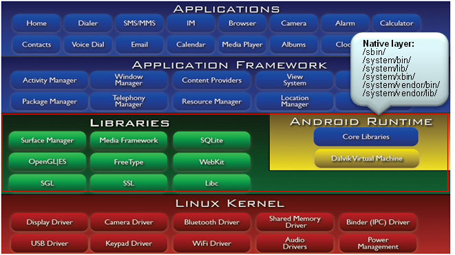

> 任何软件都可能存在BUG，调试和修复BUG伴随着整个开发流程，因此异常分析非常重要。如果是native层发生异常，我们一般称之为叫NE（native exception）

<!--more-->

**异常可能发生任何一层，如果是：**

+ kernel层发生异常，叫KE（kernel exception）
+ native层发生异常，叫NE（native exception）
+ java成异常，叫JE（java exception）

# 1. NE简介

> Native层是由各种lib/binary组成，这一层发生异常，我们称之为NE（native exception）  
> 一般我们用offline调试，通过coredump借助gdb或trace32来调试。首先要先熟悉下linux信号和ptrace机制，coredump是通过信号触发生成的。`coredump是进程空间保存到文件系统的镜像，因此能看到异常时刻的所有变量值，就可以知道问题出在哪里。`  
> Android是基于linux的，发生异常时，Android扩展了调试机制，这个机制是debuggerd机制。在没有coredump下，debuggerd以log或者tombstone的方式输出异常信息。

本地应用程序是指可以直接运行在操作系统上，并且处理器直接执行机器码的程序。

在Android上，OS是linux，因此各种bin程序就是所谓的`natvie application`，比如/system/bin目录下的所有文件。

这些应用程序都是由GCC(c/c++)编译生成。

在Android软件架构里，这些应用程序组成了native layer:



native layer里的应用程序崩溃统称为Native Exception，即NE，比如空指针，非法指针，程序跑飞，内存踩坏等。

## 1.1. 发生NE流程

原始的linux，对于用户进程崩溃之后，处理方式有2种：

1. 直接终止进程；
2. 输出coredump再终止进程

而在Android，为了方便调试，在收到崩溃信号后，会先输出tombstone，然后在根据设置是否抓取coredump，最后再终止进程。

**如果发生NE，内核会抛出信号，可以通过kernel log搜索`sig 11/7`等几个可以导致进程崩溃的关键字判断。**

此处的信号注册是发生在动态链接程序加载的时候，链接器（linker）负责将应用程序所需的库加载到进程空间内，然后跑应用程序大妈。linker在执行期间会注册信号。

流程：__linker_init() -> __linker_init_post_relocation() -> debuggerd_init()

***

## 1.2. 信号处理

目前会产生native exception（NE）的几个信号需要特别掌握产生的原因，这样才能进一步分析问题所在。

内核发送信号过来后会执行`debuggerd_init()`里注册的函数debugger_signal_handler()，该函数会打印基本信息到main log：

`logSignalSummary()`函数会输出基本异常信息，类似`libc: Fatal signal 11(SIGSEGV) at 0x000 ...`日志打印。

然后连接debuggerd的socket，将pid等信息发送给debuggerd，请它帮忙后续的处理。之后将对应的信号恢复为默认，等待debuggerd处理完后抓取coredump。

***

# 2. debuggerd服务

关于上面的debuggerd服务，是由init.rc启动起来，具体代码在`system/core/debuggerd/`。

debuggerd起来后会创建1个socket，然后监听，等待别人通过socket请求服务，服务可以是生成tombstone或调用栈。

## 2.1. 使用debuggerd命令查看指定tid的调用栈和tombstone

+ `adb shell debuggerd -b $tid`：抓取指定tid的调用栈
+ `adb shell debuggerd $tid`：抓取指定tid的tombstone

## 2.2. ptrace attach/detach

通过socket拿到tid等资料后，使用ptrace attach上目标tid，之后就可以通过ptrace访问目标进程空间，然后打印一些NE相关的寄存器/调用栈等信息。

1. ptrace attach：ptrace attach会发送`sig 19`给对应的进程。在这里，我们将进程内所有线程都attach上，防止有线程提前退出。
2. ptrace cont：attach之后还不能直接访问目标进程，因为目标进程还处于信号处理函数里面，我们需要让它恢复到异常现场，因此需要用ptrace cont让其继续执行。
3. waitpid：程序接着往下跑必然会再次发生异常（如果是SIGABRT,SIGFPE,SIGPIPE,SIGSTKFLT，则会在信号处理函数重发一次信号），kernel会再次发出信号，只不过由于进程被ptrace了，信号会送给debuggerd。**到这里，目标进程已经收到2次同样的信号了**
4. `tombstone`:debuggerd收到信号后，就可以生成tombstone了
5. ptrace detach: 完成工作后，需要detach ptrace，然后发送`sig 18`让其继续奔跑。如果是访问空指针等错误，程序会再次发生异常，由于在信号处理函数里已经将对应信号恢复默认，因此可能会产生coredump。

***

## 2.3. 产生db文件

> debuggerd完成之后会通知aee，aee就开始了打包db的工作，具体生成在`/data/aee_exp`目录

1个完整的NE的db，里面除了coredump还有其他文件，包含log文件(main/event/radio)，详细的NE信息文件(_exp_main/_exp_detail)等，这些文件绝大部分是通过aee_dumpstate保存起来的。

### 2.3.1. PROCESS_MAPS文件描述进程空间

db中有些文件对分析NE是至关重要的，比如PROCESS_MAPS，这文件就是`/proc/$pid/maps`，里面是对进程空间的描述。

例如以下部分截取的内容：

```s
//1-进程里地址范围            2-虚拟内存的权限（r=读/w=写/x=可执行/s=共享/p=私有）
//3-空间所映射的文件的偏移量    4-空间所映射的文件的主次设备号
//5-空间所映射的文件的节点号（0表示没有节点映射到内存）   6-空间所映射的文件的路径
7ec808a000-7ec808b000 --xp 00001000 fd:01 3989                           /system/lib64/libhardware.so
7ec808b000-7ec808c000 rw-p 00002000 fd:01 3989                           /system/lib64/libhardware.so
7ec808c000-7ec808d000 r--p 00003000 fd:01 3989                           /system/lib64/libhardware.so
```

***

# 3. Tombstone

> Android Native程序本质上就是一个Linux程序，因此当它在执行时发生严重错误，也会导致程序crash，然后产生一个记录crash的现场信息的文件，而这个文件在Android系统中就是tombstone文件。

从上面的分析看，发生NE的时候会创建tombstone文件，最多存在10个，如果已存在10个，会覆盖最旧的文件。

**组成部分：**

1. 版本信息：主要是fingerprint，可以看出异常版本是eng还是user
2. 寄存器信息：主要查看是哪个进程崩溃，信号是什么。寄存器信息需要配合下面的调用栈信息及数据信息结合GNU的工具（`objdump -S反汇编`）分析。
3. 调用栈信息：是最直接可以看出异常的信息（可以使用addr2line定位地址的代码函数对应位置）
4. 其他线程信息：如果异常线程和其他线程有逻辑关系的话，可以查看对应线程的信息
5. main log信息：全面的log建议还是查看main log

## 3.1. 调用栈

最直接查看栈的位置就是log和Tombstone文件中。

C/C++语言的过程调用都需要栈，正在执行的函数有属于自己的栈帧，函数内部的局部变量就放在栈帧里，当然还会存放函数的返回地址，这样函数执行结束之后才知道返回到哪里。

不同的栈帧关联在一起就会形成一个调用链，最顶端表示当前正在执行的函数，第2行表示调用它的函数，以此类推（先进后出）。

例如以下栈：

> `库里的偏移`：库默认都加载在0地址的，由OS随机加载在mmap区域，因此实际上库函数的地址都是`基址+偏移量`，其中的基址就是库加载的地址，这个地址可以从`/proc/$pid/maps`看到每个库的基址。

```log
backtrace:
      #00 pc 00000000000e2f88  /apex/com.android.runtime/lib64/bionic/libc.so (pthread_mutex_lock) (BuildId: ceedf0f98da575de138b0c631aceca44)
    //栈帧  +  地址       +       函数                                                 + 该函数的偏移量（+32） 
      #01 pc 00000000000c39a0  /system/lib64/libgui.so (android::SurfaceControl::getHandle() const+32) (BuildId: d26a01ac90bf9cf5c7585e3fbbdbb327)
      #02 pc 0000000000120a28  /system/lib64/libandroid_runtime.so (android::nativeGetHandle(_JNIEnv*, _jclass*, long)+40) (BuildId: 5bd8af36fc54644383069436f63eec83)
...
```

# 4. addr2line命令

针对发生Native Crash的堆栈，将地址转换为地址所在的文件及行数(显示所在函数)

该命令可以用来解析so动态链接库（Symbol目录），分析单个pc地址对应的函数，然后参照代码寻找问题发生处。

含有调试信息的库或程序必须和手机里的库或程序是同一次编译生成的，否则得到的PC值和库里的调试信息不匹配。

> 如何确定库或程序含有调试信息呢？或者说如何确定库能不能用来调试呢？是不是symbol目录下的库呢？

> 用file命令即可查看：`file xxx`

+ 如果没有含debug信息的话，会显示：`xxx: ELF 32-bit LSB shared object, ARM, version 1 (SYSV), dynamically linked, stripped`
+ 含有调试信息的话，则显示：`xxx: ELF 32-bit LSB shared object, ARM, version 1 (SYSV), dynamically linked, not stripped`

例如：（需要在Symbol目录下）

`addr2line -Cfe .so address`

```s
/out/target/product/product/symbols/system/lib64$ addr2line -f -e libgui.so 00000000000c39a0
_ZNK7android12SortedVectorINS_12DisplayStateEE16do_move_backwardEPvPKvm
```

解释：-e 后加上.so的文件名；-f 可同时输出函数名称

+ `-e --exe=<executable>`: 设置要查询地址的文件(默认: a.out)一般是*.so/*.a和可执行程序。此文件必须带有debug信息，在android codebase里是放在out/target/product/$project/symbols目录下
+ `-f –functions`: 显示地址所在的函数名
+ `-C --demangle[=style]`: 反重整函数名为可读方式

# 5. objdump

`objdump –S **.so > **.asm `

该命令是用来把相应的so变成汇编语言的asm文件，然后根据地址信息就可以找到更加详细的相关函数信息。

即查看对象文件(*.so/*.a或应用程序)的内容信息

或者

`symbols/out/target/product/project/symbols$ objdump -tT system/lib64/libgui.so`

后缀|含义
:-:|:-:
-S 或 --source|尽可能反汇编出源代码，尤其当编译的时候指定了-g这种调试参数时，效果比较明显。隐含了-d参数
-t 或 --syms|显示文件的符号表入口。类似于nm -s提供的信息
-T 或 --dynamic-syms|显示文件的动态符号表入口，仅仅对动态目标文件意义，比如某些共享库。它显示的信息类似于`nm -D|--dynamic`显示的信息

# 6. nm命令

作用是：列出该文件的符号(函数，变量，文件等)，包含名字、地址、大小

***

# 7. ndk-stack

> 用来把log信息全部翻译成更加详细的带源码行数信息的log，相当于是在整个crash堆栈信息都执行addr2line命令。

ndk-stack -sym  [.../obj/local/{ABI类型}/]   -dump crash.log

***

# 8. readelf

查看elf文件(*.so/*.a或应用程序)的内容信息，可以使用`readelf -a [.so/.bin]`解析库地址。

***

# 9. c++filt

反重整C++符号为可读方式。

根据解析结果查询函数，C++在linux系统编译后会变成类似`_ZNK...`的修饰名。使用`c++filt`获取函数的原始名称。

`c++filt [_ZNK...函数修饰名]`

***

# 10. 参考

+ 关于不同版本aee db文件的抓取：https://blog.csdn.net/topsecrethhh/article/details/81453414
+ coredump配置、产生、分析以及分析示例：https://www.cnblogs.com/arnoldlu/p/11160510.html
+ Android Debuggerd 简要介绍和源码分析：https://www.cnblogs.com/lance-ehf/p/4249605.html