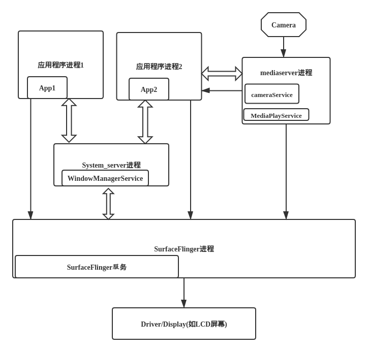
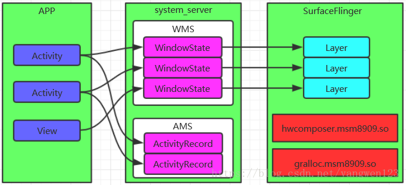
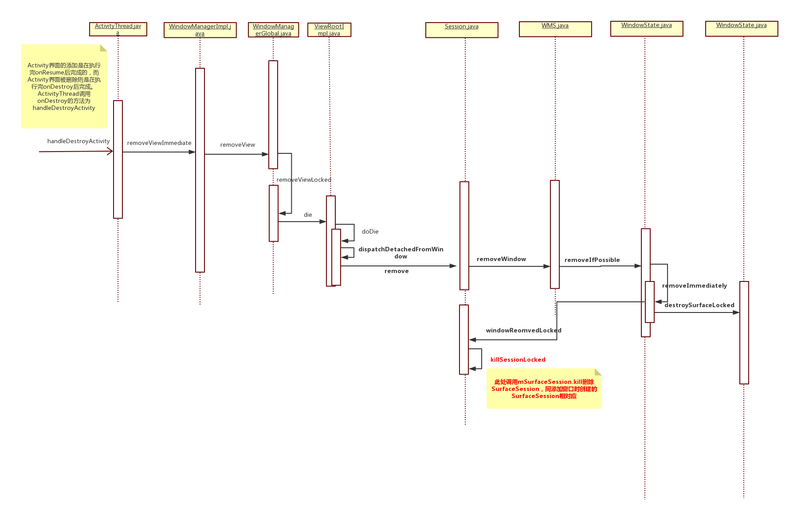
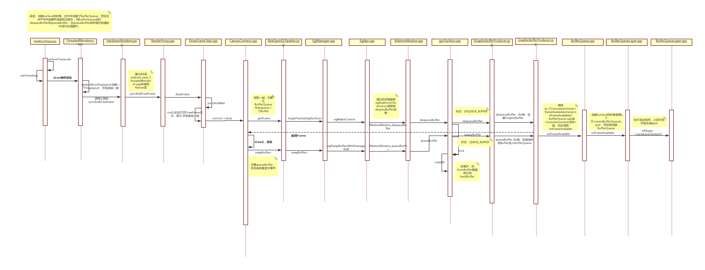
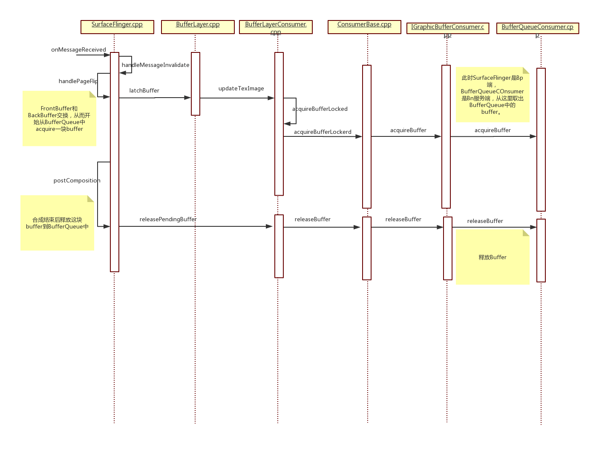

> 本篇对Android图形显示框架做一个概述，内容主要包含：SurfaceSession创建和销毁（添加/删除窗口），Surface创建和销毁，BufferQueue创建，以及BufferQueue的dequeueBuffer和queueBuffer、acquire和release大致流程梳理。

<!--more-->

# 1. 显示框架概述

Android与用户进行图形界面的交互，例如各个应用程序，他们的对话框、按钮、菜单等图形窗口。这些窗口的管理都是由WindowManager负责，窗口管理位于Java层，真正的实现者是运行在System_server进程空间中的WindowManagerService。

```java
//frameworks/base/services/java/com/android/server/SystemServer.java
    /**
     * Starts a miscellaneous grab bag of stuff that has yet to be refactored and organized.
     */
    private void startOtherServices() {
        .......
            traceBeginAndSlog("StartWindowManagerService");
            // WMS needs sensor service ready
            ConcurrentUtils.waitForFutureNoInterrupt(mSensorServiceStart, START_SENSOR_SERVICE);
            mSensorServiceStart = null;
            wm = WindowManagerService.main(context, inputManager, !mFirstBoot, mOnlyCore,
                    new PhoneWindowManager(), mActivityManagerService.mActivityTaskManager);
            ServiceManager.addService(Context.WINDOW_SERVICE, wm, /* allowIsolated= */ false,
                    DUMP_FLAG_PRIORITY_CRITICAL | DUMP_FLAG_PROTO);
            ServiceManager.addService(Context.INPUT_SERVICE, inputManager,
                    /* allowIsolated= */ false, DUMP_FLAG_PRIORITY_CRITICAL);
            traceEnd();
        ......
    }
```

应用程序负责修改绘制窗口中的内容，而WindowManager负责窗口的生命周期、几何属性、坐标变换信息、用户输入焦点、动画等功能。他还管理着窗口状态的变化，如窗口位置、大小、透明度以及Z-order（前后遮盖顺序）等一系列的逻辑判断。这些WindowManager功能由一系列接口或类构成，包括ViewManager、WindowManager、WindowManagerImpl、WindowManagerService等。

SurfaceFlinger负责分配应用程序所需的图形缓冲区，并对系统中的整个图形窗口进行composition（合成）。

最终，图形窗口会更新显示到Display显示器上。



***

## 1.1. 显示过程的三个进程

Android显示的整个过程由App进程、System_server进程、SurfaceFlinger进程一起配合完成。

1. App进程： App需要将自己的内容显示在屏幕上，所以需要负责发起Surface创建的请求。同时触发对控件的测量、布局、绘制以及输入事件的派发处理，这些主要在ViewRootImpl中触发；

2. System_server进程： 主要是WindowManagerService，负责接收App请求，同时和SurfaceFlinger建立连接，向SurfaceFlinger发起具体请求创建Surface，并且创建Surace的辅助管理类SurfaceControl（和window一一对应）(AMS作用是统一调度所有App的Activity)；

3. SurfaceFlinger： 为App创建具体的Surface，在SurfaceFLinger对应成Layer，然后负责管理、合成所有图层，最终显示。



***

## 1.2. Activity、Window、PhoneWindow、DecorView、View的对应关系

1. Window：每一个Activity都包含一个Window对象（抽象类，提供了绘制窗口的一组通用API），通常由PhoneWindow实现。

在Activity.java中定义：`private Window mWindow;`

+ 一个Activity对应创建一个Surface

2. PhoneWindow:继承于Window，是Window类的具体实现。该类内部包含了一个DecorView对象，该DecorView对象是所有应用窗口（Activity界面）的根View。

简而言之，PhoneWindow类是把一个FrameLayout类，即DecorView对象进行一定的包装，将他作为应用窗口的根View，并提供一组通用的窗口操作接口。

PhoneWindow是Android中最基本的窗口系统，每个Activity都会创建一个PhoneWindow对象，是Activity和整个View系统交互的接口。

在Activity.java的attach函数实例化：`mWindow = new PhoneWindow(this, window, activityConfigCallback);`

3. DecorView：PhoneWindow构造函数中定义，继承FrameLayout类，是所有应用窗口的根View。

在PhoneWindow.java中定义，构造函数中初始化：`private DecorView mDecor;`

**相关debug方法：**

+ adb shell dumpsys activity
+ adb shell dumpsys window

![window包含关系]](../../assets/post/2020/2020-07-30-android_GraphicsFramework/phonewindow.png)

***

## 1.3. Activity生命周期

> Activity onResume添加窗口

onCreate方法中调用setContentView来设置布局，此时只是完成了View Tree的创建。[此处参考HWUI绘制文章](https://wizzie.top/Blog/2020/07/07/2020/200707_android_HWUI_Draw/#%E7%BB%98%E5%88%B6%E5%BA%8F%E5%88%97%E5%9B%BE)

真正通知WMS添加窗口，是在回调onResume完成的。

调用onResume的方法在ActivityThread.java中是`handleResumeActivity`。之后调用到WMS.java的addWindow。


***

### 1.3.1. App进程中完成添加窗口操作

1. 当一个新窗口(Window)被创建的时候，在ActivityThread.java的`handleResumeActivity`中调用addView(),然后调用到`WindowManagerImpl`的addView()函数。

```java
//frameworks/base/core/java/android/view/WindowManagerImpl.java
    @Override
    public void addView(@NonNull View view, @NonNull ViewGroup.LayoutParams params) {
        applyDefaultToken(params);
        mGlobal.addView(view, params, mContext.getDisplay(), mParentWindow);
    }
```

2. 这个函数将实际操作委托给mGlobal成员完成，这个成员随着WindowManagerImpl的创建而被初始化：`private final WindowManagerGlobal mGlobal = WindowManagerGlobal.getInstance();`

**WindowManagerGlobal是一个单例模式，即一个进程中最多仅有一个WindowManagerGlobal实例。**

3. 调用mGlobal的addView函数后，将会创建一个ViewRootImpl对象，并且将窗口的控件、布局参数、ViewRootImpl对象入参到setView函数中，这个动作将导致**ViewRootImpl向WMS添加新的窗口、申请Surface创建、绘制动作等**。这才真正意义的完成了窗口的添加操作。

```java
//frameworks/base/core/java/android/view/WindowManagerGlobal.java
    public void addView(View view, ViewGroup.LayoutParams params,
            Display display, Window parentWindow) {
                ......
            root = new ViewRootImpl(view.getContext(), display);

            view.setLayoutParams(wparams);

            mViews.add(view);
            mRoots.add(root);
            mParams.add(wparams);

            // do this last because it fires off messages to start doing things
            try {
                root.setView(view, wparams, panelParentView);
            } catch (RuntimeException e) {
                // BadTokenException or InvalidDisplayException, clean up.
                if (index >= 0) {
                    removeViewLocked(index, true);
                }
                throw e;
            }
        }
    }
```

***

### 1.3.2. 窗口移除序列图（Activity destroy）

窗口被删除，Activity执行了handleDestroyActivity函数：



### 1.3.3. Surface Destroy（Activity pause或者stop状态）

> 可以结合以下`Surface创建部分`一起梳理，针对的情况是Surface被destroy，从framework/base到SurfaceFlinger模块Layer析构的流程。  
> 但是就Activity而言，并没有被销毁，而是类似按了home键返回桌面，或者在后台运行的状态，具体可以通过日志观察。


***

# 2. SurfaceSession创建

> 此处是接着上面添加窗口的流程，分为以下两部分。

## 2.1. mGlobal.addView中创建ViewRootImpl对象

1. 新建ViewRootImpl对象的时候，调用构造函数，会从WindowManagerGlobal中获取一个窗口session。

`mWindowSession = WindowManagerGlobal.getWindowSession();`

2. 在WindowManagerGlobal中会通过Binder IPC跨进程创建一个session。

Session主要用于进程间通信，其他应用程序想要和WMS通信就需要经过Session，每个应用程序进程都会对应一个Session，WMS保存这些Session用来记录所有向WMS提出窗口管理服务的客户端。

```java
//frameworks/base/core/java/android/view/WindowManagerGlobal.java
@UnsupportedAppUsage
    public static IWindowSession getWindowSession() {
        synchronized (WindowManagerGlobal.class) {
            if (sWindowSession == null) {
                try {
                    // Emulate the legacy behavior.  The global instance of InputMethodManager
                    // was instantiated here.
                    // TODO(b/116157766): Remove this hack after cleaning up @UnsupportedAppUsage
                    InputMethodManager.ensureDefaultInstanceForDefaultDisplayIfNecessary();
                    //获取WMS对象
                    IWindowManager windowManager = getWindowManagerService();
                    //创建Session
                    sWindowSession = windowManager.openSession(
                            new IWindowSessionCallback.Stub() {
                                @Override
                                public void onAnimatorScaleChanged(float scale) {
                                    ValueAnimator.setDurationScale(scale);
                                }
                            });
                } catch (RemoteException e) {
                    throw e.rethrowFromSystemServer();
                }
            }
            return sWindowSession;
        }
    }
```

3. WMS继承IWindowManager.Stub，调用到openSessio函数，创建一个新的session对象, 返回值是IWindowSession类型。用于在APP进程和WMS之间建立联系。

```java
//frameworks/base/services/core/java/com/android/server/wm/WindowManagerService.java

final class H extends android.os.Handler {
    @Override
    public IWindowSession openSession(IWindowSessionCallback callback) {
        return new Session(this, callback);
    }
}
```

## 2.2. mGlobal.addView中调用ViewRootImpl.setView

在前面mGlobal创建ViewRootImpl对象之后，会调用ViewRootImpl对象的setView，然后通知到WMS创建一个SurfaceSession，建立WindowManagerService和Surfacelinger的连接。

一个SurfaceSession代表着一个到SurfaceFlinger的连接会话，在这个连接会话里，可以创建一个或多个surface，最后这些surface被合成送到Display上显示。

大致过程：（查看下面的序列图）

1. 在setView()中调用mWindowSession.addToDisplay, mWindowSession是IWindowSession接口类型，而Session.java实现了该接口；
2. Session.java 中调用mService.addWindow(…), mService是WMS类型；
3. WMS.java的addWindow()创建WindowState对象win，调用win.attach()
4. frameworks/base/services/core/java/com/android/server/wm/WindowState.java  调用attach
5. frameworks/base/services/core/java/com/android/server/wm/Session.java  调用windowAddedocked，创建SurfaceSession类型的mSurfaceSession
6. frameworks/base/core/java/android/view/SurfaceSession.java  构造函数调用JNI，然后在android_view_SurfaceSession.cpp中的nativeCreate创建SurfaceComposerClient, 调用Refase的incStrong然后实现onFirstRef,通过调用CreateConnection()建立和SF的连接;
7. SF.cpp  调用CreateConnection()返回SF的Client类的Binder代理BpSurfaceComposerClient;

***

# 3. Surface创建

## 3.1. App进程请求创建Surface

Surface是Android图形系统的核心部分，图形界面上的一个窗口或对话框等都对应着一个Surface。

而这个Surface是一块绘制区域的抽象，它对应着Server服务端Surfacelinger中的一个图层Layer，这个图层的背后是一块图形缓冲区GraphicBuffer，Client客户端的应用程序的UI使用软件绘制、硬件绘制在Surface上各种渲染操作时，绘制操作的结果其实也就是在该图形缓冲区中。

这部分的内容是梳理Surface创建的过程。

1. 在ViewRootImpl对象中，`setView到requestLayout函数请求布局，到调用scheduleTraversals`，该函数里面在Choreographer.java层层调用到`Message msg = mHandler.obtainMessage(MSG_DO_SCHEDULE_CALLBACK, action);`

此处的action即是新的线程启动。

2. 启动ViewRootImp中单独的线程TraversalRunnable，然后调用到关键函数`performTraversals()`。

这个关键函数有两个主要的函数:

+ relayoutWindow()   ->布局窗口
+ performDraw()    ->绘制渲染

请求创建Surface就从relayoutWindow函数开始。

在这个方法中调用IWindowSession的relayout，会调用到Session.java，然后调用到WMS的relayoutWindow从而达到跨进程：（流程图查看下面单独章节的序列图）

```java
//frameworks/base/core/java/android/view/ViewRootImpl.java
    private int relayoutWindow(WindowManager.LayoutParams params, int viewVisibility,
            boolean insetsPending) throws RemoteException {
                ......
        //此处relayout会调用到WMS的relayoutWindow
        int relayoutResult = mWindowSession.relayout(mWindow, mSeq, params,
                (int) (mView.getMeasuredWidth() * appScale + 0.5f),
                (int) (mView.getMeasuredHeight() * appScale + 0.5f), viewVisibility,
                insetsPending ? WindowManagerGlobal.RELAYOUT_INSETS_PENDING : 0, frameNumber,
                mTmpFrame, mPendingOverscanInsets, mPendingContentInsets, mPendingVisibleInsets,
                mPendingStableInsets, mPendingOutsets, mPendingBackDropFrame, mPendingDisplayCutout,
                mPendingMergedConfiguration, mSurfaceControl, mTempInsets);
        if (mSurfaceControl.isValid()) {
            mSurface.copyFrom(mSurfaceControl);
        } else {
            destroySurface();
        }
            }
```

***

## 3.2. System_server进程 —— WMS

1. 跨进程到WMS后，从relayoutWindow函数调用到`createSurfaceControl(outSurfaceControl)`。

（1）然后先是在WindowStateAnimator创建一个WindowSurfaceController对象，作为调用到WindowStateAnimator.java的`createSurfaceLocked`函数的返回值。

在createSurfaceLocked函数中，会new一个WindowSurfaceController对象，从而调用他的构造函数。

在他的构造函数中会创建一个SurfaceControl内部类Builder对象，调用该对象的build函数；

(2) WMS.java中调用WindowStateAnimator.java的`createSurfaceLocked`函数之后，会执行以下逻辑：

a. 如果surfaceController不为空，调用WindowSurfaceController的getSurfaceControl；

b. WindowSurfaceController.java调用getSurfaceControl, `outSurfaceControl.copyFrom(mSurfaceControl); `，而mSurfaceControl就是之前的构造函数创建的。此处的copyFrom会经过JNI调用到Native层, 然后读取SurfaeControl。

2. 在Builder内部类的build函数中`创建Java层的SurfaceControl对象`，在SurfaceControl的构造函数中调用JNI层的nativeCreate函数；

3. android_view_SurfaceControl.cpp的nativeCreate函数会调用SurfaceComposerClient.cpp的`createSurfaceChecked`函数，`创建一个surface（实际上是SurfaceControl）`，然后将surface返回。


***

## 3.3. SurfaceFlinger进程

SurfaceComposerClinet.cpp位于frameworks/native/libs/gui模块。而`libgui库主要被JNI层中的代码调用，从而和Surfacelinger进程进行交互`，可以看做是Java层的Bn端，是SurfaceFlinger的Bp端。

比如此处的SurfaceComposerClinet通过Binder IPC（ISurfaceComposerClinet.cpp），跨进程到SurfaceFlinger进程。

1. SurfaceComposerClinet作为Bp客户端调用：

```cpp
//frameworks/native/libs/gui/SurfaceComposerClient.cpp
status_t SurfaceComposerClient::createSurfaceChecked(const String8& name, uint32_t w, uint32_t h,
                                                     PixelFormat format,
                                                     sp<SurfaceControl>* outSurface, uint32_t flags,
                                                     SurfaceControl* parent,
                                                     LayerMetadata metadata) {
    sp<SurfaceControl> sur;
    status_t err = mStatus;

    if (mStatus == NO_ERROR) {
        sp<IBinder> handle;
        sp<IBinder> parentHandle;
        sp<IGraphicBufferProducer> gbp;

        if (parent != nullptr) {
            parentHandle = parent->getHandle();
        }

        err = mClient->createSurface(name, w, h, format, flags, parentHandle, std::move(metadata),
                                     &handle, &gbp);
        ALOGE_IF(err, "SurfaceComposerClient::createSurface error %s", strerror(-err));
        if (err == NO_ERROR) {
            *outSurface = new SurfaceControl(this, handle, gbp, true /* owned */);
        }
    }
    return err;
}
```

2. Bn服务端是surfaceflinger模块的Client.cpp，此时跨进程到SurfaceFlinger进程，调用createSurface，从而请求到SurfaceFlinger创建Surface：

```cpp
//frameworks/native/services/surfaceflinger/Client.cpp
status_t Client::createSurface(const String8& name, uint32_t w, uint32_t h, PixelFormat format,
                               uint32_t flags, const sp<IBinder>& parentHandle,
                               LayerMetadata metadata, sp<IBinder>* handle,
                               sp<IGraphicBufferProducer>* gbp) {
    // We rely on createLayer to check permissions.
    return mFlinger->createLayer(name, this, w, h, format, flags, std::move(metadata), handle, gbp,
                                 parentHandle);
}
```

3. 在SurfaceFlinger::createLayer中创建Layer（创建surface的请求到SurfaceFlinger进程中就是创建Layer），创建的Layer有四种：

（1）createBufferQueueLayer
（2）createBufferStateLayer
（3）createColorLayer
（4）createContainerLayer

通常情况下创建的是第一种Layer——BufferQueueLayer（在P中是BufferLayer），会创建一个`<sp>BufferQueueLayer强指针对象`。

```cpp
//SF.cpp
status_t SurfaceFlinger::createBufferQueueLayer(const sp<Client>& client, const String8& name,
                                                uint32_t w, uint32_t h, uint32_t flags,
                                                LayerMetadata metadata, PixelFormat& format,
                                                sp<IBinder>* handle,
                                                sp<IGraphicBufferProducer>* gbp,
                                                sp<Layer>* outLayer) {
.....
    sp<BufferQueueLayer> layer = getFactory().createBufferQueueLayer(
            LayerCreationArgs(this, client, name, w, h, flags, std::move(metadata)));
    status_t err = layer->setDefaultBufferProperties(w, h, format);
    if (err == NO_ERROR) {
        *handle = layer->getHandle();
        *gbp = layer->getProducer();
        *outLayer = layer;
    }

    ALOGE_IF(err, "createBufferQueueLayer() failed (%s)", strerror(-err));
                                                }
```

***

# 4. 序列图

> 该序列图包含上面部分的流程，包含APP进程和WMS进程之间的Session创建、SurfaceSession创建、**Surface创建**。


***

# 5. BufferQueue

> 关于BufferQueue只大致梳理他的创建流程，以及在渲染过程中的dequeuebuffer和queuebuffer流程、在合成过程中的acquire和release流程。关于和GraphicsBuffer和再底层的逻辑，暂时不梳理。

## 5.1. BufferQueue概述

创建BuffeQueueLayer对象的onFirstRef中会创建一个BufferQueue。BufferQueue是buffer流转的中转站。具体分成四个步骤：

1. 生产者dequeue一块buffer，buffer状态->DEQUEUED，持有者->Producer，之后生产者可以填充数据（渲染绘制）。在dequeueBuffer之前，buffer状态是free，持有者是BufferQueue；
2. 生产者填充完数据后，进行queue操作，buffer->QUEUED，持有者->BufferQueue。操作后producer会回调BufferQueue的onFrameAvailable函数，通知消费者有可用的buffer;
3. 消费者进行acquire取出Buffer，buffer->ACQUIRED，持有者->Consumer;
4. 消费者消费完这块buffer（已经合成），进行release操作释放，归还给BufferQueue


***

## 5.2. BufferQueue状态

+ DEQUEUED 状态：

Producer dequeue一个Buffer后，这个Buffer就变为DEQUEUED状态，release Fence发信号后，Producer就可以修改Buffer的内容，我们称为release Fence。此时Buffer被Producer占用。

DEQUEUED状态的Buffer可以迁移到 QUEUED 状态，通过queueBuffer或attachBuffer流程。也可以迁移到FREE装，通过cancelBuffer或detachBuffer流程。

+ QUEUED 状态：

Buffer绘制完后，queue到BufferQueue中，给Consumer进行消费。此时Buffer可能还没有真正绘制完成，必现要等对应的Fence发信号出来后，才真正完成。此时Buffer是BufferQueue持有，可以迁移到ACQUIRED状态，通过acquireBuffer流程。而且可以迁移到FREE状态，如果另外一个Buffer被异步的queue进来。

+ ACQUIRED 状态：

Buffer已经被Consumer获取，但是也必须要等对应的Fence发信号才能被Consumer读写，找个Fence是从Producer那边，queueBuffer的时候传过来的。我们将其称为acquire fence。此时，Buffer被Consumer持有。状态可以迁移到FREE状态，通过releaseBuffer或detachBuffer流程。除了从acquireBuffer流程可以迁移到ACQUIRED状态，attachBuffer流程也可以迁移到ACQUIRED状态。

+ FREE 状态：

FREE状态，说明Buffer被BufferQueue持有，可以被Producer dequeue，它将迁移到DEQUEUED状态，通过dequeueBuffer流程。

+ SHARED状态：

SHARED状态是一个特殊的状态，SHARED的Buffer并不参与前面所说的状态迁移。它说明Buffer被用与共享Buffer模式。除了FREE状态，它可以是其他的任何状态。它可以被多次dequeued, queued, 或者 acquired。这中共享Buffer的模式，主要用于VR等低延迟要求的场合。

***

## 5.3. BufferQueue创建以及创建一个监听

在`BufferQueueLayer::onFirstRef`调用BufferQueue::createBufferQueue()创建了bufferQueue、生产者、消费者，在创建生产者和消费者的过程中，将他们绑定到同一个BufferQueue上。

之后会创建一个BufferLayerConsumer对象mConsumer，这个对象继承了ConsumerBase类，所以会回调基类的构造函数，注册一个监听对象到BufferQueue（空对象）。

真正的监听是在`mConsumer->setContentsChangedListener(this)`基类构造函数中还会调用consumerConnect将消费者关联到BufferQueue中。此时监听对象就赋给了BufferQueue的mConsumerListener成员（调用BufferQueueConsumer的connect函数）。

这个监听对象会在queueBuffer是触发，由生产者回调注册到BufferQueue的帧可用通知。


***

# 6. DequeuBuffer

BufferQueue创建后，首先由生产者执行dequeueBuffer请求一块Buffer。

Dequeue和Queue的操作都是在硬件渲染(软件绘制暂不考虑)的过程中，在`ThreadedRenderer::draw`函数中，updateRootDisplayList创建好一个RootDisplayList后，开始渲染一帧，在这时调用父类的syncAndDrawFrame函数，这个函数层层调到CanvasContext::draw函数，然后依次调用三个函数：

1. mRenderPipeline->getFrame            执行dequeueBuffer请求一块buffer
2. draw                                 填充buffer
3. mRenderPipeline->swapBuffers         执行queueBuffer送到BufferQueue

在此处dequeuBuffer和queueBuffer两个操作调到gui/Surface.cpp的两个对应函数，这个流程基本一样。

大致都从`SkiaOpenPipeline.cpp -> EglManager.cpp -> eglApi.cpp -> ANativeWindow.cpp`，之后到Bp客户端libgui库的Surface.cpp，执行具体操作。

Surface::dequeueBuffer中调用IGraphicBufferProducer::dequeueBuffer。然后`remote()->transact(DEQUEUE_BUFFER,data,&reply)`调用到Bn端BufferQueueProducer::dequeueBuffer函数。

1. 首先查找mSlots[found]的序列号found，mSlots是存放Buffer的地方，他的数量是64。即至多存放64个buffer。
2. found是从waitForFreeSlotThenRelock中获取：

+ 从非Free的buffer中统计dequeue和acquire的数量；
+ 判断dequeueBufferCount数量不能大于最大允许dequeueBuffer的数量；
+ slot的获取主要来自两个集合，mFreeSlots和mFreeBuffers；两者包含的所有状态都是free，区别在于前者没有attached，后者以及attached；如果调用来自dequeueBuffer优先选择前者，如果调用来自attachBuffer，优先选择后者；
+ 如果没找到符合要求的buffer或者queue的buffer还有太多没有完成，就要等待这个buffer被acquired或者released，或者修改最大的buffer数量。

3. 找到可用的slot，还要判断是否重新分配空间：如果Buffer（本质上是GraphicBuffer）是空，并且需要重新分配空间，则对这个mSlots[found]初始化；
4. new GraphicBuffer为mSlots分配一个GraphicBuffer，赋值给BufferQueueCore中的变量mSlots[]的mGraphicBuffer；

`mSlots[*outSlot].mGraphicBuffer = graphicBuffer;`

`Surface::dequeueBuffer`从服务端申请到Buffer后，通过`requestBuffer`将客户端的buffer和服务端的buffer指向同一块物理内存。

具体是IGraphicBufferPruducer代理中通过REQUEST_BUFFER状态，在onTransact中将申请的GraphicBuffer，即`mSlots[slot].mGraphicBuffer`。将其写入reply，等待客户端读取。

***

## 6.1. QueueBuffer

queueBuffer是在渲染一帧后通过`mRenderPipeline->swapBuffers`调用到Surface::queueBuffer。将填充完数据的buffer放入BufferQueue，并且通过监听者通知消费者对象开始消费。

在Bn端BufferQueueProducer::queueBuffer L977中调用：`frameAvailableListener->onFrameAvailable(item);`

通知消费者，在BufferQueueLayer::onFrameAvailable中调用：`mFlinger->signalLayerUpdate();`

触发SurfaceFlinger的消息循环机制，开始处理SurfaceFlinger合成事件。

***

## 6.2. 序列图



## 6.3. acquire & release

消费者SurfaceFlinger通过acquire从BufferQueue取出一块buffer消费。消费（合成）之后释放。

## 6.4. 序列图

