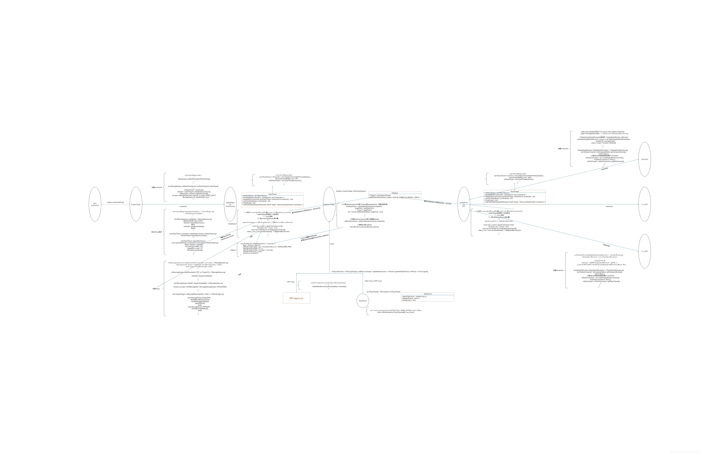

> 在HWUI渲染完成后，Buffer会在`frameworks/native/libs/gui/BufferQueueProducer.cpp`中通过queueBuffer放入BufferQueue，在该函数中调用`frameAvailableListener->onFrameAvailable(item)`通知consumer消费者，从而触发SurfaceFlinger合成。

<!--more-->

# 1. onFrameAvailable触发合成

1. 上面的frameAvailableListener对象类型是`sp<IConsumerListener> frameAvailableListener;`

参考[Android 图形显示框架](https://wizzie.top/Blog/2020/07/30/2020/200730_android_GraphicsFramework/)中的《Surface创建流程》，在该流程中会创建BufferQueue，调用`BufferQueue::createBufferQueue`函数。

2. 而`class ProxyConsumerListener : public BnConsumerListener...`是IConsumerListener接口的Bn端，所以会调用到下面代码：

BufferQueue中的frameAvailableListener，是一个IConsumerListener的接口，对应的Binder的Bn端实现为ProxyConsumerListener。

```cpp
//frameworks/native/libs/gui/BufferQueue.cpp
//头文件中
wp<ConsumerListener> mConsumerListener;

void BufferQueue::ProxyConsumerListener::onFrameAvailable(
        const BufferItem& item) {
    sp<ConsumerListener> listener(mConsumerListener.promote());
    if (listener != nullptr) {
        listener->onFrameAvailable(item);
    }
}
```

3. 在ConsumerBase.h中该类继承ConsumerListener。所以此处的mConsumerListener是ConsumerBase中的实现。

```cpp
//frameworks/native/libs/gui/include/gui/ConsumerBase.h
class ConsumerBase : public virtual RefBase,
        protected ConsumerListener {...}
```

```cpp
//frameworks/native/libs/gui/ConsumerBase.cpp
void ConsumerBase::onFrameAvailable(const BufferItem& item) {
    CB_LOGV("onFrameAvailable");

    sp<FrameAvailableListener> listener;
    { // scope for the lock
        Mutex::Autolock lock(mFrameAvailableMutex);
        listener = mFrameAvailableListener.promote();
    }

    if (listener != nullptr) {
        CB_LOGV("actually calling onFrameAvailable");
        listener->onFrameAvailable(item);
    }
}
```

4. 在BufferQueueLayer中，`class BufferQueueLayer : public BufferLayer, public BufferLayerConsumer::ContentsChangedListener{......}`。

而`class BufferLayerConsumer : public ConsumerBase...`

```cpp
//frameworks/native/services/surfaceflinger/BufferQueueLayer.cpp
void BufferQueueLayer::onFrameAvailable(const BufferItem& item) {
    ATRACE_CALL();
    // Add this buffer from our internal queue tracker
    { // Autolock scope
        if (mFlinger->mUseSmart90ForVideo) {
            const nsecs_t presentTime = item.mIsAutoTimestamp ? 0 : item.mTimestamp;
            mFlinger->mScheduler->addLayerPresentTimeAndHDR(mSchedulerLayerHandle, presentTime,
                                                            item.mHdrMetadata.validTypes != 0);
        }

        Mutex::Autolock lock(mQueueItemLock);
        // FrameNumber被重置时，同时重置mLastFrameNumberReceived
        if (item.mFrameNumber == 1) {
            mLastFrameNumberReceived = 0;
        }

        //确保mFrameNumber的顺序
        while (item.mFrameNumber != mLastFrameNumberReceived + 1) {
            status_t result = mQueueItemCondition.waitRelative(mQueueItemLock, ms2ns(500));
            if (result != NO_ERROR) {
                ALOGE("[%s] Timed out waiting on callback", mName.string());
            }
        }
        //将新的buffer放入Layer队列中，同时对mQueuedFrames+1操作
        mQueueItems.push_back(item);
        mQueuedFrames++;

        // Wake up any pending callbacks
        mLastFrameNumberReceived = item.mFrameNumber;
        mQueueItemCondition.broadcast();
    }
    //buffer属性保存到mInterceptor中
    mFlinger->mInterceptor->saveBufferUpdate(this, item.mGraphicBuffer->getWidth(),
                                             item.mGraphicBuffer->getHeight(), item.mFrameNumber);

    if (isRemovedFromCurrentState()) {
        fakeVsync();
    } else {
        //触发LayerUpdate
        mFlinger->signalLayerUpdate();
    }
    mConsumer->onBufferAvailable(item);
}
```

***

## 1.1. 类图

1. BufferQueueLayer有专门的Consumer，即BufferLayerConsumer。BufferLayerConsumer继承ConsumerBase。ConsumerBase通过IGraphicBufferConsumer和BufferQueue进行通信。  
2. BufferQueue中的frameAvailableListener，是一个IConsumerListener的接口，对应的Binder的Bn端实现为`ProxyConsumerListener`。
3. BufferQueueLayer实现了ContentsChangedListener，ContentsChangedListener继承FrameAvailableListener。BufferQueueLayer的Listener实现，被传给了ConsumerBase。  
4. `ConsumerBase实现ConsumerListener接口，构建ConsumerBase时，会创建ProxyConsumerListener`，将ConsumerBase实现的Listener接口传给ProxyConsumerListener。
5. BufferQueue中Listener回调时，会回调到ConsumerBase中。ConsumerBase中再通过BufferQueueLayer实现的，传下来的Listener回调到BufferLayer中。


***

# 2. MessageQueue消息队列

> Android的消息处理机制请参考：[Android Handler消息循环处理机制(例ActivityThread)](https://wizzie.top/Blog/2019/09/22/2019/190922-android-handler-cpp/#SurfaceFlinger%E7%9A%84%E6%B6%88%E6%81%AF%E5%A4%84%E7%90%86%E6%9C%BA%E5%88%B6)

在SurfaceFlinger模块有单独的MessageQueue处理流程。在SF创建的时候，构造函数会创建`meventqueue`对象。在其onFirstRef函数中调用`mEventQueue->init(this);`进行初始化。

MessageQueue初始化时，创建了一个Looper和Handler。

```cpp
//frameworks/native/services/surfaceflinger/Scheduler/MessageQueue.cpp
void MessageQueue::init(const sp<SurfaceFlinger>& flinger) {
    mFlinger = flinger;
    mLooper = new Looper(true);
    mHandler = new Handler(*this);
}
```

## 2.1. setEventThread变更

在Android Q中，EventThread的`setEventThread`操作具体在`SurfaceFlinger::enableVSyncInjections`中进行。

而非之前的是在SurfaceFlinger的init初始化函数中。

```cpp
//SF.cpp
//头文件
//mEventQueue是MessageQueue的一个栈对象
std::unique_ptr<MessageQueue> mEventQueue;

status_t SurfaceFlinger::enableVSyncInjections(bool enable) {
    postMessageSync(new LambdaMessage([&] {
        ......

        // TODO(b/128863962): Part of the Injector should be refactored, so that it
        // can be passed to Scheduler.
        if (enable) {
            ALOGV("VSync Injections enabled");
            if (mVSyncInjector.get() == nullptr) {
                mVSyncInjector = std::make_unique<InjectVSyncSource>();
                mInjectorEventThread = std::make_unique<
                        impl::EventThread>(mVSyncInjector.get(),
                                           impl::EventThread::InterceptVSyncsCallback(),
                                           "injEventThread");
            }
            mEventQueue->setEventThread(mInjectorEventThread.get(), std::move(resyncCallback));
        } else {
            ALOGV("VSync Injections disabled");
            mEventQueue->setEventThread(mScheduler->getEventThread(mSfConnectionHandle),
                                        std::move(resyncCallback));
        }

        mInjectVSyncs = enable;
    }));

    return NO_ERROR;
}
```

setEventThread函数做了两件事：

1. 创建一个BitTube对象mEventTube
2. 创建一个EventConnection

```cpp
//frameworks/native/services/surfaceflinger/Scheduler/MessageQueue.cpp
//头文件，是BitTube对象
gui::BitTube mEventTube;

void MessageQueue::setEventThread(android::EventThread* eventThread,
                                  ResyncCallback resyncCallback) {
    if (mEventThread == eventThread) {
        return;
    }

    if (mEventTube.getFd() >= 0) {
        mLooper->removeFd(mEventTube.getFd());
    }

    mEventThread = eventThread;
    mEvents = eventThread->createEventConnection(std::move(resyncCallback));
    //将mEventTube和EventConnection关联
    mEvents->stealReceiveChannel(&mEventTube);
    //将fd添加到MessageQueue的Looper中
    //Looper的callback（入参）为MessageQueue::cb_eventReceiver
    //一旦有数据到来就会调用cb_eventReceiver
    mLooper->addFd(mEventTube.getFd(), 0, Looper::EVENT_INPUT, MessageQueue::cb_eventReceiver,
                   this);
}

//data为MessageQueue本身有数据到来就会调用，作用是负责处理EventThread发送过来的信号
int MessageQueue::cb_eventReceiver(int fd, int events, void* data) {
    MessageQueue* queue = reinterpret_cast<MessageQueue*>(data);
    return queue->eventReceiver(fd, events);
}
```

```cpp
//frameworks/native/services/surfaceflinger/Scheduler/EventThread.cpp
//创建connection
sp<EventThreadConnection> EventThread::createEventConnection(ResyncCallback resyncCallback) const {
    return new EventThreadConnection(const_cast<EventThread*>(this), std::move(resyncCallback));
}

//Connection创建的时候先调用OnFirstRef进行注册
void EventThreadConnection::onFirstRef() {
    // NOTE: mEventThread doesn't hold a strong reference on us
    mEventThread->registerDisplayEventConnection(this);
}

//注册，将Connection将会被添加到mDisplayEventConnections 中
status_t EventThread::registerDisplayEventConnection(const sp<EventThreadConnection>& connection) {
    std::lock_guard<std::mutex> lock(mMutex);

    // this should never happen
    auto it = std::find(mDisplayEventConnections.cbegin(),
            mDisplayEventConnections.cend(), connection);
    if (it != mDisplayEventConnections.cend()) {
        ALOGW("DisplayEventConnection %p already exists", connection.get());
        mCondition.notify_all();
        return ALREADY_EXISTS;
    }

    mDisplayEventConnections.push_back(connection); //添加
    mCondition.notify_all();
    return NO_ERROR;
}
```

创建BitTube对象，构造函数会调用init函数：

```cpp
//frameworks/native/libs/gui/BitTube.cpp
static const size_t DEFAULT_SOCKET_BUFFER_SIZE = 4 * 1024;

BitTube::BitTube(size_t bufsize) {
    init(bufsize, bufsize);
}

//默认创建一个4k的BitTube，BitTube封装的是一对socket，一个发送，一个接收，可传输的Buffer大小为4K
void BitTube::init(size_t rcvbuf, size_t sndbuf) {
    int sockets[2];
    if (socketpair(AF_UNIX, SOCK_SEQPACKET, 0, sockets) == 0) {
        size_t size = DEFAULT_SOCKET_BUFFER_SIZE;
        setsockopt(sockets[0], SOL_SOCKET, SO_RCVBUF, &rcvbuf, sizeof(rcvbuf));
        setsockopt(sockets[1], SOL_SOCKET, SO_SNDBUF, &sndbuf, sizeof(sndbuf));
        // since we don't use the "return channel", we keep it small...
        setsockopt(sockets[0], SOL_SOCKET, SO_SNDBUF, &size, sizeof(size));
        setsockopt(sockets[1], SOL_SOCKET, SO_RCVBUF, &size, sizeof(size));
        fcntl(sockets[0], F_SETFL, O_NONBLOCK);
        fcntl(sockets[1], F_SETFL, O_NONBLOCK);
        mReceiveFd.reset(sockets[0]);
        mSendFd.reset(sockets[1]);
    } else {
        mReceiveFd.reset();
        ALOGE("BitTube: pipe creation failed (%s)", strerror(errno));
    }
}

int BitTube::getFd() const {
    return mReceiveFd;
}
```

### 2.1.1. EventThread类图



### 2.1.2. EventThread时序图


***

# 3. signalLayerUpdate通知Layer更新信息

接着上面第一部分的流程，触发SF的合成从signalLayerUpdate开始。

```cpp
//SF.cpp
void SurfaceFlinger::signalLayerUpdate() {
    mScheduler->resetIdleTimer();
    mEventQueue->invalidate();
}
```

调用到MessageQueue的invalidate函数。

```cpp
//frameworks/native/services/surfaceflinger/Scheduler/MessageQueue.cpp
void MessageQueue::invalidate() {
    mEvents->requestNextVsync();
}
```

请求下一个Vsync（垂直同步机制），主要作用是通知Vsync机制在下一个SF的Vsync到来的时候唤醒SF进行工作，从而进行合成处理。

```cpp
//frameworks/native/services/surfaceflinger/Scheduler/EventThread.cpp
void EventThreadConnection::requestNextVsync() {
    ATRACE_NAME("requestNextVsync");
    mEventThread->requestNextVsync(this);
}

void EventThread::requestNextVsync(const sp<EventThreadConnection>& connection) {
    if (connection->resyncCallback) {
        connection->resyncCallback();
    }

    std::lock_guard<std::mutex> lock(mMutex);
    //如果为空，则赋值，并且触发notify
    if (connection->vsyncRequest == VSyncRequest::None) {
        connection->vsyncRequest = VSyncRequest::Single;
        mCondition.notify_all();
    }
}

//头文件
enum class VSyncRequest {
    None = -1,
    Single = 0,
    Periodic = 1,
    // Subsequent values are periods.
};
```

然后会触发threadmain函数，这个和Android P上的threadloop流程是不同的。

```cpp
//frameworks/native/services/surfaceflinger/Scheduler/EventThread.cpp
void EventThread::threadMain(std::unique_lock<std::mutex>& lock) {
    DisplayEventConsumers consumers;

    while (mState != State::Quit) {
        std::optional<DisplayEventReceiver::Event> event;

        // Determine next event to dispatch.
        if (!mPendingEvents.empty()) {
            event = mPendingEvents.front();
            mPendingEvents.pop_front();
            //event处理两种事件：
            //1. 热插拔事件
            //2. vsync事件
            switch (event->header.type) {
                case DisplayEventReceiver::DISPLAY_EVENT_HOTPLUG:
                    if (event->hotplug.connected && !mVSyncState) {
                        mVSyncState.emplace(event->header.displayId);
                    } else if (!event->hotplug.connected && mVSyncState &&
                               mVSyncState->displayId == event->header.displayId) {
                        mVSyncState.reset();
                    }
                    break;

                case DisplayEventReceiver::DISPLAY_EVENT_VSYNC:
                    if (mInterceptVSyncsCallback) {
                        //有vsync事件要分发
                        mInterceptVSyncsCallback(event->header.timestamp);
                    }
                    break;
            }
        }

        bool vsyncRequested = false;

        // Find connections that should consume this event.
        auto it = mDisplayEventConnections.begin();
        while (it != mDisplayEventConnections.end()) {
            if (const auto connection = it->promote()) {
                vsyncRequested |= connection->vsyncRequest != VSyncRequest::None;

                if (event && shouldConsumeEvent(*event, connection)) {
                    consumers.push_back(connection);
                }

                ++it;
            } else {
                it = mDisplayEventConnections.erase(it);
            }
        }

        if (!consumers.empty()) {
            //分发事件
            dispatchEvent(*event, consumers);
            consumers.clear();
        }

        State nextState;
        if (mVSyncState && vsyncRequested) {
            nextState = mVSyncState->synthetic ? State::SyntheticVSync : State::VSync;
        } else {
            ALOGW_IF(!mVSyncState, "Ignoring VSYNC request while display is disconnected");
            nextState = State::Idle;
        }

        if (mState != nextState) {
            if (mState == State::VSync) {
                mVSyncSource->setVSyncEnabled(false);
            } else if (nextState == State::VSync) {
                mVSyncSource->setVSyncEnabled(true);
            }

            mState = nextState;
        }

        if (event) {
            continue;
        }

        // Wait for event or client registration/request.
        if (mState == State::Idle) {
            mCondition.wait(lock);
        } else {
            // Generate a fake VSYNC after a long timeout in case the driver stalls. When the
            // display is off, keep feeding clients at 60 Hz.
            const auto timeout = mState == State::SyntheticVSync ? 16ms : 1000ms;
            if (mCondition.wait_for(lock, timeout) == std::cv_status::timeout) {
                ALOGW_IF(mState == State::VSync, "Faking VSYNC due to driver stall");

                LOG_FATAL_IF(!mVSyncState);
                mPendingEvents.push_back(makeVSync(mVSyncState->displayId,
                                                   systemTime(SYSTEM_TIME_MONOTONIC),
                                                   ++mVSyncState->count));
            }
        }
    }
}

//头文件
    // State machine for event loop.
    enum class State {
        Idle,
        Quit,
        SyntheticVSync,
        VSync,
    };
```

## 3.1. VSYNC事件到来

将会回调onVSyncEvent：

```cpp
//frameworks/native/services/surfaceflinger/Scheduler/EventThread.cpp
void EventThread::onVSyncEvent(nsecs_t timestamp) {
    std::lock_guard<std::mutex> lock(mMutex);

    LOG_FATAL_IF(!mVSyncState);
    mPendingEvents.push_back(makeVSync(mVSyncState->displayId, timestamp, ++mVSyncState->count));
    mCondition.notify_all();
}
```

## 3.2. Hotplug事件到来

将会回调onHotplugReceived：

```cpp
//frameworks/native/services/surfaceflinger/Scheduler/EventThread.cpp
void EventThread::onHotplugReceived(PhysicalDisplayId displayId, bool connected) {
    std::lock_guard<std::mutex> lock(mMutex);

    mPendingEvents.push_back(makeHotplug(displayId, systemTime(), connected));
    mCondition.notify_all();
}
```

***

## 3.3. dispatchEvent分发事件

从上面的threadMain函数会调用dispatchEvent函数分发事件：

Connection通过postEvent将Event抛出来后，通过sendEvents将事件发出去。

```cpp
//frameworks/native/services/surfaceflinger/Scheduler/EventThread.cpp
void EventThread::dispatchEvent(const DisplayEventReceiver::Event& event,
                                const DisplayEventConsumers& consumers) {
    for (const auto& consumer : consumers) {
        //
        switch (consumer->postEvent(event)) {
            case NO_ERROR:
                break;

            case -EAGAIN:
                // TODO: Try again if pipe is full.
                ALOGW("Failed dispatching %s for %s", toString(event).c_str(),
                      toString(*consumer).c_str());
                break;

            default:
                // Treat EPIPE and other errors as fatal.
                removeDisplayEventConnectionLocked(consumer);
        }
    }
}

status_t EventThreadConnection::postEvent(const DisplayEventReceiver::Event& event) {
    //
    ssize_t size = DisplayEventReceiver::sendEvents(&mChannel, &event, 1);
    return size < 0 ? status_t(size) : status_t(NO_ERROR);
}
```

DisplayEventReceiver中是通过BitTube将事件发出去，sendObjects注意这里的参数:

```cpp
//frameworks/native/libs/gui/DisplayEventReceiver.cpp
ssize_t DisplayEventReceiver::sendEvents(gui::BitTube* dataChannel,
        Event const* events, size_t count)
{
    return gui::BitTube::sendObjects(dataChannel, events, count);
}
```

## 3.4. MessageQueue处理Message

SF的线程run时，有一个死循环，循环等待事件：

```cpp
//SF.cpp
void SurfaceFlinger::run() {
    do {
        waitForEvent();
    } while (true);
}

void SurfaceFlinger::waitForEvent() {
    mEventQueue->waitMessage();
}
```

在MessageQueue中，会有looper一直循环等待消息。

waitMessage，通过采用一个死循环，处理Looper的pollOnce。Looper内部的主要是采用epoll_wait对fd进行监听，BitTube发送Event对象后，epoll_wait结束，调用callback，处理事件。

可参考Handler文章：[Android Handler消息循环处理机制](https://wizzie.top/Blog/2019/09/22/2019/190922-android-handler-cpp/#%E6%B6%88%E6%81%AF%E5%8F%91%E9%80%81)

```cpp
//MessageQueue.cpp
void MessageQueue::waitMessage() {
    do {
        IPCThreadState::self()->flushCommands();
        int32_t ret = mLooper->pollOnce(-1);
        switch (ret) {
            case Looper::POLL_WAKE:
            case Looper::POLL_CALLBACK:
                continue;
            case Looper::POLL_ERROR:
                ALOGE("Looper::POLL_ERROR");
                continue;
            case Looper::POLL_TIMEOUT:
                // timeout (should not happen)
                continue;
            default:
                // should not happen
                ALOGE("Looper::pollOnce() returned unknown status %d", ret);
                continue;
        }
    } while (true);
}
```

MessageQueue对应的callback为cb_eventReceiver：

```cpp
//MessageQueue.cpp
//头文件
    enum {
        INVALIDATE = 0,
        REFRESH = 1,
    };

int MessageQueue::cb_eventReceiver(int fd, int events, void* data) {
    MessageQueue* queue = reinterpret_cast<MessageQueue*>(data);
    return queue->eventReceiver(fd, events);
}

int MessageQueue::eventReceiver(int /*fd*/, int /*events*/) {
    ssize_t n;
    DisplayEventReceiver::Event buffer[8];
    while ((n = DisplayEventReceiver::getEvents(&mEventTube, buffer, 8)) > 0) {
        for (int i = 0; i < n; i++) {
            if (buffer[i].header.type == DisplayEventReceiver::DISPLAY_EVENT_VSYNC) {
                mHandler->dispatchInvalidate();
                break;
            }
        }
    }
    return 1;
}

void MessageQueue::Handler::dispatchInvalidate() {
    if ((android_atomic_or(eventMaskInvalidate, &mEventMask) & eventMaskInvalidate) == 0) {
        mQueue.mLooper->sendMessage(this, Message(MessageQueue::INVALIDATE));
    }
}
```

`sendMessage`在Handler.java中调用到MessageQueue.java的`enqueueMessage`函数，然后调用JNI函数nativeWake，唤醒Looper.java的loop函数。

调用其中的dispatchMessage处理消息。

dispatchMessage函数会调用handleMessage函数，开始处理消息。

```cpp
void MessageQueue::Handler::handleMessage(const Message& message) {
    switch (message.what) {
        case INVALIDATE:
            android_atomic_and(~eventMaskInvalidate, &mEventMask);
            mQueue.mFlinger->onMessageReceived(message.what);
            break;
        case REFRESH:
            android_atomic_and(~eventMaskRefresh, &mEventMask);
            mQueue.mFlinger->onMessageReceived(message.what);
            break;
    }
}
```

# 4. onMessageReceived处理INVALIDATE消息

MessageQueue触发Handler消息处理机制，开始触发INVALIDATE消息合成。

**大体分成两部分：**

1. SF更新合成相关的信息（即handleMessageTransaction）
2. SF执行合成相关的操作并显示

```cpp
//SurfaceFlinger.cpp
void SurfaceFlinger::onMessageReceived(int32_t what) NO_THREAD_SAFETY_ANALYSIS {
    //systrace抓取
    ATRACE_CALL();

    switch (what) {
        case MessageQueue::INVALIDATE: {
            //丢帧处理
            bool frameMissed = previousFrameMissed();
            bool hwcFrameMissed = mHadDeviceComposition && frameMissed;
            bool gpuFrameMissed = mHadClientComposition && frameMissed;
            ATRACE_INT("FrameMissed", static_cast<int>(frameMissed));
            ATRACE_INT("HwcFrameMissed", static_cast<int>(hwcFrameMissed));
            ATRACE_INT("GpuFrameMissed", static_cast<int>(gpuFrameMissed));
            if (frameMissed) {
                mFrameMissedCount++;
                mTimeStats->incrementMissedFrames();
            }
            if (hwcFrameMissed) {
                mHwcFrameMissedCount++;
            }
            if (gpuFrameMissed) {
                mGpuFrameMissedCount++;
            }
            if (mUseSmart90ForVideo) {
                // This call is made each time SF wakes up and creates a new frame. It is part
                // of video detection feature.
                mScheduler->updateFpsBasedOnContent();
            }
            if (performSetActiveConfig()) {
                break;
            }
            if (frameMissed && mPropagateBackpressure) {
                if ((hwcFrameMissed && !gpuFrameMissed) ||
                    mPropagateBackpressureClientComposition) {
                    signalLayerUpdate();
                    break;
                }
            }

            //更新VR
            updateVrFlinger();

            //处理Transition，在合成前更新Layer的信息
            bool refreshNeeded = handleMessageTransaction();
            //
            refreshNeeded |= handleMessageInvalidate();

            updateCursorAsync();
            updateInputFlinger();

            refreshNeeded |= mRepaintEverything;
            if (refreshNeeded && CC_LIKELY(mBootStage != BootStage::BOOTLOADER)) {
                //如果Transaction事务修改了窗口状态，则发出刷新信号
                //一个新的buffer将被请求
                signalRefresh();
            }
            break;
        }
        case MessageQueue::REFRESH: {
            handleMessageRefresh();
            break;
        }
    }
}
```

## 4.1. 一、丢帧处理frameMissed

如果丢帧，则`mPropagateBackpressure`为true。

该变量是在SurfaceFlinger的构造函数中，由`debug.sf.disable_backpressure`属性控制。

```cpp
//SF.cpp
   property_get("debug.sf.disable_backpressure", value, "0");
    mPropagateBackpressure = !atoi(value);
    ALOGI_IF(!mPropagateBackpressure, "Disabling backpressure propagation");

    property_get("debug.sf.enable_gl_backpressure", value, "0");
    mPropagateBackpressureClientComposition = atoi(value);
    ALOGI_IF(mPropagateBackpressureClientComposition,
             "Enabling backpressure propagation for Client Composition");
```

例如我的一加六 Android Q设备：

```s
adb shell getprop debug.sf.disable_backpressure
1
```

## 4.2. 二、handleMessageTransaction处理Transaction

Vsync到来后，触发INVALIDATE消息时会先处理Transition。

如上代码先调用`handleMessageTransaction`。这个过程就是处理应用传过来的各种Transaction。

**大致函数调用流程：**

**handleMessageTransaction -> handleTransaction -> `handleTransactionLocked` -> (processDisplayChangesLocked) -> commitTransaction()**

handleMessageTransaction主要处理Layer属性变化，显示设备变化等情况，最终将变化的信息mCurrentState提交到mDrawingState, 等待合成处理.

即最终`commitTransaction`函数会有个状态更替，将mCurrentState赋值给了mDrawingState。

```cpp
//SF.cpp
void SurfaceFlinger::commitTransaction()
{
    .....
     withTracingLock([&]() {
        mDrawingState = mCurrentState;
        // clear the "changed" flags in current state
        mCurrentState.colorMatrixChanged = false;

        mDrawingState.traverseInZOrder([&](Layer* layer) {
            layer->commitChildList();
            if (mOffscreenLayers.count(layer)) {
                mOffscreenLayers.erase(layer);
            }
        });

        commitOffscreenLayers();
    });

    mTransactionPending = false;
    mAnimTransactionPending = false;
    mTransactionCV.broadcast();
}
```

### 4.2.1. mCurrentState和mDrawingState

> 可参考：[Android SurfaceFlinger和HWC2概述 - mCurrentState和mDrawingState](https://wizzie.top/Blog/2019/12/22/2019/191222_android_HWC2/#mCurrentState%E5%92%8CmDrawingState)

+ mCurrentState状态：准备数据，应用传过来的数据保存在mCurrentState中。
+ mDrawingState状态：进程合成状态，需要进行合成的数据保存在mDrawingState中。

即每次合成时，先更新一下状态数据。每一层Layer也需要去更新状态数据。

## 4.3. handleTransactionLocked

### 4.3.1. 检查mCurrentState的Layer的可见区域

**该函数第一部分就是遍历mCurrentState的Layer，并检查Layer的可见区域VisableRegion是否发生变化。**

+ 如果没发生变化则不需要检查layer
+ 如果发生变化，则对比该Layer的显示区域和原来的显示区域是否发生变化，若变化则设置mVisibleRegionsDirty为true

```cpp
//SF.cpp
void SurfaceFlinger::handleTransactionLocked(uint32_t transactionFlags)
{
    //第一部分
    // Notify all layers of available frames
    mCurrentState.traverseInZOrder([](Layer* layer) {
        layer->notifyAvailableFrames();
    });

    //遍历mCurrentState中的所有的layer
    if ((transactionFlags & eTraversalNeeded) || mTraversalNeededMainThread) {
        mCurrentState.traverseInZOrder([&](Layer* layer) {
            //根据eTransactionNeeded判断Layer是否发生变化（如果Layer发生变化则会设置这个flag）
            uint32_t trFlags = layer->getTransactionFlags(eTransactionNeeded);
            if (!trFlags) return;
            //对发生变化的layer执行doTransaction函数，对比Layer旧的状态和新的状态是否发生变化
            const uint32_t flags = layer->doTransaction(0);
            //判断Layer的可见区域是否发生变化
            //当Layer的可见区域大小发生变化之后，设置mVisibleRegionsDirty为true
            if (flags & Layer::eVisibleRegion)
                mVisibleRegionsDirty = true;

            if (flags & Layer::eInputInfoChanged) {
                mInputInfoChanged = true;
            }
        });
        mTraversalNeededMainThread = false;
    }

    ......
    //第二部分
}
```

***

### 4.3.2. 检查显示设备是否变化

**该函数第二部分先调用`processDisplayChangesLocked`函数。**

```cpp
//SF.cpp
void SurfaceFlinger::handleTransactionLocked(uint32_t transactionFlags)
{
    //第一部分
    ......
    //第二部分
    //如果需要，执行显示自己的事务
    //遍历并检查所有的显示设备，检查显示设备是否发生了增加或者减少.并做相应的处理
    if (transactionFlags & eDisplayTransactionNeeded) {
        processDisplayChangesLocked();
        processDisplayHotplugEventsLocked();
    }

    if (transactionFlags & (eDisplayLayerStackChanged|eDisplayTransactionNeeded)) {
    ...}
    ......
}

void SurfaceFlinger::processDisplayChangesLocked() {
    //定义两个列表保存上次合成时显示设备的信息和当前显示设备的信息
    //当前显示设备的信息
    const KeyedVector<wp<IBinder>, DisplayDeviceState>& curr(mCurrentState.displays);
    //上次合成时的显示设备的信息（上次合成的mDrawingState信息，本地还未开始正式合成操作）
    const KeyedVector<wp<IBinder>, DisplayDeviceState>& draw(mDrawingState.displays);

    //判断当前和上次的设备信息是否发生变化
    if (!curr.isIdenticalTo(draw)) {
        mVisibleRegionsDirty = true;
        const size_t cc = curr.size();
        size_t dc = draw.size();

        //找到被删除的显示设备(在draw状态而不是current状态的列表中，说明有设备删除)
        //处理发生变化的设备（两个列表都存在该设备）
        for (size_t i = 0; i < dc;) {
            const ssize_t j = curr.indexOfKey(draw.keyAt(i));
            if (j < 0) {
                // 1. 删除显示设备：in drawing state but not in current state
                if (const auto display = getDisplayDeviceLocked(draw.keyAt(i))) {
                    // 断开前保存设备ID（Save display ID before disconnecting.）
                    const auto displayId = display->getId();
                    display->disconnect();

                    if (!display->isVirtual()) {
                        LOG_ALWAYS_FATAL_IF(!displayId);
                        dispatchDisplayHotplugEvent(displayId->value, false);
                    }
                }

                mDisplays.erase(draw.keyAt(i));
            } else {
                //设备在两个列表都存在，但是有信息发生变化
                const DisplayDeviceState& state(curr[j]);
                const wp<IBinder>& displayToken = curr.keyAt(j);
                const sp<IBinder> state_binder = IInterface::asBinder(state.surface);
                const sp<IBinder> draw_binder = IInterface::asBinder(draw[i].surface);
                if (state_binder != draw_binder) {
                    // changing the surface is like destroying and
                    // recreating the DisplayDevice, so we just remove it
                    // from the drawing state, so that it get re-added
                    // below.
                    if (const auto display = getDisplayDeviceLocked(displayToken)) {
                        display->disconnect();
                    }
                    mDisplays.erase(displayToken);
                    mDrawingState.displays.removeItemsAt(i);
                    dc--;
                    // at this point we must loop to the next item
                    continue;
                }
                //更新显示设备信息
                if (const auto display = getDisplayDeviceLocked(displayToken)) {
                    if (state.layerStack != draw[i].layerStack) {   //Layer栈
                        display->setLayerStack(state.layerStack);
                    }
                    if ((state.orientation != draw[i].orientation) || 
                        (state.viewport != draw[i].viewport) || (state.frame != draw[i].frame)) {  //旋转状态、viewport、frame帧
                        display->setProjection(state.orientation, state.viewport, state.frame);
                    }
                    if (state.width != draw[i].width || state.height != draw[i].height) {  //宽高
                        display->setDisplaySize(state.width, state.height);
                    }
                }
            }
            ++i;
        }

        //找到新添加的Display设备（在current状态列表，而不再draw列表中）
        //即创建主屏对应的DisplayDevice
        for (size_t i = 0; i < cc; i++) {
            if (draw.indexOfKey(curr.keyAt(i)) < 0) {
                const DisplayDeviceState& state(curr[i]);

                sp<compositionengine::DisplaySurface> dispSurface;
                sp<IGraphicBufferProducer> producer;
                sp<IGraphicBufferProducer> bqProducer;
                sp<IGraphicBufferConsumer> bqConsumer;
                getFactory().createBufferQueue(&bqProducer, &bqConsumer, false);   //创建BufferQueue

                std::optional<DisplayId> displayId;
                //虚拟显示设备
                if (state.isVirtual()) {
                    ......
                } else {
                    ALOGE_IF(state.surface != nullptr,
                             "adding a supported display, but rendering "
                             "surface is provided (%p), ignoring it",
                             state.surface.get());
                    //给新的显示设备添加Display id，并且创建framebufferSurface消费者
                    displayId = state.displayId;
                    LOG_ALWAYS_FATAL_IF(!displayId);
                    dispSurface = new FramebufferSurface(getHwComposer(), *displayId, bqConsumer);
                    producer = bqProducer;
                }

                const wp<IBinder>& displayToken = curr.keyAt(i);
                if (dispSurface != nullptr) {
                    mDisplays.emplace(displayToken,
                                      setupNewDisplayDeviceInternal(displayToken, displayId, state,
                                                                    dispSurface, producer));
                    if (!state.isVirtual()) {
                        LOG_ALWAYS_FATAL_IF(!displayId);
                        dispatchDisplayHotplugEvent(displayId->value, true);
                    }
                }
            }
        }
    }

    mDrawingState.displays = mCurrentState.displays;
}
```

***

### 4.3.3. 更新mCurrentState中Layer的transform hint信息

**第三部分：继续执行`handleTransactionLocked`函数，更新transform hint相关信息**

### 4.3.4. 更新Layer信息

**第四部分：更新Layer信息**

```cpp
void SurfaceFlinger::handleTransactionLocked(uint32_t transactionFlags)
{
    ......
    //第三部分
    //当显示设备发生变化或者Layer发生变化，需要修改layer的transform hint，使得Layer视图的矩阵变化
    if (transactionFlags & (eDisplayLayerStackChanged|eDisplayTransactionNeeded)) {
        ......
        //遍历mCurrentState所有layer
        mCurrentState.traverseInZOrder([&](Layer* layer) {
            ...
            if (!hintDisplay) {
                //如果显示在过个显示设备上，则使用默认显示设备
                hintDisplay = getDefaultDisplayDeviceLocked();
            }

            if (hintDisplay) {
                //更新layer的transform hint
                layer->updateTransformHint(hintDisplay);
            }

            first = false;
        });
    }

    if (mLayersAdded) {
        mLayersAdded = false;
        // Layers have been added.
        mVisibleRegionsDirty = true;
    }
    //=============================
    //第四部分：更新Layer信息
    //如果有Layer移除， 该Layer原先的显示区域就是需要更新显示区域
    if (mLayersRemoved) {
        mLayersRemoved = false;
        mVisibleRegionsDirty = true;
        mDrawingState.traverseInZOrder([&](Layer* layer) {
            if (mLayersPendingRemoval.indexOf(layer) >= 0) {
                // this layer is not visible anymore
                Region visibleReg;
                visibleReg.set(layer->getScreenBounds());
                invalidateLayerStack(layer, visibleReg);
            }
        });
    }

    commitInputWindowCommands();
    //所有变化的信息更新完成后，mCurrentState提交到mDrawingState中
    commitTransaction();
    }
    }
```

### 4.3.5. 信息更新完成，mCurrentState提交到mDrawingState

执行到commitTransaction函数就代表所有Layer信息更新完成，下一步开始合成显示这些变化后的内容（mDrawingState）

***

## 4.4. 三、handleMessageInvalidate

```cpp
//SF.cpp
bool SurfaceFlinger::handleMessageInvalidate() {
    ATRACE_CALL();
    //调用handlePageFlip，见下一小节的流程，该函数会从BufferQueue中获取Buffer
    bool refreshNeeded = handlePageFlip();

    ......
    for (auto& layer : mLayersPendingRefresh) {
        Region visibleReg;
        visibleReg.set(layer->getScreenBounds());
        //见下
        invalidateLayerStack(layer, visibleReg);
    }
    mLayersPendingRefresh.clear();
    return refreshNeeded;
}

//Android支持多个屏幕，layer可以定制化的只显示到某个显示屏幕上。其中就是靠layerStack(Layer栈)来实现的
//Layer的stack值如果和DisplayDevice的stack值一样，说明这个layer是属于这个显示屏幕的
void SurfaceFlinger::invalidateLayerStack(const sp<const Layer>& layer, const Region& dirty) {
    for (const auto& [token, displayDevice] : mDisplays) {
        auto display = displayDevice->getCompositionDisplay();
        if (display->belongsInOutput(layer->getLayerStack(), layer->getPrimaryDisplayOnly())) {
            display->editState().dirtyRegion.orSelf(dirty);
        }
    }
}
```

### 4.4.1. handlePageFlip

mLayersWithQueuedFrames用于标记有Frame的Layer，详细处理查看上面对`BufferQueueLayer::onFrameAvailable`函数的注解。

```cpp
//SF.cpp
bool SurfaceFlinger::handlePageFlip()
{
    ATRACE_CALL();
    ALOGV("handlePageFlip");

    nsecs_t latchTime = systemTime();

    bool visibleRegions = false;
    bool frameQueued = false;
    bool newDataLatched = false;

    //遍历mDrawingState的Layer，将需要合成的layer添加到mLayersWithQueuedFrames列表中
    mDrawingState.traverseInZOrder([&](Layer* layer) {
        if (layer->hasReadyFrame()) {
            frameQueued = true;
            nsecs_t expectedPresentTime;
            expectedPresentTime = mScheduler->expectedPresentTime();
            //frameworks/native/services/surfaceflinger/BufferQueueLayer.cpp:BufferQueueLayer::shouldPresentNow()
            //此处shouldPresentNow的判断逻辑：
            //1. 计算期望显示的时间，然后看Buffer的时间戳和期望显示的时间。
            //如果Buffer的时间还没到，且和期望显示的时间差不到1秒，则该shouldPresentNow逻辑成立
            //否则使用空的DamageRegion
            if (layer->shouldPresentNow(expectedPresentTime)) {
                //
                mLayersWithQueuedFrames.push_back(layer);
            } else {
                ATRACE_NAME("!layer->shouldPresentNow()");
                layer->useEmptyDamage();
            }
        } else {
            layer->useEmptyDamage();
        }
    });

    if (!mLayersWithQueuedFrames.empty()) {
        Mutex::Autolock lock(mStateLock);
        //遍历mLayersWithQueuedFrames中的Layer
        for (auto& layer : mLayersWithQueuedFrames) {
            //latchBuffer是从BufferQueue中获取Buffer，并将其绑定到Layer对应的纹理中
            if (layer->latchBuffer(visibleRegions, latchTime)) {
                //添加到mLayersPendingRefresh列表中
                mLayersPendingRefresh.push_back(layer);
            } 
            //更新Surface的Damage
            layer->useSurfaceDamage();
            if (layer->isBufferLatched()) {
                newDataLatched = true;
            }
        }
    }

    mVisibleRegionsDirty |= visibleRegions;

    //有BufferQueue过来，但是还没有到显示时间（mLayersWithQueuedFrames为空），或者没有获取到Buffer，则重新触发一次更新
    if (frameQueued && (mLayersWithQueuedFrames.empty() || !newDataLatched)) {
        signalLayerUpdate();
    }

    // enter boot animation on first buffer latch
    if (CC_UNLIKELY(mBootStage == BootStage::BOOTLOADER && newDataLatched)) {
        ALOGI("Enter boot animation");
        mBootStage = BootStage::BOOTANIMATION;
    }

    return !mLayersWithQueuedFrames.empty() && newDataLatched;
}
```

**Note:**注意，所有的mLayersWithQueuedFrames都会走上面和下面的流程，每个Layer有自己的BufferLayerConsumer和BufferQueue。

### 4.4.2. latchBuffer->updateTexImage->acquireBuffer

> 详细流程可参考：[Android 图形显示框架之BufferQueue-acquire&release](https://wizzie.top/Blog/2020/07/30/2020/200730_android_GraphicsFramework/#BufferQueue)

该函数中调用`updateTexImage`，而这个关键函数回去获取Buffer。

拿到Buffer后，将Buffer保存在`mSlots[slot].mGraphicBuffer`中。同时更新mFrameNumber和mFence。

该函数`updateTexImage`有几种返回处理结果：

```cpp
//frameworks/native/services/surfaceflinger/BufferQueueLayer.cpp
status_t BufferQueueLayer::updateTexImage(bool& recomputeVisibleRegions, nsecs_t latchTime) {
    ...
    status_t updateResult = mConsumer->updateTexImage(&r, expectedPresentTime, &mAutoRefresh,
                                                      &queuedBuffer, maxFrameNumberToAcquire);

    //PRESENT_LATER：稍后显示，暂时不显示，并且触发SurfaceFlinger刷新（更新Layer数据）
    if (updateResult == BufferQueue::PRESENT_LATER) {
        mFlinger->signalLayerUpdate();
        return BAD_VALUE;
    //BUFFER_REJECTED：Buffer被Reject掉，这一帧数据不再显示，从mQueueItems中删除这一帧，同时mQueuedFrames减一
    } else if (updateResult == BufferLayerConsumer::BUFFER_REJECTED) {
        if (queuedBuffer) {
            Mutex::Autolock lock(mQueueItemLock);
            mFlinger->mTimeStats->removeTimeRecord(layerID, mQueueItems[0].mFrameNumber);
            mQueueItems.removeAt(0);
            mQueuedFrames--;
        }
        return BAD_VALUE;
    //更新失败或出错
    } else if (updateResult != NO_ERROR || mUpdateTexImageFailed) {
        ...
    }
}
```

调用BufferLayerConsumer的updateTexImage，在acquireBufferLocked请求Buffer后，释放上一个Buffer，更新Buffer

```cpp
//frameworks/native/services/surfaceflinger/BufferLayerConsumer.cpp
status_t BufferLayerConsumer::updateTexImage(BufferRejecter* rejecter, nsecs_t expectedPresentTime,
                                             bool* autoRefresh, bool* queuedBuffer,
                                             uint64_t maxFrameNumber) {
    status_t err = acquireBufferLocked(&item, expectedPresentTime, maxFrameNumber);
    ......
    //释放上一个Buffer， 更新Buffer
    err = updateAndReleaseLocked(item, &mPendingRelease);
    ...
                                             }

status_t BufferLayerConsumer::updateAndReleaseLocked(const BufferItem& item,
                                                     PendingRelease* pendingRelease) {
    int slot = item.mSlot;                                                        
    ......
    //释放旧的Buffer - release old buffer
    if (mCurrentTexture != BufferQueue::INVALID_BUFFER_SLOT) {
        if (pendingRelease == nullptr) {
            status_t status =
                    releaseBufferLocked(mCurrentTexture, mCurrentTextureBuffer->graphicBuffer());
            if (status < NO_ERROR) {
                BLC_LOGE("updateAndRelease: failed to release buffer: %s (%d)", strerror(-status),
                         status);
                err = status;
                // keep going, with error raised [?]
            }
        } else {
            pendingRelease->currentTexture = mCurrentTexture;
            pendingRelease->graphicBuffer = mCurrentTextureBuffer->graphicBuffer();
            pendingRelease->isPending = true;
        }
    }

    //更新Buffer - Update the BufferLayerConsumer state.
    mCurrentTexture = slot;
    mCurrentTextureBuffer = nextTextureBuffer;
    mCurrentCrop = item.mCrop;
    mCurrentTransform = item.mTransform;
    mCurrentScalingMode = item.mScalingMode;
    mCurrentTimestamp = item.mTimestamp;
    mCurrentDataSpace = static_cast<ui::Dataspace>(item.mDataSpace);
    mCurrentHdrMetadata = item.mHdrMetadata;
    mCurrentFence = item.mFence;
    mCurrentFenceTime = item.mFenceTime;
    mCurrentFrameNumber = item.mFrameNumber;
    mCurrentTransformToDisplayInverse = item.mTransformToDisplayInverse;
    mCurrentSurfaceDamage = item.mSurfaceDamage;
    mCurrentApi = item.mApi;

    computeCurrentTransformMatrixLocked();

    return err;
```

然后将通过消费者`acquireBufferLocked`函数请求Buffer。

```cpp
//frameworks/native/libs/gui/ConsumerBase.cpp
status_t ConsumerBase::acquireBufferLocked(BufferItem *item,
        nsecs_t presentWhen, uint64_t maxFrameNumber) {
    if (mAbandoned) {
        CB_LOGE("acquireBufferLocked: ConsumerBase is abandoned!");
        return NO_INIT;
    }

    status_t err = mConsumer->acquireBuffer(item, presentWhen, maxFrameNumber);
    ...
    return OK;
}
```

***

## 4.5. 四、Invalidate流程小结（正式合成刷新前的准备工作）

```cpp
//SF.cpp
void SurfaceFlinger::onMessageReceived(int32_t what) NO_THREAD_SAFETY_ANALYSIS {
    //systrace抓取
    ATRACE_CALL();

    switch (what) {
        case MessageQueue::INVALIDATE: {
            ......
            //处理Transition，在合成前更新Layer的信息
            bool refreshNeeded = handleMessageTransaction();
            //
            refreshNeeded |= handleMessageInvalidate();

            updateCursorAsync();
            updateInputFlinger();

            refreshNeeded |= mRepaintEverything;
            if (refreshNeeded && CC_LIKELY(mBootStage != BootStage::BOOTLOADER)) {
                //如果Transaction事务修改了窗口状态，则发出刷新信号
                //一个新的buffer将被请求
                signalRefresh();
            }
            break;
        }
        case MessageQueue::REFRESH: {
            handleMessageRefresh();
            break;
        }
    }
}
```

上面的分析就是INVALIDATE的基本流程，该过程主要处理SurfaceFlinger距上次合成后的一些变化信息：

1. handleMessageTransaction处理Layer属性变化、显示设备变化、更新显示设备的transform hint信息、处理Layer移除和增加等相关的信息等情况，将变化信息mCurrentState提交到mDrawingState，等待合成处理
2. handleMessageInvalidate更新了Layer的Buffer内容（通过LatchBuffer函数从BufferQueue中获取）到Layer的纹理
3. mRepaintEverything表示HWC硬件要求强制刷新

***

# 5. 参考文章

+ [SurfaceFlinger合成流程(一)](https://www.jianshu.com/p/fa115146949f)
+ [SurfaceFlinger合成流程(二)](https://www.jianshu.com/p/fd16dcb4dfb6)
+ [Android Handler消息循环处理机制](https://wizzie.top/Blog/2019/09/22/2019/190922-android-handler-cpp/#SurfaceFlinger%E7%9A%84%E6%B6%88%E6%81%AF%E5%A4%84%E7%90%86%E6%9C%BA%E5%88%B6)
+ [Android 图形显示框架](https://wizzie.top/Blog/2020/07/30/2020/200730_android_GraphicsFramework/)
+ [Android BitTube](https://blog.csdn.net/u013686019/article/details/51614774)
+ [Android之BitTube](https://blog.csdn.net/dabenxiong666/article/details/80629316)
+ [基于Android Q分析SurfaceFlinger启动过程](https://blog.csdn.net/weixin_41054077/article/details/105735639)
+ [Android SurfaceFlinger和HWC2概述 - mCurrentState和mDrawingState](https://wizzie.top/Blog/2019/12/22/2019/191222_android_HWC2/#mCurrentState%E5%92%8CmDrawingState)
+ [SurfaceFlinger图像合成[1]](https://www.jianshu.com/p/b0928eaaeb1c)
