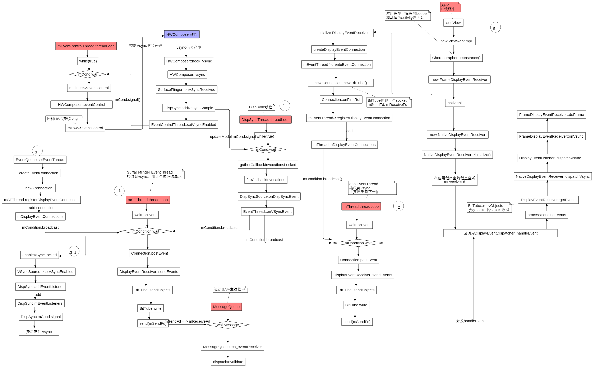
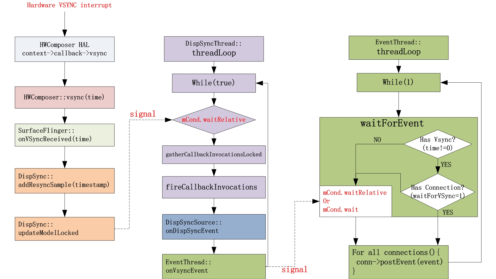

> 为了理解systrace中HW Vsync， sf vsync， app vsync的含义和作用。这里主要参照Android R AOSP源码对这几种VSYNC的关系和调用流程进行大致的梳理。

<!--more-->

# 1. vsync相关线程

+ EventControlThread: 控制硬件vsync的开关
+ DispSyncThread: 软件产生vsync的线程，接收HWComposer HAL的VSYNC信号，并分发给EventThread
+ SF EventThread: 该线程用于SurfaceFlinger接收vsync信号用于渲染
+ App EventThread: 该线程用于接收vsync信号并且上报给App进程，App开始绘制

## 1.1. 四种vsync

从这4个线程，可以将vsync分为4种不同的类型：

1. HW vsync, 真实由硬件产生的vsync信号
2. SW vsync, 由DispSync产生的vsync信号
3. SF vsync, SF接收到的vsync信号
4. App vsync, App接收到的vsync信号


## 1.2. 硬件vsync

HWComposer HAL通过callback函数，把VSYNC信号传给DispSyncThread，DispSyncThread传给EventThread


## 1.3. 函数调用总流程图



部分流程：

```s
SurfaceFlinger::init() ---->
SurfaceFlinger::processDisplayHotplugEventsLocked()  ---->
SurfaceFlinger::initScheduler 创建sf thread和app thread   ---->
(1)Scheduler::createConnection   ---->
Scheduler::createConnectionInternal   ---->
EventThread::createEventConnection [new EventThreadConnection创建对象]

(2)MessageQueue::setEventConnection   ---->
(2.1) mEventTube.getFd()
(2.2) stealReceiveChannel
(2.3) MessageQueue::cb_eventReceiver ---->
MessageQueue::eventReceiver  [接收Vsync信号]   ---->
MessageQueue::Handler::dispatchInvalidate   [Handler消息处理]---->
MessageQueue::Handler::handleMessage   ---->
SurfaceFlinger::onMessageReceived   ---->
SurfaceFlinger::onMessageInvalidate    ----->

//合成刷新是通过frameAvailableListener->onFrameAvailable(item)触发
SurfaceFlinger::signalLayerUpdate()  请求合成 ---->
MessageQueue::invalidate()   ----->
EventThreadConnection::requestNextVsync()
```

## 1.4. SF创建EventThread(app&sf)

```cpp
//函数SurfaceFlinger::initScheduler
    // start the EventThread，调用setVsyncEnabled函数控制硬件Vysnc
    mScheduler =
            getFactory().createScheduler([this](bool enabled) { setVsyncEnabled(enabled); },   
                                         *mRefreshRateConfigs, *this);
    mAppConnectionHandle =
            mScheduler->createConnection("app", mPhaseConfiguration->getCurrentOffsets().late.app,
                                         impl::EventThread::InterceptVSyncsCallback());
    mSfConnectionHandle =
            mScheduler->createConnection("sf", mPhaseConfiguration->getCurrentOffsets().late.sf,
                                         [this](nsecs_t timestamp) {
                                             mInterceptor->saveVSyncEvent(timestamp);
                                         });
```

## 1.5. SF注册Connection

```cpp
//frameworks/native/services/surfaceflinger/Scheduler/EventThread.cpp
EventThreadConnection::EventThreadConnection(EventThread* eventThread,
                                             ResyncCallback resyncCallback,
                                             ISurfaceComposer::ConfigChanged configChanged)
      : resyncCallback(std::move(resyncCallback)),
        mConfigChanged(configChanged),
        mEventThread(eventThread),
        mChannel(gui::BitTube(8 * 1024 /* default size is 4KB, double it */)) {}

void EventThreadConnection::onFirstRef() {
    // NOTE: mEventThread doesn't hold a strong reference on us
    mEventThread->registerDisplayEventConnection(this);
}

status_t EventThread::registerDisplayEventConnection(const sp<EventThreadConnection>& connection) {
    std::lock_guard<std::mutex> lock(mMutex);

    // this should never happen
    auto it = std::find(mDisplayEventConnections.cbegin(),
            mDisplayEventConnections.cend(), connection);
    if (it != mDisplayEventConnections.cend()) {
        ALOGW("DisplayEventConnection %p already exists", connection.get());
        mCondition.notify_all();
        return ALREADY_EXISTS;
    }
    //添加到mDisplayEventConnections集合中
    mDisplayEventConnections.push_back(connection);
    //唤醒threadMain函数（唤醒所有等待队列中阻塞的线程，存在锁争用，只有一个线程能够获得锁）
    mCondition.notify_all();
    return NO_ERROR;
}
```

**Note：** 有关`notify_all`和`unique_lock<std::mutex>`锁可参考：[C++11条件变量：notify_one()与notify_all()的区别](https://blog.csdn.net/feikudai8460/article/details/109604690)

***

# 2. sf请求vsync

**两条请求vsync的流程：**

1. 参考[signalLayerUpdate通知Layer更新信息](https://wizzie.top/Blog/2020/10/15/2020/201015_android_SurfaceFlinger1/#signalLayerUpdate%E9%80%9A%E7%9F%A5Layer%E6%9B%B4%E6%96%B0%E4%BF%A1%E6%81%AF)开始，SF触发合成开始请求VSYNC

2. **当显示屏准备完毕，SF EventThread connection开始监听Vsync信号，相关流程：**

```s
SurfaceFlinger::init()   ---->
SurfaceFlinger::initializeDisplays()  设置初始条件 ----->
SurfaceFlinger::onInitializeDisplays()  ----->
SurfaceFlinger::setTransactionState   ---->
SurfaceFlinger::setTransactionFlags   ---->
SurfaceFlinger::signalTransaction()   ---->
MessageQueue::invalidate()   [在请求刷新合成时也会调用] ----->
EventThread::requestNextVsync
```

## 2.1. EventThread线程唤醒函数threadmain

部分代码：

```cpp
//frameworks/native/services/surfaceflinger/Scheduler/EventThread.cpp
void EventThread::requestNextVsync(const sp<EventThreadConnection>& connection) {
    if (connection->resyncCallback) {
        connection->resyncCallback();
    }

    std::lock_guard<std::mutex> lock(mMutex);

    if (connection->vsyncRequest == VSyncRequest::None) {   //None=-1
        connection->vsyncRequest = VSyncRequest::Single;   //Single=0，只接收一次信号
        mCondition.notify_all();  //唤醒threadmain函数
    }
}
```

1. 在threadmain函数其中创建了**DisplayEventReceiver**对象，该类用于传输VSYNC信号。

```cpp
DisplayEventReceiver::DisplayEventReceiver  (MessageQueue::setEventConnection) ---->
EventThreadConnection::stealReceiveChannel  ----->

//函数MessageQueue::setEventConnection也会调用到此处
status_t EventThreadConnection::stealReceiveChannel(gui::BitTube* outChannel) {
    outChannel->setReceiveFd(mChannel.moveReceiveFd());
    return NO_ERROR;
}
```

2. 调用DispSyncSource.setVSyncEnabled开启硬件Vsync


## 2.2. BitTube

参考：[setEventThread变更](https://wizzie.top/Blog/2020/10/15/2020/201015_android_SurfaceFlinger1/#setEventThread%E5%8F%98%E6%9B%B4)

BitTube，其实现是socketpairt套接字，用于传递消息。Buffer大小是4K

## 2.3. DisplayEventReceiver

查看该类的头文件，关于vsync的主要函数作用：

```cpp
//frameworks/native/libs/gui/include/gui/DisplayEventReceiver.h

public:
    //DisplayEventReceiver创建并注册了SF的一个事件连接，默认禁止VSync
    //通过调用setVSyncRate、requestNextVsync开始接受。其他事件则即刻分发
    explicit DisplayEventReceiver(
            ISurfaceComposer::VsyncSource vsyncSource = ISurfaceComposer::eVsyncSourceApp,
            ISurfaceComposer::ConfigChanged configChanged =
                    ISurfaceComposer::eConfigChangedSuppress);

    //获取用于接收事件的文件描述符，该描述符由本类持有，不得关闭
    int getFd() const;

    //从队列中读取事件并返回事件个数如果返回NOT_ENOUGH_DATA
    //如果返回的数据不够多，则对象将永远无效，应该销毁，并且不应该再次调用getEvents
    ssize_t getEvents(Event* events, size_t count);
    static ssize_t getEvents(gui::BitTube* dataChannel, Event* events, size_t count);
    
    //向队列中写入事件并返回写入的数量
    static ssize_t sendEvents(gui::BitTube* dataChannel, Event const* events, size_t count);

    //设置VSync分发频率，每次VSync事件返回1，其他事件返回2，没有事件返回0
    status_t setVsyncRate(uint32_t count);

    //请求下一次Vsync
    status_t requestNextVsync();

    //强制请求当前primary display的config属性
    status_t requestLatestConfig();
private:
    sp<IDisplayEventConnection> mEventConnection;
    std::unique_ptr<gui::BitTube> mDataChannel;
};
```

## 2.4. DispSyncSource.setVSyncEnabled开启硬件Vsync

流程：

```s
EventThread::threadMain   ----->
DispSyncSource::setVSyncEnabled   ---->
surfaceflinger/Scheduler/DispSync.cpp  -- DispSync::addEventListener   ---->
class DispSyncThread : public Thread  -- addEventListener
```

```cpp
//surfaceflinger/Scheduler/EventThread.cpp
void EventThread::threadMain(std::unique_lock<std::mutex>& lock) {
    .....
        State nextState;
        if (mVSyncState && vsyncRequested) {
            nextState = mVSyncState->synthetic ? State::SyntheticVSync : State::VSync;
        } else {
            ALOGW_IF(!mVSyncState, "Ignoring VSYNC request while display is disconnected");
            nextState = State::Idle;
        }

        if (mState != nextState) {
            if (mState == State::VSync) {
                mVSyncSource->setVSyncEnabled(false);
            } else if (nextState == State::VSync) {
                mVSyncSource->setVSyncEnabled(true);
            }

            mState = nextState;
        }
        ....
}

//surfaceflinger/Scheduler/DispSyncSource.cpp
void DispSyncSource::setVSyncEnabled(bool enable) {
    std::lock_guard lock(mVsyncMutex);
    if (enable) {
        //开启硬件Vsync信号就是添加EventListener
        status_t err = mDispSync->addEventListener(mName, mPhaseOffset,
                                                   static_cast<DispSync::Callback*>(this),
                                                   mLastCallbackTime);
    } else {
        status_t err = mDispSync->removeEventListener(static_cast<DispSync::Callback*>(this),
                                                      &mLastCallbackTime);
        if (mDolphinCheck) {
            if (mDolphinCheck(mName)) {
                status_t err = mDispSync->addEventListener(mName, mPhaseOffset,
                                                           static_cast<DispSync::Callback*>(this),
                                                           mLastCallbackTime);
                if (err != NO_ERROR) {
                    ALOGE("error registering vsync callback: %s (%d)", strerror(-err), err);
                }
            }
        }
    }
    mEnabled = enable;
}
```

***

# 3. 硬件VSYNC从HWComposer HAL发到EventThread

SF请求合成时关于Vsync的部分流程：

```s
SurfaceFlinger::onMessageInvalidate  ---->
SurfaceFlinger::updateFrameScheduler()  ----->
(1) SurfaceFlinger::getVsyncPeriod()  ---->
surfaceflinger/DisplayHardware/HWC2.cpp -- Display::getDisplayVsyncPeriod

(2) Scheduler::resyncToHardwareVsync
(3) DispSync::addResyncSample  ----->
DispSync::updateModelLocked [开始计算更新SW vsync 模型]
```

## 3.1. mPeriod Vsync周期时长值变更流程

流程：

```s
SurfaceFlinger::init()   ---->
SurfaceFlinger::initializeDisplays()  设置初始条件 ----->
SurfaceFlinger::onInitializeDisplays()  ----->
SurfaceFlinger::setPowerModeInternal  设置Display的power mode ----->
(1) Scheduler::onScreenAcquired

(2) Scheduler::resyncToHardwareVsync   通过硬件Vsync重新设置软件vysnc ----->
Scheduler::setVsyncPeriod   设置vsync周期时长   ----->

(1) DispSync::setPeriod
(2) DispSync::beginResync()
(3) EventControlThread::setVsyncEnabled 唤醒threadmain线程[如果硬件vsync没有enable,那么就通知EventControlThread去通知硬件enable VSYNC]
```

## 3.2. 流程图及部分代码



## 3.3. resyncToHardwareVsync打开硬件VYSNC

SurfaceFlinger在初始化HWComposer时会默认关闭硬件Vsync信号，这里直接调用eventControl

而resyncToHardwareVsync则是和硬件VSYNC进行同步，通过调用到setVsyncEnabled开启硬件VSYNC

```cpp
//surfaceflinger/Scheduler/Scheduler.cpp
void Scheduler::resyncToHardwareVsync(bool makeAvailable, nsecs_t period, bool force_resync) {
    {
        std::lock_guard<std::mutex> lock(mHWVsyncLock);
        //表示硬件VSYNC被enable
        if (makeAvailable) {  
            mHWVsyncAvailable = makeAvailable;
        } else if (!mHWVsyncAvailable) {
            // Hardware vsync is not currently available, so abort the resync
            // attempt for now
            return;
        }
    }
    if (period <= 0) {
        return;
    }
    setVsyncPeriod(period, force_resync);
}

void Scheduler::setVsyncPeriod(nsecs_t period, bool force_resync) {
    std::lock_guard<std::mutex> lock(mHWVsyncLock);
    //设置DispSync模型里period为显示设备的频率
    mPrimaryDispSync->setPeriod(period);

    if (!mPrimaryHWVsyncEnabled || force_resync) {
        mPrimaryDispSync->beginResync();
        //如果硬件vsync没有enable,那么就通知EventControlThread去通知硬件enable VSYNC，这个和DispSync的setVsyncEnabled是不一样的
        mEventControlThread->setVsyncEnabled(true);
        mPrimaryHWVsyncEnabled = true;
    }
}
```

setVsyncEnabled会释放mCond信号，这样在EventControlThread的threadLoop里的mCond会被唤醒去操作硬件Vsync开关

## 3.4. *addResyncSample更新mPeriod

### 3.4.1. 重要变量的含义：

+ 硬件vsync样本个数：`MIN_RESYNC_SAMPLES_FOR_UPDATE`（要6个硬件vsync样本以上才计算，当然样本越多，模型越精确）
+ mPeriod：即是显示屏的刷新率，这里mPeriod是根据样本个数去掉一个最大一个最小，算平均
+ mPhase：偏移时间，这个相称和具体的SF/APP Thread里固定的相称是不一样的，这个相移是针对 mPeroid的一个偏移
+ mModelUpdated：表示是否模型已经更新
+ mReferenceTime：第一个硬件Vsync的时间，每次SW vsync计算下一个vsync时间时，都是以该时间作为基准，这样可以减少误差

### 3.4.2. Code

```cpp
//surfaceflinger/Scheduler/DispSync.cpp
void DispSync::beginResync() {
    Mutex::Autolock lock(mMutex);
    ALOGV("[%s] beginResync", mName);
    resetLocked();
}

bool DispSync::addResyncSample(nsecs_t timestamp, std::optional<nsecs_t> /*hwcVsyncPeriod*/,
                               bool* periodFlushed) {
    Mutex::Autolock lock(mMutex);

    ALOGV("[%s] addResyncSample(%" PRId64 ")", mName, ns2us(timestamp));

    *periodFlushed = false;
    //MAX_RESYNC_SAMPLES=32,即最大只保存32次硬件vysnc时间戳，用于计算SW Vsync模型
    //mNumResyncSamples表示已有硬件Vysnc样本个数
    //mFirstResyncSample用于记录第几个硬件vysnc
    const size_t idx = (mFirstResyncSample + mNumResyncSamples) % MAX_RESYNC_SAMPLES;
    //mResyncSamples用于记录每个硬件vsync样本的时间戳
    mResyncSamples[idx] = timestamp;
    if (mNumResyncSamples == 0) {
        mPhase = 0;
        ALOGV("[%s] First resync sample: mPeriod = %" PRId64 ", mPhase = 0, "
              "mReferenceTime = %" PRId64,
              mName, ns2us(mPeriod), ns2us(timestamp));
    } else if (mPendingPeriod > 0) {
            ....
            if (mTraceDetailedInfo) {
                ATRACE_INT("DispSync:PendingPeriod", mPendingPeriod);
                ATRACE_INT("DispSync:IntendedPeriod", mIntendedPeriod);
            }
            *periodFlushed = true;
        }
    }
    .....
    // Always update the reference time with the most recent timestamp.
    mReferenceTime = timestamp;
    mThread->updateModel(mPeriod, mPhase, mReferenceTime);

    if (mNumResyncSamples < MAX_RESYNC_SAMPLES) {
        mNumResyncSamples++;
    } else {
        mFirstResyncSample = (mFirstResyncSample + 1) % MAX_RESYNC_SAMPLES;
    }
    //开始计算更新SW Vsync模型
    updateModelLocked();
    ......
    ALOGV("[%s] addResyncSample returning %s", mName, modelLocked ? "locked" : "unlocked");
    if (modelLocked) {
        *periodFlushed = true;
        mThread->lockModel();
    }
    return !modelLocked;
}

//计算更新SW Vsync模型，更新完后就会关闭硬件VSYNC信号
void DispSync::updateModelLocked() {
    //MIN_RESYNC_SAMPLES_FOR_UPDATE=6
    // 如果已经保存了6个以上的 硬件 vsync样本后，就要开始计算 sw vsync模型了
    if (mNumResyncSamples >= MIN_RESYNC_SAMPLES_FOR_UPDATE) {
        nsecs_t durationSum = 0;
        nsecs_t minDuration = INT64_MAX;
        nsecs_t maxDuration = 0;
        static constexpr size_t numSamplesSkipped = 2;  //跳过两个，因为可能存在不准确、延迟
        //还记得上面 如果 mNumResyncSamples=0,即第一个硬件vsync时，直接更新SW vsync模型了，所以这里把第一个给去除掉
        for (size_t i = numSamplesSkipped; i < mNumResyncSamples; i++) {
            size_t idx = (mFirstResyncSample + i) % MAX_RESYNC_SAMPLES;
            size_t prev = (idx + MAX_RESYNC_SAMPLES - 1) % MAX_RESYNC_SAMPLES;
            
            // mResyncSamples[idx] - mResyncSamples[prev] 这个差值就是计算出两个硬件vsync样本之间的时间间隔
            nsecs_t duration = mResyncSamples[idx] - mResyncSamples[prev];
            // durationSum 表示保存的所有样本(除去前两个vsync)时间间隔之后，用于后面计算 平均 mPeriod
            durationSum += duration;  
            minDuration = min(minDuration, duration);
            maxDuration = max(maxDuration, duration);
        }

        // 去掉一个最小，一个最大值再来计算平均值，这个平均值就是硬件vsync产生的时间间隔
        durationSum -= minDuration + maxDuration;
        // 减去4
        mPeriod = durationSum / (mNumResyncSamples - numSamplesSkipped - 2);

       //下面计算出模型需要的偏移, 因为现在 mPeriod 算出来的是平均值，所以并不是真的硬件vsync时间间隔就是 mPeriod, 存在着偏移与噪音(这个和样本个数有很大的关系)
       // 即有些样本信号的时间间隔大于平均值，而有些样本时间间隔小于平均值，而这些与 mPriod的差值就是偏移
       // 下面就是要算出这些平均的偏移值
        double sampleAvgX = 0;
        double sampleAvgY = 0;
        //将硬件vsync的时间间隔换算成对应的度数,即刻度，这里的刻度表示每ns代表多少度 
        // M_PI是圆周率 3.14159265359f，其中2π就是值360度
        double scale = 2.0 * M_PI / double(mPeriod);

        for (size_t i = numSamplesSkipped; i < mNumResyncSamples; i++) {
            size_t idx = (mFirstResyncSample + i) % MAX_RESYNC_SAMPLES;
            nsecs_t sample = mResyncSamples[idx] - mReferenceTime;
           // 这里对mPeriod取余就是相对于mPeriod倍数的偏移值，然后将其转换成对应的度数
            double samplePhase = double(sample % mPeriod) * scale;
            sampleAvgX += cos(samplePhase); //依次累加成 sampleAvgX
            sampleAvgY += sin(samplePhase); //依次累加成 sampleAvgY
        }

        //获得在x轴与y轴的偏移的平均值
        sampleAvgX /= double(mNumResyncSamples - numSamplesSkipped);
        sampleAvgY /= double(mNumResyncSamples - numSamplesSkipped);

       //最后再通过atan2获得最终的相移值
        mPhase = nsecs_t(atan2(sampleAvgY, sampleAvgX) / scale);

        //如果相移偏过了mPeriod的一半，那么重新调整一下
        if (mPhase < -(mPeriod / 2)) {
            mPhase += mPeriod;
            ALOGV("[%s] Adjusting mPhase -> %" PRId64, mName, ns2us(mPhase));
        }
      // 将最新的 偏移 mPhase和 vsync时间间隔mPeriod和mReferenceTime更新到SW vsync模型当中
        mThread->updateModel(mPeriod, mPhase, mReferenceTime);
        
      // 模型更新了
        mModelUpdated = true;
    }
}
```

### 3.4.3. 计算的相移图


## 3.5. setVsyncEnabled硬件VSYNC开关控制

```s
SurfaceFlinger::init() ---->
SurfaceFlinger::processDisplayHotplugEventsLocked()  ---->
SurfaceFlinger::initScheduler 创建sf thread和app thread   ---->
SurfaceFlinger::setVsyncEnabled(bool enabled)  [传入true，开启硬件vsync]  ----->
SurfaceFlinger::setVsyncEnabledInternal(bool enabled)
```

硬件vsync相关函数：

```cpp
void SurfaceFlinger::setVsyncEnabledInternal(bool enabled) {
    ATRACE_CALL();
    Mutex::Autolock lockVsync(mVsyncLock);
    //复制
    mHWCVsyncPendingState = enabled ? hal::Vsync::ENABLE : hal::Vsync::DISABLE;

    auto displayId = getInternalDisplayIdLocked();
    if (mNextVsyncSource) {
        // Disable current vsync source before enabling the next source
        if (mActiveVsyncSource) {
            displayId = mActiveVsyncSource->getId();
            getHwComposer().setVsyncEnabled(*displayId, hal::Vsync::DISABLE);
        }
        displayId = mNextVsyncSource->getId();
    } else if (mActiveVsyncSource) {
        displayId = mActiveVsyncSource->getId();
    }
    getHwComposer().setVsyncEnabled(*displayId, mHWCVsyncPendingState);
    if (mNextVsyncSource) {
        mActiveVsyncSource = mNextVsyncSource;
        mNextVsyncSource = NULL;
    }
}
```

***

# 4. DispSync

> DispSyncThread是软件产生vsync的线程，也控制硬件VSync信号同步。DispSync是定义在SurfaceFlinger类里的成员变量，因此在初始化 SurfaceFlinger时，就会初始化DispSync。

## 4.1. DispSync初始化

流程：

```s
SurfaceFlinger::init() ---->
SurfaceFlinger::processDisplayHotplugEventsLocked()  --->
SurfaceFlinger::initScheduler  ----->
surfaceflinger/SurfaceFlingerDefaultFactory.cpp  -- DefaultFactory::createScheduler --->
Scheduler::Scheduler  [构造函数]  ---->
std::unique_ptr<DispSync> createDispSync [创建DispSync]
```

代码：

**Scheduler构造函数：**

```cpp
//frameworks/native/services/surfaceflinger/Scheduler/Scheduler.cpp
Scheduler::Scheduler(impl::EventControlThread::SetVSyncEnabledFunction function,
                     const scheduler::RefreshRateConfigs& refreshRateConfig,
                     ISchedulerCallback& schedulerCallback, bool useContentDetectionV2,
                     bool useContentDetection)
      : mSupportKernelTimer(sysprop::support_kernel_idle_timer(false)),
        mPrimaryDispSync(createDispSync(mSupportKernelTimer)),    //调用createDispSync函数
        mEventControlThread(new impl::EventControlThread(std::move(function))),
        mSchedulerCallback(schedulerCallback),
        mRefreshRateConfigs(refreshRateConfig),
        mUseContentDetection(useContentDetection),
        mUseContentDetectionV2(useContentDetectionV2) { ....

std::unique_ptr<DispSync> createDispSync(bool supportKernelTimer) {
    ...
    } else {
        return std::make_unique<impl::DispSync>("SchedulerDispSync",
                                                sysprop::running_without_sync_framework(true));
    }
}
```

```cpp
//surfaceflinger/Scheduler/DispSync.cpp
//构造函数
DispSync::DispSync(const char* name, bool hasSyncFramework)
      : mName(name), mIgnorePresentFences(!hasSyncFramework) {
    mThread = new DispSyncThread(name, mTraceDetailedInfo);   //创建DispSyncThread对象
    mThread->run("DispSync", PRIORITY_URGENT_DISPLAY + PRIORITY_MORE_FAVORABLE);   //线程执行
    ...
      }

class DispSyncThread : public Thread {
public:
    DispSyncThread(const char* name, bool showTraceDetailedInfo)
          : mName(name),
            mStop(false),
            mModelLocked("DispSync:ModelLocked", false),
            mPeriod(0),     //初始化为0
            mPhase(0),
            mReferenceTime(0),
            mWakeupLatency(0),
            mFrameNumber(0),
            mTraceDetailedInfo(showTraceDetailedInfo) {}
            ......   

virtual bool threadLoop() {
        status_t err;
        nsecs_t now = systemTime(SYSTEM_TIME_MONOTONIC);
        ...
        //当threadLoop第一次进来后，由于mPeriod初始化为0，所以一直死等在这里
                if (mPeriod == 0) {
                    err = mCond.wait(mMutex);
                    if (err != NO_ERROR) {
                        ALOGE("error waiting for new events: %s (%d)", strerror(-err), err);
                        return false;
                    }
                    continue;
                }
                //计算下一次vsync事件的时间
                targetTime = computeNextEventTimeLocked(now);
                .....
   }
```

***

## 4.2. addEventListener唤醒线程DispSyncThread

接着上面threadmain函数流程调用到addEventListener，此处将唤醒上面threadloop的`mCond.wait(mMutex)`

```cpp
status_t addEventListener(const char* name, nsecs_t phase, DispSync::Callback* callback,
                              nsecs_t lastCallbackTime) {
            ...
        mEventListeners.push_back(listener);
        //唤醒线程，threadLoop可以跳出循环继续执行
        mCond.signal();

        return NO_ERROR;
    }
```

而`mPeriod == 0)`则仍旧是0，所以此时会`continue`继续往下执行。计算下一个Vsync信号的时间戳，并且上报给EventListener，如此DispSyncThread模型就会运作起来。

***

## 4.3. HWComposer回调onVysncReceived

```s
surfaceflinger/DisplayHardware/HWComposer.cpp  -- class ComposerCallbackBridge - android::hardware::Return<void> onVsync  ---->
SurfaceFlinger::onVsyncReceived   ---->
(1) addResyncSample 更新vysnc计算模型
(2) VSyncModulator::onRefreshRateChangeCompleted
```

此处会调用到addResyncSample函数，该函数会加入硬件vsync的样本，目的是为了计算、更新SW VSYNC的参数。具体解释将对应小节。

```cpp
void SurfaceFlinger::onVsyncReceived(int32_t sequenceId, hal::HWDisplayId hwcDisplayId,
                                     int64_t timestamp,
                                     std::optional<hal::VsyncPeriodNanos> vsyncPeriod) {
    ATRACE_NAME("SF onVsync");  //systrace

    Mutex::Autolock lock(mStateLock);
    // Ignore any vsyncs from a previous hardware composer.
    if (sequenceId != getBE().mComposerSequenceId) {
        return;
    }

    if (!getHwComposer().onVsync(hwcDisplayId, timestamp)) {
        return;
    }

    bool periodFlushed = false;
    mScheduler->addResyncSample(timestamp, vsyncPeriod, &periodFlushed);
    if (periodFlushed) {
        mVSyncModulator->onRefreshRateChangeCompleted();
    }
}

//surfaceflinger/Scheduler/VSyncModulator.cpp
void VSyncModulator::onRefreshRateChangeCompleted() {
    if (!mRefreshRateChangePending) {
        return;
    }
    mRefreshRateChangePending = false;
    updateOffsets();
}

void VSyncModulator::updateOffsets() {
    std::lock_guard<std::mutex> lock(mMutex);
    updateOffsetsLocked();
}

void VSyncModulator::updateOffsetsLocked() {
    const Offsets& offsets = getNextOffsets();

    mPhaseOffsetControl.setPhaseOffset(mSfConnectionHandle, offsets.sf);
    mPhaseOffsetControl.setPhaseOffset(mAppConnectionHandle, offsets.app);

    mOffsets = offsets;

    if (!mTraceDetailedInfo) {
        return;
    }

    const bool isEarly = &offsets == &mOffsetsConfig.early;
    const bool isEarlyGl = &offsets == &mOffsetsConfig.earlyGl;
    const bool isLate = &offsets == &mOffsetsConfig.late;

    ATRACE_INT("Vsync-EarlyOffsetsOn", isEarly);
    ATRACE_INT("Vsync-EarlyGLOffsetsOn", isEarlyGl);
    ATRACE_INT("Vsync-LateOffsetsOn", isLate);
}
```

***

# 5. 计算SW vsync并向APP/SF发送vsync信号

在计算完后，继续执行DispSyncThread的threadloop函数：

```cpp
//surfaceflinger/Scheduler/DispSync.cpp
    virtual bool threadLoop() {
        status_t err;
        nsecs_t now = systemTime(SYSTEM_TIME_MONOTONIC);
        ...
        //计算下一次vsync事件的时间
        targetTime = computeNextEventTimeLocked(now);

                bool isWakeup = false;
                //等待计算出来的下一次vsync时间到来
                //如果到了就发送SW VSYNC信号
                if (now < targetTime) {
                    if (mTraceDetailedInfo) ATRACE_NAME("DispSync waiting");

                    if (targetTime == INT64_MAX) {
                        ALOGV("[%s] Waiting forever", mName);
                        err = mCond.wait(mMutex);
                    } else {
                        ALOGV("[%s] Waiting until %" PRId64, mName, ns2us(targetTime));
                        //等到SW VSYNC时间到了，就唤醒，发送vsync信号
                        err = mCond.waitRelative(mMutex, targetTime - now);
                    }

                    if (err == TIMED_OUT) {
                        isWakeup = true;
                    } else if (err != NO_ERROR) {
                        ALOGE("error waiting for next event: %s (%d)", strerror(-err), err);
                        return false;
                    }
                }

                now = systemTime(SYSTEM_TIME_MONOTONIC);

                //计算wake up时间, 但是不能超过1.5 ms
                static const nsecs_t kMaxWakeupLatency = us2ns(1500);

                if (isWakeup) {
                    //累加mWakeupLatency醒来的时间
                    //用于在后面计算SW VSYNC时间
                    //所有的wake up时间最大不能超过1.5 ms
                    mWakeupLatency = ((mWakeupLatency * 63) + (now - targetTime)) / 64;
                    mWakeupLatency = min(mWakeupLatency, kMaxWakeupLatency);
                    if (mTraceDetailedInfo) {
                        ATRACE_INT64("DispSync:WakeupLat", now - targetTime);
                        ATRACE_INT64("DispSync:AvgWakeupLat", mWakeupLatency);
                    }
                }
                //收回回调的EventListener（在前面addEventListener中）
                //
                callbackInvocations =
                        gatherCallbackInvocationsLocked(now, computeNextRefreshLocked(0, now));
            }

            if (callbackInvocations.size() > 0) {
                //向SF/APP EventThread发送vsync信号
                fireCallbackInvocations(callbackInvocations);
            }
        }

        return false;
    }
```

## 5.1. 计算SW Vsync下一个vsync时间

这里其实就最多只有两种EventListener, 一个是SF EventThread,一个是App EventThread。

它们都需要接收Vsync信号来分别做不同的事情。

但是实际上两个线程都有一个vsync phase offset偏移值

```cpp
//surfaceflinger/Scheduler/DispSync.cpp
private:
    nsecs_t computeNextEventTimeLocked(nsecs_t now) {
        if (mTraceDetailedInfo) ATRACE_CALL();
        ALOGV("[%s] computeNextEventTimeLocked", mName);
        nsecs_t nextEventTime = INT64_MAX;
        for (size_t i = 0; i < mEventListeners.size(); i++) {
            //对所有的EventListener进行分别计算，里面的mLastEventTime值不同
            nsecs_t t = computeListenerNextEventTimeLocked(mEventListeners[i], now);
            if (t < nextEventTime) {
                nextEventTime = t;
            }
        }
        return nextEventTime;
    }

    nsecs_t computeListenerNextEventTimeLocked(const EventListener& listener, nsecs_t baseTime) {
        if (mTraceDetailedInfo) ATRACE_CALL();
        //计算的是上一次vsync事件的时间，等于上一次vsync事件 + wake up唤醒时间
        nsecs_t lastEventTime = listener.mLastEventTime + mWakeupLatency;
        //一般情况是fasle;
        //如果是true，比如第一次，threadLoop的now生成的时间比较早，而addEventListener发生的比较晚,
        //listener的lastEventTime设为了当前的系统时间，此时baseTime就会小于lastEventTime
        if (baseTime < lastEventTime) {
            //重新修正baseTime
            baseTime = lastEventTime;
            ALOGV("[%s] Clamping baseTime to lastEventTime -> %" PRId64, mName, ns2us(baseTime));
        }
        //减去参考时间（第一个硬件vsync样本的时间）
        baseTime -= mReferenceTime;
        //mPhase是通过硬件vsync样本计算出来的
        //listener.mPhase是固定的具体在编译时设置的（在PhaseOffsets.cpp中）
        nsecs_t phase = mPhase + listener.mPhase;
        //减去偏移
        baseTime -= phase;

        if (baseTime < 0) {
            ALOGV("[%s] Correcting negative baseTime", mName);
            baseTime = -mPeriod;
        }
        //求出下一时刻发送sw vsync的时间，这个时间是以第一个硬件vsync作为参考来这样计算
        //如果以一个sw vsync时间作为参考，因为sw vsync的时间本身就是一种根据模型模拟出来的，所以本身存在误差，
        //所以如果每个sw vsync以上一个作为base的话,那么它的误差会慢慢积累;
        //而每次以第一个硬件vsync时间作为基准，那么每个sw vsync的误差，并不会累加，这样就相对来说更加精确些
        nsecs_t numPeriods = baseTime / mPeriod;
        //计算距离第一个硬件Vsync时间的偏移，即得到下一个sw vsync的时间，numPeriods + 1,注意是下一个vsync的时间
        nsecs_t t = (numPeriods + 1) * mPeriod + phase;
        //t是相对于每一个硬件vsync的时间
        t += mReferenceTime;

        //如果这个vsync距离上一个vsync时间小于3/5个mPeriod的话，为了避免连续的两个sw vsync,
        //那么这次sw vsync就放弃了，直接放到下一个周期里
        if (isCloseToPeriod(t - listener.mLastEventTime)) {
            t += mPeriod;
            ALOGV("[%s] Modifying t -> %" PRId64, mName, ns2us(t));
        }
        //当然算出来的时间要减去wake up的时间了，这样才能精确的模拟硬件vsync的时间，
        //注意mWakeupLatency是所有wake up的时间累加，但是最大只能到1.5ms
        t -= mWakeupLatency;
        ALOGV("[%s] Corrected for wakeup latency -> %" PRId64, mName, ns2us(t));

        return t;
    }

    bool isCloseToPeriod(nsecs_t duration) {
        // Ratio of 3/5 is arbitrary, but it must be greater than 1/2.
        return duration < (3 * mPeriod) / 5;
    }
```

***

## 5.2. 向SF/APP EventThread发送vsync信号

```cpp
//surfaceflinger/Scheduler/DispSync.cpp
    std::vector<CallbackInvocation> gatherCallbackInvocationsLocked(nsecs_t now,
                                                                    nsecs_t expectedVSyncTime) {
        if (mTraceDetailedInfo) ATRACE_CALL();

        std::vector<CallbackInvocation> callbackInvocations;
        //因为computeListenerNextEventTimeLocked计算的是下一个vsync时间，
        //那么这一次的vsync就以上now - mPeriod作为基准时间
        nsecs_t onePeriodAgo = now - mPeriod;

        for (auto& eventListener : mEventListeners) {
            nsecs_t t = computeListenerNextEventTimeLocked(eventListener, onePeriodAgo);

            if (t < now) {
                if (isCloseToPeriod(now - eventListener.mLastCallbackTime)) {
                    eventListener.mLastEventTime = t;
                    ALOGV("[%s] [%s] Skipping event due to model error", mName,
                          eventListener.mName);
                    continue;
                }

                CallbackInvocation ci;
                ci.mCallback = eventListener.mCallback;
                ci.mEventTime = t;
                ci.mExpectedVSyncTime = expectedVSyncTime;
                if (eventListener.mPhase < 0) {
                    ci.mExpectedVSyncTime += mPeriod;
                }
                ALOGV("[%s] [%s] Preparing to fire, latency: %" PRId64, mName, eventListener.mName,
                      t - eventListener.mLastEventTime);
                //回调
                callbackInvocations.push_back(ci);
                eventListener.mLastEventTime = t;
                eventListener.mLastCallbackTime = now;
            }
        }
        return callbackInvocations;
    }
```

***

# 6. postComposition更新SW Vsync的误差值

```cpp
//surfaceflinger/SurfaceFlinger.cpp
void SurfaceFlinger::postComposition()
{
    ATRACE_CALL();
    ALOGV("postComposition");
    ...
    getBE().mDisplayTimeline.updateSignalTimes();
    mPreviousPresentFences[1] = mPreviousPresentFences[0];

    sp<DisplayDevice> vSyncSource = mNextVsyncSource;
    if (mNextVsyncSource == NULL) {
        vSyncSource = mActiveVsyncSource;
    }
    mPreviousPresentFences[0] = vSyncSource ?
        getHwComposer().getPresentFence(*vSyncSource->getId()) : Fence::NO_FENCE;
    auto presentFenceTime = std::make_shared<FenceTime>(mPreviousPresentFences[0]);
    getBE().mDisplayTimeline.push(presentFenceTime);
    ...
    //获取fence
    mTransactionCompletedThread.addPresentFence(mPreviousPresentFences[0]);
    mTransactionCompletedThread.sendCallbacks();

    if (display && display->isPrimary() && display->getPowerMode() == hal::PowerMode::ON &&
        presentFenceTime->isValid()) {
        mScheduler->addPresentFence(presentFenceTime);
    }
    ...
}

//surfaceflinger/Scheduler/Scheduler.cpp
void Scheduler::addPresentFence(const std::shared_ptr<FenceTime>& fenceTime) {
    if (mPrimaryDispSync->addPresentFence(fenceTime)) {
        //如果addPresentFence返回true，则说明SW vsync和硬件Vsync的误差太大
        //此时就需要重新打开硬件vsync，来重新调节计算SW vsync模型
        enableHardwareVsync();
    } else {
        disableHardwareVsync(false);
    }
}
```

## 6.1. addPresentFence

```cpp
//surfaceflinger/Scheduler/DispSync.cpp
bool DispSync::addPresentFence(const std::shared_ptr<FenceTime>& fenceTime) {
    Mutex::Autolock lock(mMutex);

    if (mIgnorePresentFences) {
        return true;
    }
    //将当前硬件vsync的fence保存到mPresentFences中，
    //目的是为了计算偏移
    mPresentFences[mPresentSampleOffset] = fenceTime;
    mPresentSampleOffset = (mPresentSampleOffset + 1) % NUM_PRESENT_SAMPLES;
    //置为0
    mNumResyncSamplesSincePresent = 0;
    //更新错误信息
    updateErrorLocked();
    //一般情况下mModelUpdated已经被更新，然后硬件vsync被disable
    //所以这里只需要看SW VSYNC的真实的硬件vsync的误差是否在可允许的范围内即可
    return !mModelUpdated || mError > kErrorThreshold;
}
```

上面的mError是方差，当方差大于kErrorThreshold就返回true。

```cpp
//surfaceflinger/Scheduler/DispSync.cpp
void DispSync::updateErrorLocked() {
    if (!mModelUpdated) {
        return;
    }
    int numErrSamples = 0;
    nsecs_t sqErrSum = 0;
    //NUM_PRESENT_SAMPLES=8
    for (size_t i = 0; i < NUM_PRESENT_SAMPLES; i++) {

        nsecs_t time = mPresentFences[i]->getCachedSignalTime();
        if (time == Fence::SIGNAL_TIME_PENDING || time == Fence::SIGNAL_TIME_INVALID) {
            continue;
        }
        //mReferenceTime是第一个硬件vsync的时间戳（addResyncSample中）
        nsecs_t sample = time - mReferenceTime;
        //此处sample一般情况下是大于偏移量mPhase的
        if (sample <= mPhase) {
            continue;
        }
5 
        nsecs_t sampleErr = (sample - mPhase) % mPeriod;
        if (sampleErr > mPeriod / 2) {
            sampleErr -= mPeriod;
        }
        //记录偏移差的平方和
        sqErrSum += sampleErr * sampleErr;
        numErrSamples++;
    }
    //mError即求出的方差
    if (numErrSamples > 0) {
        mError = sqErrSum / numErrSamples;
        mZeroErrSamplesCount = 0;
    } else {
        mError = 0;
        // Use mod ACCEPTABLE_ZERO_ERR_SAMPLES_COUNT to avoid log spam.
        mZeroErrSamplesCount++;
        ALOGE_IF((mZeroErrSamplesCount % ACCEPTABLE_ZERO_ERR_SAMPLES_COUNT) == 0,
                 "No present times for model error.");
    }

    if (mTraceDetailedInfo) {
        ATRACE_INT64("DispSync:Error", mError);
    }
}
```


# 7. 参考文献

> 参考google文章： [在 Android 上进行高刷新率渲染](ttps://zhuanlan.zhihu.com/p/142212769?from_voters_page=true)
> 
> Google官网[Multiple Refresh Rate](https://source.android.google.cn/devices/graphics/multiple-refresh-rate)
> 
> 参考： [CCSDN博客 刷新率和Vsync](https://blog.csdn.net/u014535072/article/month/2020/05)
> 
> 参考： [Android SurfaceFlinger SW Vsync模型](https://www.jianshu.com/p/d3e4b1805c92)