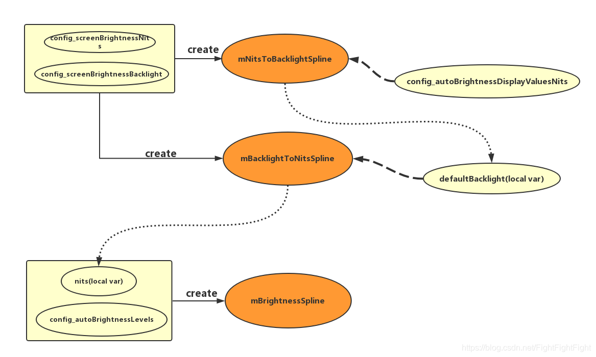
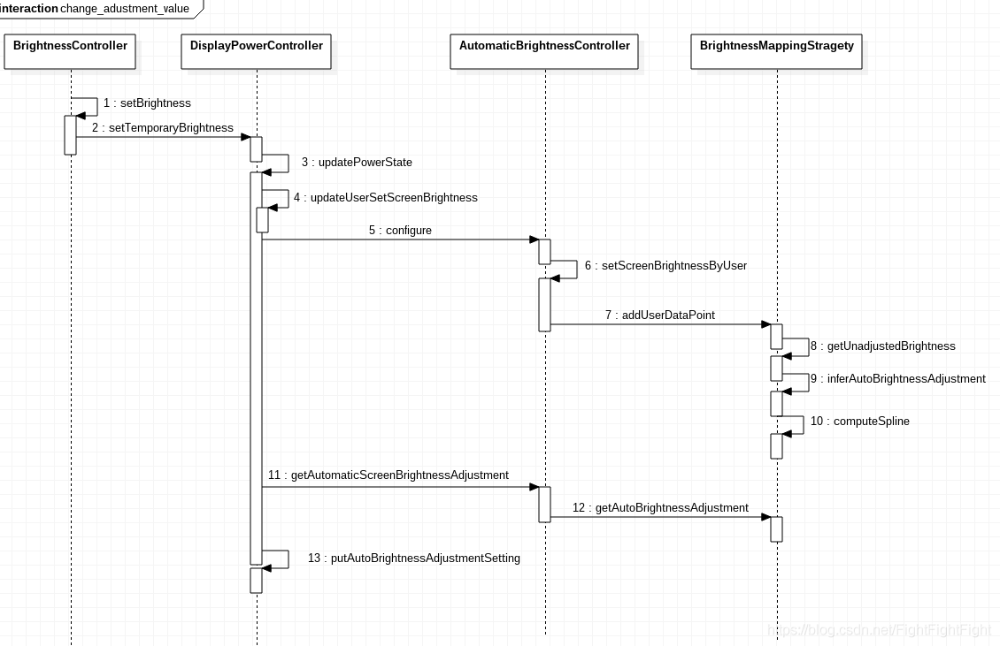

> 参考Android R源码，对背光手动调节、自动调节的流程作简单梳理。

<!--more-->

# 1. SystemUI-settings手动背光调节

## 1.1. 函数调用流程

```s
frameworks/base/packages/SystemUI/src/com/android/systemui/settings/BrightnessController.java - onChanged  ---->
setBrightness  ---->
frameworks/base/core/java/android/hardware/display/DisplayManager.java - setTemporaryBrightness ---->
frameworks/base/core/java/android/hardware/display/DisplayManagerGlobal.java - setTemporaryBrightness [调用IDisplayManager.aidl的setTemporaryBrightness]--->
frameworks/base/services/core/java/com/android/server/display/DisplayManagerService.java - setTemporaryBrightness [binder call跨进程 APP进程到DMS进程]
frameworks/base/services/core/java/com/android/server/display/DisplayPowerController.java - setTemporaryBrightness [消息处理]  ---->
updatePowerState* [主要设置、实现背光函数]
```


## 1.2. 部分代码梳理

1. BrightnessController.java设置背光：

```java
//frameworks/base/packages/SystemUI/src/com/android/systemui/settings/BrightnessController.java
    @Override
    public void onChanged(ToggleSlider toggleSlider, boolean tracking, boolean automatic,
            int value, boolean stopTracking) {
        ....
        final float minBacklight;
        final float maxBacklight;
        final int metric;
        final String settingToChange;

        //获取背光值
        //value入参，Gamma转换成线性
        //valFloat:根据亮度条的拖动，计算出新的亮度值
        final float valFloat = MathUtils.min(convertGammaToLinearFloat(value,
                minBacklight, maxBacklight),
                1.0f);
        ....
        //设置背光值
        setBrightness(valFloat);
        if (!tracking) {
            //在异步任务中将新的亮度值保存在SettingsProvider中
            AsyncTask.execute(new Runnable() {
                    public void run() {
                        Settings.System.putFloatForUser(mContext.getContentResolver(),
                                settingToChange, valFloat, UserHandle.USER_CURRENT);
                    }
                });
        }
        for (BrightnessStateChangeCallback cb : mChangeCallbacks) {
            cb.onBrightnessLevelChanged();
        }
    }

    //设置背光值
    private void setBrightness(float brightness) {
        //DisplayManagerService对象
        mDisplayManager.setTemporaryBrightness(brightness);
    }

//frameworks/base/packages/SettingsLib/src/com/android/settingslib/display/BrightnessUtils.java
    // Hybrid Log Gamma constant values
    private static final float R = 0.5f;
    private static final float A = 0.17883277f;
    private static final float B = 0.28466892f;
    private static final float C = 0.55991073f;

    public static final float convertGammaToLinearFloat(int val, float min, float max) {
        // 计算 (val-GAMMA_SPACE_MIN) / (GAMMA_SPACE_MAX-GAMMA_SPACE_MAX) 
        //最大值减去最小值评价一组数据的离散度，即极差
        final float normalizedVal = MathUtils.norm(GAMMA_SPACE_MIN, GAMMA_SPACE_MAX, val); //min 0, max 65535
        final float ret;
        //对调用者自身的rgb值平方或开放
        if (normalizedVal <= R) {
            ret = MathUtils.sq(normalizedVal / R); //开方根
        } else {
            ret = MathUtils.exp((normalizedVal - C) / A) + B;  //以自然常数e为底的指数函数
        }

        // HLG is normalized to the range [0, 12], ensure that value is within that range,
        // it shouldn't be out of bounds.
        final float normalizedRet = MathUtils.constrain(ret, 0, 12);

        // Re-normalize to the range [0, 1]
        // in order to derive the correct setting value.
        return MathUtils.lerp(min, max, normalizedRet / 12);
    }
```

2. AIDL跨进程（bind call）到DMS.java

```java
//frameworks/base/services/core/java/com/android/server/display/DisplayManagerService.java
    @VisibleForTesting
    final class BinderService extends IDisplayManager.Stub {
        .....
        @Override // Binder call
        public void setTemporaryBrightness(float brightness) {
            mContext.enforceCallingOrSelfPermission(
                    Manifest.permission.CONTROL_DISPLAY_BRIGHTNESS,
                    "Permission required to set the display's brightness");
            final long token = Binder.clearCallingIdentity();
            try {
                //同步执行代码块
                //保证在同一时刻最多只有一个线程执行该段代码
                synchronized (mSyncRoot) {
                    mDisplayPowerController.setTemporaryBrightness(brightness);
                }
            } finally {
                Binder.restoreCallingIdentity(token);
            }
        }

//frameworks/base/services/core/java/com/android/server/display/DisplayPowerController.java
    public void setTemporaryBrightness(float brightness) {
        //mHandler是DisplayControllerHandler类型
        //创建message（省去了创建对象申请内存的开销，相比new message）
        Message msg = mHandler.obtainMessage(MSG_SET_TEMPORARY_BRIGHTNESS,
                Float.floatToIntBits(brightness), 0 /*unused*/);
        //内部调用sendMessage，即发送消息
        msg.sendToTarget();
    }

    private final class DisplayControllerHandler extends Handler {
        public DisplayControllerHandler(Looper looper) {
            super(looper, null, true /*async*/);
        }

        @Override
        public void handleMessage(Message msg) {
            switch (msg.what) {
                ...
                //消息处理
                case MSG_SET_TEMPORARY_BRIGHTNESS:
                    //入参int，返回float类型，赋值给mTemporaryScreenBrightness
                    mTemporaryScreenBrightness = Float.intBitsToFloat(msg.arg1);
                    updatePowerState();
                    break;
                ...
            }
        }

    //主要实现函数
    private void updatePowerState() {
        // Update the power state request.
        final boolean mustNotify;
        final int previousPolicy;
        boolean mustInitialize = false;
        int brightnessAdjustmentFlags = 0;
        mBrightnessReasonTemp.set(null);
        ...
        // 如果power状态变化，则第一时间初始化更新
        if (mustInitialize) {
            initialize();
        }
        ...
        //获取p-sensor距离感应器（Apply the proximity sensor）
        if (mProximitySensor != null) {
            ...
        }
        //1. 手动设置亮度是否改变
        final boolean userSetBrightnessChanged = updateUserSetScreenBrightness();

        //如果没有覆盖，则使用手动设置的临时背光
        if (isValidBrightnessValue(mTemporaryScreenBrightness)) {
            //2. 将手动设置的背光值 赋值给 brightnessState
            brightnessState = mTemporaryScreenBrightness;
            mAppliedTemporaryBrightness = true;
            mBrightnessReasonTemp.setReason(BrightnessReason.REASON_TEMPORARY);
        } else {
            mAppliedTemporaryBrightness = false;
        }

        final boolean autoBrightnessAdjustmentChanged = updateAutoBrightnessAdjustment();
        if (autoBrightnessAdjustmentChanged) {
            mTemporaryAutoBrightnessAdjustment = Float.NaN;
        }
        //如果设置了，则使用自动背光覆盖
        final float autoBrightnessAdjustment;
        if (!Float.isNaN(mTemporaryAutoBrightnessAdjustment)) {
            autoBrightnessAdjustment = mTemporaryAutoBrightnessAdjustment;
            brightnessAdjustmentFlags = BrightnessReason.ADJUSTMENT_AUTO_TEMP;
            mAppliedTemporaryAutoBrightnessAdjustment = true;
        } else {
            autoBrightnessAdjustment = mAutoBrightnessAdjustment;
            brightnessAdjustmentFlags = BrightnessReason.ADJUSTMENT_AUTO;
            mAppliedTemporaryAutoBrightnessAdjustment = false;
        }
        ....
        // Apply auto-brightness.
        boolean slowChange = false;
        if (Float.isNaN(brightnessState)) {
            float newAutoBrightnessAdjustment = autoBrightnessAdjustment;
            if (autoBrightnessEnabled) {
                //获取自动背光值
                brightnessState = mAutomaticBrightnessController.getAutomaticScreenBrightness();
                //获取新的adjustment值
                newAutoBrightnessAdjustment =
                        mAutomaticBrightnessController.getAutomaticScreenBrightnessAdjustment();
            }
            if (isValidBrightnessValue(brightnessState)
                    || brightnessState == PowerManager.BRIGHTNESS_OFF_FLOAT) {
                // Use current auto-brightness value and slowly adjust to changes.
                //3. 使用当前的自动背光值，缓慢的变化
                brightnessState = clampScreenBrightness(brightnessState);
            .....
                    }
            if (autoBrightnessAdjustment != newAutoBrightnessAdjustment) {
                //将adjustment值保存到SettingsProvider中
                //以确保Settings等其他进程对它的使用
                putAutoBrightnessAdjustmentSetting(newAutoBrightnessAdjustment);
            } else {
                // Adjustment values resulted in no change
                brightnessAdjustmentFlags = 0;
            }
        }
        .....
            float animateValue = brightnessState == PowerManager.BRIGHTNESS_OFF_FLOAT
                    ? PowerManager.BRIGHTNESS_MIN : brightnessState;
            if (isValidBrightnessValue(animateValue)) {
                if (initialRampSkip || hasBrightnessBuckets
                        || wasOrWillBeInVr || !isDisplayContentVisible || brightnessIsTemporary) {
                    //4. 设置背光到底层LED驱动，调节背光值，不设置背光动画（并且防止非法值时，保证不黑屏，设置最小背光）
                    animateScreenBrightness(animateValue, SCREEN_ANIMATION_RATE_MINIMUM);
                } else {
                    //设置亮度值到底层驱动，调节背光值，根据slowChange设置快动画还是慢动画
                    animateScreenBrightness(animateValue,
                            slowChange ? mBrightnessRampRateSlow : mBrightnessRampRateFast);
                }
            }
    }

//--------------------------------

    //1.手动设置的亮度
    private boolean updateUserSetScreenBrightness() {
        //mPendingScreenBrightnessSetting是通过SettingsObserver监测Settings数据库中的值
        //在handleSettingsChange方法中通过getScreenBrightnessSetting()获取
        if ((Float.isNaN(mPendingScreenBrightnessSetting)
                || mPendingScreenBrightnessSetting < 0.0f)) {
            return false;
        }
        if (mCurrentScreenBrightnessSetting == mPendingScreenBrightnessSetting) {
            mPendingScreenBrightnessSetting = PowerManager.BRIGHTNESS_INVALID_FLOAT;
            //手动设置的背光
            mTemporaryScreenBrightness = PowerManager.BRIGHTNESS_INVALID_FLOAT;
            return false;
        }
        mCurrentScreenBrightnessSetting = mPendingScreenBrightnessSetting;
        mLastUserSetScreenBrightness = mPendingScreenBrightnessSetting;
        mPendingScreenBrightnessSetting = PowerManager.BRIGHTNESS_INVALID_FLOAT;
        mTemporaryScreenBrightness = PowerManager.BRIGHTNESS_INVALID_FLOAT;  //not a number， 0.0f / 0.0f
        return true;
    }

    private float clampScreenBrightness(float value) {
        //非法值则返回最小背光值
        if (Float.isNaN(value)) {
            return mScreenBrightnessRangeMinimum;
        }
        //当前背光值在最小背光和最大背光之间进行百分比缩放
        return MathUtils.constrain(
                value, mScreenBrightnessRangeMinimum, mScreenBrightnessRangeMaximum);
    }

    private void animateScreenBrightness(float target, float rate) {
        if (DEBUG) {
            Slog.d(TAG, "Animating brightness: target=" + target +", rate=" + rate);
        }
        if (mScreenBrightnessRampAnimator.animateTo(target, rate)) {
            Trace.traceCounter(Trace.TRACE_TAG_POWER, "TargetScreenBrightness", (int) target);
            // TODO(b/153319140) remove when we can get this from the above trace invocation
            SystemProperties.set("debug.tracing.screen_brightness", String.valueOf(target));
            try {
                // TODO(brightnessfloat): change BatteryStats to use float
                mBatteryStats.noteScreenBrightness(
                        BrightnessSynchronizer.brightnessFloatToInt(
                        mContext, target));
            } catch (RemoteException ex) {
                // same process
            }
        }
}
```

## 1.3. 异步任务机制AsyncTask

在Android中实现异步任务机制有两种方式：`Handler和AsyncTask`

相比于Handle模式需为每个文物创建新县城，发送消息接受消息过程精细，工具类android.os.AsyncTask使创建异步任务变得更加简单

注意点：
1. 实例必须在UI线程中创建
2. execute必须在UI线程中调用
3. 不要手动调用onPreExecute，doInBackground，onProgressUpdate，onPostExecute方法
4. 不能在doInBackground(Params... params)中更改UI组件的信
5. 一个任务实例只能执行一次，如果执行第二次将会抛出异常

### 1.3.1. 异步任务主要方法

**AsyncTask是一个泛型类，它的三个类型参数的含义如下：**

1. Params：doInBackground方法的参数类型；
2. Progress：AsyncTask所执行的后台任务的进度类型；
3. Result：后台任务的返回结果类型。

**方法：**

1. execute(Params... params)，执行一个异步任务，需要在代码中调用此方法，触发异步任务的执行
2. onPreExecute()，在execute(Params... params)被调用后立即执行，一般用来在执行后台任务前对UI做一些标记
3. doInBackground(Params... params)，在onPreExecute()完成后立即执行，用于执行较为费时的操作，此方法将接收输入参数和返回计算结果。在执行过程中可以调用publishProgress(Progress... values)来更新进度信息
4. onProgressUpdate(Progress... values)，在调用publishProgress(Progress... values)时，此方法被执行，直接将进度信息更新到UI组件上
5. onPostExecute(Result result)，当后台操作结束时，此方法将会被调用，计算结果将做为参数传递到此方法中，直接将结果显示到UI组件

***

# 2. 自动背光调节

## 2.1. 主要变量

代码主要在`frameworks/base/services/core/java/com/android/server/display`目录下的`DisplayPowerController.java`和`AutomaticBrightnessController.java`

1. 在`AutomaticBrightnessController.java`中定义了一些自动背光的变量：

+ mScreenAutoBrightness：屏幕亮度级别是由自动亮度算法决定的，实际的亮度应向这个值靠拢。我们保留这个值，即使我们停止使用光传感器，以便我们可以快速恢复到之前的自动亮度级别
+ mResetAmbientLuxAfterWarmUpConfig：如果设置为true，屏幕点亮后，控制器根据当前传感器读到的值调整亮度；如果是false，控制器将收集更多的数据，然后决定是否改变亮度
+ mAmbientLux：当前接收的环境光级别
+ mAmbientLightRingBuffer：用来保存最近环境光传感器读值的环形传感器
+ AMBIENT_LIGHT_PREDICTION_TIME_MILLIS=100：假定当前传感器读数超出当前时间的有效期，并且确保最后样本的权重非0，这反过来确保了总权重非0
+ mLightSensorWarmUpTimeConfig：亮屏后在等待光传感器准备时自动亮度调整时间，以毫秒为单位。该值在创建AutomaticBrightnessController对象时被入参赋值

2. `BrightnessMappingStrategy`类负责创建背光曲线（从BrightnessConfigure类中读取两个数组源:config_autoBrightnessLevels和config_autoBrightnessDisplayValuesNits），计算自动背光值

3. 背光相关名词

+ 光照度（照度）：从光源照射到单位面积上的光通量,以E表示,照度的单位为勒克斯(Lux)

***

## 2.2. DisplayPowerController初始化背光属性变量

1. 首先通过initPowerManagement方法new一个DisplayPowerController对象

```java
    private final class LocalService extends DisplayManagerInternal {

        @Override
        public void initPowerManagement(final DisplayPowerCallbacks callbacks, Handler handler,
                SensorManager sensorManager) {
            synchronized (mSyncRoot) {
                DisplayBlanker blanker = new DisplayBlanker() {
                    @Override
                    public void requestDisplayState(int state, float brightness) {
                        .......
                };
                //创建DisplayPowerController对象
                mDisplayPowerController = new DisplayPowerController(
                        mContext, callbacks, handler, sensorManager, blanker,
                        mDisplayDevices.get(Display.DEFAULT_DISPLAY));
                mSensorManager = sensorManager;
            }

            mHandler.sendEmptyMessage(MSG_LOAD_BRIGHTNESS_CONFIGURATION);
}
```

2. DisplayPowerController构造函数中初始化了很多和亮度相关的属性变量。

+ mBatteryStats：获取电池信息service状态用于更新电池电量
+ mSensorManager：获取SensorManager用于调节吧诶广
+ mWindowManagerPolicy： 亮屏时调用到window绘制屏幕
+ mBlanker：亮屏以及设置背光时调用到DisplayPowerState的中介类对象
+ mScreenBrightnessDozeConfig：Doze状态配置亮度
+ mScreenBrightnessDimConfig：暗屏状态配置亮度
+ mScreenBrightnessRangeMaximum：屏幕最大亮度
+ mScreenBrightnessRangeMinimum：屏幕最小亮度
+ mUseSoftwareAutoBrightnessConfig：是否支持自动亮度
+ lightSensorWarmUpTimeConfig：Light sensor启动时间
+ lightSensorRate：sensor采集数据频率，配置在frameworks/base/core/res/res/values/config.xml，默认250
+ brighteningLightDebounce：变亮防抖时间，同上，默认4000
+ darkeningLightDebounce：变暗防抖时间，同上，默认8000
+ autoBrightnessResetAmbientLuxAfterWarmUp：当sensor启动时重置环境光照值，同上，默认true

***

## 2.3. 创建背光曲线（映射）

### 2.3.1. 创建曲线示意图

整体来看，共创建了三条样条曲线，对Lux-Nit-Backlight进行映射。和8.1不同的是，并非直接由Lux和Baclight映射，而是将Nit作为Lux和Backlight的中间介质。

1. mNitsToBacklightSpline
2. mBacklightToNitsSpline
3. mBrightnessSpline



流程：


***

## 2.4. 构造函数开始创建

在上面DisplayPowerController构造函数中会调用以下函数：`mBrightnessMapper = BrightnessMappingStrategy.create(resources);`

而BrightnessMappingStrategy.java的create函数中获取配置文件config.xml中的配置值（厂商会覆盖重新配置，一般路径会有overlay），然后根据这个配置值决定映射方式：

+ config_autoBrightnessLevels：环境光lux值，等级和背光对应
+ config_autoBrightnessLcdBacklightValues：背光等级

```xml
<!-- Lux值数组-->
<integer-array name="config_autoBrightnessLevels">
</integer-array>
<!-- Lux值对应的背光值数组 -->
<integer-array name="config_autoBrightnessLcdBacklightValues">
</integer-array>

<!-- ##### 以下三组是Android Q之后添加 -->
<!-- Lux值对应的Nits值数组 -->  
<array name="config_autoBrightnessDisplayValuesNits">
</array>
<!-- 描述屏幕发光强度的Nits值数组 -->
<array name="config_screenBrightnessNits">
</array>
<!-- 和发光强度Nits值对应的背光值数组 -->
<integer-array name="config_screenBrightnessBacklight">
</integer-array>
```

创建函数：

```java
//frameworks/base/services/core/java/com/android/server/display/BrightnessMappingStrategy.java
    @Nullable
    public static BrightnessMappingStrategy create(Resources resources) {
        //lux环境光数组
        float[] luxLevels = getLuxLevels(resources.getIntArray(
                com.android.internal.R.array.config_autoBrightnessLevels));
        //Lux值对应的背光值
        int[] brightnessLevelsBacklight = resources.getIntArray(
                com.android.internal.R.array.config_autoBrightnessLcdBacklightValues);
        //和Lux值对应的屏幕亮度的Nits值数组，长度比Lux值数组大1。如果配置了该值，则：
        //1.config_screenBrightnessNits必须配置
        //2.config_screenBrightnessBacklight必须配置
        float[] brightnessLevelsNits = getFloatArray(resources.obtainTypedArray(
                com.android.internal.R.array.config_autoBrightnessDisplayValuesNits));
        //用户可调整的gamma最大值
        float autoBrightnessAdjustmentMaxGamma = resources.getFraction(
                com.android.internal.R.fraction.config_autoBrightnessAdjustmentMaxGamma,
                1, 1);
        //描述屏幕亮度的nits值数组
        float[] nitsRange = getFloatArray(resources.obtainTypedArray(
                com.android.internal.R.array.config_screenBrightnessNits));
        //与nitsRange数组中的亮度值(单位为Nits)相对应的屏幕背光值
        int[] backlightRange = resources.getIntArray(
                com.android.internal.R.array.config_screenBrightnessBacklight);
        long shortTermModelTimeout = resources.getInteger(
                com.android.internal.R.integer.config_autoBrightnessShortTermModelTimeout);
        //判断是否是有效映射:
        //1.非空
        //2.长度相同
        //3.元素>=0;4.nitsRange/luxLevels必须递增,backlightRange/brightnessLevelsNits必须非递减
        if (isValidMapping(nitsRange, backlightRange)
                && isValidMapping(luxLevels, brightnessLevelsNits)) {
            //最小背光值1
            int minimumBacklight = resources.getInteger(
                    com.android.internal.R.integer.config_screenBrightnessSettingMinimum);
            //最大背光值255
            int maximumBacklight = resources.getInteger(
                    com.android.internal.R.integer.config_screenBrightnessSettingMaximum);
            //创建BrightnessConfiguration.Builder实例对象
            //将luxLevels和nits值保存进去
            BrightnessConfiguration.Builder builder = new BrightnessConfiguration.Builder(
                    luxLevels, brightnessLevelsNits);
            builder.setShortTermModelTimeoutMillis(shortTermModelTimeout);
            builder.setShortTermModelLowerLuxMultiplier(SHORT_TERM_MODEL_THRESHOLD_RATIO);
            builder.setShortTermModelUpperLuxMultiplier(SHORT_TERM_MODEL_THRESHOLD_RATIO);
            //（1） 映射Lux值和Nits值，而非Lux值和直接显示的背光值，物理映射
            //一般执行该流程创建曲线
            return new PhysicalMappingStrategy(builder.build(), nitsRange, backlightRange,
                    autoBrightnessAdjustmentMaxGamma);
        } else if (isValidMapping(luxLevels, brightnessLevelsBacklight)) {
            //（2） 直接映射Lux值和背光值，简单映射
            return new SimpleMappingStrategy(luxLevels, brightnessLevelsBacklight,
                    autoBrightnessAdjustmentMaxGamma, shortTermModelTimeout);
        } else {
            return null;
        }
    }
```

## 2.5. （1） PhysicalMappingStrategy构造函数

一般执行此处流程：

```java
//BrightnessMappingStrategy.java
//===================
        //（1） PhysicalMappingStrategy构造函数，创建两条映射曲线
    @VisibleForTesting
    static class PhysicalMappingStrategy extends BrightnessMappingStrategy {
        ....
        public PhysicalMappingStrategy(BrightnessConfiguration config, float[] nits,
                                       int[] backlight, float maxGamma) {
            .....
            mMaxGamma = maxGamma;
            //自动亮度调节
            mAutoBrightnessAdjustment = 0;
            //自动亮度开启的情况下，用户手动调节亮度时的当前lux值
            mUserLux = -1;
            //自动亮度开启的情况下，用户手动调节亮度设置的亮度值
            mUserBrightness = -1;

            // Setup the backlight spline
            final int N = nits.length;
            float[] normalizedBacklight = new float[N];
            for (int i = 0; i < N; i++) {
                normalizedBacklight[i] = normalizeAbsoluteBrightness(backlight[i]);
            }
            //创建Nits-Backlight样条曲线
            mNitsToBacklightSpline = Spline.createSpline(nits, normalizedBacklight);
            //创建Backlight-Nits样条曲线
            mBacklightToNitsSpline = Spline.createSpline(normalizedBacklight, nits);

            mDefaultConfig = config;
            if (mLoggingEnabled) {
                PLOG.start("physical mapping strategy");
            }
            mConfig = config;
            //根据不同的场景创建Lux-nits样条曲线
            computeSpline();
        }
    }
```

## 2.6. （1.1） PhysicalMappingStrategy中的computeSpline

```java
        private void computeSpline() {
            //获取BrightnessConfiguration中的Lux数组和Lux值对应的Nits数组，并放入Pair对象中
            Pair<float[], float[]> defaultCurve = mConfig.getCurve();
            float[] defaultLux = defaultCurve.first;    //lux数组
            float[] defaultNits = defaultCurve.second;  //和lux对应的nits数组
            //创建一个和defaultNits等长的数组，用于存放对应的背光值（从曲线中获取）
            float[] defaultBacklight = new float[defaultNits.length];
            for (int i = 0; i < defaultBacklight.length; i++) {
                //从mNitsToBacklightSpline中获取背光值，即根据config_autoBrightnessDisplayValuesNits值
                //从config_screenBrightnessNits与config_screenBrightnessBacklight的曲线中获取默认的背光值
                defaultBacklight[i] = mNitsToBacklightSpline.interpolate(defaultNits[i]);
            }
            //对上面获取的背光值进一步加工，如果用户设置过亮度，需将该亮度也加入曲线，
            //最终得到调整后的lux数组和brightness数组
            Pair<float[], float[]> curve = getAdjustedCurve(defaultLux, defaultBacklight, mUserLux,
                    mUserBrightness, mAutoBrightnessAdjustment, mMaxGamma);
            //最终的lux数组和backlight数组
            float[] lux = curve.first;
            float[] backlight = curve.second;
            float[] nits = new float[backlight.length];
            //根据背光值，从config_screenBrightnessNits和onfig_screenBrightnessBacklight构建的mBacklightToNitsSpline曲线中获取Nit值
            for (int i = 0; i < nits.length; i++) {
                nits[i] = mBacklightToNitsSpline.interpolate(backlight[i]);
            }
            //完成创建Lux-nits样条曲线
            //最终的背光值从此曲线和mNitsToBacklightSpline曲线中获取
            mBrightnessSpline = Spline.createSpline(lux, nits);
        }

    public Pair<float[], float[]> getCurve() {
        return Pair.create(Arrays.copyOf(mLux, mLux.length), Arrays.copyOf(mNits, mNits.length));
    }
```

### 2.6.1. Pair容器类

Pair对两个对象组成的元素组进行传递。这个对象提供了一个合理的equals()方法，如果两个对象的first和second值相等则返回true

特征：

1. Pair(F first, S second)，一个Pair容器里面有2个元素，他们成组存在。
2. Pair里面两个元素都是final的
3. Pair的equals是值比较，不是地址比较

示例：

```java
String PAIR = "PAIR";
Pair p1 = new Pair(18, "张三"); // 通过 构造函数 实例化对象
Pair p2 = Pair.create(20, "李四");//通过 create方法 实例化对象
boolean e1 = p1.equals(p2);
Log.d(PAIR, "RESULT: " + e1); // false
```

***

## 2.7. （2） SimpleMappingStrategy构造函数

```java
//BrightnessMappingStrategy.java
//===================
        //（2） 调用SimpleMappingStrategy构造函数
        private SimpleMappingStrategy(float[] lux, int[] brightness, float maxGamma,
                long timeout) {
            final int N = brightness.length;
            mLux = new float[N];
            mBrightness = new float[N];
            for (int i = 0; i < N; i++) {
                mLux[i] = lux[i];
                mBrightness[i] = normalizeAbsoluteBrightness(brightness[i]);
            }

            mMaxGamma = maxGamma;
            mAutoBrightnessAdjustment = 0;
            mUserLux = -1;
            mUserBrightness = -1;
            //映射lux和brightness曲线
            computeSpline();
            mShortTermModelTimeout = timeout;
        }
```

## 2.8. （2.1） SimpleMappingStrategy中的computeSpline

```java
//BrightnessMappingStrategy.java
        private void computeSpline() {
            //计算调整，得到调整后的Lux值数组和backlight值数组
            Pair<float[], float[]> curve = getAdjustedCurve(mLux, mBrightness, mUserLux,
                    mUserBrightness, mAutoBrightnessAdjustment, mMaxGamma);
            //Lux-Nits曲线,最终的背光值从此曲线+mNitsToBacklightSpline曲线获取
            mSpline = Spline.createSpline(curve.first, curve.second);
        }
```

***

# 3. AutomaticBrightnessController初始化

在DisplayPowerController构造函数中创建了AutomaticBrightnessController对象

```java
//frameworks/base/services/core/java/com/android/server/display/DisplayPowerController.java
            ....
            mBrightnessMapper = BrightnessMappingStrategy.create(resources);
            //背光曲线不为空
            if (mBrightnessMapper != null) {
                //实例化
                mAutomaticBrightnessController = new AutomaticBrightnessController(this,
                        handler.getLooper(), sensorManager, lightSensor, mBrightnessMapper,
                        lightSensorWarmUpTimeConfig, mScreenBrightnessRangeMinimum,
                        mScreenBrightnessRangeMaximum, dozeScaleFactor, lightSensorRate,
                        initialLightSensorRate, brighteningLightDebounce, darkeningLightDebounce,
                        autoBrightnessResetAmbientLuxAfterWarmUp, ambientBrightnessThresholds,
                        screenBrightnessThresholds, context, displayDeviceConfig);
            } else {
                mUseSoftwareAutoBrightnessConfig = false;
            }
            ....
```

## 3.1. *configure方法配置AutomaticBrightnessController

1. 在`updatePowerState()`中也会对mAutomaticBrightnessController对象进行配置：

```java
//DisplayPowerController.java
    private void updatePowerState() {
        .......
        // If the brightness is already set then it's been overridden by something other than the
        // user, or is a temporary adjustment.
        boolean userInitiatedChange = (Float.isNaN(brightnessState))
                && (autoBrightnessAdjustmentChanged || userSetBrightnessChanged);
        boolean hadUserBrightnessPoint = false;
        // Configure auto-brightness.
        if (mAutomaticBrightnessController != null) {
            //曲线中是否有用户设置的短期点
            hadUserBrightnessPoint = mAutomaticBrightnessController.hasUserDataPoints();
            mAutomaticBrightnessController.configure(autoBrightnessEnabled,
                    mBrightnessConfiguration,
                    mLastUserSetScreenBrightness,
                    userSetBrightnessChanged, autoBrightnessAdjustment,
                    autoBrightnessAdjustmentChanged, mPowerRequest.policy);
        }
        ....
    }

//表示是否在自动背光打开的情况下拖动亮度条调节过亮度
//判断依据是BrightnessMappingStrategy中的mUserLux成员，它表示用户在开启自动背光后手动设置亮度时的Lux值
@Override
public boolean hasUserDataPoints() {
    return mUserLux != -1;
}
```

配置的参数：

+ autoBrightnessEnabled：表示自动背光是否可用

```java
        final boolean autoBrightnessEnabledInDoze =
                mAllowAutoBrightnessWhileDozingConfig && Display.isDozeState(state);
        //打开了自动亮度调节&&(亮屏或Doze)&&局部变量brightness为0&&BrightnessMappingStrategy不为空
        final boolean autoBrightnessEnabled = mPowerRequest.useAutoBrightness
                    && (state == Display.STATE_ON || autoBrightnessEnabledInDoze)
                    && Float.isNaN(brightnessState)
                    && mAutomaticBrightnessController != null;
```

+ mBrightnessConfiguration：BrightnessConfiguration对象，携带有用于创建曲线的Lux值数组和对应的Nit值数组。每一个用户可对应一个BrightnessConfiguration，由DisplayManagerService设置
+ userSetBrightnessChanged：用户是否手动通过拖动亮度条设置过亮度
+ autoBrightnessAdjustmentChanged：自动背光调整至adjustment是否发生变化（对应的即下面configure中的`userChangedAutoBrightnessAdjustment`）
+ displayPolicy：当前请求的屏幕状态

***

2. configure()函数方法

```java
    public void configure(boolean enable, @Nullable BrightnessConfiguration configuration,
            float brightness, boolean userChangedBrightness, float adjustment,
            boolean userChangedAutoBrightnessAdjustment, int displayPolicy) {
        //是否要进入Doze状态
        boolean dozing = (displayPolicy == DisplayPowerRequest.POLICY_DOZE);
        //step 1: 设置BrightnessConfiguration对象，若发生变化返回true
        boolean changed = setBrightnessConfiguration(configuration);
        //step 2: 设置Display状态，若发生变化返回true
        changed |= setDisplayPolicy(displayPolicy);
        //step 3: 如果用户改变自动背光调节值，设置自动背光调节值
        if (userChangedAutoBrightnessAdjustment) {
            changed |= setAutoBrightnessAdjustment(adjustment);
        }
        //step 4: 如果在自动亮度开启的情况下调节了亮度，需要将当前的Lux值和用户设置的亮度添加到曲线中
        if (userChangedBrightness && enable) {
            // Update the brightness curve with the new user control point. It's critical this
            // happens after we update the autobrightness adjustment since it may reset it.
            changed |= setScreenBrightnessByUser(brightness);
        }
        final boolean userInitiatedChange =
                userChangedBrightness || userChangedAutoBrightnessAdjustment;
        if (userInitiatedChange && enable && !dozing) {
            //step 5
            prepareBrightnessAdjustmentSample();
        }
        //step 6: 注册LightSensor
        changed |= setLightSensorEnabled(enable && !dozing);
        //step 7: 如果changed为true，更新自动背光亮度值，但不会主动调用DPC更新背光
        if (changed) {
            updateAutoBrightness(false /*sendUpdate*/, userInitiatedChange);
        }
    }
```

### 3.1.1. setBrightnessConfiguration

1. 针对每个用户，都会有一个BrightnessConfiguration和它映射，所以当切换用户后，设备的背光将可能发生改变
2. 当BrightnessConfiguration发生改变且在BrighnessMappingStragety中设置完成后，将会通过resetShortTermModel()清除原有用户的配置

清除用户设置的亮度和对应Lux的三种情况：
1. 切换用户：handleSettingsChange
2. BrightnessConfigure对象发生变化：setBrightnessConfiguration
3. 屏幕进入不可交互状态超过30s，且再次进入交互状态后环境光发生变化：setDisplayPolicy

```java
//display/AutomaticBrightnessController.java
    public boolean setBrightnessConfiguration(BrightnessConfiguration configuration) {
        //Step 1
        if (mBrightnessMapper.setBrightnessConfiguration(configuration)) {
            //Step 2
            resetShortTermModel();
            return true;
        }
        return false;
    }

    public void resetShortTermModel() {
        //清楚用户添加的曲线Points
        mBrightnessMapper.clearUserDataPoints();
        //表示短期模型仍有效
        mShortTermModelValid = true;
        mShortTermModelAnchor = -1;
    }

//display/BrightnessMappingStrategy.java
        @Override
        public boolean setBrightnessConfiguration(@Nullable BrightnessConfiguration config) {
            if (config == null) {
                config = mDefaultConfig;
            }
            if (config.equals(mConfig)) {
                return false;
            }
            if (mLoggingEnabled) {
                PLOG.start("brightness configuration");
            }
            //如果config对象发生改变，则替换后，会调用computeSpline重新创建Lux-Nits曲线
            mConfig = config;
            computeSpline();
            return true;
        }

        @Override
        public void clearUserDataPoints() {
            if (mUserLux != -1) {
                //重置变量
                mAutoBrightnessAdjustment = 0;
                mUserLux = -1;
                mUserBrightness = -1;
                //重新创建曲线
                computeSpline();
            }
        }
```

### 3.1.2. setDisplayPolicy

该方法主要根据屏幕状态来设置mShortTermModelValid的值

当屏幕状态进入Doze或者Asleep后，会发送一个定义Handler，并在到达时间后将mShortTermModelValid值置为false

```java
//display/AutomaticBrightnessController.java
    private boolean setDisplayPolicy(int policy) {
        if (mDisplayPolicy == policy) {
            return false;
        }
        final int oldPolicy = mDisplayPolicy;
        mDisplayPolicy = policy;
        //如果Display状态值由交互变为不可交互状态
        if (!isInteractivePolicy(policy) && isInteractivePolicy(oldPolicy)) {
            //发送一个30s的延迟消息，30s后将mShortTermModelValid置为false
            mHandler.sendEmptyMessageDelayed(MSG_INVALIDATE_SHORT_TERM_MODEL,
                    mBrightnessMapper.getShortTermModelTimeout());
        //如果Display状态值由不可交互变为交互状态，移除延时消息的发送
        } else if (isInteractivePolicy(policy) && !isInteractivePolicy(oldPolicy)) {
            mHandler.removeMessages(MSG_INVALIDATE_SHORT_TERM_MODEL);
        }
        return true;
    }
```

### 3.1.3. setAutoBrightnessAdjustment

用于设置自动背光调整值，前提是自动背光调整值已经发生变化

```java
//display/AutomaticBrightnessController.java
    private boolean setAutoBrightnessAdjustment(float adjustment) {
        return mBrightnessMapper.setAutoBrightnessAdjustment(adjustment);
    }

//display/BrightnessMappingStrategy.java
        @Override
        public boolean setAutoBrightnessAdjustment(float adjustment) {
            //限制，取值范围为[-1,1]
            adjustment = MathUtils.constrain(adjustment, -1, 1);
            //adjustment未发生变化
            if (adjustment == mAutoBrightnessAdjustment) {
                return false;
            }
            if (mLoggingEnabled) {
                Slog.d(TAG, "setAutoBrightnessAdjustment: " + mAutoBrightnessAdjustment + " => " +
                        adjustment);
                PLOG.start("auto-brightness adjustment");
            }
            //adjustment发生变化，则重新创建曲线
            mAutoBrightnessAdjustment = adjustment;
            computeSpline();
            return true;
        }
```

### 3.1.4. setScreenBrightnessByUser

用于将用户拖动亮度条设置的亮度和当时的Lux值添加到用于创建曲线的数组中，并重新创建曲线

```java
//AutomaticBrightnessController.java
//添加用户设置亮度
    private boolean setScreenBrightnessByUser(float brightness) {
        if (!mAmbientLuxValid) {
            // If we don't have a valid ambient lux then we don't have a valid brightness anyway,
            // and we can't use this data to add a new control point to the short-term model.
            return false;
        }
        //将当前的Lux值和用户设置的背光值添加到曲线中
        mBrightnessMapper.addUserDataPoint(mAmbientLux, brightness);
        //更新设置当前lux值
        mShortTermModelValid = true;
        mShortTermModelAnchor = mAmbientLux;
        return true;
    }
```

### 3.1.5. prepareBrightnessAdjustmentSample

调用configure更新时，做一些标记记录

### 3.1.6. setLightSensorEnabled

用于LightSensor的注册和解除注册，当设备处于亮屏状态且打开自动背光功能时，将注册一个LightSensor，以监听环境光的强度变化

```java
//AutomaticBrightnessController.java
    private boolean setLightSensorEnabled(boolean enable) {
        if (enable) {
            if (!mLightSensorEnabled) {
                ....
                registerForegroundAppUpdater();
                //注册
                mSensorManager.registerListener(mLightSensorListener, mLightSensor,
                        mCurrentLightSensorRate * 1000, mHandler);
                return true;
            }
        } else if (mLightSensorEnabled) {
            .....
            mHandler.removeMessages(MSG_UPDATE_AMBIENT_LUX);
            unregisterForegroundAppUpdater();
            //解除
            mSensorManager.unregisterListener(mLightSensorListener);
        }
        return false;
    }
```

### 3.1.7. *updateAutoBrightness自动背光获取

更新自动背光亮度值

从这处流程可以看出自动背光获取的方式：
1. 首先会根据当前的Lux值，从mBrightnessSpline曲线中寻找对应的Nit值
2. 然后根据Nit值，从曲线mNitsToBacklightSpline中获取到最终的背光值

其中mBrightnessSpline曲线是由Lux值数组和它对应的Nit值数组创建，mNitsToBacklightSpline是由配置文件中的config_screenBrightnessNits和config_screenBrightnessBacklight创建

具体的创建在computeSline()方法中

```java
//AutomaticBrightnessController.java
    private void updateAutoBrightness(boolean sendUpdate, boolean isManuallySet) {
        if (!mAmbientLuxValid) {
            return;
        }
        //根据lux值从曲线中获取背光值（区间是[0, 1.0]的浮点数）
        float value = mBrightnessMapper.getBrightness(mAmbientLux, mForegroundAppPackageName,
                mForegroundAppCategory);
        //得到最终的自动背光值
        float newScreenAutoBrightness = clampScreenBrightness(value);

        if (!BrightnessSynchronizer.floatEquals(mScreenAutoBrightness,
                newScreenAutoBrightness)) {
            mScreenAutoBrightness = newScreenAutoBrightness;
            mScreenBrighteningThreshold = clampScreenBrightness(
                    mScreenBrightnessThresholds.getBrighteningThreshold(newScreenAutoBrightness));
            mScreenDarkeningThreshold = clampScreenBrightness(
                    mScreenBrightnessThresholds.getDarkeningThreshold(newScreenAutoBrightness));
            //背光更新
            if (sendUpdate) {
                mCallbacks.updateBrightness();
            }
        }
    }

//BrightnessMappingStrategy.java
        @Override
        public float getBrightness(float lux, String packageName,
                @ApplicationInfo.Category int category) {
            //根据lux从曲线中获取nits，然后获取背光
            float nits = mBrightnessSpline.interpolate(lux);
            float backlight = mNitsToBacklightSpline.interpolate(nits);
            ...
            return backlight;
        }
```

*** 

## 3.2. adjustment变量计算

例如dump我的一加六（Android 10）设备，`adb shell dumpsys display`信息：

```log
//开启自动亮度调节后dump
PhysicalMappingStrategy
  mConfig=BrightnessConfiguration{[(0.0, 2.0487), (1.0, 4.848), (4.0, 17.2347), (12.0, 39.0867), (20.0, 50.671), (40.0, 92.3019), (65.0, 94.2512), (95.0, 98.372), (140.0, 100.297), (200.0, 105.297), (350.0, 120.385), (650.0, 142.064), (1300.0, 236.5179), (2000.0, 350.0267), (3300.0, 427.6287)], {}, ''}
  //背光曲线
  mBrightnessSpline=MonotoneCubicSpline{[(0.0, 2.0487: 2.7699974), (1.0, 4.8186975: 3.4543567), (4.0, 17.234846: 3.435018), (12.0, 39.085403: 2.089745), (20.0, 50.67077: 1.7645122), (40.0, 92.28784: 0.23451348), (65.0, 94.25191: 0.023499148), (95.0, 98.38648: 0.09019067), (140.0, 100.30178: 0.0627253), (200.0, 105.275085: 0.0918182), (350.0, 120.38728: 0.08650002), (650.0, 142.0629: 0.108782366), (1300.0, 236.51614: 0.15355834), (2000.0, 349.77896: 0.11084422), (3300.0, 427.6287: 0.05988441)]}
  //nits对应背光的曲线
  mNitsToBacklightSpline=MonotoneCubicSpline{[(2.0482, 0.0019550342: 0.00395116), (2.543, 0.0039100684: 0.004002362), (3.0253, 0.0058651026: 0.0040531447), (3.5077, 0.007820137: 0.0037272798), (4.0824, 0.009775171: 0.00419204), (4.4748, 0.011730205: 0.005721517), (5.08, 0.015640274: 0.004685791), (6.4233, 0.019550342: 0.002632065), (8.0848, 0.02346041: 0.0017233933), (11.6607, 0.027370479: 0.001788805), (13.2347, 0.031280547: 0.0023087142), (15.0676, 0.035190616: 0.0021758107), (16.8302, 0.039100684: 0.0023342122), (18.4261, 0.043010753: 0.002262629), (20.3103, 0.04692082: 0.0022641667), (21.9042, 0.05083089: 0.00241765), (23.5456, 0.054740958: 0.00236309), (25.2137, 0.058651026: 0.0021678535), (27.1769, 0.062561095: 0.0020940518), (28.9571, 0.06647117: 0.0023456002), (30.5244, 0.07038123: 0.0023162398), (32.3535, 0.074291304: 0.0021968414), (34.0867, 0.07820137: 0.0023086662), (42.366, 0.097751714: 0.0022959393), (51.1309, 0.11730205: 0.0022804863), (59.52, 0.1368524: 0.0023538377), (67.744, 0.15640274: 0.002376392), (75.9738, 0.17595308: 0.002316629), (84.6332, 0.19550343: 0.002155731), (94.1525, 0.21505377: 0.002238446), (102.2207, 0.2346041: 0.0023939852), (110.4878, 0.25415444: 0.0026741978), (117.0405, 0.2737048: 0.0028248527), (124.3733, 0.29325512: 0.0028097979), (130.9928, 0.31280547: 0.00251312), (140.4247, 0.33235583: 0.0021358524), (149.3156, 0.35190615: 0.0023393487), (157.1995, 0.3714565: 0.0024370078), (165.3651, 0.39100686: 0.0024333047), (173.2726, 0.41055718: 0.0024349196), (181.4272, 0.43010753: 0.0024660935), (189.1402, 0.44965786: 0.0024320162), (197.5334, 0.4692082: 0.0023719585), (205.6301, 0.48875856: 0.002383901), (213.9381, 0.5083089: 0.002348846), (222.2769, 0.5278592: 0.002423523), (230.0891, 0.5474096: 0.002398687), (238.6084, 0.5669599: 0.002379861), (246.5399, 0.58651024: 0.0023049354), (255.6544, 0.6060606: 0.0022993367), (263.6221, 0.62561095: 0.002403119), (271.9324, 0.6451613: 0.002531584), (279.1449, 0.66471165: 0.0023920578), (288.5736, 0.684262: 0.002112214), (297.6628, 0.7038123: 0.0022218374), (306.1899, 0.7233627: 0.0023296294), (314.4511, 0.742913: 0.0024545297), (322.1404, 0.76246333: 0.002378489), (330.969, 0.7820137: 0.002454385), (338.2251, 0.80156404: 0.0025690594), (346.2251, 0.82111436: 0.0023937116), (354.567, 0.8406647: 0.0017740328), (370.799, 0.86021507: 2.6955837E-4), (413.1738, 0.8797654: 0.0013575983), (415.6397, 0.8993157: 0.009982219), (417.264, 0.9188661: 0.010905683), (419.264, 0.9384164: 0.009775162), (421.264, 0.95796674: 0.007777949), (424.646, 0.9775171: 0.0066592516), (427.6287, 1.0: 0.0075377673)]}

  mMaxGamma=3.0
  mAutoBrightnessAdjustment=0.0
  mUserLux=-1.0
  mUserBrightness=-1.0
  mDefaultConfig=BrightnessConfiguration{[(0.0, 2.0487), (1.0, 4.848), (4.0, 17.2347), (12.0, 39.0867), (20.0, 50.671), (40.0, 92.3019), (65.0, 94.2512), (95.0, 98.372), (140.0, 100.297), (200.0, 105.297), (350.0, 120.385), (650.0, 142.064), (1300.0, 236.5179), (2000.0, 350.0267), (3300.0, 427.6287)], {}, ''}
```

### 3.2.1. 用户手动调节亮度条

入参adjustment，范围是[-1.0, 1.0]

DisplayManager的setTemporaryAutoBrightnessAdjustment接口供上层应用调用，作为入口

```s
frameworks/base/core/java/android/hardware/display/DisplayManager.java - setTemporaryAutoBrightnessAdjustment  ---->
frameworks/base/core/java/android/hardware/display/DisplayManagerGlobal.java - setTemporaryAutoBrightnessAdjustment [入参adjustment]  ---->
IDisplayManager.aidl - setTemporaryAutoBrightnessAdjustment  [AIDL跨进程]  ---->
DisplayManagerService.java - setTemporaryAutoBrightnessAdjustment [Binder call] --->
DisplayPowerController.java - setTemporaryAutoBrightnessAdjustment [消息处理]  ----->
updatePowerState   ---->
（1） updateUserSetScreenBrightness  [mLastUserSetScreenBrightness更新值，并返回true赋值给userSetBrightnessChanged] 详细代码参考上面小节
（2） AutomaticBrightnessController.configure [会入参上面两个变量：mLastUserSetScreenBrightness和userSetBrightnessChanged]   ---->
setScreenBrightnessByUser   ---->
BrightnessMappingStrategy.java - addUserDataPoint   ---->
getUnadjustedBrightness
```

大致流程：


```java
//DisplayPowerController.java - updatePowerState
        ...
        if (mAutomaticBrightnessController != null) {
            hadUserBrightnessPoint = mAutomaticBrightnessController.hasUserDataPoints();
            mAutomaticBrightnessController.configure(autoBrightnessEnabled,
                    mBrightnessConfiguration,
                    mLastUserSetScreenBrightness,
                    userSetBrightnessChanged, autoBrightnessAdjustment,
                    autoBrightnessAdjustmentChanged, mPowerRequest.policy);
        }
//============================
//AutomaticBrightnessController.java
//mLastUserSetScreenBrightness对应brightness
//userSetBrightnessChanged对应userChangedBrightness
//autoBrightnessAdjustment对应adjustment
    public void configure(boolean enable, @Nullable BrightnessConfiguration configuration,
            float brightness, boolean userChangedBrightness, float adjustment,
            boolean userChangedAutoBrightnessAdjustment, int displayPolicy) {
                ....
        if (userChangedBrightness && enable) {
            // Update the brightness curve with the new user control point. It's critical this
            // happens after we update the autobrightness adjustment since it may reset it.
            changed |= setScreenBrightnessByUser(brightness);
        }
        ....
//============================
//BrightnessMappingStrategy.java
//brightness即上面传参的用户手动设置的背光mLastUserSetScreenBrightness
        @Override
        public void addUserDataPoint(float lux, float brightness) {
            //step 1： 获取默认配置值创建的曲线中Lux值对应的背光值
            float unadjustedBrightness = getUnadjustedBrightness(lux);
            //step 2： 通过传入的三个值计算调整 自动背光值
            float adjustment = inferAutoBrightnessAdjustment(mMaxGamma,
                    brightness /* desiredBrightness */,
                    unadjustedBrightness /* currentBrightness */);
            //更新自动背光调整值（浮点）
            mAutoBrightnessAdjustment = adjustment;
            //表示用户在开启自动背光情况下拖动亮度条调节亮度时的当时Lux值
            mUserLux = lux;
            //表示用户在开启自动背光情况下拖动亮度条调节亮度值
            mUserBrightness = brightness;
            //step 3： 更新曲线图
            computeSpline();
        }
        //step 1 获取曲线中的对应背光值
        private float getUnadjustedBrightness(float lux) {
            //获取BrightnessConfiguration中的Lux-Nits映射
            Pair<float[], float[]> curve = mConfig.getCurve();
            //创建一个lux-nits样条曲线
            Spline spline = Spline.createSpline(curve.first, curve.second);
            //根据lux得到nits值，再根据nit值从mNitsToBacklightSpline中的到对应的背光 0-1的float浮点数
            return mNitsToBacklightSpline.interpolate(spline.interpolate(lux));
        }

        //step 2 推断adjustment值
        protected float inferAutoBrightnessAdjustment(float maxGamma, float desiredBrightness,
            float currentBrightness) {
        float adjustment = 0;
        float gamma = Float.NaN;
        // 当前Lux值对应的默认配置亮度值 <=25.5 || >= 229.5  (0-255默认背光)
        if (currentBrightness <= 0.1f || currentBrightness >= 0.9f) {
            adjustment = (desiredBrightness - currentBrightness);
        //最暗的可能情况
        } else if (desiredBrightness == 0) {
            adjustment = -1;
        //最大亮度255
        } else if (desiredBrightness == 1) {
            adjustment = +1;
        } else {
            // current^gamma = desired => gamma = log[current](desired)
            //根据换底公式，得到currentBrightness为底desiredBrightness的对数
            gamma = MathUtils.log(desiredBrightness) / MathUtils.log(currentBrightness);
            // max^-adjustment = gamma => adjustment = -log[max](gamma)
            //maxGamma为底gamma的对数
            adjustment = -MathUtils.log(gamma) / MathUtils.log(maxGamma);
        }
        adjustment = MathUtils.constrain(adjustment, -1, +1);
        //返回计算后的adjustment
        return adjustment;
    }

    //step 3 在computeSpline方法重新创建样条曲线的时候，会调用getAdjustedCurve函数
    protected Pair<float[], float[]> getAdjustedCurve(float[] lux, float[] brightness,
            float userLux, float userBrightness, float adjustment, float maxGamma) {
        float[] newLux = lux;
        float[] newBrightness = Arrays.copyOf(brightness, brightness.length);
        //限定取值范围
        adjustment = MathUtils.constrain(adjustment, -1, 1);
        //maxGamma 的 -adjustment次方得到gamma值
        float gamma = MathUtils.pow(maxGamma, -adjustment);
        //gamma != 1说明adjustment不为0
        if (gamma != 1) {
            for (int i = 0; i < newBrightness.length; i++) {
                //重新设置亮度值，新的亮度值为就亮度值的gamma次方
                newBrightness[i] = MathUtils.pow(newBrightness[i], gamma);
            }
        }
        //用户在BrightnessController拖动条上手动调节了亮度
        if (userLux != -1) {
            //插入一对新的lux和对应背光值
            Pair<float[], float[]> curve = insertControlPoint(newLux, newBrightness, userLux,
                    userBrightness);
            newLux = curve.first;
            newBrightness = curve.second;
            if (mLoggingEnabled) {
                // This is done for comparison.
                curve = insertControlPoint(lux, brightness, userLux, userBrightness);
            }
        }
        //返回该Pair对象给到computeSpline()中
        return Pair.create(newLux, newBrightness);
    }

    private Pair<float[], float[]> insertControlPoint(
            float[] luxLevels, float[] brightnessLevels, float lux, float brightness) {
        //找到插入点索引，以保持值的递增
        final int idx = findInsertionPoint(luxLevels, lux);
        final float[] newLuxLevels;
        final float[] newBrightnessLevels;
        //1. 插入索引等于数组长度
        if (idx == luxLevels.length) {
            //需要插入到末尾位置，且新Lux数组长度比原来大1
            newLuxLevels = Arrays.copyOf(luxLevels, luxLevels.length + 1);
            newBrightnessLevels  = Arrays.copyOf(brightnessLevels, brightnessLevels.length + 1);
            newLuxLevels[idx] = lux;
            newBrightnessLevels[idx] = brightness;
        //2. 用户lux值已处在lux值数组中
        } else if (luxLevels[idx] == lux) {
            newLuxLevels = Arrays.copyOf(luxLevels, luxLevels.length);
            newBrightnessLevels = Arrays.copyOf(brightnessLevels, brightnessLevels.length);
            newBrightnessLevels[idx] = brightness;
        } else {
            //初始化新的lux数组，长度比原数组大1
            newLuxLevels = Arrays.copyOf(luxLevels, luxLevels.length + 1);
            //将原数组从idx位置起的元素，向后移动1位，将新的Lux值插入到idx位置
            System.arraycopy(newLuxLevels, idx, newLuxLevels, idx+1, luxLevels.length - idx);
            newLuxLevels[idx] = lux;
            //初始化新亮度值数组，长度比原数组大1
            newBrightnessLevels  = Arrays.copyOf(brightnessLevels, brightnessLevels.length + 1);
            //原数组从idx位置起的元素，向后移动1位，将新的亮度值值插入到idx位置
            System.arraycopy(newBrightnessLevels, idx, newBrightnessLevels, idx+1,
                    brightnessLevels.length - idx);
            newBrightnessLevels[idx] = brightness;
        }
        //平滑曲线
        //newLuxLevels之后的Lux对应的亮度值将全部为newBrightnessLevels
        smoothCurve(newLuxLevels, newBrightnessLevels, idx);
        //返回一个携带有Lux和背光值的Pair对象给getAdjustedCurve()
        return Pair.create(newLuxLevels, newBrightnessLevels);
    }
    //返回arr数组（递增）中开始大于等于val值的 数组下标
    private int findInsertionPoint(float[] arr, float val) {
        for (int i = 0; i < arr.length; i++) {
            if (val <= arr[i]) {
                return i;
            }
        }
        return arr.length;
    }
```

***

# 4. debug调试

1. dump power：执行命令`adb shell dumpsys power|grep "Brightness"`查看背光相关
2. 抓取log查看上层背光变化，背光节点，以及kernel中背光变化
3. 在DisplayPowerController.java中将Debug log开关打开
4. 使用dump查看自动亮度调节的变量值: `adb shell dumpsys display`

***

# 5. 参考

> [Android R AOSP源码Opensys](http://aosp.opersys.com/xref/android-11.0.0_r26/)
> 
> [详解Android中AsyncTask的使用](https://blog.csdn.net/liuhe688/article/details/6532519)
> 
> [深入理解AsyncTask的工作原理](https://www.cnblogs.com/absfree/p/5357678.html)
> 
> [Android Message和obtainMessage的区别](https://blog.csdn.net/u012975705/article/details/48632587)
> 
> [Handler的sendMessage和obtainMessage和sendToTarget比较](https://www.cnblogs.com/android007/archive/2012/05/10/2494766.html)
> 
> [Android7.1 亮度自动调节](https://blog.csdn.net/kitty_landon/article/details/64128140)
> 
> *[Android 9.0 自动背光机制分析](https://blog.csdn.net/FightFightFight/article/details/85797336)