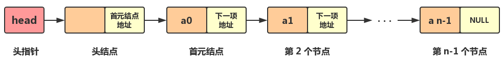

> 《数据结构（C++语言版）》书，关于数据结构再读记录。主要包含数据结构的基本概念、算法概念、时间复杂度、线性表（顺序表&链表）

<!--more-->

# 1. 基本概念术语

+ 数据（Data）：对客观事物的符号表示，它能被计算机识别、存储和加工处理。含义广泛，声音、图像、视频都属于数据的范畴。
+ 数据元素（Data Element）：数据的基本单位，有时也称为元素、结点、顶点、记录。
+ 数据项：一个数据元素可能由若干数据项（Data Item）组成。数据项是最小标识单位，有时也称为字段、域或属性。数据元素也可以仅有一个数据项。
+ **数据结构（Data Structure）**：指数据元素之间的相互关系，即数据的组织形式。一般包含三方面内容：

1. 数据元素之间的逻辑关系，也称为数据的逻辑结构（Logical Structure）
2. 数据元素及逻辑关系在计算机存储器内的表示方式，称为数据的存储结构（Storage Structure）
3. 数据运算，即对数据施加的操作。运算的定义直接依赖于逻辑结构，但运算的实现必须依赖于存储结构

## 1.1. 数据的逻辑结构

数据中元素通常有下列四种形式的逻辑关系：

1. 集合：每个元素都是独立的，相互之间没有逻辑关系
2. 线性结构：结构中的元素之间存在一对一的关系，即所谓的线性关系
3. 树形结构：结构中的数据元素之间存在一对多的关系
4. 图状结构：结构中的元素之间存在多对多的关系

通常将集合、树形结构、图状结构归纳为非线性结构。因此，数据的逻辑结构可分为两大类，即线性结构和非线性结构。

## 1.2. 数据的存储结构（物理实现方面）

四种：

1. 顺序存储：将数据元素依次存储于一组地址连续的存储单元中，**元素间的逻辑关系由存储单元的位置直接体现**，由此得到的存储表示称为顺序存储结构（Sequential Storage Structure）。高级语言中，**常用一维数组来实现顺序存储结构**。该方法主要用于线性结构。非线性结构也可通过某种线性化的处理，实现顺序存储。
2. 链接存储：将数据元素存储在一组任意的存储单元中，**用附加的指针域表示元素之间的逻辑关系**，由此得到的存储表示称为链接存储（Linked StorageStructure）。使用这种存储结构时，往往把一个数据元素及附加的指针一起称作一个结点。高级语言中，常用指针变量实现链接存储。
3. 索引存储：该方法的特点是在存储数据元素的同时，还可以建立附加的索引表（通俗讲，相当于目录）。索引表中每一项称为索引项。索引项的一般形式是：（关键字，地址）。关键字是指能唯一标识数据元素的数据项。若每个数据元素在索引表中均有一个索引项，则该索引表称为稠密索引（Dense Index）。若一个索引项对应一组数据元素，则该索引表称为稀疏索引（Sparse Index）。
4. 散列存储：该方法是依据数据元素的关键字，用一个事先设计好的函数计算出该数据元素的存储地址，然后把它存入该地址中。这种函数称为散列函数（即Hash），由散列函数计算出的地址称为散列地址。

## 1.3. 数据运算

最常用的基本运算有检索（查找）、插入、删除、更新、排序等。

综上，数据结构包含逻辑结构、存储结构和运算三方面的内容。**同一逻辑结构采用不同存储结构，得到的是不同的数据结构，常用不同的数据结构名来标识它们（1）；而同一逻辑结构定义不同的运算也会导致不同的数据结构（2）**

举几个例子：
1. 线性结构采用顺序存储时称为顺序表，采用链接存储时则称为链表
2. 若限制线性结构的插入、删除在一端进行，则该结构称为栈（先进后出）；若限制插入在一端进行，而删除在另一端进行，则称为队列（先进先出）
3. 若栈采用顺序存储结构，则称为顺序栈；若栈采用链式存储结构，则称为链栈。顺序栈与链栈也是两种不同的数据结构

***

# 2. 数据类型（Data Type）

> 数据类型是一个值的集合和在这个集合上定义的一组操作的总称。例如，C++中的整型变量，其值集为某个区间上的整数（区间大小依赖于不同的机器），定义在其上的操作为加、减、乘、除和取模等运算

按“值”可否分解，可把数据类型分为两类:

1. 原子类型：其值不可分解，如C++的基本类型（整型、字符型、实型、枚举型）、指针类型和空类型
2. 结构类型：其值可分解成若干成分（或称分量），如C++的数组类型、结构类型等。结构类型的成分可以是原子类型，也可以是某种结构类型。可以把数据类型看作程序设计语言已实现的数据结构

## 2.1. 抽象数据类型

抽象数据类型（Abstract Data Type, ADT）是指一个数学模型，以及定义在该模型上的一组操作。抽象数据类型的定义取决于它的一组逻辑特性，而与其在计算机内部如何表示和实现无关。

抽象数据类型的定义可以由一种数据结构和定义在其上的一组操作组成，而数据结构又包括数据元素间的关系，因此抽象数据类型一般可以由元素、关系及操作三种要素来定义。

***

# 3. 算法

> 沃斯（N.Wirth）的公式**数据结构+算法=程序**
> 
> 数据运算是通过算法来描述的。算法（Algorithm）是对特定问题求解步骤的描述，是指令的有限序列，其中每条指令表示一个或多个操作

## 3.1. 算法的五个特性

算法必须具备五个特性：

1. 有穷性：一个算法对于任何合法的输入必须在执行有穷步骤之后结束，且每步都可在有限时间内完成
2. 确定性：算法的每条指令必须有确切含义，不能有二义性。在任何条件下，算法只有唯一的一条执行路径，即对相同的输入只能得出相同的结果
3. 可行性：算法是可行的，即算法中描述的操作均可通过已经实现的基本运算的有限次执行来实现
4. 输入：一个算法有零个或多个输入，这些输入取自算法加工对象的集合
5. 输出：一个算法有一个或多个输出，这些输出应是算法对输入加工后合乎逻辑的结果

Tips：程序和算法十分相似，但是程序不一定要满足有穷性，例如操作系统启动后，如果没有作业处理也仍会循环等待。

## 3.2. 算法的三种描述方法

1. 自然语言：不够严谨
2. 程序流程图、N-S图等算法描述工具：简洁明了
3. **伪码语言描述**：伪码语言介于高级程序设计语言和自然语言之间，它忽略高级程序设计语言中一些严格的语法规则与描述细节，因此它比程序设计语言更容易描述和被人理解，而比自然语言更接近程序设计语言

## 3.3. 算法的四个衡量指标

1. 正确性（硬性指标）：算法的正确性主要有4个层次的要求，第一层次是指算法没有语法错误，第二层次是指算法对于几组输入数据能够得出满足规格说明要求的结果，第三层次是指算法对于精心选择的苛刻并带有刁难性的几组输入数据能够得出满足规格说明要求的结果，第四层次是指算法对于一切合法的输入数据都能得出满足规格说明要求的结果
2. 可读性：提高可读性的方法包含：注释、变量命名、程序缩排（代码规范）、段落（不同目的的代码块之间插入一个空白行）
3. 健壮性：算法中应对输入数据和参数进行合法性检查，例如三角形三条边的长度
4. 时空效率：算法的执行时间尽可能短，占用的存储空间尽可能少。但这两者往往相互矛盾，节省了时间可能牺牲空间，反之亦然。设计者应在时间与空间两方面有所平衡

***

# 4. 算法性能分析和度量

> 可以用算法的时间复杂度与空间复杂度来评价算法的优劣

## 4.1. 时间复杂度（Time Complexity）（T(n)）

一个算法的时间复杂度是指算法运行从开始到结束所需要的时间。

这个时间就是该算法中每条语句的执行时间之和，而`每条语句的执行时间 = 该语句执行次数（也称为频度） * 执行该语句所需时间`

但是，当算法转换为程序之后，一条语句执行一次所需的时间与机器的性能及编译程序生成目标代码的质量有关，是很难确定的。

为此，**假设执行每条语句所需的时间均为单位时间**。在这一假设下，一个算法所花费的时间就等于算法中所有语句的频度之和。这样就可以脱离机器的硬、软件环境而独立地分析算法所消耗的时间。

例如：

```cpp
#define N 100  //问题规模
void matrixMultiply(int A[N][N], int B[N][N], int C[N][N])
{
    for( i=0; i<N; i=i+1)   //本身执行n+1次，但是内部的循环体是执行n次
        for( j=0; j<N; j=j+1)  //执行n(n+1)次，因为本身执行n+1次
        {
            C[i][j] = 0;   //执行n^2次
            for(k=0; k<N; k=k+1)    //执行(n^2)*(n+1)次
                C[i][j] += A[i][k] * B[k][j];  //执行n^3次
        }
}
```

总计执行$n+1+n(n+1)+n^2+(n^2)*(n+1)+n^3，即T(n)=2n^3+3n^2+2n+1$

***

一般而言，**一个算法的执行时间是求解问题的规模n（如矩阵的阶数、线性表的长度）的函数**，这是因为问题的规模往往决定了算法工作量的大小。

但是，我们不关心它是个怎样的函数，只关心它的数量级量度，即它与什么简单函数f(n)是同一数量级的，即T(n)=O(f(n))。其中“O”是数学符号，其数学定义如下:

如果存在正的常数C和n0，使得当n≥n0时都满足0≤T(n)≤C*f(n)，则称T(n)与f(n)是同一数量级的，并记作T(n)=O(f(n))，即最高幂次方。**算法的执行时间T(n)=O(f(n))为该算法的时间复杂度。**

`它表示随着问题规模n的增大，该算法执行时间的增长率和f(n)的增长率相同。`

1.对于上面的例子，当n→∞时，

$$T(n)/n^3= (2n^3+3n^2+2n+1)/ n^3→2$$

根据“O”的定义可知T(n)=O(n^3)，所以上面例子的算法的时间复杂度是**O(n^3)**

2.例如，用两个算法A1和A2求解同一问题，它们的时间耗费分别是$T_1(n)=100n^2+5000n+3,T_2(n)=2n^3$。如果问题规模n不太大，则二者的时间花费也相差不大；若问题规模n很大，如n=10000，则二者的时间花费相差很大。二者的差别从时间复杂度上一目了然，因为$T_1(n)=O(n^2), T_2(n)=O(n^3)$，所以算法A1的时间性能优于算法A2

***

如果一个算法的所有语句的频度之和是问题规模n的多项式，

即

$$T(n)=C_kn^k+C_{k-1}n^{k-1}+…+C_1n+C_0C_k≠0$$

则按“O”的定义可知，该算法为k次方阶算法：

$$T(n)=O(n^k)$$

特殊情况，如果T(n)=C，其中C为常数，即算法耗费的时间与问题规模n无关，则记`T(n)=O(1)`，称该算法为常数阶算法。

***

## 4.2. 常见的时间复杂度

按数量级递增排序有：
+ 常数阶$O(1)$
+ 对数阶$O(log_2n)$
+ 线性阶$O(n)$
+ 平方阶$O(n^2)$
+ 立方阶$O(n^3)$
+ 指数阶$O(2^n)$

指数阶算法的执行时间随n的增大而迅速放大，所以其时间性能极差，当n稍大时我们就无法忍受，如汉诺塔问题。

常见的时间复杂度有：

$O(1)<O(log_2n)<O(n)<O(nlog_2n)<O(n^2)<O(n^3)<O(2^n)$

## 4.3. 简化时间复杂度计算

由于算法的时间复杂度仅刻画了算法执行时间的数量级，为了简化对算法时间性能的分析，通常的做法是，从算法中选取一种对于所研究的问题来说是最基本的操作，并以该基本操作执行的次数作为算法的时间度量

被选用的基本操作应是其重复执行次数与算法的执行时间成正比例的

例如上面的代码例子，只需获取最大阶乘的时间复杂度，即$n^3$即可，$O(n)=n^3$。

***

## 4.4. 平均时间复杂度

### 4.4.1. 和输入数据有关的时间复杂度

有些情况下，算法的时间复杂度不仅与问题的规模有关，还与输入数据有关。例如，在数组A[n]中查找给定值k的算法如下：

```cpp
i = n-1;
while(i>=0 && A[i] != k)  =i-1;
return i;
```

这个操作的执行次数取决于数组A中有没有值为k的元素。若有，这个值为k的元素又在数组中哪个位置。
+ 若数组中无值为k的元素，则操作“A[i]! =k”的执行次数为n；
+ 若A[n-1]等于k，则该操作的执行次数为1。
  
所以，该算法在最坏情况下的时间复杂度为O(n)，最好情况下的时间复杂度是O(1)。

因此，有时我们会对算法的平均（或称期望）时间复杂度感兴趣。所谓**平均时间复杂度，是指所有可能的输入数据在等概率出现的情况下算法的平均执行时间。**

**当算法的平均时间复杂度难以确定时，就以算法的最坏时间复杂度作为算法的时间复杂度**。因为它是算法执行时间的一个上界，保证了算法的执行时间不会比它更长。

### 4.4.2. 递归算法的时间复杂度

```cpp
fact(int n)
{
    if(n<=1)    return 1;   //(1)
    else    return (n*fact(n-1));   //(2)
}
```

设fact(n)的运行时间复杂度函数是T(n)，该函数中语句（1）的运行时间是$O(1)$，语句（2）的运行时间是T(n-1)+O(1)，其中O(1)为基本运行时间，

因此：
如果n≤1，则$T(n) = O(1)$

如果n>1，则$T(n) = T(n-1)+O(1)$

则$T(n) = T(n-1)+O(1)= T(n-2)+2*O(1)= T(n-3)+3*O(1)=…= T(1)+(n-1)*O(1)=n*O(1)=O(n)$

即fact(n)的时间复杂度为$O(n)$

***

## 4.5. 空间复杂度（Space Complexity）（S(n)）

空间复杂度作为算法所需存储空间的量度，记作$S(n)=O(f(n))$
（n为问题的规模）

度量和时间复杂度一样。

在大多数算法设计中，时间效率和空间效率很难兼得，设计者往往要根据具体问题进行取舍。

***

# 5. 线性表

> 线性表是最简单、最基本也是最常用的一种线性结构。它有两种存储方式：**顺序存储方式和链式存储方式**。它的主要操作是插入、删除和检索等

逻辑结构表示为：

$LinearList = {D, R}$

其中，

$D={a_i | 1<=i<=n, n>=0, a_i∈DataType} (DataType为数据元素类型)$

$R={r}$

$r={<a_i, a_{i+1}> | 1<=i<=n-1}$

线性表的基本运算方法如下：

作用|函数|初始条件|操作结果
:-:|:-:|:-:|:-:
线性表初始化|void Initiate()|线性表不存在|构造一个空的线性表
求线性表的长度|int Length()|线性表已存在|返回线性表所含数据元素的个数
取表元|DataType Get(int i) |表存在且1≤i≤Length()|返回线性表的第i个数据元素的值
按值查找|int Locate(DataType x) |线性表已存在，x是给定的一个数据元素|查找值为x的数据元素，返回首次出现的值为x的那个数据元素的序号，称为查找成功；如果未找到值为x的数据元素，返回0表示查找失败
插入操作|int Insert(DataType x, int i)|线性表已存在|在线性表的第i个位置上插入一个值为x的新元素，使原序号为i,i+1, …,n的数据元素的序号变为i+1,i+2, …,n+1，插入后表长=原表长+1，返回1表示插入成功；若线性表L中数据元素个数少于i-1个，则返回0表示插入失败
删除操作|int Deleted(int i)|线性表已存在|在线性表L中删除序号为i的数据元素，删除后使序号为i+1, i+2, …, n的元素变为序号i, i+1, …, n-1，新表长=原表长-1，返回1；若线性表中数据元素个数少于i，则返回0表示删除失败

***

## 5.1. 顺序存储结构-顺序表

内存中的地址空间是线性的，顺序表存储数据时，会提前申请一整块足够大小的物理空间，然后将数据依次存储起来，存储时做到数据元素之间不留一丝缝隙

设数据元素a1的存储地址为Loc(a1)，每个数据元素占用d个存储地址，则第i个数据元素的地址为：

$Loc(a_i)=Loc(a_1)+(i-1)*d (其中1≤i≤n)$

<font color=green>**特点**：只要知道顺序表的首地址和每个数据元素所占用地址单元的个数，就可以求出第i个数据元素的地址。这也是顺序表具有按数据元素的序号随机存取的特点。</font>

***

因为线性表的运算经常会导致长度发生变化，所以数组容量需要设计的足够大

假设用$data[MAXSIZE]$来表示，其中MAXSIZE是一个根据实际问题定义的足够大的整数，线性表中的数据元素从data[0]开始依次存放，但当前线性表中的实际元素个数可能未达到MAXSIZE，因此需要用一个**变量len**记录当前线性表中数据元素个数，使得len起到一个数字指针的作用，始终指向线性表中最后一个元素的下一个位置，其值为最后一个数据元素的位置值，若该表为空表，则len=0。

### 5.1.1. 顺序表运算

1. 初始化

```cpp
//初始化
void SequenList::Initiate()
{
  len=0;
}

void main()
{
  SequenList L;
  L.Initiate();
  ...
}
```

2. 插入

```cpp
//在线性表的第i个元素之前插入一个新的数据元素x
int SequenList::Insert(DataType x, int i)
{
  //做插入i位置的判断，是否溢出(MAXSIZE)或者不合法(len)
  ...
  for(int j=len; j>=i; j--)
      data[j]=data[j-1];   //元素后移

  data[i-1]=x; //插入元素
  len++;  //表长度+1
  return 1;
}
```

**插入算法的时间性能分析**：顺序表上的插入运算，时间主要消耗在数据元素的移动上。在第i个位置上插入x，从第i个到第n个元素都要向后移动一个位置，共需要移动n-(i-1)，即n-i+1个数据元素。而i的取值范围为1≤i≤n+1，即有n+1个位置可以插入

<font color=green>在顺序表上做插入操作需移动表中一半数据元素。时间复杂度为O(n)</font>

3. 删除

在顺序表上完成删除运算的步骤如下：

（1）将数据元素ai+1～an依次向前移动一个位置

（2）修改len值，使之仍指向最后一个数据元素的下一个位置

```cpp
//删除第i个元素
int SequenList::Delete(int i)
{
  //做插入i位置的判断，是否溢出(MAXSIZE)或者不合法(len)
  ...
  for(int j=i; j<len; j++)
      data[j-1]=data[j];   //元素前移

  len--;  //表长度-1
  return 1;
}
```

**删除算法的时间性能分析**：与插入运算相同，其时间主要消耗在移动表中元素上。删除第i个元素时，其后面的元素$a_{i+1}-a_n$都要向前移动一个位置，共移动n-i个元素

<font color=green>在顺序表上做删除运算时大约需要移动表中一半元素。该算法的时间复杂度为O(n)</font>

4. 按值查找

```cpp
int SequenList::Locate(DataType x)
{
  //返回值为x的元素的位序值
  ...
  int j=0;
  while((j<len)&&(data[j] != x)) j++;

  if(j<len) return j+1;
  else return 0;  //没有查找到
}
```

比较的次数与x在表中的位置有关，也与表长有关。当a1=x时，比较一次成功；当an=x时，比较n次成功。

<font color=green>在查找成功的情况下，平均比较次数为（n+1）/2，时间复杂度为O(n)</font>

5. 读取第i个数据元素的值

```cpp
int SequenList::Get(int i)
{
  ...
  if((i<1) || (i>len))
  {
    cout <<"not correct input"<<endl;
    return NULL;
  }
  else
    return data[i-1];
}
```

6. 取得元素个数

直接return len值

***

### 5.1.2. 顺序表存储空间的分配

线性表顺序存储结构，是预先给定大小为MAXSIZE的存储空间，程序在编译阶段就已经知道该类型变量的大小，在程序开始运行前会为它分配好存储空间，因此是一种**存储空间的静态分配**

而动态分配是在定义线性表的存储类型时，不是定义好一个存储空间，而是只定义一个指针，待程序运行后再申请一个用于存放线性表数据元素的存储空间，并把该存储空间的起始地址赋给这个指针。访问动态存储分配的线性表中的元素和访问静态存储分配的线性表中的元素的情况完全相同，既可以采用指针方式，也可以采用数组下标方式。

关于数据内存存储的方式可参考[C++内存分配方式-管理数据内存的四种方式](https://wizzie.top/Blog/2019/08/13/2019/190813_cpp_typeTemplete/#%E7%AE%A1%E7%90%86%E6%95%B0%E6%8D%AE%E5%86%85%E5%AD%98%E7%9A%84%E5%9B%9B%E7%A7%8D%E6%96%B9%E5%BC%8F)

***

## 5.2. 链式存储结构

顺序表的存储特点是用物理位置上的相邻实现了逻辑关系上的相邻，它要求用连续的存储单元顺序存储线性表中的各元素，因此，对顺序表插入、删除操作时需要通过移动数据元素来实现，严重影响了运行效率

而链式存储结构不需要用地址连续的存储单元来实现，因为它不要求逻辑关系上相邻的两个数据元素物理位置上也相邻。它通过“链”建立起数据元素之间的逻辑关系。因此对线性表的插入、删除不需要移动数据元素

### 5.2.1. 1.单链表结构

> 链表是通过一组任意的存储单元来存储线性表中的数据元素

<font color=green>为建立起数据元素之间的线性关系，对每个数据元素ai，除了存放数据元素自身的数据信息ai之外，还需要存放其后继ai+1所在的存储单元的地址，这两部分信息组成一个“结点”。

存放数据元素信息的域称为数据域，存放其后继数据元素地址的域称为指针域

n个数据元素的线性表通过每个结点的指针域形成了一个“链”，称为链表。

由于每个结点中只有一个指向后继的指针，所以称其为单链表</font>


结点结构：



+ 头指针：一个指向第一个节点地址的指针变量，头指针具有标识单链表的作用，所以经常用头指针代表单链表的名字
+ 头结点：在单链表的第一个结点之前附设一个结点，它没有直接前驱，称之为头结点
可不存信息，也可以作为监视哨，或用于存放线性表的长度等附加信息
指针域中存放首元结点的地址
+ 首元结点：存储第一个元素的节点

定义及基本运算函数：

```cpp
typedef int DataType;
clasee Item
{
  public:
    DataType data;
    Item *next;
    Item() {next=NULL};
};

class Link
{
  public:
  Item *head; //链表头指针
  Link() {head=NULL;}  //构造函数
  ~Link() {DeleteAll(); } //析构函数
  void Initiate(); //初始化
  void DeleteAll();   //删除所有结点

  void HeadCreate(int n);  //从头建链表
  void TailCreate(int n); //从尾建链表
  void HeadCreateWithHead(int n); //建立带表头的链表（从头）
  void TailreateWithHead(int n); //建立带表头的链表（从尾）
  int Length();  //链表长度

  Item *Locatex(DataType x);  //查找值为x的数据元素
  Item *Locatei(int i);   //查找第i个元素
  DataType Get(int i);    //获取第i个元素的值
  bool Insert(DataType x, int i);  //在链表第i个结点之前插入x
  bool Deleted(int i);  //删除链表中第i个结点
  void Print();   //打印链表
}
```

### 5.2.2. 单链表运算-初始化

```cpp
void Initiate()
{
  DeleteAll();
  head=NULL;
}
```

### 5.2.3. 单链表运算-建立单链表

链表与顺序表不同，它是一种动态管理的存储结构，链表中的每个结点占用的存储空间不是预先分配的，而是在运行时系统根据需求动态生成的，因此建立单链表应该从空表开始。

<font color=red>(1)从表尾到表头建立单链表（不带有空白头结点）</font>

可以在每读入一个数据元素后申请一个结点，然后插在链表的头部（从表尾到表头建立单链表）

因为是在链表的头部插入，读入数据的顺序和线性表中的逻辑顺序是相反的。

```cpp
void Link::HeadCreate(int n)
{
  DeleteAll();
  Item *s, *p;
  int i;
  p=NULL;
  for(i=1;i<=n; i++)
  {
    s=new Item();
    cin>> s->data;   //输入
    s->next = p;
    p = s;
  }
  head = p;
}
```

<font color=red>(2)从表头到表尾建立单链表（不带有空白头结点）</font>

从表尾到表头插入结点建立单链表比较简单，但读入的数据元素的顺序与生成的单链表中元素的顺序是相反的。

若希望次序一致，则用从表头到表尾建立单链表的方法。

因为每次是将新结点插入链表的尾部，所以需加入一个指针r用来始终指向链表中的尾结点，以便能够将新结点插入链表的尾部

```cpp
void Link::TailCreate(int n)
{
  DeleteAll();
  Item *s, *r, *p;
  int i;
  p=NULL;

  for(i=1;i<=n; i++)
  {
    s=new Item();
    cin>> s->data;   //输入
    s->next = NULL;   //不带有空白头结点

    //第一个结点加入前链表为空，它没有直接前驱结点
    //它的地址就是整个链表的指针，需要放在链表的头指针变量p中
    if(p==NULL) p=r=s;
    else {
      r->next=s;  //此处的顺序和上面那种方式相反
      r=s;
    }
  }
  head = p;
}
```

<font color=red>(3)从表尾到表头建立单链表（带有空白头结点）</font>

```cpp
void Link::TailCreate(int n)
{
  DeleteAll();
  Item *s, *p;
  int i;
  p=new Item();
  p->next=NULL;

  for(i=1;i<=n; i++)
  {
    s=new Item();
    cin>> s->data;   //输入
    s->next = p->next;  //带有空白头结点
    p->next = s;
    }
  }
  head = p;
}
```

<font color=red>(4)从表头到表尾建立单链表（带有空白头结点）</font>

```cpp
void Link::TailCreate(int n)
{
  DeleteAll();
  Item *s, *r, *p;
  int i;
  p=new Item();
  p->next=NULL;
  r=p;   //带有空白头结点

  for(i=1;i<=n; i++)
  {
    s=new Item();
    cin>> s->data;   //输入
    r->next=s;
    r=s;
  }
  r->next=NULL;
  head = p;
}
```

从上面4个算法可以看出，对于不带空白头结点的单链表，空表情况下需要单独处理，而带上空白头结点之后则不用了，**算法的时间复杂度均为O(n)**

***

### 5.2.4. 单链表运算-求表长

设有一个移动指针p和计数器j，初始化后，p所指结点后面若还有结点，p向后移动，计数器加1。算法如下：

```cpp
int Link::Length()
{
  int j=1;
  Item *p;
  p=head->next;
  while(p!=NULL)
  {
    j++;
    p=p->next;
  }
  return --j;
}
```

**此算法的时间复杂度为O(n)**

***

### 5.2.5. 单链表运算-查找操作

(1)按序号查找

从单链表的第一个元素结点起，判断当前结点是否是第i个，若是，则返回该结点的指针；否则继续下一个结点的查找，直到表结束为止。

若没有第i个结点，则返回空；如果i=0，则返回头指针。算法如下：

```cpp
Item *Locatei(int i)
{
  int j=1;
  Item *p;

  if(i=1) return head;

  p=head->next;
  while((p!=NULL) && (j<i))
  {
    j++;
    p=p->next;
  }

  if(j==i) return p;
  else
  {
    cout<<"not correct input!" <<endl;
    return NULL;
  }
}
```

**时间复杂度均为O(n)**

(2)按值查找即定位

从链表的第一个元素结点起，判断当前结点值是否等于x，若是，返回该结点的指针，否则继续下一个结点的查找，直到表结束为止。若找不到，则返回空。算法如下：

```cpp
Item *Locatex(DataType x)
{
  Item *p;
  p=head->next;
  while((p!=NULL) && (p->data != x))  p=p->next;

  if(p)   return p;   //即p不为空
  else
  {
    cout<< x << " is not exist" <<endl;
    return NULL;
  }
}
```

**时间复杂度均为O(n)**

(3) 读取第i个位置上的元素值

```cpp
DataType Link::Get(int i)
{
  int j;
  Item *p;
  j=1;
  p=head->next;

  while((j<i) && (p != NULL))
  {
    j++;
    p=p->next;
  }

  if((p==NULL) || (j>i))
  {
    cout <<"not correct" <<endl;
  } else
  {
    return p->data;  
  }
}
```

**时间复杂度均为O(n)**

***

### 5.2.6. 单链表运算-插入

(1)后插结点

设p指向单链表中某结点，s指向待插入的值为x的新结点，将*s插入 *p的后面

操作如下：（两个指针的操作顺序不能交换）

① s->next=p->next;

② p->next=s;

**时间复杂度为O(1)**

***

(2)前插结点

设p指向链表中某结点，s指向待插入的值为x的新结点，将*s插入 *p的前面

与后插不同的是，首先要找到＊p的前驱＊q，再完成在*q之后插入*s。设单链表头指针为L，操作如下：

```cpp
q=L;
while(q->next != p)
  q=q->next;  //找到*p的直接前驱

s->next = q->next;
q->next = s;
```

**时间复杂度为O(n)**

如果将*s直接插入 *p的后面，然后将p->data与s->data交换。这样既满足了逻辑关系，也能使得时间复杂度为O(1)。

***

(3)插入算法

步骤：

① 找到第i-1个结点；若存在，继续步骤②，否则结束

② 申请新结点，将数据填入新结点的数据域

③ 将新结点插入

```cpp
bool Link::Insert(DataType x, int x) {
  Item *p, *s;
  p = Locatei(i-1);  //查找i-1的结点

  if(p == NULL) {
    cout << "not correct" <<endl;
    return false;
  }

  s = new Item();
  s->data = x;
  s->next = p->next;
  p->next = s;
  return true;
}
```

***

### 5.2.7. 单链表运算-删除

(1)删除结点

设p指向单链表中某结点，删除*p

要实现对结点*p的删除，

首先要找到*p的前驱结点 *q，然后完成指针的删除操作即可

指针的操作，由下列语句实现：

```cpp
q->next = p->next;
delete p;
```

PS:找前驱结点*q的时间复杂度是$O(n)$

删除：

```cpp
s = p->next;
p->next = s->next;
delete s;
```

PS:该操作时间复杂度$O(1)$

***

(2)删除运算

① 找到第i-1个结点，若存在，继续步骤②，否则结束

② 若存在第i个结点，则继续步骤③，否则结束

③ 删除第i个结点，结束

***

### 5.2.8. 单链表运算-删除所有结点

```cpp
void Link::DeleteAll() {
  Item *p = head, *q;
  while(p != NULL) {
    q = p->next;
    delete p;
    p = q;
  }
  head = NULL;
}
```

通过上面的基本操作可知：

1. 在单链表上插入、删除一个结点，必须知道其前驱结点的指针；
2. 单链表不具有按序号随机访问的特点，只能从头指针开始一个个顺次进行。

***

### 5.2.9. 2.循环链表结构

对于单链表而言，最后一个结点的指针域是空指针。

如果将该链表头指针置入该指针域，则使得链表头尾结点相连，就构成了循环单链表

**对于单链表，只能从头结点开始遍历整个链表；而对于循环单链表，则可以从表中任意结点开始遍历整个链表。**不仅如此，有时对链表常做的操作是在表尾、表头之间进行。

**此时可以改变链表的标识方法，不用头指针而用一个指向尾结点的指针R来标识，可以使操作效率得以提高**


***

### 5.2.10. 3.双向链表结构

单链表的结点中只有一个指向其后继结点的指针域next，因此若已知某结点的指针为p，其后继结点的指针则为p->next，而找其前驱则只能从该链表的头指针开始，顺着各结点的next域进行。

也就是说，找后继的时间复杂度是O(1)，找前驱的时间复杂度是O(n)。

**如果也希望找前驱的时间复杂度达到O(1)，则只能付出空间的代价：每个结点再加一个指向前驱的指针域，用这种结点组成的链表称为双向链表**

***

## 5.3. 顺序表和链式表对比

顺序存储有以下3个优点：

1. 方法简单，各种高级语言中都有数组，容易实现
2. 不用为表示结点间的逻辑关系而增加额外的存储开销
3. 可以按元素序号随机访问表中结点

缺点：

1. 在顺序表中做插入、删除操作时，平均约需移动表中一半元素。因此对数据元素较多的顺序表来说，运算效率比较低
2. 需要预先分配足够大的存储空间，估计得过大，可能会导致顺序表空间大量闲置；**预先分配过小，容易会造成溢出**

链式表优点：

1. 基于存储的考虑，顺序表的存储空间是静态分配的，在程序执行之前必须明确规定它的存储规模。对线性表的长度或存储规模难以估计时，不宜采用顺序表。**链式表不用事先估计存储规模，但链式表的存储密度较低**
2. 基于运算的考虑，在顺序表中按序号访问ai的时间复杂度是O(1)，而在链式表中按序号访问ai的时间复杂度是O(n)，所以**如果经常做的操作是按序号访问数据元素，显然顺序表优于链式表**。在顺序表中做插入、删除时，平均约需移动表中一半元素，当数据元素的信息量较大且表较长时；在链式表中做插入、删除时，虽然也要找插入位置，但主要是比较操作。从这个角度考虑，显然后者优于前者
3. 基于难易的考虑，顺序表容易实现，任何高级语言中都有数组类型；链式表的操作是基于指针的

PS：存储密度，是指一个结点中数据元素所占的存储单元和整个结点所占的存储单元之比。显然，链式存储结构的存储密度小于1。

# 6. 参考

+ [C语言-链表的创建头插法和尾插法（有无头节点）](https://blog.csdn.net/syzdev/article/details/77888024)
+ [如何使用C++实现单链表](https://zhuanlan.zhihu.com/p/84950700)
+ [C语言之单链表操作](https://zhuanlan.zhihu.com/p/83617598)