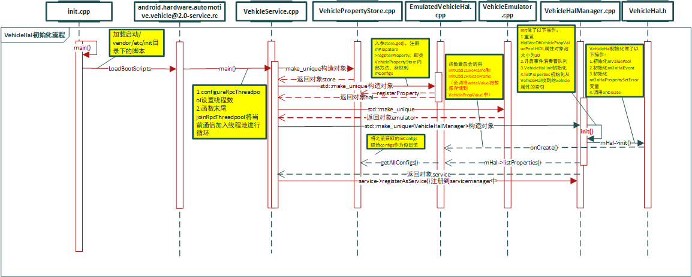
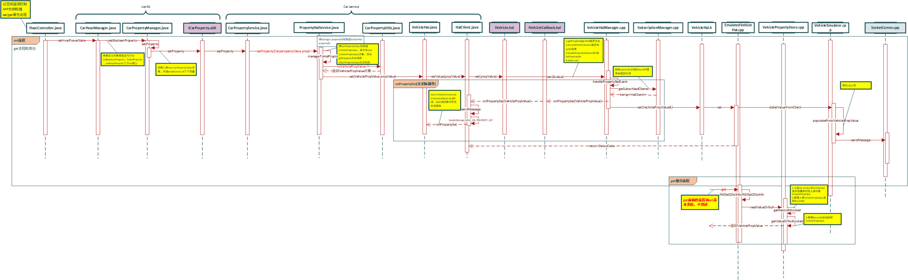

> 文档内容：1.vehicle HAL架构介绍、详细的启动流程；2.部分车辆属性类型名称说明；3.上层carservice和hal层数据subscribe/set/get流程梳理;4.dbus和vehicle hal连接交互的流程；4.从dbus回调数据返回至APP层的详细流程梳理（最终梳理方法流转调用的流程，绘制序列图）

***

## VehicleHAL启动流程

+ 源码位置：`hardware/interfaces/automotive/vehicle/2.0/`

1. `.rc`文件`android.hardware.automotive.vehicle@2.0-service.rc`启动进程

该文件位于设备系统`vendor/etc/init`目录

```s hardware/interfaces/automotive/vehicle/2.0/default/android.hardware.automotive.vehicle@2.0-service.rc
service vendor.vehicle-hal-2.0 /vendor/bin/hw/android.hardware.automotive.vehicle@2.0-service
    class hal
    user vehicle_network
    group system inet
```

2. init进程加载启动`/vendor/etc/init`目录下的脚本

```cpp
static void LoadBootScripts(ActionManager& action_manager, ServiceList& service_list) {
    Parser parser = CreateParser(action_manager, service_list);

    std::string bootscript = GetProperty("ro.boot.init_rc", "");
    if (bootscript.empty()) {
        parser.ParseConfig("/init.rc");
        if (!parser.ParseConfig("/system/etc/init")) {
            late_import_paths.emplace_back("/system/etc/init");
        }
        if (!parser.ParseConfig("/product/etc/init")) {
            late_import_paths.emplace_back("/product/etc/init");
        }
        if (!parser.ParseConfig("/odm/etc/init")) {
            late_import_paths.emplace_back("/odm/etc/init");
        }
        if (!parser.ParseConfig("/vendor/etc/init")) {
            late_import_paths.emplace_back("/vendor/etc/init");
        }
    } else {
        parser.ParseConfig(bootscript);
    }
}
```

***

### vehicleHal类图


#### types.hal/IVehicle.hal/IVehicleCallback.hal

> 均在`/hardware/interfaces/automotive/vehicle/2.0/`目录下

1. types.hal定义的是一些数据结构
2. IVehicle.hal定义的是从CarService往HAL调用的接口
3. IVehicleCallback.hal则是HAL往CarService上报回调的接口


***

## VehicleHal初始化流程

初始化从执行`hardware/interfaces/automotive/vehicle/2.0/default/VehicleService.cpp`的main函数开始：

+ 创建VehiclePropertyStore对象
+ 创建EmulatedVehicleHal对象
+ 创建VehicleEmulator对象
+ 创建VehicleHalManager对象

```cpp
int main(int /* argc */, char* /* argv */ []) {
    //调用VehiclePropertyStore构造函数，构造一个对象
    auto store = std::make_unique<VehiclePropertyStore>();
    //调用EmulatedVehicleHal构造函数，入参VehiclePropertyStore
    auto hal = std::make_unique<impl::EmulatedVehicleHal>(store.get());
    //调用VehicleEmulator构造函数，入参EmulatedVehicleHal
    auto emulator = std::make_unique<impl::VehicleEmulator>(hal.get());
    //创建VehicleHalManager对象
    auto service = std::make_unique<VehicleHalManager>(hal.get());

    configureRpcThreadpool(4, true /* callerWillJoin */);//设置线程数

    ALOGI("Registering as service...");
    status_t status = service->registerAsService();

    if (status != OK) {
        ALOGE("Unable to register vehicle service (%d)", status);
        return 1;
    }

    ALOGI("Ready");
    joinRpcThreadpool();//将当前通信加入线程池进行循环

    return 1;
}
```

------> VehicleHalManager构造函数中调用init初始化：

+ 重置HidlVecOfVehiclePropValuePool HIDL属性对象池大小
+ 开启事件消费着队列
+ VehicleHal初始化

```cpp
VehicleHalManager(VehicleHal* vehicleHal)
    : mHal(vehicleHal),
      mSubscriptionManager(std::bind(&VehicleHalManager::onAllClientsUnsubscribed,
                                     this, std::placeholders::_1)) {
    init();
}

void VehicleHalManager::init() {
    ALOGI("VehicleHalManager::init");
    //1.重置HidlVecOfVehiclePropValuePool HIDL属性对象池大小为20
    mHidlVecOfVehiclePropValuePool.resize(kMaxHidlVecOfVehiclPropValuePoolSize);
    //2.开启事件消费着队列
    mBatchingConsumer.run(&mEventQueue,
                          kHalEventBatchingTimeWindow,
                          std::bind(&VehicleHalManager::onBatchHalEvent,
                                    this, _1));
    //3.VehicleHal初始化
    mHal->init(&mValueObjectPool,
               std::bind(&VehicleHalManager::onHalEvent, this, _1),
               std::bind(&VehicleHalManager::onHalPropertySetError, this,
                         _1, _2, _3));

    // Initialize index with vehicle configurations received from VehicleHal.
    //4.初始化从VehicleHal收到的vehicle属性的索引
    auto supportedPropConfigs = mHal->listProperties();
    mConfigIndex.reset(new VehiclePropConfigIndex(supportedPropConfigs));

    std::vector<int32_t> supportedProperties(
        supportedPropConfigs.size());
    for (const auto& config : supportedPropConfigs) {
        supportedProperties.push_back(config.prop);
    }
}
```

------> VehicleHal.h初始化做了以下操作：
1.初始化mValuePool
2.初始化mOnHalEvent
3.初始化mOnHalPropertySetError变量
4.调用onCreate

```cpp
    void init(
        VehiclePropValuePool* valueObjectPool,
        const HalEventFunction& onHalEvent,
        const HalErrorFunction& onHalError) {
        mValuePool = valueObjectPool;
        mOnHalEvent = onHalEvent;
        mOnHalPropertySetError = onHalError;

        onCreate();
    }
```

-----> 调用onCreate函数，遍历属性列表并以mPropStore，即VehiclePropertyStore保存当前值

### vehiclehal启动序列图



***

## 车辆属性类型types.hal

### 车辆属性VehiclePropertyType

+ 定义在hardware/interfaces/automotive/vehicle/2.0/types.hal（以下属性定义均在该文件内）

在上面的onCreate函数最后会调用initObd2LiveFrame和initObd2FreezeFrame
-----> 调用VehicleUtils.cpp `createVehiclePropValue(VehiclePropertyType::MIXED, 0)`即车辆属性

```cpp
std::unique_ptr<VehiclePropValue> createVehiclePropValue(
    VehiclePropertyType type, size_t vecSize) {
    auto val = std::unique_ptr<VehiclePropValue>(new VehiclePropValue);
    switch (type) {
        case VehiclePropertyType::INT32:      // fall through
        case VehiclePropertyType::INT32_VEC:  // fall through
        case VehiclePropertyType::BOOLEAN:
            val->value.int32Values.resize(vecSize);
            break;
        case VehiclePropertyType::FLOAT:      // fall through
        case VehiclePropertyType::FLOAT_VEC:
            val->value.floatValues.resize(vecSize);
            break;
        case VehiclePropertyType::INT64:
        case VehiclePropertyType::INT64_VEC:
            val->value.int64Values.resize(vecSize);
            break;
        case VehiclePropertyType::BYTES:
            val->value.bytes.resize(vecSize);
            break;
        case VehiclePropertyType::STRING:
        case VehiclePropertyType::MIXED:
            break; // Valid, but nothing to do.
        default:
            ALOGE("createVehiclePropValue: unknown type: %d", type);
            val.reset(nullptr);
    }
    return val;
}
```

此处这些值在hardware/interfaces/automotive/vehicle/2.0/types.hal中十六进制定义：

```cpp 
enum VehiclePropertyType : int32_t {
    STRING          = 0x00100000,
    BOOLEAN         = 0x00200000,
    INT32           = 0x00400000,
    INT32_VEC       = 0x00410000,
    INT64           = 0x00500000,
    INT64_VEC       = 0x00510000,
    FLOAT           = 0x00600000,
    FLOAT_VEC       = 0x00610000,
    BYTES           = 0x00700000,
    //混合类型组合
    MIXED           = 0x00e00000,
    MASK            = 0x00ff0000
};
```

### 车辆区域类型VehicleArea

定义在hardware/interfaces/automotive/vehicle/2.0/types.hal
```cpp
enum VehicleArea : int32_t {
    GLOBAL      = 0x01000000,   //全局
    /** WINDOW maps to enum VehicleAreaWindow 窗户区域*/
    WINDOW      = 0x03000000,
    /** MIRROR maps to enum VehicleAreaMirror 反光镜区域*/
    MIRROR      = 0x04000000,
    /** SEAT maps to enum VehicleAreaSeat 座位区域*/
    SEAT        = 0x05000000,
    /** DOOR maps to enum VehicleAreaDoor 车门区域*/
    DOOR        = 0x06000000,
    /** WHEEL maps to enum VehicleAreaWheel 车轮区域*/
    WHEEL       = 0x07000000,
    MASK        = 0x0f000000,
};
```

#### 车辆属性分组类型VehiclePropertyGroup

+ 定义在hardware/interfaces/automotive/vehicle/2.0/types.hal

```cpp
enum VehiclePropertyGroup : int32_t {
    //hardware/interfaces/automotive/vehicle/2.0/types.hal
    SYSTEM      = 0x10000000,

    //vendor 可定制修改
    VENDOR      = 0x20000000,

    MASK        = 0xf0000000,
};
```

#### 车辆窗户区域属性VehicleAreaWindow

```cpp
/**
 * Various windshields/windows in the car.
 */
enum VehicleAreaWindow : int32_t {
    FRONT_WINDSHIELD  = 0x00000001,
    REAR_WINDSHIELD   = 0x00000002,
    ROW_1_LEFT        = 0x00000010,
    ROW_1_RIGHT       = 0x00000040,
    ROW_2_LEFT        = 0x00000100,
    ROW_2_RIGHT       = 0x00000400,
    ROW_3_LEFT        = 0x00001000,
    ROW_3_RIGHT       = 0x00004000,

    ROOF_TOP_1        = 0x00010000,
    ROOF_TOP_2        = 0x00020000,

};
```

### 车辆属性访问权限VehiclePropertyAccess

+ 定义在hardware/interfaces/automotive/vehicle/2.0/types.hal

```cpp
enum VehiclePropertyAccess : int32_t {
    NONE = 0x00,
    READ = 0x01,
    WRITE = 0x02,
    READ_WRITE = 0x03,
};
```

### 车辆属性变化模式VehiclePropertyChangeMode

+ 定义在hardware/interfaces/automotive/vehicle/2.0/types.hal

```cpp
enum VehiclePropertyChangeMode : int32_t {
    //静态属性，不支持subscribe订阅，只能get获取
    STATIC = 0x00,
    //ONCHANGE这个类型的属性当变化时必须上报
    //调用get接口获取当前值;
    //set接口是异步的，当属性读取（调用get接口）在属性设置(调用set接口)之后，也有可能获取到的是旧值，除非从硬件反馈属性的确发送变化
    //我们大多数属性都是这个类型
    ON_CHANGE = 0x01,
    //CONTINUOUS类型的属性会不断的周期性的发送变化。比如速度和方向盘角度等，需要设置采样率范围
    CONTINUOUS = 0x02,
};
```

### 车辆属性事件订阅信息SubscribeOptions

```cpp
struct SubscribeOptions {
    /** Property to subscribe */
    //订阅的属性的Id
    int32_t propId;

    //以Hz为单位的采样率
    //必须为具有VehiclePropertyChangeMode::CONTINUOUS的属性提供
    //值必须包含在VehiclePropConfig#minSamplingRate .. VehiclePropConfig#maxSamplingRate给定的范围内
    //该值标志每秒客户端想要接受多少更新
    float sampleRate;

    /** 指定监听哪个事件的标志 */
    SubscribeFlags flags;
};

enum SubscribeFlags : int32_t {
    UNDEFINED = 0x0,
    //订阅来自vehicle hal的属性，极有可能来自于车辆本身
    EVENTS_FROM_CAR = 0x1,
    //当被vehicle hal的client客户端（即car service）调用set时使用该标志订阅事件
    EVENTS_FROM_ANDROID = 0x2,
};
```

### 车辆座椅属性VehicleAreaSeat

```cpp
/**
 * Various Seats in the car.
 */
enum VehicleAreaSeat : int32_t {
    ROW_1_LEFT   = 0x0001,
    ROW_1_CENTER = 0x0002,
    ROW_1_RIGHT  = 0x0004,
    ROW_2_LEFT   = 0x0010,
    ROW_2_CENTER = 0x0020,
    ROW_2_RIGHT  = 0x0040,
    ROW_3_LEFT   = 0x0100,
    ROW_3_CENTER = 0x0200,
    ROW_3_RIGHT  = 0x0400
};
```

### 接口调用状态值StatusCode

```cpp
enum StatusCode : int32_t {
    OK = 0,
    /** Try again. */
    TRY_AGAIN = 1,
    /** Invalid argument provided. */
    INVALID_ARG = 2,

    /**
     * This code must be returned when device that associated with the vehicle
     * property is not available. For example, when client tries to set HVAC
     * temperature when the whole HVAC unit is turned OFF.
     */
    NOT_AVAILABLE = 3,

    /** Access denied */
    ACCESS_DENIED = 4,
    /** Something unexpected has happened in Vehicle HAL */
    //vehicle hal内部错误
    INTERNAL_ERROR = 5,
};
```

***

## 回调接口函数IVehicleCallback

+ 定义于：hardware/interfaces/automotive/vehicle/2.0/IVehicleCallback.hal

```cpp
interface IVehicleCallback {
    /**
     * @param values that has been updated.入参时已经更新的value值
     */
    //每当一个API使用者已经订阅的变量需要去report报告的时候，事件回调就会发生
    //这可能基于阙值和频率（一个规律性的订阅，看订阅调用的参数）或者set函数被调用并且实际的变化需要report报告
    //这个回调和属性的零界值或更新频率有关
    oneway onPropertyEvent(vec<VehiclePropValue> propValues);

    /**
     * @param value Value that was set by a client.被上层客户端设置的value的值
     */
    //如果客户端已经订阅了一个SubscribeFlags::EVENTS_FROM_ANDROID标志的属性，并且调用了set方法，该函数会被触发回调
    //这些事件必须没有任何batching批处理，就立刻传递给订阅者
    //当客户端订阅属性时使用SubscribeFlags::SET_CALL标志，并且当IVehicle的set接口被调用时就会回调这个接口
    oneway onPropertySet(VehiclePropValue propValue);

    /**
     * @param errorCode - any value from StatusCode enum.来自状态码枚举中的任何值
     * @param property - a property where error has happened.
     * @param areaId - bitmask that specifies in which areas the problem has
     *                 occurred, must be 0 for global properties
     */
    //set属性通常是异步操作
    //因此即使客户端从set接口函数接收到StatusCode::OK的状态码，这并不能保证value被成功传递到车载网络
    //如果发生这种小概率事件，该函数会被调用
    oneway onPropertySetError(StatusCode errorCode,
                              int32_t propId,
                              int32_t areaId);
};
```

***

## VehicleHal获取/设置属性流程

### subscribe订阅属性

> CarService在onCreate中创建ICarImpl时，构造函数中new VehicleHal对象，然后又在CarImpl的init函数中调用VehicleHal对象的init函数

packages/services/Car/service/src/com/android/car/hal/VehicleHal.java - 构造函数new各个HalService（继承于PropertyHalServiceBase->基类HalServiceBase），并且new HalClient客户端对象

----> init函数执行`mHalClient.getAllPropConfigs()`从Vehicle HAL(IVehicle.hal)获取所有的属性，调用到VehicleHalManager.cpp的该函数

----> 遍历HALService执行service.takeSupportedProperties获取CarService支持的属性

-----> 在该遍历代码块最后执行`service.init()`初始化各个HALService

-----> 例如PowerHalService.java - PowerHalService执行init，调用`mHal.subscribeProperty`

-----> 调用VehicleHal.java的subscribeProperty，然后调用`mHalClient.subscribe(opts)`

-----> 调用HalClient.java的subscribe，调用`mVehicle.subscribe(...)`

------> 调用`hardware/interfaces/automotive/vehicle/2.0/IVehicle.hal`的subscribe

------> 调用`hardware/interfaces/automotive/vehicle/2.0/default/common/src/VehicleHalManager.cpp`的subscribe

(1) -------> SubscriptionManager.cpp - addOrUpdateSubscription
(2) ------> subscribe，返回statusCode结果状态码

-----> isContinuousProperty 改变VehiclePropConfig的changemode为CONTINUOUS（即不断的周期性的发送变化）

```cpp
//hardware/interfaces/automotive/vehicle/2.0/default/impl/vhal_v2_0/VehicleEmulator.h
class EmulatedVehicleHalIface : public VehicleHal{.....}
//hardware/interfaces/automotive/vehicle/2.0/default/impl/vhal_v2_0/EmulatedVehicleHal.h
class EmulatedVehicleHal : public EmulatedVehicleHalIface{....}
//hardware/interfaces/automotive/vehicle/2.0/default/impl/vhal_v2_0/EmulatedVehicleHal.cpp
....
```

**此时所有属性都subscribe，CarService就可以所有接收到Vehicle HAL发上来的所有属性变化**

同理，unsubscribe注销订阅

### subscribe序列图


***

### set设置属性请求流程

例如空调APP的设置开关状态：packages/apps/Car/Hvac/src/com/android/car/hvac/HvacController.java - setHvacPowerState

-----> packages/services/Car/car-lib/src/android/car/hardware/hvac/CarHvacManager.java - setBooleanProperty

-----> packages/services/Car/car-lib/src/android/car/hardware/property/CarPropertyManager.java(大部分会使用该manager) - setBooleanProperty

------> setProperty(将propId,area,value三个参数组成CarPropertyValue参数并设置到CarPropertyServiceBase端)

------> packages/services/Car/car-lib/src/android/car/hardware/property/ICarProperty.aidl - setProperty[AIDL通信]

-----> packages/services/Car/service/src/com/android/car/CarPropertyService.java - setProperty
```java
public class CarPropertyService extends ICarProperty.Stub
        implements CarServiceBase, PropertyHalServiceBase.PropertyHalListener {
            ......
    private final PropertyHalServiceBase mHal;

    @Override
    public void setProperty(CarPropertyValue prop) {
        ICarImpl.assertPermission(mContext, mPermission);
        mHal.setProperty(prop);
    }
```

-----> ./hal/PropertyHalServiceBase.java - setProperty
```java
    public void setProperty(CarPropertyValue prop) {
        //获取到halPropId，这个halPropId是Vehiclehal定义生成的
        int halPropId = managerToHalPropId(prop.getPropertyId());
        //将CarPropertyValue参数转换成VehiclePropValue
        VehiclePropValue halProp = toVehiclePropValue(prop, halPropId);
        try {
            mVehicleHal.set(halProp);
        } catch (PropertyTimeoutException e) {
            Log.e(CarLog.TAG_PROPERTY, "set, property not ready 0x" + toHexString(halPropId), e);
            throw new RuntimeException(e);
        }
    }
```

------> ./hal/VehicleHal.java - set()

------> ./hal/HalClient.java - setValued调用`mVehicle.set(propValue)`

------> hardware/interfaces/automotive/vehicle/2.0/IVehicle.hal - set(VehiclePropValue propValue)...

------> hardware/interfaces/automotive/vehicle/2.0/default/common/src/VehicleHalManager.cpp - set设置属性

(1) 回调流程：
    ----> handlePropertySetEvent调用SubscriptionManager.cpp的getSubscribedClients返回订阅的HalClient对象list列表
    ----> handlePropertySetEvent最后会遍历HALClient列表，然后回调`client->getCallback()->onPropertySet(value);`
    ----> HalClient.java - `class VehicleCallback extends IVehicleCallback.Stub`从而调用onPropertySet的sendMessage，然后handlemessage处理消息

(2) ----> EmulatedVehicleHal.cpp - set函数(和get相同)，此处会返回statusCode设置结果的状态码

-----> SendMsgtoVehicle(msg)

***

### get获取属性请求流程

packages/services/Car/car-lib/src/android/car/hardware/CarVendorExtensionManager.java - getProperty

-----> CarPropertyManagerBase.java - getProperty

-----> ICarProperty.aidl - getProperty[AIDL通信]

-----> packages/services/Car/service/src/com/android/car/CarPropertyServiceBase.java - getProperty
```java
public class CarPropertyServiceBase extends ICarProperty.Stub
        implements CarServiceBase, PropertyHalServiceBase.PropertyHalListener {
            ......
    private final PropertyHalServiceBase mHal;

    @Override
    public CarPropertyValue getProperty(int prop, int zone) {
        ICarImpl.assertPermission(mContext, mPermission);
        return mHal.getProperty(prop, zone);
    }
```

-----> ./hal/PropertyHalServiceBase.java - setProperty
```java
    public CarPropertyValue getProperty(int mgrPropId, int areaId) {
        int halPropId = managerToHalPropId(mgrPropId);
   
        VehiclePropValue value = null;
        try {
            value = mVehicleHal.get(halPropId, areaId);
        } catch (PropertyTimeoutException e) {
            Log.e(CarLog.TAG_PROPERTY, "get, property not ready 0x" + toHexString(halPropId), e);
        }

        return value == null ? null : toCarPropertyValue(value, mgrPropId);
    }
```

------> ./hal/VehicleHal.java - get()设置VehiclePropValue对象，并初始化参数
```java
    public VehiclePropValue get(int propertyId, int areaId) throws PropertyTimeoutException {
        VehiclePropValue propValue = new VehiclePropValue();
        propValue.prop = propertyId;
        propValue.areaId = areaId;
        return mHalClient.getValue(propValue);
    }
```

------> ./hal/HalClient.java - getValue调用`mVehicle.get...`

------> hardware/interfaces/automotive/vehicle/2.0/IVehicle.hal - get(VehiclePropValue requestedPropValue)...

------> hardware/interfaces/automotive/vehicle/2.0/default/common/src/VehicleHalManager.cpp - get属性

-------> hardware/interfaces/automotive/vehicle/2.0/default/impl/vhal_v2_0/EmulatedVehicleHal.cpp - get函数

```cpp
//hardware/interfaces/automotive/vehicle/2.0/default/impl/vhal_v2_0/VehicleEmulator.h
class EmulatedVehicleHalIface : public VehicleHal{.....}

//hardware/interfaces/automotive/vehicle/2.0/default/impl/vhal_v2_0/EmulatedVehicleHal.h
class EmulatedVehicleHal : public EmulatedVehicleHalIface{....}

//hardware/interfaces/automotive/vehicle/2.0/default/impl/vhal_v2_0/EmulatedVehicleHal.cpp
VehicleHal::VehiclePropValuePtr EmulatedVehicleHal::get(
        const VehiclePropValue& requestedPropValue, StatusCode* outStatus) {
    auto propId = requestedPropValue.prop;
    auto& pool = *getValuePool();
    VehiclePropValuePtr v = nullptr;

    switch (propId) {
        case OBD2_FREEZE_FRAME:
            v = pool.obtainComplex();
            *outStatus = fillObd2FreezeFrame(requestedPropValue, v.get());
            break;
        case OBD2_FREEZE_FRAME_INFO:
            v = pool.obtainComplex();
            *outStatus = fillObd2DtcInfo(v.get());
            break;
        default:
            auto internalPropValue = mPropStore->readValueOrNull(requestedPropValue);
            if (internalPropValue != nullptr) {
                v = getValuePool()->obtain(*internalPropValue);
            }
            *outStatus = v != nullptr ? StatusCode::OK : StatusCode::INVALID_ARG;
            break;
    }
    return v;
}
```

-----> VehiclePropertyStore.cpp - readValueOrNull

-----> getRecordIdLocked 根据入参VehiclePropValue获取RecordId，关于VehiclePropValue对象可查看上层VehicleHal.java的get函数的流程

------> 调用getValueOrNullLocked，根据RecordId从VehiclePropertyStore中读取

```cpp
//VehiclePropertyStore.cpp
VehiclePropertyStore::RecordId VehiclePropertyStore::getRecordIdLocked(
        const VehiclePropValue& valuePrototype) const {
    RecordId recId = {
        .prop = valuePrototype.prop,
        .area = isGlobalProp(valuePrototype.prop) ? 0 : valuePrototype.areaId,
        .token = 0
    };

    auto it = mConfigs.find(recId.prop);
    if (it == mConfigs.end()) return {};

    if (it->second.tokenFunction != nullptr) {
        recId.token = it->second.tokenFunction(valuePrototype);
    }
    return recId;
}

const VehiclePropValue* VehiclePropertyStore::getValueOrNullLocked(
        const VehiclePropertyStore::RecordId& recId) const  {
    auto it = mPropertyValues.find(recId);
    return it == mPropertyValues.end() ? nullptr : &it->second;
}


//VehiclePropertyStore.h
class VehiclePropertyStore {
    ...
    struct RecordId {
        int32_t prop;
        int32_t area;
        int64_t token;

        bool operator==(const RecordId& other) const;
        bool operator<(const RecordId& other) const;
    };

    using PropertyMap = std::map<RecordId, VehiclePropValue>;
    .....
    PropertyMap mPropertyValues;
}
```

### set和get属性流程序列图



***

## DBus IPC通信方式

+ DBus是一种低延迟、低开销、高可用性的IPC（interprocess communication ）机制总线系统，用于进程间的通信（会话总线）或进程与内核的通信（系统总线）

### 应用场景

根据DBUS消息类型可知，DBUS提供一种高效的进程间通信机制，主要用于进程间函数调用以及进程间信号广播。

1. 函数调用：DBUS可以实现进程间函数调用，进程A发送函数调用的请求（Methodcall消息），经过总线转发至进程B。进程B将应答函数返回值（Method return消息）或者错误消息（Error消息）
2. 消息广播：进程间消息广播（Signal消息）不需要响应，接收方需要向总线注册感兴趣的消息类型，当总线接收到“Signal消息”类型的消息时，会将消息转发至希望接收的进程

### 通信实现原理

> 在DBUS通信过程中，存在一个后台进程（BUS Daemon Process）。后台进程和普通进程间信息交互是通过**域套接字**进行通信

***

## 参考
 
+ [Item 21: 比起直接使用new优先使用std::make_unique和std::make_shared](https://www.cnblogs.com/boydfd/p/5146432.html)