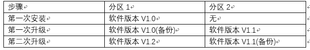
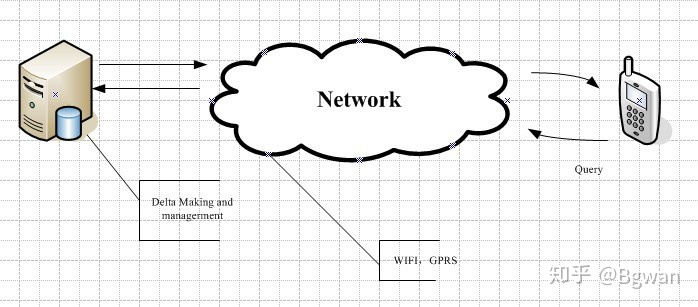

## OTA介绍

> OTA全称为Over-The-Air technology(空中下载技术)，通过移动通信的接口实现对软件进行远程管理，传统的做法到4S店通过整车OBD（一种为汽车故障诊断而延伸出来的一种检测系统）对相应的ECU进行软件升级。OTA技术最早2000年在出现日本，目前通过OTA方式升级软件广泛应用于智能手机。


**汽车OTA的好处和作用：**

1. OTA远程为用户修复软件故障，大幅度缩短中间步骤的时间，使软件快速到达用户，减少汽车制造产商和用户的成本，包括汽车制造产商的召回成本，用户的时间成本
2. OTA可以为车辆增加新功能，增加用户的新鲜感
3. OTA拓宽了“服务”和“运营”的范畴，增加车辆的附加价值


### OTA架构

OTA整体架构包含OTA云端、OTA终端、OTA设计对象三部分。


OTA云端为OEM专属的云端服务器平台，OTA终端采用Tbox，OTA设计对象网络架构按功能域划分，分为动力系统域、车身系统域、影音系统域、ADAS主动安全域


<font color=red> **PS：** T-BOX有各种各样的接口与总线相连，不仅包括传统的控制器局域网CAN（Controller Area Network）、局域互联网络LIN （Local Interconnect Network）以及调试接口RS232/RS485/USB2.0等，还包括了汽车总线“新贵”车载以太网（Ethernet）</font>

1. OTA云端：也称为OTA云服务平台，包含OEM支持OTA升级的ECU全部的完整的升级包。OTA云端的设计要求是独立的平台，支持多车型、多型号规格、多种类型ECU软件的升级。**OTA云端的框架结构主要包括五部分：OTA管理平台、OTA升级服务、任务调度、文件服务、任务管理**


2. OTA终端：主要包含OTA引擎和OTA适配器，其中OTA引擎是一个连接OTA终端与OTA云端的桥梁，实现云端同终端的安全通信，包括升级包下载、升级包解密、差分包重构等功能。OTA适配器是为兼容不同的软件或设备的不同更新逻辑或流程，根据统一的接口要求封装的不同实现。升级适配器由需要OTA升级的各个ECU软件实现提供

3. 汽车OTA对象：主要包括影音系统，ADAS软件，以及车内嵌入式ECU。嵌入式ECU通常采用软件备份功能，即ECU内部用于两片区域，一部分用于存储当前运行的程序，一部分用于存储备份程序。除第一次安装或者设备下线时，ECU内部只有一份软件外，之后安装的软件都会与上一份共存。当前运行的是最新的软件，如果升级过程中发生错误或者刷写的程序不能运行，ECU内部自动回滚至上一版程序，防止车辆趴窝



***

### OTA升级方式

**1. 根据升级方式不同，分为：**
+ A/B（无缝）系统更新（android O新增）
+ 传统的非A/B系统更新：传统的非 A/B 系统更新 又可以分为 基于文件的ota（android5.0之前）和基于块的ota（block，android5.0开始支持，即升级android5.0以上的系统，可以用基于block的ota包）。关于块OTA不会比较各个文件，也不会分别计算各个二进制补丁程序，而是将整个分区处理为一个文件并计算单个二进制补丁程序，以确保生成的分区刚好包含预期的位数。这样一来，设备系统映像就能够通过 fastboot 或 OTA 达到相同的状态。因为块 OTA 可确保每个设备使用相同的分区，所以它能够使用 dm-verity 以加密的方式为系统分区签名。dm-verity是验证启动相关的
+ 时区规则更新（Android 8.1 开始支持）

<font color=red> **PS：**
1. A/B系统更新和非A/B系统更新 这两种方式是不兼容的，因为他们对应的系统分区和升级逻辑完全不同
2. 目前基本用的都是基于块block的OTA方式，Android P中关于OTA升级包的制作已经默认只有`基于块block的OTA` 和 `A/B系统OTA`这两种包的制作流程了。
</font>

随着Android版本更新，Android系统升级方式也发生了几次变化：


**2. 根据升级内容不同，分为：**
+ 整包/全量升级（全量包）:包含system、boot、vendor等分区的完整镜像文件，对整个系统进行升级更新,编译命令`make otapackage`

+ 差分升级（增量包/差分包）:包含一套设备上已有数据的二进制补丁，是对两个版本数据差分出来的内容，因此增量包一般会比全量包小的多。

**编译命令**

`./build/tools/releasetools/ota_from_target_files –i A-target_files.zip B-target_files.zip incremental_ota_update.zip`


Android平台提供Google diff arithmetic差分机制，升级包支持整包(Full Image)和差分包(Differential Image)。OTA运行原理如下图：



+ OTA Server主要是对差分包的一个上传、下载以及版本的管理
+ 开发者通过差分包的制作工具制作出差分包，使用客户端进行上传和对版本的管理
+ 手机通过WIFI/BLE/SOCKET/GPRS网络进行连接下载，然后完成更新

**3. 根据升级包获取方式分类，可以分为离线升级和在线升级：**
+ 离线升级：将升级包放在存储介质中，比如sdcard、U盘，进行更新升级
+ 在线升级（OTA）：将升级包放在服务器上，客户端通过网络获取升级包，进行升级
+ FOTA（Firmware Over The Air）：能够对包括娱乐系统和中控大屏之外的所有整车各项控制器、包括域控制器进行独立的OTA升级
+ SOTA（Software Over The Air）：偏向于应用软件升级，更多的只是中控大屏机配套功能的升级，比如导航地图的升级，娱乐软件的升级等等

***

### OTA升级触发流程描述

1. 设备会与OTA服务器进行定期确认，并被告知是否有更新可用，包括更新软件包的URL和向用户显示的描述字符串
2. 下载包并校验：将更新下载到缓存或数据分区，并根据`/system/etc/security/otacerts.zip`中的证书验证加密签名，系统提示用户安装更新
3. 进recovery模式：设备重新启动进入Recovery模式，引导恢复分区中的内核和系统启动，而非引导分区中的内核。恢复分区的二进制文件由init启动。它会在/cache/recovery/command中寻找将其指向下载软件包的命令行参数
4. 校验：恢复操作会根据/res/keys（包含在恢复分区中的 RAM 磁盘的一部分）中的公钥来验证软件包的加密签名
5. 从软件包中提取数据，并根据需要使用该数据更新引导、系统和/或供应商分区。系统分区上其中一个新文件包含新恢复分区内容
6. 设备正常重启。加载最新更新的引导分区，在最新更新的系统分区中装载并开始执行二进制文件。
7. 作为正常启动的一部分，系统会根据所需内容（预先存储为/system中的一个文件）检查恢复分区的内容。如果二者内容不同，则恢复分区会被所需内容重新刷写（在后续引导中，恢复分区已经包含新内容，因此无需重新刷写）
8. 系统更新完成，重启

### OTA升级包

**OTA过程中有几种相关软件包：**
+ Target包：这个包可以理解为系统内容资料收集包，它对应了某个版本的软件。里面基本包含了系统的所有内容。是用来生成升级包的中间包。我们每次编译android系统软件，都可以同步生成Target包，特别是发布的软件一定要备份对应的Target包，以便后面升级使用
+ 完整升级包：这个是用来进行系统完整升级的包。任何版本的软件都可以用这个包升级到指定的版本。比如，从android O升级到android P一般会通过完整升级包进行升级。它是通过脚本，从Target包生成的
+ 增量升级包：这个是用来进行增量升级的包。里面一般只包含了一些新版本对比老版本变化了的内容。理所当然的，这种升级包要求只能从指定的版本（版本1）升级到当前新版本（版本2）。它是在版本1和版本2对应的Target包基础上生成的

***

#### Target包制作流程命令

正常使用比较多的命令是：`make otapackage` ，编译完成后，在根目录执行这个命令会生成Target包和完整升级包。

另外有单独编译Target包的命令：`make target-files-package`

android默认情况下，最终生成的Target包在此目录下：`out/target/product/xxx(project_name)/obj/PACKAGING/target_files_intermediates/`


#### 升级包的制作流程命令

制作升级包需要用到脚本：`build/tools/releasetools/ota_from_target_files.py`

可以配置很多参数，但是此命令必然有两个不带前缀的参数：(1)要升级到的版本对应的Target包；(2)要生成的升级包的名字

一般命令格式如下：

```s
./build/tools/releasetools/ota_from_target_files -v --blovk -k ./build/target/product/security/releasekey -i ./out/ota_new.zip ./out/update.zip

其中：
-v 表示显示出当前执行的代码的行号
--block 代码生成基于块的升级包（意义不大，因为P之后不再支持基于文件的升级包）
-k 表示用后面紧跟的密钥重新签名升级包
-i 表示后面紧跟的文件时旧版本的Target包，即此命令是要生成增量升级包，而不是完整升级包 

-log_diff 做增量升级包的时候添加，做完增量升级包后，运行脚本target_files_diff.py打印出差异的log
```

#### 升级包主要涉及的文件

**Target包涉及的文件：**
1. build/core/Makefile
2. target包中的ota_update_list.txt

**做升级包需要的文件：**
1. /build/tools/releasetools/ota_from_target_files (这其实是链向同目录下的ota_from_target_files.py的软链接)
2. /build/tools/releasetools/common.py
3. /build/tools/releasetools/edify_generator.py
4. 过程中生成的脚本文件updater-script，最终在升级包的META-INF/com/google/android目录下
5. 从/vendor/mediatek/proprietary/scripts/releasetools/releasetools.py拷贝到Target包中的releasetools.py

***

## Android Recovery升级

> Android Recovery升级：Android系统在recovery模式下进行的升级

一般来讲，Android有三种启动模式：Fastboot模式，Recovery System 以及Main System：
+ Fastboot：在这种模式下，可以修改手机的硬件，并且允许我们发送一些命令给Bootloader。如使用电脑刷机，则需要进入fastboot模式，通过电脑执行命令将系统镜像刷到通过USB刷到Android设备中
+ Recovery：Recovery是一个小型的操作系统，并且会加载部分文件系统，这样才能从sdcard中读取升级包
+ Main System: 即我们平时正常开机后所使用的Android操作系统模式


## A/B升级

Android 7.0引入了新的OTA升级方式A/B系统升级（无缝升级）

A/B系统是指设备上有A和B两套可以工作的系统，目标是确保在系统升级期间在磁盘上保留一个可正常启动和使用的系统。采用这种方式可以降低更新之后设备无法启动的可能性，刷机的情况将会减少。

cat proc/cmdline查看分区（升级会进行AB分区切换）


### A/B系统升级优点

1. OTA升级可以在系统运行期间进行，而不会打断用户。用户可以在升级期间继续使用其设备。在更新期间，唯一的一次宕机发生在设备重新启动到更新后的磁盘分区时
2. 更新后，重新启动所用的时间不会超过常规重新启动所用的时间
3. 如果OTA无法应用（例如，因为刷机失败），用户将不会受到影响。用户将继续运行旧的操作系统，并且客户端可以重新尝试进行更新
4. 如果OTA更新已应用但无法启动，设备将重新启动回旧分区，并且仍然可以使用。客户端可以重新尝试进行更新
5. 任何错误（例如 I/O 错误）都只会影响未使用的分区组，并且用户可以进行重试。由于I/O负载被特意控制在较低水平，以免影响用户体验，因此发生此类错误的可能性也会降低
6. 更新包可以流式传输到A/B设备，因此在安装之前不需要先下载更新包。流式更新意味着用户没有必要在/data或/cache上留出足够的可用空间来存储更新包
7. 缓存分区不再用于存储OTA更新包，因此无需确保缓存分区的大小要足以应对日后的更新

### A/B系统升级缺点

系统所需的存储空间比recovery升级所需的更多，因为A/B系统的分区boot. system, vendor等都作了两套分区


### A/B系统的状态

#### 系统分区属性

对于A/B系统的slot A和slot B分区，其都存在以下三个属性：

1. active：系统的活动分区标识，这是一个排他属性，系统只能有一个分区设置为active属性，启动时bootloader选取设置为active的分区进行启动。
2. bootable：分区可启动标识，设置为bootable的分区表明该分区包含了一个完整的可以启动的系统
3. successful：分区成功运行标识，设置为successful的分区表明该分区在上一次启动或当前启动中可以正确运行

#### 系统典型场景

典型的应用场景有以下4个，每个场景详细说明如下：

1. 普通场景（Normal cases）：最常见的情形，例如设备出厂时，A分区和B分区都可以成功启动并正确运行，所以两个分区都设置为bootable和successful，但由于是从B分区启动，所以只有B分区设置为active。
2. 升级中（Update in progress）：B分区检测到升级数据，在A分区进行升级，此时将A分区标识为unbootable，另外清除successful标识；B分区仍然为active，bootable和successful。
3. 更新完成，等待重启（Update applied, reboot pending）：B分区将A分区成功更新后，将A分区标识为bootable。另外，由于重启后需要从A分区启动，所以也需要将A分区设置为active，但是由于还没有验证过A分区是否能成功运行，所以不设置successful；B分区的状态变为bootable和successful，但没有active。
4. 从新系统成功启动（System rebooted into new update）：设备重启后，bootloader检测到A分区为active，所以加载A分区系统。进入A系统后如果能正确运行，需要将A分区标识为successful。对比第1个普通场景，A和B系统都设置为bootable和successful，但active从B分区切换到A分区。至此，B分区成功更新并切换到A分区，设备重新进入普通场景。

### A/B系统和传统方式的镜像内容比较

> 可通过阅读Makefile了解每个镜像打包了哪些文件。

传统OTA方式下：
+ boot.img内有一个boot ramdisk，用于系统启动时加载system.img；
+ recovery.img内有一个recovery ramdisk，作为recovery系统运行的ramdisk；
+ system.img只包含android系统的应用程序和库文件；

A/B系统下：
+ system.img除了包含android系统的应用程序和库文件还，另外含有boot ramdisk，相当于传统OTA下boot.img内的ramdisk存放到system.img内了；
+ boot.img内包含的是recovery ramdisk，而不是boot ramdisk。Android系统启动时不再加载boot.img内的ramdisk，而是通过device + mapper机制选择system.img内的ramdisk进行加载；
+ 没有recovery.img文件

### Makefile中A/B系统的相关变量

**A/B系统必须定义的变量：**
```s
//A/B系统的主要开关变量，设置后：
//recovery系统内不再具有操作cache分区的功能，bootable\recovery\device.cpp
//recovery系统使用不同的方式来解析升级文件，bootable\recovery\install.cpp
//生成A/B系统相关的META文件
AB_OTA_UPDATER := true

//将A/B系统可升级的分区写入文件$(zip_root)/META/ab_partitions.txt，即OTA包目录下
AB_OTA_PARTITIONS := boot system vendor

//将boot ramdisk放到system分区内
BOARD_BUILD_SYSTEM_ROOT_IMAGE := true

//不再生成recovery.img镜像
TARGET_NO_RECOVERY := true

//将recovery ramdisk放到boot.img文件内
BOARD_USES_RECOVERY_AS_BOOT := true

//编译update_engine和update_verifier模块，并安装相应的应用
PRODUCT_PACKAGES += update_engine update_verifier
```

**A/B系统可选定义的变量：**
```s
//系统自带了一个update_engine_client应用，可以根据需要选择是否编译并安装
PRODUCT_PACKAGES_DEBUG += update_engine_client
```

**A/B系统不能定义的变量：**
```s
//系统没有recovery分区，不需要设置recovery分区的SIZE
BOARD_RECOVERYIMAGE_PARTITION_SIZE
//系统没有cache分区，不需要设置cache分区的SIZE
BOARD_CACHEIMAGE_PARTITION_SIZE
//系统没有cache分区，不需要设置cache分区的TYPE
BOARD_CACHEIMAGE_FILE_SYSTEM_TYPE
```

### A/B系统镜像文件的生成

build\core\Makefile定义了所需生成的镜像目标和规则，各镜像规则如下:

1. recovery.img

由于A/B系统定了`TARGET_NO_RECOVERY := true`，INSTALLED_RECOVERYIMAGE_TARGET被设置为空，所以不会生成recovery.img

2. boot.img

对比A/B系统下boot.img生成方式和非A/B系统下recovery.img的生成方式，基本上是一样的，所以A/B系统下的boot.img相当于非A/B系统下的recovery.img

3. system.img

此前boot.img里面的ramdisk是recovery系统的recovery ramdisk，这里生成system.img添加ramdisk需要查看宏`build-systemimage-target`的过程。

宏build-systemimage-target的过程，调用命令：

1. 第一步，调用$(call create-system-vendor-symlink)创建符号链接
2. 第二步，创建文件夹$(systemimage_intermediates)，并删除其中的文件system_image_info.txt
3. 第三步，调用call generate-userimage-prop-dictionary，重新生成系统属性文件system_image_info.txt
4. 第四步，调用build_image.py，根据系统属性文件system_image_info.txt和system目录$(PRODUCT_OUT)/system创建system.img文件

4. userdata.img:这里的步骤跟生成system.img基本一致，宏函数build-userdataimage-target内通过build_image.py来将$(PRODUCT_OUT)/data目录内容打包生成userdata.img，不同的是，这里不再需要放入ramdisk的内容。显然，userdata.img的生成跟是否是A/B系统没有关系
5. cache.img:A/B系统没有定义BOARD_CACHEIMAGE_FILE_SYSTEM_TYPE，这里BUILT_CACHEIMAGE_TARGET也不会定义，所以不会生成cache.img
6. vendor.img:vendor.img跟是否是A/B系统没有关系，主要看系统是否定义了`BOARD_VENDORIMAGE_FILE_SYSTEM_TYPE`

#### img生成小结

+ recovery.img，不再单独生成，传统方式的recovery.img现在叫做boot.img
+ boot.img，包含kernel和recovery模式的ramdisk
+ system.img，传统方式下system.img由`$(PRODUCT_OUT)/system`文件夹打包而成，A/B系统下，制作时将`$(PRODUCT_OUT)/root`和`$(PRODUCT_OUT)/system`合并到一起，生成一个完整的带有rootfs的system.img
+ userdata.img，跟原来一样，打包$(PRODUCT_OUT)/data文件夹而成
+ cache.img，A/B系统下不再单独生成cache.img
+ vendor.img，文件的生成跟是否A/B系统无关，主要有厂家决定

***

### A/B系统启动

#### bootloader检查slot metadata

系统复位后，bootloader会去读取boot_control私有的存储数slot metadata并进行解析，以此确定从哪一个slot启动

**大致启动流程如下：**

1. 系统启动后，bootloader读取分区元数据slot metadata；
2. 检查分区元数据中是否有可启动的分区，如果没有可启动分区，直接进入bootloader的recovery mode（即bootloader下的刷机模式），一般是进入fastboot命令行；
3. 如果分区元数据中有可启动的分区，则选择所有可启动分区中优先级最高的slot（例如，直接选择当前设置为active的分区）；
4. 检查所选择分区的retry count（retry count表示当前分区可以尝试启动的次数）；
5. 如果当前选择分区的retry count为0，且没有启动成功（启动成功的分区会标记为successful），则将所选择分区标记为无效分区（通常设置为unbootable），然后重复第2步，查找下一个可以启动的分区；
6. 如果当前选择的分区尝试启动次数retry count不为0，则表示还可以继续尝试从当前分区启动，需要将其retry count进行递减，然后加载相应的slot进行启动

### payload.bin文件

OTA整包解压后会有payload.bin文件，是系统要更新的数据文件，而payload_properties.txt包含了升级内容的一些属性信息，升级时会被用到，内容大概如下：

```s
FILE_HASH=TZSBp8RSrTKnyLXwjGvEopHnLojBNhtiD+52hmFwYQE=
FILE_SIZE=830284164
METADATA_HASH=xZrAFkNRSwFz5RR9udtWZlrst+54kCXyatyJshIxEHI=
METADATA_SIZE=106185
```


***

## update_engine

> update_engine是A/B升级的核心逻辑，用于执行下载和升级
> 
> update_engine_client：update_engine_client是客户端进程，用来解析命令行的各种操作(suspend/resume/cancel/reset_status/follow/update)，并将这些操作和参数通过binder机制，转发为对服务端进程UpdateEngineService相应操作的调用

***

## 参考OTA升级相关文档

**系列文章：**
+ [系列-Android A/B System OTA分析和Update模块](https://blog.csdn.net/guyongqiangx/article/details/71334889)
+ [系列-Android OTA升级原理和流程分析](https://blog.csdn.net/twk121109281/article/details/90715730)
+ [系列-android编译系统分析（五）system.img的生成过程](https://blog.csdn.net/u011913612/article/details/52503318)
+ [android P OTA 初探 —— 1、OTA简单介绍](https://blog.csdn.net/liyuchong2537631/article/details/97516299)
+ [android P OTA （MTK）初探 —— 2、基于块（Block）的OTA：Target 包的制作流程](https://blog.csdn.net/liyuchong2537631/article/details/97517850?depth_1-utm_source=distribute.pc_relevant.none-task-blog-BlogCommendFromBaidu-13&utm_source=distribute.pc_relevant.none-task-blog-BlogCommendFromBaidu-13)
+ [android P OTA （MTK）初探 —— 3、基于块（Block）的OTA：升级包的制作流程](https://blog.csdn.net/liyuchong2537631/article/details/97528659?depth_1-utm_source=distribute.pc_relevant.none-task-blog-BlogCommendFromBaidu-3&utm_source=distribute.pc_relevant.none-task-blog-BlogCommendFromBaidu-3)

**独立文章：**

+ [汽车OTA介绍](https://zhuanlan.zhihu.com/p/86449761)
+ [什么是T-BOX？](https://zhuanlan.zhihu.com/p/63560871)
+ [android ota升级理论1](https://zhuanlan.zhihu.com/p/69390321)