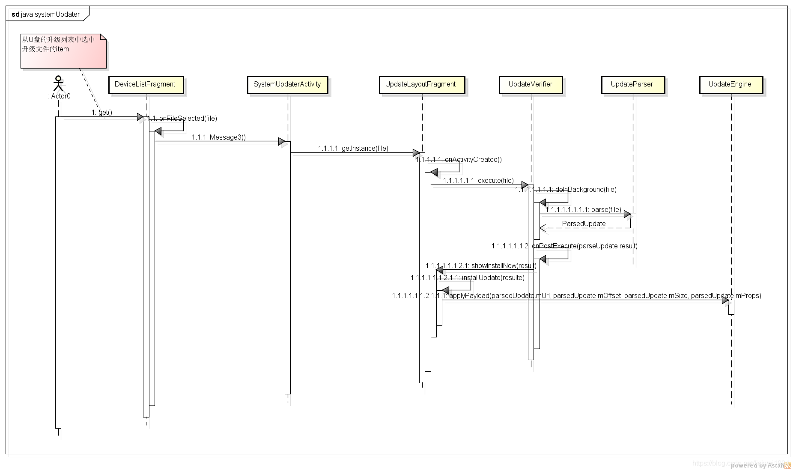

> Android源码有车机系统升级的demo app：SystemUpdater，使用原生settings UI画面。该应用可用于理解应用层同系统层进行交互，触发完成升级的逻辑流程。

# 1. demo app目录结构

## 1.1. 文件目录

该demo app是专用于汽车升级的示例apk，源码路径：`packages/apps/Car/SystemUpdater`

```s
android/packages/apps/Car/SystemUpdater$ tree
.
├── AndroidManifest.xml
├── Android.mk
├── PREUPLOAD.cfg
├── res
│   ├── .....
└── src
    └── com
        └── android
            └── car
                └── systemupdater
                    ├── DeviceListFragment.java
                    ├── SystemUpdaterActivity.java
                    ├── UpdateLayoutFragment.java
                    ├── UpdateParser.java
                    └── UpFragment.java

```

## 1.2. Android.mk

```makefile
LOCAL_PATH := $(call my-dir)
include $(CLEAR_VARS)

LOCAL_MODULE_TAGS := optional
# 模块src路径加载
LOCAL_SRC_FILES := $(call all-java-files-under, src)
# 资源加载
LOCAL_RESOURCE_DIR := $(LOCAL_PATH)/res
# 定义该应用是platform app
LOCAL_CERTIFICATE := platform
# APP名称
LOCAL_PACKAGE_NAME := SystemUpdater
LOCAL_PRIVATE_PLATFORM_APIS := true
# 是否预编译
LOCAL_DEX_PREOPT := false
# 此常量为是否使用aapt2
LOCAL_USE_AAPT2 := true
# 控制是否开启proguard，默认值为full
LOCAL_PROGUARD_ENABLED := disabled

LOCAL_DX_FLAGS := --multi-dex

# This module depends on androidx.car_car for legacy reasons.
# Don't copy-paste the use of androidx.car_car
# 依赖库
LOCAL_STATIC_ANDROID_LIBRARIES := \
    androidx.car_car \
    androidx.legacy_legacy-support-v4 \
    androidx.appcompat_appcompat

include $(BUILD_PACKAGE)
```

## 1.3. AndroidManifest.xml

```xml
<!-- 包名 -->
<manifest
        xmlns:android="http://schemas.android.com/apk/res/android"
        package="com.android.car.systemupdater">
<!-- 应用外部存储读写权限、重启权限、usb权限 -->
    <uses-permission android:name="android.permission.WRITE_MEDIA_STORAGE" />
    <uses-permission android:name="android.permission.WRITE_EXTERNAL_STORAGE" />
    <uses-permission android:name="android.permission.READ_EXTERNAL_STORAGE" />
    <uses-permission android:name="android.permission.REBOOT" />
    <uses-feature android:name="android.hardware.usb.host" />
<!-- 使用settings主题歌和标题目录 -->
    <application
            android:label="@string/title"
            android:theme="@style/SystemUpdaterTheme">
        <activity
            android:name="com.android.car.systemupdater.SystemUpdaterActivity"
            android:label="@string/title">
            <intent-filter>
                <action android:name="android.intent.action.MAIN" />
            </intent-filter>
            <intent-filter>
                <action android:name="android.hardware.usb.action.USB_DEVICE_ATTACHED" />
            </intent-filter>
            <intent-filter>
                <action android:name="com.android.settings.action.EXTRA_SETTINGS" />
                <category android:name="android.intent.category.DEFAULT" />
            </intent-filter>
            <meta-data android:name="com.android.settings.title"
                       android:resource="@string/title" />
            <meta-data android:name="com.android.settings.icon"
                       android:resource="@drawable/ic_system_update_alt_black_48dp" />
            <meta-data android:name="com.android.settings.category"
                       android:value="com.android.settings.category.ia.system" />
        </activity>
    </application>
</manifest>
```

***

# 2. applyPayload触发流程

## 2.1. SystemUpdaterActivity启动

```java
//packages/apps/Car/SystemUpdater/src/com/android/car/systemupdater/SystemUpdaterActivity.java
public class SystemUpdaterActivity extends AppCompatActivity
        implements DeviceListFragment.SystemUpdater {

    private static final String FRAGMENT_TAG = "FRAGMENT_TAG";
    private static final int STORAGE_PERMISSIONS_REQUEST_CODE = 0;
    //权限
    private static final String[] REQUIRED_STORAGE_PERMISSIONS = new String[]{
            Manifest.permission.READ_EXTERNAL_STORAGE,
            Manifest.permission.WRITE_EXTERNAL_STORAGE,
            Manifest.permission.WRITE_MEDIA_STORAGE
    };

    @Override
    protected void onCreate(Bundle savedInstanceState) {
        super.onCreate(savedInstanceState);
        //check 权限
        if (ContextCompat.checkSelfPermission(this, Manifest.permission.WRITE_EXTERNAL_STORAGE)
                != PackageManager.PERMISSION_GRANTED) {
            ActivityCompat.requestPermissions(this, REQUIRED_STORAGE_PERMISSIONS,
                    STORAGE_PERMISSIONS_REQUEST_CODE);
        }

        setContentView(R.layout.activity_main);
        Toolbar toolbar = findViewById(R.id.toolbar);
        setSupportActionBar(toolbar);

        if (savedInstanceState == null) {
            Bundle intentExtras = getIntent().getExtras();
            if (intentExtras != null && intentExtras.getBoolean(EXTRA_RESUME_UPDATE)) {
                //创建UpdateLayoutFragment对象，调用newResumedInstance
                UpdateLayoutFragment fragment = UpdateLayoutFragment.newResumedInstance();
                getSupportFragmentManager().beginTransaction()
                        .replace(R.id.device_container, fragment, FRAGMENT_TAG)
                        .commitNow();
            } else {
                //创建DeviceListFragment对象
                DeviceListFragment fragment = new DeviceListFragment();
                getSupportFragmentManager().beginTransaction()
                        .replace(R.id.device_container, fragment, FRAGMENT_TAG)
                        .commitNow();
            }
        }
    }
    .....
```

## 2.2. DeviceListFragment开始升级准备

（1） DeviceListFragment.java - onCreate

```java
    @Override
    public void onCreate(Bundle savedInstanceState) {
        super.onCreate(savedInstanceState);

        Context context = getContext();
        mItemProvider = new FileItemProvider(context);

        mStorageManager = (StorageManager) context.getSystemService(Context.STORAGE_SERVICE);
        if (mStorageManager == null) {
            if (Log.isLoggable(TAG, Log.WARN)) {
                Log.w(TAG, "Failed to get StorageManager");
            }
            Toast.makeText(context, R.string.cannot_access_storage, Toast.LENGTH_LONG).show();
            return;
        }
    }
```

（2）调用`get(int position)`函数

（3）调用`onFileSelected(File file)`选中的升级包文件

（4）如果升级包存在，则调用`mSystemUpdater.applyUpdate(file)`，该接口由SystemUpdaterActivity实现

```java
//DeviceListFragment.java
    /** Used to request installation of an update. */
    interface SystemUpdater {
        /** Attempt to apply an update to the device contained in the {@code file}. */
        void applyUpdate(File file);
    }
```

（5）SystemUpdaterActivity.java - applyUpdate，获取UpdateLayoutFragment对象，传入升级路径

```java
    @Override
    public void applyUpdate(File file) {
        //new UpdateLayoutFragment()对象
        //new Bundle对象
        UpdateLayoutFragment fragment = UpdateLayoutFragment.getInstance(file);
        getSupportFragmentManager().beginTransaction()
                .replace(R.id.device_container, fragment, FRAGMENT_TAG)
                .addToBackStack(null)
                .commit();
    }
```

（6）调用UpdateLayoutFragment.java - onActivityCreated，然后调用`mPackageVerifier.execute(mUpdateFile)`

```java
    @Override
    public void onActivityCreated(Bundle savedInstanceState) {
        super.onActivityCreated(savedInstanceState);
        .....

        if (getArguments().getBoolean(EXTRA_RESUME_UPDATE)) {
            //显示install进度
            showInstallationInProgress();
        } else {
            //执行必要的步骤开始升级
            mPackageVerifier.execute(mUpdateFile);
        }
    }
```

```java
//UpdateLayoutFragment.java
//该类继承AsyncTask
//尝试验证更新并提取安装所需的信息
    private class UpdateVerifier extends AsyncTask<File, Void, UpdateParser.ParsedUpdate> {

        @Override
        protected UpdateParser.ParsedUpdate doInBackground(File... files) {
            Preconditions.checkArgument(files.length > 0, "No file specified");
            File file = files[0];
            try {
                //调用UpdateParser.java的parse解析升级包文件
                return UpdateParser.parse(file);
            } catch (IOException e) {
                Log.e(TAG, String.format("For file %s", file), e);
                return null;
            }
        }

        @Override
        protected void onPostExecute(UpdateParser.ParsedUpdate result) {
            mProgressBar.setVisibility(View.GONE);
            if (result == null) {
                showStatus(R.string.verify_failure);
                return;
            }
            if (!result.isValid()) {
                showStatus(R.string.verify_failure);
                Log.e(TAG, String.format("Failed verification %s", result));
                return;
            }
            if (Log.isLoggable(TAG, Log.INFO)) {
                Log.i(TAG, result.toString());
            }
            //调用installUpdate，然后调用mUpdateEngine.applyPayload传入升级所需要的url，偏移量，大小等开始升级
            showInstallNow(result);
        }
    }
```

### 2.2.1. UpdateParser.parse解析升级文件

```java
//packages/apps/Car/SystemUpdater/src/com/android/car/systemupdater/UpdateParser.java
    static ParsedUpdate parse(@NonNull File file) throws IOException {
        Preconditions.checkNotNull(file);

        long payloadOffset = 0;
        long payloadSize = 0;
        boolean payloadFound = false;
        String[] props = null;

        try (ZipFile zipFile = new ZipFile(file)) {
            Enumeration<? extends ZipEntry> entries = zipFile.entries();
            while (entries.hasMoreElements()) {
                ZipEntry entry = entries.nextElement();
                long fileSize = entry.getCompressedSize();
                if (!payloadFound) {
                    payloadOffset += ZIP_FILE_HEADER + entry.getName().length();
                    if (entry.getExtra() != null) {
                        payloadOffset += entry.getExtra().length;
                    }
                }

                if (entry.isDirectory()) {
                    continue;
                } else if (entry.getName().equals(PAYLOAD_BIN_FILE)) {
                    payloadSize = fileSize; //payload.bin升级数据文件的大小
                    payloadFound = true;
                } else if (entry.getName().equals(PAYLOAD_PROPERTIES)) {
                    try (BufferedReader buffer = new BufferedReader(
                            new InputStreamReader(zipFile.getInputStream(entry)))) {
                        props = buffer.lines().toArray(String[]::new);  //hash值
                    }
                }
                if (!payloadFound) {
                    payloadOffset += fileSize; //偏移量
                }

                if (Log.isLoggable(TAG, Log.DEBUG)) {
                    Log.d(TAG, String.format("Entry %s", entry.getName()));
                }
            }
        }
        //内部静态类
        return new ParsedUpdate(file, payloadOffset, payloadSize, props);
    }
```

### 2.2.2. applyPayload请求升级

调用framework java应用层的接口

```java
//frameworks/base/core/java/android/os/UpdateEngine.java
    private IUpdateEngine mUpdateEngine;
    private IUpdateEngineCallback mUpdateEngineCallback = null;
    private final Object mUpdateEngineCallbackLock = new Object();

    public void applyPayload(String url, long offset, long size, String[] headerKeyValuePairs) {
        try {
            mUpdateEngine.applyPayload(url, offset, size, headerKeyValuePairs);
        } catch (RemoteException e) {
            throw e.rethrowFromSystemServer();
        }
    }
```

### 2.2.3. 序列图



***

# 3. 绑定回调流程

## 3.1. UpdateEngine.bind绑定

```java
//packages/apps/Car/SystemUpdater/src/com/android/car/systemupdater/UpdateLayoutFragment.java
    private ProgressBar mProgressBar; //升级进度
    private File mUpdateFile;   //升级包文件
    private Button mSystemUpdateToolbarAction;
    //PowerManager对象，用于重启
    private PowerManager mPowerManager;
    private NotificationManager mNotificationManager;
    private final UpdateVerifier mPackageVerifier = new UpdateVerifier();
    //创建UpdateEngine对象
    private final UpdateEngine mUpdateEngine = new UpdateEngine();
    private boolean mInstallationInProgress = false;
    //新建对象
    private final CarUpdateEngineCallback mCarUpdateEngineCallback = new CarUpdateEngineCallback();
    ...
//UpdateLayoutFragment.java的onPostExecute函数调用
    /** Show the install now button. */
    private void showInstallNow(UpdateParser.ParsedUpdate update) {
        mContentTitle.setText(R.string.install_ready);
        mContentInfo.append(getString(R.string.update_file_name, mUpdateFile.getName()));
        mContentInfo.append(System.getProperty("line.separator"));
        mContentInfo.append(getString(R.string.update_file_size));
        mContentInfo.append(Formatter.formatFileSize(getContext(), mUpdateFile.length()));
        mContentDetails.setText(null);
        //调用installUpdate
        mSystemUpdateToolbarAction.setOnClickListener(v -> installUpdate(update));
        ...
    }

    /** Attempt to install the update that is copied to the device. */
    private void installUpdate(UpdateParser.ParsedUpdate parsedUpdate) {
        //调用showInstallationInProgress
        showInstallationInProgress();
        //调用applyPayload
        mUpdateEngine.applyPayload(
                parsedUpdate.mUrl, parsedUpdate.mOffset, parsedUpdate.mSize, parsedUpdate.mProps);
    }
    //绑定UpdateEngine，并且显示进度
    /** Set the layout to show installation progress. */
    private void showInstallationInProgress() {
        mInstallationInProgress = true;
        mProgressBar.setIndeterminate(false);
        mProgressBar.setVisibility(View.VISIBLE);
        mProgressBar.setMax(PERCENT_MAX);
        mSystemUpdateToolbarAction.setVisibility(View.GONE);
        showStatus(R.string.install_in_progress);
        //CarUpdateEngineCallback回调函数调用
        mUpdateEngine.bind(mCarUpdateEngineCallback, new Handler(getContext().getMainLooper()));
    }
```


## 3.2. onStatusUpdate和onPayloadApplicationComplete接口函数

+ 升级状态码见`frameworks/base/core/java/android/os/UpdateEngine.java - UpdateStatusConstants`（抽取`system/update_engine/client_library/include/update_engine/update_status.h`数据）
+ 升级错误码见`frameworks/base/core/java/android/os/UpdateEngine.java - ErrorCodeConstants`（抽取`system/update_engine/common/error_code.h`部分）

```java
//UpdateLayoutFragment.java
   public class CarUpdateEngineCallback extends UpdateEngineCallback {

        @Override
        //升级状态码和进度接收
        public void onStatusUpdate(int status, float percent) {
            if (Log.isLoggable(TAG, Log.DEBUG)) {
                Log.d(TAG, String.format("onStatusUpdate %d, Percent %.2f", status, percent));
            }
            switch (status) {
                //UpdateStatusConstants升级状态码见frameworks/base/core/java/android/os/UpdateEngine.java
                case UpdateEngine.UpdateStatusConstants.UPDATED_NEED_REBOOT:
                    rebootNow();
                    break;
                case UpdateEngine.UpdateStatusConstants.DOWNLOADING:
                    mProgressBar.setProgress((int) (percent * 100));
                    break;
                default:
                    // noop
            }
        }

        @Override
        //升级结果接收
        public void onPayloadApplicationComplete(int errorCode) {
            Log.w(TAG, String.format("onPayloadApplicationComplete %d", errorCode));
            mInstallationInProgress = false;
            //错误码见frameworks/base/core/java/android/os/UpdateEngine.java的ErrorCodeConstants集合定义
            showStatus(errorCode == UpdateEngine.ErrorCodeConstants.SUCCESS
                    ? R.string.install_success
                    : R.string.install_failed);
            mProgressBar.setVisibility(View.GONE);
            mSystemUpdateToolbarAction.setVisibility(View.GONE);
        }
    }
```

**重启接口调用：**

```java
    private void rebootNow() {
        if (Log.isLoggable(TAG, Log.INFO)) {
            Log.i(TAG, "Rebooting Now.");
        }
        mPowerManager.reboot(REBOOT_REASON);
    }
```

## 3.3. 升级状态码解释

```java
//frameworks/base/core/java/android/os/UpdateEngine.java
   /**
     * Status codes for update engine. Values must agree with the ones in
     * {@code system/update_engine/client_library/include/update_engine/update_status.h}.
     */
    public static final class UpdateStatusConstants {
        //IDLE状态
        public static final int IDLE = 0;
        //update engine服务检查升级
        public static final int CHECKING_FOR_UPDATE = 1;
        //存在可获取的升级
        public static final int UPDATE_AVAILABLE = 2;
        //downloading下载步骤状态
        public static final int DOWNLOADING = 3;
        //update engine正在校验状态
        public static final int VERIFYING = 4;
        //update engine正在完成一个升级
        public static final int FINALIZING = 5;
        //请求重启（一般是升级成功）
        public static final int UPDATED_NEED_REBOOT = 6;
        //update egnine上报一个错误事件
        public static final int REPORTING_ERROR_EVENT = 7;
        //update engine试图恢复一个升级（可能升级被中断过）
        public static final int ATTEMPTING_ROLLBACK = 8;
        //update engine处于被禁止状态
        public static final int DISABLED = 9;
    }
```

## 3.4. 升级错误码解释

```java
//frameworks/base/core/java/android/os/UpdateEngine.java
    /**
     * Error codes from update engine upon finishing a call to
     * {@link applyPayload}. Values will be passed via the callback function
     * {@link UpdateEngineCallback#onPayloadApplicationComplete}. Values must
     * agree with the ones in {@code system/update_engine/common/error_code.h}.
     */
    public static final class ErrorCodeConstants {
        //升级成功
        public static final int SUCCESS = 0;
        //升级失败
        public static final int ERROR = 1;
        //文件系统拷贝失败
        public static final int FILESYSTEM_COPIER_ERROR = 4;
        /**
         * Error code: an update failed to apply due to an error in running
         * post-install hooks.
         */
        //post-install运行时报错
        public static final int POST_INSTALL_RUNNER_ERROR = 5;
        /**
         * Error code: an update failed to apply due to a mismatching payload.
         *
         * <p>For example, the given payload uses a feature that's not
         * supported by the current update engine.
         */
        public static final int PAYLOAD_MISMATCHED_TYPE_ERROR = 6;
        /**
         * Error code: an update failed to apply due to an error in opening
         * devices.
         */
        public static final int INSTALL_DEVICE_OPEN_ERROR = 7;
        /**
         * Error code: an update failed to apply due to an error in opening
         * kernel device.
         */
        public static final int KERNEL_DEVICE_OPEN_ERROR = 8;
        /**
         * Error code: an update failed to apply due to an error in fetching
         * the payload.
         *
         * <p>For example, this could be a result of bad network connection
         * when streaming an update.
         */
        //download传输报错，比如U盘升级download时拔出U盘
        public static final int DOWNLOAD_TRANSFER_ERROR = 9;
        /**
         * Error code: an update failed to apply due to a mismatch in payload
         * hash.
         *
         * <p>Update engine does sanity checks for the given payload and its
         * metadata.
         */
        public static final int PAYLOAD_HASH_MISMATCH_ERROR = 10;

        /**
         * Error code: an update failed to apply due to a mismatch in payload
         * size.
         */
        public static final int PAYLOAD_SIZE_MISMATCH_ERROR = 11;

        /**
         * Error code: an update failed to apply due to failing to verify
         * payload signatures.
         */
        public static final int DOWNLOAD_PAYLOAD_VERIFICATION_ERROR = 12;

        /**
         * Error code: an update failed to apply due to a downgrade in payload
         * timestamp.
         *
         * <p>The timestamp of a build is encoded into the payload, which will
         * be enforced during install to prevent downgrading a device.
         */
        //版本时间戳校验，如果不支持回滚，则回滚升级会报错
        public static final int PAYLOAD_TIMESTAMP_ERROR = 51;

        /**
         * Error code: an update has been applied successfully but the new slot
         * hasn't been set to active.
         *
         * <p>It indicates a successful finish of calling {@link #applyPayload} with
         * {@code SWITCH_SLOT_ON_REBOOT=0}. See {@link #applyPayload}.
         */
        public static final int UPDATED_BUT_NOT_ACTIVE = 52;
    }
```

***

# 4. 参考

+ [Android.mk 常用常量总结](https://blog.csdn.net/syk12138/article/details/120730227)
+ [java SystemUpdater 到 c++ updateEngine](https://blog.csdn.net/lisiwei1994/article/details/106289987/)