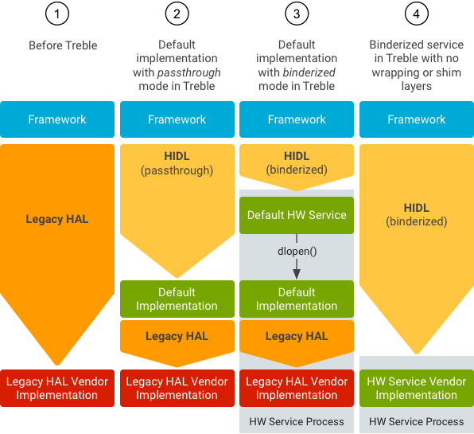

> android 8.0引入treble架构，使用HIDL进行binder跨进程模块分离通信。

# 1. Treble架构概述

Treble（完整写法Project Treble），是谷歌在Android O开始定义的一个技术框架，服务于Android版本的升级。

对于终端厂商来说，Treble框架的定义能够帮助厂商更快更便捷地通过谷歌定义好的框架进行Android大版本的升级。而对于用户来说，Treble是不会有任何使用感知和功能实现上的体现。该计划的主要工作就是重构Android OS的framework，让Android设备制造商能够更快，更容易，更低成本的去升级Android版本。

## 1.1. Android 8.0引入Treble

Android 8.0版本的一项新元素是Project Treble。这是 Android 操作系统框架在架构方面的一项重大改变，旨在让制造商以更低的成本更轻松、更快速地将设备更新到新版 Android 系统。Project Treble 适用于搭载 Android 8.0 及后续版本的所有新设备（这种新的架构已经在 Pixel 手机的开发者预览版中投入使用）。

Treble 提供了一个稳定的新供应商接口，供设备制造商访问 Android 代码中特定于硬件的部分，这样一来，设备制造商只需更新 Android 操作系统框架，即可跳过芯片制造商直接提供新的 Android 版本。

在Android O之前，HAL是一个个的.so库，通过dlopen来进行打开，库和framework位于同一个进程。这样会存在两个问题：

1. HAL中的任何崩溃和错误行为都容易导致进程崩溃
2. Framework层中的任何更新都要重新编译、打包HAL层

新的架构之下，framework和hal运行于不同的进程，所有的HAL采用新的HIDL技术来完成

**如图：**


## 1.2. 关键技术

**Treble架构中为了实现系统和供应商的分离，引入了许多新技术。关键技术包括：**

+ HIDL：HAL接口定义语言，用于指定HAL和其他用户之间的接口的一直接口描述语言(IDL)
+ HAL：运行Android8.0或者更高版本的设备必须支持使用HIDL语言编写的HAL，分为binderized HAL（绑定式）和passthrough HAL（直通式）。
+ 设备树叠加层(DTO)：将设备数(DT)分割为主DT和叠加DT。叠加DT由ODM厂商提供，存放在ODM分区。通过对叠加DT的修改升级，可以实现在DT中增加设备节点和修改设备属性。
+ 供应商原生开发套件(VNDK)：提供了一组让供应商实现其HAL的专用库。
+ 供应商接口对象(VINTF)：用于汇总设备的相关信息并通过可查询的API提供该信息。
+ SELinux：Android8.0实现SELinux策略的模块化和兼容性，目标是使SOC供应商和ODM生产商能够以隔离方式自定义SELinux配置，而无需跨分区修改。


***

# 2. HAL模式

为了能够让Android O之前的版本升级到Android O，Android设计了Passthrough模式，经过转换，可以方便的使用已经存在代码，不需要重新编写相关的HAL。HIDL分为两种模式：Passthrough和Binderized。

+ Binderized： Google官方翻译成绑定试HAL
+ Passthrough：Google官方翻译成直通式HAL

**如图：**



***

# 3. HIDL概述

HIDL是一种接口定义语言，描述了HAL和它的用户之间的接口。

HAL接口定义语言是用于指HAL和其用户之间的接口的一种接口描述语言 (IDL)。HIDL允许指定类型和方法调用（会汇集到接口和软件包中）。从更广泛的意义上来说，HIDL是用于在可以独立编译的代码库之间进行通信的系统。

HIDL旨在用于进程间通信 (IPC)。进程之间的通信采用Binder机制。对于必须与进程相关联的代码库，还可以使用直通模式（在Java中不受支持）。

HIDL可指定数据结构和方法签名，这些内容会整理归类到接口（与类相似）中，而接口会汇集到软件包中。尽管HIDL具有一系列不同的关键字，此外，HIDL还使用Java样式的注释。


## 3.1. hidl-gen工具

在Treble架构中，经常会提到HIDL，首先介绍和HIDL相关的一个工具hidl-gen，系统定义的所有的.hal接口，都是通过hidl-gen工具转换成对应的代码。

比如`hardware/interfaces/power/1.0/IPower.hal`，会通过hidl-gen转换成`out/soong/.intermediates/hardware/interfaces/power/1.0/android.hardware.power@1.0_genc++/gen/android/hardware/power/1.0/PowerAll.cpp`文件。

hidl-gen源码路径：`android/system/tools/hidl`，是在ubuntu上可执行的二进制文件。可以查看该模块路径下的README.md说明文档。

使用方法：`hidl-gen -o output-path -L language (-r interface-root) fqname`

## 3.2. HIDL添加示例

参考最下面分享的文章

**主要步骤：**

1. 新增vendor/hardware/interfaces/test/1.0/目录
2. 在1.0目录下创建接口ITest.hal，包名设置为自定义vendor.hardoware.hardware.test的创建目录default

```java
package vendor.hardoware.hardware.test@1.0;
 
interface ITest{
    helloWorld(string name) generates (string result);
};
```

3. 生成hal相关文件

```shell
PACKAGE=vendor.hardoware.hardware.test@1.0
LOC=default
# 生成Android.bp
hidl-gen -L androidbp -rvendor.hardoware.hardware.test:vendor/hardware/interfaces/ -r android.hidl:system/libhidl/transport $PACKAGE
或者使用
source vendor/hardware/proprietary/interfaces/update-makefiles.sh

# 生成Android.bp
hidl-gen -o $LOC -L androidbp-impl -r vendor.hardoware.hardware.test:vendor/hardware/interfaces/ -r android.hidl:system/libhidl/transport $PACKAGE
# 生成C++文件
hidl-gen -o $LOC -L c++-impl -r vendor.hardoware.hardware.test:vendor/hardware/interfaces/ -r android.hidl:system/libhidl/transport $PACKAGE
```

4. default下面创建一个service.cpp，通过直通式注册服务，作为服务启动main函数入口。添加`using vendor.hardoware.hardware.test@1.0`

5. 实现接口

6. 将编译出的service可执行程序编译进文件系统在`/vendor/project/$DEVELOP_PRODUCT/device/$(DEVELOP_PRODUCT).mk`中添加: PRODUCT_PACKAGES += vendor.hardoware.hardware.test@1.0-service

7. 将这个hwservice注册到系统(`这样getService()才能找到它`) 在/vendor/hardware/project/$(DEVELOP_PRODUCT)/device/manifest.xml中添加

7. selinux权限

+ 在`vendor/hardware/project/$(Product)/device/sepolicy/file_contexts`中添加：
`/(vendor|system/vendor)/bin/hw/vendor.hardware.hardware.test@1.0-service u:object_r:hal_test_exec:s0`

+ 在`vendor/hardware/project/$(Product)/device/sepolicy/hwservice.te`中添加：
`type hal_test_hwservice, hwservice_manager_type;`

+ 在`vendor/hardware/project/$(Product)/device/sepolicy/hwservicemanager.te`中添加：
```shell
allow hwservicemanager hal_test:process getattr;
allow hwservicemanager hal_test:binder { transfer call };
allow hwservicemanager hal_test:file r_file_perms;
allow hwservicemanager hal_test:dir search;
```

+ 在`vendor/hardware/project/$(Product)/device/sepolicy/hwservice_contexts`中添加：
`vendor.hardware.hardware.test::Itest u:object_r:hal_test_hwservice:s0 `

+ 添加文件：`device/platform/sepolicy/hal_test.te`
+ 
```shell
type hal_test, domain;
type hal_test_exec, exec_type, vendor_file_type, file_type;
hal_server_domain(hal_test, hal_test)
allow hal_test sysfs:file rw_file_perms;
allow hal_test hwservicemanager_prop:file r_file_perms;
allow hal_test hwservicemanager:binder { transfer call };
allow hal_test hal_test_hwservice:binder call;
allow hal_test hal_test_hwservice:hwservice_manager { add find };
allow hal_test hidl_base_hwservice:hwservice_manager add;
allow hal_test socket_device:sock_file write;
init_daemon_domain(hal_test)
```

***

# 4. Binder通信域变化

Treble架构的引入足以说明Binder通信的重要性，之前APP和Framework之间通过binder实现跨进程调用，当然这个调用对开发者来说是透明的，相当于函数本地调用。 

Treble引入后，Framework和HAL又实现了进程分离，Framework和HAL之间依然使用binder通信，通过HIDL来定义通信接口。

那binder通信有什么变化呢？ 在Treble中，引入了多个binder域，主要是增加了多个binder设备，binder驱动实现原理基本没变，变化了一些细节。增加binder设备应该是为了实现更换的权限控制，使用不同binder设备的主体和客体之间的selinux权限有所不同，同时，Android框架和HAL现在使用Binder互相通信。由于这种通信方式极大地增加了Binder流量。

```shell
$:/dev # ls -Zhl *binder
crw-rw-rw- 1 root root u:object_r:binder_device:s0    10,  57 1970-01-01 08:00 binder
crw-rw-rw- 1 root root u:object_r:hwbinder_device:s0  10,  56 1970-01-01 08:00 hwbinder
crw-rw-rw- 1 root root u:object_r:vndbinder_device:s0 10,  55 1970-01-01 08:00 vndbinder
```

**如图：**


***

# 5. servicemanager拓展

以前Binder服务通过servicemanager注册，其他进程可从中检索这些服务。

在Android O中，servicemanager现在专用于框架和应用进程，供应商进程无法再对其进行访问。而供应商服务现在可以使用vndservicemanager，这是一个使用`/dev/vndbinder`的servicemanager的新实例。

供应商进程无需更改即可与vndservicemanager 通信；当供应商进程打开`/dev/vndbinder`时，服务查询会自动转至vndservicemanager。servicemanager和vndservicemanager使用的是同一份代码，都是由`service_manager.c`编译而来。可参考该模块bp文件及rc文件。

```shell
$:/dev # ps -A|grep servicemanager
system        2311     1   32440   7380 context_switch      0 S servicemanager
system        2312     1   37728   8220 context_switch      0 S hwservicemanager
system        2313     1   33116   7132 context_switch      0 S vndservicemanager
```

vndservicemanager与servicemanager不仅使用的binder设备不同，使用的selinux策略也不同。

**servicemanager和vndservicemanager使用的binder设备节点不同**：

+ servicemanager使用/dev/binder
+ vndservicemanager使用/deve/vndbinder

**servicemanager和vndservicemanager使用的selinux策略文件不同**：

+ servicemanager使用/system/etc/selinux/plat_service_contexts
+ vndservicemanager使用/vendor/etc/selinux/vndservice_contexts

**查看servicemanager和vndservicemanager管理的binder服务的工具不同**：

+ servicemanager使用service list
+ vndservicemanager使用vndservice list

***

# 6. 参考

+ [Android Treble架构解析](https://blog.csdn.net/liujun3512159/article/details/122314073)
+ [Android Hidl开发](https://blog.csdn.net/hihan_5/article/details/118550429)
+ [Android P HAL层添加HIDL实例](https://blog.csdn.net/sinat_18179367/article/details/95940030)
+ [Android 9.0 HIDL接口添加](https://blog.csdn.net/zhuyong006/article/details/102501366)
+ [Binder系列（1）——ServiceManager](https://blog.csdn.net/yin262/article/details/88995231)