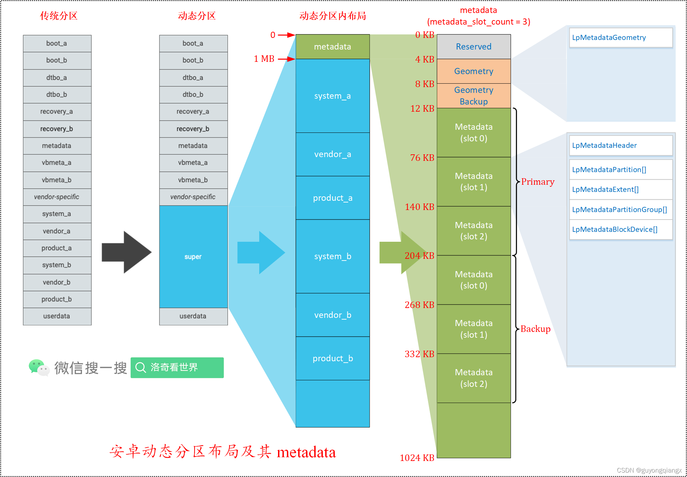

> 动态分区是Android的用户空间分区系统，从Android Q开始引入这个动态分区super的概念。使用此分区系统，可以在无线下载 (OTA) 更新期间创建、销毁分区或者调整分区大小。借助动态分区，供应商无需担心各个分区（例如 system、vendor 和 product）的大小。取而代之的是，设备分配一个**super分区**，其中的子分区可动态地调整大小。单个分区镜像不再需要为将来的 OTA 预留空间。相反，super 中剩余的可用空间还可用于所有动态分区。

# 1. 概述

从Android Q引入动态分区，到Android R/S在动态分区之上增加虚拟分区管理, OTA升级时需要对分区变更进行处理

动态分区管理的本质就是对分区数据的增删改查操作，操作的对象就是动态分区描述数据metadata。

***

# 2. 实现动态分区

动态分区是使用Linux内核中的`dm-linear device-mapper`模块实现的。 super分区包含列出了super中每个动态分区的名称和块范围的元数据。

在第一阶段init期间，系统会解析并验证此元数据，并创建虚拟块设备来表示每个动态分区。

执行OTA时，系统会根据需要自动创建/删除动态分区，或者调整动态分区的大小。

**若是A/B设备，将存在两个元数据副本，而更改仅会应用到表示目标槽位的副本。**

由于动态分区是在用户空间中实现的，因此引导加载程序所需的分区不能是动态的。 例如，引导加载程序会读取 boot、dtbo 和 vbmeta，因此这些分区必须仍保持为物理分区。

**每个动态分区都可以属于一个“更新组”。 这些组会限制组内的分区可以使用的最大空间**

例如，system和vendor可以属于一个限制了system和vendor总大小的组

***

## 2.1. Linux device mapper驱动

Device mapper 内核中各对象的层次关系：


+ 虚拟设备Mapped Device基于驱动Target Driver和内部的映射表Mapping Table来实现
+ 一个虚拟设备Mapped Device可以由一个或多个Target Device映射组成，参与映射的Target Device本身也可能是虚拟设备

所以，一个设备可能是真实的，也可能是虚拟的。对虚拟设备的访问会被Target Driver拦截，然后通过Mapping Table转发给另外一个设备。

例如，在Android Q上，对system_a或vendor_a分区的访问被驱动拦截并转发为对super分区某个区域的访问。而这里的拦截以及转发对用户是透明的，用户根本不知道，也不需要知道他最终访问的到底是哪个设备。

***

## 2.2. 分区布局更改

对于搭载Android 10及之后版本的设备，创建名为super的分区。super分区会在内部处理A/B槽位，因此A/B设备不需要单独的super_a和super_b分区。

引导加载程序未使用的所有只读AOSP分区都必须是动态的，并且必须从GUID分区表 (GPT) 中移除。 供应商专用分区则可以不是动态的，并且可以放在GPT中

**注意：应避免将 userdata 或任何其他永久性读写分区放在super中**

如需估算super的大小，请加总要从GPT中删除的分区的大小。对于A/B设备，这应包括两个槽位的大小。

下图显示了转换为动态分区前后的分区表示例：


新的super分区内部包含了多个原来的分区，而识别这些内部分区的方法就是：引入数据来描述super分区的布局。

在super分区开头存储用于描述分区布局的`metadata`，和磁盘开头存储用于描述磁盘分区布局的gpt数据的道理一样。系统加载动态分区时读取`metadata`，对其进行解析，在内存中建立super分区布局描述的`LpMetadata`结构体，就知道内部的各个分区都位于哪个地方。

换句话说，metadata就是`LpMetadata`结构在`super`分区上的物理存储数据，而`LpMetadata`是`metadata`在内存中的数据结构。`LpMetadata`中的信息会被转换成device mapper中的映射表`Mappting Table`，基于这个映射表，super分区对应设备`/dev/block/by-name/super`的不同部分被映射成多个虚拟设备，如`/dev/block/mapper/system_a`,`/dev/block/mapper/vendor_a`等

***

### 2.2.1. 支持的动态分区

**支持的动态分区包括：**
+ 系统
+ Vendor
+ Product
+ System Ext
+ ODM

对于搭载 Android 10 的设备，内核命令行选项`androidboot.super_partition`必须为空，以使命令`sysprop ro.boot.super_partition`为空。

***

### 2.2.2. metadata数据

**宏观上看下物理存储的metadata：**



对metadata，可以分层3个层次，见图：

1. 第1层，super分区(宏观)

+ super分区头部存放描述分区内部布局的metadata数据
+ metadata数据之后1MB对齐开始的地方依次存放两组槽位(slot)的分区数据

2. 第2层，metadata数据

+ metadata 数据开始前预留了4K的空间，所以metadata数据从4K的偏移位置开始（所以metadata位于super分区的4KB~1MB范围内）
+ metadata 数据由 Geometry 和 Metadata 两部分组成
+ + Geometry大小为4K，数据除自身外，还有个一个备份，紧挨着Geometry存放
+ + Metadata大小64K，按槽位(slot)存放，每个槽位有一份Metadata数据，所有槽位的Metadata数据结束后开始存放其备份数据
+ + 分区加载时，根据分区对应槽位，读取相应槽位的Metadata和其备份数据

3. 第 3 层，Geometry和Metadata(微观)

+ Geometry内部是大小为58字节的`LpMetadataGeometry`结构数据，填充到4K大小
+ Metadata内部包含`LpMetadataHeader`,`LpMetadataPartition`,`LpMetadataExtent`,`LpMetadataPartitionGroup`,`LpMetadataBlockDevice`等数据结构，填充到64K大小

#### 2.2.2.1. metadata数据小结

+ metadata包括Geometry和Metadata两个部分，每个部分都有自己的Primary和Bakcup两组相同的数据，存放顺序是Geometry(Primary), Geometry(Backup), Metadata(Primary), Metadata(Backup)
+ 对于Metadata，其内部又有3份数据，分别对应于Slot 0, Slot 1, Slot 2。当 Slot 0启动时，读取Slot 0对应的Metadata, 当Slot 1启动时，读取Slot 1对应的Metadata
+ OTA升级时，如果当前在Slot 0（或者说slot A）上运行，要更新Slot 1分区，则在更新之前Slot 1前会更新Slot 1对应的Metadata以反应Slot 1的实际布局，反之亦然

#### 2.2.2.2. 源码定义

**动态分区的核心数据结构主要定义在以下文件中:**

+ system/core/fs_mgr/liblp/include/liblp/metadata_format.h
+ system/core/fs_mgr/liblp/include/liblp/liblp.h

***

## 2.3. 分区对齐

如果super分区未正确对齐，device-mapper模块的运行效率可能会降低。super分区必须与最小I/O请求大小保持一致，该大小由块层决定。

默认情况下，构建系统（通过生成super分区镜像的`lpmake`）假设每个动态分区有1 MiB的对齐程度即已足够。

不过，供应商应确保super分区正确对齐。

1. 可以通过检查`sysfs`来确定块设备的最小请求大小。例如：

```shell
# ls -l /dev/block/by-name/super
lrwxrwxrwx 1 root root 16 1970-04-05 01:41 /dev/block/by-name/super -> /dev/block/sda17
# cat /sys/block/sda/queue/minimum_io_size
786432
```

2. 可以通过类似的方式验证 super 分区的对齐：（**对齐偏移必须为0**）

```shell
# cat /sys/block/sda/sda17/alignment_offset
```

***

## 2.4. 设备配置更改（启动动态分区）

在device.mk添加标记：

`PRODUCT_USE_DYNAMIC_PARTITIONS := true`

例如在Android Q源码：

```cpp
//android/device/google/cuttlefish/shared/phone/device.mk
TARGET_USE_DYNAMIC_PARTITIONS ?= true
ifeq ($(TARGET_USE_DYNAMIC_PARTITIONS),true)
  PRODUCT_USE_DYNAMIC_PARTITIONS := true
  TARGET_BUILD_SYSTEM_ROOT_IMAGE := false
else
  TARGET_BUILD_SYSTEM_ROOT_IMAGE ?= true
endif
```

***

## 2.5. 板级配置更改（配置super分区大小）

在BoardConfig.mk添加修改，设置super分区的大小：(在A/B设备上，如果动态分区镜像的总大小超过super分区大小的一半，构建系统就会发生错误)

`BOARD_SUPER_PARTITION_SIZE := <size-in-bytes>`

可以按以下方式配置动态分区列表。 对于使用更新组的设备，在`BOARD_SUPER_PARTITION_GROUPS`变量中列出这些组。

然后，每个组名称都有一个`BOARD_group_SIZE`和`BOARD_group_PARTITION_LIST`变量。 对于A/B设备，组的大小上限应仅包含一个槽位，因为组名在内部以槽位为后缀。

以下示例设备将所有分区放入名为`example_dynamic_partitions`的组中：

```shell
//例如1：将所有分区放入名为example_dynamic_partitions的组中
BOARD_SUPER_PARTITION_GROUPS := example_dynamic_partitions
BOARD_EXAMPLE_DYNAMIC_PARTITIONS_SIZE := 6442450944
BOARD_EXAMPLE_DYNAMIC_PARTITIONS_PARTITION_LIST := system vendor product

//例如2：将系统和产品服务放入group_foo，并将vendor、product和odm放入group_bar
BOARD_SUPER_PARTITION_GROUPS := group_foo group_bar
BOARD_GROUP_FOO_SIZE := 4831838208
BOARD_GROUP_FOO_PARTITION_LIST := system product_services
BOARD_GROUP_BAR_SIZE := 1610612736
BOARD_GROUP_BAR_PARTITION_LIST := vendor product odm
```

***

例如在Android Q源码：

```cpp
//android/device/google/cuttlefish/shared/BoardConfig.mk
ifeq ($(TARGET_USE_DYNAMIC_PARTITIONS),true)
  BOARD_SUPER_PARTITION_SIZE := 6442450944
  BOARD_SUPER_PARTITION_GROUPS := google_dynamic_partitions
  BOARD_GOOGLE_DYNAMIC_PARTITIONS_PARTITION_LIST := system vendor product
  BOARD_GOOGLE_DYNAMIC_PARTITIONS_SIZE := 6442450944
  BOARD_SUPER_PARTITION_METADATA_DEVICE := vda
  BOARD_BUILD_SUPER_IMAGE_BY_DEFAULT := true
  BOARD_SUPER_IMAGE_IN_UPDATE_PACKAGE := true
  TARGET_RELEASETOOLS_EXTENSIONS := device/google/cuttlefish/shared
else
  # No dynamic partitions support; we must specify maximum sizes
  BOARD_SYSTEMIMAGE_PARTITION_SIZE := 4294967296 # 4 GB
  BOARD_VENDORIMAGE_PARTITION_SIZE := 536870912 # 512MB
  BOARD_PRODUCTIMAGE_PARTITION_SIZE := 1610612736 # 1.5GB
  TARGET_NO_RECOVERY ?= true
endif
```

***

### 2.5.1. 注意点

1. 请勿选择可能会与构建变量冲突的名称，例如super和super_partition。为了便于查看，请选择诸如foo_dp、foo_dynamic_partitions、foo_dp_group、super_foo或group_foo这样的名称，其中foo表示更新指定组的操作方的名称）。例如，group_OEM或group_VENDOR
2. 一个设备上可能有一个或多个更新组
3. 对于虚拟A/B启动设备，所有组的最大大小总和不得超过：`BOARD_SUPER_PARTITION_SIZE - 开销`
4. 对于A/B启动设备，所有组的最大大小总和必须为：`BOARD_SUPER_PARTITION_SIZE / 2 - 开销`
5. 对于非A/B设备和改造的A/B设备，所有组的大小上限总和必须为：`BOARD_SUPER_PARTITION_SIZE - 开销`
6. 在构建时，更新组中每个分区的镜像大小总和不得超过组的大小上限
7. 在计算时需要扣除开销，因为要考虑元数据、对齐等。合理的开销是4MiB，但可以根据设备的需要选择更大的开销

***

## 2.6. 调整动态分区的大小

在采用动态分区之前，会为分区分配富余的空间，以确保它们有足够的空间满足将来的更新。分区会按分配的大小占用实际空间，大多数只读分区的文件系统中都会有一些空闲空间。

在动态分区中，这些空闲空间不可用，并且可以用于在OTA期间增大分区。 需要确保分区没有浪费空间并且尽可能将其分配给最小大小。

对于只读的ext4镜像，如果未指定硬编码分区大小，则构建系统会自动分配最小的空间。构建系统会适配镜像，以尽可能减少文件系统中的未使用空间。这样可以确保设备不会浪费可用于OTA的空间。

**此外，通过启用块级重复信息删除，可以进一步压缩ext4镜像。 要启用此功能，请使用以下配置：**

`BOARD_EXT4_SHARE_DUP_BLOCKS := true`

如果不希望自动分配最小分区大小，则可以通过两种方法来控制分区大小。 

可以使用`BOARD_partitionIMAGE_PARTITION_RESERVED_SIZE`指定最小可用空间，

也可以指定`BOARD_partitionIMAGE_PARTITION_SIZE`以强制将动态分区设为特定大小。除非必要，这两种方法都不建议使用。

例如，这样会强制product.img的文件系统使用50MB的未使用空间：

`BOARD_PRODUCTIMAGE_PARTITION_RESERVED_SIZE := 52428800 //50MB`


注意：构建系统只能最佳适配ext4文件系统镜像，且只能适配构建过程中生成的镜像。若是预构建的镜像或使用其他文件系统的镜像，则必须手动确保文件系统没有浪费磁盘空间。

***

## 2.7. System-as-root更改

搭载Android 10的设备不得使用`system-as-root`

具有动态分区的设备（无论是搭载动态分区还是改造动态分区）不得使用`system-as-root`。 Linux内核无法解读super分区，因此无法自行装载system本身。system现在由位于ramdisk中的第一阶段init装载。

不要设置`BOARD_BUILD_SYSTEM_ROOT_IMAGE`。在Android 10中，`BOARD_BUILD_SYSTEM_ROOT_IMAGE`标记仅用于区分系统是由内核装载还是在第一阶段装载init（在ramdisk中）。

设置`BOARD_BUILD_SYSTEM_ROOT_IMAG=true`会导致`PRODUCT_USES_DYNAMIC_PARTITIONS=true`。

将`BOARD_USES_RECOVERY_AS_BOOT`设置为true时，recovery.img将被构建为boot.img，其中包含恢复的ramdisk。 以前，引导加载程序使用`skip_initramfs`内核命令行参数来决定启动到哪种模式。

对于搭载Android 10的设备，引导加载程序不得向内核命令行传递skip_initramfs。

引导加载程序应传递`androidboot.force_normal_boot=1`来跳过恢复并正常启动 Android。

发布时搭载Android 12或更高版本的设备必须使用bootconfig传递`androidboot.force_normal_boot=1`


***

## 2.8. AVB配置更改

**警告：动态分区需要使用Android启动时验证 (AVB)，但不能与启动时验证1.0搭配使用**

使用 Android 启动时验证 2.0 时，如果设备未使用链式分区描述符，则不需要进行更改。但如果使用了链式分区，并且其中一个已验证分区是动态分区，则需要进行更改。

下面的设备配置示例链接system和vendor分区所对应的vbmeta。

```shell
BOARD_AVB_SYSTEM_KEY_PATH := external/avb/test/data/testkey_rsa2048.pem
BOARD_AVB_SYSTEM_ALGORITHM := SHA256_RSA2048
BOARD_AVB_SYSTEM_ROLLBACK_INDEX := $(PLATFORM_SECURITY_PATCH_TIMESTAMP)
BOARD_AVB_SYSTEM_ROLLBACK_INDEX_LOCATION := 1

BOARD_AVB_VENDOR_KEY_PATH := external/avb/test/data/testkey_rsa2048.pem
BOARD_AVB_VENDOR_ALGORITHM := SHA256_RSA2048
BOARD_AVB_VENDOR_ROLLBACK_INDEX := $(PLATFORM_SECURITY_PATCH_TIMESTAMP)
BOARD_AVB_VENDOR_ROLLBACK_INDEX_LOCATION := 1
```

使用该配置，引导加载程序可以在system分区和vendor分区的末尾找到vbmeta页脚。由于这两个分区对引导加载程序不再可见（它们位于super），因此需要进行两项更改。

将vbmeta_system和vbmeta_vendor分区添加到设备的分区表中。

对于A/B设备，请添加vbmeta_system_a、vbmeta_system_b、vbmeta_vendor_a 和 vbmeta_vendor_b。如果添加上述一个或多个分区，则它们的大小应与vbmeta分区相同。

通过添加`VBMETA_`来重命名配置标记，并指定链接扩展到的分区:

```shell
BOARD_AVB_VBMETA_SYSTEM := system
BOARD_AVB_VBMETA_SYSTEM_KEY_PATH := external/avb/test/data/testkey_rsa2048.pem
BOARD_AVB_VBMETA_SYSTEM_ALGORITHM := SHA256_RSA2048
BOARD_AVB_VBMETA_SYSTEM_ROLLBACK_INDEX := $(PLATFORM_SECURITY_PATCH_TIMESTAMP)
BOARD_AVB_VBMETA_SYSTEM_ROLLBACK_INDEX_LOCATION := 1

BOARD_AVB_VBMETA_VENDOR := vendor
BOARD_AVB_VBMETA_VENDOR_KEY_PATH := external/avb/test/data/testkey_rsa2048.pem
BOARD_AVB_VBMETA_VENDOR_ALGORITHM := SHA256_RSA2048
BOARD_AVB_VBMETA_VENDOR_ROLLBACK_INDEX := $(PLATFORM_SECURITY_PATCH_TIMESTAMP)
BOARD_AVB_VBMETA_VENDOR_ROLLBACK_INDEX_LOCATION := 1
```

***

## 2.9. 内核命令行更改

必须在内核命令行中添加新参数`androidboot.boot_devices`。init使用它来启用`/dev/block/by-name`符号链接。

该参数应该是由`ueventd`创建的底层`by-name`符号链接（即`/dev/block/platform/device-path/by-name/partition-name`）的设备路径组件。发布时搭载Android 12或更高版本的设备必须使用`bootconfig`将`androidboot.boot_devices`传递给init。

例如，如果super按分区的符号链接为`/dev/block/platform/soc/100000.ufshc/by-name/super`，

1. 可以在`BoardConfig.mk`文件中添加命令行参数，如下所示：

`BOARD_KERNEL_CMDLINE += androidboot.boot_devices=soc/100000.ufshc`

2. 可以在 BoardConfig.mk 文件中添加 bootconfig 参数，如下所示：

`BOARD_BOOTCONFIG += androidboot.boot_devices=soc/100000.ufshc`

***

## 2.10. fatab更改

设备树和设备树叠加层不得包含 fstab 条目。 使用将成为 ramdisk 一部分的 fstab 文件。

**必须对逻辑分区的 fstab 文件进行以下更改：**

fs_mgr标志字段必须包含logical标志和first_stage_mountAndroid 10 中引入的 Android 标记标志，用于指示在第一阶段装载分区。

分区可以将 avb=vbmeta partition name 指定为 fs_mgr 标志，然后指定的 vbmeta 分区先由第一阶段 init 初始化，然后再尝试装载任何磁盘设备。

dev字段必须是分区名称。

以下fstab条目按照上述规则设置system、vendor和product逻辑分区。

**将fstab文件复制到第一阶段ramdisk。**

```shell
#<dev>  <mnt_point> <type>  <mnt_flags options> <fs_mgr_flags>
system   /system     ext4    ro,barrier=1        wait,slotselect,avb=vbmeta,logical,first_stage_mount
vendor   /vendor     ext4    ro,barrier=1        wait,slotselect,avb,logical,first_stage_mount
product  /product    ext4    ro,barrier=1        wait,slotselect,avb,logical,first_stage_mount
```

**注意：对于非A/B设备，请勿包含slotselect**

***

## 2.11. selinux更改

super分区块设备必须使用`super_block_device`标签进行标记。

例如，如果超名称按分区的符号链接为`/dev/block/platform/soc/100000.ufshc/by-name/super`，请将以下代码行添加到file_contexts中：

`/dev/block/platform/soc/10000\.ufshc/by-name/super   u:object_r:super_block_device:s0`

***

## 2.12. fastbootd

引导加载程序（或任何非用户空间刷写工具）无法理解动态分区，因此无法对其进行刷写。为解决此问题，设备必须使用fastboot协议的用户空间实现，称为fastbootd。

***

## 2.13. adb remount

对于使用eng或userdebug build的开发者，adb remount对快速迭代非常有用。

动态分区给adb remount造成了问题，因为每个文件系统中都不再有空闲空间。为解决此问题，设备可以启用overlayfs。

只要super分区中有空闲空间，adb remount就会自动创建临时的动态分区，并使用`overlayfs`进行写入。该临时分区的名称为`scratch`，因此请勿将该名称用于其他分区。

***

# 3. 升级Android设备

> 如果您想将设备升级到 Android 10，并且希望在 OTA 中包含动态分区支持，则不需要更改内置分区表。需要进行一些额外的配置。

## 3.1. device.mk更改

```shell
//device.mk
PRODUCT_USE_DYNAMIC_PARTITIONS := true
PRODUCT_RETROFIT_DYNAMIC_PARTITIONS := true
```

## 3.2. BoardConfig.mk

+ 将`BOARD_SUPER_PARTITION_BLOCK_DEVICES`设置为用于存储动态分区区段的块设备的列表。这是设备上现有物理分区的名称列表。
+ 将`BOARD_SUPER_PARTITION_partition_DEVICE_SIZE`分别设置为`BOARD_SUPER_PARTITION_BLOCK_DEVICES`中每个块设备的大小。 这是设备上现有物理分区的大小列表。在现有板级配置中，这通常为`BOARD_partitionIMAGE_PARTITION_SIZE`
+ 为`BOARD_SUPER_PARTITION_BLOCK_DEVICES`中的所有分区取消设置现有`BOARD_partitionIMAGE_PARTITION_SIZE`
+ 将`BOARD_SUPER_PARTITION_SIZE`设置为`BOARD_SUPER_PARTITION_partition_DEVICE_SIZE`的总和
+ 将`BOARD_SUPER_PARTITION_METADATA_DEVICE`设置为存储动态分区元数据的块设备。它必须是`BOARD_SUPER_PARTITION_BLOCK_DEVICES`中的一个。通常，此参数设置为`system`
+ 分别设置`BOARD_SUPER_PARTITION_GROUPS`、`BOARD_group_SIZE`和`BOARD_group_PARTITION_LIST`

例如，如果设备已经有system和vendor分区，并且希望在更新期间将它们转换为动态分区并添加新的`product`分区，请设置以下板级配置：

```shell
BOARD_SUPER_PARTITION_BLOCK_DEVICES := system vendor
BOARD_SUPER_PARTITION_METADATA_DEVICE := system

# Rename BOARD_SYSTEMIMAGE_PARTITION_SIZE to BOARD_SUPER_PARTITION_SYSTEM_DEVICE_SIZE.
BOARD_SUPER_PARTITION_SYSTEM_DEVICE_SIZE := <size-in-bytes>

# Rename BOARD_VENDORIMAGE_PARTITION_SIZE to BOARD_SUPER_PARTITION_VENDOR_DEVICE_SIZE
BOARD_SUPER_PARTITION_VENDOR_DEVICE_SIZE := <size-in-bytes>

# This is BOARD_SUPER_PARTITION_SYSTEM_DEVICE_SIZE + BOARD_SUPER_PARTITION_VENDOR_DEVICE_SIZE
BOARD_SUPER_PARTITION_SIZE := <size-in-bytes>

# Configuration for dynamic partitions. For example:
BOARD_SUPER_PARTITION_GROUPS := group_foo
BOARD_GROUP_FOO_SIZE := <size-in-bytes>
BOARD_GROUP_FOO_PARTITION_LIST := system vendor product
```

***

## 3.3. selinux更改

必须使用`super_block_device_type`中下载Google健身应用。

例如，如果设备已经system和vendor分区，希望将它们用作块设备来存储动态分区的范围，并且其按名称符号链接标记为`system_block_device`：

```shell
/dev/block/platform/soc/10000\.ufshc/by-name/system   u:object_r:system_block_device:s0
/dev/block/platform/soc/10000\.ufshc/by-name/vendor   u:object_r:system_block_device:s0
```

然后将其添加到device.te:

`typeattribute system_block_device super_block_device_type;`

***

## 3.4. 出厂镜像

对于搭载动态分区支持的设备，请勿使用用户空间 fastboot 来刷写出厂映像，因为启动到用户空间比其他刷写方法慢。

为了解决此问题，`make dist`现在会构建一个额外的super.img镜像，该镜像可以直接刷写到super分区。

除了super分区元数据之外，它还会自动捆绑逻辑分区的内容，这意味着它包含system.img、vendor.img 等。此镜像可以直接刷写到super分区，而无需任何其他工具或使用fastbootd。构建之后，super.img 会放置在`${ANDROID_PRODUCT_OUT}`中。

**对于搭载动态分区的A/B设备，super.img包含A槽位中的镜像。直接刷写super映像后，在重启设备之前将槽位A标记为可启动。**

对于改造设备，`make dist`会构建一组可以直接刷写到相应物理分区的`super_*.img`镜像。例如，当`BOARD_SUPER_PARTITION_BLOCK_DEVICES`是系统供应商时，`make dist`会构建super_system.img和super_vendor.img。这些j镜像放置在`target_files.zip`的OTA文件夹中。

***

## 3.5. 设备映射器（基于存储设备）

动态分区具有许多不确定性的设备映射器对象。这些内容可能无法按预期方式实例化，因此，您必须跟踪所有装载操作，并使用其底层存储设备更新所有关联分区的Android属性。

init内的机制会跟踪装载并异步更新Android属性。我们不保证在特定时间段内花费的时间，因此您必须为所有`on property`触发器提供足够的时间以作出回应。

特性为`dev.mnt.blk.<partition>`，例如`<partition>`为root、system、data或vendor。每个属性都与基本存储设备名称相关联，如以下示例所示：

```shell
taimen:/ % getprop | grep dev.mnt.blk
[dev.mnt.blk.data]: [sda]
[dev.mnt.blk.firmware]: [sde]
[dev.mnt.blk.metadata]: [sde]
[dev.mnt.blk.persist]: [sda]
[dev.mnt.blk.root]: [dm-0]
[dev.mnt.blk.vendor]: [dm-1]

blueline:/ $ getprop | grep dev.mnt.blk
[dev.mnt.blk.data]: [dm-4]
[dev.mnt.blk.metadata]: [sda]
[dev.mnt.blk.mnt.scratch]: [sda]
[dev.mnt.blk.mnt.vendor.persist]: [sdf]
[dev.mnt.blk.product]: [dm-2]
[dev.mnt.blk.root]: [dm-0]
[dev.mnt.blk.system_ext]: [dm-3]
[dev.mnt.blk.vendor]: [dm-1]
[dev.mnt.blk.vendor.firmware_mnt]: [sda]
```

通过`init.rc`语言，可以在规则中扩展Android属性，并且可以根据需要通过平台调整存储设备：

```shell
write /sys/block/${dev.mnt.blk.root}/queue/read_ahead_kb 128
write /sys/block/${dev.mnt.blk.data}/queue/read_ahead_kb 128
```
命令阶段在第二阶段（init 开始）后，epoll loop会变为活动状态，值会开始更新。

但是，由于属性触发器在init后才会进入活动状态，不能在初始启动阶段使用它们来处理root、system 或vendor。可能希望内核默认read_ahead_kb足够大，直到init.rc脚本可以替换`early-fs`当多个守护进程和设施启动时）。因此，Google建议将`on property`功能与`sys.read_ahead_kb`等init.rc控制的属性搭配使用，以处理操作并防止出现竞态条件，如以下示例所示：

```shell
on property:dev.mnt.blk.root=* && property:sys.read_ahead_kb=*
    write /sys/block/${dev.mnt.blk.root}/queue/read_ahead_kb ${sys.read_ahead_kb:-2048}

on property:dev.mnt.blk.system=* && property:sys.read_ahead_kb=*
    write /sys/block/${dev.mnt.blk.system}/queue/read_ahead_kb ${sys.read_ahead_kb:-2048}

on property:dev.mnt.blk.vendor=* && property:sys.read_ahead_kb=*
    write /sys/block/${dev.mnt.blk.vendor}/queue/read_ahead_kb ${sys.read_ahead_kb:-2048}

on property:dev.mnt.blk.product=* && property:sys.read_ahead_kb=*
    write /sys/block/${dev.mnt.blk.system_ext}/queue/read_ahead_kb ${sys.read_ahead_kb:-2048}

on property:dev.mnt.blk.oem=* && property:sys.read_ahead_kb=*
    write /sys/block/${dev.mnt.blk.oem}/queue/read_ahead_kb ${sys.read_ahead_kb:-2048}

on property:dev.mnt.blk.data=* && property:sys.read_ahead_kb=*
    write /sys/block/${dev.mnt.blk.data}/queue/read_ahead_kb ${sys.read_ahead_kb:-2048}

on early-fs:
    setprop sys.read_ahead_kb ${ro.read_ahead_kb.boot:-2048}

on property:sys.boot_completed=1
   setprop sys.read_ahead_kb ${ro.read_ahead_kb.bootcomplete:-128}
```

***

# 4. 具有动态分区的A/B设备的OTA

> Android 10支持动态分区，这是一种可以在无线下载 (OTA)更新期间创建和销毁分区以及调整分区大小的用户空间分区系统。

设备上有一个super分区。此分区没有槽后缀。块设备必须与fstab中`/misc`的`blk_device`条目一起存在。

例如，如果fstab文件列出了以下内容：

`/dev/block/bootdevice/by-name/misc    /misc    # Other fields`

然后，禁止的设备super必须位于`/dev/block/bootdevice/by-name/super`，**但super该分区不需要列在fstab文件。**

**super分区中有两个元数据插槽，编号分别为0和1，对应于分区的A/B插槽。**


分区属于更新组。

下面的示例显示了设备上的元数据。

+ 元数据0
+ + 群组foo_a
+ + + 分区system_a
+ + + 分区product_services_a
+ + + 其他由Foo更新的分区
+ + 群组bar_a
+ + + 分区vendor_a
+ + + 分区product_a
+ + + 其他由Bar更新的分区
+ + “foo_b”组（从上一次升级中剩余）
+ + “bar_b”组（从上一次升级中剩余）
+ 元数据 1
+ + “foo_a”组（从上一次升级中剩余）
+ + “bar_a”组（从上一次升级中剩余）
+ + 群组foo_b
+ + + 分区system_b
+ + + 分区product_services_b
+ + + 其他由Foo更新的分区
+ + 群组bar_b
+ + + 分区vendor_b
+ + + 分区product_b
+ + + 其他由Bar更新的分区

***

## 4.1. lpdump工具

可以使用`lpdump`工具（`system/extras/partition_tools`下的源代码）转储设备上的元数据。例如：

```shell
lpdump --slot 0 /dev/block/bootdevice/by-name/super
lpdump --slot 1 /dev/block/bootdevice/by-name/super
```

***

## 4.2. 更新流程

### 4.2.1. 初始化super分区元数据

在本文档中，我们将元数据槽位称为元数据S源）和元数据T目标）。类似地，将分区命名为system_s、vendor_t等。

在升级之前，元数据S包含正在使用的动态分区（通常是system_s、vendor_s、product_s等）的信息。系统会在更新期间读取这些分区的范围，因此它们无法删除。

1. 从元数据S加载来源动态分区的范围。假设M是加载的元数据。
2. 从M中移除目标组和分区（例如 foo_t、bar_t），以便M仅包含带有`_s`后缀的分区和组。
3. 根据更新清单中的`dynamic_partition_metadata`字段添加目标组和分区。可在`new_partition_info`中找到每个分区的大小。
4. 将元数据M写入元数据T
5. 将设备映射器上添加的分区映射为可写入

***

### 4.2.2. 在块设备上应用更新

1. 根据需要在设备映射器上将源分区映射为只读分区。这对于旁加载来说是必要的，因为在更新之前未映射来源分区。
2. 将完整或增量更新应用到目标插槽上的所有块设备。
3. 装载分区以运行安装后脚本，然后再卸载分区。

***

### 4.2.3. 取消映射目标分区

**注意：来源和目标动态分区的范围跨越整个super分区。 因此，必须加载来源元数据，以便这些范围不会用作任何目标分区的一部分**

在更新之前和之后，以下系统属性应具有相应的值：

```shell
ro.boot.dynamic_partitions=true
ro.boot.dynamic_partitions_retrofit=true
```

***

## 4.3. 将组和分区添加到更新清单

在具有动态分区的A/B设备或要添加对动态分区的支持的A/B设备上执行OTA更新时，需要将组和分区添加到更新清单中。

以下代码段显示更新清单以支持动态分区的其他信息。

```shell
message DeltaArchiveManifest {
    optional DynamicPartitionMetadata dynamic_partition_metadata;
}

message DynamicPartitionMetadata {
    repeated DynamicPartitionGroup groups;
}

message DynamicPartitionGroup {
    required string name;
    optional uint64 size; // maximum size of group
    repeated string partition_names;
}
```

***

***

# 5. 参考

+ [Google官方文档动态分区](https://source.android.google.cn/devices/tech/ota/dynamic_partitions?hl=zh-cn)
+ [Android 动态分区详解(一)](https://blog.csdn.net/guyongqiangx/article/details/123899602)