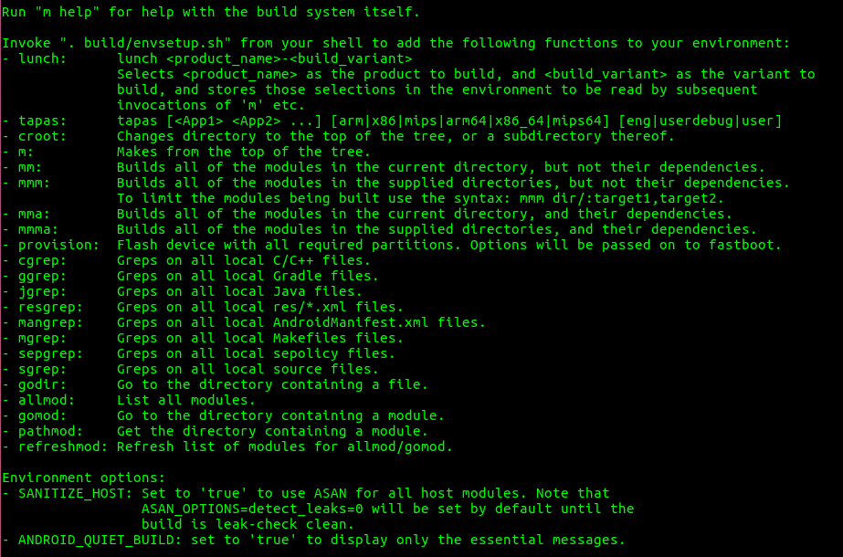
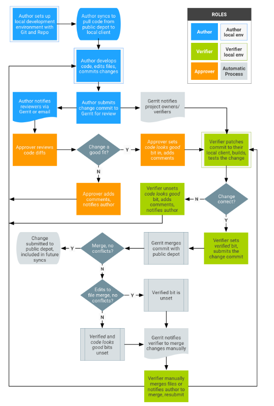

> 主要内容是Android AOSP源码的管理方式，项目源码的构建和编译，用到比如git、repo、gerrit一些命令工具，以及使用Soong编译系统，编写Android.bp文件的格式样式。


# 1. Android操作系统堆栈概述

> Android 是一个针对多种不同设备类型打造的开放源代码软件堆栈。Android 的主要目的是为运营商、OEM 和开发者打造一个开放的软件平台，使他们能够将创新理念变为现实，并推出能够卓有成效地改善用户移动体验的真实产品。

> Android 平台的设计可确保不存在一个集中瓶颈，即没有任何行业参与者可一手限制或控制其他参与者的创新。这样，我们不但可以打造功能完善的高品质消费类产品，而且可以完全开放源代码，供第三方自由定制和移植。


***

## 1.1. Android AOSP代码管理

> Google维护着多个代码流水线，以便明确区分当前稳定版 Android 与不稳定的实验性版本。将Android代码流水线的开放源代码管理和维护工作纳入到了更大的产品开发周期中


1. 在任何特定时刻，Android平台都有一个当前最新版本。该版本通常作为树中的一个分支
2. 设备制造商和贡献者会以当前最新版本为基础来修复错误、发布新设备、试验新功能等
3. 与此同时，Google会根据产品的需求和目标，在内部开发下一版Android平台和框架。与设备合作伙伴就旗舰设备展开合作来开发下一个Android版本，该旗舰设备的规格旨在推动Android朝着我们认为它应该选择的方向发展
4. 当第 n+1 版准备就绪时，它就会发布到公开源代码树，成为新的最新版本

***

## 1.2. 代号、标记和Build号

Android 开发版本按照英文字母的顺序，采用美味甜点的名字为代号，划分为不同的系列。

### 1.2.1. build ID定义

> [参考官方文档](https://source.android.google.cn/setup/start/build-numbers)

在Android 8.0.0 (Oreo)及更高版本中，每个build均采用build ID格式`PVBB.YYMMDD.bbb[.Cn]`进行标识，其中：

+ P 表示平台版本代号的第一个字母，例如O表示Oreo
+ V 表示支持的类别。按照惯例，P表示主要平台分支
+ BB 是由字母和数字组成的代码，Google可通过该代码识别build所属的确切代码分支
+ YYMMDD 表示相应版本从开发分支细分出来或与开发分支同步的日期。它并不一定是build的确切构建日期，因为Google常常会在现有build中增加细微的更改，并在新build中重复使用与现有build相同的日期代码
+ bbb 表示具有相同日期代码的不同版本，从001开始
+ Cn 是可选的字母数字，表示在现有`PVBB.YYMMDD.bbb`build之上构建的修补程序，从A1开始

***

# 2. 构建下载源码

## 2.1. ubuntu构建环境

如果是ubuntu 18.04的版本，则下载以下软件：

`sudo apt-get install git-core gnupg flex bison build-essential zip curl zlib1g-dev gcc-multilib g++-multilib libc6-dev-i386 libncurses5 lib32ncurses5-dev x11proto-core-dev libx11-dev lib32z1-dev libgl1-mesa-dev libxml2-utils xsltproc unzip fontconfig`

***

## 2.2. 源码控制工具

> 如需使用Android代码，需要使用Git一种开源版本控制系统）和Repo（一种对Git构成补充的Google 代码库管理工具）

### 2.2.1. Git

> [参考git官方使用说明文档](https://git-scm.com/book/zh/v2)

Git可以处理分布在多个代码库上的大型项目。Android使用Git执行本地操作，例如建立本地分支、提交、对比差异、修改

### 2.2.2. Repo

Repo可以在必要时整合多个Git代码库，将相关内容上传到Gerrit（修订版本控制系统），并自动执行Android开发工作流程的部分环节

Repo启动器会提供一个Python脚本，该脚本可以初始化检出，并可以下载第二部分，即完整的Repo工具。完整的Repo工具包含在Android源代码检出中。该工具默认位于`$SRCDIR/.repo/repo/...`中，它可以从下载的Repo启动器接收转发的命令。

Repo不会取代Git，只是为了在Android环境中更轻松地使用Git。Repo使用清单文件（XML）将Git项目汇总到Android超级项目中。

在大多数情况下，可以仅使用Git（不必使用Repo），或结合使用Repo和Git命令以组成复杂的命令。不过，使用Repo执行基本的跨网络操作可大大简化您的工作

***

#### 2.2.2.1. 安装Repo

1. 运行以下命令以使用您的 Linux 发行版中的官方软件包：

```shell
  sudo apt-get update
  sudo apt-get install repo
```

2. 查看版本号`repo version`

***

#### 2.2.2.2. 常用repo/git命令

|命令|说明|
|:----|:----|
|repo init|	初始化代码|
|repo sync	|同步代码|
|repo prune|安全移除已过时的主题分支|
|repo start	|新建一个分支|
|repo status|	显示当前分支的状态|
|repo upload	|将更改上传到审核服务器|
|git add	|暂存文件|
|git commit	|提交暂存的文件|
|git branch或repo branches|	显示当前分支|
|git branch [branch]	|创建新的主题分支|
|git checkout [branch]	|将 HEAD 切换到指定分支|
|git merge [branch]	|将 [branch] 合并到当前分支
|git diff	|显示未暂存更改的 diff 结果|
|git diff --cached	|显示已暂存更改的 diff 结果|
|git log|	显示当前分支的历史记录|
|git log m/[codeline]..	|显示未推送的提交|

**注意：如果存在错误，可能会导致`repo sync`重置本地主题分支。如果在您运行 repo sync 之后，`git branch`显示`*（无分支）`，请再次运行`git checkout`**

***

#### 2.2.2.3. repo命令

1. `repo help init`：针对init获取详细的帮助说明
2. `repo init --help`：只列出init的使用参数列表

**`repo sync`使用说明：（repo help sync）**

+ `-c`：仅获取服务器中的当前清单分支
+ `-d`：将指定项目切换回清单修订版本。如果项目当前属于某个主题分支，但临时需要清单修订版本，则此选项会有所帮助
+ `-f`：即使某个项目同步失败，也继续同步其他项目
+ `-jthreadcount`：将同步操作拆分成多个线程，以更快地完成。确保不会使计算机超负荷运行-为其他任务预留一些 CPU。**如需查看可用CPU的数量，请先运行：`nproc --all`**
+ `-q`：通过抑制状态消息来确保运行过程没有干扰
+ `-s`：同步到当前清单中的manifest-server元素指定的一个已知良好build

***

### 2.2.3. Gerrit

Gerrit是一个基于网页的代码审核系统，适用于使用Git的项目。Gerrit允许所有授权用户提交更改（如果这些更改通过代码审核，便会自动纳入到项目中），以此鼓励他们更集中地使用 Git。此外，Gerrit会在浏览器中并排显示更改，并支持代码内注释，从而使审核工作变得非常轻松。

### 2.2.4. Android Studio

一个用于开发 Android 应用的官方集成开发环境 (IDE)工具软件

### 2.2.5. Android 调试桥 (adb)

可将开发工作站直接与相应 Android 设备关联，以便安装软件包和评估更改

***

## 2.3. 下载源码

### 2.3.1. 初始化repo客户端

1. 使用mkdir创建工作文件夹目录
2. 配置git用户名和email

```shell
git config --global user.name Your Name
git config --global user.email you@example.com
```

3. 运行`repo init`获取最新版本的repo

```shell
repo init -u https://android.googlesource.com/platform/manifest

# 初始化某分支
repo init -u https://android.googlesource.com/platform/manifest -b master
```

***

### 2.3.2. python版本依赖

如果报错`/usr/bin/env 'python' no such file or directory`，则需要软链接python版本：

`sudo ln -s /usr/bin/python3 /usr/bin/python`

***

### 2.3.3. 下载Android源代码树

使用`repo sync`下载源代码到工作目录

如果需要加快速度，使用`-c`当前分支，和`-j threadcount`线程数标记：`repo sync -c -j8`

***

## 2.4. Soong编译系统

> 在Android7.0发布之前，Android仅使用GNUMake描述和执行其构建规则。Make构建系统得到了广泛的支持和使用，但在Android层面变得缓慢、容易出错、无法扩展且难以测试。Soong构建系统正好提供了Androidbuild所需的灵活性

### 2.4.1. Make和Soong比较（Android.mk和Android.bp）

**Make示例：**

```go
LOCAL_PATH := $(call my-dir)

include $(CLEAR_VARS)
LOCAL_MODULE := libxmlrpc++
LOCAL_MODULE_HOST_OS := linux

LOCAL_RTTI_FLAG := -frtti
LOCAL_CPPFLAGS := -Wall -Werror -fexceptions
LOCAL_EXPORT_C_INCLUDES := $(LOCAL_PATH)/src

LOCAL_SRC_FILES := $(call \
     all-cpp-files-under,src)
include $(BUILD_SHARED_LIBRARY)
```

**Soong示例：**

```go
cc_library_shared {
     name: “libxmlrpc++”,

     rtti: true,
     cppflags: [
           “-Wall”,
           “-Werror”,
           “-fexceptions”,
     ],
     export_include_dirs: [“src”],
     srcs: [“src/**/*.cpp”],

     target: {
           darwin: {
                enabled: false,
           },
     },
}
```

***

### 2.4.2. Android.bp文件格式

> 根据设计，Android.bp文件很简单。它们不包含任何条件语句，也不包含控制流语句；所有复杂问题都由用Go编写的构建逻辑处理。

#### 2.4.2.1. 模块

**Android.bp文件中的模块以模块类型开头，后跟一组`name: "value"`, 格式的属性：**

```go
cc_binary {
    /* 每个模块必须具有name属性，并且值唯一
    （仅有两个例外情况是命名空间和预构建模块中的 Android.bp 属性值，这两个值可能会重复）*/
    name: "gzip",
    // srcs属性以字符串列表的形式指定用于构建模块的源文件
    // 可以使用模块引用语法 ":<module-name>" 来引用生成源文件的其他模块的输出，如 genrule或filegroup
    srcs: ["src/test/minigzip.c"],
    shared_libs: ["libz"],
    stl: "none",
}
```

#### 2.4.2.2. 类型

变量和属性是强类型，变量根据第一项赋值动态变化，属性由模块类型静态设置。支持的类型为：

映射可以包含任何类型的值，包括嵌套映射。列表和映射可能在最后一个值后面有终止逗号。

+ 布尔值（true 或 false）
+ 整数 (int)
+ 字符串 ("string")
+ 字符串列表 (`["string1", "string2"]`)
+ 映射 (`{key1: "value1", key2: ["value2"]}`)

#### 2.4.2.3. 支持Glob（正则）

接受文件列表的属性（例如 srcs）也可以采用glob模式。

glob模式可以包含普通的UNIX通配符`*`，例如`*.java`。glob模式还可以包含单个`**`通配符作为路径元素，与零个或多个路径元素匹配。例如，`java/**/*.java`同时匹配`java/Main.java 和 java/com/android/Main.java`模式

#### 2.4.2.4. 变量

> 变量的作用域限定在声明它们的文件的其余部分，以及所有子Blueprint文件。变量是不可变的，但有一个例外情况：可以使用`+=`赋值将变量附加到别处，但只能在引用它们之前附加

**Android.bp文件可能包含顶级变量赋值：**

```go
// 定义变量 
gzip_srcs = ["src/test/minigzip.c"],
cc_binary {
    name: "gzip",
    // 引用变量
    srcs: gzip_srcs,
    shared_libs: ["libz"],
    stl: "none",
}
```

***

#### 2.4.2.5. 注释

Android.bp因为本质上是go语言，所以文件可以包含C样式的多行`/* */`注释以及C++样式的单行`//`注释

***

#### 2.4.2.6. 运算符

可以使用`+`运算符附加字符串、字符串列表和映射。

可以使用`+`运算符对整数求和。附加映射会生成两个映射中键的并集，并附加在两个映射中都存在的所有键的值

***

#### 2.4.2.7. 条件语句

Soong不支持Android.bp文件中的条件语句。

**但是，编译规则中需要条件语句的复杂问题将在Go在这种语言中，您可以使用高级语言功能，并且可以跟踪条件语句引入的隐式依赖项）中处理。**

**大多数条件语句都会转换为映射属性，其中选择了映射中的某个值并将其附加到顶级属性。**

**例如，要支持特定于架构的文件，请使用以下命令：**

```go
cc_library {
    ...
    srcs: ["generic.cpp"],
    arch: {
        arm: {
            srcs: ["arm.cpp"],
        },
        x86: {
            srcs: ["x86.cpp"],
        },
    },
}
```

***

#### 2.4.2.8. [实用]格式设置工具bpfmt

Soong包含一个针对Blueprint文件的规范格式设置工具，类似于`gofmt`。

如需以递归方式重新设置当前目录中所有Android.bp文件的格式，请运行以下命令：

`bpfmt -w .`

**PS：规范格式包括缩进四个空格、多元素列表的每个元素后面有换行符，以及列表和映射末尾有英文逗号**

***

### 2.4.3. 特殊模块

#### 2.4.3.1. 默认模块

默认模块可用于在多个模块中重复使用相同的属性。例如：

```go
//默认模块定义
cc_defaults {
    name: "gzip_defaults",
    shared_libs: ["libz"],
    stl: "none",
}

//引用默认模块
cc_binary {
    name: "gzip",
    defaults: ["gzip_defaults"],
    srcs: ["src/test/minigzip.c"],
}
```

***

#### 2.4.3.2. 预编译模块

某些预构建的模块类型允许模块与其基于源代码的对应模块具有相同的名称。

**例如，如果已有同名的cc_binary，也可以将cc_prebuilt_binary命名为foo**

例如可以预编译一些脚本：

```go
//Android 12 AOSP源码
//packages/modules/Gki/Android.bp
cc_prebuilt_binary {
    name: "com.android.gki.preinstall",
    product_specific: true,
    srcs: ["preinstall.sh"],
    apex_available: ["com.android.gki.*"],
    strip: {
        none: true,
    },
}
```

这让开发者可以灵活地选择要纳入其最终产品中的版本。如果编译配置包含两个版本，则预编译模块定义中的prefer标记值会指示哪个版本具有优先级。请注意，某些预编译模块的名称不能以prebuilt开头，例如`android_app_import`

***

#### 2.4.3.3. 命名空间模块

在Android完全从Make转换为Soong之前，Make产品配置必须指定`PRODUCT_SOONG_NAMESPACES`值。它的值应该是一个以空格分隔的列表，其中包含Soong导出到Make以使用m命令进行编译的命名空间。

在Android完成到Soong的转换之后，启用命名空间的详细信息可能会发生变化。

Soong可以让不同目录中的模块指定相同的名称，只要每个模块都在单独的命名空间中声明即可。可以按如下方式声明命名空间：

```go
soong_namespace {
    imports: ["path/to/otherNamespace1", "path/to/otherNamespace2"],
}
```

**PS:命名空间没有 name 属性；其路径会自动指定为其名称。系统会根据每个 Soong 模块在树中的位置为其分配命名空间。每个 Soong 模块都会被视为处于 Android.bp（位于当前目录或最近的父级目录中的 soong_namespace 文件内）定义的命名空间中。如果未找到此类 soong_namespace 模块，则认为该模块位于隐式根命名空间中。**

***

## 2.5. 编译Android

### 2.5.1. source更新环境

使用envsetup.sh脚本初始化环境：`source build/envsetup.sh`或者`. build/envsetup.sh`

**PS：需要在每次运行`repo sync`后重新发出此命令，以获取对该脚本所做的任何更改。请注意，将`source`替换为`.`（一个点）可以省去一些字符，这种简写形式在文档中更为常用**

envsetup.sh 脚本会导入若干命令，执行后能够使用Android源代码，其中包括一些可使用的命令

**如需查看可用命令的完整列表，请运行以下命令：`hmm`**



***

### 2.5.2. lunch选择目标

使用lunch选择要构建的目标

`lunch product_name-build_variant`会选择product_name作为需要构建的产品，并选择`build_variant`作为需要构建的变体，然后将这些选择存储在环境中，以便供后续对`m`和其他类似命令的调用读取。

确切的配置可作为参数进行传递。例如，以下命令表示针对模拟器进行完整构建，并且启用所有调试功能。

`lunch aosp_arm-eng`

#### 2.5.2.1. eng/user/userdebug

> [参考官方文档](https://source.android.google.cn/setup/develop/new-device#build-variants)

**所有构建目标都采用`BUILD-BUILDTYPE`形式，其中`BUILD`是表示特定功能组合的代号。`BUILDTYPE`是以下类型之一：**

|构建类型|使用情况|
|:----|:----|
|user|权限受限；适用于生产环境<br>安装带有user标记的模块<br>除了带有标记的模块之外，还会根据产品定义文件安装相应模块<br>属性ro.secure=1<br>属性ro.debuggable=0<br>adb 默认处于停用状态|
|userdebug|与“user”类似，但具有 root 权限和调试功能；是进行调试时的首选编译类型<br>同user区别有几点：<br>还会安装带有 debug 标记的模块<br>属性ro.debuggable=1<br>adb 默认处于启用状态|
|eng|具有额外调试工具的开发配置<br>默认变种<br>安装带有eng或debug标记的模块<br>除了带有标记的模块之外，还会根据产品定义文件安装相应模块<br>属性ro.secure=0<br>属性ro.debuggable=1<br>属性ro.kernel.android.checkjni=1<br>adb 默认处于启用状态|

***

#### 2.5.2.2. tapas

tapas命令用于配置未捆绑应用的构建流程。

它会选择要由Android构建系统构建的各个应用。与lunch不同，tapas不会请求为设备构建映像。

使用`tapas help`查看帮助说明

***

### 2.5.3. 编译代码

使用`m`构建所有内容。`m`可以使用`-jN`参数处理并行任务。

如果没有提供`-j`参数，构建系统会自动选择认为最适合您系统的并行任务计数

+ `m droid`是正常build。此模块目标在此处，因为默认目标需要名称
+ `m all`会构建所有内容，以确保包含在树中且包含Android.mk文件的所有元素都会构建
+ `m`: 从树的顶部运行构建系统。这很有用，因为可以在子目录中运行`make`。如果设置了`TOP`环境变量，它便会使用此变量。如果未设置此变量，它便会从当前目录中查找相应的树，以尝试找到树的顶层。可以通过运行不包含参数的`m`来构建整个源代码树，也可以通过指定相应名称来构建特定目标
+ `mma`: 构建当前目录中的所有模块及其依赖项
+ `mmma`: 构建提供的目录中的所有模块及其依赖项
+ `croot`: cd 到树顶部
+ `m clean`: 会删除此配置的所有输出和中间文件。此内容与`rm -rf out/`相同
+ 运行`m help`即可查看`m`提供的其他伪目标

***

### 2.5.4. 运行编译结果

可以在模拟器上运行构建系统，也可以将其刷写到设备上。由如果已经使用lunch选择了构建目标，就不能在构建目标以外的目标上运行。

1. 使用fastboot刷机
2. 模拟Android设备：编译流程会自动将模拟器添加到您的路径中。如需运行模拟器，请输入以下命令：`emulator`

***

## 2.6. ADB命令工具

使用`adb version`查看adb版本，并同时确认是否已安装ADB

如果未安装，可以构建Android源码，在构建目录下使用Android项目源码提供的ADB工具

## 2.7. fastboot刷写设备

1. 按住响应组合按键或者使用`adb reboot bootloader`命令进入fastboot模式
2. 运行命令`fastboot flashall -w`刷写，其中`-w`会擦除设备的data分区数据

***

## 2.8. 添加变种product

### 2.8.1. 编写product makefile步骤

1. 创建一个目录`device/<company-name>/<device-name>`，例如`device/google/marlin`（参考Android Q AOSP）。此目录将包含您设备的源代码以及构建这些代码所需的Makefile
2. 创建一个Makefile文件device.mk，用来声明设备所需的文件和模块。有关示例，参考`device/google/marlin/device-marlin.mk`
3. 创建一个产品定义Makefile，以便基于设备创建具体产品。以下示例Makefile来自于`device/google/marlin/aosp_marlin.mk`。请注意，该产品会通过Makefile沿用`device/google/marlin/device-marlin.mk`和`vendor/google/marlin/device-vendor-marlin.mk`文件中的设置，同时还会声明产品特定信息，例如名称、品牌和型号

```shell
# Inherit from the common Open Source product configuration
$(call inherit-product, $(SRC_TARGET_DIR)/product/core_64_bit.mk)
$(call inherit-product, $(SRC_TARGET_DIR)/product/aosp_base_telephony.mk)

PRODUCT_NAME := aosp_marlin
PRODUCT_DEVICE := marlin
PRODUCT_BRAND := Android
PRODUCT_MODEL := AOSP on msm8996
PRODUCT_MANUFACTURER := Google
PRODUCT_RESTRICT_VENDOR_FILES := true

PRODUCT_COPY_FILES += device/google/marlin/fstab.common:$(TARGET_COPY_OUT_VENDOR)/etc/fstab.marlin

$(call inherit-product, device/google/marlin/device-marlin.mk)
$(call inherit-product-if-exists, vendor/google_devices/marlin/device-vendor-marlin.mk)

PRODUCT_PACKAGES += \
    Launcher3QuickStep \
    WallpaperPicker
```

4. 创建一个指向产品的Makefile的AndroidProducts.mk文件。在此示例中，仅需要产品定义Makefile。以下示例来自于`device/google/marlin/AndroidProducts.mk`（该文件同时包含marlin(Pixel)和sailfish(PixelXL)，它们共享大部分配置）

```shell
PRODUCT_MAKEFILES := \
	$(LOCAL_DIR)/aosp_marlin.mk \
	$(LOCAL_DIR)/aosp_sailfish.mk

COMMON_LUNCH_CHOICES := \
	aosp_marlin-userdebug \
	aosp_sailfish-userdebug
```

5. 创建一个包含主板特定配置的Makefile文件`BoardConfig.mk`。有关示例，请查看`device/google/marlin/BoardConfig.mk`

***

### 2.8.2. 设置产品定义变量

|变量|	说明|	示例|
|:----|:----|:----|
|PRODUCT_AAPT_CONFIG	|创建软件包时使用的 aapt 配置|
|PRODUCT_BRAND|	对软件进行自定义所针对的品牌（如果有），例如运营商|	
|PRODUCT_CHARACTERISTICS|	用于允许向软件包中添加变体特定资源的 aapt 特性|tablet、nosdcard|
|PRODUCT_COPY_FILES|字词列表，如 source_path:destination_path。在构建相应产品时，应将源路径下的文件复制到目标路径。config/makefile 中定义了针对复制步骤的规则|
|PRODUCT_DEVICE|工业设计的名称。这也是主板名称，构建系统会使用它来查找 BoardConfig.mk|tuna|
|PRODUCT_LOCALES|以空格分隔的列表，用于列出由双字母语言代码和双字母国家/地区代码组成的代码对，以便说明针对用户的一些设置，例如界面语言和时间、日期以及货币格式。PRODUCT_LOCALES 中列出的第一个语言区域会用作产品的默认语言区域|	en_GB、de_DE、es_ES、fr_CA|
|PRODUCT_MANUFACTURER|制造商的名称|	acme|
|PRODUCT_MODEL|	最终产品的最终用户可见名称|
|PRODUCT_NAME|总体产品的最终用户可见名称，将显示在设置 > 关于屏幕中|
|PRODUCT_OTA_PUBLIC_KEYS|	产品的无线下载 (OTA) 公钥列表|
|PRODUCT_PACKAGES|	将要安装的 APK 和模块列表|	日历联系人|
|PRODUCT_PACKAGE_OVERLAYS|指明是使用默认资源还是添加任何产品特定叠加层|	vendor/acme/overlay|
|PRODUCT_SYSTEM_PROPERTIES|系统分区的系统属性分配（采用 "key=value" 格式）列表。其他分区的系统属性可通过 PRODUCT_<PARTITION>_PROPERTIES 设置，如供应商分区的 PRODUCT_VENDOR_PROPERTIES。支持的分区名称：SYSTEM、VENDOR、ODM、SYSTEM_EXT 和 PRODUCT|

***

### 2.8.3. 配置默认系统语言和语言区域过滤器

#### 2.8.3.1. 属性配置

+ `ro.product.locale`：用于设置默认语言区域。此属性最初被设置为`PRODUCT_LOCALES`变量中的第一个语言区域；可以替换该值
+ `ro.localization.locale_filter`：使用正则表达式（应用于语言区域名称）设置语言区域过滤器。例如：
+ + 包含过滤器：`^(de-AT|de-DE|en|uk).*`:只允许德语（奥地利变体和德国变体）、所有英语变体和乌克兰语
+ + 排除过滤器：`^(?!de-IT|es).*`:不包括德语（意大利变体）和西班牙语的所有变体

***

#### 2.8.3.2. 启用语言区域过滤器

如需启用过滤器，请设置`ro.localization.locale_filter`系统属性字符串值

通过在出厂校准期间使用`oem/oem.prop`设置过滤器属性值和默认语言，无需将过滤器烘焙 (bake) 到系统映像中即可配置限制

通过将这些属性添加到`PRODUCT_OEM_PROPERTIES`变量中（如下所示），就可以确保从OEM分区中获取这些属性

```shell
# Delegation for OEM customization
PRODUCT_OEM_PROPERTIES += \
    ro.product.locale \
    ro.localization.locale_filter
```

然后，在生产环境中，实际值会被写入`oem/oem.prop`以反映目标要求。**借助这种方法，就能在恢复出厂设置期间保留默认值，让初始设置在用户看来与首次设置完全一样**

***

# 3. 补丁提交的生命周期

## 3.1. 流程图



***

# 4. 参考

+ [Google官方文档](https://source.android.google.cn/setup)