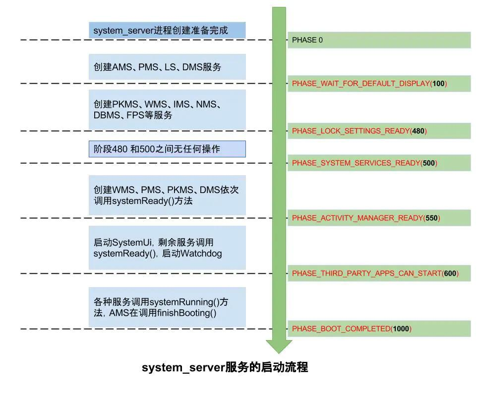

> Android DropBox是Android用来持续化存储系统数据的一个管理类，主要用于记录Android运行过程中, 内核, 系统进程, 用户进程等出现严重问题时的log。

# 1. dropbox查看方式

> 系统服务dropbox以文件形式记录了系统各种异常信息，例如app crash、native crash、anr、kernel panic等等

## 1.1. ABD dump

`adb shell dumpsys dropbox`

## 1.2. 日志文件查看

日志文件存储在`/data/system/dropbox`

```log
/data/system/dropbox # ls -thl
total 36K
-rw------- 1 system system 2.2K 2022-10-03 18:27 system_server_wtf@1639267200804.txt
-rw------- 1 system system 1.8K 2022-10-03 18:27 system_app_wtf@1639267200803.txt
-rw------- 1 system system 1.6K 2022-10-03 18:27 system_app_strictmode@1639267200802.txt
-rw------- 1 system system 1.8K 2022-10-03 18:27 system_server_strictmode@1639267200801.txt
-rw------- 1 system system 1.3K 2022-10-03 18:27 system_server_strictmode@1639267200800.txt
-rw------- 1 system system 1.3K 2022-10-03 18:27 system_server_strictmode@1639267200799.txt
-rw------- 1 system system 1.2K 2022-10-03 18:27 system_server_strictmode@1639267200798.txt
-rw------- 1 system system 1.2K 2022-10-03 18:27 system_server_strictmode@1639267200797.txt
-rw------- 1 system system 1.2K 2022-10-03 18:27 system_server_strictmode@1639267200796.txt
-rw------- 1 system system 1.8K 2022-10-03 18:27 system_server_strictmode@1639267200795.txt
-rw------- 1 system system 1.5K 2022-10-03 18:27 system_server_strictmode@1639267200793.txt
-rw------- 1 system system 1.5K 2022-10-03 18:27 system_server_strictmode@1639267200794.txt
-rw------- 1 system system 1.2K 2022-10-03 18:27 system_server_strictmode@1639267200791.txt
-rw------- 1 system system 1.5K 2022-10-03 18:27 system_server_strictmode@1639267200792.txt
-rw------- 1 system system 1.8K 2021-12-12 08:59 system_server_wtf@1639270794860.txt
-rw------- 1 system system 1.8K 2021-12-12 08:29 system_server_wtf@1639268994862.txt
-rw------- 1 system system 1.8K 2021-12-12 08:00 system_server_wtf@1639267254499.txt
-rw------- 1 system system  557 2021-12-12 08:00 SYSTEM_BOOT@1639267200805.txt
```

***

# 2. 源码文件

```shell
frameworks/base/core/java/android/os/DropBoxManager.java 
frameworks/base/core/java/android/os/DropBoxManager.aidl

frameworks/base/core/java/com/android/internal/os/IDropBoxManagerService.aidl

frameworks/base/services/core/java/com/android/server/DropBoxManagerService.java 

frameworks/base/libs/services/include/android/os/DropBoxManager.h
frameworks/base/libs/services/src/os/DropBoxManager.cpp
```

# 3. dropbox服务启动

## 3.1. systamserver启动服务

dropbox通过`systemserver:run`启动

frameworks/base/services/java/com/android/server/SystemServer.java - 函数run()
-----> 调用函数startOtherServices()
-----> 调用类SystemServiceManager的函数startService()，注册到SystemService列表

```java
private void startOtherServices() {
    ...
            traceBeginAndSlog("StartDropBoxManager");
            mSystemServiceManager.startService(DropBoxManagerService.class);
            traceEnd();
    ...
}
```
 
在这个startService函数中，做了两件事：（**DropBoxManagerService继承SystemService**）
1. 调用`newInstance(mContext)`创建对象，从而会调用DropBoxManagerService构造函数
2. 调用onStart()函数，即DropBoxManagerService的onStart函数（只是注册dropbox服务）

***

## 3.2. 构造函数

先调用上面的构造函数，后调用后面的构造函数

```java
//frameworks/base/services/core/java/com/android/server/DropBoxManagerService.java
   public DropBoxManagerService(final Context context) {
       //创建File对象，并非创建文件
        this(context, new File("/data/system/dropbox"), FgThread.get().getLooper());
    }

    @VisibleForTesting
    public DropBoxManagerService(final Context context, File path, Looper looper) {
        super(context);
        //全局对象，定义private final File mDropBoxDir，此处进行赋值
        mDropBoxDir = path;
        //PS:ContentResolver直译为内容解析器,和ContentProvider成对出现。
        //程序间数据的共享是通过Provider/Resolver进行的。提供数据（内容）的就叫Provider，Resovler提供接口对这个内容进行解读
        mContentResolver = getContext().getContentResolver();
        //创建handler对象
        mHandler = new DropBoxManagerBroadcastHandler(looper);
    }
```

----> DropBoxManagerBroadcastHandler是一个私有类，继承Handler，主要用于处理广播消息

```java
   private class DropBoxManagerBroadcastHandler extends Handler {
        static final int MSG_SEND_BROADCAST = 1;
        static final int MSG_SEND_DEFERRED_BROADCAST = 2;
       .....
       //构造函数
        DropBoxManagerBroadcastHandler(Looper looper) {
            super(looper);
        }
        //处理消息函数
        @Override
        public void handleMessage(Message msg) {
            switch (msg.what) {
                case MSG_SEND_BROADCAST://正常广播
                    prepareAndSendBroadcast((Intent) msg.obj);
                    break;
                case MSG_SEND_DEFERRED_BROADCAST://延时广播
                    Intent deferredIntent;
                    synchronized (mLock) {
                        deferredIntent = mDeferredMap.remove((String) msg.obj);
                    }
                    if (deferredIntent != null) {
                        prepareAndSendBroadcast(deferredIntent);
                    }
                    break;
            }
        }

        private void prepareAndSendBroadcast(Intent intent) {
            if (!DropBoxManagerService.this.mBooted) {
                intent.addFlags(Intent.FLAG_RECEIVER_REGISTERED_ONLY);
            }
            getContext().sendBroadcastAsUser(intent, UserHandle.SYSTEM,
                    android.Manifest.permission.READ_LOGS);
        }
```

***

## 3.3. onBootPhase函数

### 3.3.1. systemserver的startBootPhase()概念

> SystemServer启动的服务很多，服务间也会有相互依赖的情况，为了解决依赖的时序问题，SystemServer主要通过分批启动和分阶段启动来处理。
> 主要利用了SystemServiceManager的startBootPhase()



这些启动阶段会穿插在各项的服务启动序列中。 startBootPhase会去回调用service的onBootPhase方法，对应的servcie才会去执行对应的操作

比如此处dropbox服务，对应的是`PHASE_SYSTEM_SERVICES_READY`以及启动完成后的`PHASE_BOOT_COMPLETED`

**日志参考：**

```log
# logcat |grep -Ei "BootPhase|Starting phase"
01-01 08:00:10.953  2678  2678 I SystemServiceManager: Starting phase 100
01-01 08:00:11.005  2678  2678 W SystemServiceManager: Service com.android.server.display.DisplayManagerService took 52 ms in onBootPhase
10-03 18:27:31.494  2678  2678 I SystemServer: StartBootPhaseLockSettingsReady
10-03 18:27:31.494  2678  2678 I SystemServiceManager: Starting phase 480
10-03 18:27:31.502  2678  2678 D SystemServerTiming: StartBootPhaseLockSettingsReady took to complete: 8ms
//dropbox服务的onBootPhase函数在这个范围执行
10-03 18:27:31.502  2678  2678 I SystemServer: StartBootPhaseSystemServicesReady
10-03 18:27:31.502  2678  2678 I SystemServiceManager: Starting phase 500
10-03 18:27:31.554  2678  2678 D ContextHubSystemService: onBootPhase: PHASE_SYSTEM_SERVICES_READY
10-03 18:27:31.555  2678  2678 D SystemServerTiming: StartBootPhaseSystemServicesReady took to complete: 53ms
10-03 18:27:31.598  2678  2678 I SystemServer: StartBootPhaseDeviceSpecificServicesReady
10-03 18:27:31.598  2678  2678 I SystemServiceManager: Starting phase 520
10-03 18:27:31.598  2678  2678 D SystemServerTiming: StartBootPhaseDeviceSpecificServicesReady took to complete: 0ms
10-03 18:27:31.656  2678  2678 I SystemServiceManager: Starting phase 550
10-03 18:27:31.805  2678  2678 I SystemServiceManager: Starting phase 600
10-03 18:27:31.823  2678  2678 D CarServiceHelper: onBootPhase:600
10-03 18:27:32.935  2678  2749 I SystemServiceManager: Starting phase 1000
10-03 18:27:32.957  2678  2749 D CarServiceHelper: onBootPhase:1000
```

***

### 3.3.2. 调用流程

frameworks/base/services/java/com/android/server/SystemServer.java  - startOtherServices()
```java
//PHASE_LOCK_SETTINGS_READY=480
//PHASE_SYSTEM_SERVICES_READY=500
        traceBeginAndSlog("StartBootPhaseLockSettingsReady");
        mSystemServiceManager.startBootPhase(SystemService.PHASE_LOCK_SETTINGS_READY);
        traceEnd();

        traceBeginAndSlog("StartBootPhaseSystemServicesReady");
        mSystemServiceManager.startBootPhase(SystemService.PHASE_SYSTEM_SERVICES_READY);
        traceEnd();

```

----> SystemServiceManager.java  - 调用`startBootPhase(final int phase)`，此处入参phase=500，mCurrentPhase=480，然后将mCurrentPhase赋值为500，再调用`service.onBootPhase(mCurrentPhase)`
----> SystemService.java - 调用`onBootPhase(int phase)`
----> DropBoxManagerService.java - 调用父类函数`onBootPhase(int phase)`

```java
//frameworks/base/services/core/java/com/android/server/DropBoxManagerService.java
    @Override
    public void onBootPhase(int phase) {
        switch (phase) {
            case PHASE_SYSTEM_SERVICES_READY:
                IntentFilter filter = new IntentFilter();
                filter.addAction(Intent.ACTION_DEVICE_STORAGE_LOW);
                getContext().registerReceiver(mReceiver, filter);
                //注册Observer，通过指定Uri可以仅对数据库中感兴趣的数据有变化时，进行监听
                mContentResolver.registerContentObserver(
                    Settings.Global.CONTENT_URI, true,
                    new ContentObserver(new Handler()) {
                        @Override
                        public void onChange(boolean selfChange) {
                            mReceiver.onReceive(getContext(), (Intent) null);
                        }
                    });
                //低优先级(frameworks/base/core/res/res/values/config.xml)
                //config_dropboxLowPriorityBroadcastRateLimitPeriod=2000
                //config_dropboxLowPriorityTags
                getLowPriorityResourceConfigs();
                break;
            //启动完成后设置mBooted属性
            case PHASE_BOOT_COMPLETED:
                mBooted = true;
                break;
        }
    }
```

## 3.4. dump函数


***

# 4. DropBoxManager上层API接口

## 4.1. AIDL接口调用流程

1. frameworks/base/core/java/android/os/DropBoxManager.java定义`private final IDropBoxManagerService mService;`
2. frameworks/base/core/java/com/android/internal/os/IDropBoxManagerService.aidl定义接口函数，包含add、isTagEnabled、getNextEntry
3. frameworks/base/services/core/java/com/android/server/DropBoxManagerService.java - 通过`private final IDropBoxManagerService.Stub mStub = new IDropBoxManagerService.Stub() {....`实现接口函数

## 4.2. DropBoxManager addText函数

```java
//DropBoxManager.java
    public void addText(String tag, String data) {
        try {
            //调用IDropBoxManagerService的add函数，到service层
            //入参entry类型
            mService.add(new Entry(tag, 0, data));
        } catch (RemoteException e) {
            if (e instanceof TransactionTooLargeException
                    && mContext.getApplicationInfo().targetSdkVersion < Build.VERSION_CODES.N) {
                Log.e(TAG, "App sent too much data, so it was ignored", e);
                return;
            }
            throw e.rethrowFromSystemServer();
        }
    }

       /** Create a new Entry with plain text contents. */
        public Entry(String tag, long millis, String text) {
            if (tag == null) throw new NullPointerException("tag == null");
            if (text == null) throw new NullPointerException("text == null");

            mTag = tag;
            mTimeMillis = millis;
            mData = text.getBytes();
            mFileDescriptor = null;
            mFlags = IS_TEXT;
        }
```

## 4.3. DropBoxManagerService add函数

```java
//DropBoxManagerService.java
//调用DropBoxManagerService的add函数
 private final IDropBoxManagerService.Stub mStub = new IDropBoxManagerService.Stub() {
        @Override
        public void add(DropBoxManager.Entry entry) {
            DropBoxManagerService.this.add(entry);
        }
        ....
 }
```

**add函数详细代码，从日志看打印：**

```log
# logcat |grep -Ei "isTagEnabled"
10-03 18:27:30.993  2678  2748 I DropBoxManagerService: add tag=system_server_strictmode isTagEnabled=true flags=0x2
10-03 18:27:31.050  2678  2748 I DropBoxManagerService: add tag=system_server_strictmode isTagEnabled=true flags=0x2
10-03 18:27:33.509  2678  3459 I DropBoxManagerService: add tag=system_app_wtf isTagEnabled=true flags=0x2
10-03 18:27:34.366  2678  2748 I DropBoxManagerService: add tag=system_app_strictmode isTagEnabled=true flags=0x2
10-03 18:27:36.926  2678  2851 I DropBoxManagerService: add tag=system_server_wtf isTagEnabled=true flags=0x2
12-12 08:00:00.282  2678  3941 I DropBoxManagerService: add tag=SYSTEM_BOOT isTagEnabled=true flags=0x2
12-12 08:00:54.426  2678  2849 I DropBoxManagerService: add tag=system_server_wtf isTagEnabled=true flags=0x2
12-12 08:29:54.778  2678  2849 I DropBoxManagerService: add tag=system_server_wtf isTagEnabled=true flags=0x2
```

```java
 public void add(DropBoxManager.Entry entry) {
        File temp = null;
        InputStream input = null;
        OutputStream output = null;
        //获取日志tag标签信息
        final String tag = entry.getTag();
        try {
            int flags = entry.getFlags();
            Slog.i(TAG, "add tag=" + tag + " isTagEnabled=" + isTagEnabled(tag)
                    + " flags=0x" + Integer.toHexString(flags));
            if ((flags & DropBoxManager.IS_EMPTY) != 0) throw new IllegalArgumentException();
            //调用init函数，主要是创建EntryFile即日志文件  --> new EntryFile(file, mBlockSize)
            //如果文件存在，则调用enrollEntry(entry)
            init();
            //检查tag是否启动
            if (!isTagEnabled(tag)) return;
            //修剪磁盘上的文件以确保它们不会占用太多空间
            long max = trimToFit();
            long lastTrim = System.currentTimeMillis();
            //创建buffer
            byte[] buffer = new byte[mBlockSize];
            input = entry.getInputStream();

            // 首先，在决定是否压缩数据之前，在内存中累积最多一块数据
            int read = 0;
            while (read < buffer.length) {
                int n = input.read(buffer, read, buffer.length - read);
                if (n <= 0) break;
                read += n;
            }

            //如果我们至少有一个块，就压缩它——否则，只需以未压缩的形式写入数据
            //临时文件
            temp = new File(mDropBoxDir, "drop" + Thread.currentThread().getId() + ".tmp");
            int bufferSize = mBlockSize;
            if (bufferSize > 4096) bufferSize = 4096;
            if (bufferSize < 512) bufferSize = 512;
            FileOutputStream foutput = new FileOutputStream(temp);
            output = new BufferedOutputStream(foutput, bufferSize);
            if (read == buffer.length && ((flags & DropBoxManager.IS_GZIPPED) == 0)) {
                output = new GZIPOutputStream(output);
                flags = flags | DropBoxManager.IS_GZIPPED;
            }

            do {
                //写入buffer数据到文件
                output.write(buffer, 0, read);
                //时间戳判断，以防数据缓慢流入
                long now = System.currentTimeMillis();
                if (now - lastTrim > 30 * 1000) {
                    max = trimToFit();  
                    lastTrim = now;
                }

                read = input.read(buffer);
                //获得最终尺寸测量
                if (read <= 0) {
                    FileUtils.sync(foutput);
                    output.close();  // Get a final size measurement
                    output = null;
                } else {
                    //所以尺寸测量是伪合理的
                    output.flush();  // So the size measurement is pseudo-reasonable
                }

                long len = temp.length();
                if (len > max) {
                    Slog.w(TAG, "Dropping: " + tag + " (" + temp.length() + " > "
                            + max + " bytes)");
                    temp.delete();
                    temp = null;  // Pass temp = null to createEntry() to leave a tombstone
                    break;
                }
            } while (read > 0);
            //将临时文件移动到最终日志文件名并注册
            long time = createEntry(temp, tag, flags);
            temp = null;

            //在此调用返回后调用sendBroadcast以避免死锁。
            //特别是，调用方可能持有WindowManagerService锁，但sendBroadcast需要ActivityManagerService中的锁。
            //ActivityManagerService在等待WindowManagerService锁定时被发现持有该锁定。
            if (mLowPriorityTags != null && mLowPriorityTags.contains(tag)) {
                // Rate limit low priority Dropbox entries
                mHandler.maybeDeferBroadcast(tag, time);
            } else {
                //发送ACTION_DROPBOX_ENTRY_ADDED广播
                //此处会调用 sendMessage(obtainMessage(MSG_SEND_BROADCAST, createIntent(tag, time)))
                mHandler.sendBroadcast(tag, time);
            }
        } .....
    }
```

### 4.3.1. ACTION_DROPBOX_ENTRY_ADDED广播

利用dropbox每生成新的记录, Dropbox就会发送广播：`DropBoxManager.ACTION_DROPBOX_ENTRY_ADDED`

app可以接收监听改广播获取指定的数据文件内容，内容发送到指定的服务器或邮箱完成错误自动上报。

**利用前提：**app要具有系统权限  因为：`DropBoxManager.ACTION_DROPBOX_ENTRY_ADDED`是保护性广播，且读取系统日志也需要`android.Manifest.permission.READ_LOGS`权限

***

### 4.3.2. DropBoxManagerService中dump和add数据控制定义

这些都是默认值，可以通过设置`content://settings/global`数据库对应项来修改

```java
   private static final int DEFAULT_AGE_SECONDS = 3 * 86400; //文件最长可存活时长为3天 
   //这两个最大文件数，通过AM.java的isLowRamDeviceStatic()控制，即debug.force_low_ram属性（默认false）
    private static final int DEFAULT_MAX_FILES = 1000; //最大dropbox文件个数为1000
    private static final int DEFAULT_MAX_FILES_LOWRAM = 300; //低rom时最大dropbox文件个数为300
    private static final int DEFAULT_QUOTA_KB = 5 * 1024; //分配dropbox空间的最大值5M
    private static final int DEFAULT_QUOTA_PERCENT = 10; //指dropbox目录最多可占用空间比例10% 
    private static final int DEFAULT_RESERVE_PERCENT = 10; //指dropbox不可使用的存储空间比例10% 
    private static final int QUOTA_RESCAN_MILLIS = 5000; //重新扫描retrim时长为5s
```

***

## 4.4. ActivityManagerService应用crash案例

java/native层异常的区分在于`eventType:crash/native_crash`

+ java层：`handleApplicationCrashInner("crash", r, processName, crashInfo);`
+ native层： `mAm.handleApplicationCrashInner("native_crash", mApp, mApp.processName, ci);`

**调用流程：**
+ native crash：frameworks/base/services/core/java/com/android/server/am/NativeCrashListener.java  - 子线程`run()`调用`mAm.handleApplicationCrashInner("native_crash", mApp, mApp.processName, ci);`
+ java crash： frameworks/base/services/core/java/com/android/server/am/ActivityManagerService.java - handleApplicationCrash调用`handleApplicationCrashInner("crash", r, processName, crashInfo);`

----> ActivityManagerService.java - `handleApplicationCrashInner(String eventType, ProcessRecord r, String processName,ApplicationErrorReport.CrashInfo crashInfo)`调用`addErrorToDropBox(eventType, r, processName, null, null, null, null, null, null, crashInfo);`
----> ActivityManagerService.java - addErrorToDropBox函数分析

```java
//将一个error错误的详细描述（例如crash、WTF、ANR）写入到drop box中
public void addErrorToDropBox(String eventType,
            ProcessRecord process, String processName, String activityShortComponentName,
            String parentShortComponentName, ProcessRecord parentProcess,
            String subject, final String report, final File dataFile,
            final ApplicationErrorReport.CrashInfo crashInfo) {
        //这绝对不能获取ActivityManagerService锁，
        //否则可以防止看门狗重置系统

        // 获取DropBoxManager服务对象
        if (ServiceManager.getService(Context.DROPBOX_SERVICE) == null) return;
        final DropBoxManager dbox = mContext.getSystemService(DropBoxManager.class);
        ......
        //头部信息，包含进程号、线程好、包名等
        final StringBuilder sb = new StringBuilder(1024);
        appendDropBoxProcessHeaders(process, processName, sb);
        //写入Activity名字、父进程、父Activity、对象、build时间、crash-tag标签等信息到sb对象中
        ......
        //创建一个子线程。在其中执行其余操作，以避免在I/O上阻塞调用程序
        //（在此之后，我们不应该访问AMS内部数据结构
        Thread worker = new Thread("Error dump: " + dropboxTag) {
            @Override
            public void run() {
                .....
                //调用DropBoxManager的addText，传入sb错误信息数据
                dbox.addText(dropboxTag, sb.toString());
            ......
            }
        }
        ......
            }
```

***

# 5. dropbox记录错误信息类型

## 5.1. 系统正常启动后的自检

### 5.1.1. SYSTEM_BOOT开机日志记录

日志对应`data/system/dropbox`:`SYSTEM_BOOT@1639267200299.txt`

**SYSTEM_BOOT**一次开机会记录一次

**调用方式：**

```java
//frameworks/base/core/java/com/android/server/BootReceiver.java
public class BootReceiver extends BroadcastReceiver {
    private static final String TAG = "BootReceiver";
    ....
    @Override
    public void onReceive(final Context context, Intent intent) {
        // Log boot events in the background to avoid blocking the main thread with I/O
        new Thread() {
            @Override
            public void run() {
                try {
                    //调用logBootEvents输出日志信息
                    logBootEvents(context);
                } catch (Exception e) {
                    Slog.e(TAG, "Can't log boot events", e);
                }
                ....
            }
        }
    }
    .....
    private void logBootEvents(Context ctx) throws IOException {
        final DropBoxManager db = (DropBoxManager) ctx.getSystemService(Context.DROPBOX_SERVICE);
        final String headers = getBootHeadersToLogAndUpdate();
        final String bootReason = SystemProperties.get("ro.boot.bootreason", null);

        String recovery = RecoverySystem.handleAftermath(ctx);
        if (recovery != null && db != null) {
            //调用DropBoxManager的addText函数
            db.addText("SYSTEM_RECOVERY_LOG", headers + recovery);
        }
        ....
}
```

***

### 5.1.2. SYSTEM_RESTART系统异常记录

如果system_server在设备运行过程中异常，则会有记录

同上，在frameworks/base/core/java/com/android/server/BootReceiver.java - 函数logBootEvents

根据属性`ro.runtime.firstboot`值判断

```java
    private void logBootEvents(Context ctx) throws IOException {
        final DropBoxManager db = (DropBoxManager) ctx.getSystemService(Context.DROPBOX_SERVICE);
        ......
        if (SystemProperties.getLong("ro.runtime.firstboot", 0) == 0) {
            ......
        } else {
            if (db != null) db.addText("SYSTEM_RESTART", headers);
        }
```

***

### 5.1.3. SYSTEM_LAST_KMSG内核异常记录

> kernel异常

+ pstore是persistent storage的缩写，内核发生异常通过此把异常日志记录下来，方便定位问题
+ ramoops指的是采用ram保存oops信息(kernel 异常信息)的一个功能，利用pstore技术实现

```shell
kernel异常信息保存地：
panic
/proc/last_kmsg

oops
/sys/fs/pstore/console-ramoops
/sys/fs/pstore/console-ramoops-0
```

源码位置同上，在BootReceiver.java

```java
    private void logBootEvents(Context ctx) throws IOException {
        final DropBoxManager db = (DropBoxManager) ctx.getSystemService(Context.DROPBOX_SERVICE);
        ......
        if (SystemProperties.getLong("ro.runtime.firstboot", 0) == 0) {
            if (StorageManager.inCryptKeeperBounce()) {
                // Encrypted, first boot to get PIN/pattern/password so data is tmpfs
                // Don't set ro.runtime.firstboot so that we will do this again
                // when data is properly mounted
            } else {
                String now = Long.toString(System.currentTimeMillis());
                SystemProperties.set("ro.runtime.firstboot", now);
            }
            if (db != null) db.addText("SYSTEM_BOOT", headers);

            // Negative sizes mean to take the *tail* of the file (see FileUtils.readTextFile())
            //各个节点的日志信息
            addFileWithFootersToDropBox(db, timestamps, headers, lastKmsgFooter,
                    "/proc/last_kmsg", -LOG_SIZE, "SYSTEM_LAST_KMSG");
            addFileWithFootersToDropBox(db, timestamps, headers, lastKmsgFooter,
                    "/sys/fs/pstore/console-ramoops", -LOG_SIZE, "SYSTEM_LAST_KMSG");
            addFileWithFootersToDropBox(db, timestamps, headers, lastKmsgFooter,
                    "/sys/fs/pstore/console-ramoops-0", -LOG_SIZE, "SYSTEM_LAST_KMSG");
            addFileToDropBox(db, timestamps, headers, "/cache/recovery/log", -LOG_SIZE,
                    "SYSTEM_RECOVERY_LOG");
            addFileToDropBox(db, timestamps, headers, "/cache/recovery/last_kmsg",
                    -LOG_SIZE, "SYSTEM_RECOVERY_KMSG");
            addAuditErrorsToDropBox(db, timestamps, headers, -LOG_SIZE, "SYSTEM_AUDIT");
        } else {
            if (db != null) db.addText("SYSTEM_RESTART", headers);
        }
```

***

### 5.1.4. SYSTEM_TOMBSTONE记录

> TOMBSTONE是Android用来记录native进程崩溃的core dump日志, 系统服务在启动完成后会增加一个Observer来侦测tombstone日志文件的变化, 每当生成新的tombstone文件, 就会增加一条 SYSTEM_TOMBSTONE记录到DropBoxManager中

源码位置同上文件

### 5.1.5. SYSTEM_RECOVERY_LOG/SYSTEM_RECOVERY_KMSG

```shell
SYSTEM_RECOVERY_KMSG：recovery kerenl日志
SYSTEM_RECOVERY_LOG：recovery 升级或恢复出厂设置等等日志
```

源码位置同上文件

***

### 5.1.6. SYSTEM_FSCK

文件系统完整性校验日志

源码位置同上文件

***

### 5.1.7. SYSTEM_AUDIT

kernel异常信息的查漏补缺日志

源码位置同上文件


***

## 5.2. ANR异常收集

> 涉及广播、Service、Provider等组件的anr以及触摸按键事件的ANR（正常也可以在`data/anr`查看）

**代码流程：**
frameworks/base/services/core/java/com/android/server/am/ProcessRecord.java - appNotResponding调用`mService.addErrorToDropBox("anr", this, processName, activityShortComponentName, parentShortComponentName, parentPr, annotation, cpuInfo, tracesFile, null);`
----> ActivityManagerService.java - addErrorToDropBox

接下来的流程同上面Crash流程

***

## 5.3. wtf(What a Terrible Failure)

> `android.util.Log.wtf(String, String)`，应用可调用布局异常点

代码流程同上面Crash流程

**PS：当系统设置`Settings.Global.WTF_IS_FATAL为1`时，发送wtf可kill应用**

***

## 5.4. 严格模式—**_strictmode

> 严格模式，主要为性能监测使用

> StrictMode (严格模式), 顾名思义, 就是在比正常模式检测得更严格, 通常用来监测不应当在主线程执行的网络, 文件等操作。任何 StrictMode违例都会被 ActivityManagerService 在 DropBoxManager 中记录为一次strict_mode违例。

```java
//frameworks/base/services/core/java/com/android/server/am/ActivityManagerService.java
public void handleApplicationStrictModeViolation(
        IBinder app,
        int penaltyMask,
        StrictMode.ViolationInfo info) {
    ···
    //需要满足触发dropbox的条件
    if ((penaltyMask & StrictMode.PENALTY_DROPBOX) != 0) {
        Integer stackFingerprint = info.hashCode();
        boolean logIt = true;
        ···
        if (logIt) {//执行dropbox业务
            logStrictModeViolationToDropBox(r, info);
        }
    }

    ···
}

private void logStrictModeViolationToDropBox(
        ProcessRecord process,
        StrictMode.ViolationInfo info) {
    if (info == null) {
        return;
    }
    //收集信息，tag：***_strictmode
    ···省略···
    
    //加入到dropbox
    IoThread.getHandler().post(() -> {
        dbox.addText(dropboxTag, res);
    });
} 
```

***

## 5.5. lowmem—低内存报告

```java
final void doLowMemReportIfNeededLocked(ProcessRecord dyingProc) {
    //如果不再有任何后台进程在运行，并且死亡的应用程序没有运行检测，那么告诉所有人我们现在的内存不足
    if (!mProcessList.haveBackgroundProcessLocked()) {
        ···
        //event事件的日志记录：EventLogTags.AM_LOW_MEMORY --> am_low_memory
        EventLog.writeEvent(EventLogTags.AM_LOW_MEMORY, mProcessList.getLruSizeLocked());
        ···
        if (doReport) {//如果报告，最后调入reportMemUsage
            Message msg = mHandler.obtainMessage(REPORT_MEM_USAGE_MSG, memInfos);
            mHandler.sendMessage(msg);
        }
        ···
    }
}

void reportMemUsage(ArrayList<ProcessMemInfo> memInfos) {
    ···
    addErrorToDropBox("lowmem", null, "system_server", null,
            null, null, tag.toString(), dropBuilder.toString(), null, null);
    ···
}
```

***

## 5.6. watchdog

> 如果 WatchDog 监测到系统进程(system_server)出现问题, 会增加一条watchdog记录到DropBoxManager中, 并终止系统进程的执行

```java
//frameworks/base/services/core/java/com/android/server/Watchdog.java
@Override
    public void run() {
            ......

            // 尝试将错误添加到下拉框中，但假设ActivityManager本身可能已死锁。
            //（发生了这种情况，导致此语句死锁，整个监视器无效）
            Thread dropboxThread = new Thread("watchdogWriteToDropbox") {
                    public void run() {
                        // If a watched thread hangs before init() is called, we don't have a
                        // valid mActivity. So we can't log the error to dropbox.
                        if (mActivity != null) {
                            mActivity.addErrorToDropBox(
                                    "watchdog", null, "system_server", null, null, null,
                                    subject, null, stack, null);
                        }
                        StatsLog.write(StatsLog.SYSTEM_SERVER_WATCHDOG_OCCURRED, subject);
                    }
                };
            dropboxThread.start();
            try {
                dropboxThread.join(2000);  // wait up to 2 seconds for it to return.
            } catch (InterruptedException ignored) {}
            ....
    }
```

***

## 5.7. 其他

### 5.7.1. netstats_error/netstats_dump

> NetworkStatsService负责收集并持久化存储网络状态的统计数据, 当遇到明显的网络状态错误时, 它会增加一条netstats_error记录到DropBoxManager

```java
//frameworks/base/services/core/java/com/android/server/net/NetworkStatsService.java
private static final String TAG_NETSTATS_ERROR = "netstats_error";

private class DropBoxNonMonotonicObserver implements NonMonotonicObserver<String> {
    @Override
    public void foundNonMonotonic(NetworkStats left, int leftIndex, NetworkStats right,
            int rightIndex, String cookie) {
        Log.w(TAG, "Found non-monotonic values; saving to dropbox");

        // record error for debugging
        final StringBuilder builder = new StringBuilder();
        builder.append("found non-monotonic " + cookie + " values at left[" + leftIndex
                + "] - right[" + rightIndex + "]\n");
        builder.append("left=").append(left).append('\n');
        builder.append("right=").append(right).append('\n');

        mContext.getSystemService(DropBoxManager.class).addText(TAG_NETSTATS_ERROR,
                builder.toString());
    }

    @Override
    public void foundNonMonotonic(
            NetworkStats stats, int statsIndex, String cookie) {
        Log.w(TAG, "Found non-monotonic values; saving to dropbox");

        final StringBuilder builder = new StringBuilder();
        builder.append("Found non-monotonic " + cookie + " values at [" + statsIndex + "]\n");
        builder.append("stats=").append(stats).append('\n');

        mContext.getSystemService(DropBoxManager.class).addText(TAG_NETSTATS_ERROR,
                builder.toString());
    }
}
```

```java
//frameworks/base/services/core/java/com/android/server/net/NetworkStatsRecorder.java
private static final String TAG_NETSTATS_DUMP = "netstats_dump";

private void recoverFromWtf() {
    if (DUMP_BEFORE_DELETE) {
        ···
        mDropBox.addData(TAG_NETSTATS_DUMP, os.toByteArray(), 0);
    }
    ···
}
```

***

### 5.7.2. BATTERY_DISCHARGE_INFO

> BatteryService负责检测充电状态, 并更新手机电池信息. 当遇到明显的discharge事件, 它会增加一条`BATTERY_DISCHARGE_INFO`记录到DropBoxManager

```java
//frameworks/base/services/core/java/com/android/server/BatteryService.java
// TODO: Current code doesn't work since "--unplugged" flag in BSS was purposefully removed.
private void logBatteryStatsLocked() {
    ···
    DropBoxManager db = (DropBoxManager) mContext.getSystemService(Context.DROPBOX_SERVICE);
    ···
    try {
        ··· 
        // add dump file to drop box
        db.addFile("BATTERY_DISCHARGE_INFO", dumpFile, DropBoxManager.IS_TEXT);
    }
    ···
}
```

***

### 5.7.3. storage_benchmark/storage_trim

> StorageManagerService负责存储设备管理，例如sdcard或`usb mass storage fstrim`提升磁盘性能，缓解Android卡顿

```java
//frameworks/base/services/core/java/com/android/server/StorageManagerService.java
private static final String TAG_STORAGE_BENCHMARK = "storage_benchmark";
private static final String TAG_STORAGE_TRIM = "storage_trim";
    
public void benchmark(String volId, IVoldTaskListener listener) {
    ···
    mVold.benchmark(volId, new IVoldTaskListener.Stub() {
        ···
        final DropBoxManager dropBox = mContext.getSystemService(DropBoxManager.class);
        dropBox.addText(TAG_STORAGE_BENCHMARK, scrubPath(path)
                    + " " + ident + " " + create + " " + run + " " + destroy);
    ···
    });
}

public void fstrim(int flags, IVoldTaskListener listener) {
    ···
    mVold.fstrim(flags, new IVoldTaskListener.Stub() {
        @Override
        public void onStatus(int status, PersistableBundle extras) {
            ···
            final DropBoxManager dropBox = mContext.getSystemService(DropBoxManager.class);
                dropBox.addText(TAG_STORAGE_TRIM, scrubPath(path) + " " + bytes + " " + time);
            ···
            }
            ···
        });
    ···
}
```

***

### 5.7.4. network_watchlist_report

> `NetworkWatchlistService::WatchlistLoggingHandler`

```java
//frameworks/base/services/core/java/com/android/server/net/watchlist/WatchlistLoggingHandler.java
private static final String DROPBOX_TAG = "network_watchlist_report";

private void tryAggregateRecords(long lastRecordTime) {
    try {
        ···
        if (mDropBoxManager != null && mDropBoxManager.isTagEnabled(DROPBOX_TAG)) {
            ···
            if (encodedResult != null) {
                addEncodedReportToDropBox(encodedResult);
            }
        ......
    }
}

private void addEncodedReportToDropBox(byte[] encodedReport) {
    mDropBoxManager.addData(DROPBOX_TAG, encodedReport, 0);
}
```

***

### 5.7.5. incident

> 时间驱动机制库

```java
//frameworks/base/cmds/incidentd/src/Broadcaster.cpp
status_t Broadcaster::send_to_dropbox(const sp<ReportFile>& file,
        const IncidentReportArgs& args) {
    status_t err;

    sp<DropBoxManager> dropbox = new DropBoxManager();
    if (dropbox == nullptr) {
        ALOGW("Can't reach dropbox now, so we won't be able to write the incident report to there");
        return NO_ERROR;
    }
    .....
    // Takes ownership of readFd.
    Status status = dropbox->addFile(String16("incident"), readFd, 0);
    ......
    return NO_ERROR;
}
```

***

### 5.7.6. keymaster

> 由硬件支持的密钥库。
> Android Keystore API 和底层 Keymaster HAL 提供了一套基本的但足以满足需求的加密基元，以便使用访问受控且由硬件支持的密钥实现相关协议。
> Keymaster HAL 是由原始设备制造商 (OEM) 提供的动态加载库，Keystore 服务使用它来提供由硬件支持的加密服务。为了确保安全性，HAL 实现不会在用户空间乃至内核空间中执行任何敏感操作。敏感操作会被分配给通过某个内核接口连接的安全处理器

```java
//system/security/keystore/operation_proto_handler.cpp 
void OperationProtoHandler::uploadOpAsProto(Operation& op, bool wasOpSuccessful) {
    ......
android::sp<android::os::DropBoxManager> dropbox(new android::os::DropBoxManager);
size_t size = opConfigEvents.ByteSize();
auto data = std::make_unique<uint8_t[]>(size);
opConfigEvents.SerializeWithCachedSizesToArray(data.get());
dropbox->addData(android::String16("keymaster"), data.get(), size, 0);
.....
}
```

```java
//system/security/keystore/key_proto_handler.cpp
void uploadKeyCharacteristicsAsProto(const hidl_vec<KeyParameter>& keyParams, bool wasCreationSuccessful) {
    .....
android::sp<android::os::DropBoxManager> dropbox(new android::os::DropBoxManager());
keyConfig.set_was_creation_successful(wasCreationSuccessful);
size_t size = keyConfig.ByteSize();
auto data = std::make_unique<uint8_t[]>(size);
keyConfig.SerializeWithCachedSizesToArray(data.get());
dropbox->addData(android::String16("keymaster"), data.get(), size, 0);
....
}
```

***

# 6. 参考

+ [Google官方文档](https://developer.android.google.cn/reference/android/os/DropBoxManager)
+ [Android dropbox介绍](https://blog.csdn.net/johnWcheung/article/details/125982125)
+ [Dropbox](https://blog.csdn.net/servermanage/article/details/102550977)
+ [知识：ContentResolver](https://blog.csdn.net/weixin_35691921/article/details/85012158)
+ [Android框架简介--启动过程--大体流程](https://www.jianshu.com/p/695099940ce8)
+ [由硬件支持的密钥库-Android keymaster](https://blog.csdn.net/cigogo/article/details/121166551)