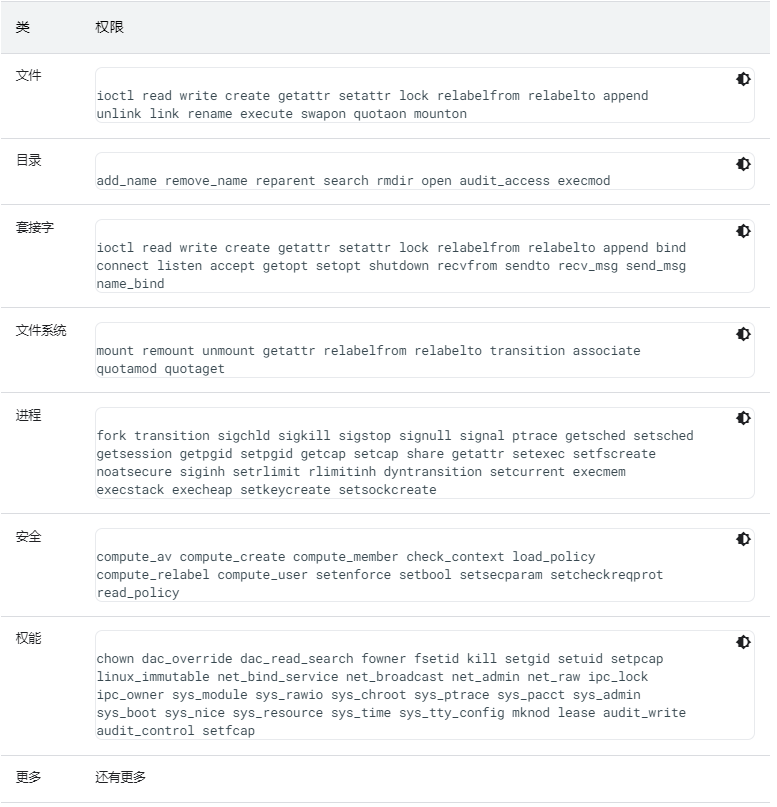

> 本篇主要讲述Android SELinux的基本概念，包含类型、属性、规则，Sepolicy的核心模块、关键文件，SELinux配置的步骤、调试验证方法等。

# 1. 概述

## 1.1. 概念

> 作为Android安全模型的一部分，Android使用安全增强型Linux(SELinux)对所有进程强制执行强制访问控制(MAC)，甚至包括以Root/超级用户权限运行的进程（Linux功能）。借助SELinux，Android可以更好地保护和限制系统服务、控制对应用数据和系统日志的访问、降低恶意软件的影响，并保护用户免遭移动设备上的代码可能存在的缺陷的影响。

SELinux按照默认拒绝的原则运行：任何未经明确允许的行为都会被拒绝。**SELinux可按两种全局模式运行：**

+ 宽容模式：权限拒绝事件会被记录下来，但不会被强制执行（仅记录但不强制执行SELinux安全政策）
+ 强制模式：权限拒绝事件会被记录下来并强制执行。（强制执行并记录安全政策。如果失败，则显示为EPERM错误）

在选择强制执行级别时只能二择其一，您的选择将决定您的政策是采取操作，还是仅允许您收集潜在的失败事件。宽容模式在实现过程中尤其有用。

***

## 1.2. MAC和DAC

**安全增强型Linux(SELinux)**是适用于Linux操作系统的`强制访问控制(MAC)系统`。

作为MAC系统，它与Linux中用户非常熟悉的`自主访问控制(DAC)系统`不同。在DAC系统中，存在所有权的概念，即特定资源的所有者可以控制与该资源关联的访问权限。这种系统通常比较粗放，并且容易出现无意中提权的问题。MAC系统则会在每次收到访问请求时都先咨询核心机构，再做出决定。

***

## 1.3. 类型、属性和规则(te)

> Android依靠SELinux的类型强制执行(TE)组件来实施其政策。这表示所有对象（例如文件、进程或套接字）都具有相关联的类型。例如，**默认情况下，应用的类型为untrusted_app**。**对于进程而言，其类型也称为域**。**可以使用一个或多个属性为类型添加注解。属性可用于同时指代多种类型**。

对象会映射到类（例如文件、目录、符号链接、socket套接字），并且每个类的不同访问权限类型由权限表示。

例如，file类存在权限open。虽然类型和属性作为Android SELinux政策的一部分会进行定期更新，但权限和类是静态定义的，并且作为新Linux版本的一部分也很少进行更新。

政策规则采用以下格式：`allow source target:class permissions;`，其中：

+ source - 规则主题的类型（或属性）。谁正在请求访问权限？
+ 目标 - 对象的类型（或属性）。对哪些内容提出了访问权限请求？
+ 类 - 要访问的对象（例如，文件、套接字）的类型
+ 权限 - 要执行的操作（或一组操作，例如读取、写入）

***

**规则的一个示例如下：**这表示应用可以读取和写入带有`app_data_file`标签的文件。还有其他应用类型。例如，isolated_app用于清单中含有`isolatedProcess=true`的应用服务。

`allow untrusted_app app_data_file:file { read write };`

**Android对涵盖应用的所有类型使用名为appdomain的属性，而不是对这两种类型重复同一规则：**

```shell
# Associate the attribute appdomain with the type untrusted_app.
typeattribute untrusted_app, appdomain;

# Associate the attribute appdomain with the type isolated_app.
typeattribute isolated_app, appdomain;

allow appdomain app_data_file:file { read write };
```

当编写的规则指定了某个属性名称时，该名称会自动扩展为列出与该属性关联的所有域或类型。一些重要属性包括：

+ domain - 与所有进程类型相关联的属性
+ file_type - 与所有文件类型相关联的属性

***

### 1.3.1. 宏的使用

特别是对于文件访问权限，有很多种权限需要考虑。例如，read权限不足以打开相应文件或对其调用stat。**为了简化规则定义，Android提供了一组宏来处理最常见的情况**

例如，若要添加open等缺少的权限，可以将上述规则改写为：

```shell
allow appdomain app_data_file:file rw_file_perms;
```

**查看实用宏的更多示例：**
+ system/sepolicy/public/global_macros
+ system/sepolicy/public/te_macros

尽可能使用宏，以降低因相关权限被拒而导致失败的可能性。定义类型后，需要将其与所代表的文件或进程相关联。

***

## 1.4. 安全上下文和类别（file_contexts）

调试SELinux政策或为文件添加标签时（通过`file_contexts`或运行`ls -Z`），可能会遇到安全上下文（也称为标签）。

例如`u:r:untrusted_app:s0:c15,c256,c513,c768`。安全上下文的格式为：`user:role:type:sensitivity[:categories]`。

通常可以忽略上下文的`user、role和sensitivity`字段。

**从Android S开始，类别被用于：**

+ 分隔应用数据，使其不被其他应用访问。
+ 分隔不同实际用户的应用数据。

### 1.4.1. file_contexts解释说明

`oem_lock                                  u:object_r:oem_lock_service:s0`

**说明如下：**

+ oem_lock：系统中具体资源，如服务名、设备名、文件目录等
+ u: selinux中唯一的用户
+ object_r:描述资源类型。r为进程资源，object_r非进程资源
+ oem_lock_service：资源在权限规则中所属代表
+ s0：selinux中权限级别，一般使用s0

***

## 1.5. te文件内容的语法规则

`rule_name  source_type  target_type : class perm_set`

+ rule_name：赋予权限的规则，包含allow、dontaudit、auditallow、neverallow，命令不可以随意添加。
+ source_type：访问target_type的主体或主体集合（域），可自定义
+ target_type：接受主体访问的客体或客体集合（域），可自定义
+ class：客体资源类型，不同的资源类型具有不同访问权限，可自定义、可继承
+ perm_set：客体予以主体的权限说明。是class中具有的权限的子集

**source_type、target_type使用type、typeattribute、attribute定义**

+ attribute定义一个代表具有某种相中属性的集合（即域）：`attribute dev_type;`
+ type定义代表一个或一类资源类型，并分配至不同属性（域）中：

```shell
# 定义一个类型，属于dev_type属性
type ttyMT_device, dev_type; 

###############以上定义可以拆分为两部分
# 仅定义一个类型
type ttyMT_device；
# 仅把ttyMT_device类型关联到dev_type属性
typeattribute ttyMT_device dev_type；
```

+ 属性间使用逗号，一个类型可以关联至多个属性：`type oem_lock_service, system_api_service, system_server_service, service_manager_type;`
+ class字段使用comm和class定义，comm定义的class可以被class定义的对象继承

```shell
common file {
	ioctl read write create getattr setattr lock relabelfrom relabelto
	append unlink link rename execute swapon quotaon mounton
}
```

**class类型继承comm类型：**

```shell
class dir
inherits file
{
	add_name
	remove_name
	reparent
	search
	rmdir
	open
	audit_access
	execmod
}
```

***

## 1.6. 注意点

Android并不会使用SELinux提供的所有功能。注意以下几点：

+ AOSP中的大部分政策都是使用内核政策语言定义的。在使用通用中间语言(CIL)时，会存在一些例外情况
+ 不使用SELinux用户。唯一定义的用户是`u`。必要时，系统会使用安全上下文的类别字段表示实际用户
+ 不使用SELinux角色和基于角色的访问权限控制 (RBAC)。定义并使用了两个默认角色：`r（适用于主题）`和`object_r（适用于对象）`
+ 不使用SELinux敏感度。已始终设置好默认的`s0`敏感度
+ 不使用SELinux布尔值。一旦设备政策构建完成，该政策不再取决于设备状态。这简化了政策的审核和调试过程

***

# 2. SElinux实现

## 2.1. SElinux核心模块

> Android的SElinux可以阅读`system/sepolicy`目录中的文件。这些文件在编译后会包含SELinux内核安全政策，并涵盖上游Android操作系统

通常情况下，不能直接修改`system/sepolicy`文件，但可以添加或修改自己的设备专用政策文件（位于`/device/manufacturer/device-name/sepolicy`目录中）。在Android 8.0及更高版本中，对这些文件所做的更改只会影响供应商目录中的政策。

**无论是哪个Android版本，都仍需要修改以下文件：**

### 2.1.1. SElinux相关模块

**SELinux 的构建逻辑位于以下文件中：**
+ external/selinux：外部SELinux项目，用于构建HOST命令行实用工具以编译SELinux政策和标签
+ + external/selinux/libselinux：Android仅使用外部libselinux项目的一个子集，以及一些Android专用自定义内容（参阅external/selinux/README.android了解详情）
+ + external/selinux/libsepol：
+ + + chkcon：确定安全环境对指定的二进制政策（主机可执行文件）是否有效
+ + + libsepol：用于操控二进制安全政策（主机静态/共享库、目标静态库）的 SELinux 库
+ + external/selinux/checkpolicy：SELinux 政策编译器（主机可执行文件：checkpolicy、checkmodule和dispol）。依赖于libsepol
+ system/sepolicy：核心Android SELinux政策配置，包括上下文和政策文件。主要sepolicy构建逻辑也位于此处 (system/sepolicy/Android.mk)

***

## 2.2. SElinux关键文件

### 2.2.1. 上下文的描述文件（*_contexts）

> 可以在上下文的描述文件中为需要的对象指定标签

+ file_contexts：用于为文件分配标签，并且可供多种用户空间组件使用。在创建新政策时，需创建或更新该文件，以便为文件分配新标签。如需应用新的file_contexts，需重新构建文件系统映像，或对要重新添加标签的文件运行`restorecon`（比如重新加载权限`restorecon -R /（对应权限目录）`）。在升级时，对`file_contexts`所做的更改会在升级过程中自动应用于系统和用户数据分区。此外，还可以通过以下方式使这些更改在升级过程中自动应用于其他分区：在以允许读写的方式装载相应分区后，将`restorecon_recursive`（重载权限）调用添加到`init.board.rc`文件中
+ property_contexts：用于为Android系统属性分配标签，以便控制哪些进程可以设置这些属性。在启动期间，init进程会读取此配置
+ service_contexts：用于为`Android Binder服务`分配标签，以便控制哪些进程可以为相应服务添加（注册）和查找（查询）Binder引用。在启动期间，`servicemanager`进程会读取此配置
+ genfs_contexts：用于为不支持扩展属性的文件系统（例如，`proc`或`vfat`）分配标签。此配置会作为内核政策的一部分进行加载，但更改可能对`内核inode`无效。要全面应用更改，需要重新启动设备，或卸载并重新装载文件系统。此外，通过使用`context=mount`选项，还可以为装载的特定系统文件（例如`vfat`）分配特定标签
+ seapp_contexts：用于为**应用进程和/data/data目录**分配标签。在每次应用启动时，zygote进程都会读取此配置；在启动期间，installd会读取此配置
+ mac_permissions.xml：用于根据应用签名和应用软件包名称（后者可选）为应用分配seinfo标记。随后，分配的seinfo标记可在`seapp_contexts`文件中用作密钥，以便为带有该seinfo标记的所有应用分配特定标签。在启动期间，system_server会读取此配置

**简单来说：**
+ file_contexts //系统中所有file_contexts安全上下文
+ seapp_contexts //app安全上下文
+ property_contexts //属性的安全上下文
+ service_contexts    //service文件安全上下文
+ genfs_contexts //虚拟文件系统安全上下文


***

#### 2.2.1.1. 文件上下文file_contexts

**Android8.0针对file_contexts引入了以下更改：**

+ 为了避免启动期间在设备上产生额外的编译开销，file_contexts不再以二进制文件形式存在。而是可读的正则表达式文本文件，例如{property,service}_contexts（和7.0之前的版本一样）
+ file_contexts拆分成了两个文件：
+ + plat_file_contexts
+ + + Android平台file_context，没有设备专用标签，例外情况是，必须准确标记/vendor分区的某些部分，以确保sepolicy文件正常运行
+ + + 必须位于设备上system分区中的`/system/etc/selinux/plat_file_contexts`下，并由init在启动时加载（与供应商file_context一起加载）
+ + vendor_file_contexts
+ + + 设备专用file_context，通过合并file_contexts（位于设备的Boardconfig.mk文件中由BOARD_SEPOLICY_DIRS指向的目录下）进行构建
+ + + 必须安装到vendor分区中的`/vendor/etc/selinux/vendor_file_contexts`下，并由init在启动时加载（与平台file_context一起加载）

***

#### 2.2.1.2. 属性上下文property_contexts

**在Android8.0中，property_contexts拆分成了两个文件：**

+ plat_property_contexts
+ + 没有设备专用标签的Android平台property_context
+ + 必须位于system分区中的`/system/etc/selinux/plat_property_contexts`下，并由init在启动时加载（与供应商property_contexts一起加载）
+ vendor_property_contexts
+ + 设备专用property_context，通过合并property_contexts（位于设备的Boardconfig.mk文件中由BOARD_SEPOLICY_DIRS指向的目录下）进行构建
+ + 必须位于vendor分区中的`/vendor/etc/selinux/vendor_property_contexts`下，并由init在启动时加载（与平台property_context一起加载）

***

#### 2.2.1.3. 服务上下文service_contexts

**在Android8.0中，service_contexts拆分成了以下文件：**

+ plat_service_contexts
+ + servicemanager的Android平台专用service_context。service_context没有设备专用标签
+ + 必须位于system分区中的`/system/etc/selinux/plat_service_contexts`下，并由servicemanager在启动时加载（与供应商service_contexts一起加载）
+ vendor_service_contexts
+ + 设备专用service_context，通过合并service_contexts（位于设备的Boardconfig.mk文件中由BOARD_SEPOLICY_DIRS指向的目录下）进行构建
+ + 必须位于vendor分区中的`/vendor/etc/selinux/vendor_service_contexts`下，并由servicemanager在启动时加载（与平台service_contexts一起加载）
+ + 虽然servicemanager会在启动时查找此文件，但对于完全兼容的TREBLE设备，vendor_service_contexts绝不能存在。这是因为，vendor和system进程之间的所有交互都必须通过hwservicemanager/hwbinder发生
+ plat_hwservice_contexts
+ + hwservicemanager的Android平台hwservice_context（没有设备专用标签）
+ + 必须位于system分区中的`/system/etc/selinux/plat_hwservice_contexts`下，并由hwservicemanager在启动时加载（与vendor_hwservice_contexts一起加载）
+ vendor_hwservice_contexts
+ + 设备专用hwservice_context，通过合并hwservice_contexts（位于设备的Boardconfig.mk文件中由BOARD_SEPOLICY_DIRS指向的目录下）进行构建
+ + 必须位于vendor分区中的`/vendor/etc/selinux/vendor_hwservice_contexts`下，并由hwservicemanager在启动时加载（与plat_service_contexts一起加载）
+ vndservice_contexts
+ + vndservicemanager的设备专用service_context，通过合并vndservice_contexts（位于设备的Boardconfig.mk中由BOARD_SEPOLICY_DIRS指向的目录下）进行构建
+ + 此文件必须位于vendor分区中的`/vendor/etc/selinux/vndservice_contexts`下，并由vndservicemanager在启动时加载

***

#### 2.2.1.4. Seapp 上下文seapp_contexts

**在Android8.0中，seapp_contexts拆分成了两个文件：**

+ plat_seapp_contexts
+ + 没有设备专用更改的Android平台seapp_context
+ + 必须位于system分区中的`/system/etc/selinux/plat_seapp_contexts.`下
+ vendor_seapp_contexts
+ + 平台seapp_context的设备专用扩展，通过合并seapp_contexts（位于设备的Boardconfig.mk文件中由`BOARD_SEPOLICY_DIRS`指向的目录下）进行构建
+ + 必须位于vendor分区中的`/vendor/etc/selinux/vendor_seapp_contexts`下

***

#### 2.2.1.5. MAC权限mac_permissions

**在Android8.0中，mac_permissions.xml拆分成了两个文件：**

+ 平台mac_permissions.xml
+ + 没有设备专用更改的Android平台mac_permissions.xml。
+ + 必须位于system分区中的`/system/etc/selinux/.`下。
+ 非平台mac_permissions.xml
+ + 平台mac_permissions.xml的设备专用扩展，通过mac_permissions.xml（位于设备的Boardconfig.mk文件中由BOARD_SEPOLICY_DIRS指向的目录下）进行构建
+ + 必须位于vendor分区中的`/vendor/etc/selinux/.`下

***

### 2.2.2. BoardConfig.mk makefile引用

> 修改或添加政策文件和上下文的描述文件后，需要更新`/device/manufacturer/device-name/BoardConfig.mk`makefile以引用sepolicy子目录和每个新的政策文件

```shell
# 引用目录
BOARD_SEPOLICY_DIRS += \
        <root>/device/manufacturer/device-name/sepolicy

# 单独引用
BOARD_SEPOLICY_UNION += \
        genfs_contexts \
        file_contexts \
        sepolicy.te
```

***

## 2.3. 实现步骤

### 2.3.1. 内核启用SElinux

配置`CONFIG_SECURITY_SELINUX=y`（例如kernel/msm-5.4/kernel/configs/android-base.config）

### 2.3.2. 更改kernel_cmdline参数（配置修改为permissive）

配置`BOARD_KERNEL_CMDLINE := androidboot.selinux=permissive`

**仅适用于初始制定设备政策的情况。在拥有初始引导程序政策后，请移除此参数，以便将设备恢复强制模式，否则设备将无法通过CTS验证**

### 2.3.3. 宽容模式启动系统查看所需权限

+ 在Ubuntu 14.04或更高版本中，请运行以下命令：

`adb shell su -c dmesg | grep denied | audit2allow -p out/target/product/BOARD/root/sepolicy`

+ 在 Ubuntu 12.04 中，请运行以下命令：

```shell
adb pull /sys/fs/selinux/policy
adb logcat -b all | audit2allow -p policy
```

***

### 2.3.4. 评估警告的输出

评估与以下内容类似的警告的输出：`init: Warning! Service name needs a SELinux domain defined; please fix!`

### 2.3.5. 标识设备以及需要添加标签的其他新文件

### 2.3.6. 配置对象使用现有标签或新标签

查看`*_contexts`文件，了解之前是如何为内容添加标签的，然后根据对标签含义的了解分配一个新标签。

这个标签最好是能够融入到政策中的现有标签，但有时也需要使用新标签，而且还需要提供关于访问该标签的规则。将标签添加到相应的上下文的描述文件中

### 2.3.7. 标识应该拥有自己的安全域的域/进程

可能需要为每一项分别编写一个全新的政策。例如，从`init`衍生的所有服务都应该有自己的安全域。以下命令有助于查看保持运行的服务（不过所有服务都需要如此处理）：

```shell
adb shell su -c ps -Z | grep init
adb shell su -c dmesg | grep 'avc: '
```

***

### 2.3.8. 查看init.device.rc发现没有域类型的域

在开发过程早期为其提供相应的域，以避免向init添加规则或将init访问权限与其自身政策中的访问权限混淆

**通常会为指定的项目新建定义rc文件作一些操作，比如chmod、chown权限赋予、创建文件夹、启动service、重载selinux权限等等**

***

### 2.3.9. 设置BOARD_CONFIG.mk

设置BOARD_CONFIG.mk以使用`BOARD_SEPOLICY_*`变量（通常不需要修改）

### 2.3.10. 检查init.device.rc和fstab.device文件

确保每一次使用mount都对应一个添加了适当标签的文件系统，或者指定了`context= mount`选项

***

### 2.3.11. 查看每个拒绝事件

查看每个拒绝事件，并创建SELinux政策来妥善处理每个拒绝事件

实际进行权限修复修改

***

# 3. 自定义SELinux

> 集成基本级别的SELinux功能并全面分析结果后，可以添加自己的政策设置，以便涵盖对Android操作系统所做的自定义。这些政策必须仍然满足Android兼容性计划的要求，并且不得移除默认的 SELinux设置

> 制造商不得移除现有的SELinux政策，否则可能会破坏Android SELinux的实施方式及其管控的应用。这包括可能需要改进以遵守政策并正常运行的第三方应用。应用必须无需任何修改即可继续在启用了SELinux的设备上正常运行

## 3.1. 注意点

**当开始自定义SELinux时，需注意：**

+ 为所有新的守护进程编写SELinux政策
+ 尽可能使用预定义的域
+ 为作为init服务衍生的所有进程分配域
+ 在编写政策之前先熟悉相关的宏
+ 向AOSP提交对核心政策进行的更改

+ 不得创建不兼容的政策
+ 不得允许对最终用户政策进行自定义
+ 不得允许对移动设备管理 (MDM) 政策进行自定义
+ 不得恐吓违反政策的用户
+ 不得添加后门程序

## 3.2. 操作步骤

如果要自定义SELinux设置，则应格外谨慎，以免破坏现有应用。要开始使用，请按下列步骤操作：

1. 使用最新的Android内核
2. 采用最小权限原则
3. 仅针对Android需要添加的内容调整SELinux政策。默认政策能够自动适用于Android开源项目代码库
4. **将各个软件组件拆分成多个负责执行单项任务的模块**（按模块、架构合理有效的划分sepolicy的配置）
5. 创建将这些任务与无关功能隔离开来的 SELinux 政策
6. 将这些政策放在`/device/manufacturer/device-name/sepolicy`目录中的`*.te`文件内（`te`是SELinux政策源代码文件使用的扩展名），然后使用`BOARD_SEPOLICY`变量将它们纳入到的build编译中
7. 先将新域设为宽容域。为此，可以在该域的`.te`文件中使用宽容声明（调试手法）
8. 分析结果并优化域定义
9. 当userdebug版本中不再出现拒绝事件时，移除宽容声明（**将模式从宽容模式切换成强制模式**）

***

## 3.3. 声明宏编写示例

> SELinux基于M4计算机语言，因此支持多种有助于节省时间的宏。

在以下示例中，所有域都被授予向`/dev/null`读写数据(write)的权限以及从`/dev/zero`读取数据(read)的权限

```shell
# Allow read / write access to /dev/null
allow domain null_device:chr_file { getattr open read ioctl lock append write};

# Allow read-only access to /dev/zero
allow domain zero_device:chr_file { getattr open read ioctl lock };
```

**从`system/sepolicy/public/global_macros`看到宏定义：**

```shell
define(`x_file_perms', `{ getattr execute execute_no_trans map }')
define(`r_file_perms', `{ getattr open read ioctl lock map watch watch_reads }')
define(`w_file_perms', `{ open append write lock map }')
define(`rx_file_perms', `{ r_file_perms x_file_perms }')
define(`ra_file_perms', `{ r_file_perms append }')
define(`rw_file_perms', `{ r_file_perms w_file_perms }')
define(`rwx_file_perms', `{ rw_file_perms x_file_perms }')
```

**可以使用宏编写替代，简短的编写权限：**

```shell
# Allow read / write access to /dev/null
allow domain null_device:chr_file rw_file_perms;

# Allow read-only access to /dev/zero
allow domain zero_device:chr_file r_file_perms;
```

***

## 3.4. 自定义权限示例及分析

```shell
# 类型声明，声明DHCP守护进程将沿用基本的安全政策 (domain)
type dhcp, domain;
# DHCP 被声明为宽容域（后面调试成功后需去除）
permissive dhcp;
type dhcp_exec, exec_type, file_type;
type dhcp_data_file, file_type, data_file_type;
# 该政策声明DHCP是从init衍生而来的，并且可以与其通信
init_daemon_domain(dhcp)
# 该政策允许DHCP使用net域中的常用网络功能，例如读取和写入TCP数据包、通过套接字进行通信，以及执行DNS请求
net_domain(dhcp)

......
# For /proc/sys/net/ipv4/conf/*/promote_secondaries
# 该政策声明DHCP可以向/proc中的特定文件写入数据。这一行显示了SELinux的详细文件标签
# 它使用proc_net标签来限定DHCP仅对/proc/sys/net中的文件具有写入权限
allow dhcp proc_net:file write;
......
# 描述了允许应用之间如何交互。
# 该政策声明DHCP和netd之间可通过文件描述符、FIFO 文件、数据报套接字以及UNIX信息流套接字进行通信。
# DHCP只能向数据报套接字和UNIX信息流套接字中读写数据，但不能创建或打开此类套接字
allow dhcp netd:fd use;
allow dhcp netd:fifo_file rw_file_perms;
allow dhcp netd:{ dgram_socket_class_set unix_stream_socket } { read write };
allow dhcp netd:{ netlink_kobject_uevent_socket netlink_route_socket
netlink_nflog_socket } { read write };
```

***

## 3.5. 常用可用权限列表



***

## 3.6. Android 8.0及更高版本SElinux存放位置变更

+ 在Android 7.0及更低版本中，设备制造商可以将政策添加到`BOARD_SEPOLICY_DIRS`，包括用来在不同设备类型之间增强AOSP政策的政策
+ 在Android 8.0及更高版本中，将政策添加到`BOARD_SEPOLICY_DIRS`会将该政策仅存放在供应商映像中

**在Android 8.0及更高版本中，政策位于AOSP中的以下位置：**

+ `system/sepolicy/public`:其中包括所导出的用于供应商特定政策的政策。所有内容都会纳入Android 8.0兼容性基础架构。公共政策会保留在不同版本上，因此可以在自定义政策的`/public`中添加任何内容。正因如此，可存放在`/public`中的政策类型的限制性更强。将此目录视为相应平台的已导出政策API：`处理/system与/vendor之间的接口的所有内容都位于这里`
+ `system/sepolicy/private`:包括系统映像正常运行所必需（但供应商映像政策应该不知道）的政策
+ `system/sepolicy/vendor`:包括位于`/vendor`但存在于核心平台树（非设备特定目录）中的组件的相关政策。这是构建系统区分设备和全局组件的软件工件；从概念上讲，这是下述设备专用政策的一部分
+ `device/manufacturer/device-name/sepolicy`:包含设备专用政策，以及对政策进行的设备自定义（在Android 8.0及更高版本中，该政策对应于供应商映像组件的相关政策）

在Android 11及更高版本中，`system_ext`和`product`分区还可以包含特定于分区的政策。`system_ext`和`product`政策也分为公共政策和私有政策，且供应商可以使用`system_ext`和`product`的公共政策（例如系统政策）

+ `SYSTEM_EXT_PUBLIC_SEPOLICY_DIRS`:包括所导出的用于供应商特定政策的政策。已安装到system_ext分区（**编译结果会存在system_ext/etc/selinux**）
+ `SYSTEM_EXT_PRIVATE_SEPOLICY_DIRS`:包括`system_ext`映像正常运行所必需（但供应商映像政策应该不知道）的政策。已安装到 system_ext分区（**编译结果会存在system_ext/etc/selinux**）
+ `PRODUCT_PUBLIC_SEPOLICY_DIRS`:包括所导出的用于供应商特定政策的政策。已安装到product分区（**主要针对packages/services的权限，编译结果在system/product/etc/selinux**）
+ `PRODUCT_PRIVATE_SEPOLICY_DIRS`:包括product映像正常运行所必需（但供应商映像政策应该不知道）的政策。已安装到product分区

**注意：**在使用system_ext和product公共政策时要格外小心。公共政策充当system_ext/product和vendor之间的导出API。合作伙伴应自行管理兼容性问题

***

# 4. SElinux存放位置


构建系统采用此策略并在相应分区上生成system、system_ext、product、vendor和odm策略组件。步骤包括：
1. 将策略转换成SELinux通用中间语言（CIL）格式，具体包含：
+ 公共平台册策略（system+system_ext+product）
+ 私人+公共政策相结合
+ 公共+供应商和BOARD_SEPOLICY_DIRS政策
2. 将公开提供的政策作为供应商政策的一部分进行版本控制。为此，使用生成的公共CIL政策向`公共+供应商+BOARD_SEPOLICY_DIRS`组合政策指明必须将哪些部分转换为将与平台政策相关联的属性
3. 创建将平台和供应商部分关联在一起的映射文件。最初，该文件只是将公共政策中的类型与供应商政策中对应的属性相关联；之后，该文件还为未来的平台版本中维护的文件提供依据，从而兼容以此平台版本作为目标版本的供应商政策
4. 合并政策文件（描述设备解决方案和预编译解决方案）
+ 合并映射政策、平台政策和供应商政策
+ 编译输出二进制政策文件

***

# 5. 特殊分区概念和权限

> 在Android 11及更高版本中，`system_ext`和`product`分区还可以包含特定于分区的政策。宏也会变更，替换原来的`BOARD_PLAT_PUBLIC_SEPOLICY_DIR`和`BOARD_PLAT_PRIVATE_SEPOLICY_DIR`

查看Android 12源码`/system/sepolicy/README`的说明：

```shell
SYSTEM_EXT_PUBLIC_SEPOLICY_DIRS += device/acme/roadrunner-sepolicy/systemext/public
SYSTEM_EXT_PRIVATE_SEPOLICY_DIRS += device/acme/roadrunner-sepolicy/systemext/private
PRODUCT_PUBLIC_SEPOLICY_DIRS += device/acme/roadrunner-sepolicy/product/public
PRODUCT_PRIVATE_SEPOLICY_DIRS += device/acme/roadrunner-sepolicy/product/private

The old BOARD_PLAT_PUBLIC_SEPOLICY_DIR and BOARD_PLAT_PRIVATE_SEPOLICY_DIR
variables have been deprecated in favour of SYSTEM_EXT_*.
```

> 从Android 11开始，system_ext和product分区可以将其指定的公共类型导出到vendor分区。

当system_ext和product分区基于同一平台版本N时，构建系统会生成到`system_ext/etc/selinux/mapping/N.cil`和`product/etc/selinux/mapping/N.cil`的基本映射文件，其中包含从type到type_N的身份映射。vendor可以通过版本化属性type_N访问type


***

## 5.1. product分区概念

+ Android 11上，编译结果目录根目录有个product，但是里面除了etc没有其他文件，不会生成镜像；在system也有product，里面存在实际结果文件（含build.prop）
+ Android 12上，编译结果目录根目录没有product；在system也有product，里面存在实际结果文件（不包含build.prop）

**使用以下编译标记向 product 分区中安装模块：**
+ Android.bp 中的 product_specific: true
+ Android.mk 中的 LOCAL_PRODUCT_MODULE := true

## 5.2. system_ext分区

+ Android 11上（未开启动态分区），编译结果目录根目录有个system_ext，但是里面除了etc没有其他文件，不会生成镜像；在system也有system_ext，里面存在实际结果文件（含build.prop）
+ Android 12上（开启动态分区），编译结果目录根目录有system_ext，并且会生成system_ext.img镜像，但是分区大小配置是同system一起；在system也有system_ext，但是是软链接链接到根目录的system_ext

**使用以下编译标记向system_ext分区中安装模块：**（宏的源码参阅`build\soong\androidmk\androidmk\android.go`）
+ Android.bp中配置 system_ext_specific: true，就将编译到 system\system_ext\ 中
+ Android.mk 中配置 LOCAL_SYSTEM_EXT_MODULE := true，就将编译到 system\system_ext\ 中；`LOCAL_PRIVILEGED_MODULE := true` 决定在 priv-app 文件中，不加` LOCAL_PRIVILEGED_MODULE` 则编译到 system\system_ext\app\

***

# 6. SElinux验证调试方法

## 6.1. 读取avc denied拒绝事件

> 检查是否有错误，错误会以事件日志的形式传给dmesg和logcat，并可在设备上从本地查看。
> 
> 制造商应先检查这些设备上传给dmesg的SELinux输出并优化设置，然后再在宽容模式下公开发布，最后切换到强制模式。
> 
> SELinux日志消息中包含“avc:”字样，因此可使用grep找到。可以通过运行`cat/proc/kmsg`来获取当前的拒绝事件日志，也可以通过运行`cat/sys/fs/pstore/console-ramoops`来获取上次启动时的拒绝事件日志。

根据这些输出内容，制造商可以轻松发现系统用户或组件违反SELinux政策的行为。然后，制造商便可更改相应软件和/或SELinux政策，以防范此类恶意行为。

### 6.1.1. avc示例一

```shell
avc: denied  { connectto } for  pid=2671 comm="ping" path="/dev/socket/dnsproxyd"
scontext=u:r:shell:s0 tcontext=u:r:netd:s0 tclass=unix_stream_socket
```

**解读如下：**

+ 上方的`{connectto}`表示执行的操作。根据它和末尾的`tclass(unix_stream_socket)`，可以大致了解是对什么对象执行什么操作。在此例中，是操作方正在试图连接到UNIX信息流套接字
+ `scontext(u:r:shell:s0)`表示发起相应操作的环境，在此例中是shell中运行的某个程序
+ `tcontext(u:r:netd:s0)`表示操作目标的环境，在此例中是归netd所有的某个`unix_stream_socket`
+ 顶部的`comm="ping"`可了解拒绝事件发生时正在运行的程序。在此示例中，给出的信息非常清晰明了

***

### 6.1.2. avc示例二

```shell
<5> type=1400 audit: avc:  denied  { read write } for  pid=177
comm="rmt_storage" name="mem" dev="tmpfs" ino=6004 scontext=u:r:rmt:s0
tcontext=u:object_r:kmem_device:s0 tclass=chr_file
```

**以下是此拒绝事件的关键元素：**

+ 操作 - 试图进行的操作会使用括号突出显示：read write 或 setenforce
+ 操作方 - scontext（来源环境）条目表示操作方；在此例中为 rmt_storage 守护程序
+ 对象 - tcontext（目标环境）条目表示对哪个对象执行操作；在此例中为 kmem
+ 结果 - tclass（目标类别）条目表示操作对象的类型；在此例中为 chr_file（字符设备）

***

## 6.2. 转储用户和内核堆栈

> 在某些情况下，事件日志中包含的信息不足以查明拒绝事件的来源。通常，获取调用链（包括内核和用户空间）有助于更好地了解发生拒绝事件的原因。
> 
> 最新的内核定义了一个名为 avc:selinux_audited 的跟踪点。使用`Android simpleperf`可启用此跟踪点并获取调用链。

**支持的配置：**
+ 支持5.10及更高版本的Linux内核（尤其是Android通用内核分支`mainline`和`android12-5.10`），也支持android12-5.4分支。可以使用simpleperf来确定您的设备上是否定义了跟踪点：`adb root && adb shell simpleperflist|grep avc:selinux_audited`
+ 应该可以重现正在调试的事件。使用Simpleperf时不支持启动时间事件；不过，您仍然可以重启服务以触发事件

***

### 6.2.1. simpleperf抓取调用堆栈链

> 调用链是一个统一的内核和用户空间调用链，可发起跟踪从用户空间直到内核中发生拒绝事件的位置，更好地查看代码流

**获取调用链：**

第一步是使用`simpleperf record`录制事件：`adb shell -t "cd /data/local/tmp && su root simpleperf record -a -g -e avc:selinux_audited"`

第二步应触发导致拒绝事件的事件。之后，应停止录制。在此例中应使用`Ctrl-c`获取样本：`^Csimpleperf I cmd_record.cpp:751] Samples recorded: 1. Samples lost: 0.`

最后，可使用`simpleperf report`检查获取的堆栈轨迹。 例如：

```shell
adb shell -t "cd /data/local/tmp && su root simpleperf report -g --full-callgraph"
[...]
Children  Self     Command  Pid   Tid   Shared Object                                   Symbol
100.00%   0.00%    dmesg    3318  3318  /apex/com.android.runtime/lib64/bionic/libc.so  __libc_init
       |
       -- __libc_init
          |
           -- main
              toybox_main
              toy_exec_which
              dmesg_main
              klogctl
              entry_SYSCALL_64_after_hwframe
              do_syscall_64
              __x64_sys_syslog
              do_syslog
              selinux_syslog
              slow_avc_audit
              common_lsm_audit
              avc_audit_post_callback
              avc_audit_post_callback
```

***

## 6.3. 切换宽容模式（permissive）

> 生产设备不支持宽容模式。CTS 测试会确认是否已启用强制模式
> 
> SELinux强制模式可以在`userdebug或eng build`中通过ADB停用。运行以下命令：

```shell
adb root
# 获取模式
adb shell getenforce
# 设置模式
# 0--代表Permissive
# 1--代表Enforcing
adb shell setenforce 0

# 查看进程的sContext
ps -Z

# 查看文件权限
ls -Z
```

或在内核命令行中输入以下命令（适用于设备开发初期）：

```shell
androidboot.selinux=permissive
androidboot.selinux=enforcing
```

**或使用Android 12中的bootconfig功能：**

···shell
androidboot.selinux=permissive
androidboot.selinux=enforcing
···

***

## 6.4. audit2allow自动生成权限工具

> audit2allow工具可以获取dmesg拒绝事件并将其转换成相应的SELinux政策声明。因此，该工具有助于大幅加快SELinux开发速度
> 
> AOSP不再提供audit2allow。需要使用Linux发行版提供的软件包（Debian和Ubuntu上为`policycoreutils-python-utils`软件包）

可以使用linux原生工具，将log输入到log.txt文件，然后执行：

`cat log.txt | grep avc | audit2allow`

或者

`audit2allow -i log.txt`

**例如：**

```shell
$ cat log.txt 
avc: denied  { connectto } for  pid=2671 comm="ping" path="/dev/socket/dnsproxyd" scontext=u:r:shell:s0 tcontext=u:r:netd:s0 tclass=unix_stream_socket

$ audit2allow -i log.txt 
#============= shell ==============
allow shell netd:unix_stream_socket connectto;
```

***

### 6.4.1. 实时日志生成权限

**在设备运行时，执行以下命令：**

```shell
adb pull /sys/fs/selinux/policy
adb logcat -b events -d | audit2allow -p policy
```

**注意：**运行这些命令不会更改bugreport.txt，因为所有日志都已经存在，包括上次重新启动之前存在的日志。在设备进行OTA更新或向设备刷入开发版系统时，新旧违规行为会混杂在一起，直到下一次重新启动为止。如需解决此问题，需重新启动设备，或者从错误报告中滤除`console-ramoops`和`LAST_LOGCAT`

**例如本地测试执行结果：**

```shell
~/Documents/temp$ adb pull sys/fs/selinux/policy
sys/fs/selinux/policy: 1 file pulled, 0 skipped. 3.7 MB/s (502496 bytes in 0.128s)

~/Documents/temp$ adb logcat -b events -d|audit2allow -p policy 
#============= hal_vehicle_default ==============
allow hal_vehicle_default sysfs:file getattr;

#============= init-insmod-sh ==============
allow init-insmod-sh debugfs:file setattr;

#============= start_natp ==============
allow start_natp unlabeled:dir search;

#============= system_server ==============
allow system_server idmap_exec:file execute;

#============= webview_zygote ==============
allow webview_zygote app_data_file:dir getattr;
```

**不过，必须仔细审核要添加到政策中的条目，以免出现权限过宽的情况。**
例如，如果将上面示例的`rmt_storage`拒绝事件输入到audit2allow中，会生成以下SELinux政策声明建议：

```shell
#============= shell ==============
allow shell kernel:security setenforce;
#============= rmt ==============
allow rmt kmem_device:chr_file { read write };
```

**注意点：这会授予rmt向内核内存写入内容的权限，从而形成明显的安全漏洞。**通常情况下，audit2allow给出的声明建议只是一个大致的基础。
在添加这些声明后，可能需要更改来源域和目标标签，并纳入适当的宏，才能实现良好的政策配置。有时，应对拒绝事件的合理方式不是更改政策，而是更改违规的应用。

***

## 6.5. 新服务模块添加权限

> 通过init启动的服务需要在各自的SELinux域中运行。以下示例会将服务“foo”放入它自己的SELinux网域中并为其授予权限。

该服务是在设备的`init.device.rc`文件中启动的，如下所示：

```shell
service foo /system/bin/foo
    class core
```

1.创建一个新网域“foo”：创建包含以下内容的文件`device/manufacturer/device-name/sepolicy/foo.te`：

**这是foo SELinux网域的初始模板，可以根据该可执行文件执行的具体操作为该模板添加规则**

```shell
# foo service
type foo, domain;
type foo_exec, exec_type, file_type;

init_daemon_domain(foo)
```

2.为`/system/bin/foo`添加标签:将以下内容添加到`device/manufacturer/device-name/sepolicy/file_contexts：`

**这可确保为该可执行文件添加适当的标签，以便SELinux在适当的网域中运行相应服务**

`/system/bin/foo   u:object_r:foo_exec:s0`

3.构建并刷写启动映像和系统映像。
4.优化相应域的SELinux规则：根据拒绝事件确定所需的权限。audit2allow工具提供了一些实用的指南，但该工具仅适用于提供编写政策时所需的信息。切勿只是复制输出内容。

***

## 6.6. 授予dac_override权能

> dac_override拒绝事件意味着违规进程正在尝试使用错误的`unix user/group/world`权限访问某个文件。
> 正确的解决方案几乎从不授予dac_override权限，而是更改相应文件或进程的unix权限。有些网域（例如 init、vold 和 installd）确实需要能够替换 unix文件权限才能访问其他进程的文件。

***

# 7. 参考

+ [Google官方文档SElinux-繁体](https://source.android.google.cn/docs/security/features/selinux)
+ [程序员大本营Selinux](https://www.pianshen.com/article/6549296922/)
+ [Android编译product分区](https://www.cnblogs.com/onelikeone/p/11556427.html)
+ [Android11(R)system_ext分区system_ext_specific属性](https://blog.csdn.net/u012932409/article/details/111322248)
+ [Android SELinux 权限问题处理](https://blog.csdn.net/jgw2008/article/details/123150350)
