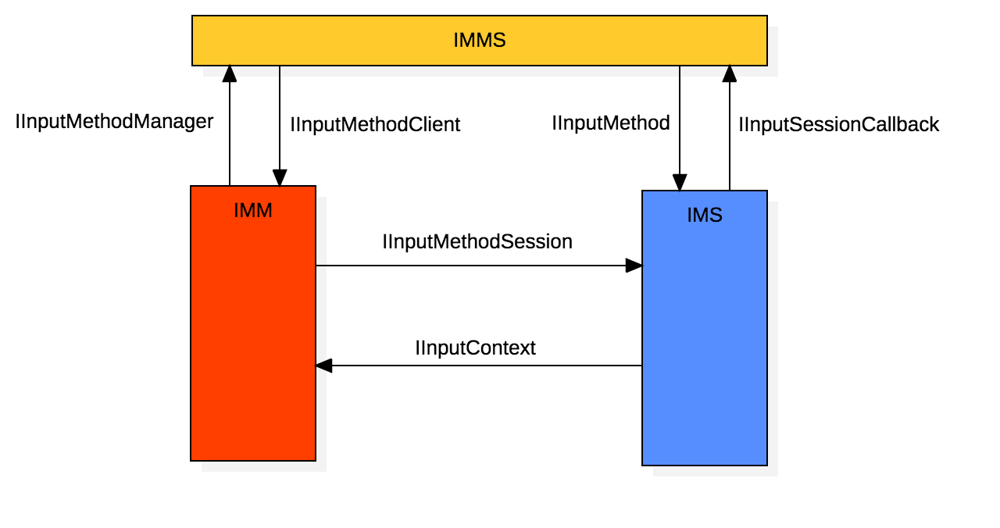
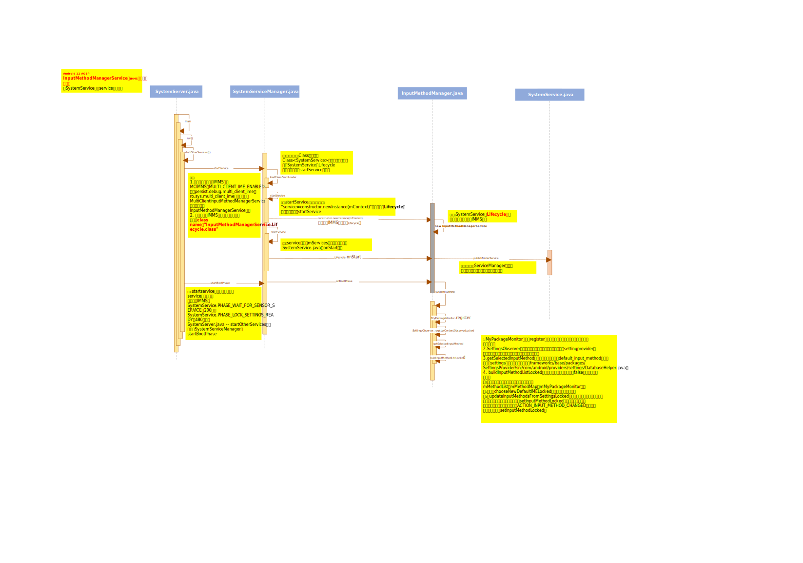

> 阅读Android AOSP 12版本代码，对输入法IME整体框架模块进行学习梳理，内容包含输入法框架三部分IMM、IMMS、IMS的启动流程、点击弹出流程、显示/隐藏流程，以及常见问题和调试技巧。

***

# 1. IME整体框架

> IME整体分为三个部分：

## 1.1. 输入法客户端（IMM）

> **代码路径：**frameworks/base/core/java/android/view/inputmethod/

**主要指输入法框架的InputMethodManager, 每个app都一个实例, 用来和输入法控制端交互。运行在需要使用输入法的进程**

***

## 1.2. 输入法管理端（IMMS）

> **代码路径：**frameworks/base/services/core/java/com/android/server/inputmethod/

**主要指输入法框架的InputMethodManagerService, 运行在system_server进程，工作内容包含以下：**

+  输入法服务端的绑定
+  输入法服务端与输入法客户端的绑定
+  输入法启用/关闭
+  输入法显示/隐藏
+  切换输入法

***

## 1.3. 输入法服务端（IMS）

> **代码路径：**frameworks/base/core/java/android/inputmethodservice/

**主要指输入法框架的InputMethodService, 这是一个输入法服务, 真正实现输入法界面, 控制字符输入的地方。运行在输入法进程, 例如某狗输入法进程**

***

## 1.4. 子模块交互流程图

输入法的整体交互过程如下:

1. IMM利用IInputMethodManager请求IMMS
2. IMMS绑定输入法服务InputMethodService, 得到IInputMethod
3. IMMS请求IInputMethod创建交互IInputMethodSession
4. IMMS通过IInputMethodClient告知IMM IInputMethodSession
5. IMM和IMS通过IInputMethodSession和IInputContext交互



***

# 2. IME初始化启动流程

## 2.1. IME客户端（IMM）初始化流程

> 涉及代码文件路径：
> frameworks/base/core/java/android/view/ViewRootImpl.java
> frameworks/base/core/java/android/view/WindowManagerGlobal.java
> frameworks/base/core/java/android/view/inputmethod/InputMethodManager.java
> frameworks/base/core/java/com/android/internal/view/IInputMethodClient.aidl
> frameworks/base/core/java/com/android/internal/view/IInputContext.aidl
> frameworks/base/core/java/com/android/internal/view/IInputMethodManager.aidl
> frameworks/base/services/core/java/com/android/server/inputmethod/InputMethodManagerService.java

### 2.1.1. 函数流程梳理

```s
# 每次新增窗口window时，都会实例化ViewRootImpl，而ViewRootImpl在获取IWindowSession时会检查输入法是否已经初始化
ViewRootImpl.java -- 初始化构造函数，调用WindowManagerGlobal.getWindowSession()

---> WindowManagerGlobal.java -- getWindowSession()调用InputMethodManager.ensureDefaultInstanceForDefaultDisplayIfNecessary() 实例化全局调用InputMethodManager，即初始化IMM

---> InputMethodManager.java -- ensureDefaultInstanceForDefaultDisplayIfNecessary()调用forContextInternal(Display.DEFAULT_DISPLAY, Looper.getMainLooper())，入参默认displayID和looper
        # 此处也说明，对于APP层，IMM有且只有一个实例，每次创建ViewRootImpl都会检查IMM是否实例化完成
        ---》 调用forContextInternal函数，先从缓存Map中查询是否有IMM实例，如果没有则创建IMM实例，并添加到Map中
        ---》 调用createInstance创建实例，然后在三目运算中默认固定调用createRealInstance(displayId, looper)
        ---》 调用createRealInstance函数，   （1）获取输入法服务service，即Context.INPUT_METHOD_SERVICE（service是AIDL接口文件IInputMethodManager.aidl）；
                                            （2）new InputMethodManager(service, displayId, looper)创建实例
                                                    ---》 InputMethodManager构造函数
                                                    ---》 new IInputConnectionWrapper 创建虚拟的输入法上下文，主要用于监听输入法服务的激活状态，接受输入事件
                                             # 添加IMM实例到输入法service服务中
                                             # 此处两个入参都是AIDL接口类型的对象
                                             # （1）IInputMethodClient.aidl：输入法客户端, 主要用于报告输入法当前的状态, 让APP应用端的IMM做出相应的处理
                                             # （2）IInputContext.aidl：输入法上下文, 主要用于操作字符输入操作, 让当前接收字符的view进行处理
                                            （3）调用service.addClient(imm.mClient //[AIDL对象，即IInputMethodClient], imm.mIInputContext//[AIDL对象，IInputContext], displayId)

---> IInputMethodManager.aidl -- 调用addClient（跨进程通信到IMMS）

---> 服务端InputMethodManagerService.java "extends IInputMethodManager.Stub" --  调用addClient函数，创建ClientState对象
        ---》 调用内部静态类ClientState的构造函数，保存client相关状态属性
```

**综上代码流程梳理，可以看出：**
1. 对于每个APP应用，IMM有且只有一个实例，并且每次创建ViewRootImpl时，都会检查IMM是否已经实例化成功
2. 实例化IMM对象时，会涉及到两个AIDL接口文件，一个用于应用端IMM处理输入法当前状态，一个用于输入法上下文，创建一个虚拟的InputContext代表输入空间，用于监听输入法激活状态
3. 实例化过程中会有个displayid，用于多屏幕显示（通常情况下默认是default display=0）
4. 实例化最后，会通过AIDL的addClient接口函数，将IMM添加到IMMS中，如此IMM实例化完成

***

### 2.1.2. 代码详细说明

```java
//ViewRootImpl.java
    public ViewRootImpl(Context context, Display display) {
        this(context, display, WindowManagerGlobal.getWindowSession(),
                false /* useSfChoreographer */);
    }

//WindowManagerGlobal.java
    public static IWindowSession getWindowSession() {
        synchronized (WindowManagerGlobal.class) {
            if (sWindowSession == null) {
                try {
                    //调用该函数，初始化IMM
                    InputMethodManager.ensureDefaultInstanceForDefaultDisplayIfNecessary();
                    ......
                } catch (RemoteException e) {
                    throw e.rethrowFromSystemServer();
                }
            }
            return sWindowSession;
        }
    }

//InputMethodManager.java
   public static void ensureDefaultInstanceForDefaultDisplayIfNecessary() {
        //默认default display
        forContextInternal(Display.DEFAULT_DISPLAY, Looper.getMainLooper());
    }

    private static InputMethodManager forContextInternal(int displayId, Looper looper) {
        final boolean isDefaultDisplay = displayId == Display.DEFAULT_DISPLAY;
        synchronized (sLock) {
            //从缓存Map中查找是否由default display的IMM实例
            InputMethodManager instance = sInstanceMap.get(displayId);
            //如果存在实例，则直接返回
            if (instance != null) {
                return instance;
            }
            //初始化创建实例
            instance = createInstance(displayId, looper);
            //如果是用于default display使用，则存储到sInstance中作为全局单例实例
            if (sInstance == null && isDefaultDisplay) {
                sInstance = instance;
            }
            //将IMM实例保存到Map中
            sInstanceMap.put(displayId, instance);
            return instance;
        }
    }

    private static InputMethodManager createInstance(int displayId, Looper looper) {
        //isInEditMode固定返回false，直接调用createRealInstance
        return isInEditMode() ? createStubInstance(displayId, looper)
                : createRealInstance(displayId, looper);
    }

    private static InputMethodManager createRealInstance(int displayId, Looper looper) {
        //IInputMethodManager是AIDL接口文件，用于跨进程通信到IMMS（InputMethodManagerService）
        final IInputMethodManager service;
        try {
            //获取service
            service = IInputMethodManager.Stub.asInterface(
                    ServiceManager.getServiceOrThrow(Context.INPUT_METHOD_SERVICE));
        } catch (ServiceNotFoundException e) {
            throw new IllegalStateException(e);
        }
        //创建IMM实例
        final InputMethodManager imm = new InputMethodManager(service, displayId, looper);
        //将PID/UID和每个IME客户端关联，然后作为跨进程服务端IPC使用梳理
        //如果作为同进程内调用梳理，则需要确保Binder.getCalling{Pid, Uid}()返回Process.my{Pid, Uid}()
        //无论哪种情况，都要调用Binder的{clear, restore}CallingIdentity()函数，对跨进程没有影响，对同进程可以满足需求实现
        final long identity = Binder.clearCallingIdentity();
        try {
            // 添加 IMM 实例到输入法服务
            // imm.mClient 是一个aidl对象, mClient即new IInputMethodClient.Stub()，AIDL接口
            // imm.mIInputContext 是一个aidl对象, IInputContext，AIDL接口
            service.addClient(imm.mClient, imm.mIInputContext, displayId);
        } catch (RemoteException e) {
            e.rethrowFromSystemServer();
        } finally {
            Binder.restoreCallingIdentity(identity);
        }
        return imm;
    }

//InputMethodManagerService.java
    //由每个APP应用进程调用，作为输入法开始与交互的准备
    @Override
    public void addClient(IInputMethodClient client, IInputContext inputContext,
            int selfReportedDisplayId) {
        //获取调用的uid和pid（即InputMethodManager实际运行所在的UID/PID）
        //两种情况下调用此方法：
        //1.IMM正在另一个进程中实例化
        //2.IMM正在同一个进程中实例化，
        final int callerUid = Binder.getCallingUid();
        final int callerPid = Binder.getCallingPid();
        synchronized (mMethodMap) {
            // TODO: Optimize this linear search.
            final int numClients = mClients.size();
            for (int i = 0; i < numClients; ++i) {
                final ClientState state = mClients.valueAt(i);
                if (state.uid == callerUid && state.pid == callerPid
                        && state.selfReportedDisplayId == selfReportedDisplayId) {
                    throw new SecurityException("uid=" + callerUid + "/pid=" + callerPid
                            + "/displayId=" + selfReportedDisplayId + " is already registered.");
                }
            }
            //利用IBinder.deathRecipient监听client存活状态
            //如果client的Binder死亡，则将Client从缓存Map中移除
            final ClientDeathRecipient deathRecipient = new ClientDeathRecipient(this, client);
            try {
                client.asBinder().linkToDeath(deathRecipient, 0);
            } catch (RemoteException e) {
                throw new IllegalStateException(e);
            }
            //此处不验证displayID，后续每当客户端需要与指定的交互时，就需要检查displayID
            //此处创建ClientState对象，将client和inputContext缓存进去，然后将该对象保存到缓存Map mClients中
            mClients.put(client.asBinder(), new ClientState(client, inputContext, callerUid,
                    callerPid, selfReportedDisplayId, deathRecipient));
        }
    }
```

***

### 2.1.3. IMM初始化序列图


***

## 2.2. IME管理端（IMMS）初始化流程

> IMMS运行在system server进程中，属于系统服务的一部分，用于控制输入法的显示/隐藏、切换、绑定等操作。

> 涉及代码文件路径：
> frameworks/base/services/java/com/android/server/SystemServer.java
> frameworks/base/services/core/java/com/android/server/SystemServiceManager.java
> frameworks/base/core/java/android/os/SystemService.java
> frameworks/base/services/core/java/com/android/server/inputmethod/InputMethodManagerService.java
> frameworks/base/packages/SettingsProvider/src/com/android/providers/settings/DatabaseHelper.java
> frameworks/base/packages/SettingsProvider/res/values/defaults.xml

***

### 2.2.1. 初始化函数流程梳理

```s
# 我们从systemserver的startOtherServices函数开始梳理
# 此处需要注意，因为我梳理的是IMMS，而Google还提供了一个MultiClientInputMethodManagerService多客户端输入法服务进程，此处不梳理
# PS：从InputMethodManagerService代码文件中可以看到，Lifecycle是里面的一个内部类，继承systemservice
SystemServer.java -- startOtherServices，然后通过SystemServiceManager的startService启动IMMS，传入class name："InputMethodManagerService.Lifecycle.class"

---> SystemServiceManager.java -- startService有好几个重载的方法，说明下：
                                            （1）第一个startService方法，入参className即"InputMethodManagerService.Lifecycle.class"，将其作为入参调用loadClassFromLoader
                                            （2）loadClassFromLoader会通过反射方法得到具体的Class类，返回Class<SystemService>类型的服务类，即继承SystemService的Lifecycle
                                            （3）调用第二个startService方法，入参即serviceClass
                                            （4）先通过"SystemService.class.isAssignableFrom(serviceClass)"判断该类是否是SysteService的子类
                                            （5）然后通过反射构造类的实例"service=constructor.newInstance(mContext)"，即实例化Lifecycle类（重点）
                                            （6）调用第三个startService方法，入参该Lifecycle对象
                                            （2）先将该service添加到mServices列表中，然后调用SystemService.java的onStart函数

---> InputMethodManagerService.java -- 通过上面的流程看到，此处会先调用Lifecycle类的构造函数，然后调用onStart函数
                                            （1）构造函数会创建IMMS实例，即"InputMethodManagerService mService=new InputMethodManagerService(context)"
                                            （2）onStart函数会将该mService通过publishBinderService方法发布到系统服务中，以便其他进行可以进行Binder获取到（即添加到dev/binder域管理）
        # 主要讲述IMMS对象被创建，从构造函数梳理
        ---》 调用构造函数，主要用于注册一些监听事件, 获取必须的系统服务, UI相关的组件等
```

**PS：**
1. SystemService启动输入法服务时，会有个判断启动IMMS还是MCIMMS。MULTI_CLIENT_IME_ENABLED（即`persist.debug.multi_client_ime`或`ro.sys.multi_client_ime`）开启，启动MultiClientInputMethodManagerService服务，否则启动InputMethodManagerService服务
2. 关于MultiClientInputMethodManagerService就是多会话输入法，支持每屏幕焦点是启用此功能的前提。如果不支持，则无法启用此功能。由于安全限制，每屏幕焦点限制规定只有一小部分设备支持此功能。（详细参考Google官方文档和源码）

***

### 2.2.2. systemRunning函数流程梳理

```s
# 我们从systemserver的startOtherServices函数开始梳理
# startBootPhase在服务startservice后执行，该函数将service分段处理，
# 例如此处IMMS在SystemService.PHASE_WAIT_FOR_SENSOR_SERVICE（200）和SystemService.PHASE_LOCK_SETTINGS_READY（480）之间
SystemServer.java -- startOtherServices，然后通过SystemServiceManager的startBootPhase

---> SystemServiceManager.java -- startBootPhase遍历两个分段之间的服务，然后调用对应service的onBootPhase

---> InputMethodManagerService.java -- 调用Lifecycle类的onBootPhase函数，然后调用InputMethodManagerService的systemRunning函数，主要内容：
                                        （1）MyPackageMonitor内部类register注册，监听安装包的变化，包含安装，卸载，更新等
                                        （2）SettingsObserver注册，监听当前用户的各种输入法相关的settingprovider变化，例如：默认输入法，输入法列表，输入法语言等
                                        （3）getSelectedInputMethod获取用户设置的输入法default_input_method，此处是查询settings数据库的默认输入法（frameworks/base/packages/SettingsProvider/src/com/android/providers/settings/DatabaseHelper.java）
                                        （4）buildInputMethodListLocked，如果没有默认输入法则入参false，该函数内容如下：
                                                ---》 查询输入法服务信息，然后将信息储存到mMethodList，mMethodMap，mMyPackageMonitor中；
                                                ---》 调用chooseNewDefaultIMELocked选择一个新的输入法；
                                                ---》 updateInputMethodsFromSettingsLocked遍历所有输入法，如果输入法存在被禁用的组件，则重新启用调用setInputMethodLocked方法完成对输入法设置，和输入法发生变化的广播（ACTION_INPUT_METHOD_CHANGED）的发送（该函数中调用setInputMethodLocked）
```

**PS:**一般我们修改默认输入法，`packages/SettingsProvider/res/values/defaults.xml`
数据库配置添加`def_input_method`和`def_enable_input_methods`，然后`frameworks/base/packages/SettingsProvider/src/com/android/providers/settings/DatabaseHelper.java`对应添加loadStringSetting加载引用`DEFAULT_INPUT_METHOD`和`ENABLED_INPUT_METHODS`

***

### 2.2.3. 代码详细说明

```java
//SystemServer.java
private void startOtherServices(@NonNull TimingsTraceAndSlog t) {
    ......
        // Bring up services needed for UI.
        if (mFactoryTestMode != FactoryTest.FACTORY_TEST_LOW_LEVEL) {
            t.traceBegin("StartInputMethodManagerLifecycle");
            if (InputMethodSystemProperty.MULTI_CLIENT_IME_ENABLED) {
                mSystemServiceManager.startService(
                        MultiClientInputMethodManagerService.Lifecycle.class);
            } else {
                //启动IMMS服务
                mSystemServiceManager.startService(InputMethodManagerService.Lifecycle.class);
            }
            t.traceEnd();
            ......
        }
    ...
}

//SystemServiceManager.java
    //第一个startService函数
    public SystemService startService(String className) {
        //调用loadClassFromLoader
        final Class<SystemService> serviceClass = loadClassFromLoader(className,
                this.getClass().getClassLoader());
        return startService(serviceClass);
    }

    private static Class<SystemService> loadClassFromLoader(String className,
            ClassLoader classLoader) {
        try {
            //通过反射方法得到具体的Class类，返回Class<SystemService>类型的服务类，即继承SystemService的Lifecycle
            return (Class<SystemService>) Class.forName(className, true, classLoader);
        } catch (ClassNotFoundException ex) {
            .......
        }
    }

    //第二个startService函数
    public <T extends SystemService> T startService(Class<T> serviceClass) {
        try {
            final String name = serviceClass.getName();
            Slog.i(TAG, "Starting " + name);
            Trace.traceBegin(Trace.TRACE_TAG_SYSTEM_SERVER, "StartService " + name);

            // 判断该class该类是否是SysteService的子类
            if (!SystemService.class.isAssignableFrom(serviceClass)) {
                throw new RuntimeException("Failed to create " + name
                        + ": service must extend " + SystemService.class.getName());
            }
            final T service;
            try {
                //通过反射构造类的实例，即实例化Lifecycle类
                Constructor<T> constructor = serviceClass.getConstructor(Context.class);
                //newInstance实例化
                service = constructor.newInstance(mContext);
            } catch (InstantiationException ex) {
                throw new RuntimeException("Failed to create service " + name
                        + ": service could not be instantiated", ex);
            } ......
            ......
            //调用第三个startService
            startService(service);
            return service;
        } finally {
            Trace.traceEnd(Trace.TRACE_TAG_SYSTEM_SERVER);
        }
    }

    //第三个startService函数
    public void startService(@NonNull final SystemService service) {
        // Register it.将service注册到mServices列表中
        mServices.add(service);
        // Start it.
        long time = SystemClock.elapsedRealtime();
        try {
            //调用该service的onStart函数
            service.onStart();
        } catch (RuntimeException ex) {
            throw new RuntimeException("Failed to start service " + service.getClass().getName()
                    + ": onStart threw an exception", ex);
        }
        warnIfTooLong(SystemClock.elapsedRealtime() - time, service, "onStart");
    }

//InputMethodManagerService.java
    public static final class Lifecycle extends SystemService {
        private InputMethodManagerService mService;
        //实例化时调用构造函数
        public Lifecycle(Context context) {
            super(context);
            //创建InputMethodManagerService IMMS对象，然后调用IMMS构造函数
            mService = new InputMethodManagerService(context);
        }
        
        //在startService中调用到此处
        @Override
        public void onStart() {
            //将IMMS service添加到LocalServices
            LocalServices.addService(InputMethodManagerInternal.class,
                    new LocalServiceImpl(mService));
            //发布到系统服务中，以便其他进行可以进行Binder获取到（即添加到dev/binder域管理）
            publishBinderService(Context.INPUT_METHOD_SERVICE, mService, false /*allowIsolated*/,
                    DUMP_FLAG_PRIORITY_CRITICAL | DUMP_FLAG_PRIORITY_NORMAL | DUMP_FLAG_PROTO);
        }
        .......
    }

    public class InputMethodManagerService extends IInputMethodManager.Stub
        implements ServiceConnection, Handler.Callback {
            ....
        //IMMS构造函数
        public InputMethodManagerService(Context context) {
            mIPackageManager = AppGlobals.getPackageManager();
            mContext = context;
            mRes = context.getResources();
            mHandler = new Handler(this);
            // Note: SettingsObserver doesn't register observers in its constructor.
            // SettingsObserver类型，用于监听来自设置的输入法配置, 比如默认输入法, 启用的输入法, 选择的输入法等
            mSettingsObserver = new SettingsObserver(mHandler);
            mIWindowManager = IWindowManager.Stub.asInterface(
                    ServiceManager.getService(Context.WINDOW_SERVICE));
            mWindowManagerInternal = LocalServices.getService(WindowManagerInternal.class);
            mPackageManagerInternal = LocalServices.getService(PackageManagerInternal.class);
            mInputManagerInternal = LocalServices.getService(InputManagerInternal.class);
            mImeDisplayValidator = displayId -> mWindowManagerInternal.getDisplayImePolicy(displayId);
            .....
            // 状态栏输入法图标名称, 会根据这个名称设置输入法的图标显示
            mSlotIme = mContext.getString(com.android.internal.R.string.status_bar_ime);
            mIsLowRam = ActivityManager.isLowRamDeviceStatic();
            // 切换输入法时的通知
            Bundle extras = new Bundle();
            extras.putBoolean(Notification.EXTRA_ALLOW_DURING_SETUP, true);
            .....
            //获取UID
            int userId = 0;
            try {
                userId = ActivityManager.getService().getCurrentUser().id;
            } catch (RemoteException e) {
                Slog.w(TAG, "Couldn't get current user ID; guessing it's 0", e);
            }
            // 最近切换的UID
            mLastSwitchUserId = userId;

            //应在buildInputMethodListLocked之前创建mSettings
            //类型InputMethodSettings，输入法设置对象
            mSettings = new InputMethodSettings(
                    mRes, context.getContentResolver(), mMethodMap, userId, !mSystemReady);

            updateCurrentProfileIds();
            AdditionalSubtypeUtils.load(mAdditionalSubtypeMap, userId);
            mSwitchingController = InputMethodSubtypeSwitchingController.createInstanceLocked(
                    mSettings, context);
            mMenuController = new InputMethodMenuController(this);
            }
    ......
        }
```

IMMS.java中几个重要的变量：
1. `String mCurMethodId`：系统当前默认的输入法id, 可能为空, 与`Settings.Secure#DEFAULT_INPUT_METHOD`值保持一致，在setInputMethodLocked中赋值
2. `String mCurId`：当前已经绑定的输入法id, 如果没有输入法绑定上的话, 值为null
3. `ClientState mCurClient`：用于当前激活的IME, 只有持有这个令牌的IME才被系统认可
4. `IInputMethod mCurMethod`：当前已经绑定的输入法接口, 如果为null, 说明没有任何输入法连接上

***

### 2.2.4. 序列图



***

## 2.3. IME服务端（IMS）初始化流程

> IMS运行在输入法进程, 是一种特殊的输入法后台服务，继承结构为:`InputMethodService extends AbstractInputMethodServiceService`
> 输入法服务本质上是一个服务, 使用时需要IMMS通过`bindService`的方式绑定。
> 初始化过程在Service的`onCreate`方法中, 绑定方法在`onBind`方法中。

> 涉及代码文件路径：
> frameworks/base/core/java/android/view/inputmethod/InputMethodManager.java
> frameworks/base/core/java/com/android/internal/view/IInputMethodManager.aidl
> frameworks/base/core/java/android/inputmethodservice/InputMethodService.java
> packages/inputmethods/LatinIME/java/src/com/android/inputmethod/latin/SystemBroadcastReceiver.java

### 2.3.1. 函数流程梳理

```s
# 我们从InputMethodManager.java开始梳理
InputMethodManager.java -- startInput
        ---》 startInputInner

---> IInputMethodManager.aidl -- startInputOrWindowGainedFocus

---> InputMethodManagerService.java -- startInputOrWindowGainedFocus
        ---》 startInputOrWindowGainedFocusInternal
        ---》 startInputOrWindowGainedFocusInternalLocked
        ---》 startInputUncheckedLocked
        ---》 调用bindCurrentInputMethodServiceLocked，启动当前默认的输入法的服务（启动在设置的输入法进程中）
        ---》 调用bindServiceAsUser，例如AOSP提供的packages/inputmethods/LatinIME输入法，可以在AndroidManifest.xml看到输入法service，即此处的绑定的服务
                # 参考packages/inputmethods/LatinIME/java/src/com/android/inputmethod/latin/SystemBroadcastReceiver.java
                ---》 输入法APP中会调用InputMethodManager的setAdditionalInputMethodSubtypes，然后调用到InputMethodManagerService.java对应函数
                ---》 调用buildInputMethodListLocked检查当前默认的输入法(LatinIME)服务是否存在
                ---》 调用setInputMethodEnabledLocked检查默认的LatinIME是否是可用的可用的输入法，如果不可用，则设置为可用（即检查settingprovider数据库的enabled_input_methods信息）

# 输入法应用会继承InputMethodService，比如packages/inputmethods/LatinIME/java/src/com/android/inputmethod/latin/LatinIME.java
# 因此会实现InputMethodService的onCreate函数

# 从onTouchEvent开始，viewClicked流程
1 viewClicked
2 checkFocus
3 startInputInner
4 startInputOrWindowGainedFocus
5 startInputLocked
6 startInputUncheckedLocked
7 attachNewInputLocked
```

***

# 3. 输入法弹出流程

## 3.1. 点击弹出输入法流程

```shell
# 点击界面输入框应用，然后弹出输入法，在点击onTouchEvent事件后
# 一般应用会继承TextView
frameworks/base/core/java/android/widget/TextView.java -- onTouchEvent
    ---》 viewClicked(imm) 入参InputMethodManager对象，如果IMM对象不为空，则会调用IMM的同名函数

# 此处会判断服务的view是否相同，当两次点击在同一个输入框时，两者相同；否则不同
# 此处以首次点击某个输入框为例
---》  InputMethodManager.java -- 调用viewClicked(View view)
    ---》 调用checkFocus()检查焦点，然后调用ImeFocusController的同名函数 controller.checkFocus(false /* forceNewFocus */, true /* startInput */)
            # 具体调用代码immDelegate.startInput(StartInputReason.CHECK_FOCUS, null /* focusedView */, 0 /* startInputFlags */, 0 /* softInputMode */, 0 /* windowFlags */)
            # 入参说明：
            # -startInputReason：START_INPUT_REASON_CHECK_FOCUS，标明本次调用的目的
            # -windowGainingFocus:会影响IMMS中startInputOrWindowGainedFocus的调用逻辑
            # -controlFlags，softInputMode，windowFlags = 0
        ---》 ImeFocusController.java -- checkFocus创建获取接口类InputMethodManagerDelegate对象，其实就是IMM.java的内部类DelegateImpl（实现该接口类）对象，然后调用该类的startInput函数

---》 InputMethodManager.java -- 调用类DelegateImpl的startInput函数
        ---》 调用startInputInner函数
            （1）---》 创建new IInputConnectionWrapper对象
            （2）---》 调用IInputMethodManager.aidl的startInputOrWindowGainedFocus函数

---》 InputMethodManagerService.java -- 跨进程调用startInputOrWindowGainedFocus
        ---》 调用startInputOrWindowGainedFocusInternal
        ---》 调用startInputOrWindowGainedFocusInternalLocked
        ---》 调用startInputUncheckedLocked
        # NOTE：此处返回结果给上层InputMethodManager.java的startInputOrWindowGainedFocus函数
        ---》 调用attachNewInputLocked函数，发送MSG_START_INPUT消息，触发handleMessage，调用startInput （---该函数返回对象InputBindResult，输入法数据结果信息---）

代码说明：
# session是SessionState静态类，method是IInputMethod对象
session.method.startInput(startInputToken, inputContext, missingMethods, editorInfo, restarting);

---》 IInputMethod.aidl -- startInput
---》 IInputMethodWrapper.java实现IInputMethod -- startInput，发送DO_START_INPUT消息，然后在executeMessage中调用InputMethod的dispatchStartInputWithToken

# 抽象类AbstractInputMethodImpl实现了InputMethod接口类
# 静态类InputMethodSessionCallbackWrapper实现了InputMethod.SessionCallback类，主要实现sessionCreated建立session连接
---》 InputMethod.java 接口类InputMethod方法dispatchStartInputWithToken，然后调用startInput（如果是重启则调用restartInput）

# InputMethodService.java中的类InputMethodImpl继承了抽象类AbstractInputMethodImpl
---》 InputMethodService.java -- 调用类InputMethodImpl的startInput方法
        ---》 调用doStartInput
        # 调用以通知输入方法文本输入已在编辑器中开始。您应该使用此回调来初始化输入的状态，以匹配给定给它的编辑器的状态
        # 此处由具体输入法APP继承InputMethodService类然后来实现
        # NOTE：比如packages/inputmethods/LatinIME/java/src/com/android/inputmethod/latin/LatinIME.java
        # 入参attibute：开始输入的编辑器的属性
        # 入参restarting：如果输入在同一编辑器中重新启动，例如因为应用程序更改了编辑器中的文本，则设置为true。否则将为false，表示这是一个带有编辑的新会话
        ---》 调用onStartInput(EditorInfo attribute, boolean restarting)
```

***

### 3.1.1. 序列图


***

## 3.2. 输入法显示流程（隐藏）

> 梳理WMS部分流程。
> 可参考：[Android输入法弹出流程](https://www.jianshu.com/p/d0b001a055c1)

```shell
# 点击界面输入框应用，然后弹出输入法，在点击onTouchEvent事件后
# 一般应用会继承TextView
frameworks/base/core/java/android/widget/TextView.java -- onTouchEvent
    ---》 创建InputMethodManager对象，调用showSoftInput（先执行上面点击弹出输入法viewClicked的流程，紧接着执行此处流程）

----》 InputMethodManager.java --- showSoftInput（hideSoftInput隐藏输入法）

----》 IInputMethodManager.aidl 跨进程showSoftInput

----》IMMS.java extends IInputMethodManager.Stub 调用showSoftInput
    ---》 showCurrentInputLocked 发送MSG_SHOW_SOFT_INPUT消息，然后在handleMessage调用IInputMethod的showSoftInput

---》 IInputMethod.aidl 跨进程showSoftInput

---》 IInputMethodWrapper extends IInputMethod.Stub 调用showSoftInput，发送DO_SHOW_SOFT_INPUT消息，然后在executeMessage调用InputMethod的showSoftInputWithToken函数

# 抽象类AbstractInputMethodImpl实现了InputMethod接口类
# 静态类InputMethodSessionCallbackWrapper实现了InputMethod.SessionCallback类，主要实现sessionCreated建立session连接
---》 InputMethod.java 接口类InputMethod方法showSoftInputWithToke，调用showSoftInput

# InputMethodService.java中的类InputMethodImpl继承了抽象类AbstractInputMethodImpl
---》 InputMethodService.java -- 调用类InputMethodImpl的方法showSoftInput，显示输入法（hideSoftInput隐藏输入法）
    （1）----》 dispatchOnShowInputRequested 调用onShowInputRequested
    （2）----》 showWindow()
            ---》 调用startViews(prepareWindow(showInput))
                # prepareWindow函数调用
                （1）---》 initialize()
                （2）---》 updateFullscreenMode()
                （3）---》 updateInputViewShown(() 先调用onCreateInputView，然后调用setInputView
                （4）---》 如果mViewsCreated未创建，即为false，调用initialize()，然后调用onCreateCandidatesView()，再调用setCandidatesView(v)
                # startViews函数
                （1）---》 onStartInputView
                （2）---》 onStartCandidatesView
                （3）---》 startExtractingText
    （3）----》 applyVisibilityInInsetsConsumerIfNecessary(boolean setVisible) 如果条件满足，申请显示输入法

-----》 InputMethodManagerService.java --- applyImeVisibilityAsync通过Binder机制调用IMMS类的applyImeVisibility函数，使申请IME可见

# 隐藏输入法函数是hideIme
-----》 WMS.java --- showImePostLayout(IBinder imeTargetWindowToken)
# NOTE：该问题代码修改的地方，在Android 13上已修复
(1)-----》 windowState.java --- `InsetsControlTarget controlTarget = getImeControlTarget` 此处会获取displaycontent，还有他的parentWindow() ======》 调用 DisplayContent.java --- InsetsControlTarget getImeHostOrFallback(WindowState target)
(2)-----》 ImeInsetsSourceProvider.java --- scheduleShowImePostLayout(controlTarget)，该函数主要通过Target的值处理输入法显示逻辑，如果显示则调用setImeShowing将mImeShowing全局变量设置为true，然后外部通过isImeShowing()调用获取该值

-----》 checkShowImePostLayout() 判断是否显示输入法，有多个逻辑判断，包含
    (1) mWin != null （即windowtoken - imeTargetWindowToken）
    (2) mWin.isDrawn()
    (3) !mWin.mGivenInsetsPending
    (4) mIsImeLayoutDrawn = true
    (5) 调用isReadyToShowIme()函数，判断两个target的内容（目标窗口的target和请求的target）

----》 setImeShowing(true) 设置输入法可显示 （和isImeShowing()成对，用于外部获取）
```

### 3.2.1. 序列图


***

# 4. 输入法常见问题小结

## 4.1. 配置默认输入法

### 4.1.1. 查看已安装的输入法

```shell
adb shell ime list -a

# 结果
com.android.inputmethod.latin/.CarLatinIME:
  # mId就是配置项def_input_method
  mId=com.android.inputmethod.latin/.CarLatinIME mSettingsActivityName=null mIsVrOnly=false mSupportsSwitchingToNextInputMethod=false mInlineSuggestionsEnabled=false mSuppressesSpellChecker=false mShowInInputMethodPicker=true
  mIsDefaultResId=0x0
  Service:
    priority=0 preferredOrder=0 match=0x108000 specificIndex=-1 isDefault=false
    ServiceInfo:
      # 输入法服务名
      name=com.android.inputmethod.latin.CarLatinIME
      # 输入法包名
      packageName=com.android.inputmethod.latin
      labelRes=0x7f08000c nonLocalizedLabel=null icon=0x0 banner=0x0
      enabled=true exported=true directBootAware=true
      # 权限
      permission=android.permission.BIND_INPUT_METHOD
      flags=0x0
      ApplicationInfo:
        packageName=com.android.inputmethod.latin
        labelRes=0x7f08000c nonLocalizedLabel=null icon=0x7f04000c banner=0x0
        processName=com.android.inputmethod.latin
        taskAffinity=com.android.inputmethod.latin
        uid=10058 flags=0x38c8be45 privateFlags=0xa4400040 theme=0x103013e
        requiresSmallestWidthDp=0 compatibleWidthLimitDp=0 largestWidthLimitDp=0
        # APK目录
        sourceDir=/system/app/CarLatinIME/CarLatinIME.apk
        seinfo=default:targetSdkVersion=23
        seinfoUser=:complete
        # data数据目录
        dataDir=/data/user/0/com.android.inputmethod.latin
        deviceProtectedDataDir=/data/user_de/0/com.android.inputmethod.latin
        credentialProtectedDataDir=/data/user/0/com.android.inputmethod.latin
        sharedLibraryFiles=[/system/framework/android.test.base.jar, /system/framework/android.hidl.manager-V1.0-java.jar, /system/framework/android.hidl.base-V1.0-java.jar, /system/framework/org.apache.http.legacy.jar]
        enabled=true minSdkVersion=32 targetSdkVersion=23 versionCode=32 targetSandboxVersion=1
        supportsRtl=true
        fullBackupContent=true
        crossProfile=false
        HiddenApiEnforcementPolicy=0
        usesNonSdkApi=true
        allowsPlaybackCapture=false
        nativeHeapZeroInitialized=0
```

### 4.1.2. 切换输入法

```shell
adb shell ime set com.android.inputmethod.latin/.CarLatinIME
```

### 4.1.3. Android代码配置新默认输入法

Android默认输入法的配置和两个关键词相关，都保存在SettingsProvider或者settings_secure.xml里面
1. enabled_input_methods:表示配置的系统允许使用的输入法的id字符串，中间以冒号分隔，比如com.android.inputmethod.latin/.LatinIME:com.xxxx.inputmethod.remote/.RemoteIME
2. default_input_method:表示配置的系统默认使用的输入法

在InputMethodService启动时，一方面会从packagemanager那边获取InputMethodService的应用信息，另一方面也会settings数据库里面读取`enabled_input_methods`和`default_input_method`对应的输入法信息。

+ 如果后者是空的，则会把前者保存起来并enable，并通过`InputMethodUtils.getMostApplicableDefaultIME`方法来获取最适合当前系统的输入法，并设置为默认的输入法
+ 如果后者不是空的，则会读取settings数据库的default_input_method信息，如果是有效的输入法就会把它设置为默认的输入法，如果不是有效的是空的则还是会通过`getMostApplicableDefaultIME`方法来获取最适合当前系统的输入法

```java
//frameworks/base/core/java/android/provider/Settings.java
      /**
         * List of input methods that are currently enabled.  This is a string
         * containing the IDs of all enabled input methods, each ID separated
         * by ':'.
         *
         * Format like "ime0;subtype0;subtype1;subtype2:ime1:ime2;subtype0"
         * where imeId is ComponentName and subtype is int32.
         */
        @Readable
        public static final String ENABLED_INPUT_METHODS = "enabled_input_methods";

        /**
         * Setting to record the input method used by default, holding the ID
         * of the desired method.
         */
        @Readable
        public static final String DEFAULT_INPUT_METHOD = "default_input_method";
```

**配置修改方法：**

```java
//frameworks/base/packages/SettingsProvider/res/values/defaults.xml
//包名+输入法 ID（服务名）， 可通过ime list -s查看
+    <!-- set default input method-->
+    <string name="def_input_method" translatable="false">com.test.inputmethod.pinyin/.PinyinIME</string>
+    <string name="enabled_input_methods" translatable="false">com.test.inputmethod.pinyin/.PinyinIME:com.android.inputmethod.pinyin/.PinyinIME</string>

//frameworks/base/packages/SettingsProvider/src/com/android/providers/settings/DatabaseHelper.java

+            loadStringSetting(stmt, Settings.Secure.DEFAULT_INPUT_METHOD,
+                    R.string.def_input_method);
+            loadStringSetting(stmt, Settings.Secure.ENABLED_INPUT_METHODS,
+                    R.string.enabled_input_methods);
```

其中配置项的字符串获取方式是：
1. 安装上apk，在settings界面选中该输入法（或者命令ime set），然后命令行执行：`settings get secure def_input_method`和`settings get secure enabled_input_method`
2. 通过`ime list -s `查看输入法ID的信息，然后修改此处配置项

***

## 4.2. Android 12输入法无法在虚拟屏显示

**Android 12移除了Android 11上portalToDisplayId的部分代码，导致Android 12上创建Virtual Display后，无法在虚拟屏弹出输入法。回退代码如下：**

**备注：**android-12.0.0_r3仍未移除，可在AOSP源码上查看到

1. `core/jni/android_hardware_input_InputWindowHandle.cpp`：添加portalToDisplayId，通过JNI获取JVM层portalToDisplayId的值和FIELD_ID

```diff
+ jfieldID portalToDisplayId;

+    mInfo.portalToDisplayId = env->GetIntField(obj,
+            gInputWindowHandleClassInfo.portalToDisplayId);

+     GET_FIELD_ID(gInputWindowHandleClassInfo.portalToDisplayId, clazz,
+            "portalToDisplayId", "I");
```

2. `services/surfaceflinger/Layer.cpp`：在fillInputInfo函数中，由于当前虚拟屏Touch实现的方案，getLayerStack会返回0，会覆盖掉WMS传递给SF的DisplayID的值。由于这里会更新InputHandleInfo，传递给InputManager，如果DisplayID的值不正确，会影响InputManager内部关于Focus的计算逻辑

```diff
WindowInfo Layer::fillInputInfo(const sp<DisplayDevice>& display) {
    if (!hasInputInfo()) {
        mDrawingState.inputInfo.name = getName();
        mDrawingState.inputInfo.ownerUid = mOwnerUid;
        mDrawingState.inputInfo.ownerPid = mOwnerPid;
        mDrawingState.inputInfo.inputFeatures = WindowInfo::Feature::NO_INPUT_CHANNEL;
        mDrawingState.inputInfo.flags = WindowInfo::Flag::NOT_TOUCH_MODAL;
        mDrawingState.inputInfo.displayId = getLayerStack();
    }

    WindowInfo info = mDrawingState.inputInfo;
    info.id = sequence;

+   if (info.displayId == ADISPLAY_ID_NONE) {
        info.displayId = getLayerStack();
+   }
    ......
}
```

***

**流程如下，从SurfaceFlinger开始合成流程开始：**

```java
frameworks/native/services/surfaceflinger/SurfaceFlinger.cpp -- onMessageReceived开始触发合成

---> onMessageInvalidate

---> updateInputFlinger()更新InputFlinger

---> updateInputWindowInfo()更新input窗口信息

---> frameworks/native/services/surfaceflinger/Layer.cpp -- fillInputInfo(DisplayDevice display) 入参display信息

// 代码内容
InputWindowInfo Layer::fillInputInfo(const sp<DisplayDevice>& display) {
    //绘制的inputinfo不为空，mDrawingState.inputInfo.token
    if (!hasInputInfo()) {
        mDrawingState.inputInfo.name = getName();
        mDrawingState.inputInfo.ownerUid = mOwnerUid;
        mDrawingState.inputInfo.ownerPid = mOwnerPid;
        mDrawingState.inputInfo.inputFeatures = InputWindowInfo::Feature::NO_INPUT_CHANNEL;
        mDrawingState.inputInfo.flags = InputWindowInfo::Flag::NOT_TOUCH_MODAL;
        mDrawingState.inputInfo.displayId = getLayerStack();
    }

    InputWindowInfo info = mDrawingState.inputInfo;
    info.id = sequence;
    //此处注意输入窗口的display id
    if (info.displayId == ADISPLAY_ID_NONE) {
        info.displayId = getLayerStack();
    }

    // Transform that goes from "logical(rotated)" display to physical/unrotated display.
    // This is for when inputflinger operates in physical display-space.
    ui::Transform toPhysicalDisplay;
    if (display) {
        toPhysicalDisplay = display->getTransform();
        info.displayWidth = display->getWidth();
        info.displayHeight = display->getHeight();
    }
    fillInputFrameInfo(info, toPhysicalDisplay);
    .....
}


---> fillInputFrameInfo(info, toPhysicalDisplay)计算input窗口显示合成区域
```

***

## 4.3. Android 12输入法无法显示在虚拟屏内部

**修改方法：**
`packages/SettingsProvider/res/values/defaults.xml`和`packages/SettingsProvider/src/com/android/providers/settings/DatabaseHelper.java`：开启强制桌面模式，可以解决输入法显示在虚拟屏内部

+ 通过`settings get global force_desktop_mode_on_external_displays`获取该值（默认是null，一般是通过开发者选项中进行开启/关闭）
+ 手动命令设置设置桌面模式：`settings put global force_desktop_mode_on_external_displays 1`

```diff
//defaults.xml
+    <!-- Initial value for the Settings.Global.DEVELOPMENT_FORCE_DESKTOP_MODE_ON_EXTERNAL_DISPLAYS -->
+    <integer name="def_force_desktop_mode_on_external_displays">1</integer>

//DatabaseHelper.java
+            // set global value of DEVELOPMENT_FORCE_DESKTOP_MODE_ON_EXTERNAL_DISPLAYS
+            loadIntegerSetting(stmt, Settings.Global.DEVELOPMENT_FORCE_DESKTOP_MODE_ON_EXTERNAL_DISPLAYS,
+
```

***

### 4.3.1. 开发者选项桌面模式

> 开发者选项中桌面模式的开关，主要就是DEVELOPMENT_FORCE_DESKTOP_MODE_ON_EXTERNAL_DISPLAYS值的控制

```java
//packages/apps/Settings/src/com/android/settings/development/DesktopModePreferenceController.java
import static android.provider.Settings.Global.DEVELOPMENT_FORCE_DESKTOP_MODE_ON_EXTERNAL_DISPLAYS;
public class DesktopModePreferenceController extends DeveloperOptionsPreferenceController
        implements Preference.OnPreferenceChangeListener, PreferenceControllerMixin {
        .......
    @Override
    public boolean onPreferenceChange(Preference preference, Object newValue) {
        final boolean isEnabled = (Boolean) newValue;
        Settings.Global.putInt(mContext.getContentResolver(),
                DEVELOPMENT_FORCE_DESKTOP_MODE_ON_EXTERNAL_DISPLAYS,
                isEnabled ? SETTING_VALUE_ON : SETTING_VALUE_OFF);
        return true;
    }

    @Override
    public void updateState(Preference preference) {
        final int mode = Settings.Global.getInt(mContext.getContentResolver(),
                DEVELOPMENT_FORCE_DESKTOP_MODE_ON_EXTERNAL_DISPLAYS, SETTING_VALUE_OFF);
        ((SwitchPreference) mPreference).setChecked(mode != SETTING_VALUE_OFF);
    }

    @Override
    protected void onDeveloperOptionsSwitchDisabled() {
        super.onDeveloperOptionsSwitchDisabled();
        Settings.Global.putInt(mContext.getContentResolver(),
                DEVELOPMENT_FORCE_DESKTOP_MODE_ON_EXTERNAL_DISPLAYS, SETTING_VALUE_OFF);
        ((SwitchPreference) mPreference).setChecked(false);
    }
}
```

***

### 4.3.2. 桌面模式属性流程

#### 4.3.2.1. 修改方法

在WMS.java中获取值，并监听变化，赋值给变量mForceDesktopModeOnExternalDisplays

```java
//frameworks/base/services/core/java/com/android/server/wm/WindowManagerService.java
import static android.provider.Settings.Global.DEVELOPMENT_FORCE_DESKTOP_MODE_ON_EXTERNAL_DISPLAYS;

public class WindowManagerService extends IWindowManager.Stub
        implements Watchdog.Monitor, WindowManagerPolicy.WindowManagerFuncs {
            ......

    //强制桌面模式标志
    //通过监听updateForceDesktopModeOnExternalDisplays()
    boolean mForceDesktopModeOnExternalDisplays;

//构造函数时获取该值
        mForceDesktopModeOnExternalDisplays = Settings.Global.getInt(resolver,
                DEVELOPMENT_FORCE_DESKTOP_MODE_ON_EXTERNAL_DISPLAYS, 0) != 0;

//通过监听设置应用上开关的变化，然后在onChange调用updateForceDesktopModeOnExternalDisplays()函数更新mForceDesktopModeOnExternalDisplays值
        private final Uri mForceDesktopModeOnExternalDisplaysUri = Settings.Global.getUriFor(
                        Settings.Global.DEVELOPMENT_FORCE_DESKTOP_MODE_ON_EXTERNAL_DISPLAYS);
```

#### 4.3.2.2. mForceDesktopModeOnExternalDisplays值流程

**第一处：**

```s
frameworks/base/services/core/jni/com_android_server_input_InputManagerService.cpp -- setDisplayViewports输入管理服务的函数，用来设置输入系统需要的显示器的显示视图信息
---> JNI函数getPointerDisplayId()调用InputManagerService的对应函数

frameworks/base/services/core/java/com/android/server/input/InputManagerService.java -- getPointerDisplayId()

---> frameworks/base/services/core/java/com/android/server/wm/InputManagerCallback.java -- getPointerDisplayId()如果桌面模式打开则displayid=DEFAULT_DISPLAY，否则从WMS对象的displaycontent中获取displayId
```

**第二处：**

```java
DisplayContent.java -- 

此处三个地方会调用到updateImeControlTarget函数：
(1)setImeLayeringTargetInner(@Nullable WindowState target)由computeImeTarget(boolean updateImeTarget)计算IME Target的函数调用
(2)updateImeInputAndControlTarget(WindowState target)由WindowState.java或者WMS.java中调用
(3)setInputMethodWindowLocked(WindowState win)由RootWindowContainer.java或者WMS.java调用

---> updateImeControlTarget()
---> computeImeControlTarget()
---> getImeHostOrFallback(WindowState target)
---> getImePolicy()
---> forceDesktopMode()判断是否开启桌面模式 && 非defalut display && 非private的Flag，返回布尔值
```

***

## 4.4. Android 12输入法无法在多个虚拟屏切换显示

### 4.4.1. 修改方法

> 参考：[Google官方文档-屏幕支持](https://source.android.google.cn/docs/core/display/multi_display/displays?hl=zh-cn)

`overlay/packages/services/Car/car_product/overlay/frameworks/base/core/res/res/values/config.xml`：关闭多屏焦点，为了解决输入法无法在多个虚拟屏切换显示的问题

该配置项阅读官方文档，意思就是为了同时支持多个以单个屏幕为目标的输入源，可以将Android配置为支持多个聚焦窗口（每个屏幕最多支持一个）。

由Android 10引入，在Android 9即更低版本中，系统中一次最多只有一个窗口具有焦点。

然而在多个Virtual Display虚拟屏中，开启该配置项，输入法只会将焦点聚焦在一个虚拟屏中，无法切换虚拟屏点击弹出输入法，所以关闭该配置项。

```diff
<resources xmlns:xliff="urn:oasis:names:tc:xliff:document:1.2">

+    <!-- disable multi display focus -->
+    <!-- Whether the system enables per-display focus. If the system has the input method for each
+         display, this value should be true. -->
+    <bool name="config_perDisplayFocusEnabled">false</bool>
</resources>
```

***

### 4.4.2. 多屏焦点流程

1. InputDispatcher现在可以有多个聚焦窗口（每个屏幕一个）。如果某个输入事件特定于屏幕，则该事件会被分派到相应屏幕中的聚焦窗口。否则，它会被分派到聚焦屏幕（即用户最近与之交互的屏幕）中的聚焦窗口。参阅 InputDispatcher::setFocusedDisplay()。聚焦应用也会通过NativeInputManager::setFocusedApplication()在InputManagerService中分别更新
2. 在WindowManager中，系统还会单独跟踪聚焦窗口。参阅DisplayContent#mCurrentFocus和DisplayContent#mFocusedApp以及各自的用途。相关的焦点跟踪和更新方法已从WindowManagerService移至DisplayContent

**以下是WMS焦点更新时，多屏焦点的流程：**

```s
WindowManagerService.java构造函数中获取config_perDisplayFocusEnabled属性值，将其赋值给全局变量mPerDisplayFocusEnabled，用于控制此功能的可用性

InsetsSourceProvider.java -- setWindow更新当前支持此源的窗口，此处只关注IME输入法
---> updateControlForTarget更新Target
---> setClientVisible(boolean clientVisible)设置Client端可见，发送LAYOUT_AND_ASSIGN_WINDOW_LAYERS_IF_NEEDED消息给WMS

---> WMS.java -- handleMessage处理LAYOUT_AND_ASSIGN_WINDOW_LAYERS_IF_NEEDED消息，调用layoutAndAssignWindowLayersIfNeeded函数

---> DisplayContent.java -- layoutAndAssignWindowLayersIfNeeded() 每当对层次结构进行视觉更改（如移动容器或调整容器大小）时，都可能调用此方法
---> updateFocusedWindowLocked更新焦点窗口，此处会通过返回的newFocus和mCurrentFocus比较
---> findFocusedWindowIfNeeded(int topFocusedDisplayId) 判断多屏焦点属性mPerDisplayFocusEnabled的值，如果开启则在该显示器上查询聚焦窗口，否则返回NULL
```

***

### 4.4.3. PS：多屏异显

**PS：**多屏异显（物理屏）的修改是将下面的属性改成false

```s
    <!-- When true, local displays that do not contain any of their own content will automatically
         mirror the content of the default display. -->
    <bool name="config_localDisplaysMirrorContent">false</bool>
```

***

## 4.5. Android 12输入法未显示在对应DisplayID上面

### 4.5.1. 修改方法

`services/core/java/com/android/server/wm/WindowState.java`：修改getImeControlTarget的返回值，Android 13上此处已修改。修复IME不显示在对应的display id上。

通过dumpsys window windows查看：显示的display id（是正常实际点击到的虚拟屏display id）(未修改时会一直指向display id=0）:

`imeLayeringTarget in display# 3 Window{d8d67ca u0 com.example.test/com.example.test.MainActivity}`

```diff
    InsetsControlTarget getImeControlTarget() {
        final DisplayContent dc = getDisplayContent();
        final WindowState parentWindow = dc.getParentWindow();

+        // If target's display has a parent, IME is displayed in the parent display.
+        // return dc.getImeHostOrFallback(parentWindow != null ? parentWindow : this);
+        // fix ime show on current virtual display
+        // use dump window to see imeLayeringTarget in correct display
+        return dc.getImeHostOrFallback(this);
    }
```

***

# 5. 调试技巧

## 5.1. adb shell ime

```shell
# 列出所有输入法服务
adb shell ime list -a -s
# 设置输入法
adb shell ime set com.sohu.inputmethod.sogouoem/.SogouIME
# 启用输入法
adb shell ime enable com.sohu.inputmethod.sogouoem/.SogouIME
# 不启用输入法
adb shell ime disable com.sohu.inputmethod.sogouoem/.SogouIME
# 重置为默认输入法
adb shell ime reset
# 从设置获取默认输入法
adb shell settings get secure default_input_method
```

***

## 5.2. Dump获取信息

### 5.2.1. 获取到输入法的各种信息

```shell
adb shell dumpsys input_method

# 可以获取到输入法的各种信息, 并且可以过滤window信息
adb shell dumpsys input_method | grep -i window
```

### 5.2.2. 获取输入法的窗口状态信息

```shell
# 获取输入法的窗口状态信息
adb shell dumpsys window | grep -i input
```

### 5.2.3. 获取输入法的窗口层级信息

```shell
# 获取输入法的窗口层级信息
adb shell dumpsys SurfaceFlinger
```

### 5.2.4. 获取当前存在几个Display

通过dumpsys display查看当前有几个display：

```log
adb shell dumpsys display

Display States: size=3
  Display Id=0
  Display State=ON
  Display Brightness=0.05
  Display SdrBrightness=0.05
  Display Id=2
  Display State=ON
  Display Brightness=0.0
  Display SdrBrightness=0.0
  Display Id=3
  Display State=ON
  Display Brightness=0.0
  Display SdrBrightness=0.0
```

### 5.2.5. 通过adb命令将app启动在指定的屏幕

```shell
# 命令参考
adb shell am start -n com.android.demo/com.android.demo.MainActivity --display 1
adb shell am start -n com.android.demo/com.android.demo.MainActivity --user 0 --display 1

# Android 12原生setting
adb shell
# 原生设置界面
am start -n com.android.car.settings/.Settings_Launcher_Homepage --display 2
```

+ 参数--display指定屏幕， display 0，表示第一块屏幕； display 1，表示第2块屏幕
+ 参数--user可以启动指定的用户，在多用户下有效，系统默认是--user 0

***

## 5.3. 应用使用输入法

### 5.3.1. 获取输入法打开的状态

```java
//获取输入法打开的状态
public static boolean isShowing(Context context) {
    InputMethodManager imm = (InputMethodManager) context.getSystemService(Context.INPUT_METHOD_SERVICE);
    return imm.isActive();//isOpen若返回true，则表示输入法打开
}
```

### 5.3.2. 调用显示系统默认的输入法

+ 方法一：

```java
InputMethodManager imm = (InputMethodManager) getSystemService(Context.INPUT_METHOD_SERVICE);
imm.showSoftInput(m_receiverView /*接受软键盘输入的视图(View)*/, InputMethodManager.SHOW_FORCED /*提供当前操作的标记，SHOW_FORCED表示强制显示*/);

//view为接受软键盘输入的视图，SHOW_FORCED表示强制显示
public static void showOrHide(Context context, View view) {
    InputMethodManager imm = (InputMethodManager) context.getSystemService(Context.INPUT_METHOD_SERVICE);
    //imm.showSoftInput(view, InputMethodManager.SHOW_FORCED); //SHOW_FORCED表示强制显示
    //imm.hideSoftInputFromWindow(view.getWindowToken(), 0); //强制隐藏键盘
}
```

+ 方法二:

```java
//如果输入法在窗口上已经显示，则隐藏，反之则显示
public static void showOrHide(Context context) {
    InputMethodManager imm = (InputMethodManager) context.getSystemService(Context.INPUT_METHOD_SERVICE);
    //这个方法可以实现输入法在窗口上切换显示，如果输入法在窗口上已经显示，则隐藏；如果隐藏，则显示输入法到窗口上
    //该方法在IMM中最终会调用hideSoftInputFromWindow或者showSoftInput
    imm.toggleSoftInput(0, InputMethodManager.HIDE_NOT_ALWAYS);
}
```

### 5.3.3. 调用隐藏系统默认的输入法

```java
//调用隐藏系统默认的输入法
public static void showOrHide(Context context, Activity activity) {
    //activity为当前activity
    ((InputMethodManager) context.getSystemService(Context.INPUT_METHOD_SERVICE))
            .hideSoftInputFromWindow(activity.getCurrentFocus().getWindowToken(),
                    InputMethodManager.HIDE_NOT_ALWAYS);
}
```

***

# 6. 参考文章

+ [Android 12 AOSP源码网址](http://aospxref.com/android-12.0.0_r3/)
+ [Android 输入法框架流程整理](https://blog.csdn.net/weixin_37444276/article/details/103114855)
+ [Android输入法IMMS服务启动流程(1)（服务注册）](https://www.jianshu.com/p/cfc2e7e91c43)
+ [Android输入法IMMS服务启动流程(2)(systemRunning)](https://www.jianshu.com/p/730a290e4144)
+ [Android输入法IMMS服务启动流程(3)(启动IMS应用)](https://www.jianshu.com/p/e439d0c65205)
+ [Android输入法IMMS服务启动流程(4)(启动IMS应用2)](https://www.jianshu.com/p/71b494e188a6)
+ [Android输入法IMMS服务启动流程(5)(onUnlockUser过程)](https://www.jianshu.com/p/18117c527bca)
+ [Android 输入法窗口焦点获取流程(1),窗口和Session创建](https://www.jianshu.com/p/e1c79f686f4f)
+ [Android 输入法窗口焦点获取流程(2) ,输入法窗口和应用窗口绑定](https://www.jianshu.com/p/d7f6051e2b92)
+ [Android输入法弹出流程](https://www.jianshu.com/p/d0b001a055c1)
+ [Android 输入法，字符输入和显示过程流程](https://www.jianshu.com/p/de1d68148388)
+ [Google官方文档-输入法支持](https://source.android.google.cn/docs/core/display/multi_display/ime-support?hl=zh-cn#ime-multi)
+ [InputMethodManagerService启动-Android12](https://blog.csdn.net/qq_23452385/article/details/127585823)
+ [Android S 输入法相关新特性整理](https://juejin.cn/post/7021793703513571364)
+ [IMS:InputDispatcher的焦点设置](https://blog.csdn.net/qq_23452385/article/details/118770853)
+ [第十七篇 --ANDROID DisplayManager 服务解析一](https://blog.51cto.com/u_2982693/3355296)
