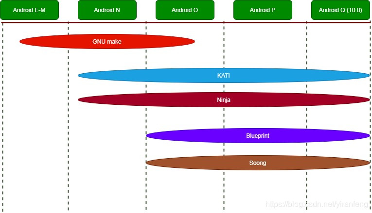
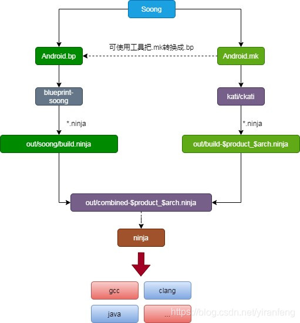

> 基于Android 12 AOSP源码（android-12.0.0_r3），对Android编译系统框架作学习梳理。  
> 开篇从Android的源码结构入手，让我们先知道Android源码架构包含了哪些内容、Android编译结果目录有哪些内容。然后了解Android编译系统模块的结构组成。

***

# 1. Android源码目录结构

**我们以Android 12 AOSP源码为参照，从Android源码的目录结构了解开始。这是为了先对Android源码系统有个整体框架的概念：**
+ Android包含了哪些目录模块
+ 编译模块位置是在哪、编译结果在哪

**这样我们才能继续深入了解：**
+ 编译执行的命令是在哪边执行的
+ 整编或者单独编译执行make是怎么执行
+ 各个模块编译的结果是什么，编译在哪
+ 整编的执行流程
+ 单编的执行流程、单编对应的结果文件是什么、单编结果文件能不能sync、能不能push
+ 各种Android.mk、Android.bp文件怎么阅读、使用
+ 怎么将模块添加到编译中
+ .....

***

**Android源码目录：**

> 参考AOSP源码网站：http://aospxref.com/

```shell
- art/  # Android runtime运行环境, java虚拟机art源码
- bionic/ # C库
- bootable/	# 启动引导和恢复系统相关代码（bootloader和recovery）
   - bootloader
      - dramk_2712/	
   	- lk/	 # liitle kernel，负责引导Linux的⼀个迷你⼩系统，启动顺序位于fastboot/uboot之后，Linux kernel之前，系统开机之后是进Android还是进recovery，即是这⾥负责
	   - lk_ext_mod/
   - recovery # 负责升级、恢复出⼚等⼀些⽐较重要⼜不是很复杂的⼯作，一般属于升级update子模块

- bootstrap.bash	 # 软链接build/soong/bootstrap.bash
# *****该编译模块需要关注的中心点*******
- build/	# 存放系统编译规则等基础开发包配置
   - blueprint # .bp的全程，由Go语⾔编写，是⽣成、解析Android.bp的⼯具，是Soong的⼀部分。Soong则是专为Android编译⽽设计的⼯具，Blueprint只是解析⽂件的形式，⽽Soong则解释内容的含义
   - kati # 基于Makefile来⽣成ninja.build的⼩项⽬。主要⽤于把Makefile转成成ninja file，⾃⾝没有编译能⼒，转换后使⽤Ninja编译(Android 10之前，Android 11移除)
   - make # android make编译系统，基于Makefile，此系统正在被Soong取代
   - soong # Soong（go语言写的项目）构建系统是在Android 7中引⼊的，旨在取代Make。它利⽤Kati GNU Make克隆⼯具和Ninja构建系统组件来加速Android的构建；Soong在编译时使⽤，解析Android.bp，将之转化为Ninja⽂件
# ***********************************

- compatibility/	# 兼容性计划文档目录，一些markdown文档
- cts/	# cts测试用例源码，但是一般cts跑测是从官网下载官方更新的cts测试包，如果跑测出现case faile，可以根据log在这边阅读源码分析
- dalvik/	# java dalvik虚拟机
- developers/	# demo源码和开发者参考文档
   - demo
   - samples
- development/	# 应用程序开发相关的实例/模板/工具
   - apps  # 开发者选项等app
   - tools

- device/	# 芯片厂商定制代码，包含AOSP自带的多家芯片厂以及芯片平台的代码，android O引入treble后，该目录下大部分关于厂商定制的源码移到vendor目录下
   - common
   - google # 此目录存放Google原生的编译产品，可用于demo参考

- external/	# 开源第三方组件模块，存放着⼤量Google在创造、更新Android过程中，因实现某些功能⽽引⼊的开源第三⽅库，有些库是做了多系统适配（例如适配Android、Win、Linux），有些是only for Android
   - aac/ # aac解码库，AAC是高级音频编码（Advanced Audio Coding）
   - bsdiff/ # diff工具

- frameworks/	# framework层，应用程序框架层
   - av
      - apex # 一种文件格式
      - camera # cameram模块
      - cmds 
         - screenrecord/	# 录屏工具源码
	      - stagefright/	   # 一个多媒体框架
      - drm # 一种图形显示框架
      - media # audio、media源码
      - services # audioflinger、cameraservice、mediacodec等核心CPP源码
      - tools # mainline_hook shell脚本
   - base
      - api #Android对外暴露的API整体存放位置，make update-api命令更新的就是这里的文件
      - cmds # 命令/工具源码路径，例如am、pm、screencap等
         - bootanimation/	# 开机动画
      - core # android java和JNI核心库源码，例如framework.jar,hwbinder.jar,libandroid_runtime等
         - java # 主要java代码
         - jni # libandroid_runtime JNI文件
      - data # Android系统中字体、效果音等资源文件存放目录
      - graphics # graphic基础补充库，属于framework.jar
      - libs # display模块的hwui库位于这个目录下，以及其他的几个模块
      - media # media部分的java实现和jni实现源码，java部分属于framework.jar
      - opengl # opengl java api，隶属于framework.jar
      - packages # aosp core app源码路径，有DocumentsUI、Keyguard、MtpDocumentsProvider、SettingsProvide、SystemUI、Wallpaper等
      - services # service.jar源码，systemServer中启动的多数java service服务代码所在地
      - telecomm/	# tele模块，属于framework.jar
      - telephony/
      - wifi # wifi java api源码目录，属于framework.jar
   - compile
      - libbcc
      - mclinker	
      - slang/
   # 参考 https://blog.csdn.net/benco1986/article/details/126052528
   - ex
      - camera2 # Android摄像头2
      - common
      - framesequence/ # 帧序列
   - hardware/interfaces/ # 各种HAL接口模块，比如automotive、sensorservice、displayservice、cameraservice等
   - native
      - cmds # bugreport、dumpsys等Android debug工具的c实现源码，以及serviceManager
      - libs # binder的Android中间件层实现源码，及libgui、libui、libsensor等中间件库源码
      - opengl # OpenGL的c/c++实现源码
      - services # 一些Android核心C进程的C/C++源码，例如surfaceFlinger、inputflinger、sensorservice等
      - vulkan/ # vulkan图形渲染框架API源码

- hardware/	 # 硬件适配层hal层
   - interfaces/  # Android aosp定义的hidl interface实现，hal service实现源码
   - libhardware
      - moudles
         - audio
         - camera
         - input
   - mediatek/qcom  # 芯片平台 HAL实现代码，上层对接Google HIDL interface

- kernel/ # aosp的kernel适配目录
- libcore/	# Java api核心库实现源码，dalvik、art部分java实现代码也在这里
   - dalvik
- libnativehelper/	# native层helper，即JNJ相关cpp源码
# 整编的入口文件
- Makefile	# 全局makefile，内容就是运行include build/make/core/main.mk
- packages/	# 大部分android apk源码
   - apps
      - Calendar #日历应用
      - Camera2/ # 官方camera
      - Car # car的demo APP，包含日历、仪表、空调、输入法、luancher、设置、收音机、media等
      - Gallery # 图库
      - SoundRecorder   # 录音机
   - providers # 存放着一堆provider的源码，media模块使用的MediaProvider，ContactsProvider等
   - services  # java service源码位置
      - car  # carservice源码

- pdk/	# platform development kit，平台开发工具
- platform_testing/	# 平台一些测试相关的源码
- prebuilts/	# 预编译资源
   - go # go语言环境，比如用于支持soong
- sdk/	# sdk工具源码
- system/	# 底层文件系统库、应用、组件，特殊功能模块
   - bt # 蓝牙相关
   - connectivity # wifi相关库
   - core # Android C/C++部分核心组件源码，有相当一部分是common类的组件
      - adb # adb进程源码
      - fastboot  # fastboot命令工具源码
      - fs_mgr/ # OverlayFS文件系统和adb remount，通过通过adb-disable-verity和adb-remount命令解决一些调试场景
      - healthd   # 电池服务守护进程源码
      - init      # init进程实现源码
      - libcutils # 工具库源码，例如property_set
      - ibion # ion内存管理工具类源码
      - liblog # ALOGX等相关函数实现源码
      - libusbhost # usbhost实现库
      - llkd # Android Live LocK Daemon（llkd），旨在捕获和缓解内核死锁
      - logcat # logcat实现源码
      - logd # 负责输出log的logd守护进程源码
      - sdcard # 外置存储卡挂载时会使用到的工具类
   - hwservicemanager   # hwservicemanager的实现源码，负责管理hidl service的，类似serviceManager
   - libhidl # hidl功能的c/c++层实现源码
   - libhwbinder # hwbinder功能的实现源码
   - memory/ # memory内存信息
      - lmkd # 低内存机制源码
   - netd # 网络守护进程源码
   - nfc
   - sepolicy # aosp selinux配置文件所在目录
   - storaged/
   - update_engine # Android升级模块
   - vold # 用于磁盘管理的守护进程

- test/	
   - vts # vts测试源码
- toolchain/ # Android工具链
- tools/	# android一些工具的源码，例如apk签名
   - apksig
- vendor/	# 厂商定制模块（芯片厂商以及具体产品项目的定制化功能的实现代码）
```

***

## 1.1. 编译结果out目录

Android编译生成的所有文件都是和源码分离的，所有中间文件和结果都放在根目录out文件夹中。out文件夹结构如下：

```shell
.
├── Android.mk # 空文件
├── build_date.txt # 编译时间，时间戳格式，例如1683536594
├── build-<product_name>.ninja # 编译某个产品的构建列表（针对Android.mk）
├── build-<product_name>-package.ninja
├── casecheck.txt
├── CaseCheck.txt
├── CleanSpec.mk # 空文件
├── combined-<product_name>.ninja # 最终整合Android.bp和Android.mk构建列表的最终文件
├── dist # 包含了为多种分发而准备的包，通过“make disttarget”将文件拷贝到该目录，默认的编译目标不会产生该目录
   - installed-files-rescued.txt # system目录下结果文件，按文件大小从大往小排列
├── dumpvars-error.log
├── dumpvars-soong.log # soong构建日志
├── dumpvars-soong_metrics
├── empty # 空文件夹
├── error.log
├── host # 构建源码需要的工具和库文件，一些在主机上用的工具，有一些是二进制程序,有一些是JAVA的程序
   - common/obj/JAVA_LIBRARIES # 一些系统的jar包，比如bugreport、signapk、apksigner等
   - linux-x86 # 一些依赖lib so库以及资源文件等
      - bin # 可执行二进制程序，比如adb、fastboot、bsdiff、BugReport、e2fsck等
      - framework # JAVA库,＊.jar文件
      - lib # lib动态链接库
      - obj # 中间生成的目标文件cd
├── last_kati_suffix # 最近一次kati编译product产品的后缀

├── .module_paths # 所有编译的模块列表
   ├── Android.bp.list # 所有使用Android.bp的模块完整路径列表
   ├── Android.mk.list # 所有使用Android.mk的模块完整路径列表
   ├── AndroidProducts.mk.list # 所有product的AndroidProducts.mk的完整路径（即lunch显示的所有产品）
   ├── CleanSpec.mk.list # 所有CleanSpec.mk的模块列表（定义每次编译前的特殊清理步骤）
   ├── files.db
   ├── OWNERS.list # OWNERS文件的路径列表
   └── TEST_MAPPING.list # TEST_MAPPING文件的路径列表

├── ninja_build # 空文件
├── soong # soong构建文件夹
   ├── aidl # aidl接口包列表
   ├── Android-product.mk # 所有makefile模块的Android.mk集合
   ├── apex/depsinfo  # 各个包或者activity可允许的最小sdk版本 minSdkVersion
   ├── apexkeys.txt # 各个apex包的key列表
   ├── api_fingerprint.txt # 空
   ├── api_levels.json # api level数组（字母对应数字版本）
   ├── boot-jars-package-check # 空
   ├── build.ninja   # ninja构建列表（针对Android.bp）
   ├── build.ninja.d # out/soong/build.ninja构建的列表（针对Android.bp）
   ├── build_number.txt # 构建版本信息，包含时间和构建用户
   ├── cflags # 列出使用cflags的模块，针对google原生的（-O3、-Wall、-Werror、-Wextra、-Wthread-safety）
   ├── compat_config
      - merged_compat_config.xml
   ├── dexpreopt.config # dexpreopt预编译配置属性
   ├── dexpreopt_soong.config # 针对soong的预编译config
   ├── docs # 各种机制和库的说明文档和使用说明介绍，比较重要（比如aidl、hidl、java、xml等）
      ├── aidl.html
      ├── android.html
      ├── configs.html
      ├── hidl.html
      ├── java.html
      ├── kernel.html
      ├── ......
   ├── framework.aidl   # framework的aidl包名列表
   ├── framework_non_updatable.aidl
   ├── hiddenapi  # 使用hidden注释的api列表
   ├── host # 同out/host结构，包含windows和linux两个子目录
   ├── late-product.mk # 自动生成的文件，soong在解析所有Android.mk文件后读取的值
   ├── make_vars-product.mk
   ├── product # 编译产品的dexpreopt预编译配置
   ├── ndk # ndk各版本的接口库和头文件
   ├── ndk_base.timestamp
   ├── soong_build_metrics.pb
   ├── soong.environment.available # soong的环境变量（宏和路径）
   ├── soong.environment.used 
   ├── soong.variables # soong的变量和值
   ├── system_server_dexjars
   └── vndk # vndk的lib库文件

├── soong.log # soong目录下go脚本的日志
├── soong_metrics 
├── soong_ui # 可执行二进制文件
├── target # 下面单独解释
   ├── common
   │   ├── obj
   │   └── R
   └── product
       └── AOSP
├── vendor-hal # hal模块各个文件的checksum
```


### 1.1.1. out/target目录结构

```shell
├── out/target
   ├── common # 包含了针对设备的共通的编译产物，主要是Java应用代码和Java库
      ├── obj # 目标文件
      │   ├── all-event-log-tags.txt # 所有event log的tag列表
      │   ├── api.xml
      │   ├── APPS # 含了JAVA应用程序生成的目标，每个应用程序对应其中一个子目录，将结合每个应用程序的原始文件生成Android应用程序的APK包
      │   ├── ETC
      │   ├── JAVA_LIBRARIES # 包含了所有生成JAVA jar包的模块，可用于APP导入使用
      │   ├── module-lib-api.xml
      │   ├── PACKAGING
      │   ├── system-api.xml
      │   ├── system-server-api.xml
      │   └── test-api.xml
      └── R # 资源文件
          ├── android
          ├── androidx
          ├── com
          └── org

   └── product
       └── XXX_product # 具体编译lunch选择产品名
         ├── abl.elf
         ├── android-info.txt # 当前android board名称
         #  Android系统中，通常会把zImage（内核镜像uImage文件）和ramdisk.img打包到一起，生成一个boot.img镜像文件，放到boot分区，由bootloader来引导启动
         # 其启动过程本质也是和分开的uImage&ramdisk.img类似，只不过把两个镜像按照一定的格式合并为一个镜像而已
         ├── boot.img # Linux内核镜像
         ├── boot.zip
         ├── build_fingerprint.txt # 构建信息
         ├── build_system_stats.txt # 构建信息
         ├── build_thumbprint.txt
         ├── data # 这个目录是用来生成<数据文件系统镜像>（data file system image）userdata.img
         ├── dlkm
         ├── dtb.img
         ├── dtbo.img
         ├── kernel # kernel目录
         ├── metadata
         ├── metadata.img
         ├── misc_info.txt # misc 分区供恢复映像使用，存储空间不能小于4KB
         ├── <product_name>-ota-eng.USER.zip # OTA升级包
         ├── obj # 生成的中间文件,最后都要拷贝到root或system文件夹中，最后生成镜像img文件
         ├── obj_arm
         ├── ota_metadata
         ├── ota_metadata.pb
         ├── otatools.zip
         ├── persist # persist目录
         ├── persist.img # 表示“不可更改”（（仍然可以通过fastboot替换它)），包含在设备发货后不应更改的数据。例如：芯片的校准数据（wifi，bt，摄像机等），证书和其他安全相关文件
         ├── ramdisk
         ├── ramdisk-debug.img
         # 内存磁盘镜像是根文件系统：android启动时首先加载ramdisk.img镜像，并挂载到/目录下，并进行了一系列的初始化动作，包括创建各种需要的目录，初始化console开启服务等
         # 尽管ramdisk.img需要放在Linux内核镜像（boot.img）中，但却属于Android源代码的一部分
         # 内存盘的根文件系统映像， 一个分区影像文件，它会在kernel启动的时候，以只读的方式被mount，
         # 这个文件中只是包含了/init以及一些配置文件，这个ramdisk被用来调用init，以及把真正的root file system mount起来
         # ramdisk.img的内容就是*/out/target/product/xxx/root*目录的压缩
         ├── ramdisk.img 
         ├── ramdisk-recovery.img
         ├── ramdisk-test-harness.img
         # 在正常分区或内核分区被破坏，不能正常启动时，可以进入此分区进行恢复，相当于一个简易的OS或bios，可以认为是一个boot分区的替代品
         # 通过他可以让我们在这一分区进行备份维护和恢复，我们通常说的刷机便指的是此分区
         # 进入此分区方法：1、adb reboot recovery；2、通过组合键，电源键+音量键
         ├── recovery
         ├── root     # 这个目录用来创建<root文件系统>（root file system）,  生成的ramdisk.img是用这个文件夹生成的镜像
         ├── secimage.log
         ├── shareduid_violation_modules.json
         ├── signed
         ├── signed_encrypted
         ├── soong_to_convert.txt
         ├── super_empty.img
         ├── super.img # 动态分区镜像文件
         ├── symbols # 带调试信息，可用于堆栈分析
         ├── system # 用来创建system.img, 大部分的应用程序和库都在system中
         ├── system_ext # system externel编译结果目录
         ├── system_ext.img # system external镜像文件
         # system.img是out/target/product/xxx/system目录的一个映射
         ├── system.img # system镜像文件，包含了整个系统android的framework，app等等，会被挂接到 "/"上，包含了系统中所有的二进制文件
         ├── testcases
         ├── test_harness_ramdisk
         ├── userdata.img # 将会被挂接到 /data 下，包含了所有应用相关的配置文件，以及用户相关的数据
         ├── vbmeta.img # 用于安全验证，bootloader验证vbmeta的签名，再用vbmeta的key以及hash值验证dtbo/boot/system/vendor
         ├── vendor # vendor目录，用于创建vendor.img
         ├── vendor_boot-debug.img
         ├── vendor_boot.img
         ├── vendor_boot-test-harness.img
         ├── vendor_debug_ramdisk
         ├── vendor.img # vendor镜像文件，包含所有不可分发给 Android 开源项目 (AOSP) 的二进制文件
         ├── vendor_ramdisk
         └── wall_werror.txt # 使用wall_werror cflag的模块Android.bp或者Android.mk文件
```

***

# 2. 编译系统三部分

> 整个Build系统中的Make文件可以分为三类：

***

## 2.1. Part 1：Build系统核心模块

> 第一类是Build系统核心模块。此类文件定义了整个Build系统的框架，而其他所有Make文件都是在这个框架的基础上编写出来的。

Build系统核心主要位于`/build/core/`目录

**编译模块目录结构：**

```shell
build/
├── bazel # 一个开源的构建和测试工具，类似于Make、Maven和Gradle，目前Google仍在实验开发阶段，暂时不关注
├── blueprint # 一个meta-build系统，它读取描述需要构建的模块的bp文件，解析Blueprint文件翻译成ninja语法文件
├── buildspec.mk.default -> make/buildspec.mk.default
├── CleanSpec.mk -> make/CleanSpec.mk
├── core -> make/core
├── envsetup.sh -> make/envsetup.sh # source加载环境变量
├── make # make编译系统，基于makefile的构建方式正在被soong取代
├── pesto # 一个概念验证脚本，用于使用Soong构建系统构建的目标在Android源代码树中创建模拟的bazel环境
├── soong # go编写的新构建系统
├── target -> make/target
└── tools -> make/tools
```

***

## 2.2. Part 2：针对某个Product产品

>（一个产品可能是某个型号的手机或者车机）的Make文件，这些文件通常位于`device`目录下，该目录下又以芯片名（或者公司名）以及产品名分为两级目录。

> 例如下面是Android 12 AOSP源码中device目录下子目录的结构。对于一个产品的定义通常需要一组文件，这些文件共同构成了对于这个产品的定义。

```shell
android/device/linaro/poplar$ tree -L 1
.
├── Android.bp
├── AndroidProducts.mk
├── audio
├── bluetooth
├── BoardConfig.mk
├── device.mk
├── installer
├── manifest.xml
├── media
├── METADATA
├── optee
├── overlay
├── poplar.mk
├── proprietary
├── sepolicy
├── vendor
└── wifi
```

***

## 2.3. Part 3：针对某个Module模块

单个模块的Make文件。整个系统中，包含了大量的模块，每个模块都有一个专门的Make文件，这类文件的名称统一为`Android.mk`或者`Android.bp`，该文件中定义了如何编译当前模块。Build系统会在整个源码树中扫描名称为`Android.mk`和`Android.bp`的文件并根据其中的内容执行模块的编译

***

# 3. Android编译系统介绍

## 3.1. 编译演变历史

> ninja的网址：https://ninja-build.org

在Android 7.0之前，Android编译系统使用GNU Make描述和shell来构建编译规则，模块定义都使用`Android.mk`进行定义，`Android.mk`的本质就是Makefile，但是随着Android的工程越来越大，模块越来越多，Makefile组织的项目编译时间越来越长。Android编译系统需要优化。

因此，在Android7.0开始，Google采用`ninja`来代取代之前使用的`make`，由于之前的`Android.mk`数据实在巨大，因此Google加入了一个kati工具，用于将`Android.mk`转换成ninja的构建规则文件`buildxxx.ninja`，再使用ninja来进行构建工作。

编译速度快了一些，但是既然开始替换make，那最终目标要把make都取代，于是从Android8.0开始，Google为了进一步淘汰Makefile，因此引入了`Android.bp`文件来替换之前的`Android.mk`。（Android 7.0引入Android.bp，但是未正式使用）

Android.bp只是一个纯粹的配置文件，不包括分支、循环语句等控制流程，本质上就是一个json配置文件。Android.bp通过`Blueprint+soong`转换成`ninja`的构建规则文件`build.ninja`，再使用ninja来进行构建工作。

Android 10.0上，mk和bp编译的列表可以从`\out\.module_paths`中的`Android.bp.list`、`Android.mk.list`中看到，而Android10.0还有400多个mk文件没有被替换完。

Android 12上也没把Android.mk全部替换完....所以kati还得用着...（最新Android 14 AOSP查看仍有不少Android.mk）

***

**Android编译演进过程：**
1. Android7.0之前 使用GNU Make
2. Android7.0引入ninja、kati、Android.bp和soong构建系统
3. Android8.0开始默认开启Android.bp
4. Android9.0强制使用Android.bp（但是我们仍然可以使用Android.mk来创建模块）

Google在Android 7.0之后，引入了Soong构建系统，旨在取代make，它利用`Kati GNU Make`克隆工具和`Ninja构建系统组件`来加速Android的构建。

Make构建系统得到了广泛的支持和使用，但在Android层面变得缓慢、容易出错、无法扩展且难以测试。Soong构建系统正好提供了Android build所需的灵活性。

Android S版本下system级别的app源码都采用了Android.bp作为编译配置，Soong作为核心编译系统发挥的作用也越来越大，如果vendor或package目录是自行开发的模块，建议编写Android.bp。
其中对于已有的Android.mk，可使用`out/soong/host/linux-x86/bin`目录下的`androidmk`工具，将`Android.mk`转换成`Android.bp`



**流程图展示：**


***

## 3.2. 编译模块构成

**编译模块目录结构：**

```shell
├── bazel # 一个开源的构建和测试工具，类似于Make、Maven和Gradle，目前Google仍在实验开发阶段，暂时不关注
├── blueprint # 一个meta-build系统，它读取描述需要构建的模块的bp文件，解析Blueprint文件翻译成ninja语法文件
├── buildspec.mk.default -> make/buildspec.mk.default
├── CleanSpec.mk -> make/CleanSpec.mk
├── core -> make/core
├── envsetup.sh -> make/envsetup.sh # source加载环境变量
├── make # make编译系统，基于makefile的构建方式正在被soong取代
├── pesto # 一个概念验证脚本，用于使用Soong构建系统构建的目标在Android源代码树中创建模拟的bazel环境
├── soong # go编写的新构建系统
├── target -> make/target
└── tools -> make/tools
```

从编译模块目录中可以看到core文件夹被link到了`make/core`，`envsetup.sh`被link到`make/envsetup.sh`，这主要是为了对使用者屏蔽切换编译系统的差异

**此处可以重点看以下几个文件夹：**

+ bazel：一个开源的构建和测试工具，类似于 Make、Maven和Gradle。目前Google还需要继续完善开发保证工作流程的稳定性
+ blueprint：用于处理Android.bp，编译生成*.ninja文件，用于做ninja的处理
+ kati：用于处理Android.mk，编译生成*.ninja文件，用于做ninja的处理
+ make：文件夹还是原始的make那一套流程，比如envsetup.sh
+ soong：构建系统，核心编译为`soong_ui.bash`

其他还有一部分prebuilts目录下的，Google未释放源码的，列举一部分重要的bin可执行文件在build构建时会使用到：

```shell
prebuilts/build-tools/linux-x86/bin$ tree
.
├── aidl
├── ckati
├── hidl-gen
├── make
├── ninja
├── nsjail
├── soong_zip
├── toybox
├── xz
├── zip2zip
├── zipalign
├── ziptime
└── ziptool
.....
```

***

### 3.2.1. soong编译步骤

> 关于这小节，大概解释下编译涉及的几个重点对象，以及其中关联的关系、编译流程的步骤。  
> 后续会在编译详细过程中进行深入了解。

**在编译过程中，bp和mk的大致流程如下：**
1. Android.bp会被收集到`out/soong/build.ninja.d`，然后blueprint以此为基础，生成`out/soong/build.ninja`
2. Android.mk会由`kati/ckati`生成为`out/build-<product_name>.ninja`
3. 两个ninja文件会被整合进入`out/combined-<product_name>.ninja`

Android.mk文件、Android.bp文件、kati、Soong、Blueprint、Ninja之间的关系如下：

```shell
(1) Android.bp --> Blueprint --> Soong --> Ninja 
(2) Makefile or Android.mk --> kati --> Ninja 
(3) (Android.mk --> Soong(androidmk) --> Blueprint --> Android.bp)
```

+ Blueprint是生成、解析Android.bp的工具，是Soong的一部分
+ Soong是专为Android编译而设计的工具，Blueprint只是解析文件的形式，而Soong则解释内容的含义
+ Android.mk可以通过Soong提供的`androidmk`转换成`Android.bp`，但仅限简单配置
+ 现存的Android.mk文件、既有的Android.bp，都会分别被转换成**Ninja**。从Android.mk与其它Makefile，会生成`out/build-<product_name>.ninja`文件。而从Android.bp，则会生成`out/soong/build.ninja`。此外，还会生成一个较小的`out/combined-<product_name>.ninja`文件，负责把二者组合起来，作为执行入口
+ 最终，Ninja文件才是真正直接控制源码编译的工具

**soong编译步骤流程图大致如下，这是针对Android 10的流程，在Android 11开始移除了kati源码目录，ckati仅作为预编译二进制文件命令进行调用：**



***

**截取相关的几个文件部分内容：**

+ 最终ninja整合的文件out/combined-<product_name>.ninja：

```shell
builddir = out
pool highmem_pool
 depth = 2
# Android.mk模块
subninja out/build-<product_name>.ninja
subninja out/build-<product_name>-package.ninja
# Android.bp模块
subninja out/soong/build.ninja
```

+ 文件out/soong/build.ninja.d：

```shell
out/soong/build.ninja: \
 out/.module_paths/Android.bp.list \
 Android.bp \
 art/Android.bp \
 art/adbconnection/Android.bp \
 art/benchmark/Android.bp \
 art/build/Android.bp \
......
```

+ Android.bp最终的构建列表文件out/soong/build.ninja：

```shell
# ******************************************************************************
# ***            This file is generated and should not be edited             ***
# ******************************************************************************
#
# This file contains variables, rules, and pools with name prefixes indicating
# they were generated by the following Go packages:
#
#     aidl                      [from Go package android/aidl]
#     android                   [from Go package android/soong/android]
#     android.soong.cc.config   [from Go package android/soong/cc/config]
#     android.soong.java.config [from Go package android/soong/java/config]
#     android.soong.rust.config [from Go package android/soong/rust/config]
#     apex                      [from Go package android/apex]
#     bloaty                    [from Go package android/soong/bloaty]
# bootstrap                 [from Go package
# github.com/google/blueprint/bootstrap]
#     bpf                       [from Go package android/soong/bpf]
#     cc                        [from Go package android/soong/cc]
#     clang                     [from Go package android/soong/clang]
#     configs                   [from Go package android/soong/kernel/configs]
#     genrule                   [from Go package android/soong/genrule]
#     hidl                      [from Go package android/hidl]
#     java                      [from Go package android/soong/java]
#     kernel                    [from Go package android/soong/kernel]
# libchrome                 [from Go package
......
```

+ Android.mk的构建列表文件out/build-<product_name>.ninja：

```shell
# Generated by kati unknown

rule rule0
 description = Available sub-modules:
 rspfile = $out.rsp
 rspfile_content = echo "AaptAutoVersionTest AaptBasicTest AaptSymlinkTest AaptTestStaticLib_App AccessibilityEventsLogger AccessoryChat Acces
soryDisplaySink AccessoryDisplaySource AccountManagementApp ActivityContextInstrumentOtherAppTest ActivityContextTest ActivityManagerPerfTests
 ActivityManagerPerfTestsStubApp1 ActivityManagerPerfTestsStubApp2 ActivityManagerPerfTestsStubApp3 ActivityManagerPerfTestsTestApp ActivityMa
nagerPerfTestsUtils ActivityTest AdbBackupApp
......
```

+ 文件build-<product_name>-package.ninja：

```shell
# Generated by kati unknown

build _packaging_default_rule_: phony
 phony_output = true
build _dist_ANGLE: phony
 phony_output = true
build _dist_AaptAutoVersionTest: phony
 phony_output = true
build _dist_AaptBasicTest: phony
......
```

***

### 3.2.2. kati说明（Android 11后隐藏源码）

> kati脚本和代码目录：/build/kati，而在Android 11之后，该源码目录被移除（Google直接使用prebuilt预编译工具二进制命令）

kati是一个基于Makefile来生成`ninja.build`的小项目。主要用于把`Makefiel`转成成`ninja file`，自身没有编译能力，转换后使用`Ninja`编译。

在Google Android演变的过程中，逐渐被淘汰。目前在Android 11之后已经没有该目录。（build/soong下面会有关于kati的go脚本文件）

**PS：**从Android 11开始，不再释放源码，而是直接作为prebuilts预编译资源，Android 10之前在`android/build/kati`

***

### 3.2.3. Soong构建系统说明

> soong脚本和代码目录：/build/soong

Soong构建系统是在Android 7.0 (Nougat) 中引入的，旨在取代Make。它利用Kati和Ninja构建系统组件来加速Android的构建。

Soong是由Go语言写的一个项目，从Android 7.0开始，在`prebuilts/go/`目录下新增了Go语言所需的运行环境，Soong在编译时使用，解析Android.bp，将之转化为Ninja文件，完成Android的选择编译，解析配置工作等。故Soong相当于Makefile编译系统的核心，即`build/make/core`下面的内容。

另外Soong还会编译产生一个`androidmk`命令，可以用来手动将`Android.mk`转换成`Android.bp`文件。不过这只对无选择、循环等复杂流程控制的Android.mk生效。（源码目录：`build/soong/androidmk/`，主要是go脚本文件）

***

### 3.2.4. blueprint说明

> blueprint代码目录：/build/blueprint

Blueprint由Go语言编写，是生成、解析Android.bp的工具，是Soong的一部分。Soong则是专为Android编译而设计的工具，Blueprint只是解析文件的形式，而Soong则解释内容的含义。

在Android编译最开始的准备阶段，会执行`build/soong/soong_ui.bash`进行环境准备。 

对blueprint项目编译完成之后会在`out/soong/host/linux-x86/bin`目录下生成soong编译需要的5个执行文件(bpfix,bpfmt,bpmodify,microfatory,bpmodify)。

Soong是与Android强关联的一个项目，而Blueprint则相对比较独立，可以单独编译、使用。

***

### 3.2.5. Ninja

AOSP在源码中已经内置了一个ninja执行文件：`prebuilts/build-tools/linux-x86/bin/ninja`
使用ninja，可以不经过make，直接执行ninja文件，完全避免重新生成，以及解析Makefile的运行开销。
使用ninja必须指定一个target，否则是全编译。 可以直接指定模块名，单独执行某个模块。 甚至可以指定具体的`*.o、.jar、.dex文件为target`，避免编译整个模块

`./prebuilts/build-tools/linux-x86/bin/ninja -f out/combined-msmnile_gvmq.ninja DemoModuleName`

**PS：**单独使用ninja命令需要先用`make/mm/mmm`等编译过一次才行，如果更改了文件目录结构、增删文件、git pull等操作，或者修改Makefile或Android.bp文件，还需要再重新make一次。记住这个前提，高效运用ninja编译能快速得到精准的结果，可以节省Android.bp/Android.mk生成ninja文件这段流程的耗时。

***

### 3.2.6. Android.mk

Makefile编译系统的一部分，定义了一个模块的必要参数，使模块随着平台编译。通俗来讲就是告诉编译系统，以什么样的规则编译你的源代码，并生成对应的目标文件。

***

### 3.2.7. Android.bp

Android.bp，是用来替换Android.mk的配置文件。

***

## 3.3. 编译命令步骤

Android整个系统的编译命令：

```shell
source build/envsetup.sh   # 编译环境初始化，加载常用系统命令，加载平台信息（或. build/envsetup.sh ）
lunch aosp_arm-eng         # 选择编译平台目标
make -j8                   # 执行编译Android系统
```

从编译命令开始，我们就需要开始详细的梳理了解Android编译系统了。

后面开始详细的针对编译命令进行代码流程梳理。

***

# 4. 参考

+ [Bazel 构建工具介绍](https://xie.infoq.cn/article/16827a1777a8972bbc2669228)
+ [Android 构建性能- Bazel](https://bazel.google.cn/docs/android-build-performance?hl=zh-cn)
+ [编译系统入门篇-Android10.0编译系统（一）](https://blog.csdn.net/mingmigndfds/article/details/125278741)
+ [Google官方文档--Soong构建系统](https://source.android.google.cn/docs/setup/build?hl=fi)