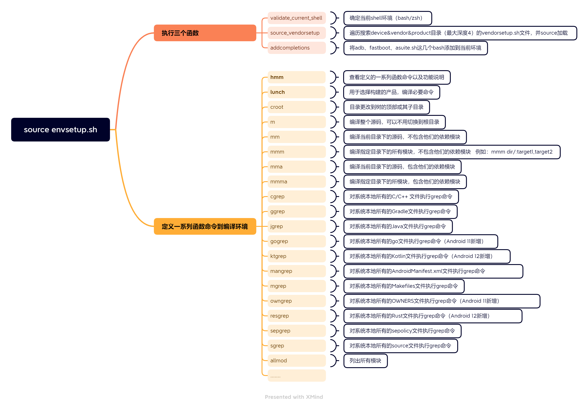
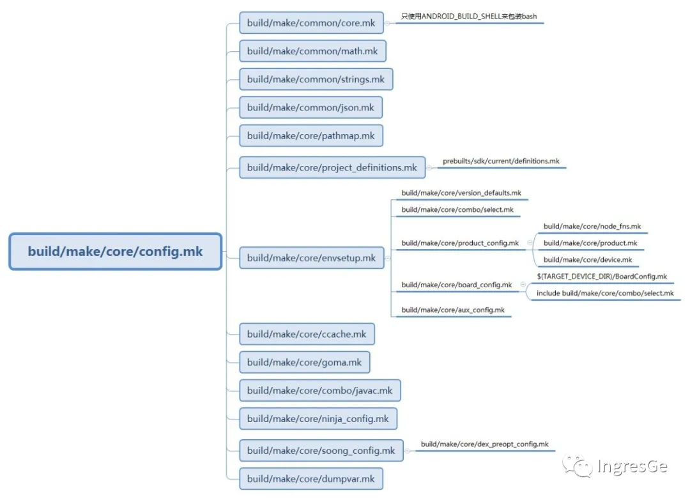

> 本篇我们详细的说明Android编译命令的内部流程，讲述`source build/envsetup.sh;lunch;make`这三个主要编译命令的处理逻辑。

# 1. source build/envsetup.sh

从build代码目录中使用`ll`命令能看到，`build/envsetup.sh`文件是link到`build/make/envsetup.sh`

阅读该shell脚本，主要做了以下几件事情：

1. 确认当前shell环境
2. 从`device/vendor/product`目录遍历搜索`vendorsetup.sh`脚本，并source
3. 定义一些函数到编译环境中，比如`lunch/m/mm/mma/cgrep`等，通过hmm查看帮助
4. 将adb、fastboot、asuite.sh添加到当前环境

***

## 1.1. envsetup.sh内容思维导图

**该脚本只有序执行了其中三个函数，其他定义了很多函数用于编译及后续使用。其中就包括lunch、hmm、mma、mm等**



***

## 1.2. envsetup.sh脚本执行流程分析

**该脚本先后执行了三个函数：**
1. validate_current_shell：确定当前shell环境
2. source_vendorsetup：执行我们能找到的任何vendorsetup.sh文件的内容，加载已批准的vendorsetup.sh文件
3. addcompletions：将adb、fastboot、asuite.sh添加到当前环境

***

### 1.2.1. Step 1: validate_current_shell

该函数主要是确认当前的shell环境

```shell
function validate_current_shell() {
    # 执行"ps -o command -p $$"命令查看当前shell的名称，赋值给current_sh
    local current_sh="$(ps -o command -p $$)"
    case "$current_sh" in
        # 此处我本地的shell环境是bash，执行此分支
        *bash*)
            # 执行type -t bash，此处返回file
            # 打印alias,keyword,function,built-in,file这5种类型
            function check_type() { type -t "$1"; }
            ;;
        *zsh*)
            function check_type() { type "$1"; }
            enable_zsh_completion ;;
        *)
            echo -e "WARNING: Only bash and zsh are supported.\nUse of other shell would lead to erroneous results."
            ;;
    esac
}
```

**PS:**

例如在本地测试执行：

```shell
# 获取shell本身的pid信息
# $$：shell本身的pid
$ ps -p $$
  PID TTY          TIME CMD
 5189 pts/6    00:00:04 bash

# -o command: ps命令的-o参数允许用户指定显示信息的格式，command指示只显示CMD对应的信息，这里就是"bash"
$ ps -o command -p $$
COMMAND
bash

$ type bash
bash is /bin/bash

$ type -t bash
file
```

***

### 1.2.2. Step 2: source_vendorsetup

从`device\vendor\product`目录（搜索最大深度为4）遍历查询`vendorsetup.sh`文件，并且使用`. *.sh`命令进行source加载

```shell
function source_vendorsetup() {
    unset VENDOR_PYTHONPATH
    # 获取项目根目录
    local T="$(gettop)"
    allowed=
    # 执行source命令后，此处循环实际未搜索到
    # cd到根目录
    # 查询device/vendor/product最大深度4，名字包含allowed-vendorsetup_sh-files的文件（即vendorsetup.sh）
    # find -L 找到符号链接的时候，所有的属性来自文件本身，而不是符号链接
    for f in $(cd "$T" && find -L device vendor product -maxdepth 4 -name 'allowed-vendorsetup_sh-files' 2>/dev/null | sort); do
        if [ -n "$allowed" ]; then
            echo "More than one 'allowed_vendorsetup_sh-files' file found, not including any vendorsetup.sh files:"
            echo "  $allowed"
            echo "  $f"
            return
        fi
        allowed="$T/$f"
    done
    # 此处是实际查询到的，遍历查询三个目录的vendorsetup.sh文件
    allowed_files=
    [ -n "$allowed" ] && allowed_files=$(cat "$allowed")
    for dir in device vendor product; do
        for f in $(cd "$T" && test -d $dir && \
            find -L $dir -maxdepth 4 -name 'vendorsetup.sh' 2>/dev/null | sort); do

            if [[ -z "$allowed" || "$allowed_files" =~ $f ]]; then
                # 此处先打印日志，然后执行" . *.sh"就是相当于source该脚本
                echo "including $f"; . "$T/$f"
            else
                echo "ignoring $f, not in $allowed"
            fi
        done
    done
}
```

归根到底，其实就是执行了以下三个命令：

```shell
find -L device -maxdepth 4 -name 'vendorsetup.sh' 2>/dev/null | sort;
find -L vendor -maxdepth 4 -name 'vendorsetup.sh' 2>/dev/null | sort;
find -L product -maxdepth 4 -name 'vendorsetup.sh' 2>/dev/null | sort
```

***

### 1.2.3. Step 3: addcompletions

主要将adb、fastboot、asuite这几个bash添加到编译环境中

```shell
function addcompletions()
{
    local f=
    # 不要试图在既不是bash也不是zsh的地方运行
    if [ -z "$BASH_VERSION" -a -z "$ZSH_VERSION" ]; then
        return
    fi

    # Keep us from trying to run in bash that's too old.
    # bash版本不要太老
    if [ -n "$BASH_VERSION" -a ${BASH_VERSINFO[0]} -lt 3 ]; then
        return
    fi
    # adb、fastboot、asuite
    local completion_files=(
      system/core/adb/adb.bash
      system/core/fastboot/fastboot.bash
      tools/asuite/asuite.sh
    )
    # Completion can be disabled selectively to allow users to use non-standard completion.
    # e.g.
    # ENVSETUP_NO_COMPLETION=adb # -> disable adb completion
    # ENVSETUP_NO_COMPLETION=adb:bit # -> disable adb and bit completion
    for f in ${completion_files[*]}; do
        # 遍历*.bash文件列表，并将这些*.bash文件包含进来
        # 检查是否在ENVSETUP_NO_COMPLETION中
        if [ -f "$f" ] && should_add_completion "$f"; then
            # 对*.bash文件执行'.'操作
            . $f
        fi
    done

    if should_add_completion bit ; then
        complete -C "bit --tab" bit
    fi
    if [ -z "$ZSH_VERSION" ]; then
        # Doesn't work in zsh.
        complete -o nospace -F _croot croot
    fi
    # complete自动补全命令
    # 表示当执行lunch命令时，_lunch会计算自动补全
    complete -F _lunch lunch

    complete -F _complete_android_module_names pathmod
    complete -F _complete_android_module_names gomod
    complete -F _complete_android_module_names outmod
    complete -F _complete_android_module_names installmod
    complete -F _complete_android_module_names m
}
```

***

## 1.3. hmm查看可支持的编译命令

在envsetup.sh的hmm函数中可以看到一些编译命令会被加载到环境中，这些命令都是在该shell脚本中定义的函数方法。

各个命令的实现方法都不一样，有的简单到一条正则命令，有的则是牵扯到编译系统。

我们比较关注的是lunch、m、mm、mma等这些和编译相关的，具体实现细节后续会梳理到，此处只需要知道函数入口在这个脚本中就可以。

**我们可以使用`hmm`查看这些命令说明：**

命令|说明
:-|:-
lunch|lunch <product_name>-<build_variant> 选择<product_name>作为要构建的产品，<build_variant>作为要构建的变体，并将这些选择存储在环境中，以便后续调用“m”等读取
tapas|交互方式：tapas [<App1> <App2> ...] [arm|x86|mips|arm64|x86_64|mips64] [eng|userdebug|user]
banchan|banchan <module1> [<module2> ...] [arm|x86|arm64|x86_64] [eng|userdebug|user]
croot|将目录更改到树的顶部或其子目录
m|编译整个源码，可以不用切换到根目录
mm|编译当前目录下的源码，不包含他们的依赖模块
mmm|编译指定目录下的所有模块，不包含他们的依赖模块。例如：mmm dir/:target1,target2.
mma|编译当前目录下的源码，包含他们的依赖模块
mmma|编译指定目录下的所模块，包含他们的依赖模块
provision|具有所有必需分区的闪存设备。选项将传递给fastboot
cgrep|对系统本地所有的C/C++ 文件执行grep命令
ggrep|对系统本地所有的Gradle文件执行grep命令
gogrep|对系统本地所有的go文件执行grep命令（Android 11新增）
jgrep|对系统本地所有的Java文件执行grep命令
ktgrep|对系统本地所有的Kotlin文件执行grep命令（Android 12新增）
resgrep|对系统本地所有的res目录下的xml文件执行grep命令
mangrep|对系统本地所有的AndroidManifest.xml文件执行grep命令
mgrep|对系统本地所有的Makefiles文件执行grep命令
owngrep|对系统本地所有的OWNERS文件执行grep命令（Android 11新增）
rsgrep|对系统本地所有的Rust文件执行grep命令（Android 12新增）
sepgrep|对系统本地所有的sepolicy文件执行grep命令
sgrep|对系统本地所有的source文件执行grep命令
godir|根据godir后的参数文件名在整个目录下查找，并且切换目录
allmod|列出所有模块
gomod|转到包含模块的目录
pathmod|获取包含模块的目录
outmod|获取具有特定扩展名的模块的已安装输出的位置（Android 12新增）
dirmods|获取定义模块的目录（Android 12新增）
installmod|adb安装一个编译APK的模块（Android 12新增）
refreshmod|刷新allmod/gomod的模块列表
syswrite|将分区（例如system.img）重新remount为可写分区，必要时重新启动（Android 12新增）

***

# 2. lunch

> 在执行`source build/envsetup.sh`后，我们需要选择一个编译目标。  
> `lunch`的主要作用是根据用户输入或者选择的产品目标来设置对应的环境变量。

## 2.1. lunch执行日志分析

首先我们执行下`lunch`命令看下终端打印的日志，会列出所有的产品目标，然后我们选择其中一个。或者我们也可以执行`lunch + 产品目标名称/数字序列`

```shell
# 执行lunch命令选择其中一个，比如7
# 或者执行 lunch aosp_car_arm64-userdebug
# 或者执行 lunch 7
$ lunch

You're building on Linux

Lunch menu... pick a combo:
     1. aosp_arm-eng
     2. aosp_arm64-eng
     3. aosp_blueline_car-userdebug
     4. aosp_bonito_car-userdebug
     5. aosp_bramble_car-userdebug
     6. aosp_car_arm-userdebug
     7. aosp_car_arm64-userdebug
     8. aosp_car_x86-userdebug
     9. aosp_car_x86_64-userdebug
    ......
```

**选择产品目标后，控制台输出结果，生成一些环境变量，并且会生成out目录，并生成一些中间文件：**

```shell
============================================
# 表示平台版本的名称
PLATFORM_VERSION_CODENAME=REL
# Android平台版本号，当前是Android 12
PLATFORM_VERSION=12
# 选择编译的产品目标
TARGET_PRODUCT=aosp_car_arm64
# 选择编译的产品类型，是userdebug
TARGET_BUILD_VARIANT=userdebug
# 编译的类型，debug和release
TARGET_BUILD_TYPE=release
# 表示编译目标的CPU架构
TARGET_ARCH=arm64
# 表示编译目标的CPU架构版本
TARGET_ARCH_VARIANT=armv8-a
# 表示编译目标的CPU代号
TARGET_CPU_VARIANT=generic
TARGET_2ND_ARCH_VARIANT=armv8-a
TARGET_2ND_CPU_VARIANT=generic
# 表示编译平台的架构
HOST_ARCH=x86_64
HOST_2ND_ARCH=x86
# 表示编译平台的操作系统
HOST_OS=linux
# 编译平台的操作系统系统的额外信息
HOST_OS_EXTRA=Linux-5.4.0-146-generic-x86_64-Ubuntu-18.04.6-LTS
HOST_CROSS_OS=windows
HOST_CROSS_ARCH=x86
HOST_CROSS_2ND_ARCH=x86_64
HOST_BUILD_TYPE=release
# BUILD_ID会出现在版本信息中，可以利用
BUILD_ID=SQ3A.220705.003.A1
# 编译结果输出的路径
OUT_DIR=out
============================================
```

***

## 2.2. lunch函数执行流程分析

lunch函数在`envsetup.sh`脚本中，我们从该函数进行内部实现的流程分析。

**以Android 12 AOSP源码为例：**

```shell
function lunch()
{
    local answer

    if [[ $# -gt 1 ]]; then
        echo "usage: lunch [target]" >&2
        return 1
    fi
    # Step 1 ：
    # 获取lunch操作的参数，如果参数不为空，参数则为指定要编译的设备型号和编译类型
    if [ "$1" ]; then
        answer=$1
    else
    # 如果参数为空，会调用print_lunch_menu来显示Lunch菜单项，读取用户的输入，存入answer
    # 该函数就是获取所有的AndroidProducts.mk中定义的COMMON_LUNCH_CHOICES宏的值
    # 比如device/generic/car/AndroidProducts.mk中：
    #       COMMON_LUNCH_CHOICES := \
    #           aosp_car_arm-userdebug \
    #           aosp_car_arm64-userdebug \
        print_lunch_menu
        echo -n "Which would you like? [aosp_arm-eng] "
        read answer
    fi

    local selection=

    # -z表示字符串为空
    if [ -z "$answer" ]
    then
        # Step 2 ：如果answer为空，则默认选项值是aosp_arm-eng
        # （例如用户直接在lunch要求输入时回车的情况）
        selection=aosp_arm-eng
    # Step 3：如果lunch操作得到的输入是数字，则将数字转换为LUNCH_MENU_CHOICES中的字符串
    elif (echo -n $answer | grep -q -e "^[0-9][0-9]*$")
    then
        local choices=($(TARGET_BUILD_APPS= get_build_var COMMON_LUNCH_CHOICES))
        if [ $answer -le ${#choices[@]} ]
        then
            # array in zsh starts from 1 instead of 0.
            if [ -n "$ZSH_VERSION" ]
            then
            # 结果存入selection
                selection=${choices[$(($answer))]}
            else
                selection=${choices[$(($answer-1))]}
            fi
        fi
    else
        selection=$answer
    fi

    export TARGET_BUILD_APPS=

    local product variant_and_version variant version
    # 比如此处选择的是aosp_car_arm64-userdebug
    # product=aosp_car_arm64
    product=${selection%%-*} # Trim everything after first dash
    # variant_and_version=userdebug
    variant_and_version=${selection#*-} # Trim everything up to first dash
    if [ "$variant_and_version" != "$selection" ]; then
        variant=${variant_and_version%%-*}
        if [ "$variant" != "$variant_and_version" ]; then
            version=${variant_and_version#*-}
        fi
    fi

    if [ -z "$product" ]
    then
        echo
        echo "Invalid lunch combo: $selection"
        return 1
    fi
    # Step 4： 设置TARGET_PRODUCT和TARGET_BUILD_VARIANT
    # TARGET_PRODUCT=aosp_car_arm64
    TARGET_PRODUCT=$product \
    # TARGET_BUILD_VARIANT=userdebug
    TARGET_BUILD_VARIANT=$variant \
    TARGET_PLATFORM_VERSION=$version \
    # 获取此脚本所需的所有构建变量在对构建系统的一次单独的调用中
    # Step 5：更新编译环境相关变量
    build_build_var_cache
    if [ $? -ne 0 ]
    then
        return 1
    fi
    # Step 6：设置环境变量
    # 例如打印：$ echo $TARGET_PRODUCT
    # 显示结果：aosp_car_arm64
    # 例如打印：$ echo $TARGET_BUILD_VARIANT
    # 显示结果：userdebug
    export TARGET_PRODUCT=$(get_build_var TARGET_PRODUCT)
    export TARGET_BUILD_VARIANT=$(get_build_var TARGET_BUILD_VARIANT)
    if [ -n "$version" ]; then
      export TARGET_PLATFORM_VERSION=$(get_build_var TARGET_PLATFORM_VERSION)
    else
      unset TARGET_PLATFORM_VERSION
    fi
    # TARGET_BUILD_TYPE赋值release
    export TARGET_BUILD_TYPE=release

    [[ -n "${ANDROID_QUIET_BUILD:-}" ]] || echo
    # Step 7：设置其他环境变量，如PROMPT_COMMAND，编译toolchain和tools相关的路径等
    set_stuff_for_environment
    # Step 8：调用printconfig 来输出当前的设置选项
    [[ -n "${ANDROID_QUIET_BUILD:-}" ]] || printconfig
    # Step 9：删除构建var缓存，这样我们仍然可以调用构建系统来获取未在该scrip中列出的构建变量
    destroy_build_var_cache
}
```

***

### 2.2.1. print_lunch_menu打印产品目标列表

旧版本的`add_lunch_combo`添加产品目标的方式已经过时，现在的Android版本都是使用`AndroidProducts.mk`中的`COMMON_LUNCH_CHOICES`替代。

```shell
function print_lunch_menu()
{
    # 调用linux uname命令
    # uname命令用于显示操作系统信息，例如内核版本、主机名、处理器类型等
    # uname -s 或--sysname：显示操作系统名称
    local uname=$(uname)
    local choices
    # 调用get_build_var获取所有COMMON_LUNCH_CHOICES的值（定义在AndroidProducts.mk）
    choices=$(TARGET_BUILD_APPS= TARGET_PRODUCT= TARGET_BUILD_VARIANT= get_build_var COMMON_LUNCH_CHOICES 2>/dev/null)
    local ret=$?

    echo
    # 此处显示打印： You're building on Linux
    echo "You're building on" $uname
    echo

    if [ $ret -ne 0 ]
    then
        echo "Warning: Cannot display lunch menu."
        echo
        echo "Note: You can invoke lunch with an explicit target:"
        echo
        echo "  usage: lunch [target]" >&2
        echo
        return
    fi

    echo "Lunch menu... pick a combo:"

    local i=1
    local choice
    # 遍历打印所有产品目标
    for choice in $(echo $choices)
    do
        echo "     $i. $choice"
        i=$(($i+1))
    done

    echo
}
```

***

### 2.2.2. build_build_var_cache更新环境变量

更新环境变量主要通过执行`build/soong/soong_ui.bash --dumpvars-mode`完成，最终执行的是`./out/soog_ui  --dumpvars-mode`

关于该命令的执行流程：
1.`build/soong/cmd/soong_ui/main.go` -- commands数组中定义该flag选项，对应执行dumpVars函数
2.dumpVars函数会调用执行`build/soong/ui/build/dumpvars.go`中的DumpMakeVars函数，再调用dumpMakeVars函数
3.调用`build/soong/ui/build/kati.go`的ckati命令：`ckati -f build/make/core/config.mk --color_warnings --kati_stats dump-many-vars MAKECMDGOALS=goals`

**PS:** 这部分go脚本的详细逻辑暂未梳理，后续先看下`build/make/core/config.mk`这个makefile文件的内容。

```shell
# Get all the build variables needed by this script in a single call to the build system.
function build_build_var_cache()
{
    local T=$(gettop)
    # 从脚本中grep获取到变量名
    cached_vars=(`cat $T/build/envsetup.sh | tr '()' '  ' | awk '{for(i=1;i<=NF;i++) if($i~/get_build_var/) print $(i+1)}' | sort -u | tr '\n' ' '`)
    cached_abs_vars=(`cat $T/build/envsetup.sh | tr '()' '  ' | awk '{for(i=1;i<=NF;i++) if($i~/get_abs_build_var/) print $(i+1)}' | sort -u | tr '\n' ' '`)
    # Call the build system to dump the "<val>=<value>" pairs as a shell script.
    build_dicts_script=`\builtin cd $T; build/soong/soong_ui.bash --dumpvars-mode \
                        --vars="${cached_vars[*]}" \
                        --abs-vars="${cached_abs_vars[*]}" \
                        --var-prefix=var_cache_ \
                        --abs-var-prefix=abs_var_cache_`
    local ret=$?
    # 如果不等于0则执行，正常ret的值均为0
    if [ $ret -ne 0 ]
    then
        unset build_dicts_script
        return $ret
    fi
    # 执行脚本以将“<val>=<value>”对存储为shell变量
    eval "$build_dicts_script"
    ret=$?
    unset build_dicts_script
    if [ $ret -ne 0 ]
    then
        return $ret
    fi
    BUILD_VAR_CACHE_READY="true"
}
```

***

### 2.2.3. set_stuff_for_environment设置其他环境变量

该函数主要就是设置了一些环境变量：

```shell
function set_stuff_for_environment()
{
    # 该函数设置了一系列的环境变量
    setpaths
    set_sequence_number

    export ANDROID_BUILD_TOP=$(gettop)
    # With this environment variable new GCC can apply colors to warnings/errors
    export GCC_COLORS='error=01;31:warning=01;35:note=01;36:caret=01;32:locus=01:quote=01'
}

function set_sequence_number()
{
    # 固定值13
    export BUILD_ENV_SEQUENCE_NUMBER=13
}

function setpaths()
{
    # 项目top根目录
    local T=$(gettop)
    if [ ! "$T" ]; then
        echo "Couldn't locate the top of the tree.  Try setting TOP."
        return
    fi

    # 此函数将ANDROID_BUILD_PATHS设置为它要添加到PATH中的内容，下次运行时，它会将其从PATH中删除。这是必需的，这样lunch可以多次运行，并且仍然有工作路径
    # 注意：在windows/cygwin上，由于路径中有“C:\Program Files”，ANDROID_BUILD_PATHS将包含空格

    # out with the old
    if [ -n "$ANDROID_BUILD_PATHS" ] ; then
        export PATH=${PATH/$ANDROID_BUILD_PATHS/}
    fi
    if [ -n "$ANDROID_PRE_BUILD_PATHS" ] ; then
        export PATH=${PATH/$ANDROID_PRE_BUILD_PATHS/}
        # strip leading ':', if any
        export PATH=${PATH/:%/}
    fi

    # and in with the new
    local prebuiltdir=$(getprebuilt)
    # （1）ANDROID_GCC_PREBUILTS定义在build/make/core/dumpvar.mk中
    #   代码：ANDROID_GCC_PREBUILTS := prebuilts/gcc/$(HOST_PREBUILT_TAG)
    # （2）HOST_PREBUILT_TAG定义在build/make/core/envsetup.mk中
    #   代码：HOST_PREBUILT_TAG := $(BUILD_OS)-$(HOST_PREBUILT_ARCH)
    # # -- BUILD_OS就是HOST_OS，编译的操作系统，此处是linux
    # # -- HOST_PREBUILT_ARCH = x86
    # （3）调用获取构建变量的值作为绝对路径
    #  所以此处gccprebuiltdir = "绝对路径"/prebuilts/gcc/Linux-x86
    local gccprebuiltdir=$(get_abs_build_var ANDROID_GCC_PREBUILTS)

    # 这些值定义在core/config.mk
    local targetgccversion=$(get_build_var TARGET_GCC_VERSION)
    local targetgccversion2=$(get_build_var 2ND_TARGET_GCC_VERSION)
    # 设置环境变量TARGET_GCC_VERSION，此处是4.9
    export TARGET_GCC_VERSION=$targetgccversion

    # The gcc toolchain does not exists for windows/cygwin. In this case, do not reference it.
    export ANDROID_TOOLCHAIN=
    export ANDROID_TOOLCHAIN_2ND_ARCH=
    # 获取TARGET_ARCH值，在上面可以看到编译目标的CPU架构是arm64
    local ARCH=$(get_build_var TARGET_ARCH)
    local toolchaindir toolchaindir2=
    case $ARCH in
        x86) toolchaindir=x86/x86_64-linux-android-$targetgccversion/bin
            ;;
        x86_64) toolchaindir=x86/x86_64-linux-android-$targetgccversion/bin
            ;;
        arm) toolchaindir=arm/arm-linux-androideabi-$targetgccversion/bin
            ;;
        # 执行此处
        arm64) toolchaindir=aarch64/aarch64-linux-android-$targetgccversion/bin;
               toolchaindir2=arm/arm-linux-androideabi-$targetgccversion2/bin
            ;;
        *)
            echo "Can't find toolchain for unknown architecture: $ARCH"
            toolchaindir=xxxxxxxxx
            ;;
    esac
    if [ -d "$gccprebuiltdir/$toolchaindir" ]; then
        # 设置环境变量ANDROID_TOOLCHAIN
        export ANDROID_TOOLCHAIN=$gccprebuiltdir/$toolchaindir
    fi

    if [ "$toolchaindir2" -a -d "$gccprebuiltdir/$toolchaindir2" ]; then
        export ANDROID_TOOLCHAIN_2ND_ARCH=$gccprebuiltdir/$toolchaindir2
    fi
    # 设置环境变量ANDROID_DEV_SCRIPTS
    export ANDROID_DEV_SCRIPTS=$T/development/scripts:$T/prebuilts/devtools/tools:$T/external/selinux/prebuilts/bin

    # add kernel specific binaries
    case $(uname -s) in
        Linux)
            export ANDROID_DEV_SCRIPTS=$ANDROID_DEV_SCRIPTS:$T/prebuilts/misc/linux-x86/dtc:$T/prebuilts/misc/linux-x86/libufdt
            ;;
        *)
            ;;
    esac

    ANDROID_BUILD_PATHS=$(get_build_var ANDROID_BUILD_PATHS):$ANDROID_TOOLCHAIN
    if [ -n "$ANDROID_TOOLCHAIN_2ND_ARCH" ]; then
        ANDROID_BUILD_PATHS=$ANDROID_BUILD_PATHS:$ANDROID_TOOLCHAIN_2ND_ARCH
    fi
    ANDROID_BUILD_PATHS=$ANDROID_BUILD_PATHS:$ANDROID_DEV_SCRIPTS

    # 将llvm binutils prebuilts路径附加到ANDROID_BUILD_PATHS
    # ANDROID_CLANG_PREBUILTS定义在build/make/core/dumpvar.mk中
    # 代码：ANDROID_CLANG_PREBUILTS := prebuilts/clang/host/$(HOST_PREBUILT_TAG)
    local ANDROID_LLVM_BINUTILS=$(get_abs_build_var ANDROID_CLANG_PREBUILTS)/llvm-binutils-stable
    ANDROID_BUILD_PATHS=$ANDROID_BUILD_PATHS:$ANDROID_LLVM_BINUTILS

    # Set up ASAN_SYMBOLIZER_PATH for SANITIZE_HOST=address builds.
    # 设置环境变量ASAN_SYMBOLIZER_PATH
    export ASAN_SYMBOLIZER_PATH=$ANDROID_LLVM_BINUTILS/llvm-symbolizer

    # If prebuilts/android-emulator/<system>/ exists, prepend it to our PATH
    # to ensure that the corresponding 'emulator' binaries are used.
    case $(uname -s) in
        Darwin)
            ANDROID_EMULATOR_PREBUILTS=$T/prebuilts/android-emulator/darwin-x86_64
            ;;
        Linux)
            # 此处是linxu系统，根目录+/prebuilts/...
            ANDROID_EMULATOR_PREBUILTS=$T/prebuilts/android-emulator/linux-x86_64
            ;;
        *)
            ANDROID_EMULATOR_PREBUILTS=
            ;;
    esac
    if [ -n "$ANDROID_EMULATOR_PREBUILTS" -a -d "$ANDROID_EMULATOR_PREBUILTS" ]; then
        ANDROID_BUILD_PATHS=$ANDROID_BUILD_PATHS:$ANDROID_EMULATOR_PREBUILTS
        # 设置环境变量ANDROID_EMULATOR_PREBUILTS
        export ANDROID_EMULATOR_PREBUILTS
    fi

    # 将asuite预编译路径附加到ANDROID_BUILD_PATHS
    local os_arch=$(get_build_var HOST_PREBUILT_TAG)
    local ACLOUD_PATH="$T/prebuilts/asuite/acloud/$os_arch"
    local AIDEGEN_PATH="$T/prebuilts/asuite/aidegen/$os_arch"
    local ATEST_PATH="$T/prebuilts/asuite/atest/$os_arch"
    export ANDROID_BUILD_PATHS=$ANDROID_BUILD_PATHS:$ACLOUD_PATH:$AIDEGEN_PATH:$ATEST_PATH:

    export PATH=$ANDROID_BUILD_PATHS$PATH

    # out with the duplicate old
    if [ -n $ANDROID_PYTHONPATH ]; then
        # 设置环境变量PYTHONPATH和ANDROID_PYTHONPATH，python路径
        export PYTHONPATH=${PYTHONPATH//$ANDROID_PYTHONPATH/}
    fi
    # and in with the new
    export ANDROID_PYTHONPATH=$T/development/python-packages:
    if [ -n $VENDOR_PYTHONPATH  ]; then
        ANDROID_PYTHONPATH=$ANDROID_PYTHONPATH$VENDOR_PYTHONPATH
    fi
    export PYTHONPATH=$ANDROID_PYTHONPATH$PYTHONPATH
    # 设置java环境变量
    export ANDROID_JAVA_HOME=$(get_abs_build_var ANDROID_JAVA_HOME)
    export JAVA_HOME=$ANDROID_JAVA_HOME
    export ANDROID_JAVA_TOOLCHAIN=$(get_abs_build_var ANDROID_JAVA_TOOLCHAIN)
    export ANDROID_PRE_BUILD_PATHS=$ANDROID_JAVA_TOOLCHAIN:
    export PATH=$ANDROID_PRE_BUILD_PATHS$PATH
    # 设置一些out目录相关的环境变量
    unset ANDROID_PRODUCT_OUT
    # 值 .../out/target/product/emulator_arm64
    export ANDROID_PRODUCT_OUT=$(get_abs_build_var PRODUCT_OUT)
    # 值 .../out/target/product/emulator_arm64
    export OUT=$ANDROID_PRODUCT_OUT

    unset ANDROID_HOST_OUT
    # 值 .../out/host/linux-x86
    export ANDROID_HOST_OUT=$(get_abs_build_var HOST_OUT)

    unset ANDROID_SOONG_HOST_OUT
    # 值 .../out/soong/host/linux-x86
    export ANDROID_SOONG_HOST_OUT=$(get_abs_build_var SOONG_HOST_OUT)

    unset ANDROID_HOST_OUT_TESTCASES
    # 值 .../out/host/linux-x86/testcases
    export ANDROID_HOST_OUT_TESTCASES=$(get_abs_build_var HOST_OUT_TESTCASES)

    unset ANDROID_TARGET_OUT_TESTCASES
    # 值 .../out/target/product/emulator_arm64/testcases
    export ANDROID_TARGET_OUT_TESTCASES=$(get_abs_build_var TARGET_OUT_TESTCASES)

    # needed for building linux on MacOS
    # TODO: fix the path
    #export HOST_EXTRACFLAGS="-I "$T/system/kernel_headers/host_include
}
```

***

### 2.2.4. printconfig打印环境变量

该函数的执行流程类似于`build_build_var_cache`，只是一个是`--dumpvars-mode`，此处是`--dumpvar-mode`

1. `build/soong/cmd/soong_ui/main.go` -- commands数组中定义`--dumpvar-mode`该flag选项，对应执行`dumpVar`函数
2. `dumpVar`函数根据入参`report_config`，然后调用执行`build/soong/ui/build/dumpvars.go`中的`build.DumpMakeVars(ctx, config, nil, build.BannerVars)`，此处build.BannerVars定义在`build/soong/ui/build/dumpvars.go`中，就是需要打印的一些环境变量
3. 调用`build/soong/ui/build/kati.go`的ckati命令：`ckati -f build/make/core/config.mk --color_warnings --kati_stats dump-many-vars MAKECMDGOALS=goals`

```shell
# build/make/envsetup.sh
function printconfig()
{
    local T=$(gettop)
    if [ ! "$T" ]; then
        echo "Couldn't locate the top of the tree.  Try setting TOP." >&2
        return
    fi
    # 调用get_build_var输入参数report_config
    get_build_var report_config
}

# Get the exact value of a build variable.
function get_build_var()
{
    if [ "$BUILD_VAR_CACHE_READY" = "true" ]
    then
        eval "echo \"\${var_cache_$1}\""
        return 0
    fi

    local T=$(gettop)
    if [ ! "$T" ]; then
        echo "Couldn't locate the top of the tree.  Try setting TOP." >&2
        return 1
    fi
    # 调用--dumpvar-mode，入参report_config
    (\cd $T; build/soong/soong_ui.bash --dumpvar-mode $1)
}

# build/soong/cmd/soong_ui/main.go
var commands []command = []command{
	.... {
		flag:         "--dumpvar-mode",
		description:  "print the value of the legacy make variable VAR to stdout",
		simpleOutput: true,
		logsPrefix:   "dumpvars-",
		config:       dumpVarConfig,
		stdio:        customStdio,
        # 执行函数
		run:          dumpVar,
	},....

func dumpVar(ctx build.Context, config build.Config, args []string, _ string) {
    ....
    if varName == "report_config" {
        # 执行此处函数，入参build.BannerVars
		varData, err := build.DumpMakeVars(ctx, config, nil, build.BannerVars)
		if err != nil {
			ctx.Fatal(err)
		}

		fmt.Println(build.Banner(varData))
	}
    ....
}

# build/soong/ui/build/dumpvars.go
# 需要打印的环境变量列表，就是lunch最终终端显示的
var BannerVars = []string{
	"PLATFORM_VERSION_CODENAME",
	"PLATFORM_VERSION",
	"TARGET_PRODUCT",
	"TARGET_BUILD_VARIANT",
	"TARGET_BUILD_TYPE",
	"TARGET_BUILD_APPS",
	"TARGET_BUILD_UNBUNDLED",
	"TARGET_ARCH",
	"TARGET_ARCH_VARIANT",
	"TARGET_CPU_VARIANT",
	"TARGET_2ND_ARCH",
	"TARGET_2ND_ARCH_VARIANT",
	"TARGET_2ND_CPU_VARIANT",
	"HOST_ARCH",
	"HOST_2ND_ARCH",
	"HOST_OS",
	"HOST_OS_EXTRA",
	"HOST_CROSS_OS",
	"HOST_CROSS_ARCH",
	"HOST_CROSS_2ND_ARCH",
	"HOST_BUILD_TYPE",
	"BUILD_ID",
	"OUT_DIR",
	"AUX_OS_VARIANT_LIST",
	"PRODUCT_SOONG_NAMESPACES",
	"SOONG_SDK_SNAPSHOT_PREFER",
	"SOONG_SDK_SNAPSHOT_VERSION",
}
```

***

### 2.2.5. lunch执行流程总结

对于上面代码的流程分析，lunch的操作流程大致如下：

1. 首先`lunch()`函数会获取lunch命令携带的输入参数：
   + 如果参数不为空，参数则为指定要编译的设备型号和编译类型；
   + 如果参数为空，会调用`print_lunch_menu`来显示所有产品目标（AndroidProducts.mk中COMMON_LUNCH_CHOICES定义），读取用户的输入，存入变量answer：
        + 如果answer为空，即在lunch菜单显示后，用户只敲了一个回车。则设置默认选项aosp_arm-eng，结果存入变量selection
        + 如果lunch操作得到的输入是数字，则将数字转换为LUNCH_MENU_CHOICES中的字符串，结果存入selection
2. 解析selection的值，比如此处选择的是`aosp_car_arm64-userdebug`，则得到`product=aosp_car_arm64`和`variant_and_version=userdebug`, 分别保存到`TARGET_PRODUCT`和`TARGET_BUILD_VARIANT`中
3. 根据前面的设置，调用`build_build_var_cache`来更新编译环境相关变量
4. export将`TARGET_PRODUCT`, `TARGET_BUILD_VARIANT`和`TARGET_BUILD_TYPE`位置为环境变量
5. 调用`set_stuff_for_environment`来设置其他环境变量，如PROMPT_COMMAND，编译toolchain和tools相关的路径等
6. 调用`printconfig`来输出当前的设置选项
7. 调用`destroy_build_var_cache`删除构建var缓存，这样我们仍然可以调用构建系统来获取未在该scrip中列出的构建变量

***

## 2.3. lunch执行流程图


***

# 3. make

> 执行make进行Android编译的函数入口是`build/make/envsetup.sh的make()`，我们从这里开始进行编译流程的分析。

## 3.1. 整体流程图

make函数调用get_make_command，从方法内容中看到，真正编译的入口是`build/soong/soong_ui.bash`，传入参数`--make-mode`

```shell
# build/make/envsetup.sh
function make()
{
    _wrap_build $(get_make_command "$@") "$@"
}

function get_make_command()
{
    # If we're in the top of an Android tree, use soong_ui.bash instead of make
    # 如果soong_ui.bash存在且是一个普通文件则为真，此处结果是true
    if [ -f build/soong/soong_ui.bash ]; then
        # Always use the real make if -C is passed in
        for arg in "$@"; do
            if [[ $arg == -C* ]]; then
                echo command make
                return
            fi
        done
        # 真正执行编译的入口
        echo build/soong/soong_ui.bash --make-mode
    else
        echo command make
    fi
}
```

首先我们先看下整体流程图，了解整体make的流程，然后再进行细化梳理：


***

## 3.2. 构建soong_ui

### 3.2.1. 流程分析

```shell
执行make进行Android编译
---> build/make/envsetup.sh -- make()
    ---> get_make_command()调用build/soong/soong_ui.bash --make-mode

---> build/soong/soong_ui.bash 该脚本首先会source build/soong/scripts/microfactory.bash
    ---> microfactory.bash脚本做了两件事情：
        （1）定义soong_build_go函数命令（入参$1=所需二进制文件名称 $2=package包名）
        （2）source build/blueprint/microfactory/microfactory.bash脚本，定义了build_go函数命令
    ---> 执行命令soong_build_go soong_ui android/soong/cmd/soong_ui，编译sonng_ui模块，可通过
            查看build/soong/cmd/soong_ui/Android.bp发现，主要就是编译build/soong/cmd/soong_ui/main.go，
            编译结果生成二进制文件out/soong_ui
    ---> 执行"$(getoutdir)/soong_ui" "$@"命令，即"./out/soong_ui --make-mode"，这样会开始执行soong_ui模块

```

***

### 3.2.2. 调用栈图


***

### 3.2.3. build/soong/soong_ui.bash

soong_ui.bash用来配置一些资源环境，得到一些函数命令，例如：soong_build_go，最终回退到根目录，执行`out/soong_ui --make-mode`进行真正的构建编译。

```shell
......
# Save the current PWD for use in soong_ui
export ORIGINAL_PWD=${PWD}
export TOP=$(gettop)
# 此处会得到soong_build_go函数命令、build_go函数命令
source ${TOP}/build/soong/scripts/microfactory.bash
# 编译soong_ui模块
soong_build_go soong_ui android/soong/cmd/soong_ui
# 返回项目根目录
cd ${TOP}
# 执行编译命令，即./out/soong_ui --make-mode
exec "$(getoutdir)/soong_ui" "$@"
```

***

### 3.2.4. build/soong/scripts/microfactory.bash

该文件主要是得到build_go的函数命令,并提供soong_build_go的函数执行方法

```shell
....
# 定义soong_build_go命令，编译二进制文件
# Arguments:
#  $1: 所需的二进制文件名称(soong_ui)
#  $2: 包名(android/soong/cmd/soong_ui)
function soong_build_go
{
    BUILDDIR=$(getoutdir) \
      SRCDIR=${TOP} \
      BLUEPRINTDIR=${TOP}/build/blueprint \
      EXTRA_ARGS="-pkg-path android/soong=${TOP}/build/soong -pkg-path github.com/golang/protobuf=${TOP}/external/golang-protobuf" \
      build_go $@
}
# source blueprint下面的同名脚本
source ${TOP}/build/blueprint/microfactory/microfactory.bash
```

***

### 3.2.5. build/blueprint/microfactory/microfactory.bash

build_go主要目的就是用来构建生成 out/soong_ui这个可执行程序，用于参与最终的编译。

**该函数主要做了两件事：**
1. 通过`/build/blueprint/microfactory/microfactory.go`编译出`/out/microfactory_Linux`
2. 使用`/out/microfactory_Linux`来编译`soong_ui`

```shell
# 定义build_go命令，编译二进制文件
# Arguments:
#  $1: 所需的二进制文件名称(soong_ui)
#  $2: 包名(android/soong/cmd/soong_ui)
function build_go
{
    .......
    local mf_cmd
    if [ $from_src -eq 1 ]; then
        # `go run` requires a single main package, so create one
        local gen_src_dir="${BUILDDIR}/.microfactory_$(uname)_intermediates/src"
        mkdir -p "${gen_src_dir}"
        sed "s/^package microfactory/package main/" "${mf_src}/microfactory.go" >"${gen_src_dir}/microfactory.go"
	    # 编译microfactory.go，得到结果赋值mf_cmd用于下面编译
        mf_cmd="${GOROOT}/bin/go run ${gen_src_dir}/microfactory.go"
    else
        mf_cmd="${mf_bin}"
    fi

    rm -f "${BUILDDIR}/.$1.trace"
    # GOROOT must be absolute because `go run` changes the local directory
    GOROOT=$(cd $GOROOT; pwd) ${mf_cmd} -b "${mf_bin}" \
            -pkg-path "github.com/google/blueprint=${BLUEPRINTDIR}" \
            -trimpath "${SRCDIR}" \
            ${EXTRA_ARGS} \
            -o "${built_bin}" $2

    if [ $? -eq 0 ] && [ $from_src -eq 1 ]; then
        echo "${mf_version}" >"${mf_version_file}"
    fi
}
```

**从该脚本中看到soong_ui最终的编译命令展开是：**

```shell
$(cd /prebuilts/go/linux-x86/; pwd) /out/microfactory_Linux 
  -b "/out/microfactory_Linux" \
  -pkg-path "github.com/google/blueprint=/build/blueprint" \
  -trimpath "./" \
  -pkg-path android/soong=/build/soong 
  -pkg-path github.com/golang/protobuf=/external/golang-protobuf} \
  -o "out/soong_ui" android/soong/cmd/soong_ui
```

`microfactory`是一个增量编译go程序的工具。它类似于Go语言中的`go install`命令，但不需要GOPATH。

`包->路径`映射可以指定为命令行选项：

```shell
-pkg-path android/soong=build/soong
-pkg-path github.com/google/blueprint=build/blueprint
```

其实microfactory就是一个高级一点的go命令，它自己由go编出来，又代替了一部分go的部分功能。

***

## 3.3. soong_ui启动编译

在`build/soong/soong_ui.bash`脚本的最后会执行`"$(getoutdir)/soong_ui" "$@"`命令，即`./out/soong_ui --make-mode`，此处从soong_ui模块(build/soong/cmd/soong_ui)的main.go入口开始执行进行编译。

**soong_ui.bash最后内容：**

```shell
....
cd ${TOP}
exec "$(getoutdir)/soong_ui" "$@"
```

### 3.3.1. 流程分析

```shell
build/soong/soong_ui.bash -- 执行./out/soong_ui --make-mode
----> build/soong/cmd/soong_ui/main.go -- 执行soong_ui模块，从main函数入口开始执行
        ---> main函数执行了一系列操作后，最终通过该flag调用run元素的runMake函数
```

在该main函数中的一系列操作会涉及到`build/soong/ui/`的所有模块，但是主要还是作一些准备工作，最后在runMake函数中才会调用到soong-ui-build模块(即`build/soong/ui/build/`)进行实际编译

+ build
+ logger
+ metrics
+ status
+ terminal
+ tracer

### 3.3.2. 调用栈图


***

### 3.3.3. main.go - main()方法分析

从main.go的main()函数入口看到解释，soong_ui的主要执行。命令格式如下：
`soong_ui＜command＞〔＜arg 1＞＜arg 2＞…＜arg n＞〕`

该命令是soong_ui执行的类型。只指定了一种执行类型，参数是特定于命令的。

所以此处调用`./out/soong_ui --make-mode`就会先从main()函数开始执行，参数则是`--make-mode`

**下面来分析下main函数的代码：**

```go
func getCommand(args []string) (*command, []string, error) {
	if len(args) < 2 {
		return nil, nil, fmt.Errorf("Too few arguments: %q", args)
	}
    //从commands数组中遍历查询参数
    //此处查询到的结果如下，然后以&c返回这一组数据
    //var commands []command = []command{
    //  .....
    //	{
	//	flag:        "--make-mode",
	//	description: "build the modules by the target name (i.e. soong_docs)",
	//	config: func(ctx build.Context, args ...string) build.Config {
	//		return build.NewConfig(ctx, args...)
	//	},
	//	stdio: stdio,
	//	run:   runMake,
	//    }
	for _, c := range commands {
		if c.flag == args[1] {
            //返回值
			return &c, args[2:], nil
		}
	}

	// command not found
	return nil, nil, fmt.Errorf("Command not found: %q", args)
}

func main() {
	shared.ReexecWithDelveMaybe(os.Getenv("SOONG_UI_DELVE"), shared.ResolveDelveBinary())
    //获取当前时间
	buildStarted := time.Now()
    //此处调用getCommand函数
    //getCommand根据args[1]标志查找适当的命令（此处是--make-mode），args[0]是soong_ui文件名
    //  参数c就是查询到的数据
    //  参数args就是入参--make-mode
    //  参数err是返回值，此处是nil，nil在go语言表示一个零值
	c, args, err := getCommand(os.Args)
	if err != nil {
		fmt.Fprintf(os.Stderr, "Error parsing `soong` args: %s.\n", err)
		os.Exit(1)
	}
    //创建一个Ninja的终端输出，代码参考build/soong/ui/terminal/status.go
    //NewStatusOutput返回表示当前构建状态的StatusOutput，类似于Ninja的内置终端输出
	output := terminal.NewStatusOutput(c.stdio().Stdout(), os.Getenv("NINJA_STATUS"), c.simpleOutput,
		build.OsEnvironment().IsEnvTrue("ANDROID_QUIET_BUILD"))

    //创建一个logger实例连接到终端输出，即go编译的日志系统
    //代码参考build/soong/ui/logger/logger.go
	log := logger.New(output)
	defer log.Cleanup()

	//创建一个上下文以简化程序终止过程
	ctx, cancel := context.WithCancel(context.Background())
	defer cancel()

    //创建一个新的trace文件写入对象，使得将时间写入到日志对象中
    //参考build/soong/ui/tracer/tracer.go
	trace := tracer.New(log)
	defer trace.Close()

    //创建并启动一个新的度量记录，用于记录此次构建编译
    //参考build/soong/ui/metrics/metrics.go
	met := metrics.New()
    //设置构建的时间
	met.SetBuildDateTime(buildStarted)
    //编译命令，即此次入参--make-mode
	met.SetBuildCommand(os.Args)

    //创建一个新的Status实例，用于管理操作计数和事件输出通道
    //参考build/soong/ui/status/status.go
	stat := &status.Status{}
	defer stat.Finish()
    //将终端输出和跟踪器连接到状态status
	stat.AddOutput(output)
	stat.AddOutput(trace.StatusTracer())

    //设置一个清理程序，以防正常的终止过程不起作用
    //防止所有子进程被终止的时候，日志/trace缓冲区被刷新到磁盘里面
    //参考代码build/soong/ui/build/build.go
	build.SetupSignals(log, cancel, func() {
		trace.Close()
		log.Cleanup()
		stat.Finish()
	})
    //设置context对象，组合了Context.Context、logger.logger和terminal.Writer
    //这些都与当前构建无关，可以用于多个构建，而Config对象包含每个构建的信息。
    //参考代码build/soong/ui/build/context.go
	buildCtx := build.Context{ContextImpl: &build.ContextImpl{
		Context: ctx,
		Logger:  log,
		Metrics: met,
		Tracer:  trace,
		Writer:  output,
		Status:  stat,
	}}
    //调用"--make-mode"的config元素
    //buildCtx就是上面的变量
    //args就是此次入参--make-mode
	config := c.config(buildCtx, args...)

    //调用loadEnvConfig方法，加载环境变量配置
	if err := loadEnvConfig(); err != nil {
		fmt.Fprintf(os.Stderr, "failed to parse env config files: %v", err)
		os.Exit(1)
	}

    //调用build/soong/ui/build/build.go方法
    //确保out目录存在，并且有适当的文件防止kati递归到其中
	build.SetupOutDir(buildCtx, config)

    //此处是Android 12新增，主要针对Bazel
    //参考代码build/soong/ui/build/config.go
    //如果使用了bazel，并且dist存在
    //Android 12并未使用Bazel
	if config.UseBazel() && config.Dist() {
        //对于Bazel支持，如有必要，这会将文件和目录从例如out/dist/$f移动到dist_DIR/$f
		defer populateExternalDistDir(buildCtx, config)
	}

	//TODO ------------------------------------------
    //此处是我添加的debug代码，在lunch后可以看到日志打印：Not Use Bazel!
	if config.UseBazel() {
		fmt.Fprintf(os.Stderr, " ---- Use Bazel!")
	} else {
		fmt.Fprintf(os.Stderr, " ---- Not Use Bazel!")
	}
	//TODO ------------------------------------------

    //设置要在日志目录中输出的文件夹目录
    //LogsDir返回生成日志和度量文件所在的日志目录。默认情况下，logs目录是out目录。
    //如果指定了参数dist，则logs目录//为＜dist_dir＞/logs。
    //参考build/soong/ui/build/config.go代码，此处是直接使用的OutDir()的返回值out，即out目录
	logsDir := config.LogsDir()

    //度量文件定义的通用列表
	buildErrorFile := filepath.Join(logsDir, c.logsPrefix+"build_error")
	rbeMetricsFile := filepath.Join(logsDir, c.logsPrefix+"rbe_metrics.pb")
	soongMetricsFile := filepath.Join(logsDir, c.logsPrefix+"soong_metrics")

	build.PrintOutDirWarning(buildCtx, config)
    //创建文件夹（MkdirAll相当于mkdir -p循环创建多级目录）
	os.MkdirAll(logsDir, 0777)
    //设置对应的日志、trace输出到的文件，此处均是输出到out/目录下面
	log.SetOutput(filepath.Join(logsDir, c.logsPrefix+"soong.log"))
	trace.SetOutput(filepath.Join(logsDir, c.logsPrefix+"build.trace"))
	stat.AddOutput(status.NewVerboseLog(log, filepath.Join(logsDir, c.logsPrefix+"verbose.log")))
	stat.AddOutput(status.NewErrorLog(log, filepath.Join(logsDir, c.logsPrefix+"error.log")))
	stat.AddOutput(status.NewProtoErrorLog(log, buildErrorFile))
	stat.AddOutput(status.NewCriticalPath(log))
	stat.AddOutput(status.NewBuildProgressLog(log, filepath.Join(logsDir, c.logsPrefix+"build_progress.pb")))

	buildCtx.Verbosef("Detected %.3v GB total RAM", float32(config.TotalRAM())/(1024*1024*1024))
	buildCtx.Verbosef("Parallelism (local/remote/highmem): %v/%v/%v",
		config.Parallel(), config.RemoteParallel(), config.HighmemParallel())

	{
        //函数调用的顺序很重要。最后一个defer函数调用是执行的第一个调用，用于将rbe度量保存到protobuf文件中。
        //接下来是soongmetrics文件。
        //Bazel配置文件是在调用uploadMetrics之前编写的。如果启用了指标的上载，则会上载写入的文件
		files := []string{
			buildErrorFile,           // build error strings
			rbeMetricsFile,           // high level metrics related to remote build execution.
			soongMetricsFile,         // high level metrics related to this build system.
			config.BazelMetricsDir(), // directory that contains a set of bazel metrics.
		}
		defer build.UploadMetrics(buildCtx, config, c.simpleOutput, buildStarted, files...)
		defer met.Dump(soongMetricsFile)
		defer build.DumpRBEMetrics(buildCtx, config, rbeMetricsFile)
	}

    //读取起点的时间
	if start, ok := os.LookupEnv("TRACE_BEGIN_SOONG"); ok {
        //soong_ui.bash在获取开始时间时使用date命令的%N（nanosec）标志，Darwin不支持这一点。
        //在分析该值之前，请检查它是否已正确执行。
		if !strings.HasSuffix(start, "N") {
			if start_time, err := strconv.ParseUint(start, 10, 64); err == nil {
				log.Verbosef("Took %dms to start up.",
					time.Since(time.Unix(0, int64(start_time))).Nanoseconds()/time.Millisecond.Nanoseconds())
				buildCtx.CompleteTrace(metrics.RunSetupTool, "startup", start_time, uint64(time.Now().UnixNano()))
			}
		}

		if executable, err := os.Executable(); err == nil {
			trace.ImportMicrofactoryLog(filepath.Join(filepath.Dir(executable), "."+filepath.Base(executable)+".trace"))
		}
	}

    //修复由于repo错误导致的源树，该错误不会删除已删除的链接文件
	fixBadDanglingLink(buildCtx, "hardware/qcom/sdm710/Android.bp")
	fixBadDanglingLink(buildCtx, "hardware/qcom/sdm710/Android.mk")

	// Create a source finder.
    //创建一个source finder
    //参考代码build/soong/ui/build/finder.go
    //该文件为soong_ui的Finder类型提供了一个接口。
    //Finder用于递归遍历源树以收集文件的路径，如Android.bp、Android.mk、AndroidProducts.mk、Blueprints、CleanSpec.mk、.git、.repo等
    //并将路径列表/数据库存储在`$OUT_DIR/.module_paths'下的文件中。此目录也可以是dist'd
    //NewSourceFinder返回一个配置为搜索源文件的新Finder。完成后，NewSourceFinde的调用方应调用<f.Shutdown（
	f := build.NewSourceFinder(buildCtx, config)
	defer f.Shutdown()
    //FindSources搜索<f>已知的源文件，并将它们写入文件系统以供以后使用
	build.FindSources(buildCtx, config, f)
    //此处调用command的run元素
    //此次入参是--make-mode，对应的run元素是runMake方法
	c.run(buildCtx, config, args, logsDir)
}
```

***

### 3.3.4. main.go - runMake()方法分析

该函数最主要的就是最后一行，执行到`build.Build(ctx, config)`，此处就会执行到`build/soong/ui/build/build.go`脚本

```go
func runMake(ctx build.Context, config build.Config, _ []string, logsDir string) {
	if config.IsVerbose() {
		writer := ctx.Writer
		fmt.Fprintln(writer, "! The argument `showcommands` is no longer supported.")
		fmt.Fprintln(writer, "! Instead, the verbose log is always written to a compressed file in the output dir:")
		fmt.Fprintln(writer, "!")
		fmt.Fprintf(writer, "!   gzip -cd %s/verbose.log.gz | less -R\n", logsDir)
		fmt.Fprintln(writer, "!")
		fmt.Fprintln(writer, "! Older versions are saved in verbose.log.#.gz files")
		fmt.Fprintln(writer, "")
		select {
		case <-time.After(5 * time.Second):
		case <-ctx.Done():
			return
		}
	}

	if _, ok := config.Environment().Get("ONE_SHOT_MAKEFILE"); ok {
		writer := ctx.Writer
        //Android 12中ONE_SHOT_MAKEFILE已经很过时
		fmt.Fprintln(writer, "! The variable `ONE_SHOT_MAKEFILE` is obsolete.")
		fmt.Fprintln(writer, "!")
		fmt.Fprintln(writer, "! If you're using `mm`, you'll need to run `source build/envsetup.sh` to update.")
		fmt.Fprintln(writer, "!")
		fmt.Fprintln(writer, "! Otherwise, either specify a module name with m, or use mma / MODULES-IN-...")
		fmt.Fprintln(writer, "")
		ctx.Fatal("done")
	}
    //调用到soong-ui-build模块，即build/soong/ui/build/build.go的Build函数
    //  参数1：ctx即context.go的Context对象，存入Context、Logger、Tracer等一系列对象
    //  参数2：config就是此次构建的入参、以及一些环境变量等配置
	build.Build(ctx, config)
}
```

***

## 3.4. soong-ui-build构建编译

> 在soong_ui中会调用soong-ui-build模块（build/soong/ui/build）的build.go脚本中的Build方法，从而开始编译构建。

***

### 3.4.1. build.go - Build()方法分析

```go
// 构建tree
// “what”参数可用于通过检查各种位掩码来选择运行构建的哪些组件
func Build(ctx Context, config Config) {
	ctx.Verboseln("Starting build with args:", config.Arguments())
	ctx.Verboseln("Environment:", config.Environment().Environ())
    //抓取trace
	ctx.BeginTrace(metrics.Total, "total")
	defer ctx.EndTrace()

	if inList("help", config.Arguments()) {
		help(ctx, config)
		return
	}

    //确保当前没有其他的soong进程运行在相同的out目录
    //方法见build/soong/ui/build/proc_sync.go，该文件提供了跨进程同步方法，即确保给定输出目录中只有一个Soong进程在运行
	buildLock := BecomeSingletonOrFail(ctx, config)
	defer buildLock.Unlock()

	if inList("clean", config.Arguments()) || inList("clobber", config.Arguments()) {
		clean(ctx, config)
		return
	}

    //如果在树的根上找到Android.mk或CleanSpec.mk，checkProbematicFiles将中止生成
	checkProblematicFiles(ctx)
    //checkRAM警告是否可能没有足够的RAM来完成构建
	checkRAM(ctx, config)
    //SetupOutDir确保out目录存在，并具有适当的文件以防止kati重复出现在其中
	SetupOutDir(ctx, config)

    //如果正在使用不区分大小写的文件系统，checkCaseSensitivity将发出警告
	checkCaseSensitivity(ctx, config)
    //确保给定的目录存在并且为空
    //代码参考build/soong/ui/build/util.go
	ensureEmptyDirectoriesExist(ctx, config.TempDir())
    //SetupPath使用path_interposer拦截对$path二进制文件的调用，并与中介器通信，以在运行时使用日志作为介质验证允许的$path二进制代码。
    //这导致$PATH中的密封目录只包含用于构建的允许的主机工具，并将$PATH替换为只包含这些目录，并在不破坏现有用例的情况下对$PATH中允许的工具进行增量限制
    //代码参考build/soong/ui/build/path.go
	SetupPath(ctx, config)

    //此处RunAll就是一个判断，需要去编译构建其中的哪些组件
    //代码：RunAll = RunProductConfig | RunSoong | RunKati | RunKatiNinja | RunNinja
	what := RunAll

    //这部分导入fmt，然后使用fmt.Fprintf(os.Stderr, "Use Bazel!")打印日志查看是否执行
    //Android 12未使用Bazel，不执行
	if config.UseBazel() {
		what = RunAllWithBazel
	}
    //未执行
	if config.Checkbuild() {
		what |= RunBuildTests
	}
    //未执行
	if config.SkipConfig() {
		ctx.Verboseln("Skipping Config as requested")
		what = what &^ RunProductConfig
	}
    //未执行
	if config.SkipKati() {
		ctx.Verboseln("Skipping Kati as requested")
		what = what &^ RunKati
	}
    //未执行
	if config.SkipKatiNinja() {
		ctx.Verboseln("Skipping use of Kati ninja as requested")
		what = what &^ RunKatiNinja
	}
    //未执行
	if config.SkipNinja() {
		ctx.Verboseln("Skipping Ninja as requested")
		what = what &^ RunNinja
	}
    //未执行
	if config.StartGoma() {
		startGoma(ctx, config)
	}
    //未执行
	if config.StartRBE() {
		startRBE(ctx, config)
	}

    //以下是构建的重点，具体可以从make的日志调试查看
    //*****************************************************
    //Step 1 ：执行此处逻辑，关于product产品的config配置加载
	if what&RunProductConfig != 0 {
		runMakeProductConfig(ctx, config)
	}

	//下面的一切都取决于产品配置

	if inList("installclean", config.Arguments()) ||
		inList("install-clean", config.Arguments()) {
		installClean(ctx, config)
		ctx.Println("Deleted images and staging directories.")
		return
	}

	if inList("dataclean", config.Arguments()) ||
		inList("data-clean", config.Arguments()) {
		dataClean(ctx, config)
		ctx.Println("Deleted data files.")
		return
	}

	if what&RunSoong != 0 {
        //Step 2 ：执行runSoong函数，将Android.bp编译成out/soong/build.ninja
		runSoong(ctx, config)

		if config.bazelBuildMode() == generateBuildFiles {
			// Return early, if we're using Soong as solely the generator of BUILD files.
			return
		}
	}

	if what&RunKati != 0 {
		genKatiSuffix(ctx, config)
		runKatiCleanSpec(ctx, config)
        //Step 3：调用kati的构建函数，将Android.mk文件生成ninja文件:out/build-aosp_arm.ninja
		runKatiBuild(ctx, config)
        //Step 4: 加载build/make/packaging/main.mk，编译生成out/build-aosp_arm-package.ninja
		runKatiPackage(ctx, config)

		ioutil.WriteFile(config.LastKatiSuffixFile(), []byte(config.KatiSuffix()), 0666) // a+rw
	} else if what&RunKatiNinja != 0 {
		// Load last Kati Suffix if it exists
		if katiSuffix, err := ioutil.ReadFile(config.LastKatiSuffixFile()); err == nil {
			ctx.Verboseln("Loaded previous kati config:", string(katiSuffix))
			config.SetKatiSuffix(string(katiSuffix))
		}
	}

	// Write combined ninja file
    // Step 5: 将前面三步生成的.ninja合成为out/combined-AOSP.ninja
	createCombinedBuildNinjaFile(ctx, config)

	distGzipFile(ctx, config, config.CombinedNinjaFile())

	if what&RunBuildTests != 0 {
		testForDanglingRules(ctx, config)
	}

	if what&RunNinja != 0 {
		if what&RunKati != 0 {
			installCleanIfNecessary(ctx, config)
		}
        //Step 6：runNinjaForBuild重点，调用Ninja的构建函数
		runNinjaForBuild(ctx, config)
	}

	// Currently, using Bazel requires Kati and Soong to run first, so check whether to run Bazel last.
	if what&RunBazel != 0 {
		runBazel(ctx, config)
	}
}
```

### 3.4.2. Build整体调用栈图


**其中最主要的以下六个步骤**：

1. runMakeProductConfig 主要配置编译参数
2. runSoong 对工具进行编译，编译出blueprint等编译工具, 把*.bp 编译成out/soong/build.ninja
3. runKatiBuild, 加载 build/make/core/main.mk， 搜集所有的Android.mk文件生成ninja文件:out/build-aosp_arm.ninja
4. runKatiPackage, 加载build/make/packaging/main.mk, 编译生成out/build-aosp_arm-package.ninja
5. createCombinedBuildNinjaFile,将out/soong/build.ninja 、out/build-aosp_arm.ninja和out/build-aosp_arm-package.ninja， 合成为out/combined-aosp_arm.ninja
6. runNinja，运行Ninja命令， 解析combined-aosp_arm.ninja，执行编译过程

***

#### 3.4.2.1. Step 1: runMakeProductConfig

> 该函数主要配置编译参数、环境变量，同时打印到终端。
> 
> 代码参考：build/soong/ui/build/dumpvars.go

```go
func runMakeProductConfig(ctx Context, config Config) {
	//要导出到Kati/Ninja环境中的变量
	exportEnvVars := []string{
        //这样，如果它被buildspec.mk修改，我们就可以使用正确的TARGET_PRODUCT
		"TARGET_PRODUCT",
		"TARGET_BUILD_VARIANT",
		"TARGET_BUILD_APPS",
		"TARGET_BUILD_UNBUNDLED",
        //make设置的编译器包装器
		"CC_WRAPPER",
		"CXX_WRAPPER",
		"RBE_WRAPPER",
		"JAVAC_WRAPPER",
		"R8_WRAPPER",
		"D8_WRAPPER",
		// ccache settings设置
		"CCACHE_COMPILERCHECK",
		"CCACHE_SLOPPINESS",
		"CCACHE_BASEDIR",
		"CCACHE_CPP2",
	}

	allVars := append(append([]string{
		//被用来执行Kati和Ninja
		"NINJA_GOALS",
		"KATI_GOALS",
		//用来查询target/product/<DEVICE>
		"TARGET_DEVICE",
		//这样以后Kati可以更快地找到BoardConfig.mk
		"TARGET_DEVICE_DIR",
        //--werror_overriding_commands是否有效
		"BUILD_BROKEN_DUP_RULES",
        //是否在构建编译期间启用网络
		"BUILD_BROKEN_USES_NETWORK",
		//要导出到ninja的额外环境变量
		"BUILD_BROKEN_NINJA_USES_ENV_VARS",
		//未使用，但是在soong.log中是有需要的
		"BOARD_VNDK_VERSION",
        ......
    //BannerVars就是lunch后打印的一些环境变量
	}, exportEnvVars...), BannerVars...)

    //上面所有的环境变量allVars作为dumpMakeVars的入参
	makeVars, err := dumpMakeVars(ctx, config, config.Arguments(), allVars, true, "")
	if err != nil {
		ctx.Fatalln("Error dumping make vars:", err)
	}

	env := config.Environment()
	// Print the banner like make does
	if !env.IsEnvTrue("ANDROID_QUIET_BUILD") {
		fmt.Fprintln(ctx.Writer, Banner(makeVars))
	}

	// 填充环境变量
	for _, name := range exportEnvVars {
		if makeVars[name] == "" {
			env.Unset(name)
		} else {
			env.Set(name, makeVars[name])
		}
	}
    .....
}
```

***

#### 3.4.2.2. Step 2: runSoong

> runSoong对工具进行编译，编译出blueprint等编译工具, 把`*.bp`编译成`out/soong/build.ninja`
> 
> 代码参考：build/soong/ui/build/soong.go

**主要功能是生成soong工具链，其所生成的soong工具链，都放在`out/soong`目录下。通过blueprint将所有的Android.bp最终转义为build.ninja**

**runSoong主要完成如下的工作：**

+ 生成Android-<product-name>.mk，将所有的Android.mk汇集起来
+ 生成blueprint库
+ 生成soong工具集
+ 生成minibp
+ 将所有的Android.bp最终转义为build.ninja

**主要的工作：**
1. 执行build/blueprint/bootstrap.bash
2. 执行ninja，输入是out/soong/.minibootstrap/build.ninja
3. 执行ninja，输入是out/soong/.bootstrap/build.ninja
4. 使用soong_build，来生成build.ninja
5. `andorid/out$ vim .ninja_log`里面详细记录了ninja的执行日志

##### 3.4.2.2.1. runSoong调用栈图

**这部分详细的还没完全理清，后续单独梳理Blueprint**


1. runSoong执行bootstrap.bash和blueprint_impl.bash，最终生成minibp和bpglob进程，建立`/out/soong/.minibootstrap/build.ninja` 和`/out/soong/.bootstrap/build.ninja`两个文件
2. 再通过`out/soong/.bootstrap/bin/soong_build`， 编译`out/.module_paths/Android.bp.list`及`out/soong/.bootstrap/build-globs.ninja`
3. 生成`out/soong/build.ninja`，参与最终的ninja编译
4. 创建out/soong文件夹
5. 调用bootstrapBlueprint函数内容：
   + 在out/soong下面创建文件build.ninja，`.bootstrap/soong-build-globs.ninja`，`.bootstrap/build-globs.ninja`，`.bootstrap/build.ninja.d`，`.bootstrap/build.ninja`，`.bootstrap/bp2build_workspace_marker`并分别创建对象用于后面使用
   + 在`out/.module_paths`下面创建`Android.bp.list`文件用于后面使用
   + 将输入（Android.bp数组）、输出（out/soong/build.ninja）、参数（soongBuildArgs）存入`build/blueprint/bootstrap/config.go`的`PrimaryBuilderInvocation`结构体对象中
   + 调用`build/blueprint/bootstrap/command.go`的`RunBlueprint`函数，返回发出的Ninja文件所具有的依赖项列表
6. 调用`writeEnvironmentFile`将soong构建获取到的环境写入到`out/soong/soong.environment.available`文件中
7. 调用`checkEnvironmentFile`将`out/soong/soong.environment.used`使用的环境和获取到的环境`out/soong/soong.environment.available`进行对比检查
8. 构建`bpglob`，源码`build/blueprint/bootstrap/bpglob/bpglob.go`，结果存放在`out/soong/.minibootstrap/`
9. 构建`build.ninja`，源码`build/blueprint/bootstrap/build.ninja`，结果存放在`out/soong/.bootstrap/.bootstrap/build.ninja`

主要构建结果是`out/soong/.bootstrap/bin/soong_build`和`out/soong/build.ninja`

***

#### 3.4.2.3. Step 3: runKatiBuild

runKatiBuild主要加载`build/make/core/main.mk`，搜集所有的Android.mk文件生成ninja文件：`out/build-<product-name>.ninja`

```go
# build/soong/ui/build/kati.go
func runKatiBuild(ctx Context, config Config) {
	ctx.BeginTrace(metrics.RunKati, "kati build")
	defer ctx.EndTrace()

	args := []string{
		// 输出目录
		"--writable", config.OutDir() + "/",
		"--werror_implicit_rules",
		// Kati Ninja文件生成的入口点，主要加载的文件
		"-f", "build/make/core/main.mk",
	}

	if !config.BuildBrokenDupRules() {
		// Fail when redefining / duplicating a target.
		args = append(args, "--werror_overriding_commands")
	}

	args = append(args, config.KatiArgs()...)

	args = append(args,
		// 生成的Make-vars.mk文件的位置
        //即out/soong/make_vars-***product.mk
		"SOONG_MAKEVARS_MK="+config.SoongMakeVarsMk(),
        // 被soong构建的Android.mk文件位置
        //文件包含表示为Kati模块的Soong模块，允许Kati模块依赖于Soong模块
        //即out/soong/Android-***product.mk（所有Android.mk模块总和）
		"SOONG_ANDROID_MK="+config.SoongAndroidMk(),
        //含目标设备输出的目录，即TARGET_DEVICE_DIR宏的值
		"TARGET_DEVICE_DIR="+config.TargetDeviceDir(),
        //包含用于打包目的的.mk文件的目录，例如dist.mk文件，其中包含目标数据的dist
        //out/target/product/***product/obj/CONFIG/kati_packaging目录
		"KATI_PACKAGE_MK_DIR="+config.KatiPackageMkDir())
    //核心函数：执行runKati函数，入参
    //用于构造和运行带有附加参数的Kati命令行的基本函数，以及用于更改Kati运行环境的自定义函数闭包
	runKati(ctx, config, katiBuildSuffix, args, func(env *Environment) {})
    //压缩和dist主构建ninja文件
    //此处KatiBuildNinjaFile就是out/build-***product.ninja(比如build-aosp_arm.ninja)
    //build/soong/ui/build/kati.go的genKatiSuffix中设置，build-TARGET_PRODUCT.ninja
    distGzipFile(ctx, config, config.KatiBuildNinjaFile())
    ......
}

func runKati(ctx Context, config Config, extraSuffix string, args []string, envFunc func(*Environment)) {
    //prebuilts/build-tools路径，见build/soong/ui/build/config.go
	executable := config.PrebuiltBuildTool("ckati")
    ...
    cmd := Command(ctx, config, "ckati", executable, args...)
    ...
    //调用build/soong/ui/build/exec.go的StartOrFatal函数执行命令
    cmd.StartOrFatal()
	// Set up the ToolStatus command line reader for Kati for a consistent UI
	// for the user.
	status.KatiReader(ctx.Status.StartTool(), pipe)
	cmd.WaitOrFatal()
}
```

**runKati工作内容：**
1. 直接调用预编译`prebuilts/build-tools/linux-x86/bin/ckati`工具（从Android 11开始，不再释放源码，而是直接作为prebuilts预编译资源，Android 10之前在android/build/kati）
2. 使用ckati工具，以及传入的一系列参数，其中比较重要的参数有`"--ninja"`和`"-f", "build/make/core/main.mk"`，编译出`out/build-<product-name>.ninja`

***

#### 3.4.2.4. Step 4: runKatiPackage

runKatiPackage, 加载`build/make/packaging/main.mk`, 编译生成`out/build-<product-name>-package.ninja`

```go
//build/soong/ui/build/kati.go
//生成包含dist-dir的打包命令行的Ninja文件
func runKatiPackage(ctx Context, config Config) {
	ctx.BeginTrace(metrics.RunKati, "kati package")
	defer ctx.EndTrace()

	args := []string{
		// Mark the dist dir as writable.
		"--writable", config.DistDir() + "/",
		// Fail when encountering implicit rules. e.g.
		"--werror_implicit_rules",
		// Fail when redefining / duplicating a target.
		"--werror_overriding_commands",
		// Entry point.
		"-f", "build/make/packaging/main.mk",
		// Directory containing .mk files for packaging purposes, such as
		// the dist.mk file, containing dist-for-goals data.
		"KATI_PACKAGE_MK_DIR=" + config.KatiPackageMkDir(),
	}

    //针对一组受限制的环境变量运行Kati
	runKati(ctx, config, katiPackageSuffix, args, func(env *Environment) {
		env.Allow([]string{
			// Some generic basics
			"LANG",
			"LC_MESSAGES",
			"PATH",
			"PWD",
			"TMPDIR",

			// Tool configs
			"ASAN_SYMBOLIZER_PATH",
			"JAVA_HOME",
			"PYTHONDONTWRITEBYTECODE",

			// Build configuration
			"ANDROID_BUILD_SHELL",
			"DIST_DIR",
			"OUT_DIR",
		}...)

		if config.Dist() {
			env.Set("DIST", "true")
			env.Set("DIST_DIR", config.DistDir())
		}
	})

    //压缩和dist主构建ninja文件
    //此处KatiBuildNinjaFile就是out/build-***product-package.ninja(比如build-aosp_arm-package.ninja)
    //build/soong/ui/build/kati.go的genKatiSuffix中设置，build-TARGET_PRODUCT-package.ninja
	distGzipFile(ctx, config, config.KatiPackageNinjaFile())
}
```

***

#### 3.4.2.5. Step 5: createCombinedBuildNinjaFile

将`out/soong/build.ninja` 、`out/build-<product-name>.ninja`和`out/build-<product-name>-package.ninja`， 合成为`out/out/combined-<product-name>.ninja`

```go
//build/soong/ui/build/build.go
func createCombinedBuildNinjaFile(ctx Context, config Config) {
    //如果我们处于SkipKati模式，但想运行kati，请跳过创建此文件（如果它已经存在）
	if config.SkipKati() && !config.SkipKatiNinja() {
		if _, err := os.Stat(config.CombinedNinjaFile()); err == nil || !os.IsNotExist(err) {
			return
		}
	}
    //创建combined-***product.ninja
	file, err := os.Create(config.CombinedNinjaFile())
	if err != nil {
		ctx.Fatalln("Failed to create combined ninja file:", err)
	}
	defer file.Close()
    //combinedBuildNinjaTemplate并运行，将KatiBuildNinjaFile、KatiPackageNinjaFile、SoongNinjaFile写入进文件
    //这三个分别就是：
    //1.out/build-aosp_arm.ninja
    //2.out/build-aosp_arm-package.ninja
    //3.out/soong/build.ninja
	if err := combinedBuildNinjaTemplate.Execute(file, config); err != nil {
		ctx.Fatalln("Failed to write combined ninja file:", err)
	}
}
```

***

#### 3.4.2.6. Step 6: runNinjaForBuild

运行Ninja命令（代码入口：`build/soong/ui/build/ninja.go`）， 解析上面合成的最终的`out/combined-<product-name>.ninja`，执行编译过程

**文件内容示例如下：**

```go
builddir = out
pool local_pool
 depth = 42
build _kati_always_build_: phony
subninja out/build-aosp_arm.ninja
subninja out/build-aosp_arm-package.ninja
subninja out/soong/build.ninja
```

**PS**: Android 10是`runNinja`函数，在Android 12该函数改名为`runNinjaForBuild`，该函数开始使用ninja进行完整的编译过程

该函数的执行方式类似`runKatiBuild`，直接调用预编译`prebuilts/build-tools`下面的`ninja`工具

```shell
android/prebuilts$ find -name ninja
./build-tools/linux-x86/asan/bin/ninja
./build-tools/linux-x86/bin/ninja
./build-tools/darwin-x86/bin/ninja
```

***

## 3.5. 核心文件build/core/main.mk

> 在Android源码的根目录有一个Makefile文件，有效内容只有一行：`include build/core/main.mk`，但是在Android 12中，该文件不是由此处加载，而是在上面`soong-ui-build`构建到`build/soong/ui/build/kati.go`的`runKatiBuild`函数中引入加载。

> 所有的编译规则都定义在`build/core/main.mk`文件中，最终所有的Makefile片段都将汇聚在这一个文件中。

> main.mk文件是Android Build系统的主控文件。从main.mk开始，将通过include命令将其所有需要的.mk文件包含进来，最终在内存中形成一个包括所有编译脚本的集合，这个相当于一个巨大Makefile文件。Makefile文件看上去很庞大，其实主要由三种内容构成: 变量定义、函数定义和目标依赖规则，此外mk文件之间的包含也很重要。

***

### 3.5.1. Makefile基本语法了解

> 参考：[【Android构建篇】MakeFile语法](https://betheme.net/xiaochengxu/126408.html?action=onClick)
> 在阅读理解核心文件`build/core/main.mk`之前，先了解下Makefile的基本语法。
> Make是最常用的构建工具，诞生于1977年，主要用于C语言的项目。但是实际上，任何只要某个文件有变化，就要重新构建的项目，都可以用Make构建。

+ 编译（compile）：代码变成可执行文件
+ 构建（build）：先编译这个，还是先编译那个呢？（即编译的安排）比如Android Studio的Gradle就是一个代码构建工具。

```makefile
# 规则语法                                  # 示例
TARGET... : PREREQUISITES...               main.o: main.c main.h
    COMMAND 1                                  gcc -c main.c
    ...                                        ...
    COMMAND N                                  echo "Compile finished"
```

+ TARGET： 表示当前规则要达成的目标，通常为最终生成的文件，或者为了最终生产的文件而产生的中间文件。譬如示例中的main.o就是一个中间文件
+ PREREQUISITES： 表示当前规则所依赖的前提条件，只有前提条件满足了，才能够生成目标。这些前提条件通常为另外的规则所定义的目标，这就决定了编译顺序，只有优先编译完所依赖的目标，才能编译当前规则所定义的目标。譬如示例中所依赖的的 main.c 和 main.h 两个文件都必须存在，才能开始编译main.o
+ COMMAND：**必须由一个tab键起首，后面跟着命令**。表示当前规则的执行命令。一个规则下，可以有多条命令。当所依赖的条件满足后，就会依次执行这些命令序列，譬如调用gcc、文件拷贝、输出日志等。

**PS：**"目标"是必需的，不可省略；"前置条件"和"命令"都是可选的，但是两者之中必须至少存在一个。

***

#### 3.5.1.1. 目标（target）

> 一个目标（target）就构成一条规则。目标通常是文件名，指明Make命令所要构建的对象。目标可以是一个文件名，也可以是多个文件名，之间用空格分隔。

> 除了文件名，目标还可以是某个操作的名字，这称为`伪目标（phony target）`

`clean:rm *.o`：此处代码的target目标是clean，它不是文件名，而是一个操作的名字，属于"伪目标"。这句代码作用是删除对象文件`rm *.o`，执行方式：`make clean`

但是，如果当前目录中，正好有一个文件叫做clean，那么这个命令不会执行。因为Make发现clean文件已经存在，就认为没有必要重新构建了，就不会执行指定的`rm *.o`命令。

**所以为了避免这种情况，可以明确声明clean是"伪目标"，写法如下：**

```makefile
.PHONY: clean
clean:rm *.o temp
```

声明clean是"伪目标"之后，make就不会去检查是否存在一个叫做clean的文件，而是每次运行都执行对应的命令。像`.PHONY`这样的内置目标名还有不少，可以查看手册。

如果Make命令运行时没有指定目标，默认会执行Makefile文件的第一个目标。

**反推之，可以通过`make 目标名`编译某个目标。**

##### 3.5.1.1.1. .PHONY伪目标

有一个在 Makefile 文件中常见的关键字，那就是`.PHONY`

`.PHONY`是一个特殊的目标（target），用于声明一组“伪目标”，这些伪目标不代表真正的文件或者动作，而是代表需要运行的操作或任务名称。

例如再main.mk中定义了伪目标`vendorimage`，可以通过`make vendorimage`编译运行:

```makefile
# build/core/main.mk
.PHONY: vendorimage
vendorimage: $(INSTALLED_VENDORIMAGE_TARGET)
```

需要注意的是，定义了伪目标后，并不会检查对应的文件是否存在或是否需要更新。相反，Makefile将直接执行对应的命令，而不管是否已经有对应的文件存在。因此，定义伪目标需要通过其他方式确保其正确执行，例如在规则中加入必要的依赖项或者命令验证。

总之，`.PHONY`关键字是用于定义伪目标的常用技巧，可以让Makefile文件更加清晰和易于维护。

##### 3.5.1.1.2. build/core/main.mk中的伪目标定义

> 在`build/core/main.mk`中就定义了很多伪目标，我们可以直接通过`make 目标名称`进行编译，镜像的生成定义也在该文件中。

下面列举其中重要的一些：

伪目标名称|说明
:-|:-
.PHONY: droid                       |`droid`目标将编译出整个系统的镜像，默认目标，`make droid`同`make`
.PHONY: droid_targets               |编译target
.PHONY: clean-dex-files             |清除所有dex文件（Android系统的可执行文件，包含应用程序的全部操作指令以及运行时数据）
.PHONY: files                       |（1）执行`$(modules_to_install)`，包含了当前配置下所有会被安装的模块（一个模块是否会被安装依赖于该产品的配置文件，模块的标签等信息），因此该目标将导致所有会被安装的模块的编译
同上                                |（2）执行`$(INSTALLED_ANDROID_INFO_TXT_TARGET)`，生成一个关于当前Build配置的设备信息的文件，该文件的生成路径是`out/target/product/product_name>/android-info.txt`
.PHONY: checkbuild                  |执行`$(modules_to_check)`，用来确保我们定义的构建模块是没有冗余的
.PHONY: ramdisk                     |执行`$(INSTALLED_RAMDISK_TARGET)`，生成ramdisk.img镜像
.PHONY: ramdisk_debug               |执行`$(INSTALLED_DEBUG_RAMDISK_TARGET)`，生成ramdisk-debug.img镜像
.PHONY: ramdisk_test_harness        |执行`$(INSTALLED_TEST_HARNESS_RAMDISK_TARGET)`，生成ramdisk-test-harness.img镜像
.PHONY: userdataimage               |执行`$(INSTALLED_USERDATAIMAGE_TARGET)`，生成userdata.img镜像
.PHONY: cacheimage                  |执行`$(INSTALLED_CACHEIMAGE_TARGET)`，生成cache.img（但是A/B系统不包含recovery.img和cache.img，即Android O及之后）
.PHONY: vendorimage                 |执行`$(INSTALLED_VENDORIMAGE_TARGET)`，生成vendor.img镜像
.PHONY: vendorbootimage             |执行`$(INSTALLED_VENDOR_BOOTIMAGE_TARGET)`，生成vendor_boot.img镜像
.PHONY: vendorbootimage_debug       |执行`$(INSTALLED_VENDOR_DEBUG_BOOTIMAGE_TARGET)`，生成vendor_boot-debug.img镜像
.PHONY: vendorbootimage_test_harness|执行`$(INSTALLED_VENDOR_TEST_HARNESS_BOOTIMAGE_TARGET)`，生成vendor_boot-test-harness.img镜像
.PHONY: systemextimage              |执行`$(INSTALLED_SYSTEM_EXTIMAGE_TARGET)`，生成system_ext.img镜像
.PHONY: odmimage                    |执行`$(INSTALLED_ODMIMAGE_TARGET)`
.PHONY: superimage_empty            |执行`$(INSTALLED_SUPERIMAGE_EMPTY_TARGET)`，生成super_empty.img镜像
.PHONY: bootimage                   |执行`$(INSTALLED_BOOTIMAGE_TARGET)`，生成boot.img镜像
.PHONY: vbmetaimage                 |执行`$(INSTALLED_VBMETAIMAGE_TARGET)`，生成vbmeta.img镜像
.PHONY: droidcore-unbundled         |执行完整系统构建所需的目标子集，包含上面一系列的` $(INSTALLED_***)`，**其中重要的是定义了`$(INSTALLED_SYSTEMIMAGE_TARGET)`，生成system.img**
.PHONY: droidcore                   |包含上面的droidcore-unbundled，构建一系列镜像
.PHONY: dist_files                  |该目标用来拷贝文件到`/out/dist`目录
.PHONY: apps_only                   |该目标将编译出当前配置下不包含user，userdebug，eng标签的应用程序
.PHONY: sdk win_sdk winsdk-tools sdk_addon |编译一系列sdk工具
.PHONY: modules                     |从ALL_MODULE_NAME_TAGS中获取，所有可获得的子模块
.PHONY: ndk                         |ndk工具

##### 3.5.1.1.3. build/core/Makefile中的伪目标定义

Makefile中也定义了很多伪目标，列举一些重要的：

伪目标名称|说明
:-|:-
.PHONY: check-elf-prebuilt-product-copy-files   |检查PRODUCT_COPY_FILES
.PHONY: apkcerts-list                           |执行`$(APKCERTS_FILE)`，所有package的签名密钥输出，如果为某个PACKAGE设置了key，那么`$(PACKAGES.$(p).EXTERNAL_KEY`将为true。输出位于`out/target/product/find5/obj/PACKAGING/apkcerts_intermediates/`
.PHONY: systemimage                             |执行`$(INSTALLED_SYSTEMIMAGE_TARGET)`，生成system.img镜像
.PHONY: event-log-tags                          |生成out/target/common/obj/all-event-log-tags.txt
.PHONY: notice_files                            |生成notice_files文件
.PHONY: recoveryimage                           |A/B系统不包含recovery.img和cache.img，即Android O及之后
.PHONY: installed-file-list                     |依赖目标`$(INSTALLED_FILES_FILE)`，最终生成`out/target/product/i9100/installed-files.txt`
.PHONY: systemimage-nodeps snod                 |和伪目标snod一起使用,如果目标里同时含有伪目标systemimage-nodeps和snod，那么将不做全编译，直接将现有的system目录下的文件打包生成`system.img`
.PHONY: sync syncsys                            |执行`$(INTERNAL_SYSTEMIMAGE_FILES)`
.PHONY: platform                                |已过时
.PHONY: platform-java                           |已过时
.PHONY: userdataimage-nodeps                    |依赖于`$(INSTALLED_USERDATAIMAGE_TARGET)`，生成userdata.img
.PHONY: vendorimage-nodeps vnod                 |同上面systemimage-nodeps snod，直接将现有的vendor目录下的文件打包生成`vendor.img`
.PHONY: systemextimage-nodeps senod             |同上
.PHONY: odmimage-nodeps onod                    |同上
.PHONY: vendor_dlkmimage-nodeps vdnod           |同上
.PHONY: odm_dlkmimage-nodeps odnod              |同上
.PHONY: vbmetaimage-nodeps                      |同上
.PHONY: check-vintf-all                         |检查当前版本的所有VINTF
.PHONY: check-all-partition-sizes               |检查所有分区大小
.PHONY: check-all-partition-sizes-nodeps        |检查所有分区大小，通过`out/target/product/<product-name>/misc_info.txt`
.PHONY: otatools                                |执行`$(INTERNAL_OTATOOLS_FILES)`，生成ota包需要的工具集合
.PHONY: otatools-package                        |执行`$(BUILT_OTATOOLS_PACKAGE)`，生成ota包的工具包
.PHONY: misc_info                               |通过`$(INSTALLED_MISC_INFO_TARGET)`，生成`out/target/product/<product-name>/misc_info.txt`
.PHONY: target-files-package                    |通过`$(BUILT_TARGET_FILES_PACKAGE)`，生成target包（可用于制作差分升级包）
.PHONY: otapackage                              |通过`$(INTERNAL_OTA_PACKAGE_TARGET)`，生成升级包
.PHONY: otardppackage                           |通过`$(INTERNAL_OTA_RETROFIT_DYNAMIC_PARTITIONS_PACKAGE_TARGET)`，用于动态分区升级，生成`$(product_name)-ota-retrofit-$(FILE_NAME_TAG).zip`
.PHONY: partialotapackage                       |通过`$(INTERNAL_OTA_PARTIAL_PACKAGE_TARGET)`，生成`$(product_name)-partial-ota-$(FILE_NAME_TAG).zip`
.PHONY: superimage_dist                         |通过`$(INTERNAL_SUPERIMAGE_DIST_TARGET)`，对于dist builds，从target文件到一个中间目录，构建super镜像
.PHONY: superimage                              |通过`$(INSTALLED_SUPERIMAGE_TARGET)`，构建super.img镜像
.PHONY: superimage-nodeps supernod              |构建不带依赖项的`$（PRODUCT_OUT）/super.img`
.PHONY: updatepackage                           |依赖`$(INTERNAL_UPDATE_PACKAGE_TARGET)`，生成fastboot刷机包，示例：`out/target/product/AOSPProduct/AOSPProduct-img-eng.cloud.zip`，解压里面包含的都是img文件，一般用`fastboot flash zip`包的方式更新ROM
.PHONY: dalvikfiles                             |依赖于`$(INTERNAL_DALVIK_MODULES)`，即dalvik的所有模块

***

#### 3.5.1.2. 前置条件（prerequisites）

> 前置条件通常是一组文件名，之间用空格分隔。它指定了"目标"是否重新构建的判断标准：只要有一个前置文件不存在，或者有过更新（前置文件的last-modification时间戳比目标的时间戳新），"目标"就需要重新构建。

例如：
1. `result.txt: source.txt cp source.txt result.txt`含义：构建`result.txt`的前置条件是`source.txt`。如果当前目录中，`source.txt`已经存在，那么`make result.txt`可以正常运行，否则必须再写一条规则，来生成`source.txt`
2. `source.txt:echo "this is the source" > source.txt`含义：此处source.txt后面没有前置条件，就意味着它跟其他文件都无关，只要这个文件还不存在，每次调用`make source.txt`，它都会生成。

***

#### 3.5.1.3. 命令（commands）

> 命令（commands）表示如何更新目标文件，由一行或多行的Shell命令组成。它是构建"目标"的具体指令，它的运行结果通常就是生成目标文件。
> 每行命令之前必须有一个tab键。如果想用其他键，可以用内置变量`.RECIPEPREFIX`声明。

```makefile
.RECIPEPREFIX = >
all:
> echo Hello, world
```

上面代码用`.RECIPEPREFIX`指定，大于号（>）替代tab键。所以，每一行命令的起首变成了大于号，而不是tab键。

在Android中该命令很少使用，基本伪目标都是使用`.PHONY`，然后通过定义`$(Name)`变量作为前置条件，然后针对该变量进行一系列操作。

***

### 3.5.2. main.mk思维导图

**对于main.mk，主要做了以下事情**：


***

### 3.5.3. 定义编译目标product

文件开头确认默认的编译模块是droid

```makefile
# /build/core/main.mk
ifndef KATI
# 不再支持直接调用make
$(warning Calling make directly is no longer supported.)
$(warning Either use 'envsetup.sh; m' or 'build/soong/soong_ui.bash --make-mode')
$(error done)
endif

$(info [1/1] initializing build system ...)
#当前工作目录的绝对路径
#这会覆盖shell变量$PWD，该变量不一定指向
#源树的顶部，例如在m/mm/mmm中使用“make-C”时
PWD := $(shell pwd)

# This is the default target.  It must be the first declared target.
# 默认伪目标
.PHONY: droid
DEFAULT_GOAL := droid
$(DEFAULT_GOAL): droid_targets

.PHONY: droid_targets
droid_targets:
......
```

***

### 3.5.4. 加载build/make/core/config.mk

> 加载config.mk来初始化相关变量，检测编译环境和目标环境,加载clang/config.mk，配置一些编译的环境

```makefile
# 根据配置和主机信息设置各种标准变量
include build/make/core/config.mk
# 加载out/soong/make_vars-aosp_arm.mk
include $(SOONG_MAKEVARS_MK)
YACC :=$= $(BISON) -d
# 加载clang编译的一些配置
include $(BUILD_SYSTEM)/clang/config.mk
```

`build/make/core/config.mk`主要内容：

> 根据当前配置和平台设置标准变量，而这些变量并不是正在构建的特定变量

**按顺序依次完成以下工作：**
+ 加载build/make/common/core.mk：仅使用ANDROID_BUILD_SHELL包装bash（不要使用其他shell比如zsh）
+ 加载build/make/core/distdir.mk：帮助将重要文件复制到DIST_DIR的规则和功能
+ 将soong_ui中应作为环境变量的变量标记为只读
+ 将一些变量标记为弃用/废弃
+ 设置make中使用的高效数学函数。因为这个文件包含在envsetup中，也包含在构建过程中。其中加载的mk文件有：
+ + build/make/common/math.mk
+ + build/make/common/strings.mk
+ + build/make/common/json.mk
+ 加载build/make/core/pathmap.mk： 各种映射以避免到处都是硬编码路径
+ 加载build/make/core/project_definitions.mk: 允许项目定义自己的全局可用变量
+ 构建系统内部文件（写Android.mk时会调用include头文件，也就是这些makefile文件）
+ 加载build/make/core/project_definitions.mk：允许项目定义自己的全局可用变量
+ 加载build/make/core/envsetup.mk：定义大多数全局变量。这些是特定于用户的构建配置的
+ 加载build/make/core的ccache.mk、goma.mk、rbe.mk
+ GCC版本选择（此处是4.9）
+ 加载build/make/core/combo/javac.mk：选择一个Java编译器
+ 列举框架支持的SEPolicy版本列表，除了PLATFORM_SEPOLICY_VERSION（Android 12是26.0/27.0/28.0/29.0/30.0）



***

#### 3.5.4.1. 构建系统内部文件

> Android源码中包含了许多的模块，模块的类型有很多种，例如：Java 库，C/C++ 库，APK 应用，以及可执行文件等。
> 并且，Java或者C/C++库还可以分为静态的或者动态的，库或可执行文件既可能是针对设备（此处指的是 Android 系统将被安装的设备，例如某个型号的手机或平板），也可能是针对主机（此处指的是开发Android系统的机器，例如装有Ubuntu操作系统的PC机或装有MacOS的iMac或Macbook）。

不同类型的模块的编译步骤和方法是不一样，为了能够一致且方便的执行各种类型模块的编译，在config.mk中定义了许多的常量，这其中的每个常量描述了一种类型模块的编译方式。

```makefile
# ###############################################################
# Build system internal files
# ###############################################################

BUILD_COMBOS :=$= $(BUILD_SYSTEM)/combo

CLEAR_VARS :=$= $(BUILD_SYSTEM)/clear_vars.mk

BUILD_HOST_STATIC_LIBRARY :=$= $(BUILD_SYSTEM)/host_static_library.mk
BUILD_HOST_SHARED_LIBRARY :=$= $(BUILD_SYSTEM)/host_shared_library.mk
BUILD_STATIC_LIBRARY :=$= $(BUILD_SYSTEM)/static_library.mk
BUILD_HEADER_LIBRARY :=$= $(BUILD_SYSTEM)/header_library.mk
BUILD_SHARED_LIBRARY :=$= $(BUILD_SYSTEM)/shared_library.mk
BUILD_EXECUTABLE :=$= $(BUILD_SYSTEM)/executable.mk
BUILD_HOST_EXECUTABLE :=$= $(BUILD_SYSTEM)/host_executable.mk
BUILD_PACKAGE :=$= $(BUILD_SYSTEM)/package.mk
BUILD_PHONY_PACKAGE :=$= $(BUILD_SYSTEM)/phony_package.mk
BUILD_RRO_PACKAGE :=$= $(BUILD_SYSTEM)/build_rro_package.mk
BUILD_HOST_PREBUILT :=$= $(BUILD_SYSTEM)/host_prebuilt.mk
BUILD_PREBUILT :=$= $(BUILD_SYSTEM)/prebuilt.mk
BUILD_MULTI_PREBUILT :=$= $(BUILD_SYSTEM)/multi_prebuilt.mk
BUILD_JAVA_LIBRARY :=$= $(BUILD_SYSTEM)/java_library.mk
BUILD_STATIC_JAVA_LIBRARY :=$= $(BUILD_SYSTEM)/static_java_library.mk
BUILD_HOST_JAVA_LIBRARY :=$= $(BUILD_SYSTEM)/host_java_library.mk
BUILD_COPY_HEADERS :=$= $(BUILD_SYSTEM)/copy_headers.mk
BUILD_NATIVE_TEST :=$= $(BUILD_SYSTEM)/native_test.mk
BUILD_FUZZ_TEST :=$= $(BUILD_SYSTEM)/fuzz_test.mk

BUILD_NOTICE_FILE :=$= $(BUILD_SYSTEM)/notice_files.mk
BUILD_HOST_DALVIK_JAVA_LIBRARY :=$= $(BUILD_SYSTEM)/host_dalvik_java_library.mk
BUILD_HOST_DALVIK_STATIC_JAVA_LIBRARY :=$= $(BUILD_SYSTEM)/host_dalvik_static_java_library.mk

include $(BUILD_SYSTEM)/deprecation.mk
```

通过名称大概就可以猜出每个变量所对应的模块类型。（在模块的 Android.mk 文件中，只要包含进这里对应的常量便可以执行相应类型模块的编译）

这些常量的值都是另外一个Make文件的路径，详细的编译方式都是在对应的Make文件中定义的。这些常量和Make文件的是一一对应的，对应规则也很简单：
`常量的名称是Make文件的文件名除去后缀全部改为大写，然后加上“BUILD_”作为前缀`。例如:`常量BUILD_HOST_PREBUILT`的值对应的文件就是`host_prebuilt.mk`

常量名|文件名|说明
::|::|::
BUILD_HOST_STATIC_LIBRARY   |host_static_library.mk     |定义了如何编译主机上的静态库
BUILD_HOST_SHARED_LIBRARY   |host_shared_library.mk     |定义了如何编译主机上的共享库
BUILD_STATIC_LIBRARY        |static_library.mk	        |定义了如何编译设备上的静态库
BUILD_SHARED_LIBRARY        |shared_library.mk	        |定义了如何编译设备上的共享库
BUILD_EXECUTABLE            |executable.mk	            |定义了如何编译设备上的可执行文件
BUILD_HOST_EXECUTABLE       |host_executable.mk	        |定义了如何编译主机上的可执行文件
BUILD_PACKAGE               |package.mk	                |定义了如何编译APK文件
BUILD_PREBUILT              |prebuilt.mk	            |定义了如何处理一个已经编译好的文件 (例如Jar包)
BUILD_MULTI_PREBUILT        |multi_prebuilt.mk	        |定义了如何处理一个或多个已编译文件，该文件的实现依赖prebuilt.mk
BUILD_HOST_PREBUILT         |host_prebuilt.mk	        |处理一个或多个主机上使用的已编译文件，该文件的实现依赖multi_prebuilt.mk
BUILD_JAVA_LIBRARY          |java_library.mk	        |定义了如何编译设备上的共享Java库
BUILD_STATIC_JAVA_LIBRARY   |static_java_library.mk	    |定义了如何编译设备上的静态Java库
BUILD_HOST_JAVA_LIBRARY     |host_java_library.mk	    |定义了如何编译主机上的共享Java库

***

#### 3.5.4.2. 加载build/make/core/envsetup.mk

该mk主要加载了product_config.mk和board_config.mk，用来得到TARGET_DEVICE和其他变量

```makefile
...
#设置host和target编译链相关的变量
include $(BUILD_SYSTEM)/combo/select.mk
#(1)阅读产品规格，这样我们就可以得到TARGET_DEVICE和其他变量，我们需要找到输出文件
include $(BUILD_SYSTEM)/product_config.mk

# 板级可以在$(SRC_TARGET_DIR)/board/$(TARGET_DEVICE)下定义，也可以在vendor/*/$(TARGET_DEVICE)下定义
# 真正的板级应始终与OEM vendor相关联
include $(BUILD_SYSTEM)/board_config.mk
...
```

##### 3.5.4.2.1. AndroidProducts.mk--加载product_config.mk

```makefile
# Include the product definitions.
# We need to do this to translate TARGET_PRODUCT into its
# underlying TARGET_DEVICE before we start defining any rules.
#
include $(BUILD_SYSTEM)/node_fns.mk
include $(BUILD_SYSTEM)/product.mk
include $(BUILD_SYSTEM)/device.mk

# 获取所有的AndoridProducts.mk文件
all_product_configs := $(get-all-product-makefiles)
···
```

然后加载`build/make/core/product.mk`

列出所有设置了`PRODUCT_MAKEFILES`的`AndroidProducts.mk`文件。

```makefile
#该函数用于在AndroidProducts.mk文件设置了PRODUCT_MAKEFILES的文件
# PRODUCT_MAKEFILES的格式：&product_name；：<path_to_the_product_makefile>
# 就是定义
#如果＜product_name＞与基本文件名相同（没有目录和.mk后缀），“＜product_name＞：”可以是省略。
#
#返回所有AndroidProducts.mk文件的列表。
define _find-android-products-files
$(file <$(OUT_DIR)/.module_paths/AndroidProducts.mk.list) \
  $(SRC_TARGET_DIR)/product/AndroidProducts.mk
endef
```

比如`device/google/sunfish/AndroidProducts.mk`文件内容：

```makefile
# device/google/sunfish/AndroidProducts.mk
PRODUCT_MAKEFILES := \
    $(LOCAL_DIR)/aosp_sunfish.mk \
    $(LOCAL_DIR)/aosp_sunfish_hwasan.mk \

COMMON_LUNCH_CHOICES := \
    aosp_sunfish-userdebug \
```

***

##### 3.5.4.2.2. BoardConfig.mk--加载board_config.mk

代码`build/make/core/board_config.mk`，主要搜索加载BoardConfig.mk文件

```makefile
# 该Board配置文件可以在
# $(SRC_TARGET_DIR)/board/$(TARGET_DEVICE)
# 或vendor/*/$（TARGET_DEVICE）下定义。
# 在两个地方搜索，但确保只有一个存在。真正的电路板应该始终与OEM供应商联系在一起
ifdef TARGET_DEVICE_DIR
  ifneq ($(origin TARGET_DEVICE_DIR),command line)
    $(error TARGET_DEVICE_DIR may not be set manually)
  endif
  board_config_mk := $(TARGET_DEVICE_DIR)/BoardConfig.mk
else
  board_config_mk := \
    $(strip $(sort $(wildcard \
      $(SRC_TARGET_DIR)/board/$(TARGET_DEVICE)/BoardConfig.mk \
      $(shell test -d device && find -L device -maxdepth 4 -path '*/$(TARGET_DEVICE)/BoardConfig.mk') \
      $(shell test -d vendor && find -L vendor -maxdepth 4 -path '*/$(TARGET_DEVICE)/BoardConfig.mk') \
    )))
  ifeq ($(board_config_mk),)
    $(error No config file found for TARGET_DEVICE $(TARGET_DEVICE))
  endif
  ifneq ($(words $(board_config_mk)),1)
    $(error Multiple board config files for TARGET_DEVICE $(TARGET_DEVICE): $(board_config_mk))
  endif
  TARGET_DEVICE_DIR := $(patsubst %/,%,$(dir $(board_config_mk)))
  .KATI_READONLY := TARGET_DEVICE_DIR
endif

# 引用配置文件
include $(board_config_mk)
```

***

### 3.5.5. 清除规则，清除out目录中的dex文件

```makefile
# Clean rules
.PHONY: clean-dex-files
clean-dex-files:
	$(hide) find $(OUT_DIR) -name "*.dex" | xargs rm -f
	$(hide) for i in `find $(OUT_DIR) -name "*.jar" -o -name "*.apk"` ; do ((unzip -l $$i 2> /dev/null | \
				grep -q "\.dex$$" && rm -f $$i) || continue ) ; done
	@echo "All dex files and archives containing dex files have been removed."
```

### 3.5.6. 加载definitions.mk

加载build/croe/definitions.mk,定义了很多通用函数，供编译过程调用

```makefile
# Bring in standard build system definitions.
include $(BUILD_SYSTEM)/definitions.mk

########## 比如定义了
###########################################################
## Find all of the java files under the named directories.
## Meant to be used like:
##    SRC_FILES := $(call all-java-files-under,src tests)
###########################################################

define all-java-files-under
$(call all-named-files-under,*.java,$(1))
endef
```

### 3.5.7. 加载系统所有的Android.mk(Android.mk.list)

加载系统中所有的Android.mk，最终会被存放到`out/.module_paths/Android.mk.list`

```makefile
#
# Include all of the makefiles in the system
#
# $(SOONG_ANDROID_MK)：即out/soong/Android-***product.mk（所有Android.mk模块总和，参考runKatiBuild流程）
# .module_paths/Android.mk.list：所有Android.mk的相对路径
# $(SOONG_OUT_DIR)/late-$(TARGET_PRODUCT).mk：即out/soong/late-***product.mk，所有mk模块的soong临时文件集合
subdir_makefiles := $(SOONG_ANDROID_MK) $(file <$(OUT_DIR)/.module_paths/Android.mk.list) $(SOONG_OUT_DIR)/late-$(TARGET_PRODUCT).mk
subdir_makefiles_total := $(words int $(subdir_makefiles) post finish)
.KATI_READONLY := subdir_makefiles_total
# 遍历
$(foreach mk,$(subdir_makefiles),$(info [$(call inc_and_print,subdir_makefiles_inc)/$(subdir_makefiles_total)] including $(mk) ...)$(eval include $(mk)))
```

***

### 3.5.8. 定义product-installed-files

> 要为此产品生成的模块的基本列表由相应的产品定义文件指定，这些定义在`build/make/core/product_config.mk`中

**主要三个宏：**
1. PRODUCT_PACKAGES：将模块添加到编译
2. LOCAL_REQUIRED_MODULES：指定依赖的模块。一旦本模块被编译，通过此变量指定的模块也将被编译
3. PRODUCT_COPY_FILES：拷贝文件到车机目录

```makefile
#列出特定产品安装的大多数文件，包括：
#-PRODUCT_PACKAGES及其LOCAL_REQUIRED_MODULES
#-PRODUCT_COPY_FILES
#指定了要为此产品生成的模块的基本列表
#PRODUCT_PACKAGES的名称解析：
#foo:32解析为foo_32；
#foo:64解析为foo；
#foo同时解析为foo和foo_32（如果定义了foo_32）。
#
#LOCAL_REQUIRED_MODULES的名称解析：
#请参阅所需模块的选择位定义。
#$（1）：产品生成文件
define product-installed-files
  $(eval _pif_modules := \
    $(call get-product-var,$(1),PRODUCT_PACKAGES) \
    $(if $(filter eng,$(tags_to_install)),$(call get-product-var,$(1),PRODUCT_PACKAGES_ENG)) \
    $(if $(filter debug,$(tags_to_install)),$(call get-product-var,$(1),PRODUCT_PACKAGES_DEBUG)) \
    $(if $(filter tests,$(tags_to_install)),$(call get-product-var,$(1),PRODUCT_PACKAGES_TESTS)) \
    $(if $(filter asan,$(tags_to_install)),$(call get-product-var,$(1),PRODUCT_PACKAGES_DEBUG_ASAN)) \
    $(if $(filter java_coverage,$(tags_to_install)),$(call get-product-var,$(1),PRODUCT_PACKAGES_DEBUG_JAVA_COVERAGE)) \
    $(call auto-included-modules) \
  ) \
  $(eval ### Filter out the overridden packages and executables before doing expansion) \
  $(eval _pif_overrides := $(call module-overrides,$(_pif_modules))) \
  $(eval _pif_modules := $(filter-out $(_pif_overrides), $(_pif_modules))) \
  $(eval ### Resolve the :32 :64 module name) \
  $(eval _pif_modules := $(sort $(call resolve-bitness-for-modules,TARGET,$(_pif_modules)))) \
  $(call expand-required-modules,_pif_modules,$(_pif_modules),$(_pif_overrides)) \
  $(filter-out $(HOST_OUT_ROOT)/%,$(call module-installed-files, $(_pif_modules))) \
  $(call resolve-product-relative-paths,\
    $(foreach cf,$(call get-product-var,$(1),PRODUCT_COPY_FILES),$(call word-colon,2,$(cf))))
endef
```

***

### 3.5.9. 保存所有模块并加载build/core/Makefie

> 将所有要安装的模块都保存在变量`ALL_DEFAULT_INSTALLED_MODULES`中，并且将`build/core/Makefie`文件加载进来

```makefile
modules_to_install := $(sort \
    $(ALL_DEFAULT_INSTALLED_MODULES) \
    $(product_target_FILES) \
    $(product_host_FILES) \
    $(CUSTOM_MODULES) \
  )
.....

# build/make/core/Makefile包含额外的东西，我们不想用这些东西污染这个顶级的Makefile
# 它期望ALL_DEFAULT_INSTALLED_MODULES包含在当前生成过程中生成的所有内容，但它也进一步扩展了ALL_DEFAULT_INSTALLLED_MODULES
ALL_DEFAULT_INSTALLED_MODULES := $(modules_to_install)
include $(BUILD_SYSTEM)/Makefile
modules_to_install := $(sort $(ALL_DEFAULT_INSTALLED_MODULES))
ALL_DEFAULT_INSTALLED_MODULES :=
```

***

### 3.5.10. 定义编译的image目标

参考上面`build/core/main.mk中的伪目标定义`罗列的伪目标定义，定义了编译过程中的所有image目标。可以通过make进行单独编译。

列举重要的一些：

命令|说明
:-|:-
make droid                       |编译出整个系统的镜像，默认目标，同`make`
make ramdisk                     |生成ramdisk.img镜像
make userdataimage               |生成userdata.img镜像
make cacheimage                  |生成cache.img（但是A/B系统不包含recovery.img和cache.img，即Android O及之后）
make vendorimage                 |生成vendor.img镜像
make vendorbootimage             |生成vendor_boot.img镜像
make systemextimage              |生成system_ext.img镜像
make superimage_empty            |生成super_empty.img镜像
make bootimage                   |生成boot.img镜像
make vbmetaimage                 |生成vbmeta.img镜像
make droidcore                   |包含上面的droidcore-unbundled，构建文件，然后将其打包成rom格式

### 3.5.11. 打包rom包（各种刷机包）

命令|说明
:-|:-
make droid                       |编译出整个系统的镜像，默认目标，同`make`
make droidcore                   |构建文件，生成一系列系统镜像文件
make updatepackage               |（build/make/core/Makefile中）生成fastboot刷机包，示例：`out/target/product/AOSPProduct/AOSPProduct-img-eng.cloud.zip`，解压里面包含的都是img文件，一般用`fastboot flash zip`包的方式更新ROM
make target-files-package                    |（build/make/core/Makefile中）生成target包（可用于制作差分升级包）
make otapackage                              |（build/make/core/Makefile中）生成升级包
make otardppackage                           |（build/make/core/Makefile中）用于动态分区升级，生成`$(product_name)-ota-retrofit-$(FILE_NAME_TAG).zip`
make partialotapackage                       |（build/make/core/Makefile中）生成`$(product_name)-partial-ota-$(FILE_NAME_TAG).zip`

***

# 4. 参考

+ [shell条件判断if中的-a到-z的意思](https://www.cnblogs.com/mymelody/p/9436620.html)
+ [shell脚本type命令的用法](https://blog.csdn.net/zhubosa/article/details/39891611)
+ [shell中的type命令](https://www.cnblogs.com/chaoguo1234/p/5723531.html)
+ [OpenWrt编译系统(1)之make之前](https://www.cnblogs.com/rockyching2009/p/10111258.html)
+ [android编译系统分析一：source build/envsetup.sh与lunch](https://blog.csdn.net/u011913612/article/details/51878356)
+ [make编译过程-Android10.0编译系统（三）](https://blog.csdn.net/yiranfeng/article/details/109084082)
+ [go install命令——编译并安装](http://c.biancheng.net/view/122.html)
+ [编译系统(1)-概览](https://duanqz.github.io/2015-08-08-build-system-part1-overview)
+ [编译系统公众号系列文章](https://mp.weixin.qq.com/mp/appmsgalbum?__biz=MjM5NDk5ODQwNA==&action=getalbum&album_id=1552818877418487808&scene=173&from_msgid=2652469359&from_itemidx=1&count=3&nolastread=1#wechat_redirect)
+ [Blueprint代码详细分析-Android10.0编译系统（七）](https://blog.csdn.net/mingmigndfds/article/details/125279910?spm=1001.2014.3001.5502)
+ [Android中Kati简介](https://blog.csdn.net/shift_wwx/article/details/84784567)
+ [android ---- build](https://blog.csdn.net/shift_wwx/category_8466677.html)
+ [【Android构建篇】MakeFile语法](https://betheme.net/xiaochengxu/126408.html?action=onClick)
+ [Android编译系统参考手册](https://blog.csdn.net/chongyang198999/article/details/46423269)
