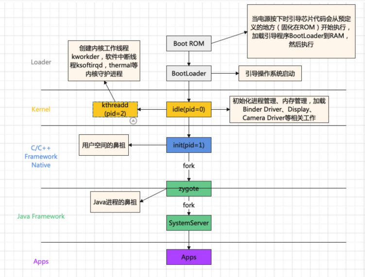
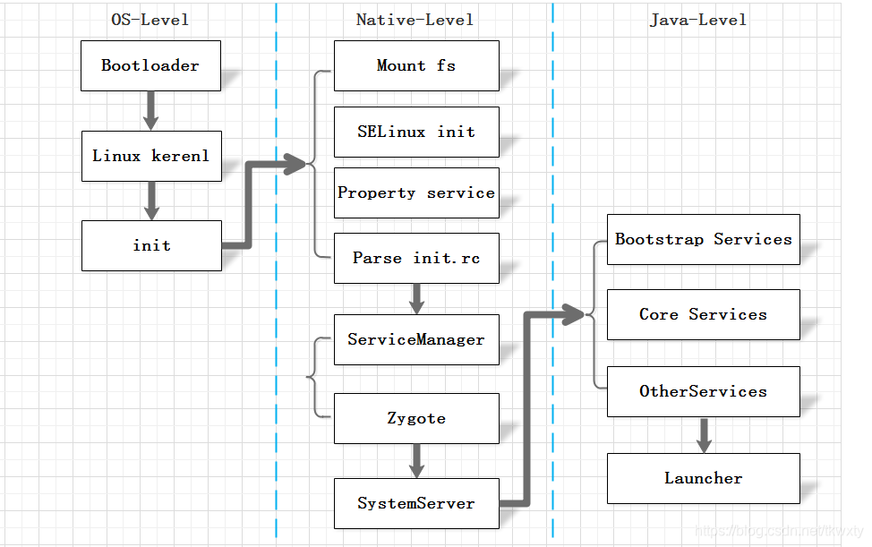
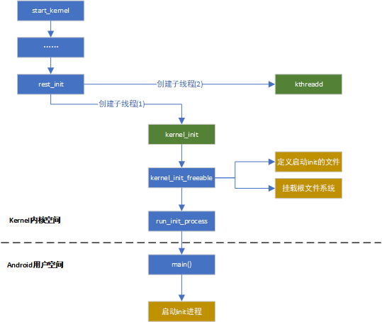
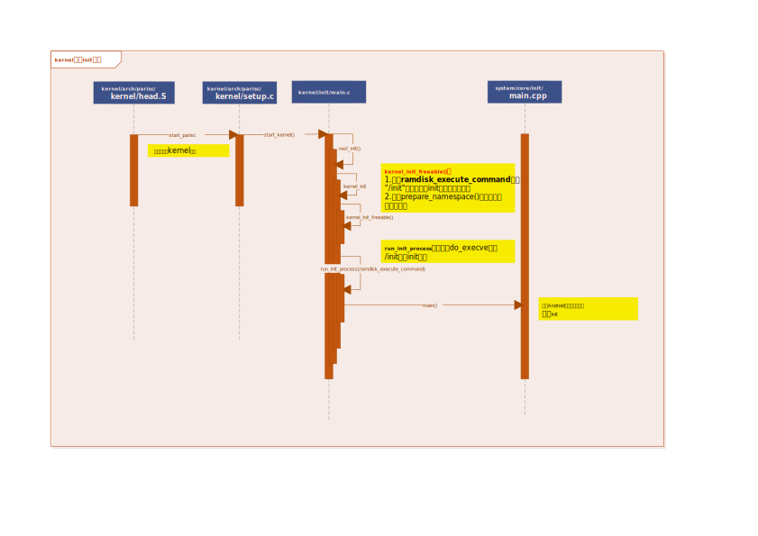
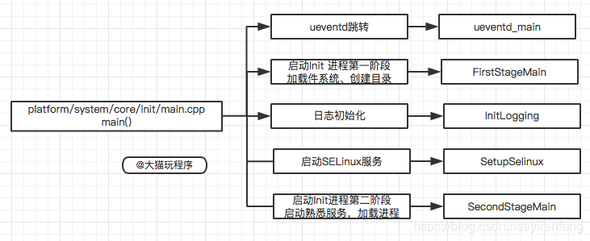
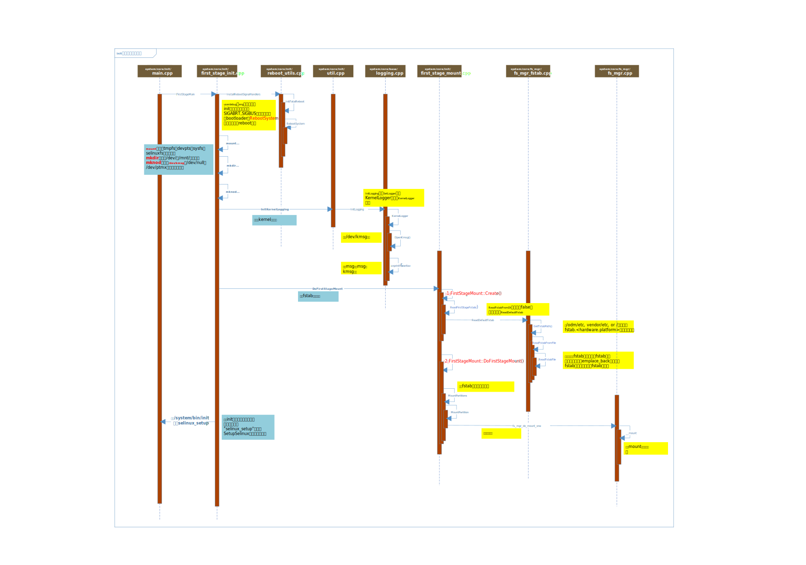
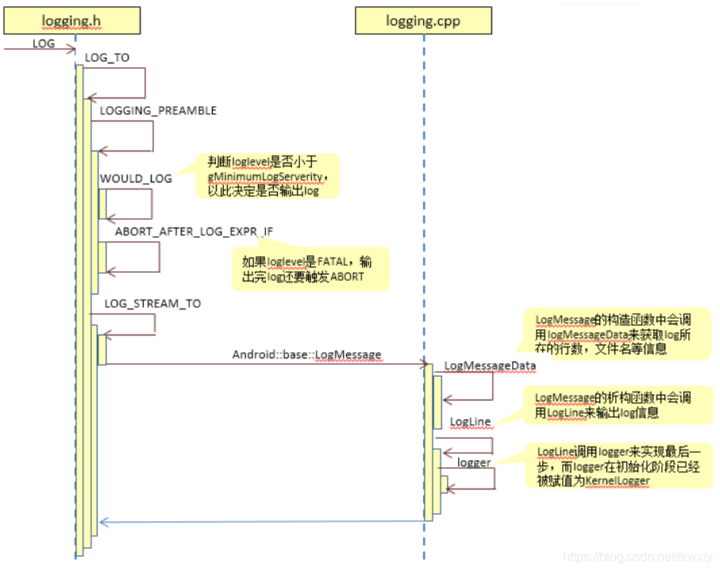
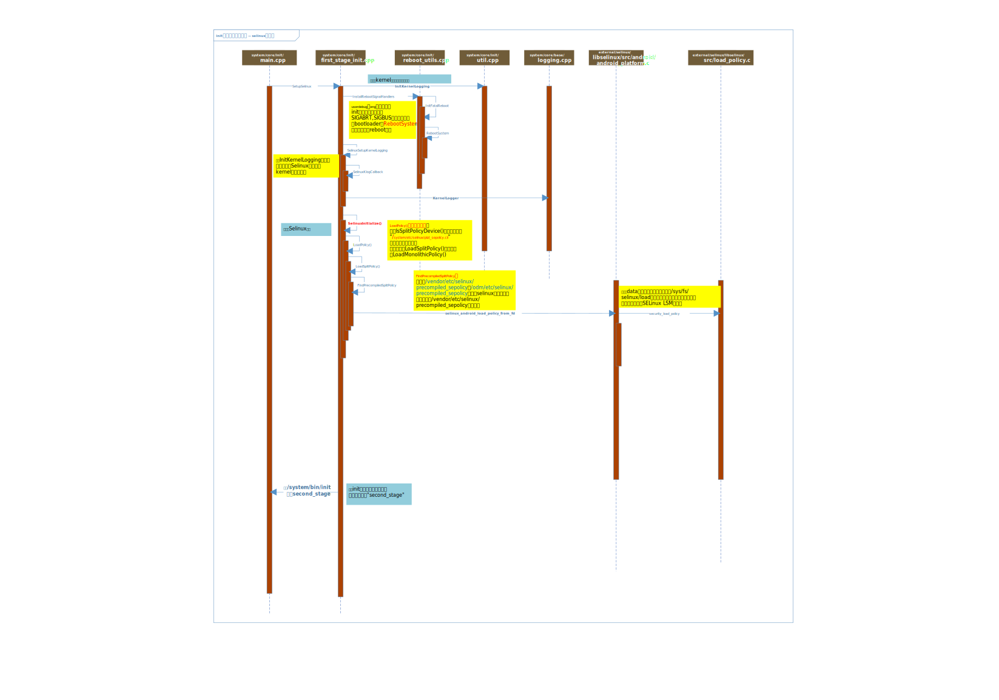
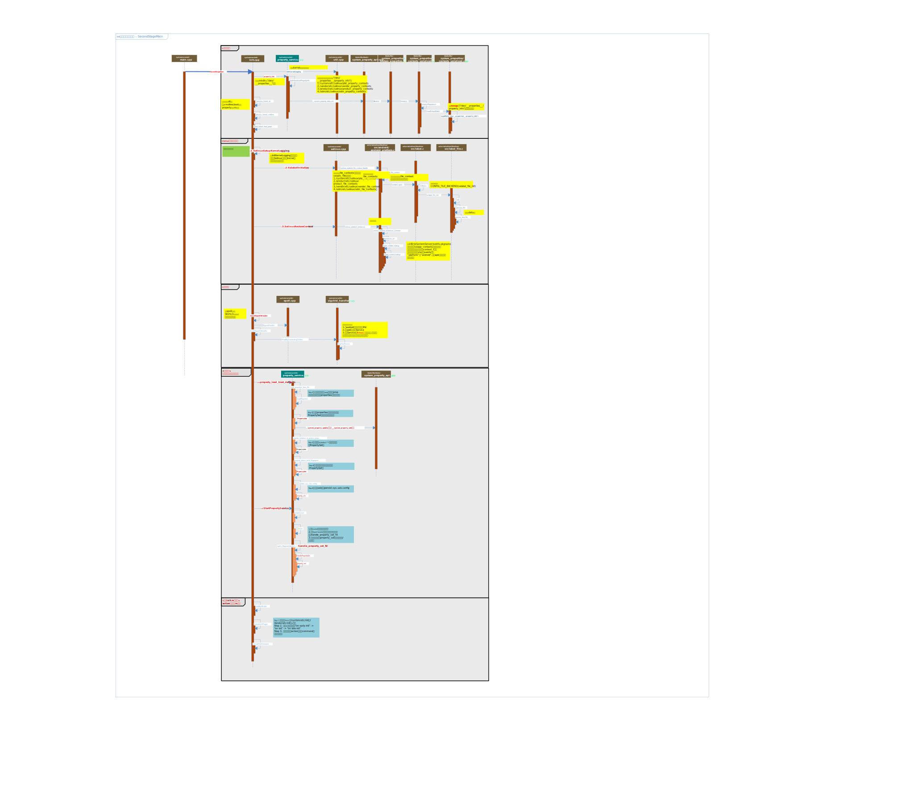

> 本篇介绍Android系统启动流程的开始阶段，从kernel内核空间启动第一个用户空间init进程，然后梳理init进程启动的几个阶段做了哪些任务。

***

# 1. Android系统启动整体流程概述

> 首先了解下Android系统启动的整体流程





1. **Boot Rom阶段**：启动电源时，引导芯片代码开始从预定义的地方(固化在ROM)开始执行。加载引导程序到RAM，然后执行。
2. **Bootloader阶段**：Bootloader（引导加载程序）是在Android操作系统开始运行前的一个小程序，负责加载和启动Linux内核。Bootloader的实现在不同设备和制造商之间可能有所不同，可能是开源实现如U-Boot或LK，或者厂商定制的版本，源码目录在`/bootable/`
3. **Linux Kernel启动阶段**：在Bootloader的帮助下，Linux内核开始启动。内核启动时，会进行系统缓存、内存保护、任务调度等设置，并加载必要的驱动程序。当内核完成系统设置，它首先在系统文件中寻找 "init" 文件，然后启动系统的第一个进程（init进程）
4. **Init进程启动阶段**：Init进程是Android系统中用户空间的第一个进程，进程号固定为1。Init进程的主要职责包括创建和挂载必要的文件目录、初始化属性服务、解析init.rc配置文件并启动Zygote进程等
5. **启动Android系统阶段**：Init进程根据`init.rc`文件的内容执行更多初始化任务，如启动Android的关键守护进程和Zygote进程。Zygote进程是所有应用进程的父进程，负责创建其他系统进程
6. **启动Launcher App阶段**：最后，系统启动用户空间的第一个App——Launcher App，标志着Android系统启动流程的完成

***

**PS：** 前面两个步骤不在此处详细说明，关于uboot启动以及uboot如何跳转到kernel内核，可以参阅这几篇文章了解：
+ [uboot启动流程源码分析](https://zhuanlan.zhihu.com/p/669600615)
+ [理清UBoot如何跳转Kernel—uboot与linux交界](https://zhuanlan.zhihu.com/p/669599871)
+ [linux与安卓的交界](https://zhuanlan.zhihu.com/p/631104181)

我们在kernel中只关注init进程的启动流程，所以本篇主题以kernel内核启动init进程开始梳理（以[Android 10 AOSP源码](http://aospxref.com/)为基准）

***

# 2. kernel内核启动init进程

> 我们从内核启动的`start_kernel`开始梳理（代码文件`kernel/init/main.c`），该内核入口函数的最后调用rest_init，然后`rest_init(void)`函数创建两个内核子线程，一个是kernel_init，另一个kthreadd

+ kernel_init线程：主要创建Android init一号进程
+ kthreadd线程：通过kernel_thread创建，并始终运行在内核空间, 负责所有内核线程的调度和管理（代码文件：`kernel/kernel/kthread.c`）



在内核代码`kernel/init/main.c -- kernel_init()`函数最后会通过调用`run_init_process`启动init进程。（Android系统一般会在根目录下放一个init的可执行文件，也就是说Linux系统的init进程在内核初始化完成后，就直接执行init这个文件）

其中`kernel_init_freeable`函数中有两点要关注：
1. 定义了ramdisk_execute_command变量的值为"/init"，用于寻找所要启动的init文件
2. 调用prepare_namespace()方法，该方法内部调用mount_root()，挂载根文件系统

```c
//代码文件kernel/init/main.c
static noinline void __init kernel_init_freeable(void)
{
    ....
	if (!ramdisk_execute_command)
		ramdisk_execute_command = "/init";

	if (sys_access((const char __user *) ramdisk_execute_command, 0) != 0) {
		ramdisk_execute_command = NULL;
		prepare_namespace();
	}
    ....
}

//在rest_init中创建子线程用于生成init进程，函数名就是kernel_init
static int __ref kernel_init(void *unused)
{
	int ret;
    //进行init进程的一些初始化操作
	kernel_init_freeable();
    .....
    //ramdisk_execute_command的值为"/init"
    //运行根目录下的init程序
	if (ramdisk_execute_command) {
		ret = run_init_process(ramdisk_execute_command);
		if (!ret)
			return 0;
		pr_err("Failed to execute %s (error %d)\n",
		       ramdisk_execute_command, ret);
	}
    ....
}
```

关于此处的`/init`进程，我们可以看下`/system/core/init/Android.bp`的模块定义

**PS：** stem字段定义了输出的基本文件名，是用于重命名输出的选项，比如此处编译模块名是`init_second_stage`，编译结束后`init_second_stage`会命名成`init`

```shell
cc_binary {
    name: "init_second_stage",
    recovery_available: true,
    stem: "init",
    defaults: ["init_defaults"],
    static_libs: ["libinit"],
    required: [
        "e2fsdroid",
        "init.rc",
        "mke2fs",
        "sload_f2fs",
        "make_f2fs",
        "ueventd.rc",
    ],
    srcs: ["main.cpp"],
    ....
```

而在adb shell进入文件系统看到根目录的`init`就是软链接指向`/system/bin/init`

```shell
 # ls -thl |grep init
lrwxr-x---   1 root   shell    16 2009-01-01 08:00 init -> /system/bin/init
```

## 2.1. 序列图



***

# 3. init进程

> Android系统底层基于Linux Kernel, 当Kernel启动过程会创建init进程, 该进程是所有用户空间的鼻祖, 是Linux系统中用户空间的第一个进程。  

***

## 3.1. init进程启动入口main函数

init是Linux系统中用户空间的第一个进程(pid=1), 从上面`/system/core/init/Android.bp`的定义看，模块入口是`system/core/init/main.cpp -- main()`方法。

```shell
$ ps -A
USER           PID  PPID     VSZ    RSS WCHAN            ADDR S NAME
root             1     0   49852  10816 0                   0 S init
root             2     0       0      0 0                   0 S [kthreadd]
....
```

**代码如下：**

```cpp
//第一个参数argc表示参数个数，第二个参数是参数列表，也就是具体的参数
int main(int argc, char** argv) {
#if __has_feature(address_sanitizer)
    __asan_set_error_report_callback(AsanReportCallback);
#endif
    //修改当前进程优先级
    setpriority(PRIO_PROCESS, 0, -20);
    /*
    * 1.strcmp是String的一个函数，比较字符串，相等返回0
    * 2.C++中0也可以表示false
    * 3.basename是C库中的一个函数，得到特定的路径中的最后一个'/'后面的内容，
    * 比如/sdcard/miui_recovery/backup，得到的结果是backup
    */
    //当argv[0]的内容为ueventd时，strcmp的值为0,!strcmp为1
    //ueventd主要是负责设备节点的创建、权限设定等一系列工作
    if (!strcmp(basename(argv[0]), "ueventd")) {
        return ueventd_main(argc, argv);
    }
    //当传入的参数个数大于1时，执行下面的几个操作
    if (argc > 1) {
        //参数为subcontext，初始化日志系统
        if (!strcmp(argv[1], "subcontext")) {
            android::base::InitLogging(argv, &android::base::KernelLogger);
            const BuiltinFunctionMap& function_map;

            return SubcontextMain(argc, argv, &function_map);
        }
        //参数为“selinux_setup”,启动Selinux安全策略
        if (!strcmp(argv[1], "selinux_setup")) {
            return SetupSelinux(argv);
        }
        //参数为“second_stage”,启动init进程第二阶段
        if (!strcmp(argv[1], "second_stage")) {
            return SecondStageMain(argc, argv);
        }
    }
    //默认启动init进程第一阶段
    return FirstStageMain(argc, argv);
}
```

**单从main函数的代码内容看，init进程启动后主要做了以下工作（非程序执行顺序）：**
+ ueventd_main：创建子进程ueventd，并将创建设备节点文件的工作交给veventd。ueventd通过两种方式创建设备节点文件（冷启动和热启动），用来管理设备，如果有新设备插入，就会在/dev创建对应的设备文件。
+ FirstStageMain：启动init进程第一阶段（加载文件系统、创建目录、节点）
+ InitLogging：初始化日志系统
+ SetupSelinux：加载Selinux规则，并设置Selinux日志，完成Selinux相关工
+ SecondStageMain：启动init进程第二阶段（初始化属性、处理信号、解析init.rc文件等） 



***

### 3.1.1. main函数执行顺序（kernel日志示例）

以下是Android 10版本抓取的开机kernel日志，我们结合代码分析init进程的main函数执行顺序。从日志看，main函数的执行顺序是：
1. 执行FirstStageMain
2. 执行SetupSelinux
3. 执行SecondStageMain
4. 执行ueventd_main（此部分是在SecondStageMain的时候解析init.rc中调用，后续梳理）

```log
//-------------Step 1: 执行FirstStageMain
14,737,1909438,-;init: init first stage started!
14,738,1910109,-;init: Switching root to '/first_stage_ramdisk'
//挂载文件系统节点
6,744,2012037,-;EXT4-fs (mmcblk0p35): mounted filesystem with ordered data mode. Opts: 
//挂载system分区
14,745,2012182,-;init: [libfs_mgr]__mount(source=/dev/block/by-name/system_b,target=/system,type=ext4)=0: Success
14,746,2012616,-;init: Switching root to '/system'
14,747,2019657,-;init: [libfs_mgr]superblock s_max_mnt_count:65535,/dev/block/by-name/vendor_b
6,748,2024936,-;EXT4-fs (mmcblk0p37): mounted filesystem with ordered data mode. Opts: 
//挂载vendor分区
14,749,2025030,-;init: [libfs_mgr]__mount(source=/dev/block/by-name/vendor_b,target=/vendor,type=ext4)=0: Success
14,750,2061016,-;init: Skipped setting INIT_AVB_VERSION (not in recovery mode)
//-------------Step 2: 执行SetupSelinux初始化selinux权限
14,751,2212653,-;init: Loading SELinux policy
7,752,2238189,-;SELinux: 8192 avtab hash slots, 23703 rules.
7,753,2265557,-;SELinux: 8192 avtab hash slots, 23703 rules.
7,754,2265585,-;SELinux:  1 users, 4 roles, 1419 types, 0 bools, 1 sens, 1024 cats
7,755,2265606,-;SELinux:  97 classes, 23703 rules
6,756,2270004,-;SELinux:  Class rpmsg_socket not defined in policy.
6,757,2270022,-;SELinux: the above unknown classes and permissions will be denied
6,758,2270054,-;SELinux:  policy capability network_peer_controls=1
6,759,2270061,-;SELinux:  policy capability open_perms=1
6,760,2270068,-;SELinux:  policy capability extended_socket_class=1
6,761,2270075,-;SELinux:  policy capability always_check_network=0
6,762,2270081,-;SELinux:  policy capability cgroup_seclabel=0
6,763,2270088,-;SELinux:  policy capability nnp_nosuid_transition=1
7,764,2270095,-;SELinux:  Completing initialization.
7,765,2270101,-;SELinux:  Setting up existing superblocks.
6,766,2338067,-;[K] tp_enable=[0] i2c_master_send1: 0x4 0x1 
5,767,2495244,-;audit: type=1403 audit(5.136:2): policy loaded auid=4294967295 ses=4294967295
14,768,2495539,-;selinux: SELinux: Loaded policy from /vendor/etc/selinux/precompiled_sepolicy\x0a
14,769,2503260,-;selinux: SELinux: Loaded file_contexts\x0a
//-------------Step 3: 执行SecondStageMain
14,770,2560465,-;init: init second stage started!
14,771,2591159,-;init: Using Android DT directory /proc/device-tree/firmware/android/
14,772,2596877,-;selinux: SELinux: Loaded file_contexts\x0a
//SelinuxRestoreContext函数打印
14,773,2596914,-;init: Running restorecon...
12,774,2606364,-;init: Couldn't load property file '/system/etc/prop.default': open() failed: No such file or directory: No such file or directory
12,775,2606444,-;init: Couldn't load property file '/prop.default': open() failed: No such file or directory: No such file or directory
12,776,2610584,-;init: Overriding previous 'ro.' property 'pm.dexopt.first-boot':'quicken' with new value 'speed'
12,777,2610921,-;init: Couldn't load property file '/vendor/default.prop': open() failed: No such file or directory: No such file or directory
12,778,2614148,-;init: Couldn't load property file '/product_services/build.prop': open() failed: No such file or directory: No such file or directory
12,779,2614210,-;init: Couldn't load property file '/factory/factory.prop': open() failed: No such file or directory: No such file or directory
//-------------Step 4:执行ueventd_main
14,783,2866884,-;ueventd: ueventd started!
14,784,2870766,-;selinux: SELinux: Loaded file_contexts\x0a
//解析uevent.rc文件
14,785,2871030,-;ueventd: Parsing file /ueventd.rc...
14,786,2872643,-;ueventd: Parsing file /vendor/ueventd.rc...
14,787,2872693,-;ueventd: Unable to read config file '/vendor/ueventd.rc': open() failed: No such file or directory
14,788,2872755,-;ueventd: Parsing file /odm/ueventd.rc...
14,789,2872798,-;ueventd: Unable to read config file '/odm/ueventd.rc': open() failed: No such file or directory
14,790,2872922,-;ueventd: Parsing file /ueventd.{product}.rc...
14,791,2876994,-;apexd: Bootstrap subcommand detected
14,792,2897540,-;apexd: Scanning /system/apex for embedded keys
14,793,2899450,-;apexd: Scanning /product/apex for embedded keys
14,794,2899967,-;apexd: ... does not exist. Skipping
14,795,2900655,-;apexd: Scanning /system/apex looking for APEX packages.
14,796,2901208,-;apexd: Found /system/apex/com.android.conscrypt
14,797,2901966,-;apexd: Skipped when bootstrapping
14,798,2902448,-;apexd: Found /system/apex/com.android.media
14,799,2903155,-;apexd: Skipped when bootstrapping
14,800,2903594,-;apexd: Found /system/apex/com.android.media.swcodec
4,801,2919017,-;apexd: 9 output lines suppressed due to ratelimiting
5,802,2935927,-;audit: type=1400 audit(5.576:3): avc:  denied  { nosuid_transition } for  pid=1904 comm="init" scontext=u:r:init:s0 tcontext=u:r:init-insmod-sh:s0 tclass=process2 permissive=1
5,803,2947227,-;audit: type=1400 audit(5.588:4): avc:  denied  { nosuid_transition } for  pid=1917 comm="init" scontext=u:r:init:s0 tcontext=u:r:hal_graphics_allocator_default:s0 tclass=process2 permissive=1
//ueventd执行结束
14,804,3223055,-;ueventd: Coldboot took 0.347 seconds
....
```


## 3.2. （1）FirstStageMain -- 启动init进程第一阶段

> 第一阶段主要进行创建设备节点和一些关键目录、初始化kernel日志输出系统、挂载分区、AVB初始化。

```cpp
//system/core/init/first_stage_init.cpp
int FirstStageMain(int argc, char** argv) {
    //init crash时重启引导加载程序（panic）
    //这个函数主要作用将各种信号量，如SIGABRT,SIGBUS等的行为设置为SA_RESTART,一旦监听到这些信号即执行重启系统
    //REBOOT_BOOTLOADER_ON_PANIC在system/core/init/Android.mk中定义，userdebug和eng版本的固件中，则会打开该选项
    if (REBOOT_BOOTLOADER_ON_PANIC) {
        //调用到system/core/init/reboot_utils.cpp方法，然后调用InitFatalReboot()，再调用RebootSystem重启
        InstallRebootSignalHandlers();
    }
    .....
    // Clear the umask.清空文件权限
    umask(0);
    ....
    //1.挂载tmpsfs、devpts、proc、sysfs和selinuxfs五种文件系统，这些都是系统运行时目录，系统停止时会消失
    //2.创建目录/dev/pts，/dev/socket
    //3.创建节点/dev/kmsg，/dev/kmsg_debug，/dev/random，/dev/urandom，/dev/ptmx，/dev/null
    CHECKCALL(mount("tmpfs", "/dev", "tmpfs", MS_NOSUID, "mode=0755")); //节点目录
    CHECKCALL(mkdir("/dev/pts", 0755));
    CHECKCALL(mkdir("/dev/socket", 0755));
    //devpts文件系统用于为android终端设备提供模拟终端会话界面，类似于使用telnet或ssh与一个传统的UNIX服务器进行连接
    CHECKCALL(mount("devpts", "/dev/pts", "devpts", 0, NULL));
#define MAKE_STR(x) __STRING(x)
    CHECKCALL(mount("proc", "/proc", "proc", 0, "hidepid=2,gid=" MAKE_STR(AID_READPROC)));//进程信息
#undef MAKE_STR
    //存储内核启动保存的一些参数，比如AB分区的运行
    CHECKCALL(chmod("/proc/cmdline", 0440));
    gid_t groups[] = {AID_READPROC};
    CHECKCALL(setgroups(arraysize(groups), groups));
    CHECKCALL(mount("sysfs", "/sys", "sysfs", 0, NULL)); //设备系统目录
    CHECKCALL(mount("selinuxfs", "/sys/fs/selinux", "selinuxfs", 0, NULL));//selinuxfs文件系统

    CHECKCALL(mknod("/dev/kmsg", S_IFCHR | 0600, makedev(1, 11)));//内核日志节点

    if constexpr (WORLD_WRITABLE_KMSG) {
        CHECKCALL(mknod("/dev/kmsg_debug", S_IFCHR | 0622, makedev(1, 11)));
    }

    CHECKCALL(mknod("/dev/random", S_IFCHR | 0666, makedev(1, 8)));
    CHECKCALL(mknod("/dev/urandom", S_IFCHR | 0666, makedev(1, 9)));

    // This is needed for log wrapper, which gets called before ueventd runs.
    CHECKCALL(mknod("/dev/ptmx", S_IFCHR | 0666, makedev(5, 2)));
    CHECKCALL(mknod("/dev/null", S_IFCHR | 0666, makedev(1, 3)));

    //mnt挂载点目录，一般用于挂载外部存储设备、U盘、SD卡等外部存储设备
    CHECKCALL(mount("tmpfs", "/mnt", "tmpfs", MS_NOEXEC | MS_NOSUID | MS_NODEV,
                    "mode=0755,uid=0,gid=1000"));
    //创建/mnt/vendor和/mnt/product目录
    CHECKCALL(mkdir("/mnt/vendor", 0755));
    CHECKCALL(mkdir("/mnt/product", 0755));
    //挂载APEX，这在Android 10.0中特殊引入，用来解决碎片化问题，类似一种组件方式，对Treble的增强，
    //不写谷歌特殊更新不需要完整升级整个系统版本，只需要像升级APK一样，进行APEX组件升级
    CHECKCALL(mount("tmpfs", "/apex", "tmpfs", MS_NOEXEC | MS_NOSUID | MS_NODEV,
                    "mode=0755,uid=0,gid=0"));
    // /debug_ramdisk is used to preserve additional files from the debug ramdisk
    CHECKCALL(mount("tmpfs", "/debug_ramdisk", "tmpfs", MS_NOEXEC | MS_NOSUID | MS_NODEV,
                    "mode=0755,uid=0,gid=0"));
#undef CHECKCALL
    //调用system/core/init/util.cpp的方法
    //把标准输入、标准输出和标准错误(即stdin/stdout/stderr)重定向到空设备文件"/dev/null"
    SetStdioToDevNull(argv);
    //调用system/core/init/util.cpp的方法，然后调用InitLogging入参KernelLogger
    //上面已经在/dev目录下挂载好tmpfs以及kmsg节点，此处可以初始化/kernel Log系统，供用户打印log
    InitKernelLogging(argv);

    //此处会在内核kernel中打印日志！
    LOG(INFO) << "init first stage started!";

    auto old_root_dir = std::unique_ptr<DIR, decltype(&closedir)>{opendir("/"), closedir};
    if (!old_root_dir) {
        PLOG(ERROR) << "Could not opendir(\"/\"), not freeing ramdisk";
    }

    struct stat old_root_info;
    if (stat("/", &old_root_info) != 0) {
        PLOG(ERROR) << "Could not stat(\"/\"), not freeing ramdisk";
        old_root_dir.reset();
    }

    //从/proc/cmdline中读取androidboot.force_normal_boot=1则执行
    if (ForceNormalBoot()) {
        mkdir("/first_stage_ramdisk", 0755);
        // SwitchRoot() must be called with a mount point as the target, so we bind mount the
        // target directory to itself here.
        if (mount("/first_stage_ramdisk", "/first_stage_ramdisk", nullptr, MS_BIND, nullptr) != 0) {
            LOG(FATAL) << "Could not bind mount /first_stage_ramdisk to itself";
        }
        //调用system/core/init/switch_root.cpp方法
        //以装载点为目标进行调用，因此我们在此处将装载目标目录绑定到其自身(节点/proc/mounts)
        SwitchRoot("/first_stage_ramdisk");
    }

    //如果存在此文件，则第二阶段init将使用userdebug sepolicy并加载adb_debug.prop以允许adb root（如果设备已解锁）
    if (access("/force_debuggable", F_OK) == 0) {
        std::error_code ec;  // to invoke the overloaded copy_file() that won't throw.
        if (!fs::copy_file("/adb_debug.prop", kDebugRamdiskProp, ec) ||
            !fs::copy_file("/userdebug_plat_sepolicy.cil", kDebugRamdiskSEPolicy, ec)) {
            LOG(ERROR) << "Failed to setup debug ramdisk";
        } else {
            // setenv for second-stage init to read above kDebugRamdisk* files.
            setenv("INIT_FORCE_DEBUGGABLE", "true", 1);
        }
    }

    //调用system/core/init/first_stage_mount.cpp
    //初始化一些必须的分区，主要作用是去解析/proc/device-tree/firmware/android/fstab,然后得到"/system", "/vendor", "/odm"三个目录的挂载信息
    //此处会调用到system/core/fs_mgr/fs_mgr_fstab.cpp，文件系统的分区挂载信息读取解析，可后续补充梳理关注！！！
    if (!DoFirstStageMount()) {
        LOG(FATAL) << "Failed to mount required partitions early ...";
    }

    struct stat new_root_info;
    if (stat("/", &new_root_info) != 0) {
        PLOG(ERROR) << "Could not stat(\"/\"), not freeing ramdisk";
        old_root_dir.reset();
    }

    if (old_root_dir && old_root_info.st_dev != new_root_info.st_dev) {
        FreeRamdisk(old_root_dir.get(), old_root_info.st_dev);
    }
    //初始化安全框架AVB（Android Verified Boot）
    //AVB主要用于防止系统文件本身被篡改，还包含了防止系统回滚的功能，以免有人试图回滚系统并利用以前的漏洞
    SetInitAvbVersionInRecovery();

    static constexpr uint32_t kNanosecondsPerMillisecond = 1e6;
    uint64_t start_ms = start_time.time_since_epoch().count() / kNanosecondsPerMillisecond;
    setenv("INIT_STARTED_AT", std::to_string(start_ms).c_str(), 1);

    //此处将执行init启动的第二个步骤，就是传入参数"selinux_setup"，执行SetupSelinux
    const char* path = "/system/bin/init";
    const char* args[] = {path, "selinux_setup", nullptr};
    execv(path, const_cast<char**>(args));
    ....
    return 1;
}
```

***

### 3.2.1. 序列图



***

### 3.2.2. （1.1）挂载文件系统/创建目录/节点

> 这些操作使用mount、mkdir、mknod命令直接实现

+ **挂载文件系统：**

设备|类型|挂载目录
:-:|:-:|:-:
tmpfs|tmpfs|/dev
devpts|devpts|/dev/pts
proc|proc|/proc
sysfs|sysfs|/sys
selinuxfs|selinuxfs|/sys/fs/selinux
tmpfs|tmpfs|/mnt
tmpfs|tmpfs|/apex
tmpfs|tmpfs|/debug_ramdisk

+ **创建文件夹：**

```shell
/dev/pts
/dev/socket
/mnt/vendor
/mnt/product
```

+ **创建字符设备文件：**

```shell
/dev/kmsg
/dev/kmsg_debug
/dev/random
/dev/urandom
/dev/ptmx
/dev/null
```

***

### 3.2.3. （1.2）InitKernelLogging日志初始化

#### 3.2.3.1. 流程梳理

```log
1.system/core/init/first_stage_init.cpp - FirstStageMain先调用SetStdioToDevNull，然后调用InitKernelLogging
2.system/core/init/util.cpp - InitKernelLogging调用android::base::InitLogging入参KernelLogger
3.system/core/base/logging.cpp - InitLogging
---> SetLogger
    ---> KernelLogger
```

#### 3.2.3.2. 代码说明

```cpp
//system/core/init/util.cpp
void SetStdioToDevNull(char** argv) {
    //将stdin/stdout/stderr重定向到/dev/null，关闭默认控制台输出
    int fd = open("/dev/null", O_RDWR);
    ....
    if (fd > STDERR_FILENO) close(fd);
}
//初始化内核log
void InitKernelLogging(char** argv) {
    SetFatalRebootTarget();
    android::base::InitLogging(argv, &android::base::KernelLogger, InitAborter);
}
```

入参android::base::KernelLogger，即此处LogFunction类型的logger。查看SetLogger代码定义，此处就是执行KernelLogger方法

```cpp
//system/core/base/logging.cpp
static bool gInitialized = false;
void InitLogging(char* argv[], LogFunction&& logger, AbortFunction&& aborter) {
  SetLogger(std::forward<LogFunction>(logger));
  SetAborter(std::forward<AbortFunction>(aborter));
  //默认值false
  if (gInitialized) {
    return;
  }

  gInitialized = true;

  .....
}

void KernelLogger(android::base::LogId, android::base::LogSeverity severity,
                  const char* tag, const char*, unsigned int, const char* msg) {
  .....
  //打开/dev/kmsg节点
  static int klog_fd = OpenKmsg();
  if (klog_fd == -1) return;

  ....
  // The kernel's printk buffer is only 1024 bytes.
  // TODO: should we automatically break up long lines into multiple lines?
  // Or we could log but with something like "..." at the end?
  //内核的printk缓冲区只有1024个字节
  char buf[1024];
  size_t size = snprintf(buf, sizeof(buf), "<%d>%s: %s\n", level, tag, msg);
  if (size > sizeof(buf)) {
    size = snprintf(buf, sizeof(buf), "<%d>%s: %zu-byte message too long for printk\n",
                    level, tag, size);
  }

  iovec iov[1];
  iov[0].iov_base = buf;
  iov[0].iov_len = size;
  //日志信息写入/dev/kmsg节点
  TEMP_FAILURE_RETRY(writev(klog_fd, iov, 1));
}
```

#### 3.2.3.3. log打印输出原理流程

> 在前面的分析中，我们讲解了init log系统的初始化。关于log的输出流程，可以以下面的输出例子说明：

`LOG(INFO) << "init first stage started!";`

内核打印：`14,1169,11337125,-;init: init first stage started!`

该流程大致如下（此处不详细说明，参考文章《[init进程启动源码分析指南之一](https://blog.csdn.net/tkwxty/article/details/106020050)》）：



在`system/core/base/include/android-base/logging.h`中看到`LOG(INFO)`的定义：

```cpp
//severity是log等级
#define LOG(severity) LOG_TO(DEFAULT, severity)
#define LOG_TO(dest, severity) LOGGING_PREAMBLE(severity) && LOG_STREAM_TO(dest, severity)

//WOULD_LOG是判断log等级是否小于设定值，以决定是否输出
//此处默认值是static LogSeverity gMinimumLogSeverity = INFO;
#define LOGGING_PREAMBLE(severity)                                                         \
  (WOULD_LOG(severity) &&                                                                  \
   ABORT_AFTER_LOG_EXPR_IF((SEVERITY_LAMBDA(severity)) == ::android::base::FATAL, true) && \
   ::android::base::ErrnoRestorer())

//LogMessage方法
#define LOG_STREAM_TO(dest, severity)                                           \
  ::android::base::LogMessage(__FILE__, __LINE__, ::android::base::dest,        \
                              SEVERITY_LAMBDA(severity), _LOG_TAG_INTERNAL, -1) \
      .stream()
```

LogMessage的析构函数会调用到LogLine，从而调用到logger：

```cpp
//system/core/base/logging.cpp
//创建LogMessageData对象，保存log message（行数、文件名等）
LogMessage::LogMessage(const char* file, unsigned int line, LogId id, LogSeverity severity,
                       const char* tag, int error)
    : data_(new LogMessageData(file, line, id, severity, tag, error)) {}

LogMessage::~LogMessage() {
  // Check severity again. This is duplicate work wrt/ LOG macros, but not LOG_STREAM.
  //检测log等级
  if (!WOULD_LOG(data_->GetSeverity())) {
    return;
  }
    ....
    // Do the actual logging with the lock held.
    std::lock_guard<std::mutex> lock(LoggingLock());
    if (msg.find('\n') == std::string::npos) {
      LogLine(data_->GetFile(), data_->GetLineNumber(), data_->GetId(), data_->GetSeverity(),
              data_->GetTag(), msg.c_str());
    } else {
      msg += '\n';
      size_t i = 0;
      while (i < msg.size()) {
        size_t nl = msg.find('\n', i);
        msg[nl] = '\0';
        LogLine(data_->GetFile(), data_->GetLineNumber(), data_->GetId(), data_->GetSeverity(),
                data_->GetTag(), &msg[i]);
        // Undo the zero-termination so we can give the complete message to the aborter.
        msg[nl] = '\n';
        i = nl + 1;
      }
    }
    ....
}

void LogMessage::LogLine(const char* file, unsigned int line, LogId id, LogSeverity severity,
                         const char* tag, const char* message) {
  if (tag == nullptr) {
    .....
    //调用Logger，而参考其定义，此处就是KernelLogger
    Logger()(id, severity, gDefaultTag->c_str(), file, line, message);
  } else {
    Logger()(id, severity, tag, file, line, message);
  }
}
```

***

### 3.2.4. （1.3）DoFirstStageMount挂载分区

#### 3.2.4.1. 流程梳理

```log
1.system/core/init/first_stage_init.cpp - FirstStageMain调用DoFirstStageMount
2.system/core/init/first_stage_mount.cpp - DoFirstStageMount
    ---> 2.1调用FirstStageMount类Create方法
        ---> 调用ReadFirstStageFstab 读取fstab文件
            ---> system/core/fs_mgr/fs_mgr_fstab.cpp - ReadFstabFromDt()会打印日志读取失败，然后调用ReadDefaultFstab
            ---> GetFstabPath获取配置fstab文件路径
            ---> ReadFstabFromFile读取fstab文件，解析fstab文件

    ---> 2.2调用FirstStageMount类DoFirstStageMount方法
        ---> 执行FirstStageMount::MountPartitions()方法遍历fstab的分区
        ---> 执行FirstStageMount::MountPartition挂载单个分区
        --->  system/core/fs_mgr/fs_mgr.cpp - fs_mgr_do_mount_one执行mount操作挂载
            ---> 调用__mount然后执行mount命令实现挂载
```

#### 3.2.4.2. 代码说明

```cpp
//system/core/init/first_stage_mount.cpp
// Public functions
// ----------------
//公共方法，在设备树中挂载fstab指定的分区
bool DoFirstStageMount() {
    //recovery模式则跳过不执行，此判断就是看是否存在/system/bin/recovery文件
    if (IsRecoveryMode()) {
        LOG(INFO) << "First stage mount skipped (recovery mode)";
        return true;
    }
    //1.创建FirstStageMount类，调用构造函数和Create方法
    std::unique_ptr<FirstStageMount> handle = FirstStageMount::Create();
    if (!handle) {
        LOG(ERROR) << "Failed to create FirstStageMount";
        return false;
    }
    //2.调用FirstStageMount类的DoFirstStageMount
    return handle->DoFirstStageMount();
}
```

**按该方法分两部分梳理：**

##### 3.2.4.2.1. 获取fstab文件并解析

```cpp
//system/core/init/first_stage_mount.cpp
// Class Definitions
// -----------------
std::unique_ptr<FirstStageMount> FirstStageMount::Create() {
    //读取fastab文件
    auto fstab = ReadFirstStageFstab();
    .....
}

static Fstab ReadFirstStageFstab() {
    Fstab fstab;
    //Step 1 先从设备树文件中读取Fstab文件，如果失败了则调用ReadDefaultFstab读取默认的fstab
    //从本地抓取的日志看，是直接调用的ReadDefaultFstab
    if (!ReadFstabFromDt(&fstab)) {
        //Step 2 读取fstab文件
        if (ReadDefaultFstab(&fstab)) {
            fstab.erase(std::remove_if(fstab.begin(), fstab.end(),
                                       [](const auto& entry) {
                                           return !entry.fs_mgr_flags.first_stage_mount;
                                       }),
                        fstab.end());
        } else {
            LOG(INFO) << "Failed to fstab for first stage mount";
        }
    }
    //返回结果fstab对象
    return fstab;
}
```

```cpp
//system/core/fs_mgr/fs_mgr_fstab.cpp
// fstab.<hardware.platform> in folders /odm/etc, vendor/etc, or /.
//在/odm/etc, vendor/etc, or /目录寻找fstab.<hardware.platform>文件！！！
std::string GetFstabPath() {
    //硬件平台
    for (const char* prop : {"hardware", "hardware.platform"}) {
        std::string hw;
        if (!fs_mgr_get_boot_config(prop, &hw)) continue;
        //编译搜寻fstab文件
        for (const char* prefix : {"/odm/etc/fstab.", "/vendor/etc/fstab.", "/fstab."}) {
            std::string fstab_path = prefix + hw;
            if (access(fstab_path.c_str(), F_OK) == 0) {
                return fstab_path;
            }
        }
    }
    return "";
}

// Loads the fstab file and combines with fstab entries passed in from device tree.
bool ReadDefaultFstab(Fstab* fstab) {
    .....
    std::string default_fstab_path;
    // Use different fstab paths for normal boot and recovery boot, respectively
    if (access("/system/bin/recovery", F_OK) == 0) {
        default_fstab_path = "/etc/recovery.fstab";
    } else {  // normal boot
        //Step 1:正常启动，获取fastab的路径
        default_fstab_path = GetFstabPath();
    }

    Fstab default_fstab;
    if (!default_fstab_path.empty()) {
        //Step 2: 从文件中读取fstab分区，解析fstab文件
        ReadFstabFromFile(default_fstab_path, &default_fstab);
    } else {
        LINFO << __FUNCTION__ << "(): failed to find device default fstab";
    }
    //将读取的fstab文件结果push到fstab对象中！
    for (auto&& entry : default_fstab) {
        fstab->emplace_back(std::move(entry));
    }
    return !fstab->empty();
}
```

##### 3.2.4.2.2. 挂载fstab分区

```cpp
//system/core/init/first_stage_mount.cpp
bool FirstStageMount::DoFirstStageMount() {
    if (!IsDmLinearEnabled() && fstab_.empty()) {
        // Nothing to mount.
        LOG(INFO) << "First stage mount skipped (missing/incompatible/empty fstab in device tree)";
        return true;
    }

    if (!InitDevices()) return false;

    if (!CreateLogicalPartitions()) return false;
    //挂载分区
    if (!MountPartitions()) return false;

    return true;
}

bool FirstStageMount::MountPartitions() {
    if (!TrySwitchSystemAsRoot()) return false;
    if (!SkipMountingPartitions(&fstab_)) return false;
    //遍历fstab文件的分区列表
    for (auto current = fstab_.begin(); current != fstab_.end();) {
        // We've already mounted /system above.
        if (current->mount_point == "/system") {
            ++current;
            continue;
        }

        Fstab::iterator end;
        //挂载分区
        if (!MountPartition(current, false /* erase_same_mounts */, &end)) {
            if (current->fs_mgr_flags.no_fail) {
                LOG(INFO) << "Failed to mount " << current->mount_point
                          << ", ignoring mount for no_fail partition";
            } else if (current->fs_mgr_flags.formattable) {
                LOG(INFO) << "Failed to mount " << current->mount_point
                          << ", ignoring mount for formattable partition";
            } else {
                PLOG(ERROR) << "Failed to mount " << current->mount_point;
                return false;
            }
        }
        current = end;
    }
    .....
}

bool FirstStageMount::MountPartition(const Fstab::iterator& begin, bool erase_same_mounts,
                                     Fstab::iterator* end) {
    .....
    bool mounted = (fs_mgr_do_mount_one(*begin) == 0);

    // Try other mounts with the same mount point.
    Fstab::iterator current = begin + 1;
    for (; current != fstab_.end() && current->mount_point == begin->mount_point; current++) {
        if (!mounted) {
            // blk_device is already updated to /dev/dm-<N> by SetUpDmVerity() above.
            // Copy it from the begin iterator.
            current->blk_device = begin->blk_device;
            //挂载分区
            mounted = (fs_mgr_do_mount_one(*current) == 0);
        }
    }
    if (erase_same_mounts) {
        current = fstab_.erase(begin, current);
    }
    if (end) {
        *end = current;
    }
    return mounted;
}
```

```cpp
//system/core/fs_mgr/fs_mgr.cpp
int fs_mgr_do_mount_one(const FstabEntry& entry, const std::string& mount_point) {
    // Run fsck if needed
    prepare_fs_for_mount(entry.blk_device, entry);

    int ret =
    //挂载
            __mount(entry.blk_device, mount_point.empty() ? entry.mount_point : mount_point, entry);
    if (ret) {
      ret = (errno == EBUSY) ? FS_MGR_DOMNT_BUSY : FS_MGR_DOMNT_FAILED;
    }

    return ret;
}

static int __mount(const std::string& source, const std::string& target, const FstabEntry& entry) {
    // We need this because sometimes we have legacy symlinks that are
    // lingering around and need cleaning up.
    struct stat info;
    if (lstat(target.c_str(), &info) == 0 && (info.st_mode & S_IFMT) == S_IFLNK) {
        unlink(target.c_str());
    }
    mkdir(target.c_str(), 0755);
    errno = 0;
    unsigned long mountflags = entry.flags;
    int ret = 0;
    int save_errno = 0;
    do {
        if (save_errno == EAGAIN) {
            PINFO << "Retrying mount (source=" << source << ",target=" << target
                  << ",type=" << entry.fs_type << ")=" << ret << "(" << save_errno << ")";
        }
        //执行挂载命令
        ret = mount(source.c_str(), target.c_str(), entry.fs_type.c_str(), mountflags,
                    entry.fs_options.c_str());
        save_errno = errno;
    } while (ret && save_errno == EAGAIN);
    .....
    //日志打印，可在内核日志中查看
    PINFO << __FUNCTION__ << "(source=" << source << source_missing << ",target=" << target
          << target_missing << ",type=" << entry.fs_type << ")=" << ret;
    return ret;
}
```

***

## 3.3. （2）SetupSelinux -- 权限策略初始化配置

> 在上一个步骤执行的最后，会调用"/system/bin/init"入参selinux_setup，进入第二个步骤selinux的初始化设置，调用SetupSelinux方法。
> 在执行结束后入参second_stage，调用SecondStageMain方法

### 3.3.1. 序列图



***

### 3.3.2. 编译SElinux方式

编译命令：`make sepolicy -j48`或`make selinux_policy -j48`

如果make编译过了，可使用ninja编译，不到一分钟就可以编译完成:

+ `time prebuilts/build-tools/linux-x86/bin/ninja -f out/combined-XXXX.ninja -j48 selinux_policy`
+ `time prebuilts/build-tools/linux-x86/bin/ninja -f out/combined-XXXX.ninja -j48 sepolicy.recovery`

编译结果会把生成的文件`\out\target\product\XXXX\obj\ETC\vendor_sepolicy.cil_intermediates\vendor_sepolicy.cil`push到`out\target\product\XXXX\vendor\etc\selinux\vendor_sepolicy.cil`(文件系统`/vendor/etc/selinux`) 目录下

***

### 3.3.3. 流程说明

> 参考：[SEAndroid安全机制框架分析](https://blog.csdn.net/lfcaolibin/article/details/43674569)
> 参考：[Android selinux策略文件的编译与加载](https://www.jb51.net/article/277418.htm)

```cpp
1.system/core/init/first_stage_init.cpp - FirstStageMain调用init程序，入参selinux_setup
2.system/core/init/main.cpp - main函数执行SetupSelinux
3.system/core/init/selinux.cpp - SetupSelinux
    ---> 3.1 调用SelinuxInitialize()
        ---> 3.1.1 调用LoadPolicy()
            ---> 调用IsSplitPolicyDevice()判断是否存在"/system/etc/selinux/plat_sepolicy.cil"文件，正常都存在该文件
            ---> 调用LoadSplitPolicy()，此方法最主要的就是调用FindPrecompiledSplitPolicy
            ---> FindPrecompiledSplitPolicy依次从/vendor/etc/selinux/precompiled_sepolicy和/odm/etc/selinux/precompiled_sepolicy中寻找selinux预编译文件，一般是从/vendor/etc/selinux/   precompiled_sepolicy中获取selinux文件！
            ---> 调用selinux_android_load_policy_from_fd方法，入参selinux文件
            ---> external/selinux/libselinux/src/android/android_platform.c - selinux_android_load_policy_from_fd
            ---> external/selinux/libselinux/src/load_policy.c - security_load_policy将sepolicy写入到selinuxfs文件系统的load文件中

        ---> 3.1.2 调用IsEnforcing，然后调用StatusFromCmdline()获取android自定义的selinux权限状态，即从/proc/cmdline中读取androidboot.selinux的值
            ---> 调用security_setenforce，入参IsEnforcing，设置当前selinux状态，将其值0/1写入/sys/fs/selinux/enforce节点
            ---> 将0写入/sys/fs/selinux/checkreqprot节点，该值决定selinux通过程序"1"还是内核"0"响应进行安全检查
    ---> 3.2 执行"/system/bin/init"，入参second_stage，进入下一个步骤
```

***

### 3.3.4. 代码说明

```cpp
//system/core/init/first_stage_init.cpp
int FirstStageMain(int argc, char** argv) {
    .....
    //此处将执行init启动的第二个步骤，就是传入参数"selinux_setup"，执行SetupSelinux
    const char* path = "/system/bin/init";
    const char* args[] = {path, "selinux_setup", nullptr};
    execv(path, const_cast<char**>(args));
    ....
}
```

```cpp
//system/core/init/selinux.cpp
// This function initializes SELinux then execs init to run in the init SELinux context.
int SetupSelinux(char** argv) {
    //初始化kernel内核日志
    InitKernelLogging(argv);
    //异常重启
    if (REBOOT_BOOTLOADER_ON_PANIC) {
        InstallRebootSignalHandlers();
    }

    // Set up SELinux, loading the SELinux policy.
    //将selinux日志重定向到内核日志输出(dev/kmsg)
    SelinuxSetupKernelLogging();
    //Step 1：初始化selinux策略
    SelinuxInitialize();
    .....
    //Step 2：继续下一个init启动步骤，入参second_stage，调用SecondStageMain
    const char* path = "/system/bin/init";
    const char* args[] = {path, "second_stage", nullptr};
    execv(path, const_cast<char**>(args));

    // execv() only returns if an error happened, in which case we
    // panic and never return from this function.
    PLOG(FATAL) << "execv(\"" << path << "\") failed";

    return 1;
}

//IsSplitPolicyDevice()判断是否存在"/system/etc/selinux/plat_sepolicy.cil"文件，正常都存在该文件，执行前者
//LoadSplitPolicy最主要的就是调用FindPrecompiledSplitPolicy：
//依次从/vendor/etc/selinux/precompiled_sepolicy"和"/odm/etc/selinux/precompiled_sepolicy"中寻找selinux预编译文件
//一般是从"/vendor/etc/selinux/precompiled_sepolicy"中获取selinux文件！
constexpr const char plat_policy_cil_file[] = "/system/etc/selinux/plat_sepolicy.cil";

bool IsSplitPolicyDevice() {
    return access(plat_policy_cil_file, R_OK) != -1;
}
bool LoadPolicy() {
    return IsSplitPolicyDevice() ? LoadSplitPolicy() : LoadMonolithicPolicy();
}

void SelinuxInitialize() {
    Timer t;

    LOG(INFO) << "Loading SELinux policy";
    //Step 1：加载policy文件
    if (!LoadPolicy()) {
        LOG(FATAL) << "Unable to load SELinux policy";
    }
    //获取内核selinux状态
    bool kernel_enforcing = (security_getenforce() == 1);
    //获取Android自定义selinux状态
    bool is_enforcing = IsEnforcing();
    //判断是否一样，设置当前selinux状态，就是将值0/1写入到/sys/fs/selinux/enforce节点
    if (kernel_enforcing != is_enforcing) {
        if (security_setenforce(is_enforcing)) {
            PLOG(FATAL) << "security_setenforce(%s) failed" << (is_enforcing ? "true" : "false");
        }
    }
    //设置节点0，该值决定selinux通过程序"1"还是内核"0"响应进行安全检查
    if (auto result = WriteFile("/sys/fs/selinux/checkreqprot", "0"); !result) {
        LOG(FATAL) << "Unable to write to /sys/fs/selinux/checkreqprot: " << result.error();
    }

    // init's first stage can't set properties, so pass the time to the second stage.
    //获取selinux策略加载时间并设置到环境遍历INIT_SELINUX_TOOK
    setenv("INIT_SELINUX_TOOK", std::to_string(t.duration().count()).c_str(), 1);
}

bool LoadSplitPolicy() {
    // 在adb shell查看echo $INIT_FORCE_DEBUGGABLE值为空，所以use_userdebug_policy是false
    const char* force_debuggable_env = getenv("INIT_FORCE_DEBUGGABLE");
    bool use_userdebug_policy =
            ((force_debuggable_env && "true"s == force_debuggable_env) &&
             AvbHandle::IsDeviceUnlocked() && access(kDebugRamdiskSEPolicy, F_OK) == 0);
    if (use_userdebug_policy) {
        LOG(WARNING) << "Using userdebug system sepolicy";
    }

    std::string precompiled_sepolicy_file;
    //核心函数FindPrecompiledSplitPolicy
    if (!use_userdebug_policy && FindPrecompiledSplitPolicy(&precompiled_sepolicy_file)) {
        unique_fd fd(open(precompiled_sepolicy_file.c_str(), O_RDONLY | O_CLOEXEC | O_BINARY));
        if (fd != -1) {
            //核心函数selinux_android_load_policy_from_fd
            //入参是打开/vendor/etc/selinux/precompiled_sepolicy的fd节点
            if (selinux_android_load_policy_from_fd(fd, precompiled_sepolicy_file.c_str()) < 0) {
                LOG(ERROR) << "Failed to load SELinux policy from " << precompiled_sepolicy_file;
                return false;
            }
            //返回
            return true;
        }
    }
    // No suitable precompiled policy could be loaded
    .....
    return true;
}

//主要是对比两对文件的sha256值，如果一致则返回true（一般返回true）
bool FindPrecompiledSplitPolicy(std::string* file) {
    file->clear();
    //依次从/vendor/etc/selinux/precompiled_sepolicy和/odm/etc/selinux/precompiled_sepolicy中寻找selinux预编译文件，
    //一般是从/vendor/etc/selinux/precompiled_sepolicy中获取selinux文件
    //file值是/vendor/etc/selinux/precompiled_sepolicy
    static constexpr const char vendor_precompiled_sepolicy[] =
        "/vendor/etc/selinux/precompiled_sepolicy";
    static constexpr const char odm_precompiled_sepolicy[] =
        "/odm/etc/selinux/precompiled_sepolicy";
    if (access(odm_precompiled_sepolicy, R_OK) == 0) {
        *file = odm_precompiled_sepolicy;
    } else if (access(vendor_precompiled_sepolicy, R_OK) == 0) {
        *file = vendor_precompiled_sepolicy;
    } else {
        PLOG(INFO) << "No precompiled sepolicy";
        return false;
    }
    //此处对比/system/etc/selinux/plat_sepolicy_and_mapping.sha256和/vendor/etc/selinux/precompiled_sepolicy.plat_sepolicy_and_mapping.sha256的值
    std::string actual_plat_id;
    if (!ReadFirstLine("/system/etc/selinux/plat_sepolicy_and_mapping.sha256", &actual_plat_id)) {
        PLOG(INFO) << "Failed to read "
                      "/system/etc/selinux/plat_sepolicy_and_mapping.sha256";
        return false;
    }

    //此处对比/product/etc/selinux/product_sepolicy_and_mapping.sha256和/vendor/etc/selinux/precompiled_sepolicy.product_sepolicy_and_mapping.sha256的值
    std::string actual_product_id;
    if (!ReadFirstLine("/product/etc/selinux/product_sepolicy_and_mapping.sha256",
                       &actual_product_id)) {
        PLOG(INFO) << "Failed to read "
                      "/product/etc/selinux/product_sepolicy_and_mapping.sha256";
        return false;
    }

    std::string precompiled_plat_id;
    std::string precompiled_plat_sha256 = *file + ".plat_sepolicy_and_mapping.sha256";
    if (!ReadFirstLine(precompiled_plat_sha256.c_str(), &precompiled_plat_id)) {
        PLOG(INFO) << "Failed to read " << precompiled_plat_sha256;
        file->clear();
        return false;
    }
    std::string precompiled_product_id;
    std::string precompiled_product_sha256 = *file + ".product_sepolicy_and_mapping.sha256";
    if (!ReadFirstLine(precompiled_product_sha256.c_str(), &precompiled_product_id)) {
        PLOG(INFO) << "Failed to read " << precompiled_product_sha256;
        file->clear();
        return false;
    }
    if (actual_plat_id.empty() || actual_plat_id != precompiled_plat_id ||
        actual_product_id.empty() || actual_product_id != precompiled_product_id) {
        file->clear();
        return false;
    }
    return true;
}
```

**本地在设备的文件目录下查看这两对文件的内容值：**

```shell
Product:/system/etc/selinux # more plat_sepolicy_and_mapping.sha256
ee0de9c3569fc8123fdbe7ab09cbf241cbf14933b745cbed1e5d689608890258
Product:/system/etc/selinux #
Product:/ # cd vendor/etc/selinux/
Product:/vendor/etc/selinux # more precompiled_sepolicy.plat_sepolicy_and_mapping.sha256
ee0de9c3569fc8123fdbe7ab09cbf241cbf14933b745cbed1e5d689608890258
Product:/vendor/etc/selinux #
Product:/vendor/etc/selinux # more precompiled_sepolicy.product_sepolicy_and_mapping.sha256
e3b0c44298fc1c149afbf4c8996fb92427ae41e4649b934ca495991b7852b855
Product:/vendor/etc/selinux # more /pro
proc/             product/          product_services
Product:/vendor/etc/selinux # more /produ
product/          product_services
Product:/vendor/etc/selinux # more /product/etc/selinux/product_sepolicy_and_mapping.sha256
e3b0c44298fc1c149afbf4c8996fb92427ae41e4649b934ca495991b7852b855
```

在之后就是调用selinux_android_load_policy_from_fd方法，入参就是FindPrecompiledSplitPolicy方法查找到的"/vendor/etc/selinux/precompiled_sepolicy"文件。

```cpp
//external/selinux/libselinux/src/android/android_platform.c
int selinux_android_load_policy_from_fd(int fd, const char *description)
{
	int rc;
	struct stat sb;
	void *map = NULL;
	static int load_successful = 0;
    ...
	set_selinuxmnt(SELINUXMNT);
    //将fd文件状态复制到sb对象
	if (fstat(fd, &sb) < 0) {
		selinux_log(SELINUX_ERROR, "SELinux:  Could not stat %s:  %s\n",
				description, strerror(errno));
		return -1;
	}
    //文件映射到内存
	map = mmap(NULL, sb.st_size, PROT_READ, MAP_PRIVATE, fd, 0);
	if (map == MAP_FAILED) {
		selinux_log(SELINUX_ERROR, "SELinux:  Could not map %s:  %s\n",
				description, strerror(errno));
		return -1;
	}
    //该函数由selinux.h定义，它将此map即sepolicy文件加载到/sys/fs/selinux/load内核中
    //第一个步骤中创建了selinuxfs文件系统，目录就是/sys/fs/selinux
    //由于/sys/fs/selinux是由内核空间的SELinux LSM模块导出来的文件系统接口，因此当我们将安全策略写入到位于该文件系统中的load文件时，就相当于是将安全策略从用户空间加载到SELinux LSM模块中去了。以后SELinux LSM模块中的Security Server就可以通过它来进行安全检查
    //external/selinux/libselinux/src/load_policy.c
	rc = security_load_policy(map, sb.st_size);
	if (rc < 0) {
		selinux_log(SELINUX_ERROR, "SELinux:  Could not load policy:  %s\n",
				strerror(errno));
		munmap(map, sb.st_size);
		return -1;
	}

	munmap(map, sb.st_size);
	selinux_log(SELINUX_INFO, "SELinux: Loaded policy from %s\n", description);
	load_successful = 1;
	return 0;
}
```

***

## 3.4. （3）SecondStageMain -- 启动init进程第三阶段

### 3.4.1. 流程说明

```cpp
1.system/core/init/selinux.cpp - SetupSelinux调用init程序，执行"/system/bin/init"，入参second_stage，进入下一个步骤
2.system/core/init/main.cpp - main函数执行SecondStageMain
3.system/core/init/init.cpp - SecondStageMain
    ---> (1) property_init 读取属性文件写入到"/dev/__properties__/property_info"然后加载到共享内存
    ---> (2) process_kernel_dt 处理设备树中定义的属性，设置并赋值为"ro.boot.***"属性
    ---> (3) process_kernel_cmdline 读取proc/cmdline并将"androidboot.***"的值设置为"ro.boot.***"属性
    ---> (4) SelabelInitialize()初始化selinux，SelinuxRestoreContext()恢复selinux上下文信息
    ---> (5) InstallSignalFdHandler信号处理
    ---> (6) property_load_boot_defaults和StartPropertyService加载开机默认属性配置以及启动属性服务
    ---> (7) LoadBootScripts加载解析init.rc等rc文件
    ---> (8) 通过action机制按rc文件的session顺序运行rc文件"on early-init -> on init -> on late-init"
```

### 3.4.2. 序列图



***

### 3.4.3. 入口函数代码说明

```cpp
//system/core/init/selinux.cpp
int SetupSelinux(char** argv) {
    .....
    //此处将执行init启动的第三个步骤，就是传入参数"second_stage"
    //然后执行system/core/init/main.cpp - main函数的SecondStageMain
    const char* path = "/system/bin/init";
    const char* args[] = {path, "second_stage", nullptr};
    execv(path, const_cast<char**>(args));

    // execv() only returns if an error happened, in which case we
    // panic and never return from this function.
    PLOG(FATAL) << "execv(\"" << path << "\") failed";

    return 1;
}
```

执行system/core/init/main.cpp - main函数的SecondStageMain：

```cpp
//system/core/init/init.cpp
int SecondStageMain(int argc, char** argv) {
    .....
    //内核日志打印
    InitKernelLogging(argv);
    LOG(INFO) << "init second stage started!";

    //设置init进程及fork的子进程的优先级（-1000最高）
    if (auto result = WriteFile("/proc/1/oom_score_adj", "-1000"); !result) {
        LOG(ERROR) << "Unable to write -1000 to /proc/1/oom_score_adj: " << result.error();
    }
    //从/proc/cmdline中读取androidboot.seccomp是否是global值以启动全局seccomp
    //Secure Computing mode是Linux内核提供的一种安全机制，用于在用户态应用程序执行系统调用时进行过滤和限制。
    //其原理是基于对系统调用号的过滤和限制，以及对系统调用参数的校验
    GlobalSeccomp();
    //设置所有进程都可以访问的会话密钥环
    keyctl_get_keyring_ID(KEY_SPEC_SESSION_KEYRING, 1);
    //创建 /dev/.booting 文件，就是个标记，表示booting进行中
    close(open("/dev/.booting", O_WRONLY | O_CREAT | O_CLOEXEC, 0000));

    //--------Step 1: 初始化属性系统，并从指定文件读取属性
    property_init();

    // If arguments are passed both on the command line and in DT,
    // properties set in DT always have priority over the command-line ones.
    //处理DT属性，DT即device-tree设备树，这里面记录自己的硬件配置和系统运行参数
    process_kernel_dt();
    //处理命令行属性，即/proc/cmdline
    process_kernel_cmdline();

    // Propagate the kernel variables to internal variables
    // used by init as well as the current required properties.
    //将内核变量传播到init使用的内部变量以及当前所需的属性
    // 处理一些其他的属性(ro属性)
    export_kernel_boot_props();

    // Make the time that init started available for bootstat to log.
    property_set("ro.boottime.init", getenv("INIT_STARTED_AT"));
    property_set("ro.boottime.init.selinux", getenv("INIT_SELINUX_TOOK"));

    // Set libavb version for Framework-only OTA match in Treble build.
    const char* avb_version = getenv("INIT_AVB_VERSION");
    if (avb_version) property_set("ro.boot.avb_version", avb_version);

    // 在adb shell查看echo $INIT_FORCE_DEBUGGABLE值为空，所以force_debuggable_env是false，所以load_debug_prop是默认值false
    const char* force_debuggable_env = getenv("INIT_FORCE_DEBUGGABLE");
    if (force_debuggable_env && AvbHandle::IsDeviceUnlocked()) {
        load_debug_prop = "true"s == force_debuggable_env;
    }

    // Clean up our environment.
    //上面将环境变量设置到ro属性中，此处清空环境变量
    unsetenv("INIT_STARTED_AT");
    unsetenv("INIT_SELINUX_TOOK");
    unsetenv("INIT_AVB_VERSION");
    unsetenv("INIT_FORCE_DEBUGGABLE");

    //-----Step 2:进行Selinux第二阶段工作
    //将selinux日志重定向到内核日志输出(dev/kmsg)
    SelinuxSetupKernelLogging();
    //第二阶段初始化selinux
    SelabelInitialize();
    //恢复安全上下文，进行SELinux第二阶段并恢复一些文件安全上下文 
    //恢复相关文件的安全上下文,因为这些文件是在SELinux安全机制初始化前创建的，所以需要重新恢复上下文
    SelinuxRestoreContext();

    //-----Step 3: 创建epoll句柄并初始化子进程终止信号处理函数
    //要是创建handler处理子进程终止信号，注册一个signal到epoll进行监听，进行子继承处理
    Epoll epoll;
    if (auto result = epoll.Open(); !result) {
        PLOG(FATAL) << result.error();
    }

    InstallSignalFdHandler(&epoll);

    //-----Step 4:加载开机默认属性配置以及启动属性服务（同第一步都是系统属性相关）
    property_load_boot_defaults(load_debug_prop);
    UmountDebugRamdisk();
    fs_mgr_vendor_overlay_mount_all();
    export_oem_lock_status();
    // 设置其他系统属性并开启系统属性服务
    StartPropertyService(&epoll);
    MountHandler mount_handler(&epoll);
    //为USB存储设置udc Contorller, sys/class/udc
    set_usb_controller();
    //匹配命令和函数之间的对应关系
    const BuiltinFunctionMap function_map;
    Action::set_function_map(&function_map);

    if (!SetupMountNamespaces()) {
        PLOG(FATAL) << "SetupMountNamespaces failed";
    }
    // 初始化文件上下文
    subcontexts = InitializeSubcontexts();

    //-----Step 5: 解析init.rc等文件，建立rc文件的action 、service，启动其他进程
    ActionManager& am = ActionManager::GetInstance();
    ServiceList& sm = ServiceList::GetInstance();
    LoadBootScripts(am, sm);

    // Make the GSI status available before scripts start running.
    //当GSI脚本running时，确保GSI状态可用
    if (android::gsi::IsGsiRunning()) {
        property_set("ro.gsid.image_running", "1");
    } else {
        property_set("ro.gsid.image_running", "0");
    }
    //Action机制，添加action
    am.QueueBuiltinAction(SetupCgroupsAction, "SetupCgroups");
    // 执行rc文件中触发器为 on early-init 的语句
    am.QueueEventTrigger("early-init");
    // Queue an action that waits for coldboot done so we know ueventd has set up all of /dev...
    // 等冷插拔设备初始化完成
    am.QueueBuiltinAction(wait_for_coldboot_done_action, "wait_for_coldboot_done");
    // ... so that we can start queuing up actions that require stuff from /dev.
    //开始查询来自 /dev的 action
    am.QueueBuiltinAction(MixHwrngIntoLinuxRngAction, "MixHwrngIntoLinuxRng");
    am.QueueBuiltinAction(SetMmapRndBitsAction, "SetMmapRndBits");
    am.QueueBuiltinAction(SetKptrRestrictAction, "SetKptrRestrict");
    //设备组合键的初始化操作
    Keychords keychords;
    am.QueueBuiltinAction(
        [&epoll, &keychords](const BuiltinArguments& args) -> Result<Success> {
            for (const auto& svc : ServiceList::GetInstance()) {
                keychords.Register(svc->keycodes());
            }
            keychords.Start(&epoll, HandleKeychord);
            return Success();
        },
        "KeychordInit");
    //在屏幕上显示Android 静态LOGO
    am.QueueBuiltinAction(console_init_action, "console_init");
    // Trigger all the boot actions to get us started.
    //执行rc文件中触发器为on init的语句
    am.QueueEventTrigger("init");

    // Starting the BoringSSL self test, for NIAP certification compliance.
    am.QueueBuiltinAction(StartBoringSslSelfTest, "StartBoringSslSelfTest");

    // Repeat mix_hwrng_into_linux_rng in case /dev/hw_random or /dev/random
    // wasn't ready immediately after wait_for_coldboot_done
    am.QueueBuiltinAction(MixHwrngIntoLinuxRngAction, "MixHwrngIntoLinuxRng");

    // Initialize binder before bringing up other system services
    am.QueueBuiltinAction(InitBinder, "InitBinder");

    // Don't mount filesystems or start core system services in charger mode.
    //当设备处于充电模式时，不需要mount文件系统或者启动系统服务
    //充电模式下，将charger假如执行队列，否则把late-init加入执行队列
    std::string bootmode = GetProperty("ro.bootmode", "");
    if (bootmode == "charger") {
        am.QueueEventTrigger("charger");
    } else {
        am.QueueEventTrigger("late-init");
    }

    // Run all property triggers based on current state of the properties.
    // 基于属性当前状态 运行所有的属性触发器.
    am.QueueBuiltinAction(queue_property_triggers_action, "queue_property_triggers");

    while (true) {
        // By default, sleep until something happens.
        auto epoll_timeout = std::optional<std::chrono::milliseconds>{};

        if (do_shutdown && !shutting_down) {
            do_shutdown = false;
            if (HandlePowerctlMessage(shutdown_command)) {
                shutting_down = true;
            }
        }
        //依次执行每个action中携带command对应的执行函数
        if (!(waiting_for_prop || Service::is_exec_service_running())) {
            am.ExecuteOneCommand();
        }
        if (!(waiting_for_prop || Service::is_exec_service_running())) {
            if (!shutting_down) {
                auto next_process_action_time = HandleProcessActions();

                // If there's a process that needs restarting, wake up in time for that.
                if (next_process_action_time) {
                    epoll_timeout = std::chrono::ceil<std::chrono::milliseconds>(
                            *next_process_action_time - boot_clock::now());
                    if (*epoll_timeout < 0ms) epoll_timeout = 0ms;
                }
            }

            // If there's more work to do, wake up again immediately.
            if (am.HasMoreCommands()) epoll_timeout = 0ms;
        }
        // 循环等待事件发生
        if (auto result = epoll.Wait(epoll_timeout); !result) {
            LOG(ERROR) << result.error();
        }
    }

    return 0;
}
```

***

### 3.4.4. Step 1：property_init初始化属性系统，并从指定文件读取属性

> 参考：[Android 系统属性（SystemProperties）介绍](https://juejin.cn/post/7274932704453672972)

```shell
system/core/init/property_service.cpp - property_init
    --->  mkdir创建/dev/__properties__文件目录
    --->  调用CreateSerializedPropertyInfo读取各个目录下的属性权限property_contexts文件，解析写到property_infos容器中，然后写到/dev/__properties__/property_info
        --->  调用__system_property_area_init初始化属性内存共享区域
            ---> bionic/libc/bionic/system_property_api.cpp - __system_property_area_init
            ---> bionic/libc/system_properties/system_properties.cpp - AreaInit
            ---> bionic/libc/system_properties/contexts_serialized.cpp - Initialize然后调用InitializeProperties()，然后调用property_info_area_file_.LoadDefaultPath()
            ---> system/core/property_service/libpropertyinfoparser/property_info_parser.cpp - LoadDefaultPath
                ---> 调用LoadPath("/dev/__properties__/property_info")
                ---> 通过mmap将"/dev/__properties__/property_info"加载到共享内存
        ---> 调用selinux_android_restorecon恢复/dev/__properties__/property_info的安全上下文信息
```

```cpp
//system/core/init/property_service.cpp
void property_init() {
    //创建/dev/__properties__文件目录
    mkdir("/dev/__properties__", S_IRWXU | S_IXGRP | S_IXOTH);
    CreateSerializedPropertyInfo();
    //bionic/libc/bionic/system_property_api.cpp
    //初始化属性内存共享区域
    //该方法经过一系列的方法调用，最终通过mmap()将/dev/__properties__/property_info加载到共享内存
    if (__system_property_area_init()) {
        LOG(FATAL) << "Failed to initialize property area";
    }
    if (!property_info_area.LoadDefaultPath()) {
        LOG(FATAL) << "Failed to load serialized property info file";
    }
}

//读取各个目录下的属性权限property_contexts文件，解析写到property_infos容器中
void CreateSerializedPropertyInfo() {
    auto property_infos = std::vector<PropertyInfoEntry>();
    if (access("/system/etc/selinux/plat_property_contexts", R_OK) != -1) {
        if (!LoadPropertyInfoFromFile("/system/etc/selinux/plat_property_contexts",
                                      &property_infos)) {
            return;
        }
        // Don't check for failure here, so we always have a sane list of properties.
        // E.g. In case of recovery, the vendor partition will not have mounted and we
        // still need the system / platform properties to function.
        if (!LoadPropertyInfoFromFile("/vendor/etc/selinux/vendor_property_contexts",
                                      &property_infos)) {
            // Fallback to nonplat_* if vendor_* doesn't exist.
            LoadPropertyInfoFromFile("/vendor/etc/selinux/nonplat_property_contexts",
                                     &property_infos);
        }
        if (access("/product/etc/selinux/product_property_contexts", R_OK) != -1) {
            LoadPropertyInfoFromFile("/product/etc/selinux/product_property_contexts",
                                     &property_infos);
        }
        if (access("/odm/etc/selinux/odm_property_contexts", R_OK) != -1) {
            LoadPropertyInfoFromFile("/odm/etc/selinux/odm_property_contexts", &property_infos);
        }
    } else {
        if (!LoadPropertyInfoFromFile("/plat_property_contexts", &property_infos)) {
            return;
        }
        if (!LoadPropertyInfoFromFile("/vendor_property_contexts", &property_infos)) {
            // Fallback to nonplat_* if vendor_* doesn't exist.
            LoadPropertyInfoFromFile("/nonplat_property_contexts", &property_infos);
        }
        LoadPropertyInfoFromFile("/product_property_contexts", &property_infos);
        LoadPropertyInfoFromFile("/odm_property_contexts", &property_infos);
    }

    auto serialized_contexts = std::string();
    auto error = std::string();
    //property_infos写到serialized_contexts中
    if (!BuildTrie(property_infos, "u:object_r:default_prop:s0", "string", &serialized_contexts,
                   &error)) {
        LOG(ERROR) << "Unable to serialize property contexts: " << error;
        return;
    }
    //将serialized_contexts写到/dev/__properties__/property_info
    constexpr static const char kPropertyInfosPath[] = "/dev/__properties__/property_info";
    if (!WriteStringToFile(serialized_contexts, kPropertyInfosPath, 0444, 0, 0, false)) {
        PLOG(ERROR) << "Unable to write serialized property infos to file";
    }
    //同下一个步骤SelinuxRestoreContext的流程
    selinux_android_restorecon(kPropertyInfosPath, 0);
}
```

***

### 3.4.5. Step 2：进行Selinux第二阶段工作

从上面的入口函数看，继初始化SElinux之后的第二阶段调用到的是以下几个函数，其中第一个SelinuxSetupKernelLogging是日志输出。主要是后面两个函数：

```cpp
//system/core/init/init.cpp
int SecondStageMain(int argc, char** argv) {
    .....
    //-----Step 2:进行Selinux第二阶段工作
    //将selinux日志重定向到内核日志输出(dev/kmsg)
    SelinuxSetupKernelLogging();
    //第二阶段初始化selinux
    SelabelInitialize();
    //恢复安全上下文，进行SELinux第二阶段并恢复一些文件安全上下文 
    //恢复相关文件的安全上下文,因为这些文件是在SELinux安全机制初始化前创建的，所以需要重新恢复上下文
    SelinuxRestoreContext();
    ...
}
```

```cpp
//system/core/init/selinux.cpp
//selinux_android_file_context_handle()的运行时间约为10+ms，因此我们希望缓存其值。
//selinux_android_restorecon()还需要一个sehandle来查找文件上下文。它将创建并存储自己的副本，但selinux_android_set_sehandle()可用于提供一个副本，从而消除了对selinux_adroid_file_context_handle()的额外调用。
void SelabelInitialize() {
    //均是external/selinux/libselinux/src/android/android_platform.c的函数
    sehandle = selinux_android_file_context_handle();
    //只是做了保存上面sehandle作为android_platform.c里面的全局变量
    selinux_android_set_sehandle(sehandle);
}
```

#### 3.4.5.1. SelabelInitialize->selinux_android_file_context_handle流程

> 详细的分析参考：[SEAndroid流程分析](https://blog.csdn.net/qq_27061049/article/details/130152818)
> [SEAndroid流程分析](https://blog.csdn.net/Invoker123/article/details/78999058)
>
> selinux_android_file_context_handle()返回的是一个保存了/file_conetxts各种信息及相关处理函数的struct selabel_handle指针，并将其保存在静态全局指针fc_sehandle中，这部分系统中的文件安全上下文有关

```shell
system/core/init/init.cpp - SecondStageMain
---> system/core/init/selinux.cpp - SelabelInitialize
---> external/selinux/libselinux/src/android/android_platform.c - selinux_android_file_context_handle 将四个目录下的file_contexts文件添加到seopts_file容器中
        （/system/etc/selinux/plat_file_contexts、/product/etc/selinux/product_file_contexts、/vendor/etc/selinux/vendor_file_contexts、/odm/etc/selinux/odm_file_contexts）
    ---> 调用selinux_android_file_context
---> external/selinux/libselinux/src/label.c - selabel_open 分配一块内存，将入参即file_context文件列表内容写到这块内存中，用于后面调用方法入参
    ---> 调用initfuncs[backend])(rec, opts, nopts)，其中backend入参是0，所以会调用到下面的第一个方法CONFIG_FILE_BACKEND(selabel_file_init)
---> external/selinux/libselinux/src/label_file.c - selabel_file_init
    ---> 调用init(rec, opts, nopts)
    ---> 遍历file_context文件列表调用process_file
        ---> （1）调用open_file打开file_contexts文件
        ---> （2）调用process_text_file，然后while循环逐行读取调用process_line
            ---> external/selinux/libselinux/src/label_file.h - process_line解析file_context文件内容保存上下文
```

```c
//external/selinux/libselinux/src/android/android_platform.c
static const char *const sepolicy_file = "/sepolicy";

//此处的selinux_opt是结构体对象（external/selinux/libselinux/include/selinux/selinux.h）
struct selinux_opt {
	int type;
	const char *value;
};

static const struct selinux_opt seopts_file_plat[] = {
    { SELABEL_OPT_PATH, "/system/etc/selinux/plat_file_contexts" },
    { SELABEL_OPT_PATH, "/plat_file_contexts" }
};
static const struct selinux_opt seopts_file_product[] = {
    { SELABEL_OPT_PATH, "/product/etc/selinux/product_file_contexts" },
    { SELABEL_OPT_PATH, "/product_file_contexts" }
};
static const struct selinux_opt seopts_file_vendor[] = {
    { SELABEL_OPT_PATH, "/vendor/etc/selinux/vendor_file_contexts" },
    { SELABEL_OPT_PATH, "/vendor_file_contexts" },
    // TODO: remove nonplat* when no need to retain backward compatibility.
    { SELABEL_OPT_PATH, "/vendor/etc/selinux/nonplat_file_contexts" },
    { SELABEL_OPT_PATH, "/nonplat_file_contexts" }
};
static const struct selinux_opt seopts_file_odm[] = {
    { SELABEL_OPT_PATH, "/odm/etc/selinux/odm_file_contexts" },
    { SELABEL_OPT_PATH, "/odm_file_contexts" }
};

//此函数就是将四个目录下的file_contexts文件添加到seopts_file变量中
struct selabel_handle* selinux_android_file_context_handle(void)
{
    struct selinux_opt seopts_file[MAX_FILE_CONTEXT_SIZE];//值为4
    int size = 0;
    unsigned int i;
    for (i = 0; i < ARRAY_SIZE(seopts_file_plat); i++) {
        if (access(seopts_file_plat[i].value, R_OK) != -1) {
            seopts_file[size++] = seopts_file_plat[i];
            break;
        }
    }
    for (i = 0; i < ARRAY_SIZE(seopts_file_product); i++) {
        if (access(seopts_file_product[i].value, R_OK) != -1) {
            seopts_file[size++] = seopts_file_product[i];
            break;
        }
    }
    for (i = 0; i < ARRAY_SIZE(seopts_file_vendor); i++) {
        if (access(seopts_file_vendor[i].value, R_OK) != -1) {
            seopts_file[size++] = seopts_file_vendor[i];
            break;
        }
    }
    for (i = 0; i < ARRAY_SIZE(seopts_file_odm); i++) {
        if (access(seopts_file_odm[i].value, R_OK) != -1) {
            seopts_file[size++] = seopts_file_odm[i];
            break;
        }
    }
    //将填充好的变量作为入参，调用selinux_android_file_context
    return selinux_android_file_context(seopts_file, size);
}

static struct selabel_handle* selinux_android_file_context(const struct selinux_opt *opts,
                                                    unsigned nopts)
{
    struct selabel_handle *sehandle;
    struct selinux_opt fc_opts[nopts + 1];
    //将入参opts拷贝到fc_opts变量中
    memcpy(fc_opts, opts, nopts*sizeof(struct selinux_opt));
    fc_opts[nopts].type = SELABEL_OPT_BASEONLY;
    fc_opts[nopts].value = (char *)1;
    //宏定义#define SELABEL_CTX_FILE	0
    sehandle = selabel_open(SELABEL_CTX_FILE, fc_opts, ARRAY_SIZE(fc_opts));
    if (!sehandle) {
        selinux_log(SELINUX_ERROR, "%s: Error getting file context handle (%s)\n",
                __FUNCTION__, strerror(errno));
        return NULL;
    }
    if (!compute_file_contexts_hash(fc_digest, opts, nopts)) {
        selabel_close(sehandle);
        return NULL;
    }

    selinux_log(SELINUX_INFO, "SELinux: Loaded file_contexts\n");

    return sehandle;
}
```

```c
//external/selinux/libselinux/src/label.c
struct selabel_handle *selabel_open(unsigned int backend,
				    const struct selinux_opt *opts,
				    unsigned nopts)
{
	struct selabel_handle *rec = NULL;

	if (backend >= ARRAY_SIZE(initfuncs)) {
		errno = EINVAL;
		goto out;
	}

	if (!initfuncs[backend]) {
		errno = ENOTSUP;
		goto out;
	}

	rec = (struct selabel_handle *)malloc(sizeof(*rec));
	if (!rec)
		goto out;
    //分配一块内存，将入参即file_context文件列表内容写到rec中
	memset(rec, 0, sizeof(*rec));
	rec->backend = backend;
	rec->validating = selabel_is_validate_set(opts, nopts);

	rec->digest = selabel_is_digest_set(opts, nopts, rec->digest);
    //调用initfuncs，其中backend入参是0，所以会调用到下面的第一个方法CONFIG_FILE_BACKEND(selabel_file_init)
	if ((*initfuncs[backend])(rec, opts, nopts)) {
		selabel_close(rec);
		rec = NULL;
	}
out:
	return rec;
}

static selabel_initfunc initfuncs[] = {
	CONFIG_FILE_BACKEND(selabel_file_init),
	CONFIG_MEDIA_BACKEND(selabel_media_init),
	CONFIG_X_BACKEND(selabel_x_init),
	CONFIG_DB_BACKEND(selabel_db_init),
	CONFIG_ANDROID_BACKEND(selabel_property_init),
	CONFIG_ANDROID_BACKEND(selabel_service_init),
};
```

```c
//external/selinux/libselinux/src/label_file.c
int selabel_file_init(struct selabel_handle *rec,
				    const struct selinux_opt *opts,
				    unsigned nopts)
{
	struct saved_data *data;

	data = (struct saved_data *)malloc(sizeof(*data));
	if (!data)
		return -1;
	memset(data, 0, sizeof(*data));

	rec->data = data;
	rec->func_close = &closef;
	rec->func_stats = &stats;
	rec->func_lookup = &lookup;
	rec->func_partial_match = &partial_match;
	rec->func_hash_all_partial_matches = &hash_all_partial_matches;
	rec->func_lookup_best_match = &lookup_best_match;
	rec->func_cmp = &cmp;
    //调用init进行data的初始化
	return init(rec, opts, nopts);
}

//init会解析/file_context文件的内容，将相关信息填充到入参rec的data成员中。
//填充过程会分为两次进行，第一次是计算安全上下文信息数量（spec_t的数量）及处理一些认证工作。
//第二次会依次关联安全上下文信息（spec_t）和根文件名信息（stem_t）,保存regex信息和context信息和确保没有重复的安全上下文信息（spec_t）。
//这些安全上下文信息（spec_t）会被保存在数组data->spec_arr中，根文件信息（stem_t）会被保存在数组data->stem_arr中。
static int init(struct selabel_handle *rec, const struct selinux_opt *opts,
		unsigned n)
{
	struct saved_data *data = (struct saved_data *)rec->data;
	size_t num_paths = 0;
	char **path = NULL;
	const char *prefix = NULL;
	int status = -1;
	size_t i;
	bool baseonly = false;
	bool path_provided;

	/* Process arguments */
    //这里n为1，进入到case SELABEL_OPT_PATH的逻辑中，使得path为"/file_contexts"
	i = n;
	while (i--)
		switch(opts[i].type) {
		case SELABEL_OPT_PATH:
			num_paths++;
			break;
		case SELABEL_OPT_SUBSET:
			prefix = opts[i].value;
			break;
		case SELABEL_OPT_BASEONLY:
			baseonly = !!opts[i].value;
			break;
		}
    .....
	/*
	 * Do detailed validation of the input and fill the spec array
	 */
	for (i = 0; i < num_paths; i++) {
        //解析文件
		status = process_file(rec->spec_files[i], NULL, rec, prefix, rec->digest);
		if (status)
			goto finish;

		if (rec->validating) {
			status = nodups_specs(data, rec->spec_files[i]);
			if (status)
				goto finish;
		}
	}

	if (!baseonly) {
		status = process_file(rec->spec_files[0], "homedirs", rec, prefix,
							    rec->digest);
		if (status && errno != ENOENT)
			goto finish;

		status = process_file(rec->spec_files[0], "local", rec, prefix,
							    rec->digest);
		if (status && errno != ENOENT)
			goto finish;
	}

	digest_gen_hash(rec->digest);

	status = sort_specs(data);

finish:
	if (status)
		closef(rec);

	return status;
}

static int process_file(const char *path, const char *suffix,
			  struct selabel_handle *rec,
			  const char *prefix, struct selabel_digest *digest)
{
	int rc;
	unsigned int i;
	struct stat sb;
	FILE *fp = NULL;
	char found_path[PATH_MAX];

	/*
	 * On the first pass open the newest modified file. If it fails to
	 * process, then the second pass shall open the oldest file. If both
	 * passes fail, then it's a fatal error.
	 */
	for (i = 0; i < 2; i++) {
		fp = open_file(path, suffix, found_path, sizeof(found_path),
			&sb, i > 0);
		if (fp == NULL)
			return -1;
        //调用process_text_file解析文件内容
		rc = fcontext_is_binary(fp) ?
				load_mmap(fp, sb.st_size, rec, found_path) :
				process_text_file(fp, prefix, rec, found_path);
		if (!rc)
			rc = digest_add_specfile(digest, fp, NULL, sb.st_size,
				found_path);

		fclose(fp);

		if (!rc)
			return 0;
	}
	return -1;
}

static int process_text_file(FILE *fp, const char *prefix,
			     struct selabel_handle *rec, const char *path)
{
	int rc;
	size_t line_len;
	unsigned int lineno = 0;
	char *line_buf = NULL;

	while (getline(&line_buf, &line_len, fp) > 0) {
        //解析每行内容
		rc = process_line(rec, path, prefix, line_buf, ++lineno);
		if (rc)
			goto out;
	}
	rc = 0;
out:
	free(line_buf);
	return rc;
}
```

***

#### 3.4.5.2. SelinuxRestoreContext流程

> 此处selinux初始化这块流程内容较复杂，后续再详细梳理代码，此处只大致梳理流程

```shell
system/core/init/init.cpp - SecondStageMain
---> system/core/init/selinux.cpp - SelinuxRestoreContext()多次调用selinux_android_restorecon入参一系列目录（比如"/dev/__properties__"、"/dev/kmsg"等）
---> external/selinux/libselinux/src/android/android_platform.c - selinux_android_restorecon
    ---> selinux_android_restorecon_common
    ---> restorecon_sb 将安全上下文恢复
    ---> pkgdir_selabel_lookup 获取app文件的安全上下文信息，保存在secontext中(即seapp_contexts用于为应用进程和/data/data目录的上下文文件)
    ---> seapp_context_lookup 根据UID，isSystemServer，seinfo,pkgname等信息匹配/seapp_contexts的规则，完全符合的项会被用来设置新的context_t，保存在最后一个入参ctx中。seinfo就是“platform”或“android”,根据apk是否拥有系统签名而定
```

***

### 3.4.6. Step 3：信号处理

> 参考：[Android init 启动进程分析](https://blog.csdn.net/u010783226/article/details/119810208)
> 
> InstallSignalFdHandler函数用于设置子进程信号处理函数。主要防止init进程的子进程成为僵尸进程(zombie process)，为了防止僵尸进程出现，系统会在子进程暂停和终止的时候发出SIGCHLD信号，InstallSignalFdHandler函数就是用来接收SIGCHLD 信号的(内部只处理进程终止的SIGCHLD 信号)。
> 
> 假设init进程的某个子进程终止了，InstallSignalFdHandler函数调用HandleSignalFd函数，层层调用处理，找到终止的子进程服务并移除它。再重启子进程服务的启动脚本中带有onrestart的服务。

**PS：** 
1. EPOLL类似于POLL，是Linux中用来做事件触发的，跟EventBus功能差不多。linux很长的时间都在使用select来做事件触发，它是通过轮询来处理的，轮询的fd数目越多，自然耗时越多，对于大量的描述符处理，EPOLL更有优势
2. 在Unix系统中，当一个子进程终止时，父进程会收到一个SIGCHLD信号。SIGCHLD是子进程状态改变时发送给父进程的信号。父进程是通过捕捉SIGCHLD信号来得知子进程运行结束的情况，并通过调用wait()或waitpid()等函数来获取子进程的退出状态、终止原因等信息。**InstallSignalFdHandler函数的作用就是，接收到SIGCHLD信号时触发HandleSignalFd进行信号处理**
3. init进程如何处理这个SIGCHLD信号：
    + + 新建一个sigaction结构体，sa_handler是信号处理函数，指向内核指定的函数指针SIG_DFL和Android 9.0及之前的版本不同，这里不再通过socket的读写句柄进行接收信号，改成了内核的信号处理函数SIG_DFL。
    + + 然后，sigaction(SIGCHLD, &act, nullptr) 这个是建立信号绑定关系，也就是说当监听到SIGCHLD信号时，由act这个sigaction结构体处理
    + + 最后，RegisterHandler 的作用就是signal_read_fd（之前的s[1]）收到信号，触发handle_signal

```log
system/core/init/init.cpp - SecondStageMain
---> InstallSignalFdHandler
    (1) ---> system/core/init/epoll.cpp - RegisterHandler 信号注册,把fd句柄加入到 epoll_fd_的监听队列中(epoll_ctl)
    (2) ---> system/core/init/init.cpp - HandleSignalFd 监控SIGCHLD信号，调用ReapAnyOutstandingChildren来终止出现问题的子进程
            ---> system/core/init/sigchld_handler.cpp - ReapAnyOutstandingChildren
            ---> system/core/init/sigchld_handler.cpp - ReapOneProcess 是最终的处理函数，这个函数先用waitpid找出挂掉进程的pid,然后根据pid找到对应Service，最后调用Service的Reap方法清除资源,根据进程对应的类型，决定是否重启机器或重启进程
```

```cpp
//system/core/init/init.cpp
int SecondStageMain(int argc, char** argv) {
    .....
    //-----Step 3: 创建epoll句柄并初始化子进程终止信号处理函数
    //要是创建handler处理子进程终止信号，注册一个signal到epoll进行监听，进行子继承处理
    Epoll epoll;
    if (auto result = epoll.Open(); !result) {
        PLOG(FATAL) << result.error();
    }
    //子进程信号处理函数，如果紫禁城异常退出，init进程会调用该函数设定的信号处理函数进行处理
    InstallSignalFdHandler(&epoll);
    .....
}

static void InstallSignalFdHandler(Epoll* epoll) {
    //新建一个sigaction结构体，sa_handler是信号处理函数
    const struct sigaction act { .sa_handler = SIG_DFL, .sa_flags = SA_NOCLDSTOP };
    //建立信号绑定关系，也就是说当监听到SIGCHLD信号时，由act这个sigaction结构体处理
    sigaction(SIGCHLD, &act, nullptr);

    sigset_t mask;
    sigemptyset(&mask);
    sigaddset(&mask, SIGCHLD);
    ......
    // Register a handler to unblock signals in the child processes.
    //注册处理程序以解除对子进程中的信号的阻止
    const int result = pthread_atfork(nullptr, nullptr, &UnblockSignals);
    if (result != 0) {
        LOG(FATAL) << "Failed to register a fork handler: " << strerror(result);
    }
    //创建信号句柄
    signal_fd = signalfd(-1, &mask, SFD_CLOEXEC);
    if (signal_fd == -1) {
        PLOG(FATAL) << "failed to create signalfd";
    }
    //信号注册，当signal_fd收到信号时，触发HandleSignalFd
    if (auto result = epoll->RegisterHandler(signal_fd, HandleSignalFd); !result) {
        LOG(FATAL) << result.error();
    }
}
```

***

### 3.4.7. Step 4：加载开机默认属性配置以及启动属性服务（继Step 1）

> 这部分接Step 1 property_init初始化系统之后，通过property_load_boot_defaults加载开机默认属性配置，通过StartPropertyService启动属性服务

#### 3.4.7.1. 流程梳理

```cpp
system/core/init/init.cpp - property_load_boot_defaults
---> 1.system/core/init/property_service.cpp - property_load_boot_defaults
    ---> 1.1 通过调用load_properties_from_file加载各个目录下的属性文件，入参prop文件，以及properties键值对变量
        ---> LoadProperties加载属性，将prop文件的属性遍历写到properties键值对变量中
    ---> 1.2 遍历properties，对每个属性调用PropertySet方法存入属性到系统中
        ---> 最终调用到bionic/libc库的Update/Add方法（__system_property_update更新/__system_property_add新增）
    ---> 1.3 调用property_initialize_ro_product_props初始化ro.product.属性（遍历调用PropertySet）
    ---> 1.4 调用property_derive_build_fingerprint设置编译相关属性（遍历调用PropertySet）
    ---> 1.5 调用update_sys_usb_config设置usb属性persist.sys.usb.config（调用property_set常规设置属性方法）

---> 2.system/core/init/property_service.cpp - StartPropertyService
    ---> 2.1 调用CreateSocket & listen，创建property_service的socket连接，监听系统属性请求
    ---> 2.2 handle_property_set_fd
        ---> HandlePropertySet
            ---> PropertySet
                (同上)---> 最终调用到bionic/libc库的Update/Add方法（__system_property_update更新/__system_property_add新增）
```

#### 3.4.7.2. property_load_boot_defaults

> 该方法从多个属性文件.prop中系统属性加载至properties变量，再通过PropertySet()将properties添加到系统中，并初始化只读、编译、usb相关属性值

```cpp
//system/core/init/property_service.cpp
//入参load_debug_prop=false
void property_load_boot_defaults(bool load_debug_prop) {
    std::map<std::string, std::string> properties;
    //加载各个目录下的属性文件到properties对象中
    //此处一般是加载/default.prop
    if (!load_properties_from_file("/system/etc/prop.default", nullptr, &properties)) {
        // Try recovery path
        if (!load_properties_from_file("/prop.default", nullptr, &properties)) {
            // Try legacy path
            load_properties_from_file("/default.prop", nullptr, &properties);
        }
    }
    load_properties_from_file("/system/build.prop", nullptr, &properties);
    load_properties_from_file("/vendor/default.prop", nullptr, &properties);
    load_properties_from_file("/vendor/build.prop", nullptr, &properties);
    if (SelinuxGetVendorAndroidVersion() >= __ANDROID_API_Q__) {
        //Android 10版本以上加载该prop文件
        load_properties_from_file("/odm/etc/build.prop", nullptr, &properties);
    } else {
        load_properties_from_file("/odm/default.prop", nullptr, &properties);
        load_properties_from_file("/odm/build.prop", nullptr, &properties);
    }
    load_properties_from_file("/product/build.prop", nullptr, &properties);
    load_properties_from_file("/product_services/build.prop", nullptr, &properties);
    load_properties_from_file("/factory/factory.prop", "ro.*", &properties);
    ....
    //将properties中属性通过PropertySet存入属性
    for (const auto& [name, value] : properties) {
        std::string error;
        if (PropertySet(name, value, &error) != PROP_SUCCESS) {
            LOG(ERROR) << "Could not set '" << name << "' to '" << value
                       << "' while loading .prop files" << error;
        }
    }
    //初始化ro_product前缀的只读属性
    property_initialize_ro_product_props();
    //初始化编译相关属性
    property_derive_build_fingerprint();
    //设置persist.sys.usb.config属性，用于控制USB调试和文件传输功能(比如值为adb)
    update_sys_usb_config();
}
```

***

#### 3.4.7.3. StartPropertyService

```cpp
//system/core/init/property_service.cpp
void StartPropertyService(Epoll* epoll) {
    selinux_callback cb;
    cb.func_audit = SelinuxAuditCallback;
    selinux_set_callback(SELINUX_CB_AUDIT, cb);
    property_set("ro.property_service.version", "2");
    //创建PROP_SERVICE_NAME（"property_service"） socket连接，用于监听系统属性的请求
    property_set_fd = CreateSocket(PROP_SERVICE_NAME, SOCK_STREAM | SOCK_CLOEXEC | SOCK_NONBLOCK,
                                   false, 0666, 0, 0, nullptr);
    if (property_set_fd == -1) {
        PLOG(FATAL) << "start_property_service socket creation failed";
    }
    //设置Socket连接数为8
    listen(property_set_fd, 8);
    //注册epoll,监听property_set_fd改变时调用handle_property_set_fd
    if (auto result = epoll->RegisterHandler(property_set_fd, handle_property_set_fd); !result) {
        PLOG(FATAL) << result.error();
    }
}

static void handle_property_set_fd() {
    .....
    switch (cmd) {
    case PROP_MSG_SETPROP: {
        .....
        //设置属性
        uint32_t result =
            HandlePropertySet(prop_name, prop_value, socket.source_context(), cr, &error);
        if (result != PROP_SUCCESS) {
            LOG(ERROR) << "Unable to set property '" << prop_name << "' to '" << prop_value
                       << "' from uid:" << cr.uid << " gid:" << cr.gid << " pid:" << cr.pid << ": "
                       << error;
        }
        break;
      }
    case PROP_MSG_SETPROP2: {
        .....
        //设置属性
        uint32_t result = HandlePropertySet(name, value, socket.source_context(), cr, &error);
        if (result != PROP_SUCCESS) {
            LOG(ERROR) << "Unable to set property '" << name << "' to '" << value
                       << "' from uid:" << cr.uid << " gid:" << cr.gid << " pid:" << cr.pid << ": "
                       << error;
        }
        socket.SendUint32(result);
        break;
      }
    ....
    }
}

uint32_t HandlePropertySet(const std::string& name, const std::string& value,
                           const std::string& source_context, const ucred& cr, std::string* error) {
    //检查prop权限
    //1.检查属性名称是否正确：1、属性名长度需不小于1；2、开头与结尾不能为.；3、字符:0~9+a~z+A~Z+'.'+'@'+'-'+'_'+':'
    //2.检查ctl控制属性selinux权限
    //3.检查selinux权限，property_service对该属性是否有set权限
    if (auto ret = CheckPermissions(name, value, source_context, cr, error); ret != PROP_SUCCESS) {
        return ret;
    }
    .....
    //设置属性
    return PropertySet(name, value, error);
}

static uint32_t PropertySet(const std::string& name, const std::string& value, std::string* error) {
    size_t valuelen = value.size();
    //检测属性合法性
    if (!IsLegalPropertyName(name)) {
        *error = "Illegal property name";
        return PROP_ERROR_INVALID_NAME;
    }
    //不是ro的属性的值不能超过92
    if (valuelen >= PROP_VALUE_MAX && !StartsWith(name, "ro.")) {
        *error = "Property value too long";
        return PROP_ERROR_INVALID_VALUE;
    }
    .....
    //检测属性是否已存在
    prop_info* pi = (prop_info*) __system_property_find(name.c_str());
    if (pi != nullptr) {
        // ro.* properties are actually "write-once".
        if (StartsWith(name, "ro.")) {
            *error = "Read-only property was already set";
            return PROP_ERROR_READ_ONLY_PROPERTY;
        }
        //1. 属性已存在,并且非ro只读属性，更新属性值
        __system_property_update(pi, value.c_str(), valuelen);
    } else {
        //2. 属性不存在,添加属性值
        int rc = __system_property_add(name.c_str(), name.size(), value.c_str(), valuelen);
        if (rc < 0) {
            *error = "__system_property_add failed";
            return PROP_ERROR_SET_FAILED;
        }
    }

    //避免在load所有属性之前将属性写入disk，防止属性值被覆盖。
    if (persistent_properties_loaded && StartsWith(name, "persist.")) {
        WritePersistentProperty(name, value);
    }
    //特殊属性值(如sys.powerctl)改变后系统需要立即处理
    property_changed(name, value);
    return PROP_SUCCESS;
}
```

**此处比较重要的两个方法就是，这两个方法最终调用到bionic/libc/system_properties/system_properties.cpp的Update/Add方法（此处不再往下标准库详细梳理）：**
1. `__system_property_update`：更新属性值
2. `__system_property_add`：添加属性值

```cpp
//bionic/libc/bionic/system_property_api.cpp
static SystemProperties system_properties;
int __system_property_update(prop_info* pi, const char* value, unsigned int len) {
  return system_properties.Update(pi, value, len);//更新属性值
}
int __system_property_add(const char* name, unsigned int namelen, const char* value,
                          unsigned int valuelen) {
  return system_properties.Add(name, namelen, value, valuelen);//添加属性值
}
```

***

### 3.4.8. Step 5：解析init.rc等文件，由action触发运行rc文件

> 在下一篇详细梳理init.rc及其他目录rc的启动，此处简单说明下加载和触发。

**整体流程：**
1. 解析/init.rc，然后递归地解析它的每个导入(此处递归是import的递归，不是文件夹的递归，文件夹不支持递归);
2. 解析/system/etc/init/目录的内容，按字母顺序排列并按顺序解析，在每个文件解析后递归地进行导入;
3. 步骤2重复/vendor/etc/init
4. 通过action机制触发器执行rc文件，从代码中看执行顺序是："on early-init" -> "on init" -> "on late-init"

***

#### 3.4.8.1. 代码说明

```cpp
//system/core/init/init.cpp
int SecondStageMain(int argc, char** argv) {
    .....
    //-----Step 5: 解析init.rc等文件，建立rc文件的action 、service，启动其他进程
    ActionManager& am = ActionManager::GetInstance();
    ServiceList& sm = ServiceList::GetInstance();
    LoadBootScripts(am, sm);
    ...
    //Action机制，添加action
    // 执行rc文件中触发器为 on early-init 的语句
    am.QueueEventTrigger("early-init");
    .....
    // Trigger all the boot actions to get us started.
    //执行rc文件中触发器为on init的语句
    am.QueueEventTrigger("init");
    .....
    //正常情况该属性值是normal，执行on late-init
    std::string bootmode = GetProperty("ro.bootmode", "");
    if (bootmode == "charger") {
        am.QueueEventTrigger("charger");
    } else {
        am.QueueEventTrigger("late-init");
    }
    ....
    while (true) {
        ......
        //依次执行每个action中携带command对应的执行函数
        if (!(waiting_for_prop || Service::is_exec_service_running())) {
            am.ExecuteOneCommand();
        }
        .....
    }
}

static void LoadBootScripts(ActionManager& action_manager, ServiceList& service_list) {
    //创建Parser解析对象，例如service、on、import对象
    Parser parser = CreateParser(action_manager, service_list);
    //bootscript为空
    std::string bootscript = GetProperty("ro.boot.init_rc", "");
    //主要解析三个部分的rc文件：
    //1.根目录/init.rc （一般车机根目录其他的rc文件都会在init.rc中使用import导入加载）
    //2./system/etc/init
    //3./vendor/etc/init
    if (bootscript.empty()) {
        //通过ParseConfig然后调用ParseConfigFile()解析(代码：system/core/init/parser.cpp)
        //ParseConfig 函数传入需要解析的rc文件的路径：
        //      1. 如果是目录，则遍历该目录取出所有的rc文件并调用ParseConfigFile函数进行解析
        //      2. 如果是文件路径，则直接调用 ParseConfigFile 函数进行解析。
        //init解析rc文件的过程中，首先调用ReadFile函数将rc文件的内容全部保存为字符串，存在data中，
        //然后调用ParseData进行解析。ParseData函数会根据关键字解析出service和action，最终挂在到service_list与action_manager 的向量(vector)上
        parser.ParseConfig("/init.rc");
        if (!parser.ParseConfig("/system/etc/init")) {
            late_import_paths.emplace_back("/system/etc/init");
        }
        if (!parser.ParseConfig("/product/etc/init")) {
            late_import_paths.emplace_back("/product/etc/init");
        }
        if (!parser.ParseConfig("/product_services/etc/init")) {
            late_import_paths.emplace_back("/product_services/etc/init");
        }
        if (!parser.ParseConfig("/odm/etc/init")) {
            late_import_paths.emplace_back("/odm/etc/init");
        }
        if (!parser.ParseConfig("/vendor/etc/init")) {
            late_import_paths.emplace_back("/vendor/etc/init");
        }
    } else {
        parser.ParseConfig(bootscript);
    }
}

Parser CreateParser(ActionManager& action_manager, ServiceList& service_list) {
    Parser parser;
    parser.AddSectionParser("service", std::make_unique<ServiceParser>(&service_list, subcontexts));
    parser.AddSectionParser("on", std::make_unique<ActionParser>(&action_manager, subcontexts));
    parser.AddSectionParser("import", std::make_unique<ImportParser>(&parser));
    return parser;
}
```

***

# 4. 总结

本篇主要讲述init进程的启动，以及init进程启动过程的主要工作内容，这部分主要还是集中在init进程中。下一步开始梳理init.rc及其他目录rc文件的触发执行，将会开始扩散到各个子进程中。

***

# 5. 参考

+ [Android init进程](https://wizzie.top/android/android_init_service/)
+ [Android 9(P)之init进程启动源码分析指南之一](https://blog.csdn.net/tkwxty/article/details/106020050)
+ [init进程启动过程](https://cloud.tencent.com/developer/article/2357443)
+ [Android zygote和SystemServer进程](https://wizzie.top/android/android_zygote_systemserver/)
+ [安卓11 init初始化以及init.rc的解析执行过程详解](https://blog.csdn.net/w346665682/article/details/112205539)
+ [Android init 启动进程分析](https://blog.csdn.net/u010783226/article/details/119810208)
+ [Kernel怎么跳转到Android：linux与安卓的交界](https://zhuanlan.zhihu.com/p/631104181)
+ [一文了解Linux下2号进程的kthreadd](https://zhuanlan.zhihu.com/p/555739442)
+ [Android进程管理1—进程优先级adj](https://juejin.cn/post/7251833062618071098)
+ [Android直接从init产生进程 安卓系统init进程号](https://blog.51cto.com/u_16099243/6918155)
+ [Android O 启动过程init log，和遇到问题](https://www.jianshu.com/p/84bda2be2274)
+ [安卓FirstStageMount阶段解析【连载】（一）创建设备Create](https://blog.csdn.net/stephen_curry300/article/details/126110983)
+ [Sec-comp机制简介及编程案例](https://blog.csdn.net/andlee/article/details/134768876)
+ [SEAndroid安全机制框架分析](https://blog.csdn.net/lfcaolibin/article/details/43674569)
+ [Android selinux策略文件的编译与加载](https://www.jb51.net/article/277418.htm)
+ [epoll详解](https://blog.csdn.net/2301_80105928/article/details/139012725)
