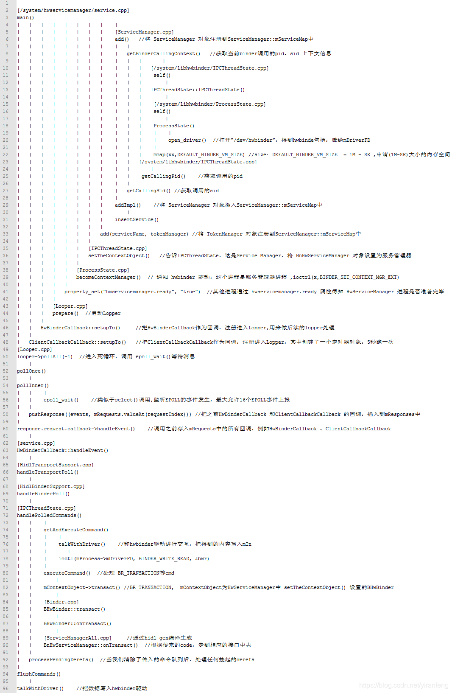
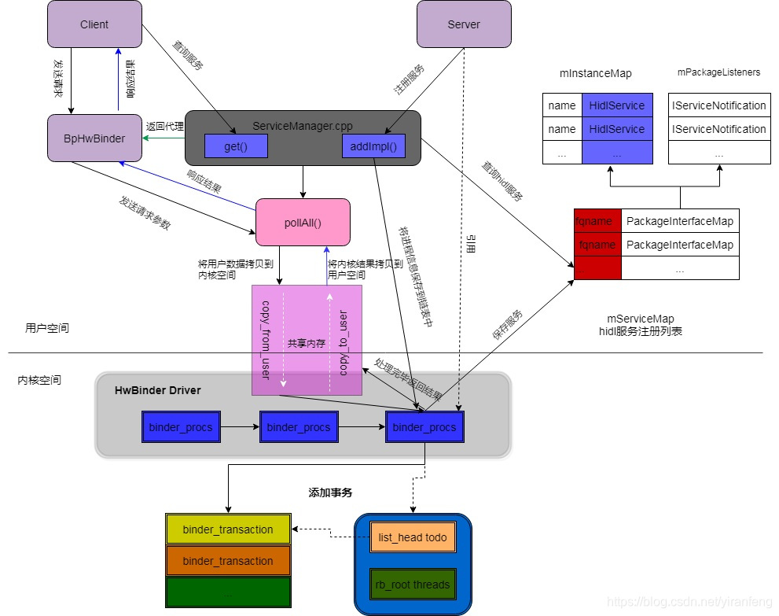
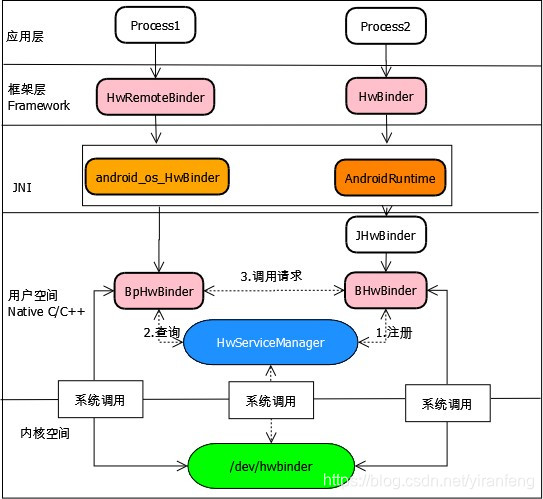
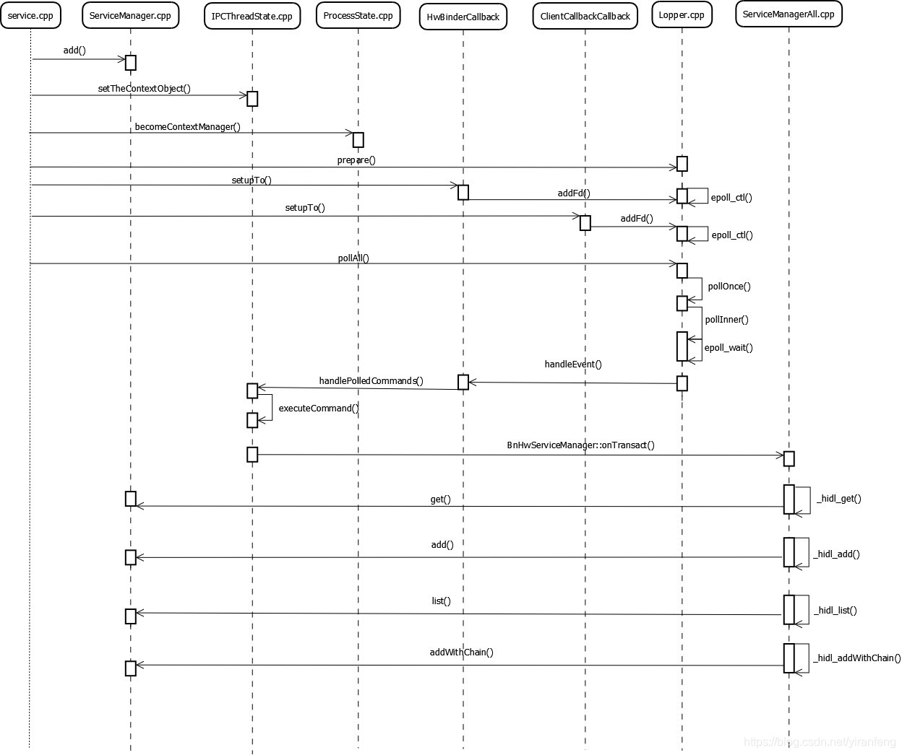
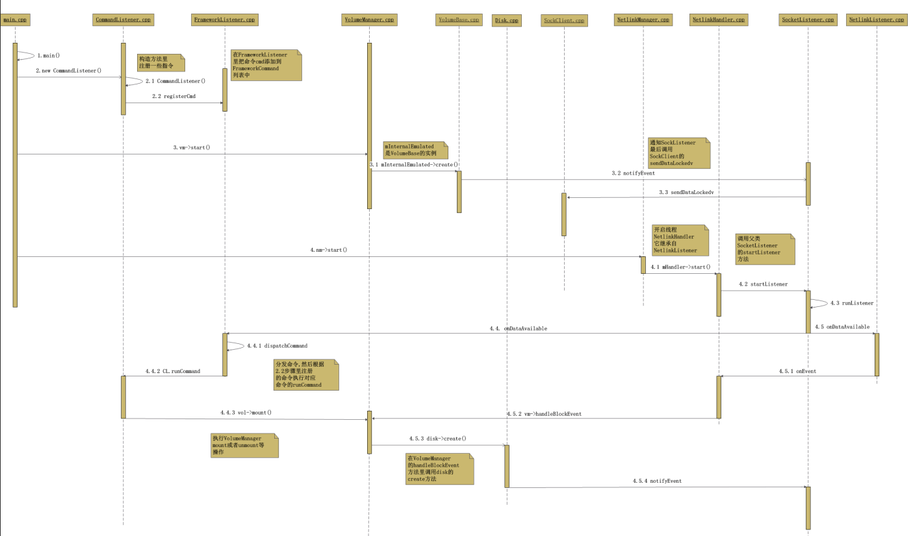

> 接着上篇，init进程启动的SecondStageMain阶段中，最后也是最重要的就是init.rc以及其他各个目录rc的解析和触发，本篇主要针对这块进行详细梳理。

# 1. 概述

**init启动的SecondStageMain阶段中，针对rc的解析和触发的整体流程大致如下：**
1. 解析/init.rc，然后递归地解析它的每个导入(此处递归是import的递归，不是文件夹的递归，文件夹不支持递归);
2. 解析/system/etc/init/目录的内容，按字母顺序排列并按顺序解析，在每个文件解析后递归地进行导入;
3. 步骤2重复/vendor/etc/init
4. 通过action机制触发器执行rc文件，从代码中看执行顺序是："on early-init" -> "on init" -> "on late-init"

***

# 2. init.rc语言格式说明

**整体来说：**
1. init.rc文件是以section为单位组织的，一个section可以包含多行，section可以分为两大类，一类是**action**，另一类是**service**；
2. action以关键字on开始，表示一组命令的集合；service以关键字service开始，表示启动某个进程的方式和参数；
3. section以on或service开始，直到下一个on或者service结束，中间的所有行都属于这一个section（空行或者注释不具有分割作用）
4. 无论是action还是service，并不是按照文件的编排顺序执行的，他们只是一份定义，至于执行与否以及什么时候执行取决于init在运行时的操作

**主要包含五个类型语句：**
1. Action：序列commands的集合，每个actions都有一个trigger，它用于决定action的执行时机，当一个符合action触发条件的事件发生了，此action会加入到执行队列的末尾，除非它已经在队列里
2. Command：actions的命令列表中的命令，或者是service的选项参数命令
3. Service：表示启动某个进程的方式和参数，如果退出了可以由系统重启（可选），可通过start command执行
4. Option：services的修饰项，它们决定一个services何时以及如何运行
5. Import：扩展当前配置。如果path是一个目录，该目录中的每个文件都被解析为一个配置文件。它不是递归的，嵌套的目录将不会被解析

```shell
# --------- action
on <trigger> [&& <trigger>]*    #设置触发器
   <command>                    #动作触发之后要执行的命令
   <command>
   <command>

on early-init                               #Action类型语句
    # Set init and its forked children's oom_adj.
    write /proc/1/oom_score_adj -1000       #Command语句，设置init进程为最高优先级

# --------- service
service <name> <pathname> [ <argument> ]*   # <service的名字><执行程序路径><传递参数
   <option>                                 # option是service的修饰词，影响什么时候，如何启动service
   <option>
   ...
```

**关于触发Trigger：**
Triggers是一个用于匹配某种事件类型的字符串，它将使对应的actions执行。触发器分为事件触发器和属性触发器：（一个操作可以有多个属性触发器）
1. 事件触发器：是由`trigger`命令或init可执行文件中的`QueueEventTrigger()`函数触发的字符串。它们采用简单字符串的形式，如`boot`或`late-init`
2. 属性触发器：是指属性值更改为给定的新值，或指定属性将值更改为任何新值时触发的字符串。它们分别采用`property:=`和`property:=\*`的形式。属性触发器将在init的初始引导阶段额外计算并相应地触发。

```shell
# 表示当trigger early-init或QueueEventTrigger("early-init")调用时触发
on early-init 
    ...

# 表示当sys.boot_from_charger_mode的值通过property_set设置为1时触发 （条件可以是多个，用&&连接）
on property:sys.boot_from_charger_mode=1 
    class_stop charger
    trigger late-init

# *表示任意值触发
on property:sys.init_log_level=*  
    loglevel ${sys.init_log_level}
```

***

# 3. init.rc解析流程

> `system/core/init/init.cpp`的SecondStageMain方法中，首先会按顺序加载init.rc、/system/etc/init的RC文件、/vendor/etc/init的RC文件（其中会包含一些import导入其他RC文件）
> 
> 加载完成后会通过调用QueueEventTrigger事件触发RC文件的执行。总体的顺序是`"on early-init" -> "on init" -> "on late-init"`三个阶段。我们通过init.rc文件逐步顺序解析（其他也有一些比如芯片厂商的RC文件也会包含这三个Action，但是不是主线内容，此处以init.rc分析为主）
> 
> Android系统中RC文件有很多，最主要的是以init.rc，其他通常接触的还有一些service服务会通过rc服务启动。在init.rc中我们需要重点关注的是zygote和servicemanager两个服务的拉起。

## 3.1. import导入RC文件

以system/core/rootdir/init.rc为例，如果有些RC文件不在加载的目录列表中，会通过import方式导入。但是实际执行顺序仍旧按触发器为准。

```r
import /init.environ.rc                             # 导入全局环境变量的相关配置
import /init.usb.rc                                 # 导入usb相关的rc
import /init.${ro.hardware}.rc                      # 导入硬件平台的rc，不同厂商的ro.hardware值不同
import /vendor/etc/init/hw/init.${ro.hardware}.rc   # 导入硬件平台的rc，不同厂商的ro.hardware值不同
import /init.usb.configfs.rc                        # 导入usb相关的rc
import /init.${ro.zygote}.rc                        # 导入zygote的rc，以ro.zygote属性值为准
```

## 3.2. on early-init阶段

这个是init初始化的早期阶段，此处init.rc中主要是一些节点的赋值、创建、权限配置加载等。其中我们关注的是ueventd服务的启动。

```r
# 代码文件：system/core/rootdir/init.rc 
# Cgroups are mounted right before early-init using list from /etc/cgroups.json
on early-init
    # Disable sysrq from keyboard
    write /proc/sys/kernel/sysrq 0
    # Set the security context of /adb_keys if present.
    restorecon /adb_keys
    # Set the security context of /postinstall if present.
    restorecon /postinstall
    mkdir /acct/uid

    # memory.pressure_level used by lmkd
    chown root system /dev/memcg/memory.pressure_level
    chmod 0040 /dev/memcg/memory.pressure_level
    # app mem cgroups, used by activity manager, lmkd and zygote
    mkdir /dev/memcg/apps/ 0755 system system
    # cgroup for system_server and surfaceflinger
    mkdir /dev/memcg/system 0550 system system
    # 启动ueventd服务！！
    start ueventd

    exec_start apexd-bootstrap

service ueventd /system/bin/ueventd
    class core
    critical
    seclabel u:r:ueventd:s0
    shutdown critical
```

***

### 3.2.1. ueventd服务启动

#### 3.2.1.1. ueventd编译配置分析

从编译结果看，uevented是软链接的init：

```shellell
out/target/product/{product}/system/bin$ ls -al|grep init
-rwxr-xr-x  1 usunw074 ubuntu     1173 Jan 23 18:03 fsverity_init
-rwxr-xr-x  1 usunw074 ubuntu   743008 Jun 19 10:05 init
lrwxrwxrwx  1 usunw074 ubuntu        4 Jan 23 18:15 ueventd -> init
```

从代码编译配置看，init进程的Android.bp中，ueventd是Init进程的软连接：

```makefile
cc_binary {
    name: "init_second_stage",
    recovery_available: true,
    stem: "init",
    defaults: ["init_defaults"],
    static_libs: ["libinit"],
    required: [
        "e2fsdroid",
        "mke2fs",
        "sload_f2fs",
        "make_f2fs",
    ],
    srcs: ["main.cpp"],
    #软链接
    symlinks: ["ueventd"],
    target: {
        recovery: {
            cflags: ["-DRECOVERY"],
            exclude_shared_libs: ["libbinder", "libutils"],
        },
    },
    ldflags: ["-Wl,--rpath,/system/${LIB}/bootstrap"],
}
```

***

#### 3.2.1.2. ueventd代码流程

> 接着上面RC触发ueventd服务启动，代码中函数入口是`system/core/init/main.cpp -- main`，入参ueventd
> 
> 接着调用ueventd_main（源码路径：system/core/init/ueventd.cpp）

**主要三个部分：**
1. 解析uevented.rc相关RC文件（/ueventd.rc，/vendor/ueventd.rc，/odm/ueventd.rc，/ueventd.{ro.hardware}.rc这四个相关文件）
2. cold_boot，递归扫描/sys目录，根据uevent文件，fork子进程，静态创建设备节点。
3. Hot Plug，获取内核uevent事件，动态创建设备节点

**PS**：Android根文件系统的镜像中不存在`/dev`目录，该目录是init进程启动后动态创建的。因此，建立Android中设备节点文件的重任，也落在了init进程身上。为此，init进程创建子进程ueventd，并将创建设备节点文件的工作托付给ueventd。

**ueventd通过两种方式创建设备节点文件（冷启动和热启动），用来管理设备，如果有新设备插入，就会在/dev创建对应的设备文件。两种方式：**
1. 第一种方式对应“冷插拔”（Cold Plug），即以预先定义的设备信息为基础，当ueventd启动后，统一创建设备节点文件。这一类设备节点文件也被称为静态节点文件
2. 第二种方式对应“热插拔”（Hot Plug），即在系统运行中，当有设备插入USB端口时，ueventd就会接收到这一事件，为插入的设备动态创建设备节点文件。这一类设备节点文件也被称为动态节点文件

以下是代码梳理，不详细展开详细流程：

```cpp
int ueventd_main(int argc, char** argv) {
    //设置新建文件的默认值,这个与chmod相反,这里相当于新建文件后的权限为666
    umask(000);

    android::base::InitLogging(argv, &android::base::KernelLogger);

    LOG(INFO) << "ueventd started!";

    SelinuxSetupKernelLogging();
    SelabelInitialize();

    std::vector<std::unique_ptr<UeventHandler>> uevent_handlers;

    //获取硬件平台
    auto hardware = android::base::GetProperty("ro.hardware", "");
    //Step 1：加载解析四个相关的ueventd.rc文件
    auto ueventd_configuration = ParseConfig({"/ueventd.rc", "/vendor/ueventd.rc",
                                              "/odm/ueventd.rc", "/ueventd." + hardware + ".rc"});

    uevent_handlers.emplace_back(std::make_unique<DeviceHandler>(
            std::move(ueventd_configuration.dev_permissions),
            std::move(ueventd_configuration.sysfs_permissions),
            std::move(ueventd_configuration.subsystems), android::fs_mgr::GetBootDevices(), true));
    uevent_handlers.emplace_back(std::make_unique<FirmwareHandler>(
            std::move(ueventd_configuration.firmware_directories)));

    if (ueventd_configuration.enable_modalias_handling) {
        uevent_handlers.emplace_back(std::make_unique<ModaliasHandler>());
    }
    UeventListener uevent_listener(ueventd_configuration.uevent_socket_rcvbuf_size);
    //Step 2：递归扫描/sys目录，根据uevent文件，静态创建设备节点
    if (access(COLDBOOT_DONE, F_OK) != 0) {
        ColdBoot cold_boot(uevent_listener, uevent_handlers);
        cold_boot.Run();
    }

    for (auto& uevent_handler : uevent_handlers) {
        uevent_handler->ColdbootDone();
    }

    //wangsl
    setpriority(PRIO_PROCESS, 0, 0);
    //wangsl

    // We use waitpid() in ColdBoot, so we can't ignore SIGCHLD until now.
    signal(SIGCHLD, SIG_IGN);
    // Reap and pending children that exited between the last call to waitpid() and setting SIG_IGN
    // for SIGCHLD above.
    while (waitpid(-1, nullptr, WNOHANG) > 0) {
    }
    //Step 3：获取内核uevent事件，动态创建设备节点
    uevent_listener.Poll([&uevent_handlers](const Uevent& uevent) {
        for (auto& uevent_handler : uevent_handlers) {
            uevent_handler->HandleUevent(uevent);
        }
        return ListenerAction::kContinue;
    });

    return 0;
}

void ColdBoot::Run() {
    android::base::Timer cold_boot_timer;
    // 递归扫/sys目录，对uevent写入add，重新生成uevent
    RegenerateUevents();
    // 对应生成子进程处理每一个uevent（最终调用mknod处理节点）
    ForkSubProcesses();
    // 重新生成selinux context
    DoRestoreCon();
    // 等待子进程处理完成
    WaitForSubProcesses();

    close(open(COLDBOOT_DONE, O_WRONLY | O_CREAT | O_CLOEXEC, 0000));
    LOG(INFO) << "Coldboot took " << cold_boot_timer.duration().count() / 1000.0f << " seconds";
}
```

***

## 3.3. on init阶段

**在init初始化阶段，主要工作有：**
1. 底层一系列进程、cpu、blkio、runtime等的节点创建，并进行cgroup组和读写权限配置、赋予默认值
2. 启动logd服务
3. 启动servicemanager
4. 启动hwservicemanager
5. 启动vndservicemanager

**PS**：
1. 这个阶段我们关注的就是以上四个服务的启动，其中主要的是logd和servicemanager
2. 我们可以通过抓取bootchart查看系统启动时进程的启动时许，从图中我们会看到启动最早的是init、ueventd、logd、servicemanager、hwservicemanager、vndservicemanager这些。

***

**截取主要代码分析：**

```r
on init
    ...
    # 软链接一些节点和目录
    symlink /proc/self/fd/0 /dev/stdin
    symlink /proc/self/fd/1 /dev/stdout
    symlink /proc/self/fd/2 /dev/stderr
    # 将/system的bin和etc软链接到根目录
    symlink /system/bin /bin
    symlink /system/etc /etc
    # Backward compatibility.
    symlink /sys/kernel/debug /d
    # 将/vendor软链接到/system/vendor 
    symlink /system/vendor /vendor

    # Create energy-aware scheduler tuning nodes
    # 创建一些调度节点并赋权限
    mkdir /dev/stune/foreground
    mkdir /dev/stune/background
    mkdir /dev/stune/top-app
    mkdir /dev/stune/rt
    chown system system /dev/stune
    chown system system /dev/stune/foreground
    chmod 0664 /dev/stune/tasks
    chmod 0664 /dev/stune/foreground/tasks
    ......
    # Create blkio group and apply initial settings.
    # This feature needs kernel to support it, and the
    # device's init.rc must actually set the correct values.
    # Block IO Controller（块输入输出子系统）
    # 由存储层级下一些各式各样的IO控制策略叶节点和中间节点组成
    # 基于cgroup的管理结构，用于用户在后台切换IO策略
    # 此处创建节点并赋予权限和默认值
    mkdir /dev/blkio/background
    chown system system /dev/blkio
    chown system system /dev/blkio/background
    chown system system /dev/blkio/tasks
    chown system system /dev/blkio/background/tasks
    chmod 0664 /dev/blkio/tasks
    ......
    # mnt是一个挂载点目录，用于挂载外部存储设备或文件系统
    mkdir /mnt/secure 0700 root root
    mkdir /mnt/secure/asec 0700 root root
    ......
    # Storage views to support runtime permissions
    # 创建运行态的节点和权限赋予
    mkdir /mnt/runtime 0700 root root
    mkdir /mnt/runtime/default 0755 root root
    mkdir /mnt/runtime/default/self 0755 root root
    ......
    # Symlink to keep legacy apps working in multi-user world
    # 软链接保证APP在多用户环境持续运行
    symlink /storage/self/primary /sdcard
    symlink /storage/self/primary /mnt/sdcard
    symlink /mnt/user/0/primary /mnt/runtime/default/self/primary

    write /proc/sys/kernel/panic_on_oops 1
    write /proc/sys/kernel/hung_task_timeout_secs 0
    write /proc/cpu/alignment 4

    # 基本都是一些节点创建、权限赋予，不详细展开
    ......

    # Start logd before any other services run to ensure we capture all of their logs.
    # 在其他服务之前启动，确保捕获所有服务的日志信息
    start logd

    # Start essential services.
    start servicemanager
    start hwservicemanager
    start vndservicemanager
```

***

### 3.3.1. 启动logd服务

> 模块路径：system/core/logd
> 
> logd守护进程是日志系统的管家，内部维持三个日志Socket: `logd、logdr、logdw`来与客户端进行通信。
> 
> 同时负责维护几个环形缓冲区，用于存放系统中的各种日志，缓冲区包含main、system、events、radio、crash、kernel
> 
> 在Android 5.0之前，logd进程并不存在，日志是保留在/dev/log/main、/dev/log/system、/dev/log/radio、/dev/log/event等节点中，但是这样面临的一个问题就是当Android系统大版本升级时，linux kernel需要升级对应的日志驱动，因此在后续的版本中就有了logd进程

log系统大概分三个部分（不管是应用层，还是Native层，读写日志都是通过liblog提供的接口，访问logd的两个socket buffer：logdr、logdw来实现读写）：
1. 上层接口。例如ALOGD、log.d、Slog.d等
2. liblog 
3. logd

```r
# system/core/logd/logd.rc 
service logd /system/bin/logd
    socket logd stream 0666 logd logd
    socket logdr seqpacket 0666 logd logd
    socket logdw dgram+passcred 0222 logd logd
    file /proc/kmsg r
    file /dev/kmsg w
    user logd
    group logd system package_info readproc
    capabilities SYSLOG AUDIT_CONTROL SETGID
    writepid /dev/cpuset/system-background/tasks
```

在设备系统中可以看到三个节点：

```shellell
/dev/socket # ls -al
total 0
drwxr-xr-x  3 root        root         460 2021-12-12 00:00 .
drwxr-xr-x 20 root        root        3840 1970-01-01 03:00 ..
srw-rw-rw-  1 logd        logd           0 1970-01-01 03:00 logd
srw-rw-rw-  1 logd        logd           0 1970-01-01 03:00 logdr
s-w--w--w-  1 logd        logd           0 1970-01-01 03:00 logdw
```

***

### 3.3.2. 启动servicemanager

> 模块路径：frameworks/native/cmds/servicemanager
>
> servicemanager守护进程负责管理系统服务，允许应用程序和系统组件将自己注册为服务

RC文件看到，该服务会一直运行，正常不会退出，否则服务重启会导致一系列其他服务重启，比如zygote、surfaceflinger这些核心服务。

```r
# frameworks/native/cmds/servicemanager/servicemanager.rc
service servicemanager /system/bin/servicemanager
    class core animation
    user system
    group system readproc
    critical
    onrestart restart healthd
    onrestart restart zygote
    onrestart restart audioserver
    onrestart restart media
    onrestart restart surfaceflinger
    onrestart restart inputflinger
    onrestart restart drm
    onrestart restart cameraserver
    onrestart restart keystore
    onrestart restart gatekeeperd
    onrestart restart thermalservice
    writepid /dev/cpuset/system-background/tasks
    shutdown critical
```

**main函数中主要是三个关键函数：**
1. binder_open
2. binder_become_context_manager
3. binder_loop

```cpp
//frameworks/native/cmds/servicemanager/service_manager.c 
int main(int argc, char** argv)
{
    struct binder_state *bs;
    union selinux_callback cb;
    char *driver;

    if (argc > 1) {
        driver = argv[1];
    } else {
        //此时要使用的binder驱动为 "/dev/binder"，同样这个路径也是android设备上的路径
        driver = "/dev/binder";
    }
    //Step 1： 打开底层binder驱动节点，并映射内存块大小为128KB
    bs = binder_open(driver, 128*1024);
    ....
    //Step 2： 将将自己注册成Binder进程的上下文，设置为 Binder “DNS” 管理者
    if (binder_become_context_manager(bs)) {
        ALOGE("cannot become context manager (%s)\n", strerror(errno));
        return -1;
    }
    ....
    //Step 3： 进入循环，等待binder驱动发来消息，传入svcmgr_handler方法作为回调函数
    binder_loop(bs, svcmgr_handler);

    return 0;
}
```

svcmgr_handler方法会接受不同的消息执行不同的处理，其中主要的是两点：
1. SVC_MGR_GET_SERVICE和SVC_MGR_CHECK_SERVICE：收到消息，调用do_find_service找到一个Binder服务
2. SVC_MGR_ADD_SERVICE：收到消息，调用do_add_service添加一个Binder服务

```cpp
int svcmgr_handler(struct binder_state *bs,
                   struct binder_transaction_data_secctx *txn_secctx,
                   struct binder_io *msg,
                   struct binder_io *reply)
{
    struct svcinfo *si;
    uint16_t *s;
    size_t len;
    uint32_t handle;
    uint32_t strict_policy;
    int allow_isolated;
    uint32_t dumpsys_priority;

    struct binder_transaction_data *txn = &txn_secctx->transaction_data;
    if (txn->target.ptr != BINDER_SERVICE_MANAGER)
        return -1;

    if (txn->code == PING_TRANSACTION)
        return 0;
    .....
    switch(txn->code) {
    case SVC_MGR_GET_SERVICE:
    case SVC_MGR_CHECK_SERVICE:
        s = bio_get_string16(msg, &len);
        if (s == NULL) {
            return -1;
        }
        //根据UID、PIDP查询服务
        handle = do_find_service(s, len, txn->sender_euid, txn->sender_pid,
                                 (const char*) txn_secctx->secctx);
        if (!handle)
            break;
        bio_put_ref(reply, handle);
        return 0;

    case SVC_MGR_ADD_SERVICE:
        s = bio_get_string16(msg, &len);
        if (s == NULL) {
            return -1;
        }
        handle = bio_get_ref(msg);
        allow_isolated = bio_get_uint32(msg) ? 1 : 0;
        dumpsys_priority = bio_get_uint32(msg);
        //添加服务
        if (do_add_service(bs, s, len, handle, txn->sender_euid, allow_isolated, dumpsys_priority,
                           txn->sender_pid, (const char*) txn_secctx->secctx))
            return -1;
        break;
    .....
    default:
        ALOGE("unknown code %d\n", txn->code);
        return -1;
    }

    bio_put_uint32(reply, 0);
    return 0;
}
```

***

### 3.3.3. 启动hwservicemanager

> 非HAL进程之间使用binder通信，servicemanager进程会作为它们之间的服务管理者，servicemanager进程在打开binder驱动时使用/dev/binder
>
> 非HAL进程和HAL进程之间使用hwbinder通信（Hardware Binder），hwservicemanager作为它们之间的服务管理者，hwservicemanager进程在打开binder驱动时使用/dev/hwbinder。
> wServiceManager是HAL服务管理中心，负责管理系统中的所有HAL服务，由init进程启动。
> HwServiceManager 的主要工作就是收集各个硬件服务，当有进程需要服务时由HwServiceManager提供特定的硬件服务

RC文件启动服务：

```r
# system/hwservicemanager/hwservicemanager.rc
service hwservicemanager /system/bin/hwservicemanager
    user system
    disabled
    group system readproc
    critical
    onrestart setprop hwservicemanager.ready false
    onrestart class_restart main
    onrestart class_restart hal
    onrestart class_restart early_hal
    writepid /dev/cpuset/system-background/tasks
    class animation
    shutdown critical
```

***

#### 3.3.3.1. 服务启动流程梳理

```cpp
//system/hwservicemanager/service.cpp
int main() {
    // If hwservicemanager crashes, the system may be unstable and hard to debug. This is both why
    // we log this and why we care about this at all.
    setProcessHidlReturnRestriction(HidlReturnRestriction::ERROR_IF_UNCHECKED);
    //Step 1： 创建ServiceManager对象，继承自IServiceManager，采用sp强指针来进行内存自动释放
    sp<ServiceManager> manager = new ServiceManager();
    setRequestingSid(manager, true);
    //Step 1.1: 将ServiceManager对象自身注册到mServiceMap表中
    if (!manager->add(serviceName, manager).withDefault(false)) {
        ALOGE("Failed to register hwservicemanager with itself.");
    }
    //Step 2: 创建TokenManager对象
    sp<TokenManager> tokenManager = new TokenManager();
    //Step 2.1: 将TokenManager对象自身注册到mServiceMap表中
    if (!manager->add(serviceName, tokenManager).withDefault(false)) {
        ALOGE("Failed to register ITokenManager with hwservicemanager.");
    }

    // Tell IPCThreadState we're the service manager
    //Step 3: 通知IPCThreadState，我们是ServiceManager
    //根据ServiceManager找到为Binder对象，得到的Binder对象为BnHwServiceManager
    sp<IBinder> binder = toBinder<IServiceManager>(manager);
    //把binder对象BnHwServiceManager转换为BHwBinder 本地binder对象
    sp<BHwBinder> service = static_cast<BHwBinder*>(binder.get()); // local binder object
    //把服务对象传给IPCThreadState,作为Context Object
    IPCThreadState::self()->setTheContextObject(service);
    // Then tell the kernel
    //Step 4: 通知 binder 驱动，这个进程是服务管理器进程
    ProcessState::self()->becomeContextManager(nullptr, nullptr);
    //设置属性：hwservicemanager.ready为true
    int rc = property_set("hwservicemanager.ready", "true");
    if (rc) {
        ALOGE("Failed to set \"hwservicemanager.ready\" (error %d). "\
              "HAL services will not start!\n", rc);
    }
    //Step 5: 其他进程通过hwservicemanager.ready属性得知HwServiceManager进程是否准备完毕
    sp<Looper> looper = Looper::prepare(0 /* opts */);
    //Step 6: 把HwBinderCallback作为回调，注册进入Lopper,用来做后续的lopper处理
    (void)HwBinderCallback::setupTo(looper);
    //Step 7: 把ClientCallbackCallback作为回调，注册进入Lopper，其中创建了一个定时器对象，5秒跑一次
    (void)ClientCallbackCallback::setupTo(looper, manager);

    ALOGI("hwservicemanager is ready now.");
    //Step 8: 进入死循环，调用 epoll_wait()等待消息
    while (true) {
        looper->pollAll(-1 /* timeoutMillis */);
    }

    return 0;
}
```

***



***

#### 3.3.3.2. HWBinder通信原理



***

#### 3.3.3.3. HWBinder架构



***

#### 3.3.3.4. 序列图



***

### 3.3.4. 启动vndservicemanager

> 该服务同servicemanager，只是binder节点是/dev/vndbinder
>
> vndservicemanager是servicemanager的一个扩展，用于管理供应商特定的服务。通常是供应商（vendor）特定的、定制化的服务，例如硬件厂商提供的驱动程序或服务。

```r
# frameworks/native/cmds/servicemanager/vndservicemanager.rc
service vndservicemanager /vendor/bin/vndservicemanager /dev/vndbinder
    class core
    user system
    group system readproc
    writepid /dev/cpuset/system-background/tasks
    shutdown critical
```

***

## 3.4. on late-init阶段

> 这个阶段的内容比较多，而且还通过trigger触发器先后划分了几个不同阶段的顺序

```shell
# Mount filesystems and start core system services.
on late-init
    # 启动vold服务
    trigger early-fs

    # Mount fstab in init.{$device}.rc by mount_all command. Optional parameter
    # '--early' can be specified to skip entries with 'latemount'.
    # /system and /vendor must be mounted by the end of the fs stage,
    # while /data is optional.
    trigger fs
    trigger post-fs

    # Mount fstab in init.{$device}.rc by mount_all with '--late' parameter
    # to only mount entries with 'latemount'. This is needed if '--early' is
    # specified in the previous mount_all command on the fs stage.
    # With /system mounted and properties form /system + /factory available,
    # some services can be started.
    trigger late-fs

    # Now we can mount /data. File encryption requires keymaster to decrypt
    # /data, which in turn can only be loaded when system properties are present.
    trigger post-fs-data

    # Load persist properties and override properties (if enabled) from /data.
    trigger load_persist_props_action

    # Now we can start zygote for devices with file based encryption
    trigger zygote-start

    # Remove a file to wake up anything waiting for firmware.
    trigger firmware_mounts_complete

    trigger early-boot
    trigger boot
```

**PS：**在这里面提到一个"--early"和"--late"，是表示可以在RC中使用"mount_all /vendor/etc/fstab.${ro.hardware} --early"的方式挂载某些分区，体现一个时序先后，实际暂未使用过。

***

### 3.4.1. on early-fs阶段（vold）

> 该阶段的唯一工作就是启动vold服务`system/vold/vold.rc`，vold（volume deamon）主要负责管理和控制Android平台外部存储设备，包括SD插拨、挂载、卸载、格式化等。

在main方法里,主要做以下几件事情：
1. 初始化VolumeManager ,CommandListener ,NetlinkManager 三个类的实例；
2. 给VolumeManager 和NetlinkManager 设置CommandListener 实例,用作后续监听两个Socket,用得是设计模式中的Command(命令)模式；
3. 启动VolumeManager ,CommandListener ,NetlinkManager；
4. 解析Vold的配置文件fstab。如果vold.fstab解析无误，VolueManager将创建具体的Volume，若vold.fstab解析不存在或者打开失败，Vold将会读取Linux内核中的参数，此时如果参数中存在SDCARD(也就是SD的默认路径)，VolumeManager则会创建AutoVolume，如果不存在这个默认路径那么就不会创建
5. 做一次冷启动

#### 3.4.1.1. vold启动时序图



***

### 3.4.2. on fs阶段

> Android原生这阶段RC文件中未做实际的动作，仅在`system/core/logd/logd.rc`中有一段，是给`/dev/event-log-tags`赋予权限。
> 从Google的注释看在这阶段结束后system和vendor分区会被挂载，但是data分区未完成。这段的实现在`system/core/init/builtins.cpp —— do_mount_all`代码中。

```shell
#system/core/logd/logd.rc
on fs
    write /dev/event-log-tags "# content owned by logd
"
    chown logd logd /dev/event-log-tags
    chmod 0644 /dev/event-log-tags
```

***

### 3.4.3. post-fs阶段

> 该阶段可以对system、vendor等一些分区进行操作（data还未完全可以），例如以下init.rc中是做了一些创建、挂载等操作

```shell
# system/core/rootdir/init.rc 
on post-fs
    exec - system system -- /system/bin/vdc checkpoint markBootAttempt

    # Once everything is setup, no need to modify /.
    # The bind+remount combination allows this to work in containers.
    mount rootfs rootfs / remount bind ro nodev
    # Mount default storage into root namespace
    mount none /mnt/runtime/default /storage bind rec
    mount none none /storage slave rec

    # Make sure /sys/kernel/debug (if present) is labeled properly
    # Note that tracefs may be mounted under debug, so we need to cross filesystems
    restorecon --recursive --cross-filesystems /sys/kernel/debug

    # We chown/chmod /cache again so because mount is run as root + defaults
    chown system cache /cache
    chmod 0770 /cache
    # We restorecon /cache in case the cache partition has been reset.
    restorecon_recursive /cache

    # Create /cache/recovery in case it's not there. It'll also fix the odd
    # permissions if created by the recovery system.
    mkdir /cache/recovery 0770 system cache

    # Backup/restore mechanism uses the cache partition
    mkdir /cache/backup_stage 0700 system system
    mkdir /cache/backup 0700 system system

    #change permissions on vmallocinfo so we can grab it from bugreports
    chown root log /proc/vmallocinfo
    chmod 0440 /proc/vmallocinfo

    chown root log /proc/slabinfo
    chmod 0440 /proc/slabinfo

    #change permissions on kmsg & sysrq-trigger so bugreports can grab kthread stacks
    chown root system /proc/kmsg
    chmod 0440 /proc/kmsg
    chown root system /proc/sysrq-trigger
    chmod 0220 /proc/sysrq-trigger
    chown system log /proc/last_kmsg
    chmod 0440 /proc/last_kmsg

    # make the selinux kernel policy world-readable
    chmod 0444 /sys/fs/selinux/policy

    # create the lost+found directories, so as to enforce our permissions
    mkdir /cache/lost+found 0770 root root

    restorecon_recursive /metadata
    mkdir /metadata/vold
    chmod 0700 /metadata/vold
    mkdir /metadata/password_slots 0771 root system

    mkdir /metadata/apex 0700 root system
    mkdir /metadata/apex/sessions 0700 root system
```

***

### 3.4.4. on late-fs阶段

> 这里主要是启动rc文件中class标注的是"early_hal"的HAL服务。

```shell
# system/core/rootdir/init.rc 
on late-fs
    # Ensure that tracefs has the correct permissions.
    # This does not work correctly if it is called in post-fs.
    chmod 0755 /sys/kernel/debug/tracing

    # HALs required before storage encryption can get unlocked (FBE/FDE)
    class_start early_hal

# hardware/interfaces/keymaster/3.0/default/android.hardware.keymaster@3.0-service.rc
service vendor.keymaster-3-0 /vendor/bin/hw/android.hardware.keymaster@3.0-service
    class early_hal
    user nobody
    group drmrpc
```

***

### 3.4.5. on post-fs-data阶段

> 此阶段主要是data分区的配置，此外我们客制化的分区也可以在此阶段进行权限赋予、创建文件等操作。

```shell
# system/core/rootdir/init.rc 
on post-fs-data
    mark_post_data

    # Start checkpoint before we touch data
    start vold
    exec - system system -- /system/bin/vdc checkpoint prepareCheckpoint

    # We chown/chmod /data again so because mount is run as root + defaults
    chown system system /data
    chmod 0771 /data

    # We restorecon /data in case the userdata partition has been reset.
    restorecon /data

    # Make sure we have the device encryption key.
    installkey /data

    # Start bootcharting as soon as possible after the data partition is
    # mounted to collect more data.
    mkdir /data/bootchart 0755 shell shell
    bootchart start

    # Load fsverity keys. This needs to happen before apexd, as post-install of
    # APEXes may rely on keys.
    exec -- /system/bin/fsverity_init

    # Make sure that apexd is started in the default namespace
    enter_default_mount_ns

    # /data/apex is now available. Start apexd to scan and activate APEXes.
    mkdir /data/apex 0750 root system
    mkdir /data/apex/active 0750 root system
    mkdir /data/apex/backup 0700 root system
    mkdir /data/apex/sessions 0700 root system
    mkdir /data/app-staging 0750 system system
    start apexd

    # Avoid predictable entropy pool. Carry over entropy from previous boot.
    copy /data/system/entropy.dat /dev/urandom

    # create basic filesystem structure
    mkdir /data/misc 01771 system misc
    mkdir /data/misc/recovery 0770 system log
    copy /data/misc/recovery/ro.build.fingerprint /data/misc/recovery/ro.build.fingerprint.1
    ......
```

***

### 3.4.6. on load_persist_props_action阶段

> 未做实际操作，暂不关注

***

### 3.4.7. on zygote-start阶段

> 此阶段主要是启动netd，zygote，zygote_secondary服务
> 
> PS：ro.crypto.state属性值参考[Android加密之全盘加密](https://blog.csdn.net/shift_wwx/article/details/78550380)， 在车载项目未使用到，一般值是unsupported

```shell
# system/core/rootdir/init.rc 
# ro.crypto.state属性值是在文件挂载的时候赋值（Android设置是否加密）
# It is recommended to put unnecessary data/ initialization from post-fs-data
# to start-zygote in device's init.rc to unblock zygote start.
on zygote-start && property:ro.crypto.state=unencrypted
    # A/B update verifier that marks a successful boot.
    exec_start update_verifier_nonencrypted
    start netd
    start zygote
    start zygote_secondary

on zygote-start && property:ro.crypto.state=unsupported
    # A/B update verifier that marks a successful boot.
    exec_start update_verifier_nonencrypted
    start netd
    start zygote
    start zygote_secondary

on zygote-start && property:ro.crypto.state=encrypted && property:ro.crypto.type=file
    # A/B update verifier that marks a successful boot.
    exec_start update_verifier_nonencrypted
    start netd
    start zygote
    start zygote_secondary

# 非加密情况会启动class标注两个main和late_start的服务
on nonencrypted
    class_start main
    class_start late_start
```

***

#### 3.4.7.1. netd服务

> ‌Netd（Network Daemon）是Android系统中负责网络管理和控制的后台daemon程序‌。其主要功能包括设置防火墙、网络地址转换（NAT）、带宽控制、无线网卡软接入点控制、网络设备绑定、DNS信息缓存和管理以及网络服务搜索（NSD）等功能‌

```shell
# system/netd/server/netd.rc 
service netd /system/bin/netd
    class main
    socket dnsproxyd stream 0660 root inet
    socket mdns stream 0660 root system
    socket fwmarkd stream 0660 root inet
    onrestart restart zygote
    onrestart restart zygote_secondary
    # b/121354779: netd itself is not updatable, but on startup it dlopen()s the resolver library
    # from the DNS resolver APEX. Mark it as updatable so init won't start it until all APEX
    # packages are ready.
    updatable
```

***

#### 3.4.7.2. zygote和zygote_secondary服务

> 在init.rc中会导入zygote的rc文件`import /init.${ro.zygote}.rc`，根据ro.zygote属性值，比如Android 10上值是zygote64_32，即启动`system/core/rootdir/init.zygote64_32.rc`（主要64位，次要32位）

```shell
$ ps -A|grep zygote
root          2483     1 3177712 137916 0                   0 S zygote64
root          2484     1 1610124  93784 0                   0 S zygote
```

启动两个zygote服务：

```shell
# ###### system/core/rootdir/init.zygote64_32.rc
# zygote：service的名称，注意这里并非是进程名称，而是init进程内部标识service的name
# /system/bin/app_process6：可执行文件的路径
# -Xzygote：是传递给虚拟机的参数，告诉虚拟机是否已zygote模式启动。这里实际影响的是虚拟机启动时是否加载boot.art内存映射文件，即预加载常用的系统类
# --zygote：app_process64内部有两种启动模式，--zygote指定启动类为com.android.internal.os.ZygoteInit。另一种则启动com.android.internal.os.RuntimeInit。
# --start-system-server：指明启动system server
# --socket-name：指定作为客户端要连接的服务端zygote名称。首先zygote service在启动时，先根据下面option的声明`socket zygote stream 660 root system`创建一个服务端的socket，名称为zygote。随后再启动作为zygote的app_process64进程。启动进程的过程中，会根据--socket-name参数指定的名称，创建socket客户端去连接服务端。zygote是app进程的孵化器，被孵化的子进程将继承这个客户端的socket，与服务端通信。
service zygote /system/bin/app_process64 -Xzygote /system/bin --zygote --start-system-server --socket-name=zygote
    # // 指定class为main。可通过class_start main来启动所有class为main的service
    class main
    # 优先级
    priority -20
    user root
    group root readproc reserved_disk
    socket zygote stream 660 root system
    socket usap_pool_primary stream 660 root system
    onrestart write /sys/android_power/request_state wake
    onrestart write /sys/power/state on
    onrestart restart audioserver
    onrestart restart cameraserver
    onrestart restart media
    onrestart restart netd
    onrestart restart wificond
    writepid /dev/cpuset/foreground/tasks

service zygote_secondary /system/bin/app_process32 -Xzygote /system/bin --zygote --socket-name=zygote_secondary --enable-lazy-preload
    class main
    priority -20
    user root
    group root readproc reserved_disk
    socket zygote_secondary stream 660 root system
    socket usap_pool_secondary stream 660 root system
    onrestart restart zygote
    writepid /dev/cpuset/foreground/tasks
```

**PS：**关于zygote和system_server的启动会单独展开，主要入口是在`frameworks/base/cmds/app_process/app_main.cpp`， 入口为main函数

```makefile
# frameworks/base/cmds/app_process/Android.mk 
LOCAL_MODULE:= app_process
LOCAL_MULTILIB := both
LOCAL_MODULE_STEM_32 := app_process32
LOCAL_MODULE_STEM_64 := app_process64
```

```shell
/system/bin # ls -l app_*
lrwxr-xr-x 1 root shell    13 2009-01-01 03:00 app_process -> app_process64
-rwxr-xr-x 1 root shell 25088 2009-01-01 03:00 app_process32
-rwxr-xr-x 1 root shell 33424 2009-01-01 03:00 app_process64
```

***

### 3.4.8. on firmware_mounts_complete阶段

> 未做实际操作，暂不关注

```shell
# system/core/rootdir/init.rc 
# Indicate to fw loaders that the relevant mounts are up.
on firmware_mounts_complete
    rm /dev/.booting
```

***

### 3.4.9. on early-boot阶段

>Android原生未做实际操作，暂不关注

***

### 3.4.10. on boot阶段

> 前面阶段启动的服务的一些节点值赋值、权限赋予等操作。最主要的是后面两个启动class标注"hal"和"core"的服务

```shell
on boot
    # basic network init
    ifup lo
    hostname localhost
    domainname localdomain

    # IPsec SA default expiration length
    write /proc/sys/net/core/xfrm_acq_expires 3600

    # Memory management.  Basic kernel parameters, and allow the high
    # level system server to be able to adjust the kernel OOM driver
    # parameters to match how it is managing things.
    write /proc/sys/vm/overcommit_memory 1
    write /proc/sys/vm/min_free_order_shift 4
    chown root system /sys/module/lowmemorykiller/parameters/adj
    chmod 0664 /sys/module/lowmemorykiller/parameters/adj
    chown root system /sys/module/lowmemorykiller/parameters/minfree
    chmod 0664 /sys/module/lowmemorykiller/parameters/minfree

    # System server manages zram writeback
    chown root system /sys/block/zram0/idle
    chmod 0664 /sys/block/zram0/idle
    chown root system /sys/block/zram0/writeback
    chmod 0664 /sys/block/zram0/writeback

    # Tweak background writeout
    write /proc/sys/vm/dirty_expire_centisecs 200
    write /proc/sys/vm/dirty_background_ratio  5
    .....
    # Define default initial receive window size in segments.
    setprop net.tcp.default_init_rwnd 60

    # Start standard binderized HAL daemons
    class_start hal

    class_start core
```

***


***

# 4. 参考

+ [Android 9 (P)之init进程启动源码分析指南之三](https://blog.csdn.net/tkwxty/article/details/106339987)
+ [Android init 启动进程分析](https://blog.csdn.net/u010783226/article/details/119810208)
+ [Android RC文件分析](https://wizzie.top/android/android_rcFile_study/)
+ [Android启动过程 - init.rc处理过程](https://blog.csdn.net/temp7695/article/details/135542202)
+ [Android13 系统启动流程-3 init.rc解析](https://www.jianshu.com/p/446682d2c482)
+ [AndroidP之Ueventd](https://www.jianshu.com/p/8a34ba82ac1f)
+ [blkio cgroup](https://zhuanlan.zhihu.com/p/410053058)
+ [Android 日志系统分析(二)：logd](https://www.jianshu.com/p/1ad03018b5ea)
+ [Android 日志系统--02：logd、logcat架构分析](https://www.jianshu.com/p/2cb7c12d31e2)
+ [Android中 logd 详解](https://blog.csdn.net/shift_wwx/article/details/89138117)
+ [一文总结Android系统服务大管家-ServiceManager](https://blog.csdn.net/iriczhao/article/details/137523677)
+ [android系统启动流程- ServiceManager进程启动流程](https://www.cnblogs.com/linhaostudy/p/18301854)
+ [总结Android系统服务大管家-ServiceManager](https://blog.csdn.net/iriczhao/article/details/137523677)
+ [Native 层 Binder 机制分析 ](https://blog.csdn.net/shulianghan/article/details/120345228)
+ [Android ServiceManager和它的兄弟们](https://blog.csdn.net/niurenwo/article/details/139588887)
+ [Android10.0 HwBinder通信原理](https://blog.csdn.net/liujun3512159/article/details/122355244)
+ [Android加密之全盘加密](https://blog.csdn.net/shift_wwx/article/details/78550380)
+ [Android启动过程 - Zygote](https://blog.csdn.net/temp7695/article/details/135856437)
